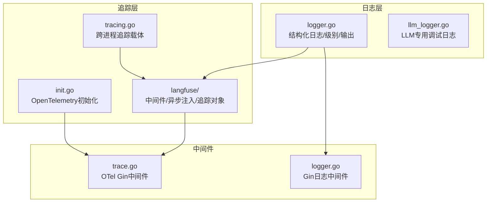
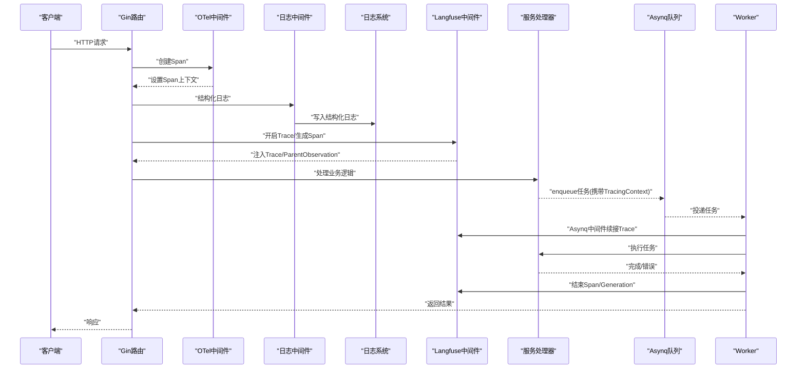
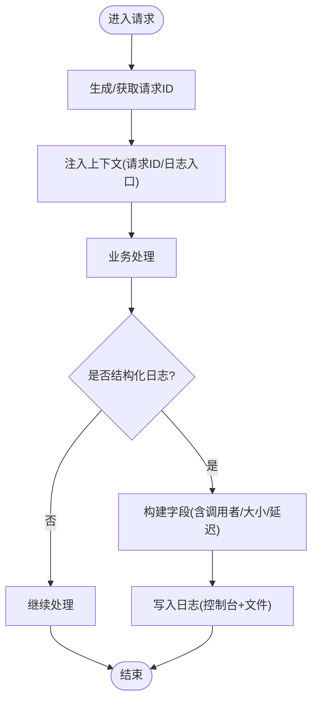
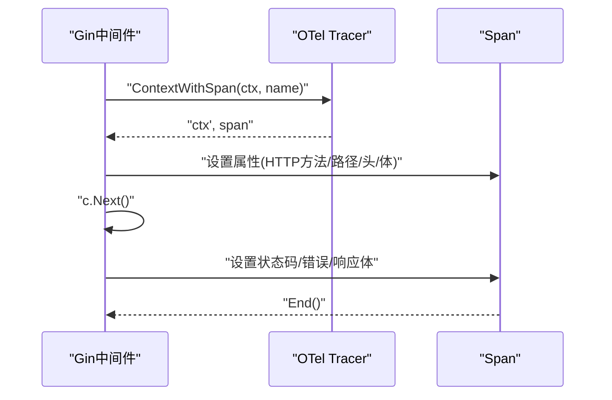
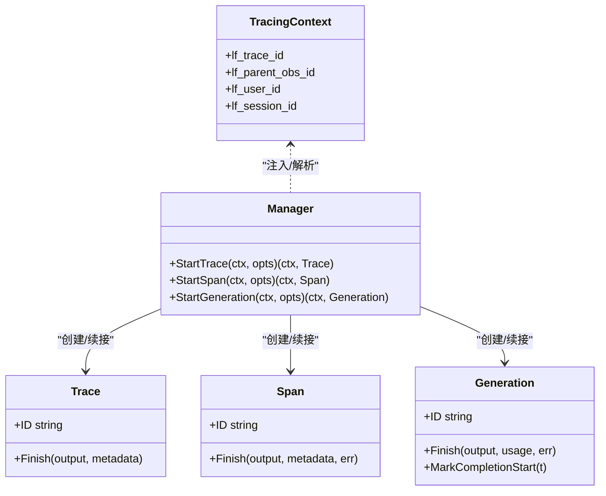
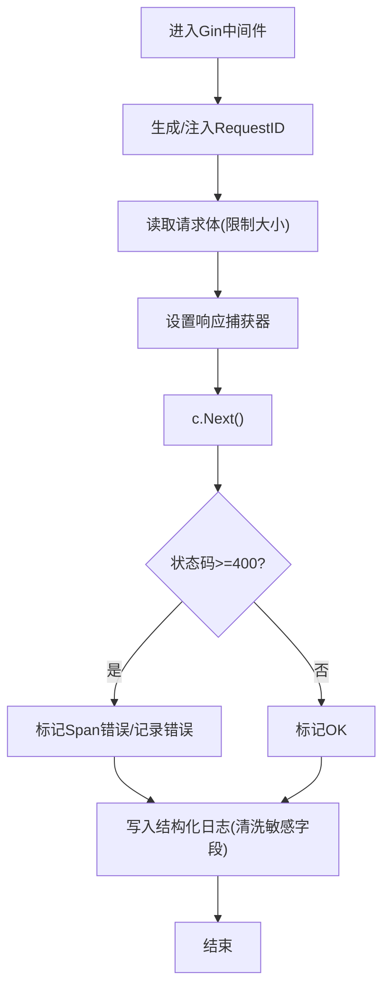
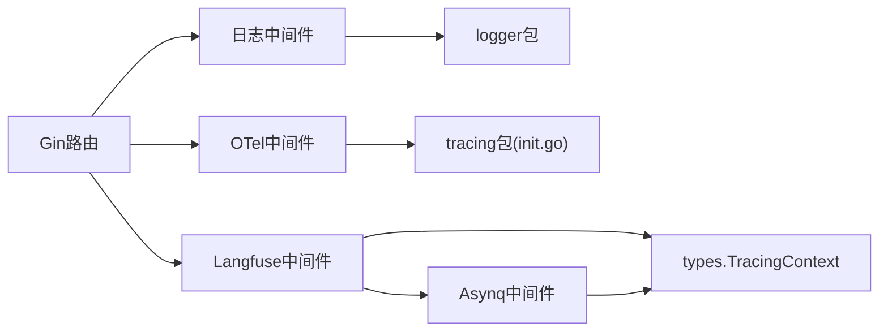

# 监控与追踪

<cite>
**本文引用的文件**
- [logger.go](file://internal/logger/logger.go)
- [llm_logger.go](file://internal/logger/llm_logger.go)
- [init.go](file://internal/tracing/init.go)
- [middleware.go](file://internal/tracing/langfuse/middleware.go)
- [asynq.go](file://internal/tracing/langfuse/asynq.go)
- [tracer.go](file://internal/tracing/langfuse/tracer.go)
- [tracing.go](file://internal/types/tracing.go)
- [trace.go](file://internal/middleware/trace.go)
- [logger.go](file://internal/middleware/logger.go)
- [Langfuse集成.md](file://docs/Langfuse集成.md)
</cite>

## 目录
1. [简介](#简介)
2. [项目结构](#项目结构)
3. [核心组件](#核心组件)
4. [架构总览](#架构总览)
5. [组件详解](#组件详解)
6. [依赖关系分析](#依赖关系分析)
7. [性能考量](#性能考量)
8. [故障排查指南](#故障排查指南)
9. [结论](#结论)
10. [附录](#附录)

## 简介
本文件为 WeKnora 监控与追踪体系的技术文档，聚焦以下目标：
- 日志系统：结构化日志、日志级别管理、请求级关联与落盘轮转。
- 链路追踪：OpenTelemetry 集成、Langfuse 追踪、异步任务追踪与注入。
- 监控指标与告警：指标定义、采集与可视化建议。
- 性能分析与优化：调用链分析、吞吐与延迟优化策略。
- 故障诊断：日志分析、链路回溯、错误定位方法。

## 项目结构
WeKnora 的监控与追踪由“日志层”“追踪层”“指标与告警”三部分组成：
- 日志层：基于 logrus 的结构化日志，支持环境变量控制级别、输出到文件与标准输出、彩色终端输出、调用者信息、请求级字段注入。
- 追踪层：OpenTelemetry（OTLP 导出至 Jaeger/Zipkin 或 stdout）、Langfuse（轻量客户端，无 SDK 依赖，支持采样、批量上报、异步队列）。
- 指标与告警：结合链路追踪与日志，定义关键指标并建议告警阈值与规则。

**图表来源**
- [logger.go:1-414](file://internal/logger/logger.go#L1-L414)
- [llm_logger.go:1-248](file://internal/logger/llm_logger.go#L1-L248)
- [init.go:1-106](file://internal/tracing/init.go#L1-L106)
- [middleware.go:1-154](file://internal/tracing/langfuse/middleware.go#L1-L154)
- [asynq.go:1-210](file://internal/tracing/langfuse/asynq.go#L1-L210)
- [tracer.go:1-335](file://internal/tracing/langfuse/tracer.go#L1-L335)
- [tracing.go:1-61](file://internal/types/tracing.go#L1-L61)
- [trace.go:1-118](file://internal/middleware/trace.go#L1-L118)
- [logger.go:1-236](file://internal/middleware/logger.go#L1-L236)

**章节来源**
- [logger.go:1-414](file://internal/logger/logger.go#L1-L414)
- [llm_logger.go:1-248](file://internal/logger/llm_logger.go#L1-L248)
- [init.go:1-106](file://internal/tracing/init.go#L1-L106)
- [middleware.go:1-154](file://internal/tracing/langfuse/middleware.go#L1-L154)
- [asynq.go:1-210](file://internal/tracing/langfuse/asynq.go#L1-L210)
- [tracer.go:1-335](file://internal/tracing/langfuse/tracer.go#L1-L335)
- [tracing.go:1-61](file://internal/types/tracing.go#L1-L61)
- [trace.go:1-118](file://internal/middleware/trace.go#L1-L118)
- [logger.go:1-236](file://internal/middleware/logger.go#L1-L236)

## 核心组件
- 结构化日志与级别管理
  - 支持 debug/info/warn/error/fatal 级别，环境变量动态生效。
  - 彩色输出（非终端自动降级），字段按字母序输出，request_id 优先。
  - 调用者信息（文件:行[函数]），便于快速定位。
  - 日志落盘：lumberjack 轮转，支持 Mac 应用默认日志路径。
- LLM 专用调试日志
  - 可通过环境变量启用，按请求 ID 分割文件，保留消息、工具调用、错误等片段。
- OpenTelemetry 追踪
  - 通过环境变量 OTEL_EXPORTER_OTLP_ENDPOINT 自动选择 OTLP gRPC 导出或 stdout。
  - 全局 TextMapPropagator，支持 TraceContext/Baggage。
- Langfuse 追踪
  - 轻量客户端，支持 Trace/Span/Generation 三类观测对象，采样与批量上报。
  - Gin 中间件白名单路径追踪；Asynq 中间件注入上游 trace/span ID 并在 worker 侧续接。
  - 跨进程载体 TracingContext，JSON 字段带前缀 lf_，兼容旧负载。
- Gin 中间件
  - OTel 中间件：记录请求/响应元数据、错误标记。
  - 日志中间件：请求 ID、路径、状态码、延迟、请求/响应体（敏感字段清洗）。

**章节来源**
- [logger.go:28-245](file://internal/logger/logger.go#L28-L245)
- [llm_logger.go:23-160](file://internal/logger/llm_logger.go#L23-L160)
- [init.go:32-106](file://internal/tracing/init.go#L32-L106)
- [tracer.go:8-68](file://internal/tracing/langfuse/tracer.go#L8-L68)
- [middleware.go:12-58](file://internal/tracing/langfuse/middleware.go#L12-L58)
- [asynq.go:60-152](file://internal/tracing/langfuse/asynq.go#L60-L152)
- [tracing.go:20-61](file://internal/types/tracing.go#L20-L61)
- [trace.go:28-118](file://internal/middleware/trace.go#L28-L118)
- [logger.go:140-236](file://internal/middleware/logger.go#L140-L236)

## 架构总览
WeKnora 的监控与追踪采用“双轨并行”：
- 日志：贯穿请求生命周期，结构化字段统一、可落盘、可过滤。
- 追踪：HTTP 请求到异步任务的端到端链路，Langfuse 展示树形结构，OTel 提供标准化导出。

**图表来源**
- [trace.go:28-118](file://internal/middleware/trace.go#L28-L118)
- [logger.go:140-236](file://internal/middleware/logger.go#L140-L236)
- [middleware.go:12-58](file://internal/tracing/langfuse/middleware.go#L12-L58)
- [asynq.go:60-152](file://internal/tracing/langfuse/asynq.go#L60-L152)
- [tracer.go:70-132](file://internal/tracing/langfuse/tracer.go#L70-L132)

## 组件详解

### 日志系统
- 结构化字段
  - request_id 优先显示，其余字段按字母序拼接，便于 grep 与可视化过滤。
  - 错误字段高亮，调用者字段包含文件、行号与函数名。
- 级别与输出
  - 通过环境变量 LOG_LEVEL 控制级别；LOG_PATH 指定文件路径，lumberjack 自动轮转。
  - 非终端输出自动去色，避免日志聚合异常。
- 请求级上下文
  - RequestID 中间件生成并注入上下文，日志中间件读取并写入字段。
  - CloneContext 保持日志、租户、用户、会话、Langfuse追踪上下文跨边界传递。
- LLM 专用调试日志
  - LLM_DEBUG_LOG 开关，按请求 ID 写入独立文件，包含消息、工具调用、错误等片段。
  - 自动清理超期文件，避免磁盘膨胀。

**图表来源**
- [logger.go:186-224](file://internal/logger/logger.go#L186-L224)
- [logger.go:309-324](file://internal/logger/logger.go#L309-L324)
- [logger.go:387-413](file://internal/logger/logger.go#L387-L413)
- [logger.go:108-138](file://internal/middleware/logger.go#L108-L138)
- [logger.go:140-236](file://internal/middleware/logger.go#L140-L236)
- [llm_logger.go:88-111](file://internal/logger/llm_logger.go#L88-L111)

**章节来源**
- [logger.go:28-245](file://internal/logger/logger.go#L28-L245)
- [logger.go:292-324](file://internal/logger/logger.go#L292-L324)
- [logger.go:387-413](file://internal/logger/logger.go#L387-L413)
- [logger.go:108-138](file://internal/middleware/logger.go#L108-L138)
- [logger.go:140-236](file://internal/middleware/logger.go#L140-L236)
- [llm_logger.go:23-160](file://internal/logger/llm_logger.go#L23-L160)
- [llm_logger.go:88-160](file://internal/logger/llm_logger.go#L88-L160)

### OpenTelemetry 集成
- 初始化
  - 通过环境变量 OTEL_EXPORTER_OTLP_ENDPOINT 判断是否启用 OTLP 导出（gRPC），否则回退到 stdout。
  - 设置全局 TracerProvider、Sampler、BatchSpanProcessor、Propagator。
- Gin 中间件
  - 为每个请求创建 Span，记录方法、URL、路径、查询参数、响应状态码、响应体与头部（敏感字段过滤）。
  - 将错误与 4xx/5xx 映射为 Span 状态 Error。

**图表来源**
- [init.go:32-106](file://internal/tracing/init.go#L32-L106)
- [trace.go:28-118](file://internal/middleware/trace.go#L28-L118)

**章节来源**
- [init.go:32-106](file://internal/tracing/init.go#L32-L106)
- [trace.go:28-118](file://internal/middleware/trace.go#L28-L118)

### Langfuse 追踪与注入
- 观测对象
  - Trace：根级观察，通常对应一次请求（如一次聊天回合）。
  - Span：非模型调用的逻辑单元（如 asynq 任务执行、流水线阶段）。
  - Generation：单次模型调用（LLM/Embedding/VLM/ASR）。
- 配置与采样
  - 通过环境变量启用，支持 FlushAt/FlushInterval/QueueSize/RequestTimeout/Release/Environment/SampleRate/Debug。
  - 采样率控制事件发送比例，避免过载。
- Gin 中间件
  - 白名单路径追踪（在线推理、入库、批处理、诊断、wiki 等），自动附加 http.method/path/query/request_id 等元数据。
  - 结束时写入状态码、响应大小。
- Asynq 中间件
  - 从任务负载解析 TracingContext，恢复上游 Trace 或自建独立 Trace。
  - 为任务执行开 Span，自动注入任务元数据（类型、队列、重试次数、负载大小）。
  - 结束时根据错误标记 Span 级别。
- 跨进程载体
  - TracingContext 包含 lf_trace_id、lf_parent_obs_id、lf_user_id、lf_session_id，JSON 字段 omitempty 兼容旧负载。

**图表来源**
- [tracer.go:70-132](file://internal/tracing/langfuse/tracer.go#L70-L132)
- [tracer.go:154-231](file://internal/tracing/langfuse/tracer.go#L154-L231)
- [tracer.go:233-314](file://internal/tracing/langfuse/tracer.go#L233-L314)
- [tracing.go:20-61](file://internal/types/tracing.go#L20-L61)

**章节来源**
- [middleware.go:12-58](file://internal/tracing/langfuse/middleware.go#L12-L58)
- [middleware.go:60-133](file://internal/tracing/langfuse/middleware.go#L60-L133)
- [asynq.go:12-78](file://internal/tracing/langfuse/asynq.go#L12-L78)
- [asynq.go:80-152](file://internal/tracing/langfuse/asynq.go#L80-L152)
- [asynq.go:154-210](file://internal/tracing/langfuse/asynq.go#L154-L210)
- [tracer.go:8-68](file://internal/tracing/langfuse/tracer.go#L8-L68)
- [tracer.go:70-132](file://internal/tracing/langfuse/tracer.go#L70-L132)
- [tracer.go:154-231](file://internal/tracing/langfuse/tracer.go#L154-L231)
- [tracer.go:233-314](file://internal/tracing/langfuse/tracer.go#L233-L314)
- [tracing.go:20-61](file://internal/types/tracing.go#L20-L61)

### Gin 中间件：日志与追踪
- 日志中间件
  - 生成/注入 X-Request-ID，写入结构化日志字段（方法、路径、状态码、大小、延迟、客户端 IP、请求/响应体）。
  - 对 JSON/文本类型进行敏感字段清洗，对 SSE 流式响应跳过响应体记录。
- OTel 中间件
  - 记录请求/响应元数据，错误映射为 Span 状态，便于统一导出与告警。

**图表来源**
- [logger.go:140-236](file://internal/middleware/logger.go#L140-L236)
- [trace.go:28-118](file://internal/middleware/trace.go#L28-L118)

**章节来源**
- [logger.go:140-236](file://internal/middleware/logger.go#L140-L236)
- [trace.go:28-118](file://internal/middleware/trace.go#L28-L118)

## 依赖关系分析
- 组件耦合
  - 日志中间件依赖 logger 包；OTel 中间件依赖 tracing 包；Langfuse 中间件依赖 types.TracingContext。
  - Asynq 中间件通过 types.LangfuseTracingCarrier 接口注入/解析追踪上下文，避免直接依赖 langfuse 包。
- 关键依赖链
  - Gin 路由 → OTel 中间件 → 日志中间件 → 业务处理 → Langfuse 中间件 → 服务/异步任务。
- 外部依赖
  - OTel 导出器：OTLP gRPC 或 stdout；Langfuse：HTTP 批量上报；日志：lumberjack 文件轮转。

**图表来源**
- [trace.go:28-118](file://internal/middleware/trace.go#L28-L118)
- [logger.go:140-236](file://internal/middleware/logger.go#L140-L236)
- [logger.go:186-224](file://internal/logger/logger.go#L186-L224)
- [init.go:32-106](file://internal/tracing/init.go#L32-L106)
- [middleware.go:12-58](file://internal/tracing/langfuse/middleware.go#L12-L58)
- [asynq.go:60-152](file://internal/tracing/langfuse/asynq.go#L60-L152)
- [tracing.go:20-61](file://internal/types/tracing.go#L20-L61)

**章节来源**
- [trace.go:28-118](file://internal/middleware/trace.go#L28-L118)
- [logger.go:140-236](file://internal/middleware/logger.go#L140-L236)
- [logger.go:186-224](file://internal/logger/logger.go#L186-L224)
- [init.go:32-106](file://internal/tracing/init.go#L32-L106)
- [middleware.go:12-58](file://internal/tracing/langfuse/middleware.go#L12-L58)
- [asynq.go:60-152](file://internal/tracing/langfuse/asynq.go#L60-L152)
- [tracing.go:20-61](file://internal/types/tracing.go#L20-L61)

## 性能考量
- 日志性能
  - 结构化字段排序输出，避免频繁分配；非终端自动去色，减少字符转义开销。
  - lumberjack 轮转控制大小与保留天数，避免 IO 抖动。
- 追踪性能
  - Langfuse 采样率与批量刷新间隔可控，避免高频上报造成抖动。
  - Gin 中间件仅对白名单路径追踪，减少噪音与开销。
  - Asynq 中间件仅记录关键元数据，payload 预览长度限制，避免大对象传输。
- OTel 性能
  - BatchSpanProcessor 批量导出，降低网络与 CPU 开销；OTLP gRPC 更适合远端 Jaeger/Zipkin。

[本节为通用性能建议，无需特定文件引用]

## 故障排查指南
- 日志分析
  - 使用 request_id 快速关联一次请求的完整日志轨迹；关注错误字段与调用者信息定位问题。
  - LLM 调试日志按请求拆分，便于复盘模型输入/输出与工具调用。
- 追踪回溯
  - 在 Langfuse UI 查看 Trace 树：HTTP Trace → HTTP Span → Asynq Span → Generation。
  - 若出现孤儿任务，检查 Asynq 中间件是否正确解析 TracingContext。
- 错误定位
  - OTel 中间件将 4xx/5xx 映射为错误状态，结合 Gin 错误栈快速定位。
  - 日志中间件对敏感字段清洗，避免泄露；若需查看原始内容，可在测试环境临时放宽。

**章节来源**
- [logger.go:366-375](file://internal/logger/logger.go#L366-L375)
- [llm_logger.go:88-111](file://internal/logger/llm_logger.go#L88-L111)
- [middleware.go:60-133](file://internal/tracing/langfuse/middleware.go#L60-L133)
- [asynq.go:80-152](file://internal/tracing/langfuse/asynq.go#L80-L152)
- [trace.go:107-116](file://internal/middleware/trace.go#L107-L116)

## 结论
WeKnora 的监控与追踪体系以“结构化日志 + 双轨追踪（OTel + Langfuse）”为核心，既满足可观测性需求，又兼顾性能与可维护性。通过白名单追踪、采样与批量上报、跨进程载体注入等机制，实现了从 HTTP 到异步任务的端到端链路可视与可度量。

[本节为总结，无需特定文件引用]

## 附录

### 监控指标与告警建议
- 指标定义
  - 延迟：p50/p90/p99 响应时间（OTel Span 属性）。
  - 吞吐：每秒请求数（QPS），按路径/状态码分桶。
  - 错误率：HTTP 4xx/5xx 比例，Langfuse Generation 错误计数。
  - 资源：CPU/内存/IO（系统指标），Langfuse 采样率与队列长度。
- 告警规则
  - 延迟突增：p99 超过阈值持续 N 分钟。
  - 错误率：连续窗口内错误率超过阈值。
  - 资源：CPU/内存使用率持续高位。
  - 追踪：Langfuse 批量上报失败次数/队列积压。

[本节为通用建议，无需特定文件引用]

### 使用与配置要点
- 日志
  - LOG_LEVEL：设置运行时级别；LOG_PATH：指定日志文件路径；Mac 应用默认日志路径自动推断。
- 追踪
  - OTLP：设置 OTEL_EXPORTER_OTLP_ENDPOINT；Langfuse：设置 LANGFUSE_* 环境变量；采样率与批量参数按场景调整。
- Gin 中间件
  - OTel 中间件与日志中间件按顺序注册；Langfuse 中间件仅对白名单路径生效。

**章节来源**
- [logger.go:147-184](file://internal/logger/logger.go#L147-L184)
- [init.go:42-59](file://internal/tracing/init.go#L42-L59)
- [middleware.go:12-58](file://internal/tracing/langfuse/middleware.go#L12-L58)
- [Langfuse集成.md:291-309](file://docs/Langfuse集成.md#L291-L309)