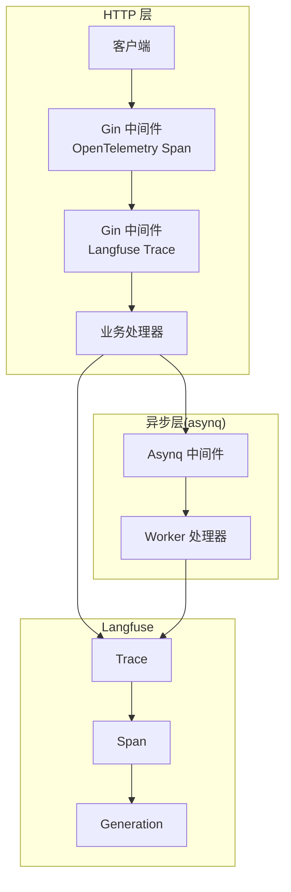
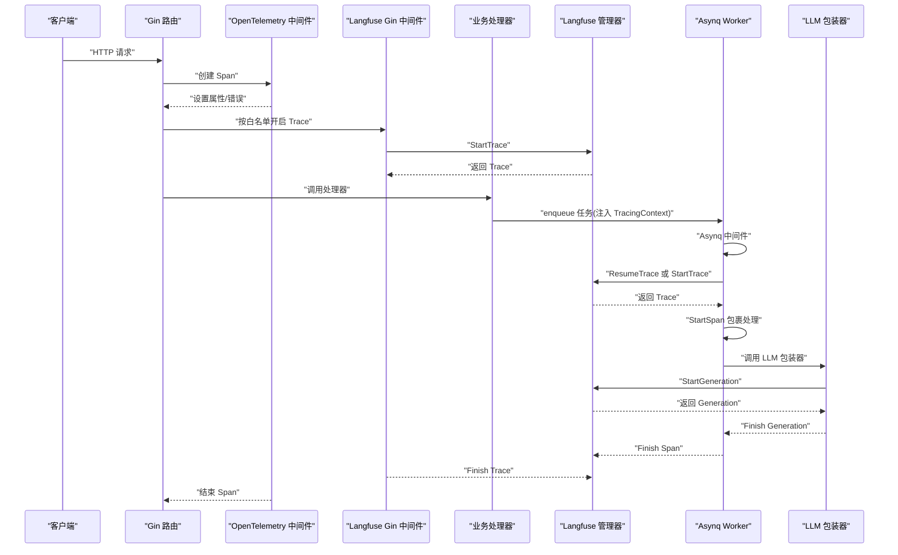
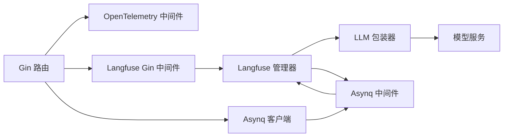

# 链路追踪

<cite>
**本文引用的文件**
- [init.go](file://internal/tracing/init.go)
- [trace.go](file://internal/middleware/trace.go)
- [router.go](file://internal/router/router.go)
- [task.go](file://internal/router/task.go)
- [tracer.go](file://internal/tracing/langfuse/tracer.go)
- [context.go](file://internal/tracing/langfuse/context.go)
- [events.go](file://internal/tracing/langfuse/events.go)
- [middleware.go](file://internal/tracing/langfuse/middleware.go)
- [asynq.go](file://internal/tracing/langfuse/asynq.go)
- [tracing.go](file://internal/types/tracing.go)
- [langfuse_wrapper.go](file://internal/models/chat/langfuse_wrapper.go)
- [langfuse_wrapper.go](file://internal/models/embedding/langfuse_wrapper.go)
- [const.go](file://internal/types/const.go)
- [Langfuse集成.md](file://docs/Langfuse集成.md)
</cite>

## 目录
1. [简介](#简介)
2. [项目结构](#项目结构)
3. [核心组件](#核心组件)
4. [架构总览](#架构总览)
5. [详细组件分析](#详细组件分析)
6. [依赖分析](#依赖分析)
7. [性能考虑](#性能考虑)
8. [故障排查指南](#故障排查指南)
9. [结论](#结论)
10. [附录](#附录)

## 简介
本文件为 WeKnora 的链路追踪系统技术文档，聚焦于以下两个观测能力：
- OpenTelemetry 集成：基于 Gin 中间件对 HTTP 请求进行 OpenTelemetry Span 化，并记录请求/响应元数据与错误状态。
- Langfuse 追踪：通过 Langfuse Manager 提供 Trace/Span/Generation 的创建、上下文传播与异步任务追踪，实现端到端的 LLM 调用与工作流可观测性。

文档将深入解释分布式追踪的实现原理（Span 创建、上下文传播）、采样与性能影响、中间件工作机制、数据收集与上报流程、可视化与调用链分析方法，并给出面向开发者与运维工程师的使用与优化建议。

## 项目结构
WeKnora 的链路追踪由两部分组成：
- OpenTelemetry：在 Gin 路由层注册中间件，创建并结束 Span，设置属性与错误标记。
- Langfuse：在 HTTP 层开启 Trace，在 asynq Worker 层恢复或新建 Trace，并在 LLM 调用处生成 Generation，形成“Trace → Span → Generation”的树形结构。

图表来源
- [router.go:123-128](file://internal/router/router.go#L123-L128)
- [trace.go:28-116](file://internal/middleware/trace.go#L28-L116)
- [middleware.go:12-57](file://internal/tracing/langfuse/middleware.go#L12-L57)
- [asynq.go:60-151](file://internal/tracing/langfuse/asynq.go#L60-L151)

章节来源
- [router.go:123-128](file://internal/router/router.go#L123-L128)
- [trace.go:28-116](file://internal/middleware/trace.go#L28-L116)
- [middleware.go:12-57](file://internal/tracing/langfuse/middleware.go#L12-L57)
- [asynq.go:60-151](file://internal/tracing/langfuse/asynq.go#L60-L151)

## 核心组件
- OpenTelemetry 初始化与中间件
  - 初始化：创建资源、导出器（OTLP 或 stdout）、批处理器、全局 Propagator（TraceContext + Baggage），并暴露 GetTracer/ContextWithSpan。
  - Gin 中间件：提取请求上下文，创建 Span，设置 HTTP 方法、URL、路径、查询参数、请求体、响应体、响应头、状态码，错误时标记为 Error 并记录错误。
- Langfuse 管理器
  - Trace/Span/Generation 数据模型与事件体定义，支持采样控制、父子关系、时间戳与令牌用量。
  - Gin 中间件：按白名单路径开启 Trace，自动完成 Trace 输入输出与元数据。
  - Asynq 中间件：从任务负载中恢复上游 Trace/父观察 ID，或新建独立 Trace，包裹处理函数为 Span。
  - LLM 包装器：在 Chat/Embedding 等调用前后生成 Generation，记录输入、输出、模型参数与令牌用量。
- 类型与上下文传播
  - TracingContext 结构体承载 trace_id、parent_obs_id、user_id、session_id，作为跨进程边界（HTTP → asynq）的载体。
  - ContextKey 将 Langfuse Trace 保留在请求上下文中，避免日志克隆导致的丢失。

章节来源
- [init.go:31-105](file://internal/tracing/init.go#L31-L105)
- [trace.go:28-116](file://internal/middleware/trace.go#L28-L116)
- [tracer.go:70-132](file://internal/tracing/langfuse/tracer.go#L70-L132)
- [middleware.go:12-57](file://internal/tracing/langfuse/middleware.go#L12-L57)
- [asynq.go:60-151](file://internal/tracing/langfuse/asynq.go#L60-L151)
- [tracing.go:20-60](file://internal/types/tracing.go#L20-L60)
- [const.go:26-35](file://internal/types/const.go#L26-L35)

## 架构总览
下图展示从请求进入、HTTP 层 Trace、异步任务恢复/新建 Trace、以及 LLM Generation 的完整链路。

图表来源
- [router.go:123-128](file://internal/router/router.go#L123-L128)
- [middleware.go:12-57](file://internal/tracing/langfuse/middleware.go#L12-L57)
- [asynq.go:60-151](file://internal/tracing/langfuse/asynq.go#L60-L151)
- [langfuse_wrapper.go:22-54](file://internal/models/chat/langfuse_wrapper.go#L22-L54)

章节来源
- [router.go:123-128](file://internal/router/router.go#L123-L128)
- [middleware.go:12-57](file://internal/tracing/langfuse/middleware.go#L12-L57)
- [asynq.go:60-151](file://internal/tracing/langfuse/asynq.go#L60-L151)
- [langfuse_wrapper.go:22-54](file://internal/models/chat/langfuse_wrapper.go#L22-L54)

## 详细组件分析

### OpenTelemetry 集成（Gin 中间件）
- 功能要点
  - 从请求上下文提取 TraceContext，创建命名 Span（方法+路径）。
  - 设置 HTTP 属性：方法、URL、路径、查询参数、请求体（POST/PUT/PATCH）。
  - 捕获响应体与响应头，记录状态码。
  - 错误处理：状态码 ≥ 400 标记为 Error，并记录 Gin 错误。
- 性能与安全
  - 请求体与响应体读取会消耗 Reader，需重置 Reader 以保证下游可用。
  - 敏感头（如 Authorization、Cookie）默认不记录，降低泄露风险。
- 适用场景
  - 适用于需要标准 OpenTelemetry 属性与错误标记的通用 HTTP 观测。

章节来源
- [trace.go:28-116](file://internal/middleware/trace.go#L28-L116)

### Langfuse 追踪（Trace/Span/Generation）
- 数据模型与事件
  - Trace：根级观察，承载用户、会话、环境、版本等信息。
  - Span：逻辑阶段（如 asynq 任务执行），可嵌套。
  - Generation：一次模型调用（LLM/Embedding/VLM/ASR/Rerank），记录输入、输出、模型参数、令牌用量。
  - 事件体：统一的 ingestionEvent 与 traceBody/observationBody，支持 trace-create/update、span-create/update、generation-create/update。
- 上下文传播
  - Gin 中间件：按白名单路径开启 Trace，提取用户与会话 ID，注入到 Trace 元数据。
  - Asynq 中间件：从任务负载解析 TracingContext，恢复上游 Trace/父观察 ID，否则新建独立 Trace。
  - 包装器：Chat/Embedding 等在调用前后创建 Generation，自动继承父观察 ID。
- 采样策略
  - Langfuse 管理器内部具备采样控制（sampled 字段），当未采样时，Start* 返回的句柄为“空操作”，避免写入与上报开销。
- 关键流程
  - Gin：shouldTrace 白名单过滤，仅对触发 LLM 或异步作业的端点开启。
  - Asynq：ResumeTrace 或 StartTrace，StartSpan 包裹处理，Finish Span/Trace。
  - LLM：StartGeneration/MarkCompletionStart/Finish，记录令牌用量与首 token 时间。

章节来源
- [tracer.go:70-132](file://internal/tracing/langfuse/tracer.go#L70-L132)
- [tracer.go:154-231](file://internal/tracing/langfuse/tracer.go#L154-L231)
- [tracer.go:233-314](file://internal/tracing/langfuse/tracer.go#L233-L314)
- [events.go:7-67](file://internal/tracing/langfuse/events.go#L7-L67)
- [context.go:9-67](file://internal/tracing/langfuse/context.go#L9-L67)
- [middleware.go:12-57](file://internal/tracing/langfuse/middleware.go#L12-L57)
- [asynq.go:60-151](file://internal/tracing/langfuse/asynq.go#L60-L151)

### 异步任务追踪（Asynq 中间件）
- 功能要点
  - 从任务负载解析 TracingContext，优先恢复上游 Trace；若缺失则新建独立 Trace。
  - 为每个任务类型创建 Span，填充任务元数据（类型、队列、重试次数、负载大小）。
  - 处理完成后根据结果标记成功/失败并 Finish Span 与 Trace。
- 负载摘要
  - 对超长负载（如文本/URL 列表）仅保留预览与字节长度，控制上报带宽。
- 用户/会话回填
  - 当上游缺失 user/session 信息时，回退到请求 ID 等上下文，确保可观测性。

章节来源
- [asynq.go:60-151](file://internal/tracing/langfuse/asynq.go#L60-L151)
- [asynq.go:154-177](file://internal/tracing/langfuse/asynq.go#L154-L177)

### LLM 包装器（Chat/Embedding）
- Chat 包装器
  - 非流式：StartGeneration → 调用 → Finish（输出内容、工具调用、结束原因、令牌用量）。
  - 流式：StartGeneration → 包装通道 → 首 token 时 MarkCompletionStart → 收集内容/工具调用/结束原因 → Finish。
- Embedding 包装器
  - 单条/批量嵌入均创建 Generation，估算输入令牌用量（按字符近似），记录维度与向量预览。
- 成本与可视化
  - 令牌用量用于 Langfuse 成本报表；首 token 时间用于 TTFB 指标。

章节来源
- [langfuse_wrapper.go:22-54](file://internal/models/chat/langfuse_wrapper.go#L22-L54)
- [langfuse_wrapper.go:56-121](file://internal/models/chat/langfuse_wrapper.go#L56-L121)
- [langfuse_wrapper.go:184-197](file://internal/models/chat/langfuse_wrapper.go#L184-L197)
- [langfuse_wrapper.go:17-42](file://internal/models/embedding/langfuse_wrapper.go#L17-L42)
- [langfuse_wrapper.go:44-75](file://internal/models/embedding/langfuse_wrapper.go#L44-L75)
- [langfuse_wrapper.go:85-106](file://internal/models/embedding/langfuse_wrapper.go#L85-L106)

### 类型与上下文传播（TracingContext）
- TracingContext
  - 字段：trace_id、parent_obs_id、user_id、session_id，JSON 带 lf_ 前缀且 omitempty，兼容旧负载。
  - 接口：SetLangfuseTracing/GetLangfuseTracing，便于注入与读取。
- ContextKey
  - LangfuseTraceContextKey 保存 Trace，避免日志克隆导致的丢失，确保下游 LLM 包装器可附加 Generation。

章节来源
- [tracing.go:20-60](file://internal/types/tracing.go#L20-L60)
- [const.go:26-35](file://internal/types/const.go#L26-L35)
- [context.go:9-16](file://internal/tracing/langfuse/context.go#L9-L16)

## 依赖分析
- 组件耦合
  - Gin 路由层同时挂载 OpenTelemetry 与 Langfuse 中间件，二者互不依赖，解耦良好。
  - Langfuse 管理器通过 TracingContext 与 asynq 任务负载解耦，避免直接引入 asynq 到业务层。
  - LLM 包装器仅在 Langfuse 启用时生效，避免无观测场景的额外成本。
- 外部依赖
  - OpenTelemetry：OTLP 导出器（gRPC）或 stdout 导出器。
  - asynq：Redis 客户端与 ServeMux。
  - Langfuse：通过 ingestion API 发送事件（由管理器内部队列与 goroutine 负责上报）。

图表来源
- [router.go:123-128](file://internal/router/router.go#L123-L128)
- [middleware.go:12-57](file://internal/tracing/langfuse/middleware.go#L12-L57)
- [asynq.go:60-151](file://internal/tracing/langfuse/asynq.go#L60-L151)
- [langfuse_wrapper.go:22-54](file://internal/models/chat/langfuse_wrapper.go#L22-L54)

章节来源
- [router.go:123-128](file://internal/router/router.go#L123-L128)
- [middleware.go:12-57](file://internal/tracing/langfuse/middleware.go#L12-L57)
- [asynq.go:60-151](file://internal/tracing/langfuse/asynq.go#L60-L151)
- [langfuse_wrapper.go:22-54](file://internal/models/chat/langfuse_wrapper.go#L22-L54)

## 性能考虑
- 采样与降噪
  - Langfuse 管理器内置采样控制，未采样时 Start* 返回空操作句柄，避免写入与上报开销。
  - Gin 中间件仅对白名单路径开启 Langfuse Trace，减少噪音与带宽。
- 负载与带宽
  - Asynq 任务负载仅保留输入摘要（如文本预览、字节长度），避免发送大体量原始数据。
  - LLM 包装器对 Embedding 估算输入令牌用量，避免零用量导致的成本报表异常。
- 上报与批处理
  - OpenTelemetry 使用 BatchSpanProcessor，降低频繁上报带来的抖动。
  - Langfuse 管理器内部通过队列与 goroutine 异步上报，避免阻塞业务线程。
- 资源与导出器
  - 未配置 OTLP Endpoint 时自动降级为 stdout 导出器，便于开发调试。
  - 生产环境建议配置 OTLP Endpoint 以接入 Jaeger/Zipkin 等后端。

章节来源
- [tracer.go:74-110](file://internal/tracing/langfuse/tracer.go#L74-L110)
- [middleware.go:60-133](file://internal/tracing/langfuse/middleware.go#L60-L133)
- [asynq.go:154-177](file://internal/tracing/langfuse/asynq.go#L154-L177)
- [langfuse_wrapper.go:85-106](file://internal/models/embedding/langfuse_wrapper.go#L85-L106)
- [init.go:41-59](file://internal/tracing/init.go#L41-L59)
- [init.go:61-71](file://internal/tracing/init.go#L61-L71)

## 故障排查指南
- 无 Langfuse Trace
  - 检查是否设置了 LANGFUSE_* 环境变量，以及 Gin 中间件是否注册。
  - 确认请求路径在 shouldTrace 白名单中。
- 异步任务未关联上游 Trace
  - 确认 enqueue 时是否调用 InjectTracing 注入 TracingContext。
  - 检查任务负载是否包含 lf_trace_id/lf_parent_obs_id。
- LLM Generation 未出现
  - 确认 Langfuse 管理器已启用，且 LLM 包装器已安装。
  - 检查 Generation 是否被采样排除（sampled=false）。
- OpenTelemetry Span 缺失
  - 检查 OTLP Endpoint 是否正确配置。
  - 确认 Gin 中间件已注册，且未被后续中间件覆盖。
- 错误未标记
  - 检查 Gin 中间件是否正确设置状态码与错误记录。
  - 确认 Gin 错误队列中是否存在错误对象。

章节来源
- [router.go:123-128](file://internal/router/router.go#L123-L128)
- [middleware.go:12-57](file://internal/tracing/langfuse/middleware.go#L12-L57)
- [asynq.go:24-42](file://internal/tracing/langfuse/asynq.go#L24-L42)
- [langfuse_wrapper.go:22-26](file://internal/models/chat/langfuse_wrapper.go#L22-L26)
- [init.go:41-59](file://internal/tracing/init.go#L41-L59)
- [trace.go:107-115](file://internal/middleware/trace.go#L107-L115)

## 结论
WeKnora 的链路追踪体系通过 OpenTelemetry 与 Langfuse 的协同，实现了：
- HTTP 层的标准化 Span 化与错误标记；
- 端到端的 Trace/Span/Generation 树形结构，覆盖同步与异步工作流；
- 采样与降噪策略，兼顾可观测性与性能；
- 易于扩展的包装器与中间件，便于新增模型与业务模块。

建议在生产环境：
- 明确 OTLP Endpoint 与导出器配置；
- 保持 Langfuse 白名单精准，避免噪音；
- 对长负载与高吞吐场景，充分利用摘要与采样；
- 结合 Langfuse 仪表盘与 OpenTelemetry 后端进行联合分析。

## 附录

### 配置选项与环境变量
- OpenTelemetry
  - OTEL_EXPORTER_OTLP_ENDPOINT：OTLP gRPC 导出器地址；未设置时使用 stdout 导出器。
- Langfuse
  - LANGFUSE_HOST、LANGFUSE_PUBLIC_KEY、LANGFUSE_SECRET_KEY：Langfuse 服务端点与密钥。
  - Gin 中间件注册：始终注册，禁用时为无操作。
  - Asynq 中间件：始终注册，禁用时为无操作。

章节来源
- [init.go:41-59](file://internal/tracing/init.go#L41-L59)
- [router.go:123-128](file://internal/router/router.go#L123-L128)
- [Langfuse集成.md:291-309](file://docs/Langfuse集成.md#L291-L309)

### 采样策略与性能影响
- Langfuse 采样：未采样时 Start* 返回空操作句柄，避免写入与上报。
- Gin 白名单：仅对触发 LLM 或异步作业的端点开启 Langfuse Trace。
- 负载摘要：Asynq 与 Embedding 包装器仅上报必要字段，控制带宽。
- OpenTelemetry：BatchSpanProcessor 降低上报频率，提升吞吐。

章节来源
- [tracer.go:74-110](file://internal/tracing/langfuse/tracer.go#L74-L110)
- [middleware.go:60-133](file://internal/tracing/langfuse/middleware.go#L60-L133)
- [asynq.go:154-177](file://internal/tracing/langfuse/asynq.go#L154-L177)
- [init.go:61-71](file://internal/tracing/init.go#L61-L71)

### 追踪数据可视化与分析
- Langfuse UI
  - Trace：根级请求树，包含用户、会话、环境、版本与元数据。
  - Span：逻辑阶段，支持嵌套与父子关系。
  - Generation：模型调用，包含输入、输出、模型参数、令牌用量、首 token 时间。
- OpenTelemetry 后端
  - Jaeger/Zipkin：查看 HTTP 层 Span 属性与错误标记。
- 调用链分析
  - 通过父观察 ID 串联 HTTP → 异步 → LLM 的完整链路。
- 性能瓶颈定位
  - 关注 Generation 的 CompletionStart 与总耗时，结合 Span 的元数据定位热点。

章节来源
- [Langfuse集成.md:291-309](file://docs/Langfuse集成.md#L291-L309)
- [tracer.go:134-152](file://internal/tracing/langfuse/tracer.go#L134-L152)
- [asynq.go:102-120](file://internal/tracing/langfuse/asynq.go#L102-L120)

### 用户体验监控、错误追踪与业务指标
- 用户体验监控
  - 首 token 时间（CompletionStart）用于 TTFB 指标。
  - 会话 ID 与用户 ID 用于用户维度分析。
- 错误追踪
  - Gin 中间件将状态码 ≥ 400 标记为 Error，并记录错误对象。
  - Langfuse Generation 在错误时标记 Level=ERROR。
- 业务指标
  - 令牌用量用于成本与使用量统计。
  - Span 元数据（队列、重试、负载大小）用于异步作业健康度分析。

章节来源
- [langfuse_wrapper.go:95-98](file://internal/models/chat/langfuse_wrapper.go#L95-L98)
- [tracer.go:209-214](file://internal/tracing/langfuse/tracer.go#L209-L214)
- [asynq.go:130-138](file://internal/tracing/langfuse/asynq.go#L130-L138)