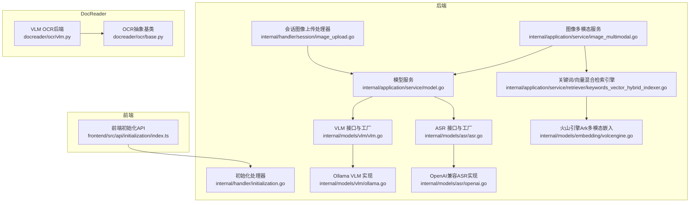
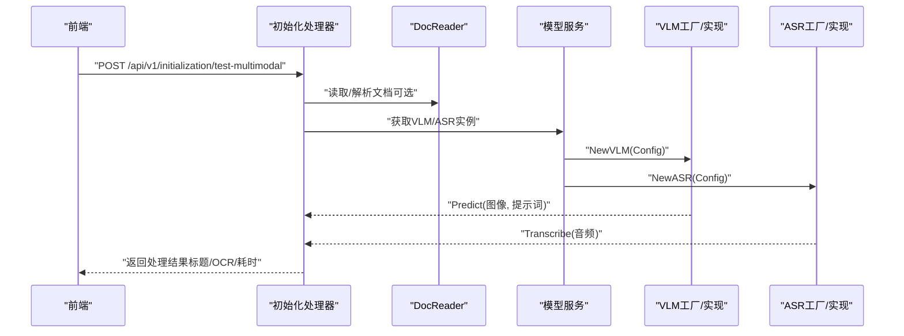
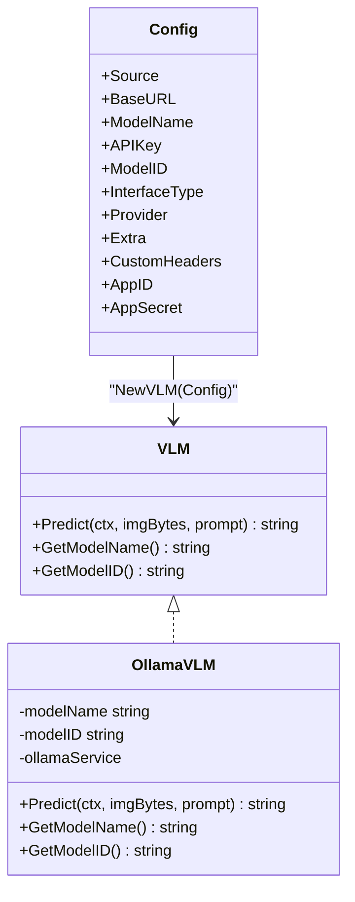
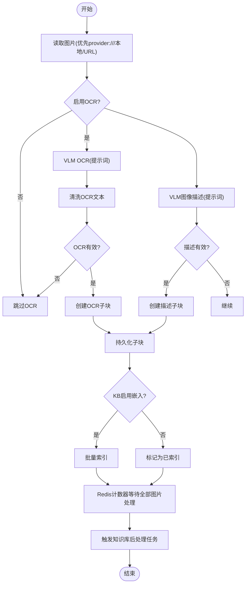
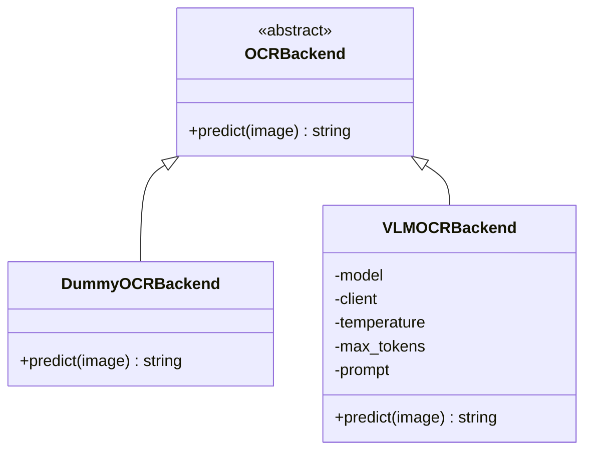
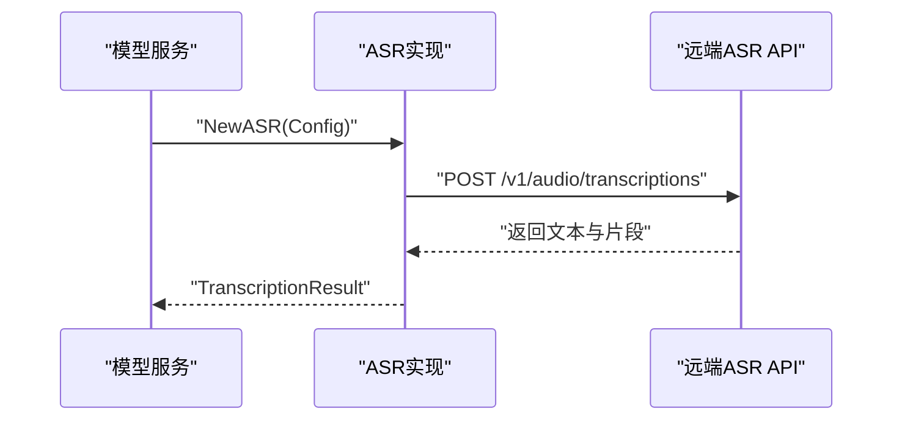
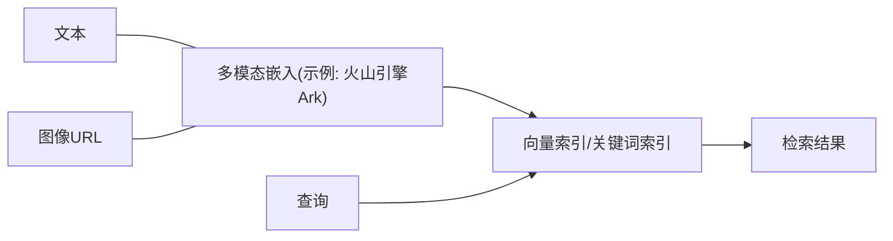
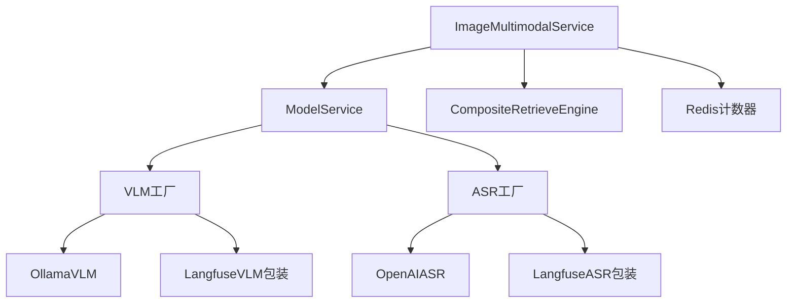

# 多模态处理

<cite>
**本文引用的文件**   
- [internal/models/vlm/vlm.go](file://internal/models/vlm/vlm.go)
- [internal/models/vlm/ollama.go](file://internal/models/vlm/ollama.go)
- [internal/models/vlm/langfuse_wrapper.go](file://internal/models/vlm/langfuse_wrapper.go)
- [internal/application/service/model.go](file://internal/application/service/model.go)
- [internal/application/service/image_multimodal.go](file://internal/application/service/image_multimodal.go)
- [internal/handler/session/image_upload.go](file://internal/handler/session/image_upload.go)
- [internal/handler/initialization.go](file://internal/handler/initialization.go)
- [frontend/src/api/initialization/index.ts](file://frontend/src/api/initialization/index.ts)
- [docreader/ocr/vlm.py](file://docreader/ocr/vlm.py)
- [docreader/ocr/base.py](file://docreader/ocr/base.py)
- [internal/models/asr/asr.go](file://internal/models/asr/asr.go)
- [internal/models/asr/openai.go](file://internal/models/asr/openai.go)
- [internal/models/asr/langfuse_wrapper.go](file://internal/models/asr/langfuse_wrapper.go)
- [internal/assets/embed.go](file://internal/assets/embed.go)
- [internal/application/service/retriever/keywords_vector_hybrid_indexer.go](file://internal/application/service/retriever/keywords_vector_hybrid_indexer.go)
- [internal/models/embedding/volcengine.go](file://internal/models/embedding/volcengine.go)
</cite>

## 目录
1. [简介](#简介)
2. [项目结构](#项目结构)
3. [核心组件](#核心组件)
4. [架构总览](#架构总览)
5. [详细组件分析](#详细组件分析)
6. [依赖分析](#依赖分析)
7. [性能考虑](#性能考虑)
8. [故障排查指南](#故障排查指南)
9. [结论](#结论)
10. [附录](#附录)

## 简介
本技术文档围绕 WeKnora 多模态处理系统，系统性阐述视觉语言模型（VLM）配置与调用、图像处理与 OCR、语音识别（ASR）集成、多模态文档解析与索引、跨模态检索与问答链路等关键技术点。文档同时提供性能优化、资源管理与服务配置的最佳实践，并给出面向开发者的扩展与自定义处理流程指南。

## 项目结构
WeKnora 的多模态能力由后端 Go 服务与前端交互层协同完成，核心模块包括：
- VLM 与 ASR 模型抽象与实现：统一接口、配置转换、提供商适配、本地 Ollama 调用、Langfuse 包装追踪。
- 图像多模态处理流水线：异步任务处理、OCR 与图像描述生成、子块创建与索引、最终后处理编排。
- 文档阅读器（DocReader）Python 组件：OCR 后端（VLM）、基础 OCR 抽象、PDF 扫描版回退解析。
- 初始化与前端测试接口：多模态连通性测试、参数传递、结果返回。
- 向量检索与嵌入：关键词/向量混合检索、多模态嵌入（含火山引擎 Ark 示例）。

**图表来源**
- [frontend/src/api/initialization/index.ts:344-387](file://frontend/src/api/initialization/index.ts#L344-L387)
- [internal/handler/initialization.go:2064-2112](file://internal/handler/initialization.go#L2064-L2112)
- [internal/handler/session/image_upload.go:81-113](file://internal/handler/session/image_upload.go#L81-L113)
- [internal/application/service/model.go:433-507](file://internal/application/service/model.go#L433-L507)
- [internal/application/service/image_multimodal.go:92-247](file://internal/application/service/image_multimodal.go#L92-L247)
- [internal/models/vlm/vlm.go:14-135](file://internal/models/vlm/vlm.go#L14-L135)
- [internal/models/vlm/ollama.go:12-75](file://internal/models/vlm/ollama.go#L12-L75)
- [internal/models/asr/asr.go:22-66](file://internal/models/asr/asr.go#L22-L66)
- [internal/models/asr/openai.go:49-136](file://internal/models/asr/openai.go#L49-L136)
- [internal/models/embedding/volcengine.go:43-213](file://internal/models/embedding/volcengine.go#L43-L213)
- [internal/application/service/retriever/keywords_vector_hybrid_indexer.go:16-37](file://internal/application/service/retriever/keywords_vector_hybrid_indexer.go#L16-L37)
- [docreader/ocr/vlm.py:14-87](file://docreader/ocr/vlm.py#L14-L87)
- [docreader/ocr/base.py:10-32](file://docreader/ocr/base.py#L10-L32)

**章节来源**
- [frontend/src/api/initialization/index.ts:344-387](file://frontend/src/api/initialization/index.ts#L344-L387)
- [internal/handler/initialization.go:2064-2112](file://internal/handler/initialization.go#L2064-L2112)
- [internal/application/service/image_multimodal.go:92-247](file://internal/application/service/image_multimodal.go#L92-L247)

## 核心组件
- VLM 接口与工厂：统一预测接口、配置转换、提供商检测与实例化（本地 Ollama、远端 OpenAI 兼容、WeKnora Cloud）。
- ASR 接口与工厂：统一转写接口、OpenAI 兼容实现、语言参数支持、格式探测。
- 图像多模态服务：异步任务处理、OCR 与图像描述生成、子块创建、索引与后处理编排。
- DocReader OCR：VLM OCR 后端（OpenAI 兼容格式），中文提示词与结构化输出。
- 检索与嵌入：关键词/向量混合检索、多模态嵌入（如火山引擎 Ark）。

**章节来源**
- [internal/models/vlm/vlm.go:14-135](file://internal/models/vlm/vlm.go#L14-L135)
- [internal/models/asr/asr.go:22-66](file://internal/models/asr/asr.go#L22-L66)
- [internal/application/service/image_multimodal.go:53-90](file://internal/application/service/image_multimodal.go#L53-L90)
- [docreader/ocr/vlm.py:14-87](file://docreader/ocr/vlm.py#L14-L87)

## 架构总览
WeKnora 的多模态处理采用“前端测试/触发 + 后端服务编排 + 异步任务 + 多模态模型/检索”的分层架构。前端提供多模态连通性测试与参数配置入口；后端通过模型服务解析 VLM/ASR 配置并调用具体实现；图像多模态服务以异步任务形式执行 OCR 与图像描述生成，并将结果索引到检索引擎；DocReader 提供 Python 层的 OCR 能力作为补充。

**图表来源**
- [frontend/src/api/initialization/index.ts:344-387](file://frontend/src/api/initialization/index.ts#L344-L387)
- [internal/handler/initialization.go:2064-2112](file://internal/handler/initialization.go#L2064-L2112)
- [internal/application/service/model.go:433-507](file://internal/application/service/model.go#L433-L507)
- [internal/models/vlm/vlm.go:81-109](file://internal/models/vlm/vlm.go#L81-L109)
- [internal/models/asr/asr.go:60-66](file://internal/models/asr/asr.go#L60-L66)

## 详细组件分析

### VLM 配置与接口
- 接口定义：统一 Predict(ctx, 图像字节切片, 提示词) 返回文本；GetModelName/ID 获取元信息。
- 配置转换：ConfigFromModel 将后端模型对象映射为 VLM 配置，自动推断接口类型（本地 Ollama 或远端 OpenAI 兼容）。
- 工厂方法：根据接口类型或来源选择 OllamaVLM、WeKnoraCloudVLM 或 RemoteAPIVLM；支持调试包装与 Langfuse 包装。
- 本地 Ollama：通过 OllamaService Chat 请求，聚合多张图像，设置温度等推理参数。

**图表来源**
- [internal/models/vlm/vlm.go:14-135](file://internal/models/vlm/vlm.go#L14-L135)
- [internal/models/vlm/ollama.go:12-75](file://internal/models/vlm/ollama.go#L12-L75)

**章节来源**
- [internal/models/vlm/vlm.go:14-135](file://internal/models/vlm/vlm.go#L14-L135)
- [internal/models/vlm/ollama.go:12-75](file://internal/models/vlm/ollama.go#L12-L75)

### 图像多模态处理流水线
- 触发与上下文：会话图像上传处理器对每张图片构建分析提示词，调用 VLM 进行内容分析并填充 Caption。
- 异步任务：ImageMultimodalService.Handle 解析任务载荷，按优先级读取图片（provider:// > 本地 > URL），分别执行 OCR 与图像描述生成。
- OCR 与描述：根据扫描版 PDF 场景切换不同提示词；OCR 结果经清洗后写入 ImageOCR 子块，描述写入 ImageCaption 子块。
- 索引与后处理：若知识库启用嵌入，则批量索引新子块；使用 Redis 计数器等待所有图片处理完成后触发知识库后处理任务。

**图表来源**
- [internal/handler/session/image_upload.go:81-113](file://internal/handler/session/image_upload.go#L81-L113)
- [internal/application/service/image_multimodal.go:92-247](file://internal/application/service/image_multimodal.go#L92-L247)
- [internal/application/service/image_multimodal.go:249-331](file://internal/application/service/image_multimodal.go#L249-L331)
- [internal/application/service/image_multimodal.go:390-436](file://internal/application/service/image_multimodal.go#L390-L436)

**章节来源**
- [internal/handler/session/image_upload.go:81-113](file://internal/handler/session/image_upload.go#L81-L113)
- [internal/application/service/image_multimodal.go:92-247](file://internal/application/service/image_multimodal.go#L92-L247)
- [internal/application/service/image_multimodal.go:249-331](file://internal/application/service/image_multimodal.go#L249-L331)
- [internal/application/service/image_multimodal.go:390-436](file://internal/application/service/image_multimodal.go#L390-L436)

### DocReader OCR 与提示词工程
- OCR 抽象：OCRBackend 抽象定义 predict 接口；DummyOCRBackend 用于占位。
- VLM OCR 后端：基于 OpenAI 兼容客户端，发送 image_url 与文本提示词，控制温度与最大 token 数，返回结构化文本。
- 中文提示词：强调忽略页眉页脚、表格 HTML、公式 LaTeX、按阅读顺序组织，确保输出质量。

**图表来源**
- [docreader/ocr/base.py:10-32](file://docreader/ocr/base.py#L10-L32)
- [docreader/ocr/vlm.py:14-87](file://docreader/ocr/vlm.py#L14-L87)

**章节来源**
- [docreader/ocr/base.py:10-32](file://docreader/ocr/base.py#L10-L32)
- [docreader/ocr/vlm.py:14-87](file://docreader/ocr/vlm.py#L14-L87)

### ASR 集成与语音转文字
- 接口与配置：ASR 接口定义 Transcribe(ctx, 音频字节, 文件名)，返回完整文本与带时间戳片段；ConfigFromModel 支持自定义请求头。
- OpenAI 兼容实现：调用 /v1/audio/transcriptions，自动语言参数注入，格式探测（MP3/FLAC/OGG 等）。
- Langfuse 包装：记录文件名、音频大小、时长等指标，便于计费与观测。

**图表来源**
- [internal/models/asr/asr.go:22-66](file://internal/models/asr/asr.go#L22-L66)
- [internal/models/asr/openai.go:49-136](file://internal/models/asr/openai.go#L49-L136)
- [internal/models/asr/langfuse_wrapper.go:21-44](file://internal/models/asr/langfuse_wrapper.go#L21-L44)

**章节来源**
- [internal/models/asr/asr.go:22-66](file://internal/models/asr/asr.go#L22-L66)
- [internal/models/asr/openai.go:49-136](file://internal/models/asr/openai.go#L49-L136)
- [internal/models/asr/langfuse_wrapper.go:21-44](file://internal/models/asr/langfuse_wrapper.go#L21-L44)

### 多模态嵌入与跨模态检索
- 多模态嵌入：以火山引擎 Ark 为例，支持文本与图像输入组合，返回统一嵌入向量，便于跨模态检索。
- 检索引擎：关键词/向量混合检索服务封装，支持多种后端（PostgreSQL、Elasticsearch 等），通过 CompositeRetrieveEngine 统一调度。

**图表来源**
- [internal/models/embedding/volcengine.go:43-213](file://internal/models/embedding/volcengine.go#L43-L213)
- [internal/application/service/retriever/keywords_vector_hybrid_indexer.go:16-37](file://internal/application/service/retriever/keywords_vector_hybrid_indexer.go#L16-L37)

**章节来源**
- [internal/models/embedding/volcengine.go:43-213](file://internal/models/embedding/volcengine.go#L43-L213)
- [internal/application/service/retriever/keywords_vector_hybrid_indexer.go:16-37](file://internal/application/service/retriever/keywords_vector_hybrid_indexer.go#L16-L37)

### 多模态问答与后处理
- 会话图像分析：上传图像时，根据用户问题动态构建提示词，调用 VLM 生成简要分析结果并写入图片信息。
- 后处理编排：图像多模态任务完成后，通过 Redis 计数器判断是否全部图片处理完毕，随后入队知识库后处理任务（摘要/问题生成等）。

**章节来源**
- [internal/handler/session/image_upload.go:81-113](file://internal/handler/session/image_upload.go#L81-L113)
- [internal/application/service/image_multimodal.go:390-436](file://internal/application/service/image_multimodal.go#L390-L436)

## 依赖分析
- 组件耦合与内聚：VLM/ASR 通过统一接口与工厂解耦具体提供商；图像多模态服务依赖模型服务与检索引擎，职责清晰。
- 外部依赖：Ollama 本地推理、远端 OpenAI 兼容 API、DocReader Python OCR、Redis 计数器、Langfuse 观测。
- 循环依赖：未发现直接循环依赖；Langfuse 包装器以装饰器形式存在，避免运行期耦合。

**图表来源**
- [internal/application/service/image_multimodal.go:53-90](file://internal/application/service/image_multimodal.go#L53-L90)
- [internal/application/service/model.go:433-507](file://internal/application/service/model.go#L433-L507)
- [internal/models/vlm/vlm.go:81-109](file://internal/models/vlm/vlm.go#L81-L109)
- [internal/models/asr/asr.go:60-66](file://internal/models/asr/asr.go#L60-L66)
- [internal/models/vlm/langfuse_wrapper.go:14-45](file://internal/models/vlm/langfuse_wrapper.go#L14-L45)
- [internal/models/asr/langfuse_wrapper.go:14-44](file://internal/models/asr/langfuse_wrapper.go#L14-L44)

**章节来源**
- [internal/application/service/image_multimodal.go:53-90](file://internal/application/service/image_multimodal.go#L53-L90)
- [internal/application/service/model.go:433-507](file://internal/application/service/model.go#L433-L507)
- [internal/models/vlm/vlm.go:81-109](file://internal/models/vlm/vlm.go#L81-L109)
- [internal/models/asr/asr.go:60-66](file://internal/models/asr/asr.go#L60-L66)

## 性能考虑
- 并发与批处理：图像多模态服务在索引阶段使用批量索引，减少多次往返；OCR 与描述生成可并行处理多张图片。
- 缓存与计数：使用 Redis 计数器等待全部图片处理完成，避免重复触发后处理；Langfuse 包装仅记录必要元数据，避免传输大体积图像。
- 资源限制：VLM/Ollama 温度与最大 token 控制推理稳定性；DocReader OCR 设置超时与最大 token，防止长文本阻塞。
- 索引策略：当知识库不启用嵌入时跳过向量化索引，仅标记状态，降低开销。

[本节为通用指导，无需特定文件引用]

## 故障排查指南
- VLM/ASR 连接测试：初始化处理器提供连通性测试，返回可用性与错误信息（认证失败、端点不可达、模型不存在等）。
- 测试音频：内置测试音频资源，便于快速验证 ASR 功能。
- 日志与追踪：Langfuse 包装记录生成事件与元数据；各服务打印详细日志，便于定位问题。

**章节来源**
- [internal/handler/initialization.go:1850-1888](file://internal/handler/initialization.go#L1850-L1888)
- [internal/assets/embed.go:1-6](file://internal/assets/embed.go#L1-L6)
- [internal/models/vlm/langfuse_wrapper.go:21-45](file://internal/models/vlm/langfuse_wrapper.go#L21-L45)
- [internal/models/asr/langfuse_wrapper.go:21-44](file://internal/models/asr/langfuse_wrapper.go#L21-L44)

## 结论
WeKnora 的多模态处理体系通过统一接口与工厂模式，将 VLM/ASR 能力与图像/语音处理流水线解耦，结合 DocReader 的 OCR 能力与关键词/向量混合检索，形成完整的多模态文档解析与检索方案。Langfuse 包装与 Redis 计数器进一步增强了可观测性与可靠性。开发者可在此基础上扩展新的模型提供商、OCR 后端与检索后端，实现灵活的功能定制与性能优化。

[本节为总结，无需特定文件引用]

## 附录
- 前端多模态测试接口：支持上传图片、指定 VLM 模型与接口类型、存储配置等参数，返回标题/OCR/耗时等结果。
- 模型服务：提供 GetVLMModel 与 GetASRModel，负责从租户上下文解析模型并实例化对应实现。
- DocReader OCR：VLM OCR 后端与抽象基类，支持中文提示词与结构化输出。

**章节来源**
- [frontend/src/api/initialization/index.ts:344-387](file://frontend/src/api/initialization/index.ts#L344-L387)
- [internal/application/service/model.go:433-507](file://internal/application/service/model.go#L433-L507)
- [docreader/ocr/vlm.py:14-87](file://docreader/ocr/vlm.py#L14-L87)
- [docreader/ocr/base.py:10-32](file://docreader/ocr/base.py#L10-L32)