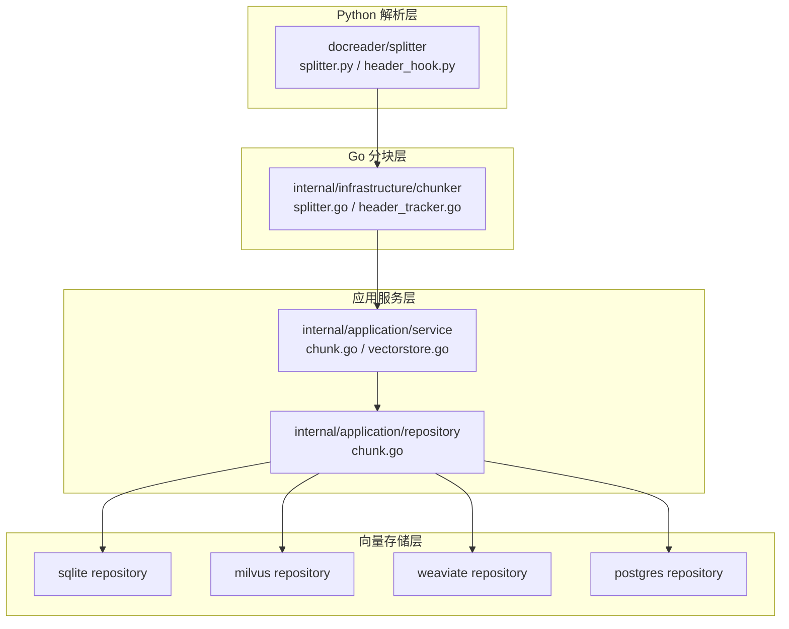
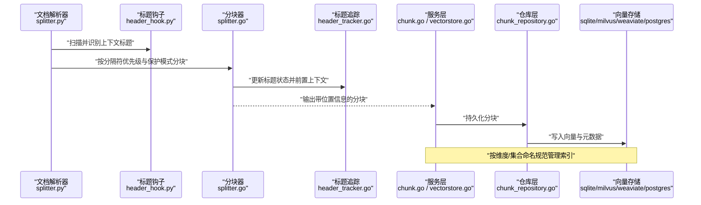
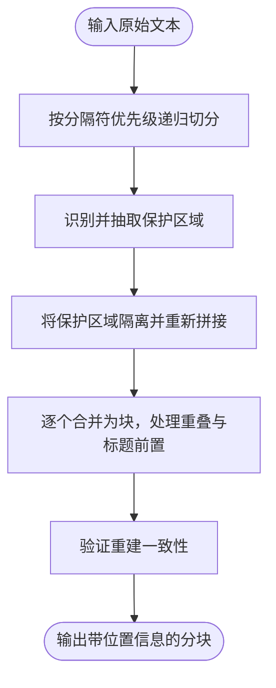
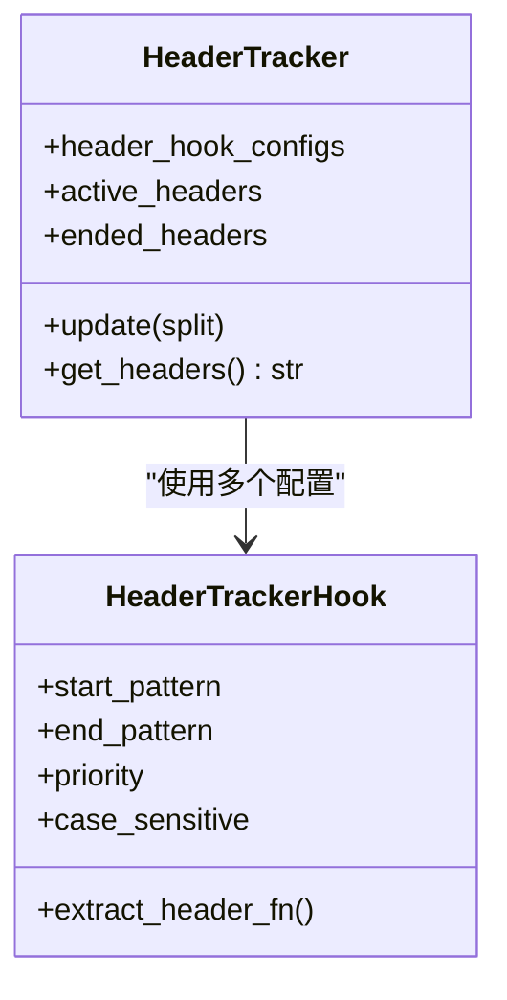
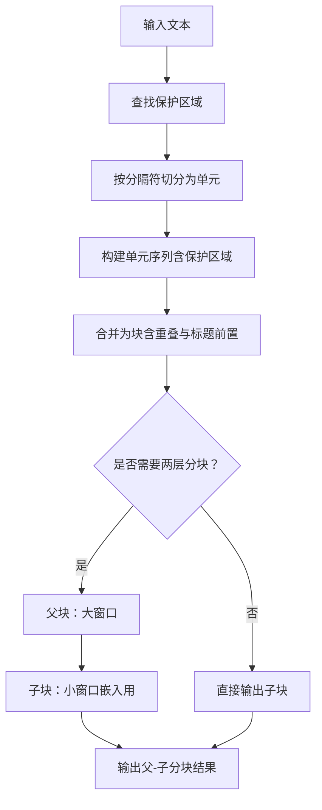
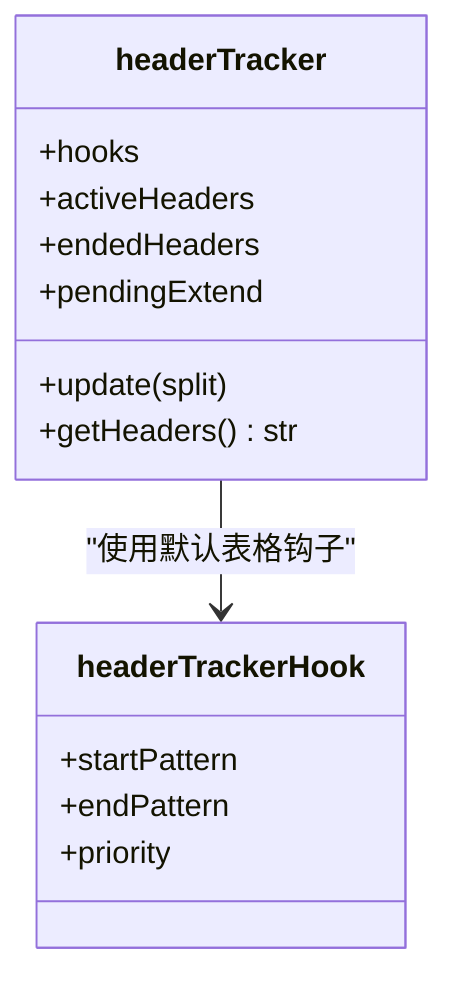
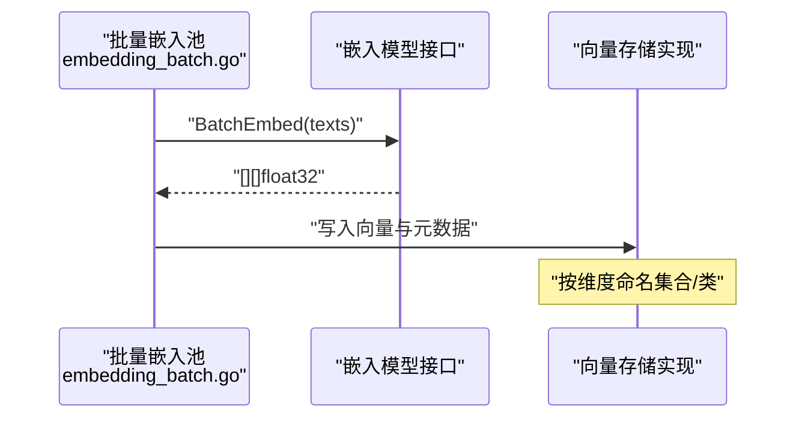
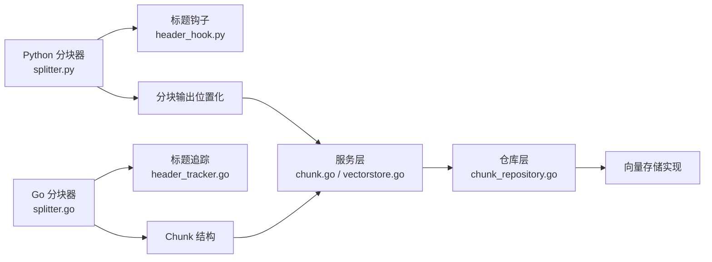

# 分块与向量化

<cite>
**本文引用的文件**
- [splitter.py](file://docreader/splitter/splitter.py)
- [header_hook.py](file://docreader/splitter/header_hook.py)
- [splitter.go](file://internal/infrastructure/chunker/splitter.go)
- [header_tracker.go](file://internal/infrastructure/chunker/header_tracker.go)
- [chunk.go](file://internal/application/service/chunk.go)
- [chunk_repository.go](file://internal/application/repository/chunk.go)
- [vectorstore_service.go](file://internal/application/service/vectorstore.go)
- [embedding_batch.go](file://internal/models/embedding/batch.go)
- [embedding_types.go](file://internal/types/embedding.go)
- [sqlite_repository.go](file://internal/application/repository/retriever/sqlite/repository.go)
- [milvus_repository.go](file://internal/application/repository/retriever/milvus/repository.go)
- [weaviate_repository.go](file://internal/application/repository/retriever/weaviate/repository.go)
- [postgres_repository.go](file://internal/application/repository/retriever/postgres/repository.go)
</cite>

## 目录
1. [引言](#引言)
2. [项目结构](#项目结构)
3. [核心组件](#核心组件)
4. [架构总览](#架构总览)
5. [详细组件分析](#详细组件分析)
6. [依赖分析](#依赖分析)
7. [性能考量](#性能考量)
8. [故障排查指南](#故障排查指南)
9. [结论](#结论)
10. [附录](#附录)

## 引言
本技术文档聚焦WeKnora在“文档分块与向量化”方面的实现，系统性阐述文本分块算法、标题钩子机制、语义分割策略，以及向量嵌入生成、维度优化与存储格式。文档还覆盖分块策略配置、重叠处理与上下文保持的技术细节，并提供嵌入模型选择、批量处理与内存优化的最佳实践，帮助读者在实际工程中高效落地与调优。

## 项目结构
WeKnora在Python侧提供docreader模块用于文档解析与分块，在Go侧提供chunker与检索引擎实现，形成“解析-分块-入库-向量化-检索”的完整链路。核心目录与职责如下：
- docreader/splitter：Python分块器与标题钩子，提供保护模式、分隔符优先级与智能合并逻辑
- internal/infrastructure/chunker：Go分块器与标题追踪，实现两层分块（父-子）与绝对最大尺寸控制
- internal/application/service：服务层封装chunk与vector store操作
- internal/application/repository/retriever：各向量数据库存储实现（SQLite、Milvus、Weaviate、Postgres）
- internal/models/embedding：嵌入模型抽象与批量处理池化

图表来源
- [splitter.py:116-144](file://docreader/splitter/splitter.py#L116-L144)
- [splitter.go:142-166](file://internal/infrastructure/chunker/splitter.go#L142-L166)
- [chunk.go:57-76](file://internal/application/service/chunk.go#L57-L76)
- [chunk_repository.go:27-54](file://internal/application/repository/chunk.go#L27-L54)
- [sqlite_repository.go:497-505](file://internal/application/repository/retriever/sqlite/repository.go#L497-L505)
- [milvus_repository.go:80-116](file://internal/application/repository/retriever/milvus/repository.go#L80-L116)
- [weaviate_repository.go:75-126](file://internal/application/repository/retriever/weaviate/repository.go#L75-L126)
- [postgres_repository.go:600-616](file://internal/application/repository/retriever/postgres/repository.go#L600-L616)

章节来源
- [splitter.py:1-585](file://docreader/splitter/splitter.py#L1-L585)
- [header_hook.py:1-113](file://docreader/splitter/header_hook.py#L1-L113)
- [splitter.go:1-571](file://internal/infrastructure/chunker/splitter.go#L1-L571)
- [header_tracker.go:1-162](file://internal/infrastructure/chunker/header_tracker.go#L1-L162)
- [chunk.go:1-454](file://internal/application/service/chunk.go#L1-L454)
- [chunk_repository.go:1-800](file://internal/application/repository/chunk.go#L1-L800)
- [vectorstore_service.go:1-190](file://internal/application/service/vectorstore.go#L1-L190)
- [embedding_batch.go:1-96](file://internal/models/embedding/batch.go#L1-L96)
- [embedding_types.go:1-42](file://internal/types/embedding.go#L1-L42)
- [sqlite_repository.go:497-538](file://internal/application/repository/retriever/sqlite/repository.go#L497-L538)
- [milvus_repository.go:80-116](file://internal/application/repository/retriever/milvus/repository.go#L80-L116)
- [weaviate_repository.go:75-126](file://internal/application/repository/retriever/weaviate/repository.go#L75-L126)
- [postgres_repository.go:600-616](file://internal/application/repository/retriever/postgres/repository.go#L600-L616)

## 核心组件
- 文本分块器（Python）：支持可配置分隔符优先级、保护模式（公式、图片、链接、表格、代码块）、智能合并与重叠处理，输出带位置信息的分块元组
- 标题钩子（Python）：基于正则的状态机，自动识别Markdown表格等上下文标题并在后续分块中前置，保证检索上下文完整性
- Go分块器：与Python版本等价的递归分块逻辑，增加绝对最大尺寸限制与两层分块（父-子），用于大文档的窗口化处理
- 标题追踪（Go）：与Python标题钩子等价的上下文标题检测与拼接逻辑
- 向量存储：多引擎适配（SQLite、Milvus、Weaviate、Postgres），统一索引维度命名与集合/类管理
- 批量嵌入：基于goroutine池的批量嵌入，支持环境变量控制批次大小与并发度

章节来源
- [splitter.py:116-144](file://docreader/splitter/splitter.py#L116-L144)
- [header_hook.py:67-113](file://docreader/splitter/header_hook.py#L67-L113)
- [splitter.go:142-166](file://internal/infrastructure/chunker/splitter.go#L142-L166)
- [header_tracker.go:39-129](file://internal/infrastructure/chunker/header_tracker.go#L39-L129)
- [embedding_batch.go:26-95](file://internal/models/embedding/batch.go#L26-L95)

## 架构总览
下图展示从文档解析到向量检索的整体流程，包括分块、上下文标题前置、嵌入生成与存储、以及检索阶段的维度/集合管理。

图表来源
- [splitter.py:116-144](file://docreader/splitter/splitter.py#L116-L144)
- [header_hook.py:74-102](file://docreader/splitter/header_hook.py#L74-L102)
- [splitter.go:263-377](file://internal/infrastructure/chunker/splitter.go#L263-L377)
- [header_tracker.go:56-104](file://internal/infrastructure/chunker/header_tracker.go#L56-L104)
- [chunk.go:57-76](file://internal/application/service/chunk.go#L57-L76)
- [chunk_repository.go:27-54](file://internal/application/repository/chunk.go#L27-L54)
- [sqlite_repository.go:497-505](file://internal/application/repository/retriever/sqlite/repository.go#L497-L505)
- [milvus_repository.go:80-116](file://internal/application/repository/retriever/milvus/repository.go#L80-L116)
- [weaviate_repository.go:75-126](file://internal/application/repository/retriever/weaviate/repository.go#L75-L126)
- [postgres_repository.go:600-616](file://internal/application/repository/retriever/postgres/repository.go#L600-L616)

## 详细组件分析

### 文本分块算法（Python）
- 分隔符优先级：按优先顺序尝试不同分隔符（如换行、句号、空格），确保在较大范围内保持语义完整性
- 保护模式：通过正则匹配公式、图片、链接、表格、代码块，避免被错误切分
- 智能合并：在超出chunk_size时回溯并保留重叠，同时将标题上下文前置到新块
- 位置追踪：输出每个分块的起止位置，便于后续恢复与溯源

图表来源
- [splitter.py:146-181](file://docreader/splitter/splitter.py#L146-L181)
- [splitter.py:299-333](file://docreader/splitter/splitter.py#L299-L333)
- [splitter.py:183-297](file://docreader/splitter/splitter.py#L183-L297)
- [splitter.py:409-516](file://docreader/splitter/splitter.py#L409-L516)

章节来源
- [splitter.py:116-144](file://docreader/splitter/splitter.py#L116-L144)
- [splitter.py:146-181](file://docreader/splitter/splitter.py#L146-L181)
- [splitter.py:299-333](file://docreader/splitter/splitter.py#L299-L333)
- [splitter.py:183-297](file://docreader/splitter/splitter.py#L183-L297)
- [splitter.py:409-516](file://docreader/splitter/splitter.py#L409-L516)

### 标题钩子机制（Python）
- 多配置钩子：支持表格等上下文标题的开始/结束匹配，按优先级排序
- 状态机：维护活跃标题集合与结束标记，避免重复前置
- 提取函数：可自定义从匹配结果中提取标题内容

图表来源
- [header_hook.py:7-113](file://docreader/splitter/header_hook.py#L7-L113)

章节来源
- [header_hook.py:67-113](file://docreader/splitter/header_hook.py#L67-L113)

### Go分块器与两层分块
- 绝对最大尺寸：防止单块过大导致下游嵌入接口超限
- 两层分块：先父块（大窗口，提供上下文），再子块（小窗口，用于嵌入/检索）
- 重叠与标题前置：与Python版本一致，确保检索连续性与上下文完整性

图表来源
- [splitter.go:169-257](file://internal/infrastructure/chunker/splitter.go#L169-L257)
- [splitter.go:259-377](file://internal/infrastructure/chunker/splitter.go#L259-L377)
- [splitter.go:511-550](file://internal/infrastructure/chunker/splitter.go#L511-L550)

章节来源
- [splitter.go:142-166](file://internal/infrastructure/chunker/splitter.go#L142-L166)
- [splitter.go:169-257](file://internal/infrastructure/chunker/splitter.go#L169-L257)
- [splitter.go:259-377](file://internal/infrastructure/chunker/splitter.go#L259-L377)
- [splitter.go:511-550](file://internal/infrastructure/chunker/splitter.go#L511-L550)

### 标题追踪（Go）
- 正则匹配：识别Markdown表格的表头与分隔行
- 动态扩展：当表头为空列名时，以首个数据行填充列名
- 优先级拼接：按优先级降序拼接活跃标题，前置到新块

图表来源
- [header_tracker.go:15-129](file://internal/infrastructure/chunker/header_tracker.go#L15-L129)

章节来源
- [header_tracker.go:39-129](file://internal/infrastructure/chunker/header_tracker.go#L39-L129)

### 向量嵌入生成与维度优化
- 嵌入模型抽象：统一模型名称、ID与维度查询接口
- 批量处理：基于goroutine池的批量嵌入，支持环境变量控制批次大小
- 维度命名与集合/类管理：按维度动态创建集合/类，避免跨维度混淆

图表来源
- [embedding_batch.go:26-95](file://internal/models/embedding/batch.go#L26-L95)
- [embedding_types.go:28-42](file://internal/types/embedding.go#L28-L42)
- [sqlite_repository.go:497-505](file://internal/application/repository/retriever/sqlite/repository.go#L497-L505)
- [milvus_repository.go:80-116](file://internal/application/repository/retriever/milvus/repository.go#L80-L116)
- [weaviate_repository.go:75-126](file://internal/application/repository/retriever/weaviate/repository.go#L75-L126)
- [postgres_repository.go:600-616](file://internal/application/repository/retriever/postgres/repository.go#L600-L616)

章节来源
- [embedding_batch.go:1-96](file://internal/models/embedding/batch.go#L1-L96)
- [embedding_types.go:1-42](file://internal/types/embedding.go#L1-L42)
- [sqlite_repository.go:497-538](file://internal/application/repository/retriever/sqlite/repository.go#L497-L538)
- [milvus_repository.go:80-116](file://internal/application/repository/retriever/milvus/repository.go#L80-L116)
- [weaviate_repository.go:75-126](file://internal/application/repository/retriever/weaviate/repository.go#L75-L126)
- [postgres_repository.go:600-616](file://internal/application/repository/retriever/postgres/repository.go#L600-L616)

### 存储格式与索引策略
- SQLite：向量序列化存储，按维度建立独立表，支持复制与删除
- Milvus：按维度命名集合，自动创建Schema，支持Upsert更新启用状态
- Weaviate：按维度命名Class，配置HNSW索引参数，字段过滤启用
- Postgres：批量复制与更新，支持启用状态与标签ID批量更新

章节来源
- [sqlite_repository.go:497-538](file://internal/application/repository/retriever/sqlite/repository.go#L497-L538)
- [milvus_repository.go:80-116](file://internal/application/repository/retriever/milvus/repository.go#L80-L116)
- [milvus_repository.go:432-488](file://internal/application/repository/retriever/milvus/repository.go#L432-L488)
- [weaviate_repository.go:75-126](file://internal/application/repository/retriever/weaviate/repository.go#L75-L126)
- [weaviate_repository.go:965-995](file://internal/application/repository/retriever/weaviate/repository.go#L965-L995)
- [postgres_repository.go:600-616](file://internal/application/repository/retriever/postgres/repository.go#L600-L616)
- [postgres_repository.go:618-667](file://internal/application/repository/retriever/postgres/repository.go#L618-L667)

### 分块策略配置、重叠处理与上下文保持
- 配置项：chunk_size、chunk_overlap、分隔符列表
- 重叠策略：在达到上限时回溯移除首元素，直至满足重叠与尺寸约束
- 上下文保持：标题前置到新块前检查是否已在重叠或下一单元中出现，避免重复

章节来源
- [splitter.go:444-485](file://internal/infrastructure/chunker/splitter.go#L444-L485)
- [splitter.go:388-405](file://internal/infrastructure/chunker/splitter.go#L388-L405)

### 向量存储配置与注册
- 存储服务：校验引擎类型、连接配置与索引配置，去重检查，连接测试，注册到运行时
- 注册策略：短超时创建引擎服务，失败记录日志但不阻塞持久化

章节来源
- [vectorstore_service.go:36-99](file://internal/application/service/vectorstore.go#L36-L99)
- [vectorstore_service.go:101-130](file://internal/application/service/vectorstore.go#L101-L130)
- [vectorstore_service.go:140-160](file://internal/application/service/vectorstore.go#L140-L160)

## 依赖分析
- Python分块器依赖标题钩子与工具函数，输出位置化的分块
- Go分块器依赖标题追踪与分隔符工具，输出Chunk结构体
- 服务层负责分块持久化与向量存储配置
- 各向量存储实现遵循统一的维度命名与集合/类管理策略

图表来源
- [splitter.py:116-144](file://docreader/splitter/splitter.py#L116-L144)
- [header_hook.py:67-113](file://docreader/splitter/header_hook.py#L67-L113)
- [splitter.go:263-377](file://internal/infrastructure/chunker/splitter.go#L263-L377)
- [header_tracker.go:56-104](file://internal/infrastructure/chunker/header_tracker.go#L56-L104)
- [chunk.go:57-76](file://internal/application/service/chunk.go#L57-L76)
- [chunk_repository.go:27-54](file://internal/application/repository/chunk.go#L27-L54)

章节来源
- [splitter.py:1-585](file://docreader/splitter/splitter.py#L1-L585)
- [header_hook.py:1-113](file://docreader/splitter/header_hook.py#L1-L113)
- [splitter.go:1-571](file://internal/infrastructure/chunker/splitter.go#L1-L571)
- [header_tracker.go:1-162](file://internal/infrastructure/chunker/header_tracker.go#L1-L162)
- [chunk.go:1-454](file://internal/application/service/chunk.go#L1-L454)
- [chunk_repository.go:1-800](file://internal/application/repository/chunk.go#L1-L800)

## 性能考量
- 批量嵌入：通过环境变量控制批次大小，结合goroutine池提升吞吐
- 分块尺寸：合理设置chunk_size与chunk_overlap，避免过小导致碎片化或过大导致嵌入超限
- 绝对最大尺寸：Go分块器内置绝对最大值，防止异常大块影响下游
- 存储写入：批量插入与批量更新，减少数据库往返；按维度命名集合/类，避免跨维度扫描
- 标题前置：仅在必要时前置，避免重复内容造成额外开销

章节来源
- [embedding_batch.go:31-38](file://internal/models/embedding/batch.go#L31-L38)
- [splitter.go:268-268](file://internal/infrastructure/chunker/splitter.go#L268-L268)
- [postgres_repository.go:618-667](file://internal/application/repository/retriever/postgres/repository.go#L618-L667)

## 故障排查指南
- 分块验证：Python分块器提供验证与错误报告保存至临时文件，便于定位问题
- 恢复重建：提供restore_text能力，按位置信息重建原文，辅助调试
- 向量存储连接：创建向量存储时进行连接测试与版本探测，避免协议不兼容
- 日志与告警：批量嵌入与向量存储操作均记录关键指标与错误信息

章节来源
- [splitter.py:409-516](file://docreader/splitter/splitter.py#L409-L516)
- [vectorstore_service.go:75-85](file://internal/application/service/vectorstore.go#L75-L85)

## 结论
WeKnora在分块与向量化方面实现了跨语言的一致性设计：Python侧强调保护模式与标题钩子，Go侧强化两层分块与绝对最大尺寸控制，并通过多向量存储后端实现统一的维度命名与集合/类管理。配合批量嵌入与严格的性能与故障排查策略，系统能够在大规模文档处理场景中稳定、高效地完成从分块到检索的全流程。

## 附录
- 自定义分块算法：可在Python分块器中扩展保护正则与分隔符优先级；在Go分块器中调整绝对最大尺寸与两层分块策略
- 向量存储配置：根据业务规模与延迟要求选择合适引擎，关注维度命名与集合/类的生命周期管理
- 性能调优：优先优化嵌入批次大小与并发度，其次调整分块尺寸与重叠策略，最后评估存储写入路径