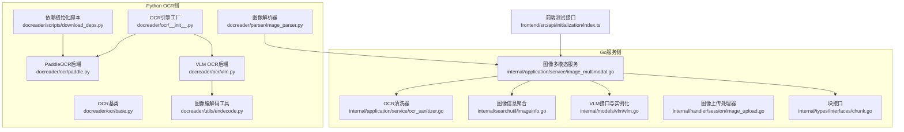
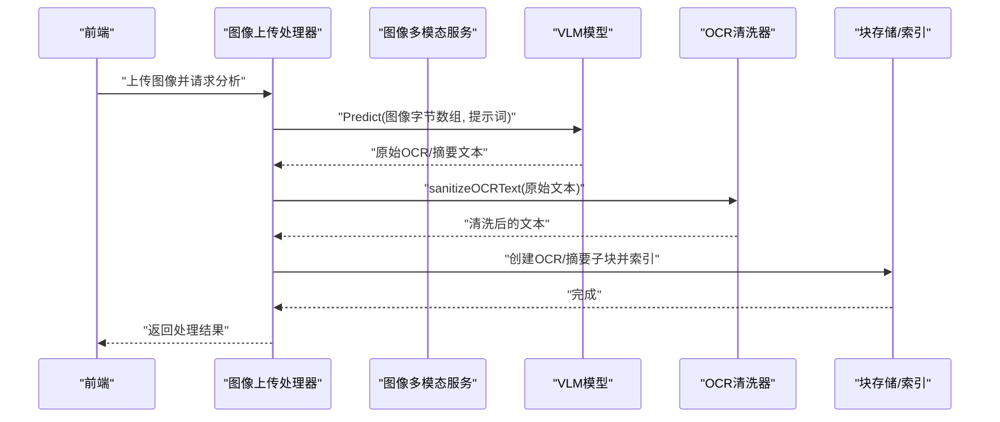
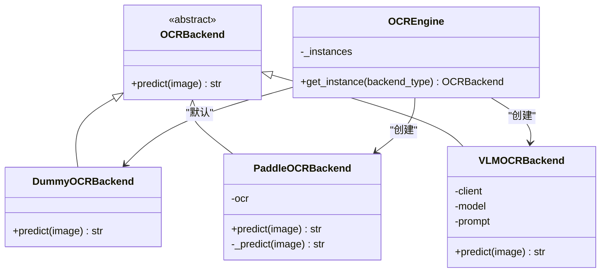
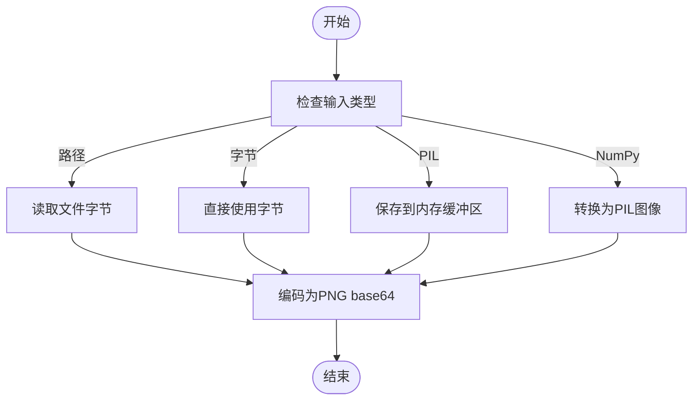
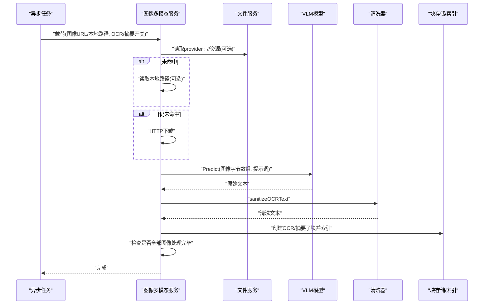
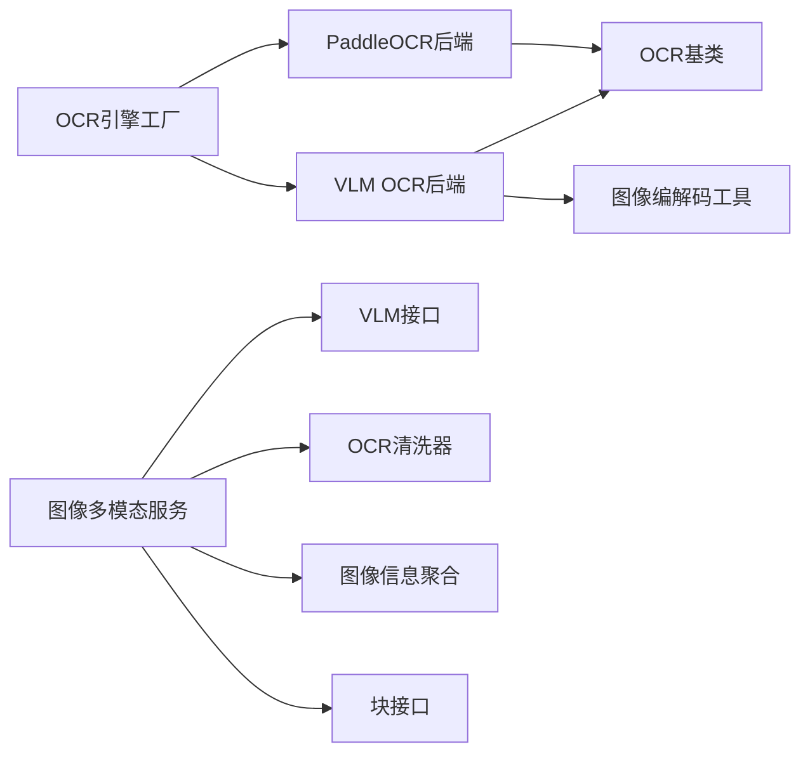

# 图像处理与OCR

<cite>
**本文引用的文件**
- [docreader/ocr/__init__.py](file://docreader/ocr/__init__.py)
- [docreader/ocr/base.py](file://docreader/ocr/base.py)
- [docreader/ocr/paddle.py](file://docreader/ocr/paddle.py)
- [docreader/ocr/vlm.py](file://docreader/ocr/vlm.py)
- [docreader/utils/endecode.py](file://docreader/utils/endecode.py)
- [docreader/parser/image_parser.py](file://docreader/parser/image_parser.py)
- [docreader/scripts/download_deps.py](file://docreader/scripts/download_deps.py)
- [internal/application/service/image_multimodal.go](file://internal/application/service/image_multimodal.go)
- [internal/application/service/ocr_sanitizer.go](file://internal/application/service/ocr_sanitizer.go)
- [internal/searchutil/imageinfo.go](file://internal/searchutil/imageinfo.go)
- [internal/handler/session/image_upload.go](file://internal/handler/session/image_upload.go)
- [internal/models/vlm/vlm.go](file://internal/models/vlm/vlm.go)
- [internal/types/interfaces/chunk.go](file://internal/types/interfaces/chunk.go)
- [frontend/src/api/initialization/index.ts](file://frontend/src/api/initialization/index.ts)
</cite>

## 目录
1. [简介](#简介)
2. [项目结构](#项目结构)
3. [核心组件](#核心组件)
4. [架构总览](#架构总览)
5. [组件详解](#组件详解)
6. [依赖关系分析](#依赖关系分析)
7. [性能考量](#性能考量)
8. [故障排查指南](#故障排查指南)
9. [结论](#结论)
10. [附录](#附录)

## 简介
本文件面向WeKnora的图像处理与OCR能力，系统性梳理图像预处理、OCR引擎集成、文本提取与后处理的实现机制。重点覆盖以下方面：
- OCR后端选择：PaddleOCR与VLM（OpenAI兼容接口）两种路径
- 文档级图像解析与多模态处理流程
- 文本后处理与质量清洗策略
- 多语言支持与提示词工程
- 性能优化与稳定性保障
- 自定义OCR引擎与图像处理算法的扩展方法

## 项目结构
围绕图像与OCR的关键目录与文件如下：
- Python OCR后端与工具
  - docreader/ocr：OCR后端工厂与具体实现（PaddleOCR、VLM）
  - docreader/utils：图像编解码与文本编码工具
  - docreader/parser：图像解析器（生成Markdown引用并携带内嵌图像数据）
  - docreader/scripts：依赖初始化与模型下载脚本
- Go服务端多模态处理
  - internal/application/service/image_multimodal.go：异步任务处理图像，执行OCR与VLM摘要，并构建子块
  - internal/application/service/ocr_sanitizer.go：OCR输出清洗与标准化
  - internal/searchutil/imageinfo.go：按块聚合图像信息，用于检索增强
  - internal/models/vlm/vlm.go：VLM抽象与实例化
  - internal/handler/session/image_upload.go：会话层图像上传与VLM分析
  - internal/types/interfaces/chunk.go：块接口与图像清理相关能力
- 前端测试入口
  - frontend/src/api/initialization/index.ts：多模态测试接口（含VLM参数）

**图表来源**
- [docreader/ocr/__init__.py:12-37](file://docreader/ocr/__init__.py#L12-L37)
- [docreader/ocr/paddle.py:16-176](file://docreader/ocr/paddle.py#L16-L176)
- [docreader/ocr/vlm.py:14-88](file://docreader/ocr/vlm.py#L14-L88)
- [docreader/utils/endecode.py:23-76](file://docreader/utils/endecode.py#L23-L76)
- [docreader/parser/image_parser.py:11-29](file://docreader/parser/image_parser.py#L11-L29)
- [docreader/scripts/download_deps.py:41-70](file://docreader/scripts/download_deps.py#L41-L70)
- [internal/application/service/image_multimodal.go:53-247](file://internal/application/service/image_multimodal.go#L53-L247)
- [internal/application/service/ocr_sanitizer.go:27-110](file://internal/application/service/ocr_sanitizer.go#L27-L110)
- [internal/searchutil/imageinfo.go:17-124](file://internal/searchutil/imageinfo.go#L17-L124)
- [internal/models/vlm/vlm.go:14-135](file://internal/models/vlm/vlm.go#L14-L135)
- [internal/handler/session/image_upload.go:81-113](file://internal/handler/session/image_upload.go#L81-L113)
- [internal/types/interfaces/chunk.go:15-149](file://internal/types/interfaces/chunk.go#L15-L149)
- [frontend/src/api/initialization/index.ts:349-387](file://frontend/src/api/initialization/index.ts#L349-L387)

**章节来源**
- [docreader/ocr/__init__.py:12-37](file://docreader/ocr/__init__.py#L12-L37)
- [docreader/ocr/paddle.py:16-176](file://docreader/ocr/paddle.py#L16-L176)
- [docreader/ocr/vlm.py:14-88](file://docreader/ocr/vlm.py#L14-L88)
- [docreader/utils/endecode.py:23-76](file://docreader/utils/endecode.py#L23-L76)
- [docreader/parser/image_parser.py:11-29](file://docreader/parser/image_parser.py#L11-L29)
- [docreader/scripts/download_deps.py:41-70](file://docreader/scripts/download_deps.py#L41-L70)
- [internal/application/service/image_multimodal.go:53-247](file://internal/application/service/image_multimodal.go#L53-L247)
- [internal/application/service/ocr_sanitizer.go:27-110](file://internal/application/service/ocr_sanitizer.go#L27-L110)
- [internal/searchutil/imageinfo.go:17-124](file://internal/searchutil/imageinfo.go#L17-L124)
- [internal/models/vlm/vlm.go:14-135](file://internal/models/vlm/vlm.go#L14-L135)
- [internal/handler/session/image_upload.go:81-113](file://internal/handler/session/image_upload.go#L81-L113)
- [internal/types/interfaces/chunk.go:15-149](file://internal/types/interfaces/chunk.go#L15-L149)
- [frontend/src/api/initialization/index.ts:349-387](file://frontend/src/api/initialization/index.ts#L349-L387)

## 核心组件
- OCR引擎工厂与后端
  - 工厂：根据类型返回PaddleOCR或VLM后端实例，支持单例缓存
  - PaddleOCR后端：本地CPU推理，适配不同CPU指令集，配置检测与降级
  - VLM OCR后端：OpenAI兼容接口，支持提示词工程与图像base64传输
- 图像编解码工具
  - 统一将多种输入（路径、字节、PIL、numpy）转换为base64字符串
- 文档级图像解析
  - 将独立图像文件解析为Markdown引用，并携带内嵌图像数据
- 多模态服务
  - 异步处理图像，读取/下载图像，调用VLM执行OCR与摘要，构建子块并索引
- OCR清洗器
  - 去除HTML包装、代码块包裹、空回复与多余换行，统一为Markdown
- 图像信息聚合
  - 聚合块级图像信息（OCR文本与摘要），支持两层父子关系合并
- VLM抽象与实例化
  - 支持Ollama本地、远端OpenAI风格、WeKnoraCloud等多种接入方式
- 前端测试接口
  - 提供多模态测试入口，便于验证VLM参数与处理链路

**章节来源**
- [docreader/ocr/__init__.py:12-37](file://docreader/ocr/__init__.py#L12-L37)
- [docreader/ocr/paddle.py:16-176](file://docreader/ocr/paddle.py#L16-L176)
- [docreader/ocr/vlm.py:14-88](file://docreader/ocr/vlm.py#L14-L88)
- [docreader/utils/endecode.py:23-76](file://docreader/utils/endecode.py#L23-L76)
- [docreader/parser/image_parser.py:11-29](file://docreader/parser/image_parser.py#L11-L29)
- [internal/application/service/image_multimodal.go:53-247](file://internal/application/service/image_multimodal.go#L53-L247)
- [internal/application/service/ocr_sanitizer.go:27-110](file://internal/application/service/ocr_sanitizer.go#L27-L110)
- [internal/searchutil/imageinfo.go:17-124](file://internal/searchutil/imageinfo.go#L17-L124)
- [internal/models/vlm/vlm.go:14-135](file://internal/models/vlm/vlm.go#L14-L135)
- [frontend/src/api/initialization/index.ts:349-387](file://frontend/src/api/initialization/index.ts#L349-L387)

## 架构总览
下图展示从图像上传到OCR与摘要生成、块创建与索引的完整流程。

**图表来源**
- [internal/handler/session/image_upload.go:81-113](file://internal/handler/session/image_upload.go#L81-L113)
- [internal/application/service/image_multimodal.go:93-247](file://internal/application/service/image_multimodal.go#L93-L247)
- [internal/application/service/ocr_sanitizer.go:27-110](file://internal/application/service/ocr_sanitizer.go#L27-L110)
- [internal/models/vlm/vlm.go:14-21](file://internal/models/vlm/vlm.go#L14-L21)

**章节来源**
- [internal/handler/session/image_upload.go:81-113](file://internal/handler/session/image_upload.go#L81-L113)
- [internal/application/service/image_multimodal.go:93-247](file://internal/application/service/image_multimodal.go#L93-L247)
- [internal/application/service/ocr_sanitizer.go:27-110](file://internal/application/service/ocr_sanitizer.go#L27-L110)
- [internal/models/vlm/vlm.go:14-21](file://internal/models/vlm/vlm.go#L14-L21)

## 组件详解

### OCR引擎工厂与后端
- 工厂职责
  - 线程安全地缓存不同后端实例，避免重复初始化
  - 支持“paddle”、“vlm”与“dummy”三种类型
- PaddleOCR后端
  - CPU优先，自动检测AVX能力并设置运行环境
  - 配置项覆盖检测阈值、识别模型、方向分类、膨胀与评分模式
  - 输入支持路径、字节与PIL对象，内部统一转为RGB数组
  - 输出为拼接后的文本串
- VLM OCR后端
  - 通过OpenAI兼容接口调用，构造消息结构包含图像URL与文本提示
  - 使用统一提示词模板，强调Markdown格式、表格HTML、公式LaTeX与阅读顺序
  - 返回模型生成的纯文本，后续由清洗器处理

**图表来源**
- [docreader/ocr/base.py:10-31](file://docreader/ocr/base.py#L10-L31)
- [docreader/ocr/paddle.py:16-176](file://docreader/ocr/paddle.py#L16-L176)
- [docreader/ocr/vlm.py:14-88](file://docreader/ocr/vlm.py#L14-L88)
- [docreader/ocr/__init__.py:12-37](file://docreader/ocr/__init__.py#L12-L37)

**章节来源**
- [docreader/ocr/__init__.py:12-37](file://docreader/ocr/__init__.py#L12-L37)
- [docreader/ocr/base.py:10-31](file://docreader/ocr/base.py#L10-L31)
- [docreader/ocr/paddle.py:16-176](file://docreader/ocr/paddle.py#L16-L176)
- [docreader/ocr/vlm.py:14-88](file://docreader/ocr/vlm.py#L14-L88)

### 图像预处理与编解码
- 输入适配
  - 支持文件路径、字节流、PIL图像对象与numpy数组
  - 统一转换为PNG格式并编码为base64字符串
- 用途
  - 为VLM OCR后端提供data URL所需的base64图像
  - 为文档解析器生成内嵌图像的Markdown引用

**图表来源**
- [docreader/utils/endecode.py:23-76](file://docreader/utils/endecode.py#L23-L76)

**章节来源**
- [docreader/utils/endecode.py:23-76](file://docreader/utils/endecode.py#L23-L76)

### 文档级图像解析
- 行为
  - 将独立图像文件解析为Markdown图片链接
  - 将图像内容以base64形式随文档返回，便于后续上传或内嵌
- 场景
  - 与Go侧的ImageResolver配合，完成存储上传与引用替换

**章节来源**
- [docreader/parser/image_parser.py:11-29](file://docreader/parser/image_parser.py#L11-L29)

### 多模态服务：OCR与摘要
- 任务处理
  - 解析任务载荷，解析租户与知识库上下文
  - 优先通过租户/知识库绑定的文件服务读取provider://资源，其次尝试本地路径，最后HTTP下载
  - 选择OCR或摘要提示词（扫描版PDF有专门提示词）
  - 调用VLM模型预测，对OCR结果进行清洗
  - 构建OCR与摘要两类子块，持久化并索引
  - 使用Redis计数器跟踪多图知识的处理进度，在全部完成后触发后处理任务
- 关键点
  - VLM解析支持新旧两种配置：ModelID（推荐）与内联BaseURL/APIKey
  - 清洗器过滤HTML包裹、空回复与多余换行，必要时转为Markdown

**图表来源**
- [internal/application/service/image_multimodal.go:93-247](file://internal/application/service/image_multimodal.go#L93-L247)
- [internal/application/service/ocr_sanitizer.go:27-110](file://internal/application/service/ocr_sanitizer.go#L27-L110)
- [internal/models/vlm/vlm.go:111-135](file://internal/models/vlm/vlm.go#L111-L135)

**章节来源**
- [internal/application/service/image_multimodal.go:93-247](file://internal/application/service/image_multimodal.go#L93-L247)
- [internal/application/service/ocr_sanitizer.go:27-110](file://internal/application/service/ocr_sanitizer.go#L27-L110)
- [internal/models/vlm/vlm.go:111-135](file://internal/models/vlm/vlm.go#L111-L135)

### OCR清洗与后处理
- 清洗策略
  - 去除首尾空白与代码块包裹
  - 判断是否为HTML文档：若HTML标签占比过高且去除标签后剩余字符过少，则判定为空无效内容
  - 若疑似HTML，尝试转换为Markdown
  - 过滤已知空回复（如“无文字内容”等）
  - 规范化换行
- 适用范围
  - VLM OCR输出清洗
  - 作为通用文本后处理模块复用

**章节来源**
- [internal/application/service/ocr_sanitizer.go:27-110](file://internal/application/service/ocr_sanitizer.go#L27-L110)

### 图像信息聚合与检索增强
- 聚合逻辑
  - 支持两层关系：文本块→图像块 或 父文本块→文本块→图像块
  - 按URL去重合并，优先保留OCR文本与摘要
- 应用场景
  - 在检索结果中注入图像信息，或将图像信息嵌入到文本内容中

**章节来源**
- [internal/searchutil/imageinfo.go:17-124](file://internal/searchutil/imageinfo.go#L17-L124)

### VLM抽象与实例化
- 接口
  - 统一的Predict签名，接收多张图像字节数组与提示词
- 实例化策略
  - Ollama本地（InterfaceType="ollama"或ModelSourceLocal）
  - 远端OpenAI风格（默认）
  - WeKnoraCloud特例
- 配置来源
  - 新式：从ModelService解析ModelID
  - 旧式：从知识库VLMConfig内联BaseURL/APIKey/ModelName

**章节来源**
- [internal/models/vlm/vlm.go:14-135](file://internal/models/vlm/vlm.go#L14-L135)

### 前端测试与参数
- 测试接口
  - 支持指定VLM模型、BaseURL、API Key、接口类型、存储类型等参数
  - 返回处理时间、OCR结果与摘要结果
- 用途
  - 快速验证多模态链路与VLM配置正确性

**章节来源**
- [frontend/src/api/initialization/index.ts:349-387](file://frontend/src/api/initialization/index.ts#L349-L387)

## 依赖关系分析
- 组件耦合
  - Go多模态服务依赖VLM抽象与清洗器，耦合度低，便于替换后端
  - Python OCR后端通过工厂统一管理，避免重复初始化
  - 图像编解码工具被VLM后端与文档解析器复用
- 外部依赖
  - PaddleOCR：本地CPU推理，需注意AVX指令集兼容
  - OpenAI兼容接口：VLM后端依赖外部API
  - Redis：用于多图知识处理进度计数
- 循环依赖
  - 未发现循环依赖，模块边界清晰

**图表来源**
- [docreader/ocr/base.py:10-31](file://docreader/ocr/base.py#L10-L31)
- [docreader/ocr/paddle.py:16-176](file://docreader/ocr/paddle.py#L16-L176)
- [docreader/ocr/vlm.py:14-88](file://docreader/ocr/vlm.py#L14-L88)
- [docreader/ocr/__init__.py:12-37](file://docreader/ocr/__init__.py#L12-L37)
- [docreader/utils/endecode.py:23-76](file://docreader/utils/endecode.py#L23-L76)
- [internal/application/service/image_multimodal.go:53-247](file://internal/application/service/image_multimodal.go#L53-L247)
- [internal/application/service/ocr_sanitizer.go:27-110](file://internal/application/service/ocr_sanitizer.go#L27-L110)
- [internal/searchutil/imageinfo.go:17-124](file://internal/searchutil/imageinfo.go#L17-L124)
- [internal/types/interfaces/chunk.go:15-149](file://internal/types/interfaces/chunk.go#L15-L149)

**章节来源**
- [docreader/ocr/base.py:10-31](file://docreader/ocr/base.py#L10-L31)
- [docreader/ocr/paddle.py:16-176](file://docreader/ocr/paddle.py#L16-L176)
- [docreader/ocr/vlm.py:14-88](file://docreader/ocr/vlm.py#L14-L88)
- [docreader/ocr/__init__.py:12-37](file://docreader/ocr/__init__.py#L12-L37)
- [docreader/utils/endecode.py:23-76](file://docreader/utils/endecode.py#L23-L76)
- [internal/application/service/image_multimodal.go:53-247](file://internal/application/service/image_multimodal.go#L53-L247)
- [internal/application/service/ocr_sanitizer.go:27-110](file://internal/application/service/ocr_sanitizer.go#L27-L110)
- [internal/searchutil/imageinfo.go:17-124](file://internal/searchutil/imageinfo.go#L17-L124)
- [internal/types/interfaces/chunk.go:15-149](file://internal/types/interfaces/chunk.go#L15-L149)

## 性能考量
- CPU与指令集
  - PaddleOCR后端会检测AVX能力并设置运行环境变量，避免非法指令导致崩溃
  - 若CPU不支持AVX，建议安装CPU-only版本或切换至VLM后端
- 模型初始化
  - PaddleOCR初始化会触发模型下载与缓存，建议在部署阶段提前初始化以降低首次延迟
- 并发与限流
  - 多模态服务使用Redis计数器跟踪待处理图像数量，全部完成后触发后处理，避免并发风暴
- I/O与网络
  - 优先使用租户/知识库绑定的文件服务读取资源，减少网络下载开销
  - VLM调用受外部API响应影响，建议配置合理的超时与重试策略

**章节来源**
- [docreader/ocr/paddle.py:25-67](file://docreader/ocr/paddle.py#L25-L67)
- [docreader/scripts/download_deps.py:52-66](file://docreader/scripts/download_deps.py#L52-L66)
- [internal/application/service/image_multimodal.go:390-410](file://internal/application/service/image_multimodal.go#L390-L410)

## 故障排查指南
- PaddleOCR初始化失败
  - 症状：导入失败或OS错误（非法指令/崩溃）
  - 处理：确认CPU指令集兼容，必要时安装CPU-only版本或切换后端
- VLM调用异常
  - 症状：客户端未初始化或API调用报错
  - 处理：检查API Key、BaseURL与模型名称；确认提示词格式正确
- OCR输出为空或HTML包裹
  - 症状：返回空文本或HTML文档
  - 处理：启用清洗器；检查提示词是否要求Markdown；确认图像质量与清晰度
- 多图知识处理未触发后处理
  - 症状：部分图像处理完成后未生成问题/摘要
  - 处理：检查Redis计数器是否归零；确认所有图像任务均已完成

**章节来源**
- [docreader/ocr/paddle.py:95-117](file://docreader/ocr/paddle.py#L95-L117)
- [docreader/ocr/vlm.py:50-52](file://docreader/ocr/vlm.py#L50-L52)
- [internal/application/service/ocr_sanitizer.go:27-110](file://internal/application/service/ocr_sanitizer.go#L27-L110)
- [internal/application/service/image_multimodal.go:390-410](file://internal/application/service/image_multimodal.go#L390-L410)

## 结论
WeKnora的图像处理与OCR体系采用“Python OCR后端 + Go多模态服务”的分层设计，既保证了灵活性（可插拔的OCR后端与VLM接入），又确保了生产可用性（清洗器、聚合与索引流程）。通过提示词工程与严格的后处理策略，系统在多语言、多格式文档场景下具备良好的鲁棒性。建议在部署阶段完成模型缓存与依赖初始化，并结合Redis计数器实现稳定的批量处理流程。

## 附录

### 多语言支持与提示词工程
- VLM提示词
  - 强制Markdown输出、表格HTML、公式LaTeX、忽略页眉页脚、按阅读顺序组织
  - 针对扫描版PDF提供专用提示词
- 文本编码
  - 清洗器内置HTML→Markdown转换，提升跨语言文档的可读性

**章节来源**
- [internal/application/service/image_multimodal.go:27-49](file://internal/application/service/image_multimodal.go#L27-L49)
- [internal/application/service/ocr_sanitizer.go:86-94](file://internal/application/service/ocr_sanitizer.go#L86-L94)

### 自定义OCR引擎集成步骤
- 实现OCRBackend接口
  - 提供predict方法，接受图像输入并返回文本
- 注册到工厂
  - 在OCR引擎工厂中添加类型分支，返回新后端实例
- 配置与部署
  - 在部署环境中安装所需依赖，确保模型缓存与初始化完成

**章节来源**
- [docreader/ocr/base.py:10-23](file://docreader/ocr/base.py#L10-L23)
- [docreader/ocr/__init__.py:18-37](file://docreader/ocr/__init__.py#L18-L37)

### 自定义图像处理算法开发要点
- 输入适配
  - 使用图像编解码工具统一路径、字节、PIL与numpy输入
- 输出规范
  - 保持与现有清洗器兼容的文本格式（Markdown/HTML）
- 性能与稳定性
  - 参考PaddleOCR的CPU指令集检测与降级策略，避免运行时崩溃
  - 对外调用增加超时与重试控制

**章节来源**
- [docreader/utils/endecode.py:23-76](file://docreader/utils/endecode.py#L23-L76)
- [docreader/ocr/paddle.py:25-67](file://docreader/ocr/paddle.py#L25-L67)