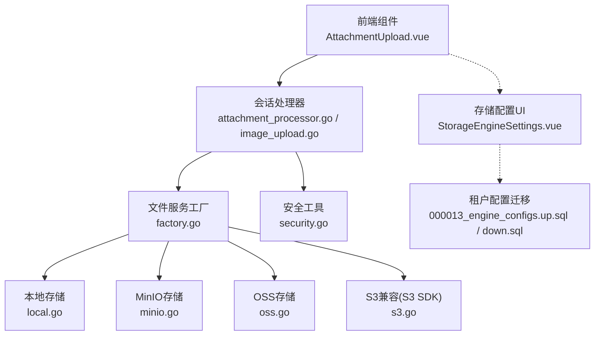
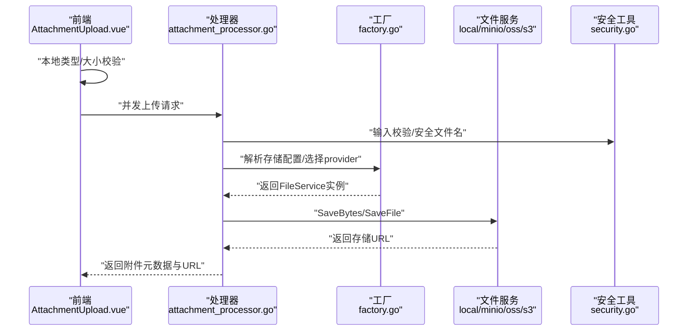
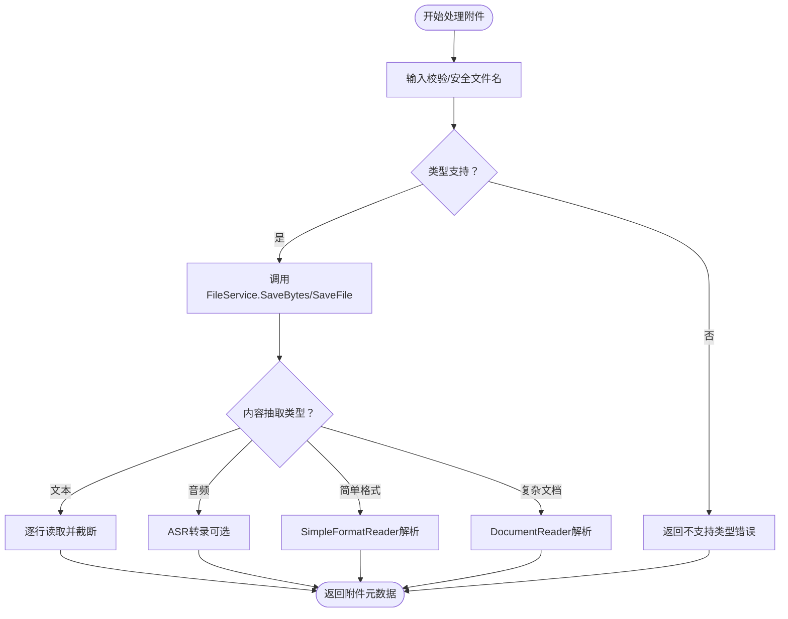
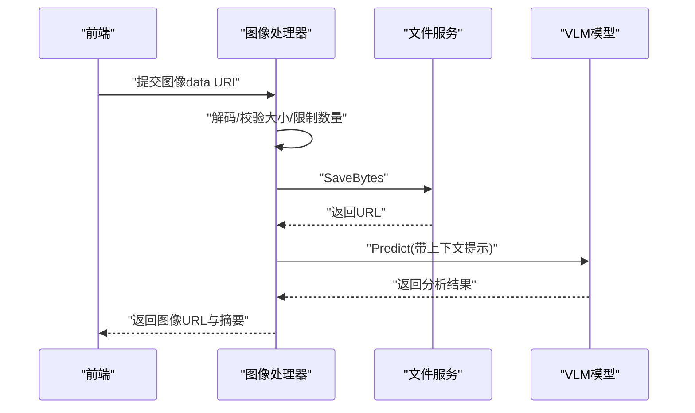
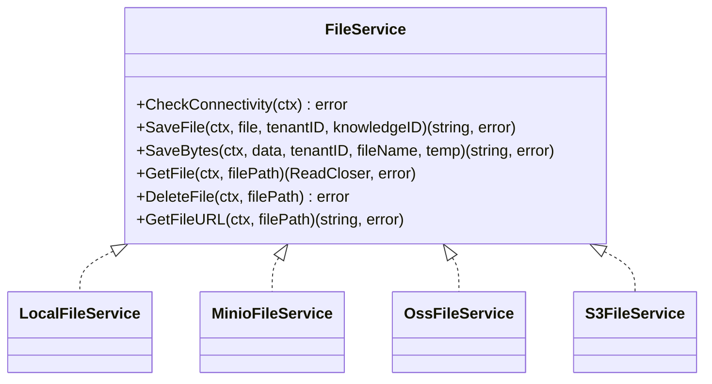
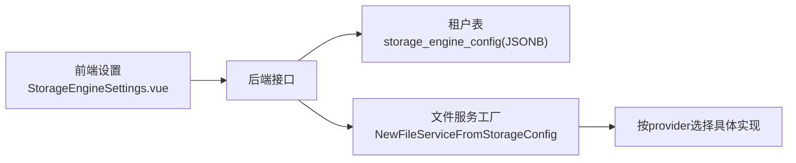
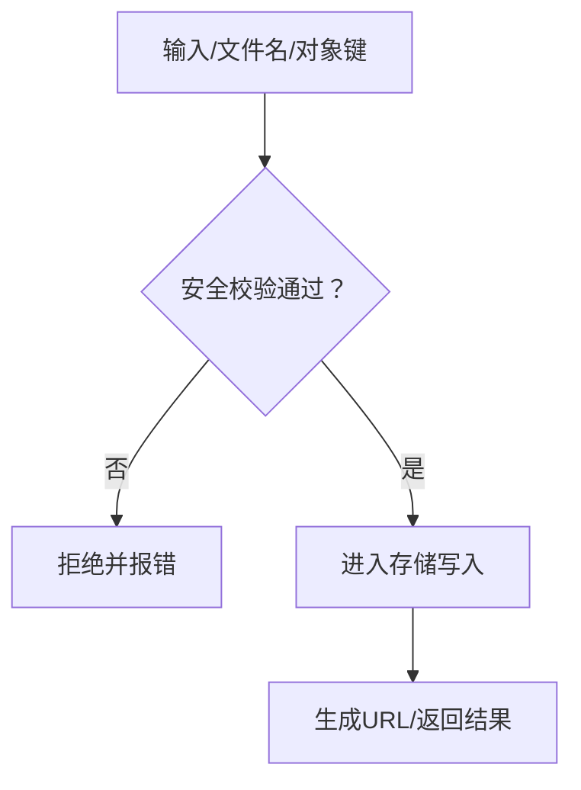
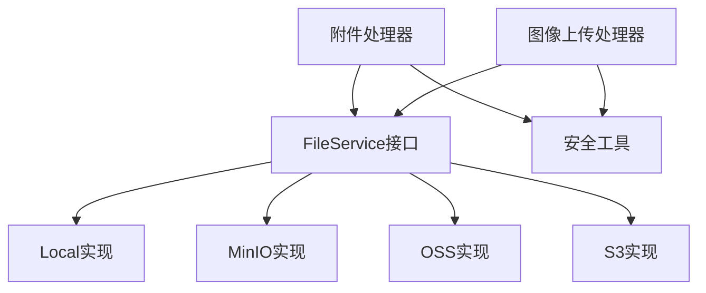

# 文件上传处理

<cite>
**本文引用的文件**
- [attachment_processor.go](file://internal/handler/session/attachment_processor.go)
- [image_upload.go](file://internal/handler/session/image_upload.go)
- [qa.go](file://internal/handler/session/qa.go)
- [local.go](file://internal/application/service/file/local.go)
- [oss.go](file://internal/application/service/file/oss.go)
- [s3.go](file://internal/application/service/file/s3.go)
- [minio.go](file://internal/application/service/file/minio.go)
- [factory.go](file://internal/application/service/file/factory.go)
- [security.go](file://internal/utils/security.go)
- [AttachmentUpload.vue](file://frontend/src/components/AttachmentUpload.vue)
- [StorageEngineSettings.vue](file://frontend/src/views/settings/StorageEngineSettings.vue)
- [000013_engine_configs.up.sql](file://migrations/versioned/000013_engine_configs.up.sql)
- [000013_engine_configs.down.sql](file://migrations/versioned/000013_engine_configs.down.sql)
</cite>

## 目录
1. [简介](#简介)
2. [项目结构](#项目结构)
3. [核心组件](#核心组件)
4. [架构总览](#架构总览)
5. [详细组件分析](#详细组件分析)
6. [依赖分析](#依赖分析)
7. [性能考虑](#性能考虑)
8. [故障排查指南](#故障排查指南)
9. [结论](#结论)
10. [附录](#附录)

## 简介
本文件面向WeKnora的文件上传处理机制，系统性梳理从前端到后端、从多存储后端到安全校验的完整链路。重点覆盖以下方面：
- 上传流程：前端选择与预检、后端接收与并发处理、存储落盘与URL生成
- 多存储后端：本地文件系统、S3兼容（MinIO）、阿里云OSS、腾讯云COS
- 安全验证：文件类型检测、大小限制、路径遍历防护、XSS/SSRF防护
- 进度监控与错误处理：并发与超时、失败回退与告警
- 性能优化：分片上传、预签名下载、对象键规范化
- 存储配置与权限管理：租户级配置、临时桶、凭据注入与白名单

## 项目结构
围绕文件上传的关键目录与文件如下：
- 前端组件：负责文件选择、类型与大小校验、触发上传
- 后端处理器：负责并发接收、安全校验、内容抽取、存储写入
- 存储服务：抽象统一的FileService接口，按提供商实现具体逻辑
- 工具与安全：输入校验、路径与对象键安全检查、URL与内容类型处理

**图表来源**
- [AttachmentUpload.vue:32-89](file://frontend/src/components/AttachmentUpload.vue#L32-L89)
- [attachment_processor.go:51-124](file://internal/handler/session/attachment_processor.go#L51-L124)
- [image_upload.go:21-59](file://internal/handler/session/image_upload.go#L21-L59)
- [factory.go:14-131](file://internal/application/service/file/factory.go#L14-L131)
- [local.go:18-101](file://internal/application/service/file/local.go#L18-L101)
- [minio.go:20-138](file://internal/application/service/file/minio.go#L20-L138)
- [oss.go:22-210](file://internal/application/service/file/oss.go#L22-L210)
- [s3.go:24-271](file://internal/application/service/file/s3.go#L24-L271)
- [security.go:75-152](file://internal/utils/security.go#L75-L152)
- [StorageEngineSettings.vue:766-799](file://frontend/src/views/settings/StorageEngineSettings.vue#L766-L799)
- [000013_engine_configs.up.sql:1-8](file://migrations/versioned/000013_engine_configs.up.sql#L1-L8)
- [000013_engine_configs.down.sql:1-3](file://migrations/versioned/000013_engine_configs.down.sql#L1-L3)

**章节来源**
- [AttachmentUpload.vue:32-89](file://frontend/src/components/AttachmentUpload.vue#L32-L89)
- [attachment_processor.go:51-124](file://internal/handler/session/attachment_processor.go#L51-L124)
- [image_upload.go:21-59](file://internal/handler/session/image_upload.go#L21-L59)
- [factory.go:14-131](file://internal/application/service/file/factory.go#L14-L131)
- [local.go:18-101](file://internal/application/service/file/local.go#L18-L101)
- [minio.go:20-138](file://internal/application/service/file/minio.go#L20-L138)
- [oss.go:22-210](file://internal/application/service/file/oss.go#L22-L210)
- [s3.go:24-271](file://internal/application/service/file/s3.go#L24-L271)
- [security.go:75-152](file://internal/utils/security.go#L75-L152)
- [StorageEngineSettings.vue:766-799](file://frontend/src/views/settings/StorageEngineSettings.vue#L766-L799)
- [000013_engine_configs.up.sql:1-8](file://migrations/versioned/000013_engine_configs.up.sql#L1-L8)
- [000013_engine_configs.down.sql:1-3](file://migrations/versioned/000013_engine_configs.down.sql#L1-L3)

## 核心组件
- 附件处理器：对单个附件执行安全校验、类型识别、内容抽取与存储写入，支持文本、音频（ASR）、简单格式（Markdown/CSV/JSON/图片）与复杂文档（PDF/DOCX/XLSX等）
- 图像上传处理器：针对图像进行解码、尺寸与数量限制、存储写入，并可选进行VLM分析
- 文件服务工厂：根据租户配置与显式provider参数，动态构建对应存储服务实例
- 多存储实现：本地文件系统、MinIO、OSS、S3兼容（AWS SDK）
- 安全工具：输入校验、路径遍历防护、对象键安全检查、URL合法性与SSRF防护

**章节来源**
- [attachment_processor.go:27-124](file://internal/handler/session/attachment_processor.go#L27-L124)
- [image_upload.go:21-59](file://internal/handler/session/image_upload.go#L21-L59)
- [factory.go:14-131](file://internal/application/service/file/factory.go#L14-L131)
- [local.go:18-101](file://internal/application/service/file/local.go#L18-L101)
- [minio.go:20-138](file://internal/application/service/file/minio.go#L20-L138)
- [oss.go:22-210](file://internal/application/service/file/oss.go#L22-L210)
- [s3.go:24-271](file://internal/application/service/file/s3.go#L24-L271)
- [security.go:75-152](file://internal/utils/security.go#L75-L152)

## 架构总览
整体流程：前端选择文件并做本地校验，后端并发接收与处理，依据租户配置选择存储后端，完成写入与URL生成，最终将元数据与URL返回给前端。

**图表来源**
- [AttachmentUpload.vue:57-92](file://frontend/src/components/AttachmentUpload.vue#L57-L92)
- [attachment_processor.go:51-124](file://internal/handler/session/attachment_processor.go#L51-L124)
- [factory.go:14-131](file://internal/application/service/file/factory.go#L14-L131)
- [local.go:150-184](file://internal/application/service/file/local.go#L150-L184)
- [minio.go:114-138](file://internal/application/service/file/minio.go#L114-L138)
- [oss.go:160-210](file://internal/application/service/file/oss.go#L160-L210)
- [s3.go:247-271](file://internal/application/service/file/s3.go#L247-L271)
- [security.go:75-152](file://internal/utils/security.go#L75-L152)

## 详细组件分析

### 附件处理与并发上传
- 并发处理：后端对多个附件并发处理，使用等待组与错误通道，任一失败即记录并继续其他任务
- 类型与大小：前端与后端均进行类型与大小限制，避免不支持格式与过大文件
- 内容抽取：根据扩展名区分文本、音频（ASR）、简单格式（Markdown/CSV/JSON/图片）与复杂文档，非致命错误仅记录警告
- 截断策略：纯文本类内容超过阈值行数自动截断，保留行数统计与截断标记

**图表来源**
- [attachment_processor.go:51-124](file://internal/handler/session/attachment_processor.go#L51-L124)
- [attachment_processor.go:126-272](file://internal/handler/session/attachment_processor.go#L126-L272)
- [qa.go:147-188](file://internal/handler/session/qa.go#L147-L188)

**章节来源**
- [attachment_processor.go:51-124](file://internal/handler/session/attachment_processor.go#L51-L124)
- [attachment_processor.go:126-272](file://internal/handler/session/attachment_processor.go#L126-L272)
- [qa.go:147-188](file://internal/handler/session/qa.go#L147-L188)

### 图像上传与VLM分析
- 图像限制：单张最大10MB，最多5张
- 解码与校验：支持data URI，自动推断扩展名，失败直接返回错误
- 存储：生成唯一文件名并写入存储，返回URL
- VLM分析：在聊天纯文本路径下，基于用户问题构建提示词，调用VLM模型进行分析并填充摘要

**图表来源**
- [image_upload.go:21-59](file://internal/handler/session/image_upload.go#L21-L59)
- [image_upload.go:61-93](file://internal/handler/session/image_upload.go#L61-L93)
- [image_upload.go:111-141](file://internal/handler/session/image_upload.go#L111-L141)

**章节来源**
- [image_upload.go:21-59](file://internal/handler/session/image_upload.go#L21-L59)
- [image_upload.go:61-93](file://internal/handler/session/image_upload.go#L61-L93)
- [image_upload.go:95-141](file://internal/handler/session/image_upload.go#L95-L141)

### 多存储后端实现差异
- 本地文件系统
  - 目录结构：按租户ID组织，导出目录存放临时/导出文件
  - 路径安全：严格限制在baseDir之下，防止路径遍历
  - URL：返回provider://格式，便于后端统一处理
- MinIO
  - 桶存在性检查与创建
  - 对象键规范化，支持预签名下载
- 阿里云OSS
  - 支持主桶与可选临时桶，按temp标志选择目标桶
  - 大文件自动分片上传（阈值与并发可配置）
  - 预签名下载URL有效期24小时
- S3兼容（AWS SDK）
  - 支持自定义endpoint（兼容非AWS S3服务）
  - 使用路径风格访问（endpoint/bucket/key）

**图表来源**
- [local.go:18-101](file://internal/application/service/file/local.go#L18-L101)
- [minio.go:20-138](file://internal/application/service/file/minio.go#L20-L138)
- [oss.go:22-210](file://internal/application/service/file/oss.go#L22-L210)
- [s3.go:24-271](file://internal/application/service/file/s3.go#L24-L271)

**章节来源**
- [local.go:18-101](file://internal/application/service/file/local.go#L18-L101)
- [minio.go:20-138](file://internal/application/service/file/minio.go#L20-L138)
- [oss.go:22-210](file://internal/application/service/file/oss.go#L22-L210)
- [s3.go:24-271](file://internal/application/service/file/s3.go#L24-L271)

### 存储配置与租户覆盖
- 前端设置页面：提供S3/OSS等配置项，保存后更新租户存储引擎配置
- 后端工厂：优先使用显式provider，其次使用租户配置中的默认provider
- 租户配置字段：JSONB类型，支持覆盖全局环境变量
- 迁移：新增storage_engine_config列，支持租户级覆盖

**图表来源**
- [StorageEngineSettings.vue:766-799](file://frontend/src/views/settings/StorageEngineSettings.vue#L766-L799)
- [factory.go:14-131](file://internal/application/service/file/factory.go#L14-L131)
- [000013_engine_configs.up.sql:1-8](file://migrations/versioned/000013_engine_configs.up.sql#L1-L8)
- [000013_engine_configs.down.sql:1-3](file://migrations/versioned/000013_engine_configs.down.sql#L1-L3)

**章节来源**
- [StorageEngineSettings.vue:766-799](file://frontend/src/views/settings/StorageEngineSettings.vue#L766-L799)
- [factory.go:14-131](file://internal/application/service/file/factory.go#L14-L131)
- [000013_engine_configs.up.sql:1-8](file://migrations/versioned/000013_engine_configs.up.sql#L1-L8)
- [000013_engine_configs.down.sql:1-3](file://migrations/versioned/000013_engine_configs.down.sql#L1-L3)

### 安全验证机制
- 输入校验：过滤控制字符、UTF-8校验、XSS模式匹配
- 路径遍历防护：本地文件系统与对象键均进行安全检查，拒绝逃逸路径
- URL与SSRF：仅允许http/https与特定provider协议，禁止私有/环回/保留域名与直连IP
- 文件名安全：仅保留基础文件名，拒绝包含“..”或过长名称

**图表来源**
- [security.go:75-152](file://internal/utils/security.go#L75-L152)
- [local.go:103-148](file://internal/application/service/file/local.go#L103-L148)
- [oss.go:144-158](file://internal/application/service/file/oss.go#L144-L158)
- [s3.go:31-48](file://internal/application/service/file/s3.go#L31-L48)

**章节来源**
- [security.go:75-152](file://internal/utils/security.go#L75-L152)
- [local.go:103-148](file://internal/application/service/file/local.go#L103-L148)
- [oss.go:144-158](file://internal/application/service/file/oss.go#L144-L158)
- [s3.go:31-48](file://internal/application/service/file/s3.go#L31-L48)

## 依赖分析
- 组件耦合
  - 处理器依赖文件服务接口，通过工厂解耦具体实现
  - 安全工具被广泛复用，贯穿输入、路径与对象键校验
- 外部依赖
  - MinIO SDK、OSS SDK v2、AWS S3 SDK
  - 前端Vue组件与国际化消息插件
- 循环依赖
  - 未发现直接循环依赖；各模块职责清晰

**图表来源**
- [attachment_processor.go:27-49](file://internal/handler/session/attachment_processor.go#L27-L49)
- [image_upload.go:21-59](file://internal/handler/session/image_upload.go#L21-L59)
- [factory.go:14-131](file://internal/application/service/file/factory.go#L14-L131)
- [local.go:18-101](file://internal/application/service/file/local.go#L18-L101)
- [minio.go:20-138](file://internal/application/service/file/minio.go#L20-L138)
- [oss.go:22-210](file://internal/application/service/file/oss.go#L22-L210)
- [s3.go:24-271](file://internal/application/service/file/s3.go#L24-L271)
- [security.go:75-152](file://internal/utils/security.go#L75-L152)

**章节来源**
- [attachment_processor.go:27-49](file://internal/handler/session/attachment_processor.go#L27-L49)
- [image_upload.go:21-59](file://internal/handler/session/image_upload.go#L21-L59)
- [factory.go:14-131](file://internal/application/service/file/factory.go#L14-L131)
- [local.go:18-101](file://internal/application/service/file/local.go#L18-L101)
- [minio.go:20-138](file://internal/application/service/file/minio.go#L20-L138)
- [oss.go:22-210](file://internal/application/service/file/oss.go#L22-L210)
- [s3.go:24-271](file://internal/application/service/file/s3.go#L24-L271)
- [security.go:75-152](file://internal/utils/security.go#L75-L152)

## 性能考虑
- 并发处理：后端对多个附件并发写入，提升吞吐
- 分片上传：OSS对大文件采用分片上传（阈值与并发可配置），降低内存占用
- 预签名下载：生成短期有效URL，减少服务端直传压力
- 超时控制：连接与桶存在性检查设置超时，避免阻塞
- 内容截断：纯文本类内容超过阈值行数自动截断，控制LLM上下文长度

**章节来源**
- [oss.go:178-207](file://internal/application/service/file/oss.go#L178-L207)
- [oss.go:301-329](file://internal/application/service/file/oss.go#L301-L329)
- [minio.go:63-81](file://internal/application/service/file/minio.go#L63-L81)
- [local.go:25-35](file://internal/application/service/file/local.go#L25-L35)
- [attachment_processor.go:126-157](file://internal/handler/session/attachment_processor.go#L126-L157)

## 故障排查指南
- 上传失败
  - 检查文件类型与大小限制（前后端双重限制）
  - 查看并发错误通道，定位具体附件索引
- 存储不可达
  - 使用CheckConnectivity方法验证桶/目录可用性
  - 确认凭据、endpoint、region、bucket等配置正确
- 路径遍历/对象键异常
  - 检查安全函数返回的错误信息，确认输入是否被拒绝
- URL无效/无法下载
  - 确认预签名URL有效期与协议
  - 检查SSRF白名单与URL合法性
- 前端UI问题
  - 确认SUPPORTED_TYPES与后端一致
  - 检查最大文件数与大小单位转换

**章节来源**
- [qa.go:147-188](file://internal/handler/session/qa.go#L147-L188)
- [local.go:25-35](file://internal/application/service/file/local.go#L25-L35)
- [oss.go:144-158](file://internal/application/service/file/oss.go#L144-L158)
- [s3.go:273-293](file://internal/application/service/file/s3.go#L273-L293)
- [security.go:154-186](file://internal/utils/security.go#L154-L186)
- [AttachmentUpload.vue:32-89](file://frontend/src/components/AttachmentUpload.vue#L32-L89)

## 结论
WeKnora的文件上传处理以“安全前置、并发高效、后端解耦”为核心设计原则。通过统一的FileService接口与多存储实现，结合严格的输入与路径安全检查，既满足多云/混合云部署需求，又保障了数据与系统的安全性。建议在生产环境中：
- 明确租户级存储配置，启用临时桶隔离导出数据
- 配置合适的并发与分片参数，平衡吞吐与资源
- 强化SSRF白名单与URL校验，定期审计访问日志
- 在前端与后端保持类型与大小列表一致，减少误判

## 附录
- 前端支持的文件类型与大小限制
  - 类型：PDF、DOC/DOCX、XLS/XLSX、PPT/PPTX、TXT、MD、CSV、JSON、XML、HTML、MP3/WAV/M4A/FLAC/OGG/AAC
  - 默认最大文件数：5，单文件默认20MB
- 后端支持的扩展名清单（与前端保持同步）
  - 文档：docx、doc、pdf、ppt、pptx
  - 电子表格：xlsx、xls
  - 文本/标记：md、markdown、txt、csv、json、xml、yaml、yml、log、html
  - 图片：jpg、jpeg、png、gif、bmp、tiff、webp
  - 音频：mp3、wav、m4a、flac、ogg、aac

**章节来源**
- [AttachmentUpload.vue:32-89](file://frontend/src/components/AttachmentUpload.vue#L32-L89)
- [attachment_processor.go:274-302](file://internal/handler/session/attachment_processor.go#L274-L302)