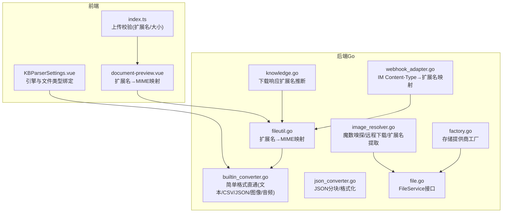
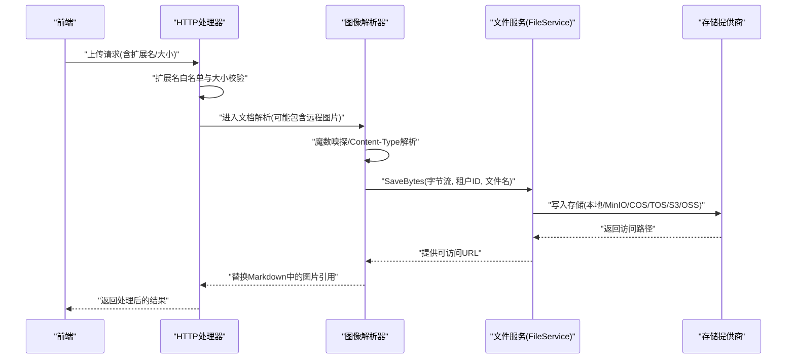
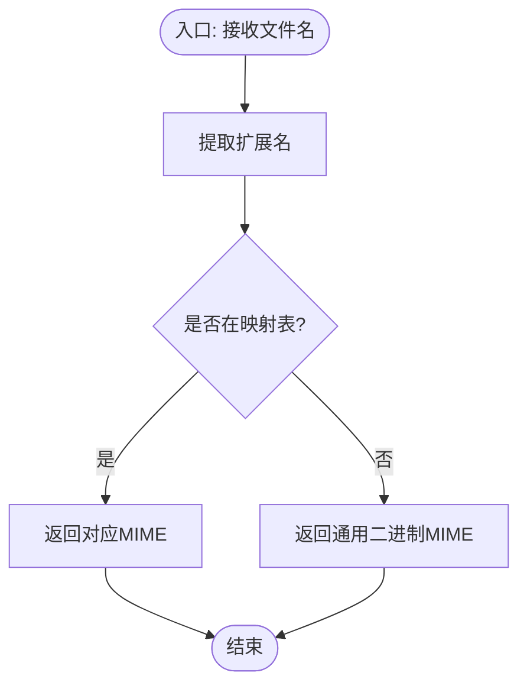
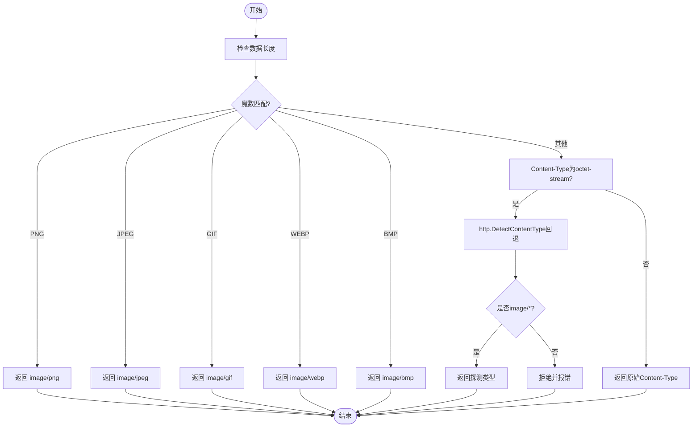
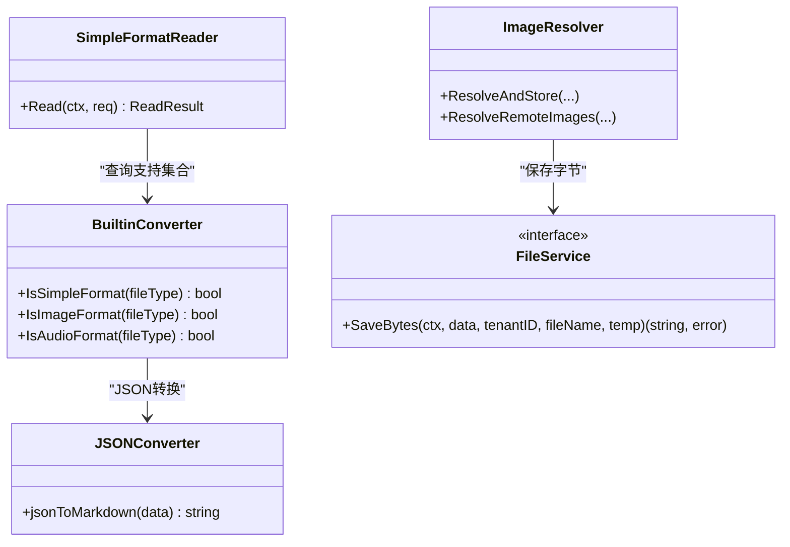
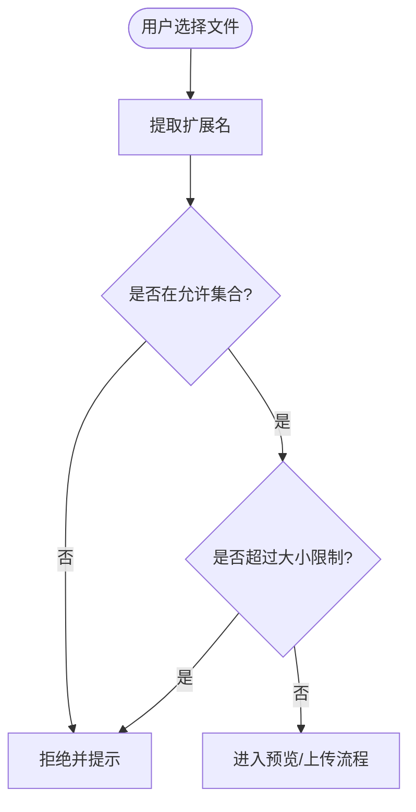
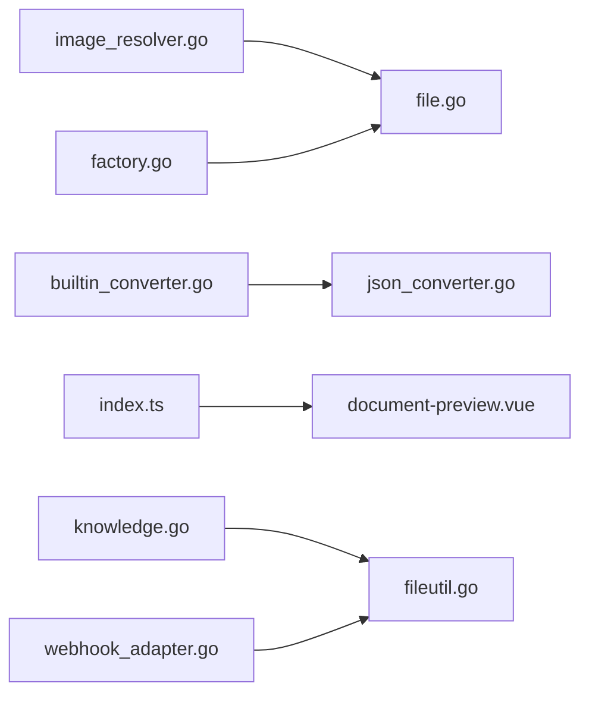

# 文件类型检测

<cite>
**本文引用的文件**
- [fileutil.go](file://internal/utils/fileutil.go)
- [image_resolver.go](file://internal/infrastructure/docparser/image_resolver.go)
- [builtin_converter.go](file://internal/infrastructure/docparser/builtin_converter.go)
- [json_converter.go](file://internal/infrastructure/docparser/json_converter.go)
- [file.go](file://internal/types/interfaces/file.go)
- [factory.go](file://internal/application/service/file/factory.go)
- [knowledge.go](file://internal/handler/knowledge.go)
- [webhook_adapter.go](file://internal/im/wecom/webhook_adapter.go)
- [document-preview.vue](file://frontend/src/components/document-preview.vue)
- [index.ts](file://frontend/src/utils/index.ts)
- [KBParserSettings.vue](file://frontend/src/views/knowledge/settings/KBParserSettings.vue)
- [openai.go](file://internal/models/asr/openai.go)
</cite>

## 目录
1. [简介](#简介)
2. [项目结构](#项目结构)
3. [核心组件](#核心组件)
4. [架构总览](#架构总览)
5. [详细组件分析](#详细组件分析)
6. [依赖分析](#依赖分析)
7. [性能考虑](#性能考虑)
8. [故障排查指南](#故障排查指南)
9. [结论](#结论)
10. [附录](#附录)

## 简介
本文件面向WeKnora的文件类型检测机制，系统性阐述以下能力与实现：
- 文件头识别：通过魔数（magic bytes）判定图像、音频等二进制格式
- MIME类型判断：结合HTTP探测、Content-Type解析与魔数回退
- 扩展名验证：基于扩展名映射与白名单进行前端与后端校验
- 支持的文件格式列表、检测优先级与回退策略
- 二进制文件分析、流式检测与内存优化
- 新格式接入建议、检测精度提升与性能优化实践

## 项目结构
围绕文件类型检测的关键模块分布于后端Go服务与前端Vue应用中：
- 后端Go侧
  - 工具层：扩展名到MIME映射
  - 文档解析层：图像魔数嗅探、远程图片下载与扩展名提取
  - 简单格式解析器：内置文本、CSV、JSON、图像、音频直通
  - 存储接口与工厂：统一文件服务抽象与多存储提供商适配
  - 处理器：下载响应时的扩展名推断
  - IM适配器：从Content-Type映射到扩展名
- 前端Vue侧
  - 预览组件：扩展名到MIME映射
  - 工具函数：上传前扩展名校验与大小限制
  - 知识库设置：引擎与文件类型的绑定与默认引擎选择

**图表来源**
- [fileutil.go:1-54](file://internal/utils/fileutil.go#L1-L54)
- [image_resolver.go:1-784](file://internal/infrastructure/docparser/image_resolver.go#L1-L784)
- [builtin_converter.go:1-222](file://internal/infrastructure/docparser/builtin_converter.go#L1-L222)
- [json_converter.go:1-272](file://internal/infrastructure/docparser/json_converter.go#L1-L272)
- [file.go:1-27](file://internal/types/interfaces/file.go#L1-L27)
- [factory.go:1-132](file://internal/application/service/file/factory.go#L1-L132)
- [knowledge.go:784-811](file://internal/handler/knowledge.go#L784-L811)
- [webhook_adapter.go:673-696](file://internal/im/wecom/webhook_adapter.go#L673-L696)
- [document-preview.vue:67-100](file://frontend/src/components/document-preview.vue#L67-L100)
- [index.ts:49-68](file://frontend/src/utils/index.ts#L49-L68)
- [KBParserSettings.vue:190-233](file://frontend/src/views/knowledge/settings/KBParserSettings.vue#L190-L233)

**章节来源**
- [fileutil.go:1-54](file://internal/utils/fileutil.go#L1-L54)
- [image_resolver.go:1-784](file://internal/infrastructure/docparser/image_resolver.go#L1-L784)
- [builtin_converter.go:1-222](file://internal/infrastructure/docparser/builtin_converter.go#L1-L222)
- [json_converter.go:1-272](file://internal/infrastructure/docparser/json_converter.go#L1-L272)
- [file.go:1-27](file://internal/types/interfaces/file.go#L1-L27)
- [factory.go:1-132](file://internal/application/service/file/factory.go#L1-L132)
- [knowledge.go:784-811](file://internal/handler/knowledge.go#L784-L811)
- [webhook_adapter.go:673-696](file://internal/im/wecom/webhook_adapter.go#L673-L696)
- [document-preview.vue:67-100](file://frontend/src/components/document-preview.vue#L67-L100)
- [index.ts:49-68](file://frontend/src/utils/index.ts#L49-L68)
- [KBParserSettings.vue:190-233](file://frontend/src/views/knowledge/settings/KBParserSettings.vue#L190-L233)

## 核心组件
- 扩展名到MIME映射
  - 后端：基于扩展名返回标准MIME类型，用于简单格式直通与下载响应
  - 前端：扩展名到MIME映射，确保Blob类型一致性
- 图像魔数嗅探与远程图片处理
  - 基于魔数识别PNG/JPEG/GIF/WEBP/BMP
  - 远程图片下载时，先按Content-Type，再以octet-stream回退嗅探
- 简单格式直通解析器
  - 文本、CSV、JSON、图像、音频在Go侧直接处理，避免Python服务开销
- 存储服务抽象与工厂
  - 统一SaveBytes接口，屏蔽本地/MinIO/COS/TOS/S3/OSS差异
- 下载响应与IM适配
  - 下载时根据扩展名推断MIME；IM回调中将Content-Type映射为扩展名

**章节来源**
- [fileutil.go:1-54](file://internal/utils/fileutil.go#L1-L54)
- [image_resolver.go:222-245](file://internal/infrastructure/docparser/image_resolver.go#L222-L245)
- [builtin_converter.go:14-43](file://internal/infrastructure/docparser/builtin_converter.go#L14-L43)
- [file.go:11-26](file://internal/types/interfaces/file.go#L11-L26)
- [factory.go:14-131](file://internal/application/service/file/factory.go#L14-L131)
- [knowledge.go:784-811](file://internal/handler/knowledge.go#L784-L811)
- [webhook_adapter.go:673-696](file://internal/im/wecom/webhook_adapter.go#L673-L696)

## 架构总览
WeKnora的文件类型检测贯穿“前端校验—后端解析—存储落盘”的完整链路。前端负责快速过滤不支持的扩展名与超大文件；后端在解析阶段采用“扩展名→MIME→魔数”三层策略，并对远程资源进行安全下载与类型确认。

**图表来源**
- [index.ts:49-68](file://frontend/src/utils/index.ts#L49-L68)
- [image_resolver.go:631-717](file://internal/infrastructure/docparser/image_resolver.go#L631-L717)
- [file.go:17-19](file://internal/types/interfaces/file.go#L17-L19)
- [factory.go:14-131](file://internal/application/service/file/factory.go#L14-L131)

## 详细组件分析

### 组件A：扩展名到MIME映射与下载响应
- 后端扩展名映射
  - 覆盖常见文档、图片、音视频、压缩包、脚本等格式
  - 默认未知扩展名返回通用二进制类型
- 下载响应扩展名推断
  - 从文件名提取扩展名并映射为MIME类型，用于浏览器正确渲染或下载

**图表来源**
- [fileutil.go:5-53](file://internal/utils/fileutil.go#L5-L53)
- [knowledge.go:784-811](file://internal/handler/knowledge.go#L784-L811)

**章节来源**
- [fileutil.go:1-54](file://internal/utils/fileutil.go#L1-L54)
- [knowledge.go:784-811](file://internal/handler/knowledge.go#L784-L811)

### 组件B：图像魔数嗅探与远程图片处理
- 魔数嗅探
  - 依据PNG/JPEG/GIF/WEBP/BMP头部字节判断真实类型
- 远程图片下载
  - 优先使用Content-Type；若为通用二进制则回退嗅探
  - 限制最大下载体积与并发数量，防止资源滥用
- 扩展名提取
  - 优先从MIME映射，其次从URL路径，最后回退为安全默认

**图表来源**
- [image_resolver.go:222-245](file://internal/infrastructure/docparser/image_resolver.go#L222-L245)
- [image_resolver.go:719-772](file://internal/infrastructure/docparser/image_resolver.go#L719-L772)
- [image_resolver.go:166-183](file://internal/infrastructure/docparser/image_resolver.go#L166-L183)
- [image_resolver.go:774-783](file://internal/infrastructure/docparser/image_resolver.go#L774-L783)

**章节来源**
- [image_resolver.go:222-245](file://internal/infrastructure/docparser/image_resolver.go#L222-L245)
- [image_resolver.go:719-772](file://internal/infrastructure/docparser/image_resolver.go#L719-L772)
- [image_resolver.go:166-183](file://internal/infrastructure/docparser/image_resolver.go#L166-L183)
- [image_resolver.go:774-783](file://internal/infrastructure/docparser/image_resolver.go#L774-L783)

### 组件C：简单格式直通解析器（文本/CSV/JSON/图像/音频）
- 支持格式集合
  - 文本/CSV/JSON/图像/音频均在Go侧直接处理
- 解析流程
  - 依据文件类型分流至对应处理器
  - 图像/音频保留原始字节供后续处理（如OCR/ASR）

**图表来源**
- [builtin_converter.go:14-43](file://internal/infrastructure/docparser/builtin_converter.go#L14-L43)
- [builtin_converter.go:50-80](file://internal/infrastructure/docparser/builtin_converter.go#L50-L80)
- [json_converter.go:20-69](file://internal/infrastructure/docparser/json_converter.go#L20-L69)
- [image_resolver.go:75-164](file://internal/infrastructure/docparser/image_resolver.go#L75-L164)
- [file.go:17-19](file://internal/types/interfaces/file.go#L17-L19)

**章节来源**
- [builtin_converter.go:14-43](file://internal/infrastructure/docparser/builtin_converter.go#L14-L43)
- [builtin_converter.go:50-80](file://internal/infrastructure/docparser/builtin_converter.go#L50-L80)
- [json_converter.go:20-69](file://internal/infrastructure/docparser/json_converter.go#L20-L69)
- [image_resolver.go:75-164](file://internal/infrastructure/docparser/image_resolver.go#L75-L164)
- [file.go:17-19](file://internal/types/interfaces/file.go#L17-L19)

### 组件D：前端扩展名校验与预览
- 上传前校验
  - 默认允许类型集合覆盖常见文档与媒体格式
  - 超过阈值直接拒绝
- 扩展名到MIME映射
  - 保证Blob类型与预期一致，避免浏览器误判
- 引擎与文件类型绑定
  - 设置页面根据文件类型选择可用解析引擎与默认引擎

**图表来源**
- [index.ts:49-68](file://frontend/src/utils/index.ts#L49-L68)
- [document-preview.vue:67-100](file://frontend/src/components/document-preview.vue#L67-L100)
- [KBParserSettings.vue:190-233](file://frontend/src/views/knowledge/settings/KBParserSettings.vue#L190-L233)

**章节来源**
- [index.ts:49-68](file://frontend/src/utils/index.ts#L49-L68)
- [document-preview.vue:67-100](file://frontend/src/components/document-preview.vue#L67-L100)
- [KBParserSettings.vue:190-233](file://frontend/src/views/knowledge/settings/KBParserSettings.vue#L190-L233)

### 组件E：IM回调中的Content-Type到扩展名映射
- 将IM收到的Content-Type标准化为小写并去除参数部分
- 映射到常见扩展名，便于后续处理与展示

**章节来源**
- [webhook_adapter.go:673-696](file://internal/im/wecom/webhook_adapter.go#L673-L696)

## 依赖分析
- 组件耦合
  - 图像解析器依赖文件服务接口，解耦存储实现
  - 简单格式解析器依赖内置转换器与JSON转换器
  - 前端工具与组件依赖后端映射表，保持一致性
- 外部依赖
  - HTTP客户端用于远程图片下载，具备超时与重定向限制
  - 存储提供商工厂按配置动态创建具体实现

**图表来源**
- [image_resolver.go:1-784](file://internal/infrastructure/docparser/image_resolver.go#L1-L784)
- [file.go:1-27](file://internal/types/interfaces/file.go#L1-L27)
- [builtin_converter.go:1-222](file://internal/infrastructure/docparser/builtin_converter.go#L1-L222)
- [json_converter.go:1-272](file://internal/infrastructure/docparser/json_converter.go#L1-L272)
- [index.ts:49-68](file://frontend/src/utils/index.ts#L49-L68)
- [document-preview.vue:67-100](file://frontend/src/components/document-preview.vue#L67-L100)
- [knowledge.go:784-811](file://internal/handler/knowledge.go#L784-L811)
- [webhook_adapter.go:673-696](file://internal/im/wecom/webhook_adapter.go#L673-L696)
- [factory.go:1-132](file://internal/application/service/file/factory.go#L1-L132)

**章节来源**
- [image_resolver.go:1-784](file://internal/infrastructure/docparser/image_resolver.go#L1-L784)
- [file.go:1-27](file://internal/types/interfaces/file.go#L1-L27)
- [builtin_converter.go:1-222](file://internal/infrastructure/docparser/builtin_converter.go#L1-L222)
- [json_converter.go:1-272](file://internal/infrastructure/docparser/json_converter.go#L1-L272)
- [index.ts:49-68](file://frontend/src/utils/index.ts#L49-L68)
- [document-preview.vue:67-100](file://frontend/src/components/document-preview.vue#L67-L100)
- [knowledge.go:784-811](file://internal/handler/knowledge.go#L784-L811)
- [webhook_adapter.go:673-696](file://internal/im/wecom/webhook_adapter.go#L673-L696)
- [factory.go:1-132](file://internal/application/service/file/factory.go#L1-L132)

## 性能考虑
- 二进制魔数嗅探成本低，仅需少量字节读取
- 远程图片下载限制体积与并发，避免内存峰值与DoS风险
- 简单格式直通减少跨语言调用与进程切换开销
- 前端上传前校验降低无效请求比例
- 存储写入采用统一接口，便于横向扩展与缓存优化

[本节为通用性能讨论，无需特定文件来源]

## 故障排查指南
- 远程图片无法显示
  - 检查Content-Type是否为image/*或octet-stream被正确嗅探
  - 确认下载体积未超过限制，且未触发SSRF拦截
- 扩展名不生效
  - 确认前端扩展名校验集合包含该类型
  - 检查后端下载响应扩展名推断逻辑
- IM回调文件类型异常
  - 检查Content-Type标准化与映射表是否覆盖该类型
- 音频格式识别
  - 若为MP3/M4A/OGG/WAV，可通过魔数或ftyp box辅助识别

**章节来源**
- [image_resolver.go:719-772](file://internal/infrastructure/docparser/image_resolver.go#L719-L772)
- [index.ts:49-68](file://frontend/src/utils/index.ts#L49-L68)
- [knowledge.go:784-811](file://internal/handler/knowledge.go#L784-L811)
- [webhook_adapter.go:673-696](file://internal/im/wecom/webhook_adapter.go#L673-L696)
- [openai.go:132-147](file://internal/models/asr/openai.go#L132-L147)

## 结论
WeKnora的文件类型检测采用“扩展名→MIME→魔数”的分层策略，结合前端快速校验与后端安全嗅探，既保证了准确性又兼顾性能。通过简单格式直通与统一存储接口，系统在可维护性与扩展性上取得良好平衡。

[本节为总结性内容，无需特定文件来源]

## 附录

### 支持的文件格式与检测优先级
- 文档类
  - PDF、DOC、DOCX、XLS、XLSX、PPT、PPTX、TXT、MD、CSV
- 图像类
  - PNG、JPG/JPEG、GIF、WEBP、BMP、SVG、TIFF
- 音频类
  - MP3、WAV、M4A、FLAC、OGG
- 其他
  - ZIP、TAR、GZ、HTML、CSS、JS、TS、PY、JAVA、GO等

检测优先级与回退策略
- 优先使用扩展名映射
- 其次使用Content-Type解析
- 最后使用魔数嗅探（octet-stream回退）
- 远程资源额外限制体积与并发

**章节来源**
- [fileutil.go:5-53](file://internal/utils/fileutil.go#L5-L53)
- [image_resolver.go:222-245](file://internal/infrastructure/docparser/image_resolver.go#L222-L245)
- [image_resolver.go:719-772](file://internal/infrastructure/docparser/image_resolver.go#L719-L772)
- [builtin_converter.go:14-43](file://internal/infrastructure/docparser/builtin_converter.go#L14-L43)
- [document-preview.vue:67-100](file://frontend/src/components/document-preview.vue#L67-L100)
- [index.ts:43-43](file://frontend/src/utils/index.ts#L43-L43)

### 新格式支持添加实践
- 后端
  - 在扩展名映射中增加新扩展名与MIME
  - 如为二进制格式，在魔数嗅探处补充识别规则
  - 在简单格式直通集合中注册（如Go侧可直接处理）
- 前端
  - 在默认允许集合中加入新扩展名
  - 如涉及预览/语法高亮，完善MIME到语言映射
- IM与下载
  - 在Content-Type映射中补充对应扩展名
  - 在下载响应扩展名推断中完善映射

**章节来源**
- [fileutil.go:5-53](file://internal/utils/fileutil.go#L5-L53)
- [image_resolver.go:222-245](file://internal/infrastructure/docparser/image_resolver.go#L222-L245)
- [builtin_converter.go:14-43](file://internal/infrastructure/docparser/builtin_converter.go#L14-L43)
- [document-preview.vue:67-100](file://frontend/src/components/document-preview.vue#L67-L100)
- [webhook_adapter.go:673-696](file://internal/im/wecom/webhook_adapter.go#L673-L696)
- [knowledge.go:784-811](file://internal/handler/knowledge.go#L784-L811)

### 检测精度提升与性能优化建议
- 提升精度
  - 对于模糊魔数（如MP3/M4A），结合ftyp box增强识别
  - 对octet-stream回退，限定嗅探范围与字节数
- 性能优化
  - 远程图片下载使用限流与并发控制
  - 简单格式直通避免不必要的跨语言调用
  - 存储写入采用异步批处理与缓存策略

**章节来源**
- [image_resolver.go:719-772](file://internal/infrastructure/docparser/image_resolver.go#L719-L772)
- [builtin_converter.go:50-80](file://internal/infrastructure/docparser/builtin_converter.go#L50-L80)
- [factory.go:14-131](file://internal/application/service/file/factory.go#L14-L131)