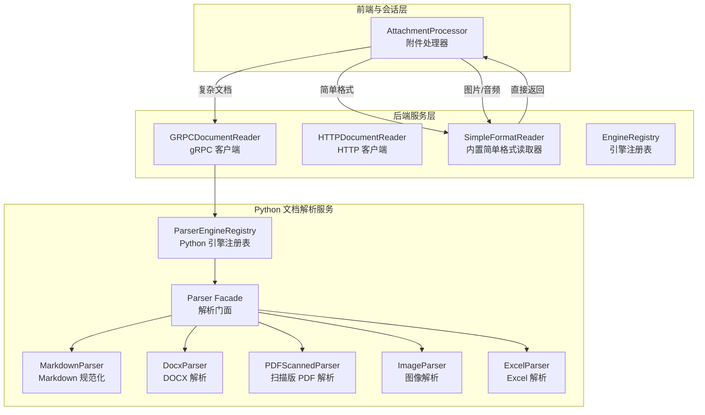
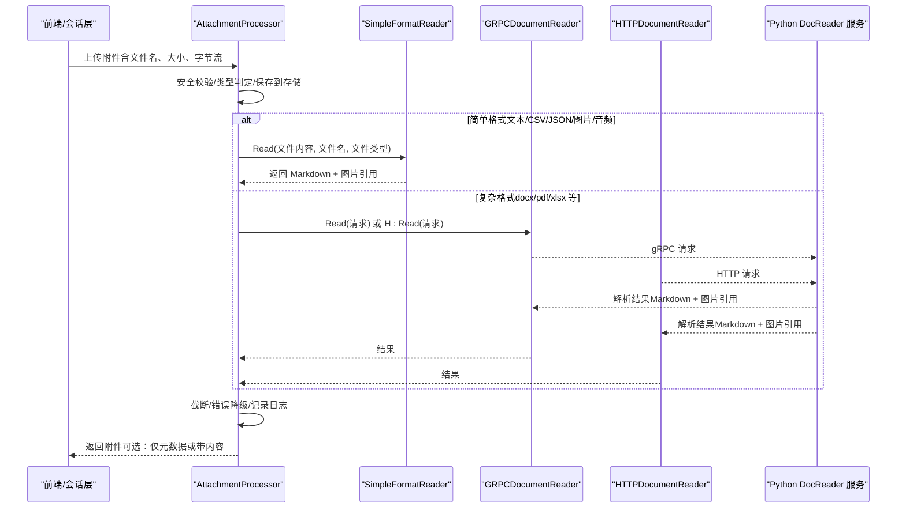
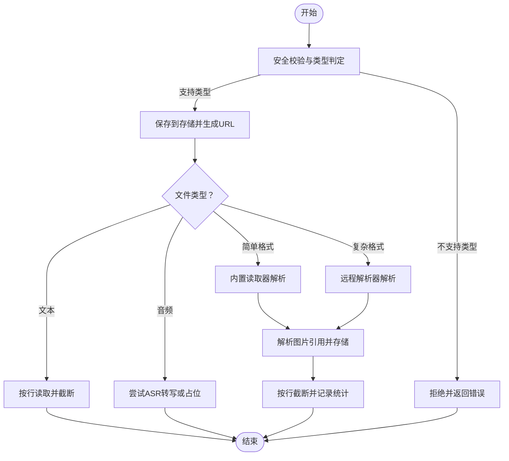
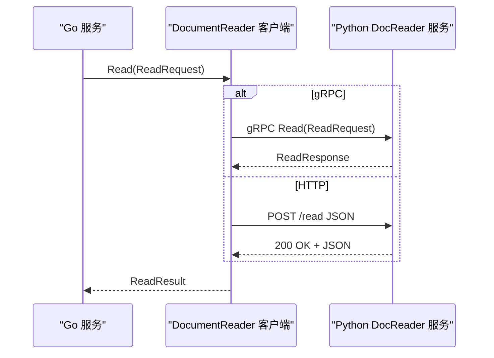
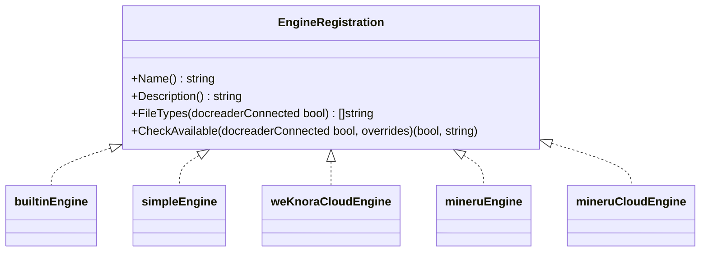
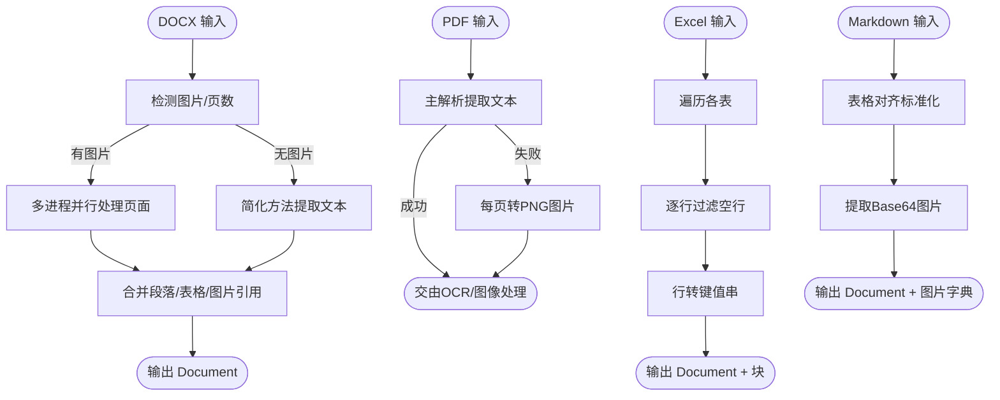
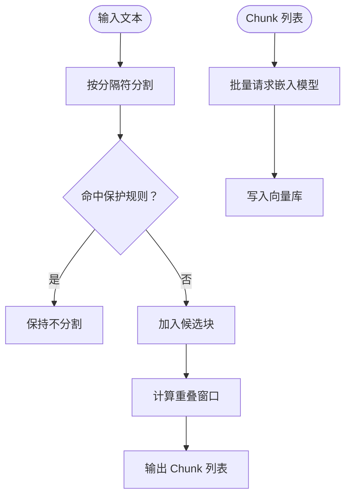
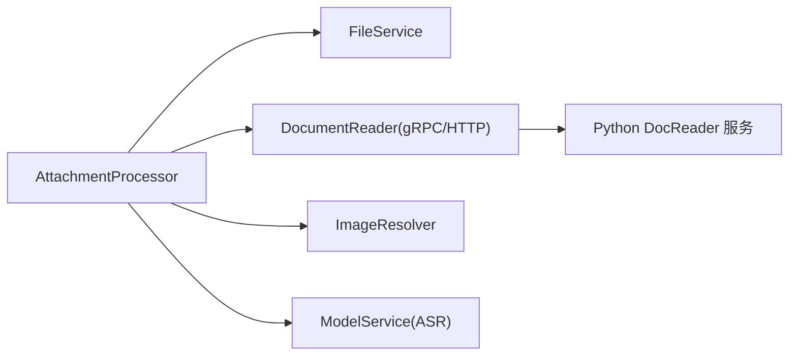

# 文档处理流程

<cite>
**本文引用的文件**
- [attachment_processor.go](file://internal/handler/session/attachment_processor.go)
- [grpc_parser.go](file://internal/infrastructure/docparser/grpc_parser.go)
- [http_parser.go](file://internal/infrastructure/docparser/http_parser.go)
- [builtin_converter.go](file://internal/infrastructure/docparser/builtin_converter.go)
- [engine_registry.go](file://internal/infrastructure/docparser/engine_registry.go)
- [splitter.go](file://internal/infrastructure/chunker/splitter.go)
- [docx_parser.py](file://docreader/parser/docx_parser.py)
- [pdf_parser.py](file://docreader/parser/pdf_parser.py)
- [excel_parser.py](file://docreader/parser/excel_parser.py)
- [markdown_parser.py](file://docreader/parser/markdown_parser.py)
- [image_parser.py](file://docreader/parser/image_parser.py)
- [registry.py](file://docreader/parser/registry.py)
- [parser.py](file://docreader/parser/parser.py)
- [doc_parser.py](file://docreader/parser/doc_parser.py)
- [system.go](file://client/system.go)
- [docreader.pb.go](file://docreader/proto/docreader.pb.go)
- [docreader.pb2.py](file://docreader/proto/docreader_pb2.py)
- [openai.go](file://internal/models/embedding/openai.go)
- [nvidia.go](file://internal/models/embedding/nvidia.go)
</cite>

## 目录
1. [简介](#简介)
2. [项目结构](#项目结构)
3. [核心组件](#核心组件)
4. [架构总览](#架构总览)
5. [详细组件分析](#详细组件分析)
6. [依赖分析](#依赖分析)
7. [性能考虑](#性能考虑)
8. [故障排查指南](#故障排查指南)
9. [结论](#结论)
10. [附录](#附录)

## 简介
本技术文档围绕 WeKnora 的文档处理流程展开，覆盖从文件上传到解析、分块、向量化与检索的完整链路。重点包括：
- 文件上传处理机制与安全校验
- 多格式文档支持与解析引擎选择
- 解析器架构、并发处理与错误恢复策略
- 图像处理、OCR 识别、元数据提取与质量控制
- 分块算法与向量化过程
- 缓存策略、性能优化与扩展指南

## 项目结构
WeKnora 将文档处理分为三层：
- 前端与会话层：负责附件上传、内容截断与提示注入
- 后端服务层：负责解析器选择、远程/本地解析、图片解析与存储
- Python 文档解析服务：提供复杂格式解析、OCR、Markdown 规范化等能力

**图表来源**
- [attachment_processor.go:51-124](file://internal/handler/session/attachment_processor.go#L51-L124)
- [grpc_parser.go:102-128](file://internal/infrastructure/docparser/grpc_parser.go#L102-L128)
- [http_parser.go:185-231](file://internal/infrastructure/docparser/http_parser.go#L185-L231)
- [builtin_converter.go:50-80](file://internal/infrastructure/docparser/builtin_converter.go#L50-L80)
- [engine_registry.go:27-33](file://internal/infrastructure/docparser/engine_registry.go#L27-L33)
- [registry.py:112-161](file://docreader/parser/registry.py#L112-L161)
- [parser.py:25-48](file://docreader/parser/parser.py#L25-L48)
- [markdown_parser.py:376-387](file://docreader/parser/markdown_parser.py#L376-L387)
- [docx_parser.py:102-207](file://docreader/parser/docx_parser.py#L102-L207)
- [pdf_parser.py:21-38](file://docreader/parser/pdf_parser.py#L21-L38)
- [image_parser.py:19-28](file://docreader/parser/image_parser.py#L19-L28)
- [excel_parser.py:43-97](file://docreader/parser/excel_parser.py#L43-L97)

**章节来源**
- [attachment_processor.go:51-124](file://internal/handler/session/attachment_processor.go#L51-L124)
- [grpc_parser.go:102-128](file://internal/infrastructure/docparser/grpc_parser.go#L102-L128)
- [http_parser.go:185-231](file://internal/infrastructure/docparser/http_parser.go#L185-L231)
- [builtin_converter.go:50-80](file://internal/infrastructure/docparser/builtin_converter.go#L50-L80)
- [engine_registry.go:27-33](file://internal/infrastructure/docparser/engine_registry.go#L27-L33)
- [registry.py:112-161](file://docreader/parser/registry.py#L112-L161)
- [parser.py:25-48](file://docreader/parser/parser.py#L25-L48)

## 核心组件
- 附件处理器（AttachmentProcessor）
  - 负责上传文件的安全校验、保存、类型判定与内容提取；对文本、音频、简单格式与复杂格式分别处理，并进行行数截断与错误降级。
- 解析器客户端（GRPCDocumentReader / HTTPDocumentReader）
  - 提供统一的 DocumentReader 接口，支持 gRPC 与 HTTP 两种传输方式，负责与 Python 文档解析服务通信。
- 内置简单格式读取器（SimpleFormatReader）
  - 在 Go 层直接处理纯文本、CSV、JSON、图片与音频，避免调用 Python 服务，提升小文件处理效率。
- 引擎注册表（EngineRegistry）
  - 维护本地与远程解析引擎映射，支持引擎可用性检查与自动回退至内置引擎。

**章节来源**
- [attachment_processor.go:51-124](file://internal/handler/session/attachment_processor.go#L51-L124)
- [grpc_parser.go:102-128](file://internal/infrastructure/docparser/grpc_parser.go#L102-L128)
- [http_parser.go:185-231](file://internal/infrastructure/docparser/http_parser.go#L185-L231)
- [builtin_converter.go:50-80](file://internal/infrastructure/docparser/builtin_converter.go#L50-L80)
- [engine_registry.go:27-33](file://internal/infrastructure/docparser/engine_registry.go#L27-L33)

## 架构总览
文档处理流程从“附件上传”开始，根据文件类型选择解析路径：
- 纯文本/CSV/JSON/图片/音频：由 Go 的 SimpleFormatReader 直接处理
- 复杂文档（docx/pdf/xlsx 等）：通过 gRPC/HTTP 发送到 Python docreader 服务
- 扫描版 PDF：先转图片，再由 Go 侧 OCR/图像处理完成
- 解析完成后进入分块与向量化阶段，最终写入向量库

**图表来源**
- [attachment_processor.go:51-124](file://internal/handler/session/attachment_processor.go#L51-L124)
- [builtin_converter.go:50-80](file://internal/infrastructure/docparser/builtin_converter.go#L50-L80)
- [grpc_parser.go:102-128](file://internal/infrastructure/docparser/grpc_parser.go#L102-L128)
- [http_parser.go:185-231](file://internal/infrastructure/docparser/http_parser.go#L185-L231)

## 详细组件分析

### 附件上传与处理（AttachmentProcessor）
- 安全与校验
  - 对文件名进行注入与路径穿越检查，生成安全文件名
  - 限定支持的扩展名列表，不支持类型直接拒绝
- 存储与元数据
  - 将原始字节流保存到存储服务，生成访问 URL
  - 记录文件名、类型、大小等基础元数据
- 类型分支与内容提取
  - 文本文件：按行读取，超过阈值行数进行截断
  - 音频文件：尝试 ASR 转写，未配置模型时保留占位符
  - 简单格式：走内置读取器，直接返回 Markdown
  - 复杂格式：走远程解析器（gRPC/HTTP），并进行图片引用解析与存储
- 错误恢复
  - 各类解析失败均记录警告并保留占位信息，保证流程不中断

**图表来源**
- [attachment_processor.go:51-124](file://internal/handler/session/attachment_processor.go#L51-L124)
- [attachment_processor.go:131-157](file://internal/handler/session/attachment_processor.go#L131-L157)
- [attachment_processor.go:192-221](file://internal/handler/session/attachment_processor.go#L192-L221)
- [attachment_processor.go:159-190](file://internal/handler/session/attachment_processor.go#L159-L190)
- [attachment_processor.go:223-257](file://internal/handler/session/attachment_processor.go#L223-L257)

**章节来源**
- [attachment_processor.go:51-124](file://internal/handler/session/attachment_processor.go#L51-L124)
- [attachment_processor.go:131-157](file://internal/handler/session/attachment_processor.go#L131-L157)
- [attachment_processor.go:192-221](file://internal/handler/session/attachment_processor.go#L192-L221)
- [attachment_processor.go:159-190](file://internal/handler/session/attachment_processor.go#L159-L190)
- [attachment_processor.go:223-257](file://internal/handler/session/attachment_processor.go#L223-L257)

### 解析器客户端与远程服务交互
- gRPC 客户端
  - 自动连接、重连、消息大小限制、并发安全
  - 将 Go 的 ReadRequest 映射为 proto.ReadRequest，返回 ReadResult
- HTTP 客户端
  - 以 JSON/HTTP 方式与 Python 服务交互，支持超时与连接池配置
- 引擎发现与可用性检查
  - 支持列出引擎、查询可用性与原因，便于动态选择最优解析器

**图表来源**
- [grpc_parser.go:102-128](file://internal/infrastructure/docparser/grpc_parser.go#L102-L128)
- [http_parser.go:185-231](file://internal/infrastructure/docparser/http_parser.go#L185-L231)
- [docreader.pb.go:370-416](file://docreader/proto/docreader.pb.go#L370-L416)
- [docreader.pb2.py:1-26](file://docreader/proto/docreader_pb2.py#L1-L26)

**章节来源**
- [grpc_parser.go:102-128](file://internal/infrastructure/docparser/grpc_parser.go#L102-L128)
- [http_parser.go:185-231](file://internal/infrastructure/docparser/http_parser.go#L185-L231)
- [docreader.pb.go:370-416](file://docreader/proto/docreader.pb.go#L370-L416)
- [docreader.pb2.py:1-26](file://docreader/proto/docreader_pb2.py#L1-L26)

### 引擎注册与解析器选择
- 本地引擎注册
  - 内置引擎（builtin）：支持 docx/doc/pdf/md/xlsx 等
  - 简单引擎（simple）：纯文本/CSV/JSON/图片/音频
  - 其他引擎（如 MinerU、WeKnoraCloud）在 Go 层注册
- Python 引擎注册
  - Python 端维护引擎映射，支持 markitdown 等引擎
  - 当请求引擎不支持该类型时，自动回退至内置引擎
- 引擎可用性检查
  - 可通过接口检查引擎可用性与原因，用于动态决策

**图表来源**
- [engine_registry.go:9-33](file://internal/infrastructure/docparser/engine_registry.go#L9-L33)
- [registry.py:112-161](file://docreader/parser/registry.py#L112-L161)

**章节来源**
- [engine_registry.go:27-33](file://internal/infrastructure/docparser/engine_registry.go#L27-L33)
- [registry.py:112-161](file://docreader/parser/registry.py#L112-L161)

### Python 解析器与复杂文档处理
- DOCX 解析
  - 多进程并行处理页面，支持图片内联与缓存，失败时回退到简化方法
  - 通过分页映射与并行池优化大文档处理
- 扫描版 PDF
  - 若主解析无文本，转换每页为 PNG 图片，交由 Go 侧 OCR 处理
- Excel 解析
  - 多表合并，空行过滤，逐行转为键值串并生成位置块
- Markdown 规范化
  - 表格对齐标准化、Base64 图片提取与替换
- 图像解析
  - 返回 Markdown 图片引用与原始图片数据，便于后续存储

**图表来源**
- [docx_parser.py:102-207](file://docreader/parser/docx_parser.py#L102-L207)
- [docx_parser.py:640-800](file://docreader/parser/docx_parser.py#L640-L800)
- [pdf_parser.py:21-38](file://docreader/parser/pdf_parser.py#L21-L38)
- [excel_parser.py:43-97](file://docreader/parser/excel_parser.py#L43-L97)
- [markdown_parser.py:376-387](file://docreader/parser/markdown_parser.py#L376-L387)
- [image_parser.py:19-28](file://docreader/parser/image_parser.py#L19-L28)

**章节来源**
- [docx_parser.py:102-207](file://docreader/parser/docx_parser.py#L102-L207)
- [docx_parser.py:640-800](file://docreader/parser/docx_parser.py#L640-L800)
- [pdf_parser.py:21-38](file://docreader/parser/pdf_parser.py#L21-L38)
- [excel_parser.py:43-97](file://docreader/parser/excel_parser.py#L43-L97)
- [markdown_parser.py:376-387](file://docreader/parser/markdown_parser.py#L376-L387)
- [image_parser.py:19-28](file://docreader/parser/image_parser.py#L19-L28)

### 分块与向量化
- 文本分块
  - 基于分隔符递归分割，保护公式、图片等不可切分片段
  - 支持重叠窗口与自定义分隔符集合
- 向量化
  - 支持多种嵌入模型（如 OpenAI、NVIDIA），可配置维度、超时与重试
  - 提供池化封装，便于并发与资源复用

**图表来源**
- [splitter.go:30-44](file://internal/infrastructure/chunker/splitter.go#L30-L44)
- [openai.go:16-48](file://internal/models/embedding/openai.go#L16-L48)
- [nvidia.go:17-48](file://internal/models/embedding/nvidia.go#L17-L48)

**章节来源**
- [splitter.go:30-44](file://internal/infrastructure/chunker/splitter.go#L30-L44)
- [openai.go:16-48](file://internal/models/embedding/openai.go#L16-L48)
- [nvidia.go:17-48](file://internal/models/embedding/nvidia.go#L17-L48)

### 图像处理、OCR 与元数据
- 图像解析
  - 返回 Markdown 图片引用与原始数据，便于后续存储与显示
- OCR 识别
  - 扫描版 PDF 转图片后交由 Go 侧 OCR/图像处理模块完成识别
- 元数据提取
  - 附件处理器记录行数、截断状态、错误信息等元数据，便于审计与诊断

**章节来源**
- [image_parser.py:19-28](file://docreader/parser/image_parser.py#L19-L28)
- [pdf_parser.py:21-38](file://docreader/parser/pdf_parser.py#L21-L38)
- [attachment_processor.go:51-124](file://internal/handler/session/attachment_processor.go#L51-L124)

## 依赖分析
- 组件耦合
  - AttachmentProcessor 依赖文件服务、文档读取器、图片解析器与模型服务
  - 文档读取器同时支持 gRPC 与 HTTP，降低耦合度
  - 引擎注册表在 Go 与 Python 两端分别维护，实现解耦与可扩展
- 外部依赖
  - Python docreader 服务（gRPC/HTTP）
  - 向量库（如 Weaviate 等，具体取决于部署配置）

**图表来源**
- [attachment_processor.go:27-49](file://internal/handler/session/attachment_processor.go#L27-L49)
- [grpc_parser.go:28-34](file://internal/infrastructure/docparser/grpc_parser.go#L28-L34)
- [http_parser.go:57-62](file://internal/infrastructure/docparser/http_parser.go#L57-L62)

**章节来源**
- [attachment_processor.go:27-49](file://internal/handler/session/attachment_processor.go#L27-L49)
- [grpc_parser.go:28-34](file://internal/infrastructure/docparser/grpc_parser.go#L28-L34)
- [http_parser.go:57-62](file://internal/infrastructure/docparser/http_parser.go#L57-L62)

## 性能考虑
- 并发与资源
  - DOCX 解析采用多进程并行处理页面，结合图片缓存与内存限制，平衡吞吐与资源占用
  - gRPC 客户端设置最大消息尺寸与负载均衡策略，避免大文件阻塞
- 分块策略
  - 合理设置分块大小与重叠，兼顾召回与上下文长度限制
- 向量化
  - 批量请求与连接池配置，减少网络开销；根据模型能力选择合适维度与重试策略

**章节来源**
- [docx_parser.py:640-800](file://docreader/parser/docx_parser.py#L640-L800)
- [grpc_parser.go:19-26](file://internal/infrastructure/docparser/grpc_parser.go#L19-L26)
- [splitter.go:30-44](file://internal/infrastructure/chunker/splitter.go#L30-L44)
- [openai.go:16-48](file://internal/models/embedding/openai.go#L16-L48)
- [nvidia.go:17-48](file://internal/models/embedding/nvidia.go#L17-L48)

## 故障排查指南
- 常见问题
  - 文档解析失败：查看解析器日志与错误降级信息，确认是否回退到内置引擎
  - 图片引用缺失：检查图片解析与存储流程，确认图片引用是否被正确解析与上传
  - OCR 未执行：确认扫描版 PDF 是否正确转为图片并进入 OCR 流程
- 定位手段
  - 查看附件处理器的日志与错误字段，定位具体环节
  - 使用系统接口列出解析器引擎与可用性，辅助判断引擎选择问题

**章节来源**
- [attachment_processor.go:97-124](file://internal/handler/session/attachment_processor.go#L97-L124)
- [attachment_processor.go:109-118](file://internal/handler/session/attachment_processor.go#L109-L118)
- [system.go:76-107](file://client/system.go#L76-L107)

## 结论
WeKnora 的文档处理流程通过“本地简单格式直通 + 远程复杂格式解析”的双通道设计，在保证多格式支持的同时兼顾性能与可靠性。附件处理器承担入口与兜底职责，解析器客户端提供稳定的远程通信能力，Python 解析服务则专注于复杂文档与 OCR 等高成本任务。配合分块与向量化模块，形成从“文件上传”到“知识检索”的完整闭环。

## 附录
- 扩展指南
  - 新增解析器：在 Python 端注册新引擎并在 Go 端注册本地引擎，确保类型映射与可用性检查完善
  - 自定义分块策略：调整分隔符与重叠参数，结合业务场景优化召回与上下文长度
  - 向量化模型切换：根据部署环境选择合适的嵌入模型，配置维度与超时重试参数
- 最佳实践
  - 上传限制：合理设置文件大小与行数阈值，避免超大文件影响性能
  - 安全检查：严格校验文件名与类型，防止注入与非法文件
  - 缓存策略：利用图片缓存与引擎可用性缓存，减少重复开销
  - 错误恢复：对解析失败进行降级处理，保留元数据与占位信息，保障用户体验