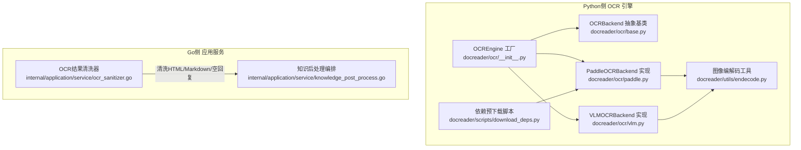
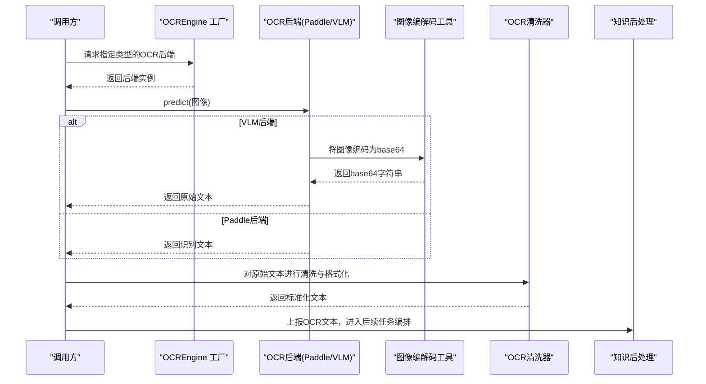
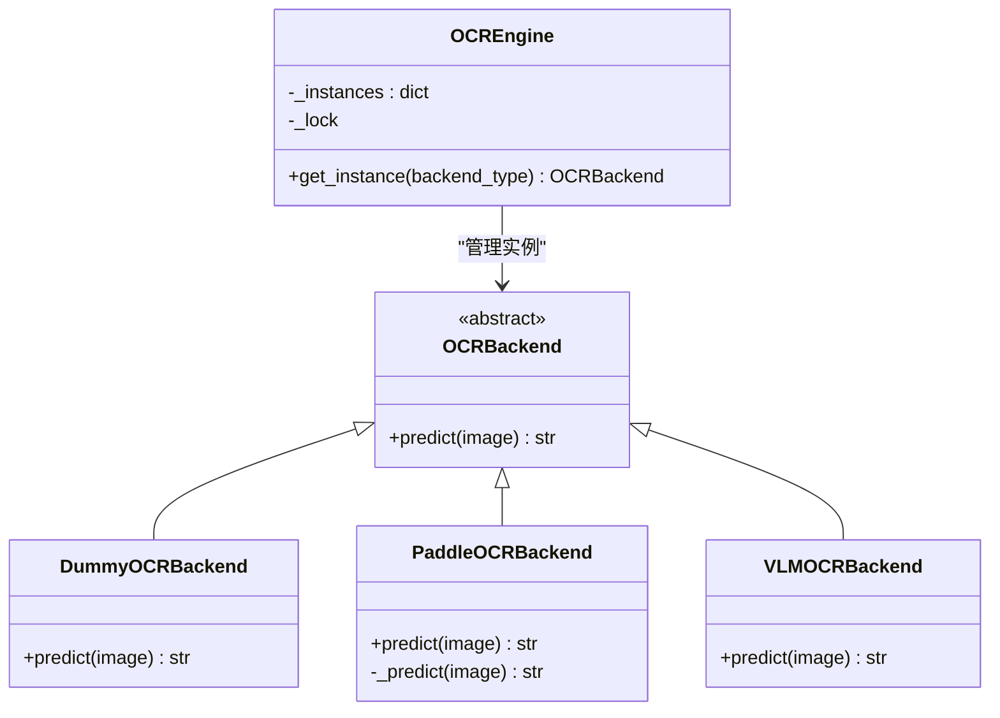
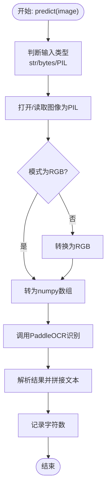
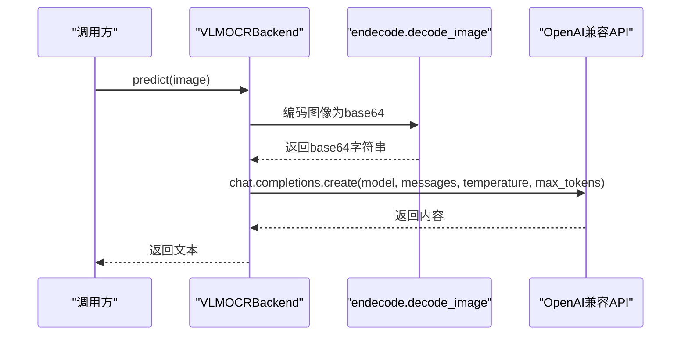
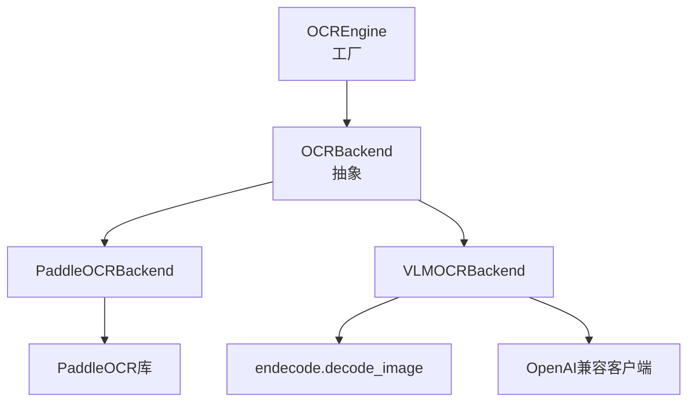

# OCR集成

<cite>
**本文引用的文件**
- [docreader/ocr/__init__.py](file://docreader/ocr/__init__.py)
- [docreader/ocr/base.py](file://docreader/ocr/base.py)
- [docreader/ocr/paddle.py](file://docreader/ocr/paddle.py)
- [docreader/ocr/vlm.py](file://docreader/ocr/vlm.py)
- [docreader/utils/endecode.py](file://docreader/utils/endecode.py)
- [docreader/scripts/download_deps.py](file://docreader/scripts/download_deps.py)
- [docreader/main.py](file://docreader/main.py)
- [internal/application/service/ocr_sanitizer.go](file://internal/application/service/ocr_sanitizer.go)
- [internal/application/service/knowledge_post_process.go](file://internal/application/service/knowledge_post_process.go)
</cite>

## 目录
1. [简介](#简介)
2. [项目结构](#项目结构)
3. [核心组件](#核心组件)
4. [架构总览](#架构总览)
5. [详细组件分析](#详细组件分析)
6. [依赖分析](#依赖分析)
7. [性能考虑](#性能考虑)
8. [故障排除指南](#故障排除指南)
9. [结论](#结论)
10. [附录](#附录)

## 简介
本文件面向WeKnora的OCR集成，系统性阐述PaddleOCR与视觉语言模型（VLM）两种后端的工程化实现、选择策略、图像预处理与文本识别流程、多语言支持与精度优化、性能调优、结果后处理与格式标准化，以及配置、故障排除与质量评估的实践指南。目标是帮助开发者在不同运行环境与业务场景下，稳定、高效地集成OCR能力，并获得高质量的文本抽取与结构化输出。

## 项目结构
WeKnora的OCR能力主要分布在Python侧的docreader模块与Go侧的应用服务层：
- Python侧OCR后端：统一通过工厂类管理PaddleOCR与VLM两种后端，提供一致的predict接口；同时包含图像编解码工具与依赖预下载脚本。
- Go侧应用服务：负责对OCR结果进行清洗、格式标准化与后续索引/摘要等任务编排。

图表来源
- [docreader/ocr/__init__.py:12-38](file://docreader/ocr/__init__.py#L12-L38)
- [docreader/ocr/base.py:10-32](file://docreader/ocr/base.py#L10-L32)
- [docreader/ocr/paddle.py:16-176](file://docreader/ocr/paddle.py#L16-L176)
- [docreader/ocr/vlm.py:14-88](file://docreader/ocr/vlm.py#L14-L88)
- [docreader/utils/endecode.py:23-76](file://docreader/utils/endecode.py#L23-L76)
- [docreader/scripts/download_deps.py:26-71](file://docreader/scripts/download_deps.py#L26-L71)
- [internal/application/service/ocr_sanitizer.go:27-110](file://internal/application/service/ocr_sanitizer.go#L27-L110)
- [internal/application/service/knowledge_post_process.go:17-133](file://internal/application/service/knowledge_post_process.go#L17-L133)

章节来源
- [docreader/ocr/__init__.py:12-38](file://docreader/ocr/__init__.py#L12-L38)
- [docreader/ocr/base.py:10-32](file://docreader/ocr/base.py#L10-L32)
- [docreader/ocr/paddle.py:16-176](file://docreader/ocr/paddle.py#L16-L176)
- [docreader/ocr/vlm.py:14-88](file://docreader/ocr/vlm.py#L14-L88)
- [docreader/utils/endecode.py:23-76](file://docreader/utils/endecode.py#L23-L76)
- [docreader/scripts/download_deps.py:26-71](file://docreader/scripts/download_deps.py#L26-L71)
- [internal/application/service/ocr_sanitizer.go:27-110](file://internal/application/service/ocr_sanitizer.go#L27-L110)
- [internal/application/service/knowledge_post_process.go:17-133](file://internal/application/service/knowledge_post_process.go#L17-L133)

## 核心组件
- OCR引擎工厂（OCREngine）
  - 负责按类型获取后端实例，支持“paddle”、“vlm”与“dummy”，并采用线程安全的单例缓存，避免重复初始化。
- OCR后端抽象（OCRBackend）
  - 统一predict接口，屏蔽具体实现差异。
- PaddleOCR后端（PaddleOCRBackend）
  - 在CPU上初始化PaddleOCR，自动检测AVX能力并设置兼容参数；启用文档方向分类与文本行方向检测；配置检测阈值与识别模型名称；将识别结果拼接为文本。
- VLM后端（VLMOCRBackend）
  - 基于OpenAI兼容接口调用视觉语言模型；通过图像base64编码传输；使用中文提示词要求模型输出Markdown格式，包含表格HTML与公式LaTeX的要求。
- 图像编解码工具（endecode.decode_image）
  - 支持从文件路径、字节流、PIL图像或numpy数组生成base64字符串，用于VLM后端的API传输。
- 依赖预下载脚本（download_deps.init_ocr_model）
  - 使用与运行时相同的配置初始化PaddleOCR，触发模型下载与缓存，随后执行一次简单测试以验证可用性。
- OCR结果清洗器（sanitizer）
  - 清理VLM输出中的HTML包装、去除无意义回复、规范化换行与Markdown转换。
- 知识后处理编排（knowledge_post_process）
  - 将OCR与图片描述合并为文本块，驱动摘要与问答生成等后续任务。

章节来源
- [docreader/ocr/__init__.py:12-38](file://docreader/ocr/__init__.py#L12-L38)
- [docreader/ocr/base.py:10-32](file://docreader/ocr/base.py#L10-L32)
- [docreader/ocr/paddle.py:16-176](file://docreader/ocr/paddle.py#L16-L176)
- [docreader/ocr/vlm.py:14-88](file://docreader/ocr/vlm.py#L14-L88)
- [docreader/utils/endecode.py:23-76](file://docreader/utils/endecode.py#L23-L76)
- [docreader/scripts/download_deps.py:26-71](file://docreader/scripts/download_deps.py#L26-L71)
- [internal/application/service/ocr_sanitizer.go:27-110](file://internal/application/service/ocr_sanitizer.go#L27-L110)
- [internal/application/service/knowledge_post_process.go:17-133](file://internal/application/service/knowledge_post_process.go#L17-L133)

## 架构总览
WeKnora的OCR集成采用“Python侧引擎 + Go侧清洗与编排”的分层设计：
- Python侧负责OCR识别与图像预处理；
- Go侧负责结果清洗、格式标准化与下游任务编排。

图表来源
- [docreader/ocr/__init__.py:12-38](file://docreader/ocr/__init__.py#L12-L38)
- [docreader/ocr/paddle.py:118-176](file://docreader/ocr/paddle.py#L118-L176)
- [docreader/ocr/vlm.py:41-88](file://docreader/ocr/vlm.py#L41-L88)
- [docreader/utils/endecode.py:23-76](file://docreader/utils/endecode.py#L23-L76)
- [internal/application/service/ocr_sanitizer.go:27-110](file://internal/application/service/ocr_sanitizer.go#L27-L110)
- [internal/application/service/knowledge_post_process.go:17-133](file://internal/application/service/knowledge_post_process.go#L17-L133)

## 详细组件分析

### OCR引擎工厂与后端抽象
- 工厂类通过类型名获取后端实例，若未显式指定则回退到“dummy”后端；内部使用锁保证线程安全，避免重复初始化。
- 抽象基类定义统一的predict接口，便于替换与扩展。

图表来源
- [docreader/ocr/base.py:10-32](file://docreader/ocr/base.py#L10-L32)
- [docreader/ocr/__init__.py:12-38](file://docreader/ocr/__init__.py#L12-L38)
- [docreader/ocr/paddle.py:16-176](file://docreader/ocr/paddle.py#L16-L176)
- [docreader/ocr/vlm.py:14-88](file://docreader/ocr/vlm.py#L14-L88)

章节来源
- [docreader/ocr/__init__.py:12-38](file://docreader/ocr/__init__.py#L12-L38)
- [docreader/ocr/base.py:10-32](file://docreader/ocr/base.py#L10-L32)

### PaddleOCR后端
- 初始化策略
  - 强制使用CPU（禁用GPU），并在Linux环境下尝试检测AVX指令集，不支持时切换兼容模式。
  - 配置检测与识别模型名称、阈值、方向分类与膨胀等参数，提升准确率与鲁棒性。
- 文本提取
  - 将输入图像转为RGB并转为numpy数组，调用OCR接口；从结果中提取每行文本并拼接为字符串。
- 错误处理
  - 对导入失败、OS错误（非法指令等）与通用异常进行捕获与日志记录；必要时返回空字符串。

图表来源
- [docreader/ocr/paddle.py:118-176](file://docreader/ocr/paddle.py#L118-L176)

章节来源
- [docreader/ocr/paddle.py:16-176](file://docreader/ocr/paddle.py#L16-L176)

### VLM后端
- 初始化
  - 从全局配置读取模型名、API密钥与基础URL，构造OpenAI兼容客户端；设置温度与最大token数。
- 文本提取
  - 使用endecode工具将图像编码为base64并通过消息结构发送给模型；提示词要求输出Markdown，包含表格HTML与公式LaTeX。
- 错误处理
  - 对客户端未初始化、API调用异常等情况进行捕获与日志记录；必要时返回空字符串。

图表来源
- [docreader/ocr/vlm.py:14-88](file://docreader/ocr/vlm.py#L14-L88)
- [docreader/utils/endecode.py:23-76](file://docreader/utils/endecode.py#L23-L76)

章节来源
- [docreader/ocr/vlm.py:14-88](file://docreader/ocr/vlm.py#L14-L88)
- [docreader/utils/endecode.py:23-76](file://docreader/utils/endecode.py#L23-L76)

### 图像编解码工具
- decode_image
  - 支持多种输入格式（路径、字节、PIL、numpy），统一输出base64字符串，便于通过HTTP/JSON传输。
- encode_image
  - 反向解码，支持严格与忽略错误模式。
- 文本解码
  - 提供多编码尝试与回退机制，增强中文等多语言文本的解码稳定性。

章节来源
- [docreader/utils/endecode.py:23-76](file://docreader/utils/endecode.py#L23-L76)

### 依赖预下载脚本
- 作用
  - 使用与运行时一致的配置初始化PaddleOCR，触发模型下载与缓存；随后进行一次简单测试，确保模型可用。
- 场景
  - 容器启动前或CI阶段预热模型，减少首次请求延迟。

章节来源
- [docreader/scripts/download_deps.py:26-71](file://docreader/scripts/download_deps.py#L26-L71)

### OCR结果清洗与格式标准化
- sanitizeOCRText
  - 去除首尾空白与Markdown代码块包裹；
  - 若HTML标签占比过高且去除标签后剩余文本过短，则判定为空回复；
  - 将HTML转换为Markdown，过滤已知无意义回复；
  - 规范化多余换行。
- 适用范围
  - 主要针对VLM输出进行清洗，提升后续RAG与知识库构建的质量。

章节来源
- [internal/application/service/ocr_sanitizer.go:27-110](file://internal/application/service/ocr_sanitizer.go#L27-L110)

### 知识后处理编排与OCR融合
- 合并策略
  - 将图片描述与OCR文本合并为统一文本块，作为RAG索引与问答生成的输入。
- 任务编排
  - 根据知识库配置，触发摘要生成与问答生成任务；当启用图谱检索时，进一步派生图谱抽取任务。

章节来源
- [internal/application/service/knowledge_post_process.go:17-133](file://internal/application/service/knowledge_post_process.go#L17-L133)

## 依赖分析
- 组件耦合
  - OCREngine与各后端之间为弱耦合的工厂模式；后端均实现OCRBackend抽象，便于替换。
  - VLM后端依赖OpenAI兼容客户端与图像编解码工具；Paddle后端依赖PaddleOCR与PIL/Numpy。
- 外部依赖
  - PaddleOCR：模型下载与缓存由预下载脚本与运行时初始化共同保障。
  - OpenAI兼容API：需正确配置API密钥与基础URL。
- 循环依赖
  - 当前模块间无循环依赖，职责清晰。

图表来源
- [docreader/ocr/__init__.py:12-38](file://docreader/ocr/__init__.py#L12-L38)
- [docreader/ocr/base.py:10-32](file://docreader/ocr/base.py#L10-L32)
- [docreader/ocr/paddle.py:16-176](file://docreader/ocr/paddle.py#L16-L176)
- [docreader/ocr/vlm.py:14-88](file://docreader/ocr/vlm.py#L14-L88)
- [docreader/utils/endecode.py:23-76](file://docreader/utils/endecode.py#L23-L76)

## 性能考虑
- CPU优先与指令集适配
  - PaddleOCR强制使用CPU并检测AVX能力，不支持时切换兼容模式，避免崩溃与非法指令错误。
- 模型配置权衡
  - 检测阈值与方向分类开启有助于提升准确率；但可能增加计算开销；可根据硬件条件调整。
- 图像预处理
  - 统一转换为RGB并使用numpy数组，减少不必要的格式转换成本。
- VLM调用
  - 控制temperature与max_tokens，避免过长响应；合理设置超时时间。
- 预热与缓存
  - 使用预下载脚本提前拉取模型权重，降低首次调用延迟。

章节来源
- [docreader/ocr/paddle.py:16-176](file://docreader/ocr/paddle.py#L16-L176)
- [docreader/scripts/download_deps.py:26-71](file://docreader/scripts/download_deps.py#L26-L71)
- [docreader/ocr/vlm.py:14-88](file://docreader/ocr/vlm.py#L14-L88)

## 故障排除指南
- PaddleOCR初始化失败
  - 症状：导入失败或出现“非法指令”导致崩溃。
  - 排查：确认运行环境CPU是否支持AVX；检查CUDA可见设备变量是否被错误设置；必要时安装CPU-only版本或切换后端。
  - 参考路径：[docreader/ocr/paddle.py:95-116](file://docreader/ocr/paddle.py#L95-L116)
- VLM调用异常
  - 症状：API返回错误或超时。
  - 排查：核对API密钥与基础URL配置；检查网络连通性与代理设置；适当提高超时时间。
  - 参考路径：[docreader/ocr/vlm.py:50-87](file://docreader/ocr/vlm.py#L50-L87)
- OCR结果为空或HTML过多
  - 症状：VLM输出被判定为空或HTML占比过高。
  - 处理：使用清洗器进行HTML清理与Markdown转换；检查提示词是否明确要求输出格式。
  - 参考路径：[internal/application/service/ocr_sanitizer.go:27-110](file://internal/application/service/ocr_sanitizer.go#L27-L110)
- 首次启动延迟高
  - 症状：首次OCR调用耗时较长。
  - 处理：在容器启动前或CI阶段执行预下载脚本，提前完成模型缓存。
  - 参考路径：[docreader/scripts/download_deps.py:26-71](file://docreader/scripts/download_deps.py#L26-L71)

章节来源
- [docreader/ocr/paddle.py:95-116](file://docreader/ocr/paddle.py#L95-L116)
- [docreader/ocr/vlm.py:50-87](file://docreader/ocr/vlm.py#L50-L87)
- [internal/application/service/ocr_sanitizer.go:27-110](file://internal/application/service/ocr_sanitizer.go#L27-L110)
- [docreader/scripts/download_deps.py:26-71](file://docreader/scripts/download_deps.py#L26-L71)

## 结论
WeKnora的OCR集成通过清晰的工厂与抽象设计，实现了PaddleOCR与VLM两种后端的统一接入；配合图像编解码工具、预下载脚本与结果清洗器，形成了从识别到格式化的完整链路。在多语言与精度方面，建议结合业务场景选择合适后端与提示词；在性能方面，优先保证CPU环境下的稳定性与模型缓存；在质量方面，持续利用清洗器与格式规范提升下游RAG效果。

## 附录

### OCR引擎选择策略
- 优先级建议
  - CPU受限或需要稳定性的场景：优先PaddleOCR。
  - 需要更强理解能力与结构化输出（表格/公式）：优先VLM。
- 切换方式
  - 通过工厂类的类型参数选择“paddle”或“vlm”，默认“dummy”用于占位与调试。

章节来源
- [docreader/ocr/__init__.py:12-38](file://docreader/ocr/__init__.py#L12-L38)

### 多语言支持与精度优化
- 多语言
  - PaddleOCR配置中包含语言字段；如需多语言识别，可在初始化时调整语言参数。
  - VLM后端通过提示词明确要求输出格式，适合跨语言文档的结构化抽取。
- 精度优化
  - 调整检测阈值、方向分类与膨胀参数；在PaddleOCR中启用更慢但更准确的检测模式；在VLM中细化提示词与示例。

章节来源
- [docreader/ocr/paddle.py:72-90](file://docreader/ocr/paddle.py#L72-L90)
- [docreader/ocr/vlm.py:34-39](file://docreader/ocr/vlm.py#L34-L39)

### OCR结果后处理与格式标准化
- 清洗流程
  - 去除包裹代码块、HTML标签统计与过滤、HTML转Markdown、去重换行与空回复过滤。
- 输出形态
  - 统一为Markdown，便于后续解析与索引。

章节来源
- [internal/application/service/ocr_sanitizer.go:27-110](file://internal/application/service/ocr_sanitizer.go#L27-L110)

### OCR引擎配置与环境变量
- PaddleOCR
  - 关键配置项：检测/识别模型名、阈值、方向分类、膨胀与检测模式等。
- VLM
  - 关键配置项：模型名、API密钥、基础URL、温度与最大token数。
- 预下载
  - 使用与运行时一致的配置初始化并缓存模型权重。

章节来源
- [docreader/ocr/paddle.py:72-90](file://docreader/ocr/paddle.py#L72-L90)
- [docreader/ocr/vlm.py:25-32](file://docreader/ocr/vlm.py#L25-L32)
- [docreader/scripts/download_deps.py:32-50](file://docreader/scripts/download_deps.py#L32-L50)