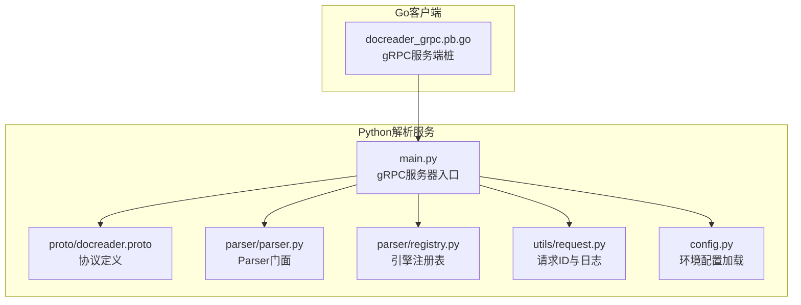
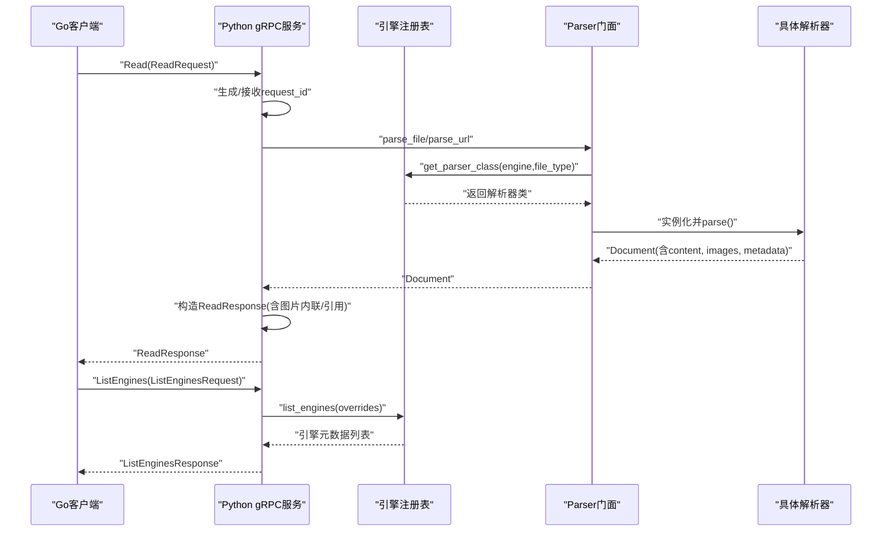
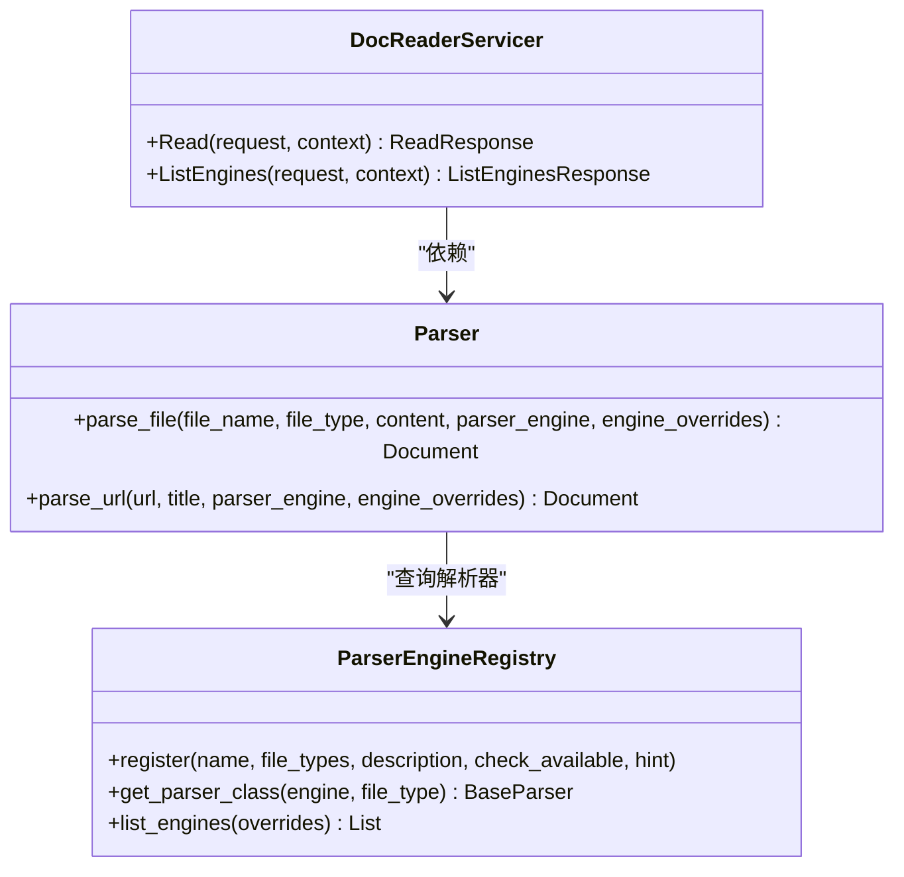
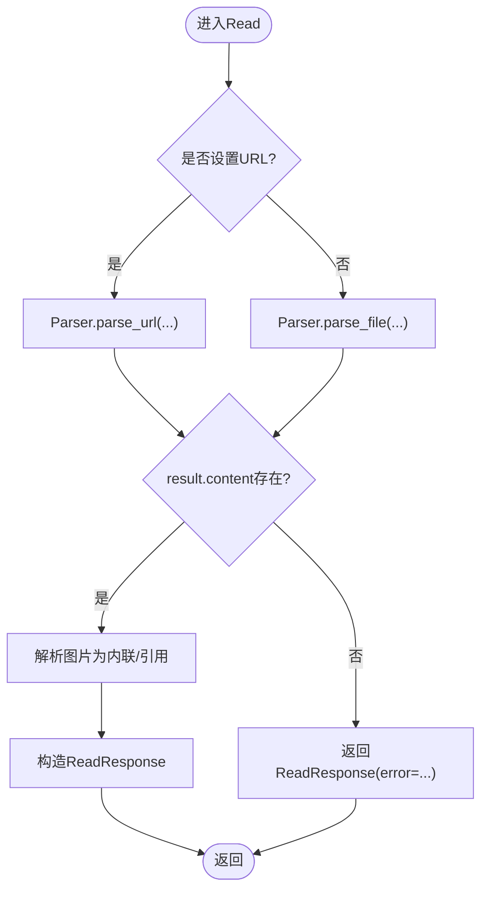
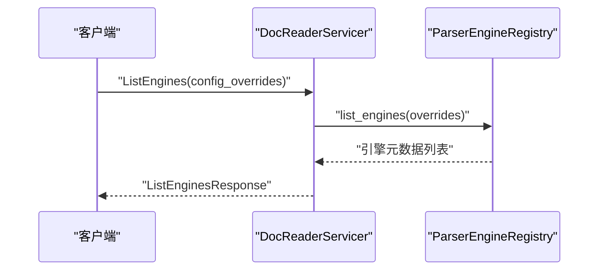
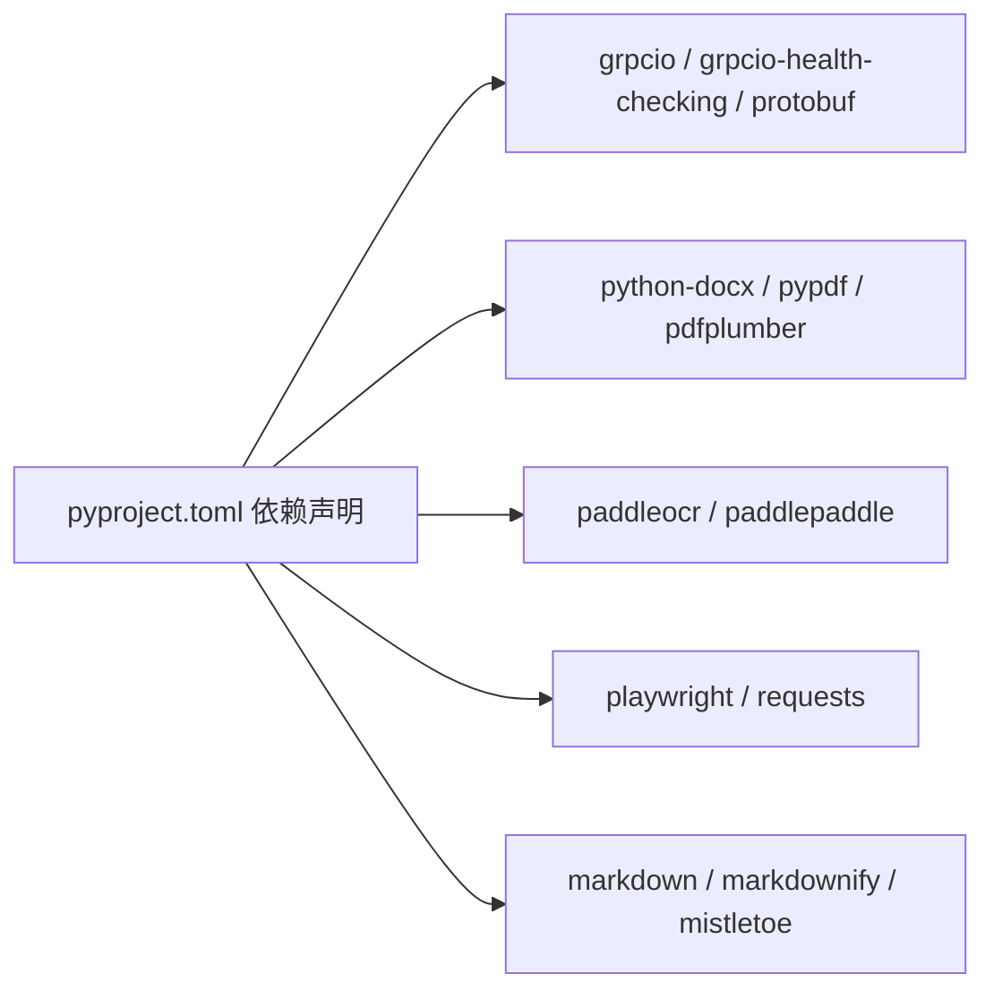

# Python解析服务

<cite>
**本文引用的文件**   
- [docreader/main.py](file://docreader/main.py)
- [docreader/proto/docreader.proto](file://docreader/proto/docreader.proto)
- [docreader/proto/docreader_grpc.pb.go](file://docreader/proto/docreader_grpc.pb.go)
- [docreader/proto/docreader_pb2_grpc.py](file://docreader/proto/docreader_pb2_grpc.py)
- [docreader/config.py](file://docreader/config.py)
- [docreader/parser/__init__.py](file://docreader/parser/__init__.py)
- [docreader/parser/registry.py](file://docreader/parser/registry.py)
- [docreader/utils/request.py](file://docreader/utils/request.py)
- [docreader/pyproject.toml](file://docreader/pyproject.toml)
- [docreader/parser/parser.py](file://docreader/parser/parser.py)
- [docreader/parser/base_parser.py](file://docreader/parser/base_parser.py)
- [docreader/parser/pdf_parser.py](file://docreader/parser/pdf_parser.py)
- [docreader/parser/image_parser.py](file://docreader/parser/image_parser.py)
</cite>

## 目录
1. [简介](#简介)
2. [项目结构](#项目结构)
3. [核心组件](#核心组件)
4. [架构总览](#架构总览)
5. [详细组件分析](#详细组件分析)
6. [依赖分析](#依赖分析)
7. [性能考虑](#性能考虑)
8. [故障排查指南](#故障排查指南)
9. [结论](#结论)
10. [附录](#附录)

## 简介
本技术文档面向WeKnora的Python解析服务，聚焦于gRPC服务器实现、请求处理流程与响应格式，系统性阐述DocReaderServicer类的设计模式、Read方法的统一读取逻辑、ListEngines方法的引擎列表能力，并深入解析并发处理机制、健康检查服务与错误处理策略。同时覆盖配置管理、日志记录与性能优化要点，提供服务启动、停止与监控的实用指南。

## 项目结构
docreader子模块是WeKnora文档解析的Python侧实现，负责通过gRPC对外提供“统一读取”和“引擎列表”两类服务。其关键组成包括：
- gRPC服务端：DocReaderServicer，提供Read与ListEngines两个RPC接口
- 协议定义：docreader.proto，定义ReadRequest/ReadResponse、ListEnginesRequest/Response等消息类型
- 解析器体系：Parser门面 + 多种具体解析器（PDF、DOCX、图片、网页等），由注册表ParserEngineRegistry统一调度
- 配置与日志：环境变量驱动的轻量配置加载、请求ID上下文与毫秒级日志格式化
- 依赖声明：pyproject.toml列出gRPC、解析库、OCR/VLM等运行时依赖

**图表来源**
- [docreader/main.py:184-215](file://docreader/main.py#L184-L215)
- [docreader/proto/docreader.proto:1-62](file://docreader/proto/docreader.proto#L1-L62)
- [docreader/parser/parser.py:11-83](file://docreader/parser/parser.py#L11-L83)
- [docreader/parser/registry.py:18-161](file://docreader/parser/registry.py#L18-L161)
- [docreader/utils/request.py:47-150](file://docreader/utils/request.py#L47-L150)
- [docreader/config.py:66-122](file://docreader/config.py#L66-L122)
- [docreader/proto/docreader_grpc.pb.go:62-160](file://docreader/proto/docreader_grpc.pb.go#L62-L160)

**章节来源**
- [docreader/main.py:184-215](file://docreader/main.py#L184-L215)
- [docreader/proto/docreader.proto:1-62](file://docreader/proto/docreader.proto#L1-L62)
- [docreader/parser/__init__.py:1-39](file://docreader/parser/__init__.py#L1-L39)
- [docreader/parser/registry.py:18-161](file://docreader/parser/registry.py#L18-L161)
- [docreader/utils/request.py:47-150](file://docreader/utils/request.py#L47-L150)
- [docreader/config.py:66-122](file://docreader/config.py#L66-L122)
- [docreader/pyproject.toml:1-40](file://docreader/pyproject.toml#L1-L40)

## 核心组件
- DocReaderServicer：gRPC服务实现，封装Parser门面，统一处理文件内容与URL内容的解析；提供引擎可用性查询。
- Parser门面：根据请求选择具体解析器，屏蔽多后端差异；支持引擎名与覆盖参数。
- ParserEngineRegistry：注册内置与第三方引擎，按文件类型分派解析器，自动回退至内置引擎。
- 请求ID与日志：通过ContextVar注入请求ID，统一日志格式并记录耗时。
- 配置加载：从环境变量读取gRPC线程池、最大消息大小、端口、代理与图片输出目录等参数。

**章节来源**
- [docreader/main.py:98-182](file://docreader/main.py#L98-L182)
- [docreader/parser/parser.py:11-83](file://docreader/parser/parser.py#L11-L83)
- [docreader/parser/registry.py:18-161](file://docreader/parser/registry.py#L18-L161)
- [docreader/utils/request.py:17-150](file://docreader/utils/request.py#L17-L150)
- [docreader/config.py:66-122](file://docreader/config.py#L66-L122)

## 架构总览
下图展示Python解析服务的端到端交互：Go客户端通过gRPC调用Read或ListEngines，Python服务端解析请求、选择解析器、产出Markdown文本与图片引用，最终返回ReadResponse；同时提供健康检查服务。

**图表来源**
- [docreader/main.py:103-181](file://docreader/main.py#L103-L181)
- [docreader/parser/parser.py:25-83](file://docreader/parser/parser.py#L25-L83)
- [docreader/parser/registry.py:51-106](file://docreader/parser/registry.py#L51-L106)

## 详细组件分析

### DocReaderServicer与gRPC服务
- 设计模式：基于类继承与组合，DocReaderServicer继承自生成的Servicer基类，内部持有Parser门面实例，职责清晰。
- Read方法：统一读取逻辑，支持文件模式（file_content + file_name + file_type）与URL模式（url + title）。根据ReadConfig指定引擎与覆盖参数，调用Parser门面解析，最终构造ReadResponse。
- ListEngines方法：读取请求中的config_overrides，交由注册表计算各引擎可用性与描述，返回ParserEngineInfo列表。
- 健康检查：通过HealthServicer提供健康状态服务，便于容器编排与探活。
- 错误处理：捕获异常并返回ReadResponse.error字段；记录堆栈信息用于调试。

**图表来源**
- [docreader/main.py:98-182](file://docreader/main.py#L98-L182)
- [docreader/parser/parser.py:11-83](file://docreader/parser/parser.py#L11-L83)
- [docreader/parser/registry.py:18-161](file://docreader/parser/registry.py#L18-L161)

**章节来源**
- [docreader/main.py:98-182](file://docreader/main.py#L98-L182)
- [docreader/proto/docreader_pb2_grpc.py:28-82](file://docreader/proto/docreader_pb2_grpc.py#L28-L82)
- [docreader/proto/docreader_grpc.pb.go:62-160](file://docreader/proto/docreader_grpc.pb.go#L62-L160)

### Read方法统一读取逻辑
- 请求识别：根据是否设置url决定URL模式；否则为文件模式，自动推导file_type。
- 引擎选择：优先使用ReadConfig.parser_engine，支持engine_overrides覆盖。
- 结果处理：若解析结果为空，返回错误；否则将图片解码为内联字节或引用，构造ReadResponse。
- 文本清洗：to_valid_utf8_text确保返回内容为合法UTF-8文本。

**图表来源**
- [docreader/main.py:103-167](file://docreader/main.py#L103-L167)
- [docreader/parser/parser.py:25-83](file://docreader/parser/parser.py#L25-L83)

**章节来源**
- [docreader/main.py:103-167](file://docreader/main.py#L103-L167)
- [docreader/main.py:54-96](file://docreader/main.py#L54-L96)

### ListEngines方法与引擎列表
- 输入：ListEnginesRequest.config_overrides可传入租户级覆盖参数。
- 处理：遍历注册表，对每个引擎调用check_available(overrides)，汇总name/description/file_types/available/unavailable_reason。
- 输出：ListEnginesResponse包含多个ParserEngineInfo条目。

**图表来源**
- [docreader/main.py:168-181](file://docreader/main.py#L168-L181)
- [docreader/parser/registry.py:77-106](file://docreader/parser/registry.py#L77-L106)

**章节来源**
- [docreader/main.py:168-181](file://docreader/main.py#L168-L181)
- [docreader/parser/registry.py:77-106](file://docreader/parser/registry.py#L77-L106)

### 并发处理机制
- gRPC服务器线程池：ThreadPoolExecutor(max_workers=CONFIG.grpc_max_workers)控制并发请求数。
- 解析器内部并发：
  - DOCX解析采用进程池（ProcessPoolExecutor）按页并行处理，动态计算最优工作进程数，减少内存占用与提升吞吐。
  - 图片解析与网页解析等场景亦体现多线程/多进程并行思想。
- 上下文隔离：每个请求使用独立的request_id与开始时间，避免日志交叉污染。

**章节来源**
- [docreader/main.py:187-193](file://docreader/main.py#L187-L193)
- [docreader/config.py:69-97](file://docreader/config.py#L69-L97)
- [docreader/parser/docx_parser.py:782-800](file://docreader/parser/docx_parser.py#L782-L800)
- [docreader/utils/request.py:120-150](file://docreader/utils/request.py#L120-L150)

### 健康检查服务
- 通过HealthServicer与add_HealthServicer_to_server注册健康检查服务，便于Kubernetes等平台进行存活/就绪探针。

**章节来源**
- [docreader/main.py:197-199](file://docreader/main.py#L197-L199)

### 错误处理策略
- Read方法：捕获异常，记录错误与堆栈，返回ReadResponse.error。
- 解析器：当解析结果为空或出现异常时，记录警告/错误日志并尝试降级路径（如DOCX的简化解析）。
- 注册表：get_parser_class在未找到目标引擎或类型时不支持时抛出异常，提示回退至内置引擎。

**章节来源**
- [docreader/main.py:162-167](file://docreader/main.py#L162-L167)
- [docreader/parser/parser.py:58-63](file://docreader/parser/parser.py#L58-L63)
- [docreader/parser/registry.py:75](file://docreader/parser/registry.py#L75)

### 配置管理
- 环境变量键名前缀：DOCREADER_（优先）与通用前缀（次优），如GRPC_MAX_WORKERS、GRPC_MAX_FILE_SIZE_MB、GRPC_PORT、EXTERNAL_HTTP(S)_PROXY、IMAGE_OUTPUT_DIR等。
- 关键配置项：
  - gRPC线程池大小、最大消息大小（MB）、监听端口
  - DOCX最大页数限制
  - 外部HTTP/HTTPS代理
  - 图片输出目录（共享卷/本地回退）
- 打印有效配置：启动时打印已生效的配置键值，便于排障。

**章节来源**
- [docreader/config.py:66-122](file://docreader/config.py#L66-L122)

### 日志记录
- 初始化：移除默认处理器，添加StreamHandler，设置根日志级别（LOG_LEVEL），并启用请求ID过滤器。
- 请求ID：通过ContextVar注入，日志格式包含时间戳（毫秒级）、请求ID、级别、模块名与消息；并在末尾追加耗时。
- 记录策略：请求开始、解析过程、完成与异常均记录明确日志，便于定位问题。

**章节来源**
- [docreader/main.py:38-51](file://docreader/main.py#L38-L51)
- [docreader/utils/request.py:47-150](file://docreader/utils/request.py#L47-L150)

### 性能优化
- gRPC参数：设置最大发送/接收消息长度，避免大文件传输失败。
- 解析器并发：DOCX按页并行、进程池复用、动态工作进程数，降低内存峰值。
- 文本清洗：统一UTF-8清洗，避免后续处理编码问题。
- 图片处理：图片解码与内联字节传递，减轻Go侧压力；图片存储由Go应用统一负责。

**章节来源**
- [docreader/main.py:187-193](file://docreader/main.py#L187-L193)
- [docreader/parser/docx_parser.py:692-711](file://docreader/parser/docx_parser.py#L692-L711)
- [docreader/main.py:31-35](file://docreader/main.py#L31-L35)

### 服务启动、停止与监控
- 启动：初始化配置与日志，创建gRPC服务器，注册DocReader与Health服务，绑定端口并启动。
- 停止：捕获中断信号，优雅关闭服务器。
- 监控：结合健康检查服务与日志耗时，观察吞吐与延迟；通过环境变量调节线程池与消息大小以适配负载。

**章节来源**
- [docreader/main.py:184-215](file://docreader/main.py#L184-L215)

## 依赖分析
- gRPC生态：grpcio、grpcio-health-checking、protobuf与生成的Python桩文件。
- 解析库：docx、pdf解析、OCR/VLM、网页抓取、Markdown转换等。
- 工具库：base64、uuid、contextvars、logging等。

**图表来源**
- [docreader/pyproject.toml:7-39](file://docreader/pyproject.toml#L7-L39)

**章节来源**
- [docreader/pyproject.toml:1-40](file://docreader/pyproject.toml#L1-L40)

## 性能考虑
- 线程池规模：根据CPU核数与任务特征合理设置max_workers，避免过度并发导致上下文切换开销。
- 消息大小：通过配置项控制最大消息长度，平衡大文件传输与内存占用。
- 解析器选择：针对不同文件类型选择合适引擎，必要时使用覆盖参数优化性能。
- 图片处理：尽量以内联字节形式传递，减少Go侧额外编码/解码成本。
- 日志开销：生产环境建议适当提高日志级别，避免高频I/O影响性能。

## 故障排查指南
- 无法连接/超时：检查端口与防火墙、确认健康检查服务可达。
- 解析失败：查看ReadResponse.error与服务端日志堆栈；确认文件类型与引擎覆盖参数正确。
- 图片缺失：确认图片引用与内联字节生成逻辑；检查Go侧图片解析与存储配置。
- 性能瓶颈：调整grpc_max_workers、docx_max_pages与代理设置；观察日志耗时定位热点。

**章节来源**
- [docreader/main.py:162-167](file://docreader/main.py#L162-L167)
- [docreader/utils/request.py:146-149](file://docreader/utils/request.py#L146-L149)

## 结论
WeKnora Python解析服务以轻量化设计为核心，通过Parser门面与引擎注册表实现多后端统一接入，配合gRPC高性能通信与完善的日志/健康检查机制，满足文档解析与引擎发现的生产需求。通过合理的并发策略与配置调优，可在保证稳定性的同时获得良好吞吐与延迟表现。

## 附录
- 协议字段说明（节选）
  - ReadRequest：file_content/file_name/file_type/url/title/config/request_id
  - ReadResponse：markdown_content/image_refs/image_dir_path/metadata/error
  - ListEnginesRequest：config_overrides
  - ListEnginesResponse：engines（ParserEngineInfo数组）

**章节来源**
- [docreader/proto/docreader.proto:20-61](file://docreader/proto/docreader.proto#L20-L61)