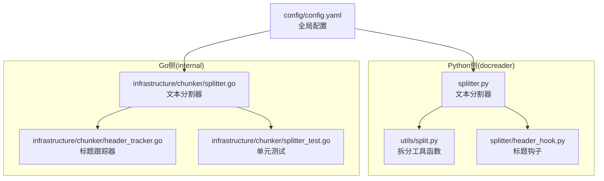
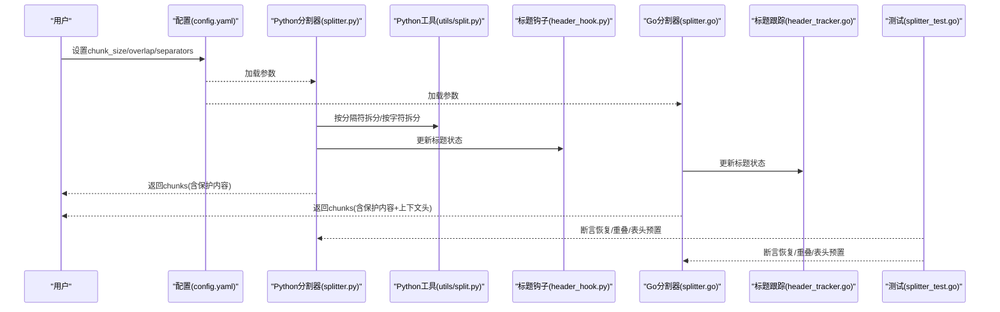
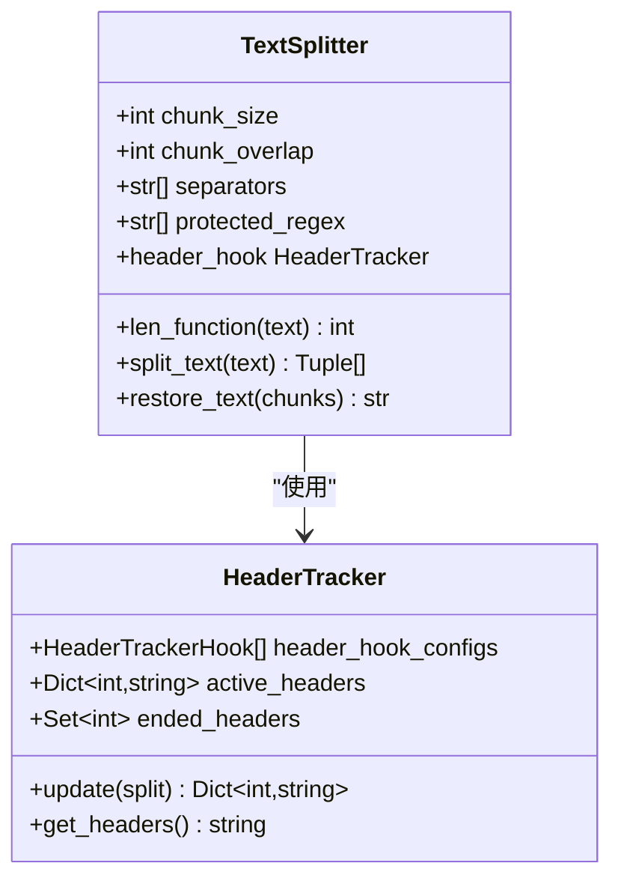
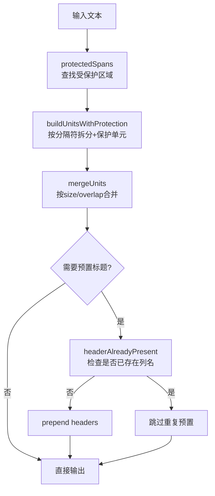
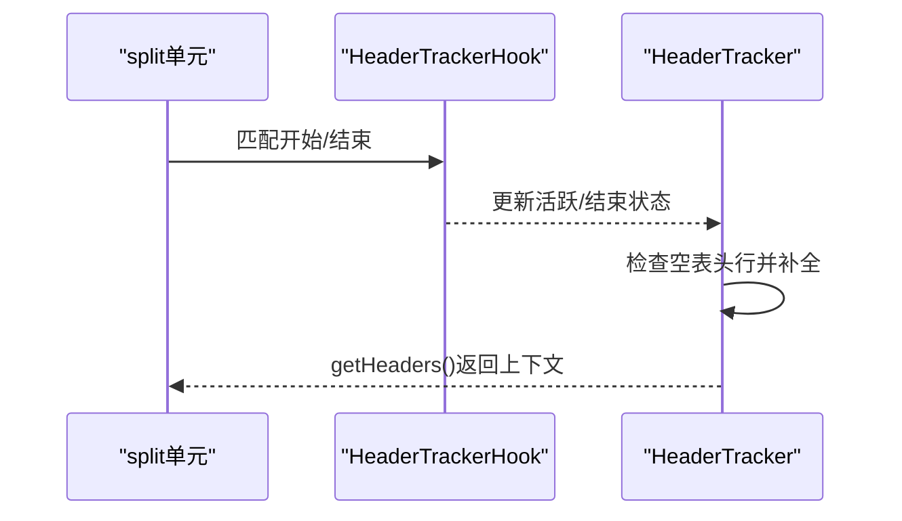
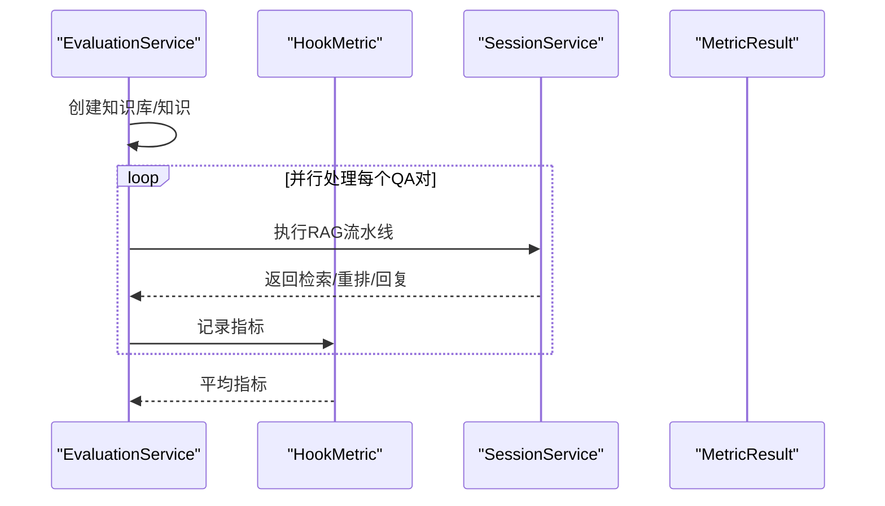
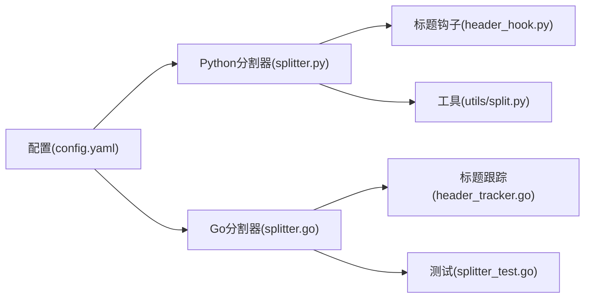

# 文本处理

<cite>
**本文引用的文件**
- [splitter.py](file://docreader/splitter/splitter.py)
- [header_hook.py](file://docreader/splitter/header_hook.py)
- [split.py](file://docreader/utils/split.py)
- [splitter.go](file://internal/infrastructure/chunker/splitter.go)
- [header_tracker.go](file://internal/infrastructure/chunker/header_tracker.go)
- [splitter_test.go](file://internal/infrastructure/chunker/splitter_test.go)
- [config.yaml](file://config/config.yaml)
- [evaluation.go](file://internal/application/service/evaluation.go)
- [metric_hook.go](file://internal/application/service/metric_hook.go)
- [wiki_ingest_dedup.go](file://internal/application/service/wiki_ingest_dedup.go)
</cite>

## 目录
1. [简介](#简介)
2. [项目结构](#项目结构)
3. [核心组件](#核心组件)
4. [架构总览](#架构总览)
5. [详细组件分析](#详细组件分析)
6. [依赖分析](#依赖分析)
7. [性能考虑](#性能考虑)
8. [故障排查指南](#故障排查指南)
9. [结论](#结论)
10. [附录](#附录)

## 简介
本技术文档面向WeKnora文本处理系统，聚焦于文本分割、标题层级识别与内容结构化处理。文档系统性阐述splitter模块的分割策略、header_hook钩子机制、文本清洗流程，并覆盖去重、格式标准化与元数据提取技术。同时提供文本质量评估、分割效果优化与性能监控方法，以及文本处理配置、自定义分割器开发与调试技巧。

## 项目结构
WeKnora在Python侧提供docreader/splitter与utils模块，在Go侧提供internal/infrastructure/chunker实现，二者均围绕“保护性切分、上下文头预置、重叠合并”三大核心能力展开，并通过配置与测试保障正确性与鲁棒性。

图表来源
- [splitter.py:1-585](file://docreader/splitter/splitter.py#L1-L585)
- [header_hook.py:1-113](file://docreader/splitter/header_hook.py#L1-L113)
- [split.py:1-81](file://docreader/utils/split.py#L1-L81)
- [splitter.go:1-571](file://internal/infrastructure/chunker/splitter.go#L1-L571)
- [header_tracker.go:1-162](file://internal/infrastructure/chunker/header_tracker.go#L1-L162)
- [splitter_test.go:1-987](file://internal/infrastructure/chunker/splitter_test.go#L1-L987)
- [config.yaml:1-113](file://config/config.yaml#L1-L113)

章节来源
- [splitter.py:1-585](file://docreader/splitter/splitter.py#L1-L585)
- [splitter.go:1-571](file://internal/infrastructure/chunker/splitter.go#L1-L571)
- [config.yaml:1-113](file://config/config.yaml#L1-L113)

## 核心组件
- 文本分割器(TextSplitter/Go: SplitText)
  - 支持可配置的chunk_size、chunk_overlap与分隔符序列
  - 保护性正则：公式、图片、链接、表格、代码块
  - 递归拆分与智能合并，保证不破坏受保护内容
- 标题钩子/HeaderTracker
  - 基于正则的状态机，识别Markdown表格头并预置到后续分块
  - 支持空表头行自动补全为真实列名
- 清洗与工具
  - Python侧：保持分隔符、按字符拆分、正则拆分等工具
  - Go侧：按rune偏移记录Start/End，确保多字节安全
- 去重与格式标准化
  - Wiki去重候选筛选与表面相似度计算
  - 文本预览、规范化与跨页链接注入
- 质量评估与监控
  - 评测服务与指标钩子，支持并行评估与指标聚合

章节来源
- [splitter.py:31-144](file://docreader/splitter/splitter.py#L31-L144)
- [splitter.go:142-167](file://internal/infrastructure/chunker/splitter.go#L142-L167)
- [header_hook.py:67-113](file://docreader/splitter/header_hook.py#L67-L113)
- [header_tracker.go:39-162](file://internal/infrastructure/chunker/header_tracker.go#L39-L162)
- [split.py:5-81](file://docreader/utils/split.py#L5-L81)
- [wiki_ingest_dedup.go:1-258](file://internal/application/service/wiki_ingest_dedup.go#L1-L258)
- [evaluation.go:1-477](file://internal/application/service/evaluation.go#L1-L477)
- [metric_hook.go:1-167](file://internal/application/service/metric_hook.go#L1-L167)

## 架构总览
WeKnora采用“双语言实现、统一语义”的架构：Python侧负责灵活的文本清洗与钩子机制，Go侧负责高性能的分块与上下文头预置，二者通过配置与测试协同工作。

图表来源
- [config.yaml:40-47](file://config/config.yaml#L40-L47)
- [splitter.py:116-144](file://docreader/splitter/splitter.py#L116-L144)
- [split.py:27-50](file://docreader/utils/split.py#L27-L50)
- [header_hook.py:74-102](file://docreader/splitter/header_hook.py#L74-L102)
- [splitter.go:142-167](file://internal/infrastructure/chunker/splitter.go#L142-L167)
- [header_tracker.go:56-104](file://internal/infrastructure/chunker/header_tracker.go#L56-L104)
- [splitter_test.go:10-95](file://internal/infrastructure/chunker/splitter_test.go#L10-L95)

## 详细组件分析

### 组件A：Python文本分割器(TextSplitter)
- 分割策略
  - 优先使用分隔符序列进行拆分，若仍过大则递归拆分
  - 保护性正则匹配后，将受保护片段隔离，避免被拆断
  - 合并阶段按chunk_size与chunk_overlap进行重叠拼接，并预置标题上下文
- 标题钩子机制
  - HeaderTracker维护活跃标题集合，按优先级拼接
  - 当标题结束条件出现时清除活跃状态，支持多表场景
- 文本清洗与验证
  - 提供restore_text与验证器，确保分块可恢复原文本
  - 保护内容过大时给出警告并跳过

图表来源
- [splitter.py:31-144](file://docreader/splitter/splitter.py#L31-L144)
- [header_hook.py:67-113](file://docreader/splitter/header_hook.py#L67-L113)

章节来源
- [splitter.py:116-297](file://docreader/splitter/splitter.py#L116-L297)
- [header_hook.py:74-113](file://docreader/splitter/header_hook.py#L74-L113)

### 组件B：Go文本分割器(SplitText)
- 分割策略
  - protectedSpans扫描受保护区域，buildUnitsWithProtection以rune偏移构建原子单元
  - mergeUnits按chunk_size与chunk_overlap合并，强制绝对上限防止下游超限
  - headerAlreadyPresent避免重复预置列名
- 标题跟踪
  - newHeaderTracker维护活跃/结束状态，支持空表头行自动补全
  - extractSeparatorLine与isEmptyTableHeaderRow辅助重构表头
- 图像引用提取
  - ExtractImageRefs解析Markdown图像引用，便于后续处理

图表来源
- [splitter.go:60-167](file://internal/infrastructure/chunker/splitter.go#L60-L167)
- [splitter.go:259-377](file://internal/infrastructure/chunker/splitter.go#L259-L377)
- [header_tracker.go:56-104](file://internal/infrastructure/chunker/header_tracker.go#L56-L104)

章节来源
- [splitter.go:142-377](file://internal/infrastructure/chunker/splitter.go#L142-L377)
- [header_tracker.go:39-162](file://internal/infrastructure/chunker/header_tracker.go#L39-L162)
- [splitter_test.go:372-422](file://internal/infrastructure/chunker/splitter_test.go#L372-L422)

### 组件C：标题钩子与跟踪器
- Python侧HeaderTrackerHook
  - 支持start_pattern/end_pattern与提取函数
  - 默认配置支持Markdown表格头识别
- Go侧headerTracker
  - 维护活跃/结束/待扩展状态，支持空表头行补全
  - getHeaders按优先级拼接，确保上下文一致性

图表来源
- [header_hook.py:7-39](file://docreader/splitter/header_hook.py#L7-L39)
- [header_hook.py:74-102](file://docreader/splitter/header_hook.py#L74-L102)
- [header_tracker.go:56-104](file://internal/infrastructure/chunker/header_tracker.go#L56-L104)

章节来源
- [header_hook.py:67-113](file://docreader/splitter/header_hook.py#L67-L113)
- [header_tracker.go:39-162](file://internal/infrastructure/chunker/header_tracker.go#L39-L162)

### 组件D：文本清洗与工具
- Python工具
  - split_by_sep/char/regex：保持分隔符、按字符拆分、按正则拆分
  - match_by_regex：快速匹配
- Go侧
  - runeLen与rune切片确保多字节安全
  - splitBySeparators按优先级分隔符拆分

章节来源
- [split.py:5-81](file://docreader/utils/split.py#L5-L81)
- [splitter.go:137-141](file://internal/infrastructure/chunker/splitter.go#L137-L141)
- [splitter.go:108-135](file://internal/infrastructure/chunker/splitter.go#L108-L135)

### 组件E：去重、格式标准化与元数据提取
- 候选去重
  - 基于slug词元集与字符二元组集的Jaccard相似度
  - Top-K与阈值控制，兼顾大知识库性能与小知识库可用性
- 格式标准化
  - 预览文本、去除多余空白、统一换行
- 元数据提取
  - 提取图像引用，便于后续处理

章节来源
- [wiki_ingest_dedup.go:1-258](file://internal/application/service/wiki_ingest_dedup.go#L1-L258)
- [splitter.go:552-571](file://internal/infrastructure/chunker/splitter.go#L552-L571)

### 组件F：质量评估与性能监控
- 评测服务
  - 并行执行QA对，记录检索、重排与生成指标
  - 支持并发限制与进度更新
- 指标钩子
  - Precision/Recall/NDCG/MRR/MAP/BLEU/ROUGE等
  - 平均指标聚合与线程安全

图表来源
- [evaluation.go:331-456](file://internal/application/service/evaluation.go#L331-L456)
- [metric_hook.go:84-167](file://internal/application/service/metric_hook.go#L84-L167)

章节来源
- [evaluation.go:1-477](file://internal/application/service/evaluation.go#L1-L477)
- [metric_hook.go:1-167](file://internal/application/service/metric_hook.go#L1-L167)

## 依赖分析
- Python侧
  - splitter.py依赖header_hook.py与utils/split.py
  - header_hook.py为纯配置与正则，耦合度低
- Go侧
  - splitter.go依赖header_tracker.go与docparser(图像引用解析)
  - 测试splitter_test.go覆盖多场景断言
- 配置
  - config.yaml提供chunk_size、chunk_overlap、分隔符等全局参数

图表来源
- [splitter.py:17-21](file://docreader/splitter/splitter.py#L17-L21)
- [header_hook.py:1-113](file://docreader/splitter/header_hook.py#L1-L113)
- [split.py:1-81](file://docreader/utils/split.py#L1-L81)
- [splitter.go:1-12](file://internal/infrastructure/chunker/splitter.go#L1-L12)
- [header_tracker.go:1-162](file://internal/infrastructure/chunker/header_tracker.go#L1-L162)
- [splitter_test.go:1-987](file://internal/infrastructure/chunker/splitter_test.go#L1-L987)
- [config.yaml:40-47](file://config/config.yaml#L40-L47)

章节来源
- [splitter.py:17-21](file://docreader/splitter/splitter.py#L17-L21)
- [splitter.go:1-12](file://internal/infrastructure/chunker/splitter.go#L1-L12)
- [config.yaml:40-47](file://config/config.yaml#L40-L47)

## 性能考虑
- 分割复杂度
  - Python：递归拆分与保护内容过滤，时间复杂度近似O(n log n)至O(n^2)，取决于分隔符选择与保护内容密度
  - Go：受保护区域扫描+单位构建+合并，时间复杂度近似O(n)，rune偏移避免多字节错误
- 重叠与上下文
  - 合并阶段需平衡overlap与上下文头长度，避免超出下游限制
- 并行评测
  - 评测服务使用errgroup限制并发，结合CPU核数动态调整worker数量

章节来源
- [splitter.go:263-377](file://internal/infrastructure/chunker/splitter.go#L263-L377)
- [evaluation.go:386-388](file://internal/application/service/evaluation.go#L386-L388)

## 故障排查指南
- 分块不可恢复
  - 使用Python分割器的验证器与restore_text，定位差异位置
  - 检查保护内容是否过大导致忽略
- 重叠越界
  - Go侧merge逻辑严格校验offset，确保Start/End非负且End不越界
- 表头预置异常
  - 确认空表头行补全逻辑与结束条件（空行或非表格行）
- 图像引用缺失
  - 检查ExtractImageRefs与UnwrapLinkedImages链路

章节来源
- [splitter.py:409-516](file://docreader/splitter/splitter.py#L409-L516)
- [splitter.go:443-485](file://internal/infrastructure/chunker/splitter.go#L443-L485)
- [splitter_test.go:685-738](file://internal/infrastructure/chunker/splitter_test.go#L685-L738)
- [header_tracker.go:131-161](file://internal/infrastructure/chunker/header_tracker.go#L131-L161)

## 结论
WeKnora文本处理系统通过Python与Go两侧实现，形成“灵活清洗+高效分块”的完整链路。保护性切分与标题上下文预置确保了结构化内容的完整性；评测与指标体系提供了质量评估与优化依据；配置与测试保障了在不同场景下的稳定性与性能。

## 附录

### 文本处理配置
- 全局配置项
  - chunk_size、chunk_overlap、分隔符列表
  - 图像处理开关
- 参考路径
  - [config.yaml:40-47](file://config/config.yaml#L40-L47)

章节来源
- [config.yaml:40-47](file://config/config.yaml#L40-L47)

### 自定义分割器开发
- Python侧
  - 扩展protected_regex以适配新格式
  - 调整separators优先级与长度函数
  - 使用restore_text与验证器确保正确性
- Go侧
  - 修改SplitterConfig参数
  - 如需新增钩子，可在header_tracker.go中扩展匹配规则
  - 保持rune偏移与Start/End一致性

章节来源
- [splitter.py:65-115](file://docreader/splitter/splitter.py#L65-L115)
- [splitter.go:30-44](file://internal/infrastructure/chunker/splitter.go#L30-L44)
- [header_tracker.go:24-34](file://internal/infrastructure/chunker/header_tracker.go#L24-L34)

### 调试技巧
- 使用splitter_test.go中的断言样例复现问题
- 对照Python与Go两套实现，定位差异
- 利用评测服务并行对比不同配置的指标表现

章节来源
- [splitter_test.go:1-987](file://internal/infrastructure/chunker/splitter_test.go#L1-L987)
- [evaluation.go:331-456](file://internal/application/service/evaluation.go#L331-L456)