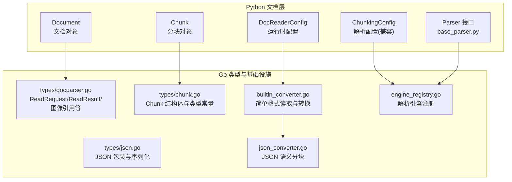
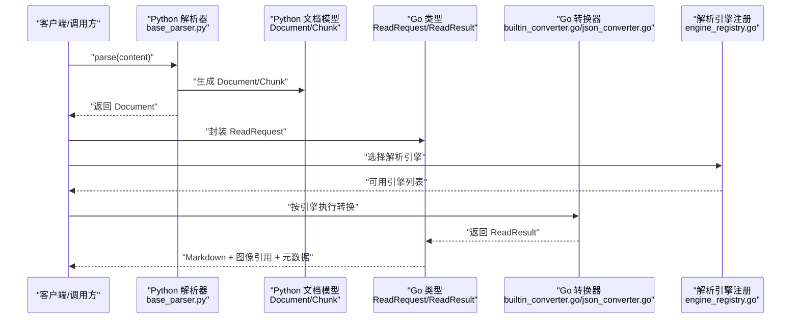
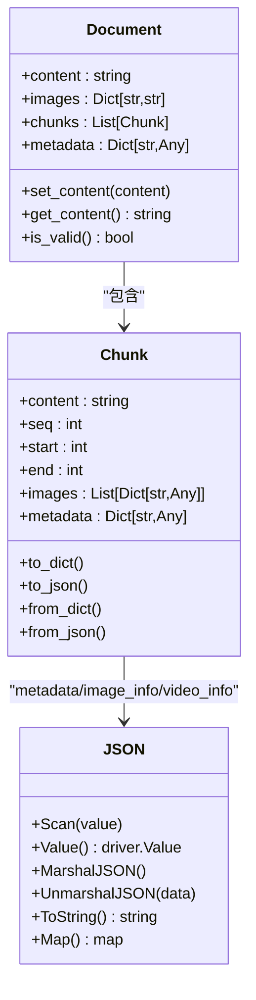
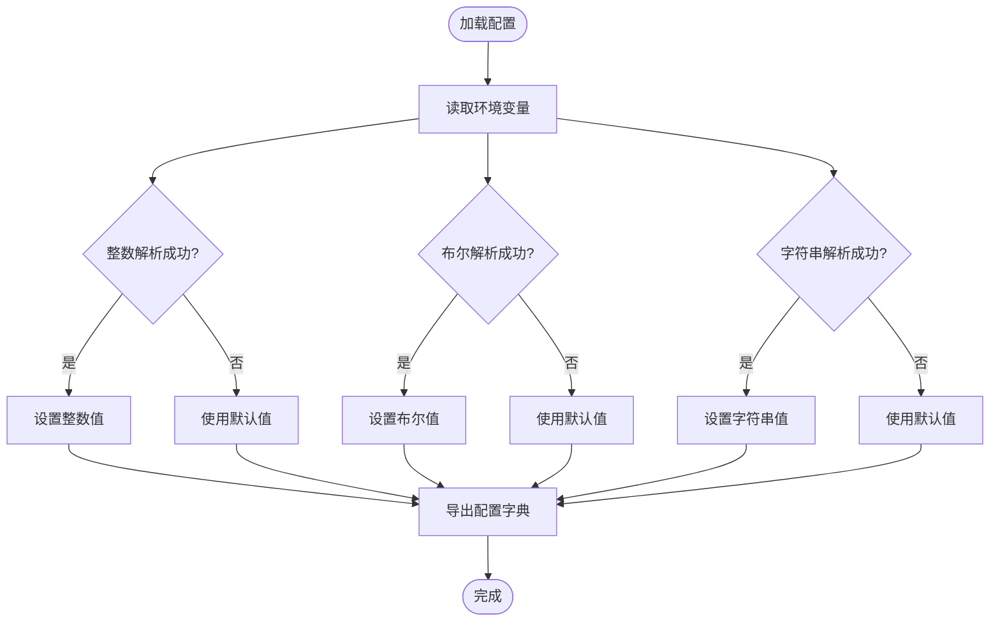
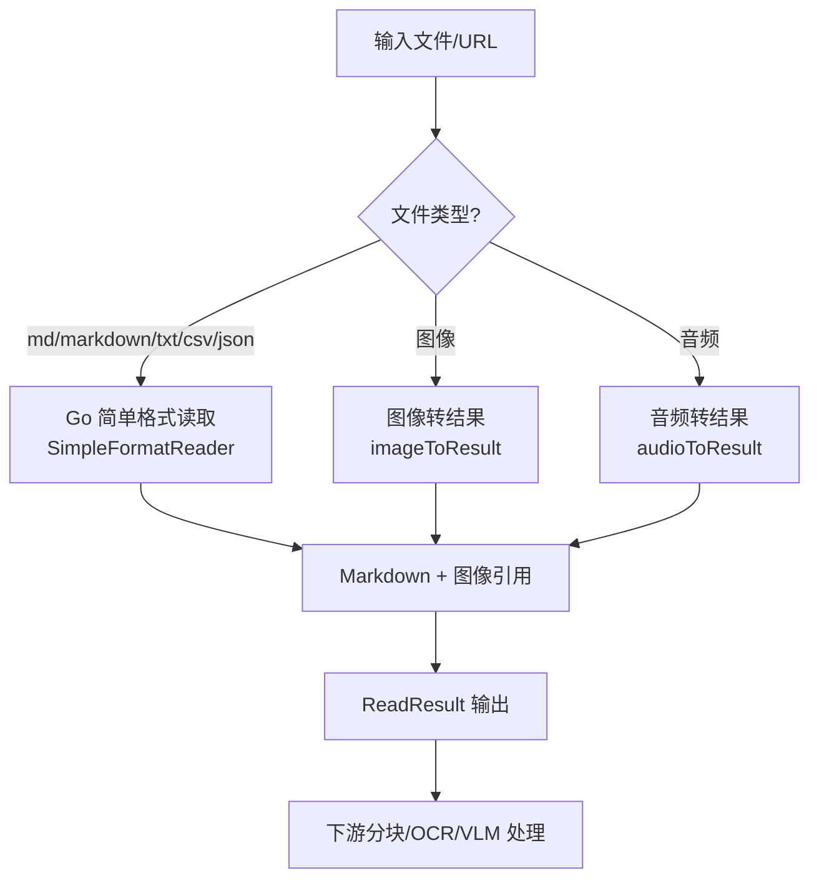
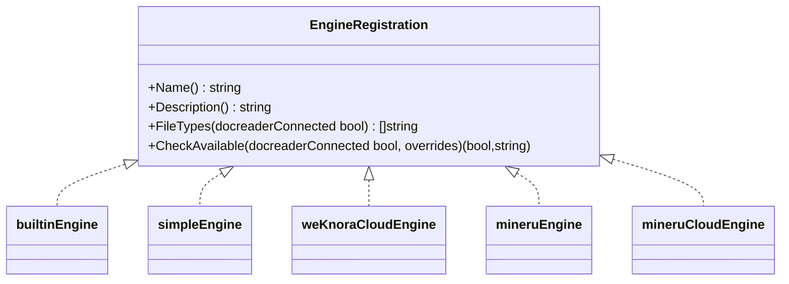
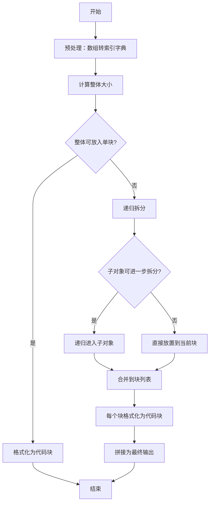
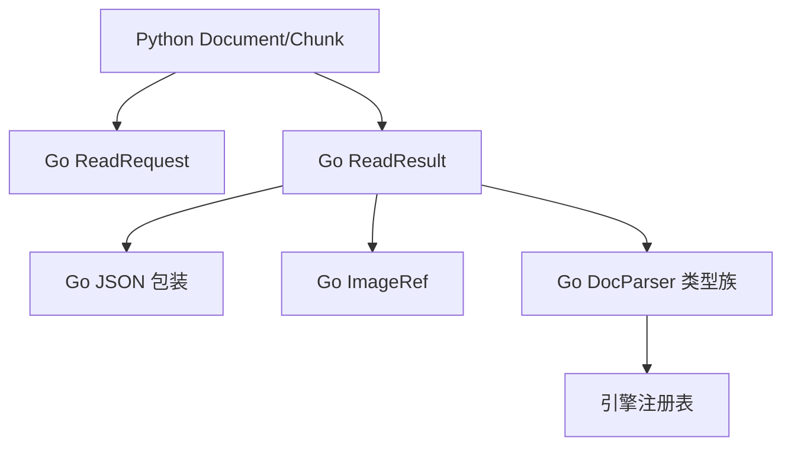

# 文档模型

<cite>
**本文引用的文件**
- [document.py](file://docreader/models/document.py)
- [read_config.py](file://docreader/models/read_config.py)
- [config.py](file://docreader/config.py)
- [docparser.go](file://internal/types/docparser.go)
- [chunk.go](file://internal/types/chunk.go)
- [json.go](file://internal/types/json.go)
- [builtin_converter.go](file://internal/infrastructure/docparser/builtin_converter.go)
- [json_converter.go](file://internal/infrastructure/docparser/json_converter.go)
- [engine_registry.go](file://internal/infrastructure/docparser/engine_registry.go)
- [base_parser.py](file://docreader/parser/base_parser.py)
- [docx_parser.py](file://docreader/parser/docx_parser.py)
</cite>

## 目录
1. [简介](#简介)
2. [项目结构](#项目结构)
3. [核心组件](#核心组件)
4. [架构总览](#架构总览)
5. [详细组件分析](#详细组件分析)
6. [依赖分析](#依赖分析)
7. [性能考虑](#性能考虑)
8. [故障排查指南](#故障排查指南)
9. [结论](#结论)
10. [附录](#附录)

## 简介
本技术文档围绕 WeKnora 的文档模型展开，重点覆盖以下方面：
- Document 类的数据结构设计、字段定义与属性管理
- ReadConfig 配置模型的参数选项、默认值与验证规则
- 文档元数据处理、内容提取与格式转换的技术实现
- 模型序列化/反序列化与数据一致性保障机制
- 模型扩展与自定义配置的开发指南

文档同时梳理了 Go 侧与 Python 侧的文档读取与分块类型定义，以及解析引擎注册与选择机制，帮助读者从整体到细节全面理解文档模型的设计与实现。

## 项目结构
WeKnora 的文档模型涉及两个主要子系统：
- Python 文档模型与解析配置：位于 docreader 子目录，包含文档对象、分块对象、解析配置等
- Go 类型与基础设施：位于 internal 子目录，包含统一的读取请求/结果、分块类型、JSON 包装、解析器引擎注册与内置转换器等

图表来源
- [document.py:62-87](file://docreader/models/document.py#L62-L87)
- [read_config.py:4-17](file://docreader/models/read_config.py#L4-L17)
- [config.py:48-97](file://docreader/config.py#L48-L97)
- [docparser.go:3-96](file://internal/types/docparser.go#L3-L96)
- [chunk.go:106-166](file://internal/types/chunk.go#L106-L166)
- [json.go:9-85](file://internal/types/json.go#L9-L85)
- [builtin_converter.go:45-131](file://internal/infrastructure/docparser/builtin_converter.go#L45-L131)
- [json_converter.go:20-69](file://internal/infrastructure/docparser/json_converter.go#L20-L69)
- [engine_registry.go:19-33](file://internal/infrastructure/docparser/engine_registry.go#L19-L33)

章节来源
- [document.py:62-87](file://docreader/models/document.py#L62-L87)
- [config.py:48-97](file://docreader/config.py#L48-L97)
- [docparser.go:3-96](file://internal/types/docparser.go#L3-L96)
- [chunk.go:106-166](file://internal/types/chunk.go#L106-L166)
- [json.go:9-85](file://internal/types/json.go#L9-L85)
- [builtin_converter.go:45-131](file://internal/infrastructure/docparser/builtin_converter.go#L45-L131)
- [json_converter.go:20-69](file://internal/infrastructure/docparser/json_converter.go#L20-L69)
- [engine_registry.go:19-33](file://internal/infrastructure/docparser/engine_registry.go#L19-L33)

## 核心组件
本节聚焦于文档模型的关键类型与配置项，涵盖字段定义、默认值、校验逻辑与序列化/反序列化行为。

- Document（Python）
  - 字段
    - content: 文档文本内容
    - images: 文档内图片映射（键为图片标识，值为引用路径或数据）
    - chunks: 分块列表（Chunk 对象）
    - metadata: 文档级元数据字典
  - 属性管理
    - 提供 set_content/get_content 访问器
    - is_valid 校验 content 非空
  - 序列化/反序列化
    - 支持 to_dict/to_json/from_dict/from_json
    - 通过 model_config 允许任意类型字段

- Chunk（Python）
  - 字段
    - content: 分块文本
    - seq/start/end: 分块序号与在原文中的起止位置
    - images: 分块内图片信息数组
    - metadata: 分块级元数据
  - 序列化/反序列化
    - 支持 to_dict/to_json/from_dict/from_json
    - __hash__/__eq__ 基于 content

- ReadConfig（Python）
  - ChunkingConfig（兼容性保留）
    - chunk_size、chunk_overlap、separators、enable_multimodal、storage_config、vlm_config
    - 仅保留以兼容旧解析器构造函数
  - DocReaderConfig（运行时配置）
    - grpc_max_workers、grpc_max_file_size_mb、grpc_port、docx_max_pages、external_http_proxy、external_https_proxy、image_output_dir
    - 默认值来源于环境变量，具备容错解析（整数、布尔、字符串）

- Go 类型（统一传输与持久化）
  - ReadRequest/ReadResult/ImageRef：文档读取的跨语言传输载体
  - ParsedChunk/ParsedImage：分块与图片的解析产物
  - Chunk：数据库持久化分块结构，含类型、标志位、元数据、图片/视频信息等
  - JSON：数据库 JSON 字段包装，确保序列化安全与一致性

章节来源
- [document.py:62-87](file://docreader/models/document.py#L62-L87)
- [document.py:9-60](file://docreader/models/document.py#L9-L60)
- [read_config.py:4-17](file://docreader/models/read_config.py#L4-L17)
- [config.py:48-97](file://docreader/config.py#L48-L97)
- [docparser.go:3-96](file://internal/types/docparser.go#L3-L96)
- [chunk.go:106-166](file://internal/types/chunk.go#L106-L166)
- [json.go:9-85](file://internal/types/json.go#L9-L85)

## 架构总览
下图展示从解析器到分块入库的整体流程，包括 Python 文档模型与 Go 类型之间的协作。

图表来源
- [base_parser.py:43-61](file://docreader/parser/base_parser.py#L43-L61)
- [document.py:62-87](file://docreader/models/document.py#L62-L87)
- [docparser.go:3-96](file://internal/types/docparser.go#L3-L96)
- [builtin_converter.go:45-131](file://internal/infrastructure/docparser/builtin_converter.go#L45-L131)
- [engine_registry.go:19-33](file://internal/infrastructure/docparser/engine_registry.go#L19-L33)

## 详细组件分析

### Document 与 Chunk 数据模型
- 设计要点
  - Document 作为顶层容器，聚合 content/images/chunks/metadata
  - Chunk 作为最小可检索单元，携带内容与位置信息，并可内嵌图片元信息
  - Python 使用 Pydantic 定义字段与默认值；Go 使用结构体与 GORM 标签进行持久化映射
- 序列化/反序列化
  - Python：to_dict/to_json/from_dict/from_json 支持灵活序列化；from_dict 自动去除 class_name 元信息
  - Go：JSON 包装类型 JSON 实现 sql.Scanner/driver.Valuer/json.Marshaler/json.Unmarshaler，避免共享缓冲区导致的数据污染
- 数据一致性
  - Go 的 JSON 包装在 UnmarshalJSON 中复制输入，确保后续输入缓冲区重用不会破坏已存储的 JSON

图表来源
- [document.py:62-87](file://docreader/models/document.py#L62-L87)
- [document.py:9-60](file://docreader/models/document.py#L9-L60)
- [chunk.go:106-166](file://internal/types/chunk.go#L106-L166)
- [json.go:9-85](file://internal/types/json.go#L9-L85)

章节来源
- [document.py:62-87](file://docreader/models/document.py#L62-L87)
- [document.py:9-60](file://docreader/models/document.py#L9-L60)
- [chunk.go:106-166](file://internal/types/chunk.go#L106-L166)
- [json.go:9-85](file://internal/types/json.go#L9-L85)

### ReadConfig 配置模型
- DocReaderConfig（运行时配置）
  - 参数与默认值
    - grpc_max_workers: 默认 4
    - grpc_max_file_size_mb: 默认 50MB（内部转换为字节）
    - grpc_port: 默认 50051
    - docx_max_pages: 默认 100
    - external_http_proxy/external_https_proxy: 默认空字符串
    - image_output_dir: 默认 /tmp/docreader
  - 解析规则
    - 优先从环境变量加载，支持多键名回退
    - 整数/布尔解析具备容错：空值或异常时返回默认值
    - 打印配置时可掩码敏感信息
- ChunkingConfig（兼容性）
  - 保留字段：chunk_size、chunk_overlap、separators、enable_multimodal、storage_config、vlm_config
  - 说明：当前分块在 Go 侧完成，该配置仅为兼容旧解析器构造函数

图表来源
- [config.py:66-97](file://docreader/config.py#L66-L97)
- [config.py:103-121](file://docreader/config.py#L103-L121)
- [read_config.py:4-17](file://docreader/models/read_config.py#L4-L17)

章节来源
- [config.py:66-97](file://docreader/config.py#L66-L97)
- [config.py:103-121](file://docreader/config.py#L103-L121)
- [read_config.py:4-17](file://docreader/models/read_config.py#L4-L17)

### 文档元数据处理、内容提取与格式转换
- 元数据处理
  - Document/Chunk 提供 metadata 字段，支持任意键值对
  - Go 侧通过 JSON 包装类型安全存储 JSON 元数据，避免共享缓冲区问题
- 内容提取
  - Python 解析器 parse 方法返回 Document，记录字符数量与文件名
  - Go 侧 ReadResult 返回 MarkdownContent、ImageRefs、Metadata、错误信息、音频标记与音频数据
- 格式转换
  - 简单格式（md/markdown/txt/csv/json）由 Go 的 SimpleFormatReader 直接处理
  - 图像与音频：生成 Markdown 引用或占位符，并在 ImageRefs 中携带原始数据
  - JSON：采用语义分块算法，保持嵌套路径完整，输出为代码块序列

图表来源
- [builtin_converter.go:45-131](file://internal/infrastructure/docparser/builtin_converter.go#L45-L131)
- [json_converter.go:20-69](file://internal/infrastructure/docparser/json_converter.go#L20-L69)
- [docparser.go:16-25](file://internal/types/docparser.go#L16-L25)

章节来源
- [base_parser.py:43-61](file://docreader/parser/base_parser.py#L43-L61)
- [builtin_converter.go:45-131](file://internal/infrastructure/docparser/builtin_converter.go#L45-L131)
- [json_converter.go:20-69](file://internal/infrastructure/docparser/json_converter.go#L20-L69)
- [docparser.go:16-25](file://internal/types/docparser.go#L16-L25)

### 解析引擎注册与选择
- 本地引擎注册
  - 通过 EngineRegistration 接口注册本地引擎，初始化时批量注册
  - 支持引擎名称、描述、文件类型、可用性检查
- 引擎类型
  - builtin：基于 DocReader 的复杂格式解析
  - simple：Go 原生处理 md/txt/csv/json 等简单格式
  - weknoracloud/mineru/mineruCloud：云端解析服务
- 文件类型覆盖
  - builtin 支持 docx/doc/pdf/md/markdown/xlsx/xls/jpg/jpeg/png/gif/bmp/tiff/webp/mp3/wav/m4a/flac/ogg
  - simple 支持 md/markdown/txt/text/csv/json，以及多种图像/音频格式

图表来源
- [engine_registry.go:9-33](file://internal/infrastructure/docparser/engine_registry.go#L9-L33)

章节来源
- [engine_registry.go:9-33](file://internal/infrastructure/docparser/engine_registry.go#L9-L33)

### 复杂逻辑：JSON 语义分块
- 目标
  - 将大 JSON 按目标大小切分为“有效 JSON 对象”块，保持从根到叶的路径完整
- 关键步骤
  - 预处理：将数组转换为索引键字典，统一处理
  - 递归拆分：按默认块大小与最小块大小控制，必要时递归进入子对象
  - 路径保留：通过 setNestedDict 在新块中重建嵌套路径
  - 输出：每个块包裹为代码块，便于下游文本分块器按边界切分

图表来源
- [json_converter.go:20-69](file://internal/infrastructure/docparser/json_converter.go#L20-L69)
- [json_converter.go:74-133](file://internal/infrastructure/docparser/json_converter.go#L74-L133)
- [json_converter.go:135-161](file://internal/infrastructure/docparser/json_converter.go#L135-L161)
- [json_converter.go:163-184](file://internal/infrastructure/docparser/json_converter.go#L163-L184)

章节来源
- [json_converter.go:20-69](file://internal/infrastructure/docparser/json_converter.go#L20-L69)
- [json_converter.go:74-133](file://internal/infrastructure/docparser/json_converter.go#L74-L133)
- [json_converter.go:135-161](file://internal/infrastructure/docparser/json_converter.go#L135-L161)
- [json_converter.go:163-184](file://internal/infrastructure/docparser/json_converter.go#L163-L184)

## 依赖分析
- 组件耦合
  - Python 文档模型与 Go 类型通过 ReadRequest/ReadResult 低耦合对接
  - Go JSON 包装类型向上游屏蔽数据库与序列化细节
  - 解析引擎注册集中管理，便于扩展与替换
- 外部依赖
  - Python 侧依赖 Pydantic 进行模型定义与序列化
  - Go 侧依赖 GORM 进行数据库映射与查询

图表来源
- [document.py:62-87](file://docreader/models/document.py#L62-L87)
- [docparser.go:3-96](file://internal/types/docparser.go#L3-L96)
- [json.go:9-85](file://internal/types/json.go#L9-L85)
- [engine_registry.go:19-33](file://internal/infrastructure/docparser/engine_registry.go#L19-L33)

章节来源
- [document.py:62-87](file://docreader/models/document.py#L62-L87)
- [docparser.go:3-96](file://internal/types/docparser.go#L3-L96)
- [json.go:9-85](file://internal/types/json.go#L9-L85)
- [engine_registry.go:19-33](file://internal/infrastructure/docparser/engine_registry.go#L19-L33)

## 性能考虑
- 简单格式直通
  - md/txt/csv/json 与常见图像/音频格式由 Go 直接处理，减少 Python 服务开销
- JSON 语义分块
  - 采用递归拆分与路径保留策略，兼顾块大小与语义完整性
- 配置容错
  - 环境变量解析失败时使用默认值，避免启动失败
- 数据库 JSON
  - JSON 包装在 Unmarshal 时复制数据，避免共享缓冲区导致的内存复用问题

## 故障排查指南
- 配置未生效
  - 检查环境变量键名是否正确，确认容错解析逻辑是否返回默认值
  - 使用打印函数查看最终生效配置
- JSON 元数据异常
  - 确认 JSON 包装类型是否正确序列化/反序列化
  - 注意输入缓冲区重用场景下的数据一致性
- 图像/音频处理
  - 确认文件类型识别与转换逻辑是否命中
  - 检查 ImageRefs 是否包含原始数据与 MIME 类型
- 引擎不可用
  - 查看引擎可用性检查结果与原因
  - 确认 DocReader 服务连接状态

章节来源
- [config.py:117-121](file://docreader/config.py#L117-L121)
- [json.go:57-66](file://internal/types/json.go#L57-L66)
- [builtin_converter.go:133-176](file://internal/infrastructure/docparser/builtin_converter.go#L133-L176)
- [engine_registry.go:48-53](file://internal/infrastructure/docparser/engine_registry.go#L48-L53)

## 结论
WeKnora 的文档模型在 Python 与 Go 两侧协同工作：Python 侧重文档对象与解析配置，Go 侧重统一类型、持久化与高性能转换。通过严格的序列化/反序列化与 JSON 包装、清晰的引擎注册机制与健壮的配置解析，系统实现了高一致性与可扩展性。开发者可在不破坏现有契约的前提下，扩展解析引擎、调整配置参数并引入新的文档格式。

## 附录
- 开发指南（面向扩展）
  - 新增解析引擎
    - 实现 EngineRegistration 接口并注册
    - 明确支持的文件类型与可用性检查逻辑
  - 自定义配置
    - 在 DocReaderConfig 中新增字段与默认值
    - 提供环境变量键名与容错解析逻辑
  - 文档模型扩展
    - 在 Python 侧扩展 Document/Chunk 字段时，确保 to_dict/to_json/from_* 方法兼容
    - 在 Go 侧扩展 Chunk 或 JSON 字段时，完善 JSON 包装与数据库映射