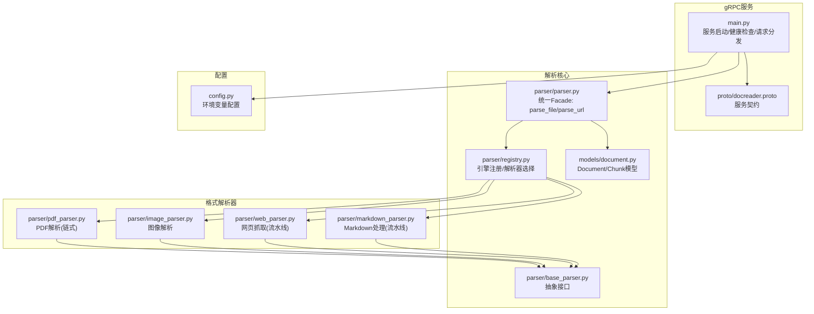
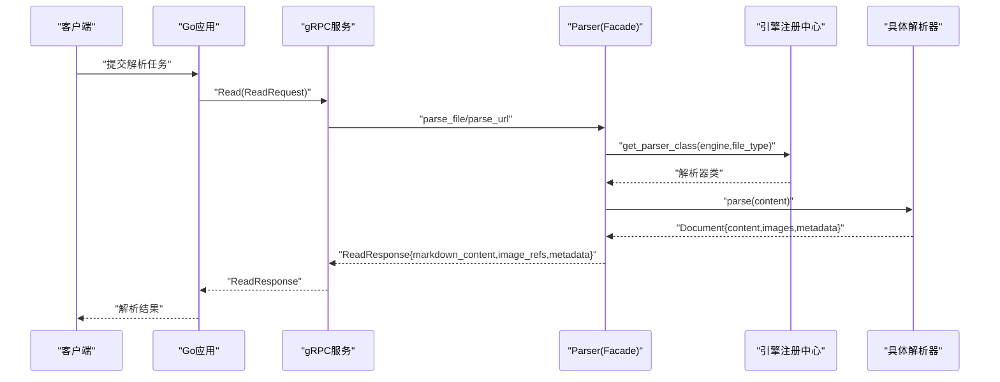
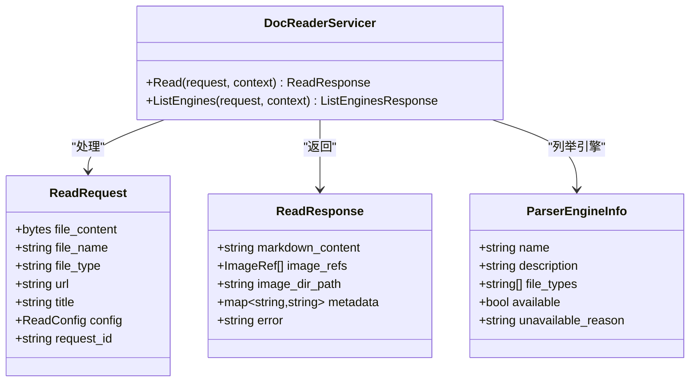
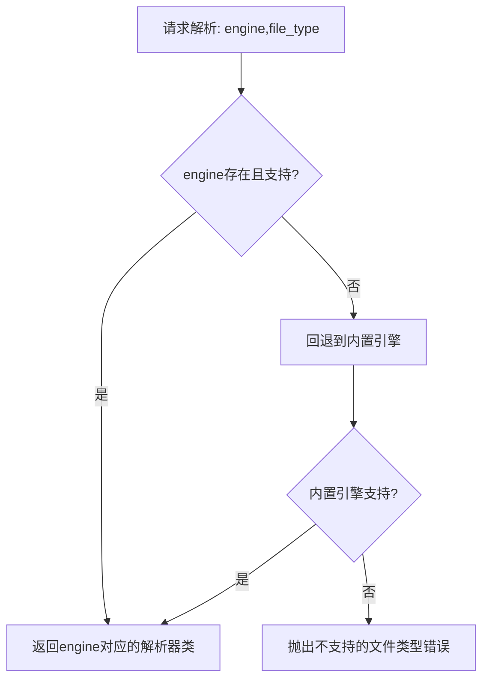
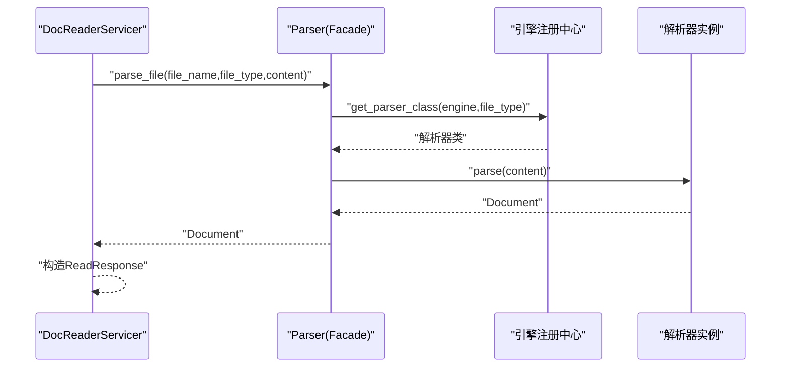
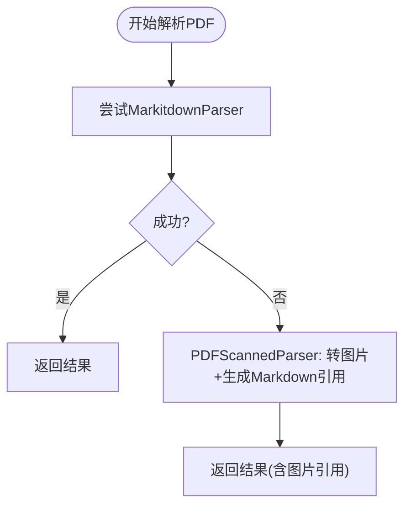
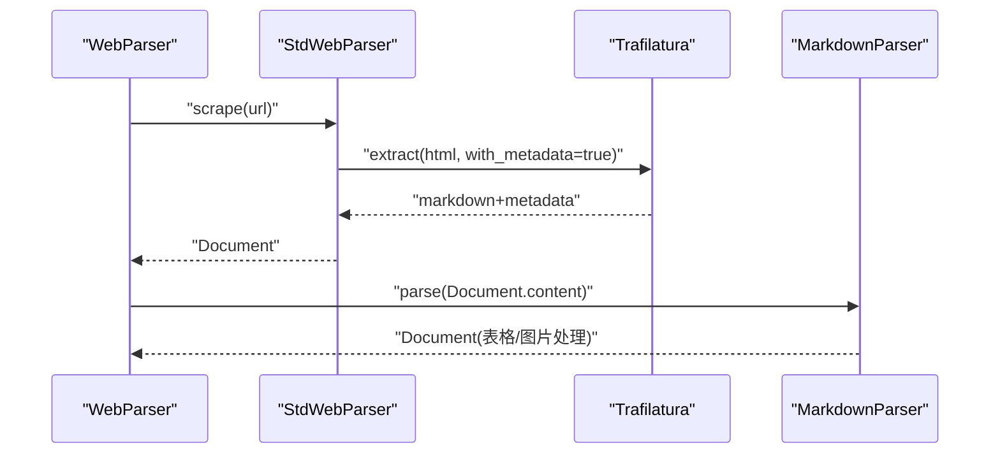
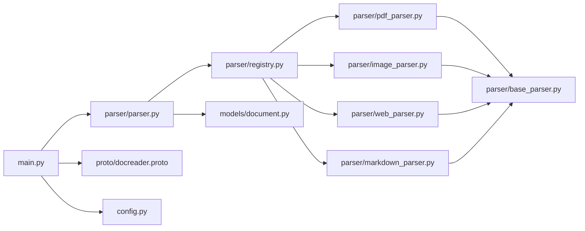

# 文档解析服务

<cite>
**本文引用的文件**
- [docreader/main.py](file://docreader/main.py)
- [docreader/proto/docreader.proto](file://docreader/proto/docreader.proto)
- [docreader/models/document.py](file://docreader/models/document.py)
- [docreader/config.py](file://docreader/config.py)
- [docreader/parser/__init__.py](file://docreader/parser/__init__.py)
- [docreader/parser/registry.py](file://docreader/parser/registry.py)
- [docreader/parser/base_parser.py](file://docreader/parser/base_parser.py)
- [docreader/parser/parser.py](file://docreader/parser/parser.py)
- [docreader/parser/pdf_parser.py](file://docreader/parser/pdf_parser.py)
- [docreader/parser/image_parser.py](file://docreader/parser/image_parser.py)
- [docreader/parser/web_parser.py](file://docreader/parser/web_parser.py)
- [docreader/parser/markdown_parser.py](file://docreader/parser/markdown_parser.py)
</cite>

## 目录
1. [简介](#简介)
2. [项目结构](#项目结构)
3. [核心组件](#核心组件)
4. [架构总览](#架构总览)
5. [详细组件分析](#详细组件分析)
6. [依赖分析](#依赖分析)
7. [性能考虑](#性能考虑)
8. [故障排除指南](#故障排除指南)
9. [结论](#结论)
10. [附录](#附录)

## 简介
本技术文档面向WeKnora文档解析服务，系统性阐述Python解析服务的架构设计、gRPC通信协议与多格式文档支持能力。重点覆盖PDF解析、Word文档处理、图像识别、网页抓取等具体实现；解释解析器注册机制、并发处理策略与错误恢复机制；并给出解析质量控制、元数据提取与格式转换的技术细节，以及解析器扩展开发、性能调优与故障排除的实践指南。

## 项目结构
docreader模块采用“分层+职责分离”的组织方式：
- 协议与入口：gRPC服务定义与启动入口
- 模型：统一的Document/Chunk数据模型
- 解析器：按格式划分的解析器族，支持链式与流水线组合
- 注册中心：解析引擎注册与可用性检测
- 配置：运行参数与环境变量驱动的配置加载

**图表来源**
- [docreader/main.py:184-215](file://docreader/main.py#L184-L215)
- [docreader/proto/docreader.proto:7-62](file://docreader/proto/docreader.proto#L7-L62)
- [docreader/parser/parser.py:11-83](file://docreader/parser/parser.py#L11-L83)
- [docreader/parser/registry.py:18-161](file://docreader/parser/registry.py#L18-L161)
- [docreader/parser/base_parser.py:13-62](file://docreader/parser/base_parser.py#L13-L62)
- [docreader/parser/pdf_parser.py:57-69](file://docreader/parser/pdf_parser.py#L57-L69)
- [docreader/parser/image_parser.py:11-29](file://docreader/parser/image_parser.py#L11-L29)
- [docreader/parser/web_parser.py:128-138](file://docreader/parser/web_parser.py#L128-L138)
- [docreader/parser/markdown_parser.py:376-388](file://docreader/parser/markdown_parser.py#L376-L388)
- [docreader/models/document.py:62-88](file://docreader/models/document.py#L62-L88)
- [docreader/config.py:66-122](file://docreader/config.py#L66-L122)

**章节来源**
- [docreader/main.py:1-215](file://docreader/main.py#L1-L215)
- [docreader/proto/docreader.proto:1-62](file://docreader/proto/docreader.proto#L1-L62)
- [docreader/parser/__init__.py:1-39](file://docreader/parser/__init__.py#L1-L39)
- [docreader/parser/registry.py:112-161](file://docreader/parser/registry.py#L112-L161)
- [docreader/parser/parser.py:11-83](file://docreader/parser/parser.py#L11-L83)
- [docreader/parser/base_parser.py:13-62](file://docreader/parser/base_parser.py#L13-L62)
- [docreader/models/document.py:1-88](file://docreader/models/document.py#L1-L88)
- [docreader/config.py:66-122](file://docreader/config.py#L66-L122)

## 核心组件
- gRPC服务端：提供Read与ListEngines两个RPC，统一处理文件内容与URL内容解析，并返回Markdown正文、图片引用与元数据。
- 解析器门面：根据请求选择引擎与解析器类，屏蔽底层差异。
- 引擎注册中心：维护引擎到文件类型的映射，支持回退至内置引擎，并可检测可用性。
- 抽象解析器：定义parse_into_text契约，确保各格式解析器输出一致的数据结构。
- 数据模型：Document封装内容、图片引用、分块与元数据；Chunk用于后续切分。
- 配置系统：从环境变量加载gRPC并发、消息大小、代理与图片输出目录等参数。

**章节来源**
- [docreader/main.py:98-182](file://docreader/main.py#L98-L182)
- [docreader/parser/parser.py:11-83](file://docreader/parser/parser.py#L11-L83)
- [docreader/parser/registry.py:18-106](file://docreader/parser/registry.py#L18-L106)
- [docreader/parser/base_parser.py:13-62](file://docreader/parser/base_parser.py#L13-L62)
- [docreader/models/document.py:9-88](file://docreader/models/document.py#L9-L88)
- [docreader/config.py:48-97](file://docreader/config.py#L48-L97)

## 架构总览
服务采用“Go侧主控 + Python解析器侧”的协作模式：
- Go应用负责并发调度、存储上传、OCR/VLM、分块与索引。
- Python解析器专注于“抽取Markdown正文 + 图片引用”，不直接落盘。
- 通过gRPC传输统一的ReadResponse，包含markdown_content、image_refs、metadata与错误信息。

**图表来源**
- [docreader/main.py:103-161](file://docreader/main.py#L103-L161)
- [docreader/parser/parser.py:25-83](file://docreader/parser/parser.py#L25-L83)
- [docreader/parser/registry.py:51-76](file://docreader/parser/registry.py#L51-L76)

## 详细组件分析

### gRPC服务与协议
- 服务定义：DocReader.Read接收文件或URL两种模式；ListEngines返回可用引擎清单。
- 请求/响应：ReadRequest包含文件名/类型/内容、URL/标题、读取配置与请求ID；ReadResponse包含markdown正文、图片引用列表、图片目录路径与元数据。
- 健康检查：集成Health服务，便于容器编排与探活。
- 并发与限流：基于ThreadPoolExecutor与最大消息长度配置，受环境变量控制。

**图表来源**
- [docreader/proto/docreader.proto:7-62](file://docreader/proto/docreader.proto#L7-L62)
- [docreader/main.py:98-182](file://docreader/main.py#L98-L182)

**章节来源**
- [docreader/proto/docreader.proto:20-62](file://docreader/proto/docreader.proto#L20-L62)
- [docreader/main.py:184-215](file://docreader/main.py#L184-L215)

### 解析器注册机制
- 引擎命名：内置引擎与第三方引擎（如markitdown）并存。
- 回退策略：若指定引擎不支持该文件类型，则自动回退到内置引擎；均不支持则抛出异常。
- 可用性检测：支持为引擎注册check_available函数，动态判断可用性与原因。
- 列表查询：ListEngines返回引擎描述、文件类型集合、可用性与原因。

**图表来源**
- [docreader/parser/registry.py:51-76](file://docreader/parser/registry.py#L51-L76)
- [docreader/parser/registry.py:77-106](file://docreader/parser/registry.py#L77-L106)

**章节来源**
- [docreader/parser/registry.py:18-161](file://docreader/parser/registry.py#L18-L161)

### 解析器门面与并发策略
- 门面职责：统一封装parse_file与parse_url，选择解析器并执行。
- 并发模型：gRPC服务器使用线程池执行器，最大工作线程数由环境变量控制；单次请求内解析器内部不引入额外并发。
- 错误处理：捕获异常并返回ReadResponse.error，同时记录堆栈日志。

**图表来源**
- [docreader/main.py:103-161](file://docreader/main.py#L103-L161)
- [docreader/parser/parser.py:25-64](file://docreader/parser/parser.py#L25-L64)
- [docreader/parser/registry.py:51-76](file://docreader/parser/registry.py#L51-L76)

**章节来源**
- [docreader/main.py:187-210](file://docreader/main.py#L187-L210)
- [docreader/parser/parser.py:11-83](file://docreader/parser/parser.py#L11-L83)

### PDF解析实现
- 链式解析：PDFParser采用FirstParser策略，按顺序尝试多个后端，首个成功即返回。
- 多后端策略：
  - MarkitdownParser：优先尝试结构化解析。
  - PDFScannedParser：当无文本时，将每页转为图片，生成Markdown图片引用，供Go侧OCR处理。
- 元数据：记录扫描来源类型与页数，便于后续处理策略选择。

**图表来源**
- [docreader/parser/pdf_parser.py:57-69](file://docreader/parser/pdf_parser.py#L57-L69)
- [docreader/parser/pdf_parser.py:13-56](file://docreader/parser/pdf_parser.py#L13-L56)

**章节来源**
- [docreader/parser/pdf_parser.py:1-69](file://docreader/parser/pdf_parser.py#L1-L69)

### Word文档处理
- 支持格式：doc与docx两类。
- 解析器：DocParser与Docx2Parser分别对应不同格式，均由注册中心统一调度。
- 限制：docx最大页数可通过配置控制，避免超大文档导致内存压力。

**章节来源**
- [docreader/parser/registry.py:120-133](file://docreader/parser/registry.py#L120-L133)
- [docreader/config.py:76-76](file://docreader/config.py#L76-L76)

### 图像识别与处理
- 图像解析：ImageParser将图像编码为Markdown图片引用，并在Document.images中保留原始字节，交由Go侧处理存储与OCR。
- 输出约定：图片引用路径以images/开头，便于Go侧统一管理。

**章节来源**
- [docreader/parser/image_parser.py:11-29](file://docreader/parser/image_parser.py#L11-L29)
- [docreader/main.py:54-96](file://docreader/main.py#L54-L96)

### 网页抓取与内容抽取
- 抓取流程：StdWebParser使用Playwright WebKit渲染页面，Trafilatura抽取正文，支持代理配置。
- 流水线：WebParser将StdWebParser与MarkdownParser串联，先抓取HTML再标准化Markdown。
- 元数据：从Trafilatura输出中提取标题，增强下游检索效果。

**图表来源**
- [docreader/parser/web_parser.py:18-126](file://docreader/parser/web_parser.py#L18-L126)
- [docreader/parser/web_parser.py:128-138](file://docreader/parser/web_parser.py#L128-L138)
- [docreader/parser/markdown_parser.py:376-388](file://docreader/parser/markdown_parser.py#L376-L388)

**章节来源**
- [docreader/parser/web_parser.py:18-172](file://docreader/parser/web_parser.py#L18-L172)
- [docreader/parser/markdown_parser.py:127-161](file://docreader/parser/markdown_parser.py#L127-L161)

### Markdown处理与图片提取
- 表格标准化：MarkdownTableFormatter统一表格对齐与间距，提升一致性。
- Base64图片提取：MarkdownImageBase64从Markdown中提取base64图片，生成唯一文件名并替换为路径引用，原始二进制数据放入Document.images，供Go侧上传与后续处理。
- 流水线：MarkdownParser按序执行表格格式化与图片提取。

**章节来源**
- [docreader/parser/markdown_parser.py:30-104](file://docreader/parser/markdown_parser.py#L30-L104)
- [docreader/parser/markdown_parser.py:163-339](file://docreader/parser/markdown_parser.py#L163-L339)
- [docreader/parser/markdown_parser.py:352-374](file://docreader/parser/markdown_parser.py#L352-L374)
- [docreader/parser/markdown_parser.py:376-388](file://docreader/parser/markdown_parser.py#L376-L388)

### 数据模型与元数据
- Document：包含content、images、chunks、metadata四要素，满足跨格式统一输出。
- Chunk：用于后续分块与索引，支持序列号、起止位置与图片集合。
- 元数据：网页抓取可提取标题；PDF扫描场景可附加页数与来源类型。

**章节来源**
- [docreader/models/document.py:9-88](file://docreader/models/document.py#L9-L88)

## 依赖分析
- 组件耦合：DocReaderServicer依赖Parser；Parser依赖Registry；具体解析器继承BaseParser。
- 外部依赖：Trafilatura用于网页内容抽取；pdfplumber用于PDF转图片；Playwright用于网页渲染。
- 配置依赖：gRPC并发、消息大小、代理与图片输出目录由环境变量驱动。

**图表来源**
- [docreader/main.py:184-215](file://docreader/main.py#L184-L215)
- [docreader/parser/parser.py:11-83](file://docreader/parser/parser.py#L11-L83)
- [docreader/parser/registry.py:112-161](file://docreader/parser/registry.py#L112-L161)
- [docreader/parser/pdf_parser.py:1-69](file://docreader/parser/pdf_parser.py#L1-L69)
- [docreader/parser/image_parser.py:1-29](file://docreader/parser/image_parser.py#L1-L29)
- [docreader/parser/web_parser.py:1-172](file://docreader/parser/web_parser.py#L1-L172)
- [docreader/parser/markdown_parser.py:1-406](file://docreader/parser/markdown_parser.py#L1-L406)
- [docreader/parser/base_parser.py:13-62](file://docreader/parser/base_parser.py#L13-L62)
- [docreader/proto/docreader.proto:1-62](file://docreader/proto/docreader.proto#L1-L62)
- [docreader/config.py:66-122](file://docreader/config.py#L66-L122)
- [docreader/models/document.py:1-88](file://docreader/models/document.py#L1-L88)

**章节来源**
- [docreader/parser/__init__.py:16-38](file://docreader/parser/__init__.py#L16-L38)

## 性能考虑
- 并发与吞吐：通过gRPC线程池与最大消息长度配置控制并发度与单次载荷上限，建议结合CPU核数与内存资源调整。
- I/O与渲染：网页抓取依赖Playwright渲染，建议启用代理与合理超时；PDF转图片可能产生大量中间图片，需关注磁盘与内存占用。
- 缓存与复用：解析器内部不缓存，建议在上游（Go应用）进行请求级缓存与去重。
- 资源隔离：图片输出目录与代理配置可独立设置，便于容器化部署与资源隔离。

[本节为通用性能指导，无需特定文件引用]

## 故障排除指南
- 无法解析：确认文件类型是否在引擎注册表中；若指定引擎不支持，将回退到内置引擎。
- 空内容：检查解析器返回的Document.content是否为空；必要时切换解析器或启用备用策略（如PDF扫描转图片）。
- 图片缺失：确认Document.images是否包含预期路径；Go侧应负责上传与替换路径。
- 网页抓取失败：检查代理配置与URL可达性；观察Playwright渲染日志与Trafilatura抽取结果。
- gRPC错误：检查端口占用、消息大小限制与日志级别；确认Health服务正常。

**章节来源**
- [docreader/parser/registry.py:77-106](file://docreader/parser/registry.py#L77-L106)
- [docreader/main.py:162-166](file://docreader/main.py#L162-L166)
- [docreader/parser/web_parser.py:39-85](file://docreader/parser/web_parser.py#L39-L85)

## 结论
WeKnora文档解析服务通过清晰的分层与职责划分，实现了多格式文档的统一解析与输出。gRPC协议保证了跨语言交互的一致性，引擎注册机制提供了灵活的扩展点。结合Go侧的存储、OCR与分块能力，整体方案具备良好的可扩展性与工程落地性。建议在生产环境中结合监控指标与日志体系，持续优化并发与资源使用。

[本节为总结性内容，无需特定文件引用]

## 附录

### 解析器扩展开发指南
- 新增格式解析器：实现BaseParser.parse_into_text，返回Document对象。
- 注册引擎：在注册中心注册新引擎与文件类型映射，必要时提供可用性检测函数。
- 验证与测试：编写单元测试与端到端测试，覆盖常见边界场景。

**章节来源**
- [docreader/parser/base_parser.py:36-62](file://docreader/parser/base_parser.py#L36-L62)
- [docreader/parser/registry.py:32-50](file://docreader/parser/registry.py#L32-L50)

### 配置项一览
- gRPC相关：最大工作线程数、最大消息大小、监听端口
- 文档解析：docx最大页数
- 网络代理：HTTP/HTTPS代理
- 图片输出：图片输出目录

**章节来源**
- [docreader/config.py:48-97](file://docreader/config.py#L48-L97)
- [docreader/config.py:103-122](file://docreader/config.py#L103-L122)