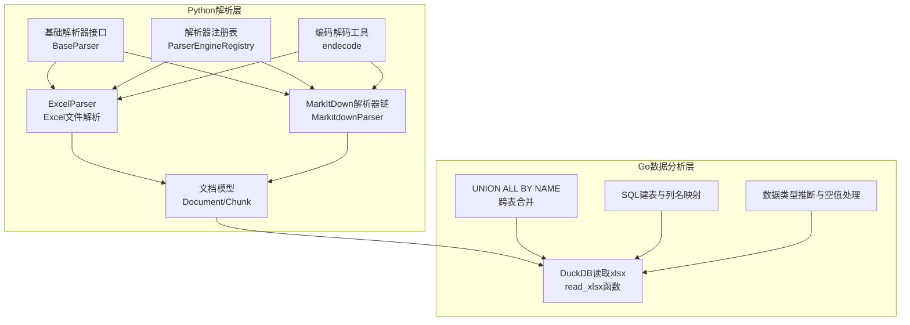
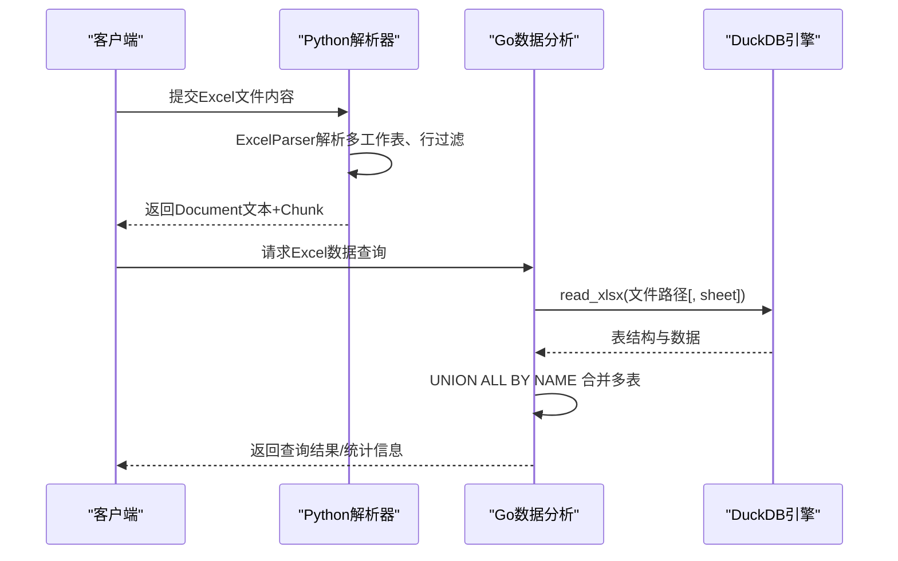
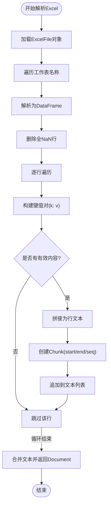
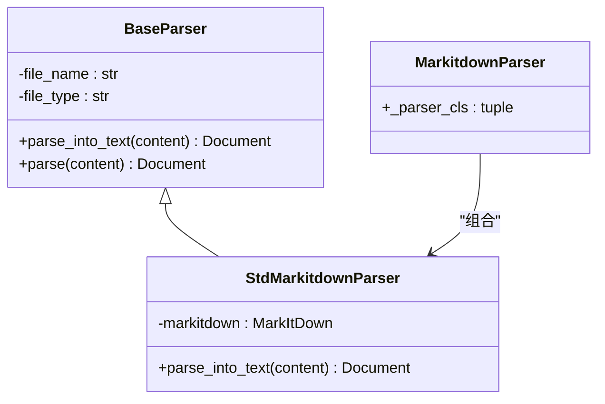
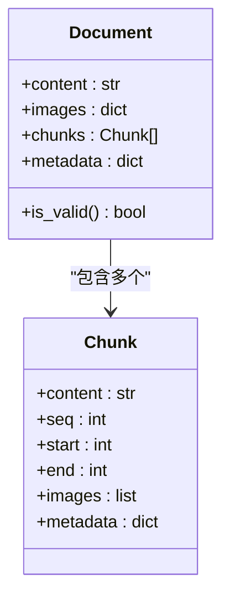
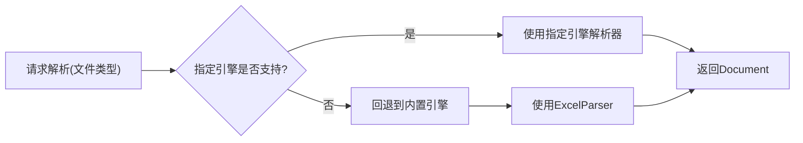
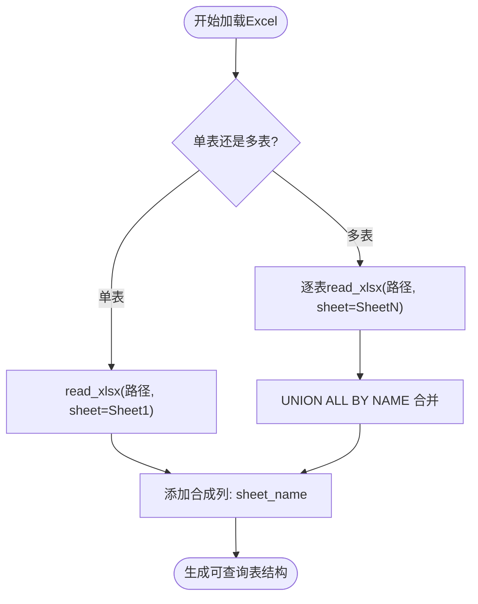
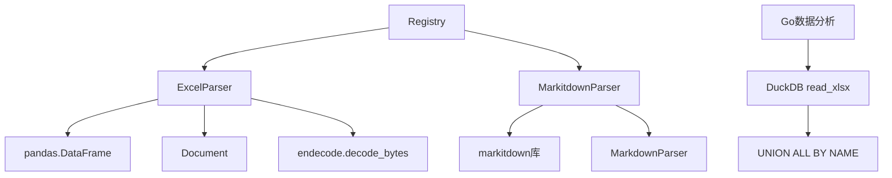

# Excel解析器

<cite>
**本文档引用的文件**
- [excel_parser.py](file://docreader/parser/excel_parser.py)
- [markitdown_parser.py](file://docreader/parser/markitdown_parser.py)
- [base_parser.py](file://docreader/parser/base_parser.py)
- [chain_parser.py](file://docreader/parser/chain_parser.py)
- [markdown_parser.py](file://docreader/parser/markdown_parser.py)
- [document.py](file://docreader/models/document.py)
- [registry.py](file://docreader/parser/registry.py)
- [endecode.py](file://docreader/utils/endecode.py)
- [main.py](file://docreader/main.py)
- [config.py](file://docreader/config.py)
- [data_analysis_test.go](file://internal/agent/tools/data_analysis_test.go)
- [data_analysis_duckdb_test.go](file://internal/agent/tools/data_analysis_duckdb_test.go)
</cite>

## 目录
1. [简介](#简介)
2. [项目结构](#项目结构)
3. [核心组件](#核心组件)
4. [架构总览](#架构总览)
5. [详细组件分析](#详细组件分析)
6. [依赖关系分析](#依赖关系分析)
7. [性能考虑](#性能考虑)
8. [故障排除指南](#故障排除指南)
9. [结论](#结论)
10. [附录](#附录)

## 简介
本技术文档面向WeKnora项目的Excel解析器，系统化阐述其在Python侧的解析实现与在Go侧的数据分析能力。文档涵盖以下要点：
- Excel文件解析：工作簿结构解析、多工作表遍历、单元格数据提取与清洗
- 表格识别与结构重建：基于行级键值对的表格化表示、行列边界的启发式判定
- 数据类型推断：基于pandas自动推断与显式转换策略
- MarkItDown转换机制：统一文档格式转换、Markdown输出与图像处理
- 多工作表处理：单表与多表合并策略、UNION ALL BY NAME容差方案
- 公式计算与图表数据提取：通过DuckDB读取xlsx并生成可查询表结构
- 配置参数：gRPC服务、解析器引擎选择、代理设置与图片输出目录
- 大文件处理优化：内存管理、分块输出与编码解码策略
- 兼容性问题：编码检测、特殊字符处理与跨平台兼容

## 项目结构
WeKnora的文档解析子系统采用“Python解析器 + Go数据分析”的分层设计：
- Python侧负责通用文档解析与格式转换（含Excel到文本）
- Go侧负责高性能数据加载、SQL查询与可视化支持（含Excel到表结构）

**图表来源**
- [excel_parser.py:1-120](file://docreader/parser/excel_parser.py#L1-L120)
- [markitdown_parser.py:1-46](file://docreader/parser/markitdown_parser.py#L1-L46)
- [base_parser.py:1-62](file://docreader/parser/base_parser.py#L1-L62)
- [registry.py:112-161](file://docreader/parser/registry.py#L112-L161)
- [document.py:62-88](file://docreader/models/document.py#L62-L88)
- [endecode.py:115-197](file://docreader/utils/endecode.py#L115-L197)
- [data_analysis_test.go:8-74](file://internal/agent/tools/data_analysis_test.go#L8-L74)
- [data_analysis_duckdb_test.go:170-283](file://internal/agent/tools/data_analysis_duckdb_test.go#L170-L283)

**章节来源**
- [excel_parser.py:1-120](file://docreader/parser/excel_parser.py#L1-L120)
- [markitdown_parser.py:1-46](file://docreader/parser/markitdown_parser.py#L1-L46)
- [base_parser.py:1-62](file://docreader/parser/base_parser.py#L1-L62)
- [registry.py:112-161](file://docreader/parser/registry.py#L112-L161)
- [document.py:62-88](file://docreader/models/document.py#L62-L88)
- [endecode.py:115-197](file://docreader/utils/endecode.py#L115-L197)
- [data_analysis_test.go:8-74](file://internal/agent/tools/data_analysis_test.go#L8-L74)
- [data_analysis_duckdb_test.go:170-283](file://internal/agent/tools/data_analysis_duckdb_test.go#L170-L283)

## 核心组件
- ExcelParser：将Excel文件按行转为“列名: 值”格式的文本，逐行生成Chunk，支持多工作表与空行过滤
- MarkItDown解析器链：封装MarkItDown库，统一处理多种文档格式（含Excel），输出文本与图像引用
- BaseParser：定义解析器接口与通用行为（初始化、日志、parse包装）
- 解析器注册表：根据文件类型选择解析器（内置引擎与MarkItDown引擎）
- 文档模型：Document与Chunk，承载文本内容、图像引用、元数据与位置信息
- 编码解码工具：提供文本编码检测、图像base64编解码与字节转换

**章节来源**
- [excel_parser.py:20-97](file://docreader/parser/excel_parser.py#L20-L97)
- [markitdown_parser.py:14-42](file://docreader/parser/markitdown_parser.py#L14-L42)
- [base_parser.py:13-61](file://docreader/parser/base_parser.py#L13-L61)
- [registry.py:112-161](file://docreader/parser/registry.py#L112-L161)
- [document.py:9-88](file://docreader/models/document.py#L9-L88)
- [endecode.py:115-197](file://docreader/utils/endecode.py#L115-L197)

## 架构总览
解析流程分为两条主线：
- Python侧：ExcelParser将每个工作表的非空行转为文本，构建Document与Chunk；MarkItDown解析器链将输入转换为Markdown文本
- Go侧：通过DuckDB的read_xlsx函数读取Excel，支持指定工作表或全表读取，并使用UNION ALL BY NAME合并不同表的结构差异

**图表来源**
- [excel_parser.py:43-97](file://docreader/parser/excel_parser.py#L43-L97)
- [data_analysis_test.go:8-74](file://internal/agent/tools/data_analysis_test.go#L8-L74)
- [data_analysis_duckdb_test.go:170-283](file://internal/agent/tools/data_analysis_duckdb_test.go#L170-L283)

## 详细组件分析

### Excel解析器（ExcelParser）
- 工作簿结构解析：使用pandas的ExcelFile对象读取所有工作表名称
- 工作表遍历：逐表解析为DataFrame，删除全NaN行（空行过滤）
- 单元格数据提取：遍历每行，跳过NaN值，构建“列名: 值”键值对字符串
- 行级格式化：将每行键值对以逗号连接并换行，形成结构化文本
- 分块策略：为每行创建Chunk，记录seq、start、end位置信息，保证跨表顺序一致
- 输出：返回Document，包含完整文本与Chunk列表

**图表来源**
- [excel_parser.py:63-97](file://docreader/parser/excel_parser.py#L63-L97)

**章节来源**
- [excel_parser.py:43-97](file://docreader/parser/excel_parser.py#L43-L97)

### MarkItDown解析器链（MarkitdownParser）
- 功能：封装MarkItDown库，支持多种文档格式（含Excel、PDF、Word等）转换为文本
- 实现：StdMarkitdownParser继承BaseParser，使用self.file_type提示流格式，直接调用convert获取text_content
- 链式组合：MarkitdownParser通过PipelineParser组合StdMarkitdownParser与MarkdownParser，实现先转换后标准化

**图表来源**
- [base_parser.py:13-61](file://docreader/parser/base_parser.py#L13-L61)
- [markitdown_parser.py:14-42](file://docreader/parser/markitdown_parser.py#L14-L42)

**章节来源**
- [markitdown_parser.py:14-42](file://docreader/parser/markitdown_parser.py#L14-L42)
- [base_parser.py:13-61](file://docreader/parser/base_parser.py#L13-L61)

### 文档模型与分块（Document/Chunk）
- Document：包含content、images、chunks、metadata字段，提供is_valid校验
- Chunk：包含content、seq、start、end与images、metadata，用于定位与溯源
- 在Excel解析中，每行对应一个Chunk，保持跨工作表顺序一致性

**图表来源**
- [document.py:62-88](file://docreader/models/document.py#L62-L88)
- [document.py:9-45](file://docreader/models/document.py#L9-L45)

**章节来源**
- [document.py:62-88](file://docreader/models/document.py#L62-L88)
- [document.py:9-45](file://docreader/models/document.py#L9-L45)

### 解析器注册表（ParserEngineRegistry）
- 内置引擎：针对xlsx/xls映射到ExcelParser
- MarkItDown引擎：覆盖更多格式（含xlsx/xls），作为统一转换入口
- 回退机制：当请求引擎不支持该类型时自动回退到内置引擎
- 列表查询：支持列出各引擎可用性与描述信息

**图表来源**
- [registry.py:51-76](file://docreader/parser/registry.py#L51-L76)
- [registry.py:112-161](file://docreader/parser/registry.py#L112-L161)

**章节来源**
- [registry.py:51-76](file://docreader/parser/registry.py#L51-L76)
- [registry.py:112-161](file://docreader/parser/registry.py#L112-L161)

### 编码解码工具（endecode）
- 文本解码：decode_bytes按优先级尝试多种编码（UTF-8、GB18030、GBK、Big5等），失败时回退latin-1并警告
- 图像编解码：encode_image/base64编解码，支持错误处理策略（忽略/抛错）
- 字节转换：encode_bytes/decode_bytes用于管道中字符串与字节的互转

**章节来源**
- [endecode.py:115-197](file://docreader/utils/endecode.py#L115-L197)

### Go侧Excel读取与建表（DuckDB）
- 读取函数：read_xlsx支持从文件路径读取，可指定sheet参数
- 多表合并：使用UNION ALL BY NAME合并不同工作表，容忍列名漂移
- 表达式注入：通过添加合成列保存sheet名称，便于下游筛选与分析
- 安全转义：对单引号进行双重转义，避免SQL注入风险

**图表来源**
- [data_analysis_test.go:8-74](file://internal/agent/tools/data_analysis_test.go#L8-L74)
- [data_analysis_duckdb_test.go:170-283](file://internal/agent/tools/data_analysis_duckdb_test.go#L170-L283)

**章节来源**
- [data_analysis_test.go:8-74](file://internal/agent/tools/data_analysis_test.go#L8-L74)
- [data_analysis_duckdb_test.go:170-283](file://internal/agent/tools/data_analysis_duckdb_test.go#L170-L283)

## 依赖关系分析
- Python解析器依赖：
  - pandas：Excel文件读取与DataFrame操作
  - markitdown：统一文档格式转换（可选）
  - 自定义模块：Document/Chunk模型、编码解码工具、解析器基类与注册表
- Go数据分析依赖：
  - DuckDB：read_xlsx函数与UNION ALL BY NAME语法
  - 内置SQL函数：字符串转义与列名映射

**图表来源**
- [excel_parser.py:12-15](file://docreader/parser/excel_parser.py#L12-L15)
- [markitdown_parser.py:4](file://docreader/parser/markitdown_parser.py#L4)
- [registry.py:7-11](file://docreader/parser/registry.py#L7-L11)
- [data_analysis_test.go:10-13](file://internal/agent/tools/data_analysis_test.go#L10-L13)

**章节来源**
- [excel_parser.py:12-15](file://docreader/parser/excel_parser.py#L12-L15)
- [markitdown_parser.py:4](file://docreader/parser/markitdown_parser.py#L4)
- [registry.py:7-11](file://docreader/parser/registry.py#L7-L11)
- [data_analysis_test.go:10-13](file://internal/agent/tools/data_analysis_test.go#L10-L13)

## 性能考虑
- 内存管理
  - ExcelParser按行处理，避免一次性加载整表到内存
  - 使用BytesIO从字节流读取Excel，减少磁盘I/O
- 编码解码
  - decode_bytes按优先级尝试编码，失败回退latin-1，确保稳定性
  - 图像base64编解码采用错误忽略策略，避免中断流程
- 大文件处理
  - Python侧：分块输出（每行一个Chunk），降低单次内存峰值
  - Go侧：DuckDB按需读取与合并，UNION ALL BY NAME容忍schema漂移
- 并发与限流
  - gRPC服务器线程池大小与最大消息长度通过环境变量配置

**章节来源**
- [excel_parser.py:63-97](file://docreader/parser/excel_parser.py#L63-L97)
- [endecode.py:115-197](file://docreader/utils/endecode.py#L115-L197)
- [config.py:66-97](file://docreader/config.py#L66-L97)

## 故障排除指南
- Excel解析失败
  - 检查文件类型映射：确认xlsx/xls已注册到ExcelParser
  - 排查空行过多导致无有效内容：确保数据区不含全空行
- 文本乱码
  - 使用decode_bytes进行多编码尝试；必要时调整默认编码列表
- 图像处理异常
  - base64解码失败时采用错误忽略策略；检查图像数据格式与MIME映射
- 多工作表合并异常
  - 确认UNION ALL BY NAME语法正确；检查sheet名称中的单引号转义
- gRPC服务限制
  - 调整最大文件大小与并发线程数，避免超限错误

**章节来源**
- [registry.py:51-76](file://docreader/parser/registry.py#L51-L76)
- [endecode.py:78-112](file://docreader/utils/endecode.py#L78-L112)
- [data_analysis_test.go:59-74](file://internal/agent/tools/data_analysis_test.go#L59-L74)
- [config.py:66-97](file://docreader/config.py#L66-L97)

## 结论
WeKnora的Excel解析器在Python侧实现了轻量、稳定的Excel到文本转换，结合Go侧DuckDB的高性能读取与建表能力，形成了从“结构化文本”到“可查询表结构”的完整链路。通过分块输出、编码解码与UNION ALL BY NAME合并等策略，系统在兼容性、性能与可维护性之间取得平衡。

## 附录

### 配置参数清单
- gRPC相关
  - DOCREADER_GRPC_MAX_WORKERS：最大工作线程数
  - DOCREADER_GRPC_MAX_FILE_SIZE_MB：最大接收/发送消息大小（MB）
  - DOCREADER_GRPC_PORT：监听端口
- 解析器相关
  - DOCREADER_DOCX_MAX_PAGES：Docx最大页数限制
- 代理相关
  - DOCREADER_EXTERNAL_HTTP_PROXY：HTTP代理
  - DOCREADER_EXTERNAL_HTTPS_PROXY：HTTPS代理
- 图片输出目录
  - DOCREADER_IMAGE_OUTPUT_DIR：临时图片输出目录

**章节来源**
- [config.py:66-97](file://docreader/config.py#L66-L97)