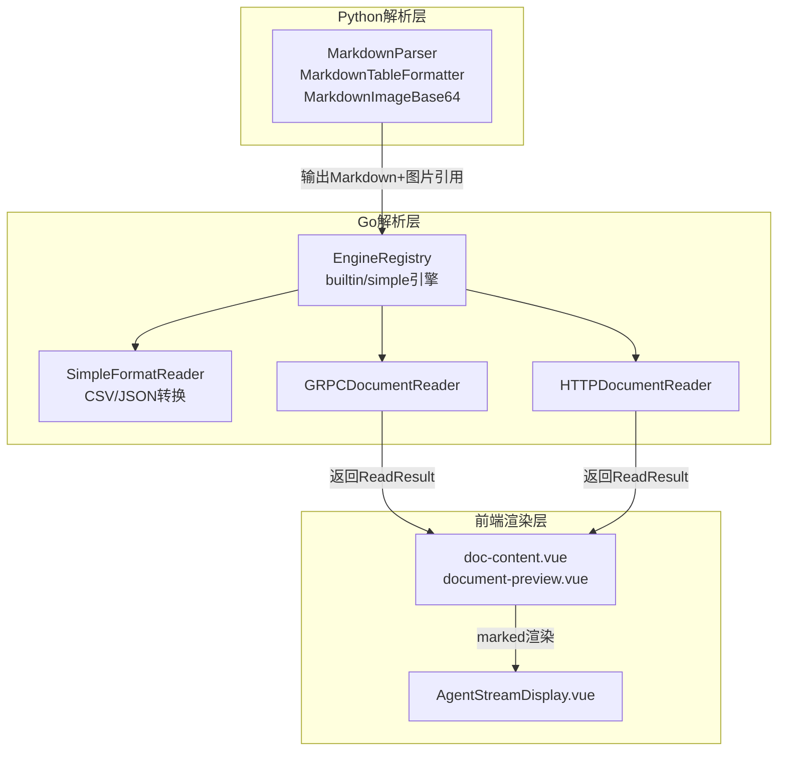
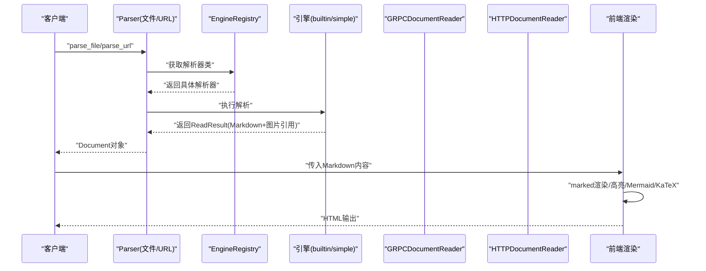
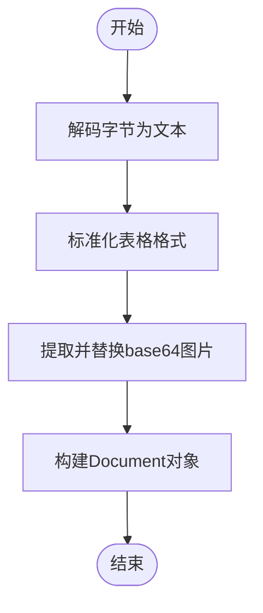
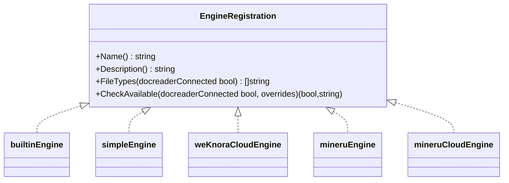
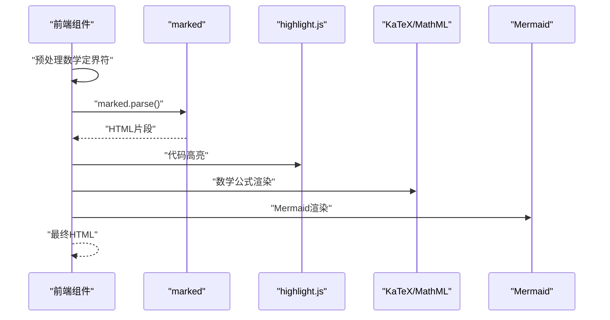
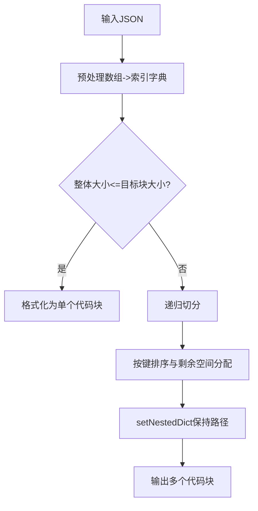
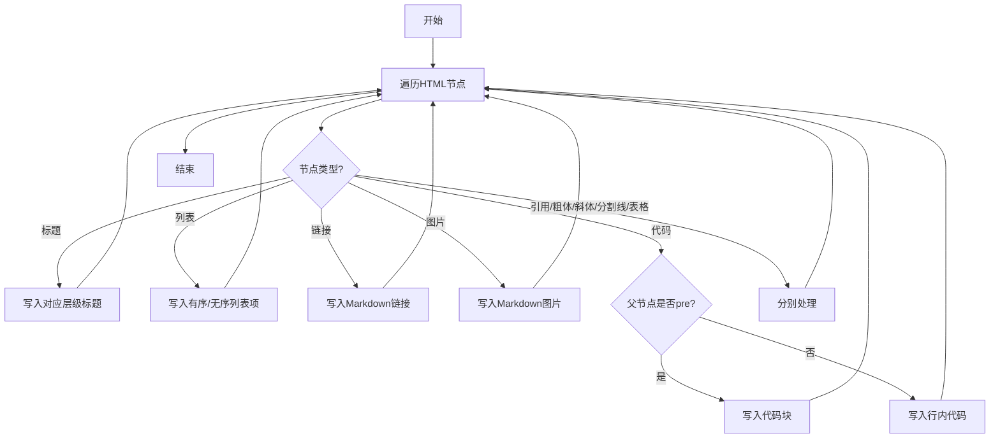
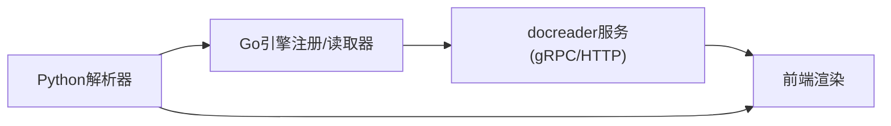

# Markdown解析器

<cite>
**本文引用的文件**
- [markdown_parser.py](file://docreader/parser/markdown_parser.py)
- [base_parser.py](file://docreader/parser/base_parser.py)
- [parser.py](file://docreader/parser/parser.py)
- [builtin_converter.go](file://internal/infrastructure/docparser/builtin_converter.go)
- [engine_registry.go](file://internal/infrastructure/docparser/engine_registry.go)
- [json_converter.go](file://internal/infrastructure/docparser/json_converter.go)
- [grpc_parser.go](file://internal/infrastructure/docparser/grpc_parser.go)
- [http_parser.go](file://internal/infrastructure/docparser/http_parser.go)
- [helpers.go](file://internal/infrastructure/docparser/helpers.go)
- [splitter.go](file://internal/infrastructure/chunker/splitter.go)
- [web_fetch.go](file://internal/agent/tools/web_fetch.go)
- [doc-content.vue](file://frontend/src/components/doc-content.vue)
- [document-preview.vue](file://frontend/src/components/document-preview.vue)
- [AgentStreamDisplay.vue](file://frontend/src/views/chat/components/AgentStreamDisplay.vue)
- [test.md](file://docreader/testdata/test.md)
</cite>

## 目录
1. [简介](#简介)
2. [项目结构](#项目结构)
3. [核心组件](#核心组件)
4. [架构总览](#架构总览)
5. [详细组件分析](#详细组件分析)
6. [依赖分析](#依赖分析)
7. [性能考虑](#性能考虑)
8. [故障排查指南](#故障排查指南)
9. [结论](#结论)
10. [附录](#附录)

## 简介
本技术文档面向WeKnora的Markdown解析能力，系统化阐述从Python侧Markdown解析器到Go侧文档读取引擎的端到端实现，覆盖以下关键主题：
- 标记语言转换与嵌套结构处理
- 特殊符号识别与表格、图片、代码块、数学公式等元素的处理策略
- Markdown到标准文档的转换流程、格式保持与内容重构
- 变体支持、自定义扩展与兼容性处理
- 解析配置选项、性能优化与复杂文档结构处理技巧

## 项目结构
WeKnora的Markdown解析涉及三层协作：
- Python侧：docreader模块提供Markdown管道解析（表格标准化、图片提取与替换）
- Go侧：docparser模块负责引擎注册、简单格式直读、远程服务对接（gRPC/HTTP）、JSON转Markdown等
- 前端侧：基于marked.js的Markdown渲染管线，支持Mermaid、KaTeX/MathML、代码高亮等

**图表来源**
- [markdown_parser.py:376-387](file://docreader/parser/markdown_parser.py#L376-L387)
- [engine_registry.go:39-96](file://internal/infrastructure/docparser/engine_registry.go#L39-L96)
- [builtin_converter.go:45-80](file://internal/infrastructure/docparser/builtin_converter.go#L45-L80)
- [grpc_parser.go:28-128](file://internal/infrastructure/docparser/grpc_parser.go#L28-L128)
- [http_parser.go:57-231](file://internal/infrastructure/docparser/http_parser.go#L57-L231)
- [doc-content.vue:200-457](file://frontend/src/components/doc-content.vue#L200-L457)
- [document-preview.vue:97-142](file://frontend/src/components/document-preview.vue#L97-L142)
- [AgentStreamDisplay.vue:1680-1716](file://frontend/src/views/chat/components/AgentStreamDisplay.vue#L1680-L1716)

**章节来源**
- [markdown_parser.py:1-406](file://docreader/parser/markdown_parser.py#L1-L406)
- [parser.py:11-83](file://docreader/parser/parser.py#L11-L83)
- [engine_registry.go:1-194](file://internal/infrastructure/docparser/engine_registry.go#L1-L194)
- [builtin_converter.go:1-222](file://internal/infrastructure/docparser/builtin_converter.go#L1-L222)
- [grpc_parser.go:1-176](file://internal/infrastructure/docparser/grpc_parser.go#L1-L176)
- [http_parser.go:1-232](file://internal/infrastructure/docparser/http_parser.go#L1-L232)

## 核心组件
- Python Markdown解析器
  - MarkdownTableFormatter：统一表格格式，规范化对齐与间距
  - MarkdownImageBase64：提取并替换内联base64图片，返回图片字典供Go侧存储
  - MarkdownParser：流水线组合上述两个阶段
- Go文档读取引擎
  - EngineRegistry：注册本地引擎（builtin/simple/weknoracloud/mineru/mineru_cloud），并合并远程引擎能力
  - SimpleFormatReader：直接处理md/markdown/txt/csv/json/图片/音频等简单格式
  - JSON转换器：将JSON按语义切分为多个合法的Markdown代码块
  - gRPC/HTTP读取器：与docreader服务通信，获取解析结果
- 前端渲染
  - doc-content/document-preview：marked渲染、Mermaid/KaTeX/MathML、代码高亮
  - AgentStreamDisplay：流式渲染、占位符保护与恢复

**章节来源**
- [markdown_parser.py:127-161](file://docreader/parser/markdown_parser.py#L127-L161)
- [markdown_parser.py:352-374](file://docreader/parser/markdown_parser.py#L352-L374)
- [markdown_parser.py:376-387](file://docreader/parser/markdown_parser.py#L376-L387)
- [engine_registry.go:39-134](file://internal/infrastructure/docparser/engine_registry.go#L39-L134)
- [builtin_converter.go:45-131](file://internal/infrastructure/docparser/builtin_converter.go#L45-L131)
- [json_converter.go:20-69](file://internal/infrastructure/docparser/json_converter.go#L20-L69)
- [grpc_parser.go:28-128](file://internal/infrastructure/docparser/grpc_parser.go#L28-L128)
- [http_parser.go:57-231](file://internal/infrastructure/docparser/http_parser.go#L57-L231)
- [doc-content.vue:200-457](file://frontend/src/components/doc-content.vue#L200-L457)
- [document-preview.vue:97-142](file://frontend/src/components/document-preview.vue#L97-L142)
- [AgentStreamDisplay.vue:1680-1716](file://frontend/src/views/chat/components/AgentStreamDisplay.vue#L1680-L1716)

## 架构总览
下图展示从请求到渲染的端到端流程，涵盖引擎选择、解析、图片处理与前端渲染。

**图表来源**
- [parser.py:25-83](file://docreader/parser/parser.py#L25-L83)
- [engine_registry.go:140-193](file://internal/infrastructure/docparser/engine_registry.go#L140-L193)
- [builtin_converter.go:45-80](file://internal/infrastructure/docparser/builtin_converter.go#L45-L80)
- [grpc_parser.go:102-128](file://internal/infrastructure/docparser/grpc_parser.go#L102-L128)
- [http_parser.go:185-231](file://internal/infrastructure/docparser/http_parser.go#L185-L231)
- [doc-content.vue:200-457](file://frontend/src/components/doc-content.vue#L200-L457)

## 详细组件分析

### Python Markdown解析器
- MarkdownTableFormatter
  - 功能：规范化表格行与对齐标记，统一列间距与缩进
  - 关键点：先处理数据行，再处理对齐行，避免冲突
- MarkdownImageBase64
  - 功能：提取base64图片，生成唯一文件名，替换为路径引用，返回图片字节供Go侧存储
  - 输出：Document(content, images)
- MarkdownParser
  - 功能：流水线编排，顺序执行表格格式化与图片提取

**图表来源**
- [markdown_parser.py:147-160](file://docreader/parser/markdown_parser.py#L147-L160)
- [markdown_parser.py:364-373](file://docreader/parser/markdown_parser.py#L364-L373)

**章节来源**
- [markdown_parser.py:127-161](file://docreader/parser/markdown_parser.py#L127-L161)
- [markdown_parser.py:352-374](file://docreader/parser/markdown_parser.py#L352-L374)
- [markdown_parser.py:376-387](file://docreader/parser/markdown_parser.py#L376-L387)

### Go文档读取引擎与简单格式直读
- EngineRegistry
  - 本地引擎：builtin、simple、weknoracloud、mineru、mineru_cloud
  - 合并规则：远程引擎优先覆盖本地描述与文件类型，本地负责可用性检查
- SimpleFormatReader
  - 直接处理：md/markdown/txt/csv/json/图片/音频
  - 图片/音频包装：返回Markdown引用或占位符，携带原始字节供后续处理
- JSON转换器
  - 将JSON对象递归拆分为多个合法的Markdown代码块，保持嵌套路径
  - 数组预处理为索引字典，保证算法一致性

**图表来源**
- [engine_registry.go:9-33](file://internal/infrastructure/docparser/engine_registry.go#L9-L33)

**章节来源**
- [engine_registry.go:39-134](file://internal/infrastructure/docparser/engine_registry.go#L39-L134)
- [builtin_converter.go:45-131](file://internal/infrastructure/docparser/builtin_converter.go#L45-L131)
- [json_converter.go:75-133](file://internal/infrastructure/docparser/json_converter.go#L75-L133)

### 前端渲染与Markdown变体支持
- doc-content/document-preview
  - 数学公式：预处理方括号/括号定界符，交由KaTeX/MathML渲染
  - Mermaid：识别mermaid语言代码块，延迟渲染
  - 代码高亮：自动检测语言，失败回退
  - 安全处理：HTML实体还原、DOMPurify清理
- AgentStreamDisplay
  - 占位符保护：临时替换图片/链接/标签，避免marked误处理
  - Mermaid支持：自定义渲染器

**图表来源**
- [doc-content.vue:200-457](file://frontend/src/components/doc-content.vue#L200-L457)
- [document-preview.vue:97-142](file://frontend/src/components/document-preview.vue#L97-L142)
- [AgentStreamDisplay.vue:1680-1716](file://frontend/src/views/chat/components/AgentStreamDisplay.vue#L1680-L1716)

**章节来源**
- [doc-content.vue:200-457](file://frontend/src/components/doc-content.vue#L200-L457)
- [document-preview.vue:97-142](file://frontend/src/components/document-preview.vue#L97-L142)
- [AgentStreamDisplay.vue:1680-1716](file://frontend/src/views/chat/components/AgentStreamDisplay.vue#L1680-L1716)

### 复杂逻辑组件：JSON语义切分
- 算法要点
  - 预处理：数组转索引字典，保证统一处理
  - 递归切分：按默认块大小与最小块大小控制，保留完整嵌套路径
  - 路径设置：setNestedDict确保从根到叶的路径完整
  - 排序：键排序，数值键按数字顺序排列
- 性能特性
  - 每个块为合法JSON对象，便于下游分块器按边界切分

**图表来源**
- [json_converter.go:20-69](file://internal/infrastructure/docparser/json_converter.go#L20-L69)
- [json_converter.go:75-133](file://internal/infrastructure/docparser/json_converter.go#L75-L133)
- [json_converter.go:135-161](file://internal/infrastructure/docparser/json_converter.go#L135-L161)
- [json_converter.go:230-271](file://internal/infrastructure/docparser/json_converter.go#L230-L271)

**章节来源**
- [json_converter.go:20-69](file://internal/infrastructure/docparser/json_converter.go#L20-L69)
- [json_converter.go:75-133](file://internal/infrastructure/docparser/json_converter.go#L75-L133)
- [json_converter.go:135-161](file://internal/infrastructure/docparser/json_converter.go#L135-L161)
- [json_converter.go:230-271](file://internal/infrastructure/docparser/json_converter.go#L230-L271)

### 特殊符号识别与嵌套结构处理
- HTML到Markdown转换（网页抓取）
  - 标题、段落、列表、链接、图片、代码块、引用、粗体/斜体、水平线、表格
  - 嵌套结构：通过父子节点关系判断，如code在pre中视为代码块
- 前端Markdown识别
  - 提取图片引用：支持URL中的一层括号平衡
  - 内联代码终止：遇到双换行停止（符合CommonMark）

**图表来源**
- [web_fetch.go:551-636](file://internal/agent\tools\web_fetch.go#L551-L636)
- [splitter.go:552-570](file://internal/infrastructure/chunker/splitter.go#L552-L570)
- [web_fetch.go:458-482](file://internal/agent\tools\web_fetch.go#L458-L482)

**章节来源**
- [web_fetch.go:551-636](file://internal/agent/tools/web_fetch.go#L551-L636)
- [splitter.go:552-570](file://internal/infrastructure/chunker/splitter.go#L552-L570)
- [web_fetch.go:458-482](file://internal/agent/tools/web_fetch.go#L458-L482)

## 依赖分析
- 组件耦合
  - Python解析器仅负责文本与图片引用，不进行分块、OCR、VLM等处理，降低耦合度
  - Go侧通过引擎注册与远程发现机制，实现可插拔扩展
  - 前端渲染与后端解析解耦，通过标准化的Markdown/HTML协议交互
- 外部依赖
  - gRPC/HTTP读取器依赖docreader服务，具备连接管理与消息大小限制
  - 前端依赖marked.js、highlight.js、DOMPurify、Mermaid、KaTeX/MathML

**图表来源**
- [parser.py:11-83](file://docreader/parser/parser.py#L11-L83)
- [engine_registry.go:140-193](file://internal/infrastructure/docparser/engine_registry.go#L140-L193)
- [grpc_parser.go:28-128](file://internal/infrastructure/docparser/grpc_parser.go#L28-L128)
- [http_parser.go:57-231](file://internal/infrastructure/docparser/http_parser.go#L57-L231)

**章节来源**
- [parser.py:11-83](file://docreader/parser/parser.py#L11-L83)
- [engine_registry.go:140-193](file://internal/infrastructure/docparser/engine_registry.go#L140-L193)
- [grpc_parser.go:28-128](file://internal/infrastructure/docparser/grpc_parser.go#L28-L128)
- [http_parser.go:57-231](file://internal/infrastructure/docparser/http_parser.go#L57-L231)

## 性能考虑
- 解析性能
  - Python侧：正则表达式与字符串替换为主，适合中小文档；大文档建议分块或使用Go侧引擎
  - Go侧：SimpleFormatReader零外部依赖，JSON切分采用递归与路径映射，时间复杂度与JSON规模近似线性
- 渲染性能
  - 前端：marked.js按token渲染，Mermaid/KaTeX延迟初始化；代码高亮按需触发
  - 图片处理：base64转文件路径减少传输体积，图片引用提取使用正则匹配
- 网络与并发
  - gRPC/HTTP读取器设置最大消息大小与超时，支持重连与连接池

**章节来源**
- [json_converter.go:20-69](file://internal/infrastructure/docparser/json_converter.go#L20-L69)
- [grpc_parser.go:19-26](file://internal/infrastructure/docparser/grpc_parser.go#L19-L26)
- [http_parser.go:64-80](file://internal/infrastructure/docparser/http_parser.go#L64-L80)
- [doc-content.vue:200-457](file://frontend/src/components/doc-content.vue#L200-L457)

## 故障排查指南
- 常见问题
  - 解析为空：检查输入内容编码与空内容判断
  - JSON无效：确认JSON合法性与BOM去除
  - 图片无法显示：确认图片路径替换与存储键映射
  - 数学公式不渲染：检查定界符预处理与MathML/KaTeX配置
- 日志与诊断
  - Go侧：响应结构日志工具可递归打印API响应结构，辅助定位字段缺失
  - Python侧：解析过程记录日志，便于追踪错误位置

**章节来源**
- [parser.py:58-62](file://docreader/parser/parser.py#L58-L62)
- [json_converter.go:222-228](file://internal/infrastructure/docparser/json_converter.go#L222-L228)
- [helpers.go:51-112](file://internal/infrastructure/docparser/helpers.go#L51-L112)
- [doc-content.vue:442-456](file://frontend/src/components/doc-content.vue#L442-L456)

## 结论
WeKnora的Markdown解析体系通过“轻量化Python解析 + Go引擎直读 + 前端标准化渲染”的分层设计，在保证格式完整性的同时实现了高性能与可扩展性。表格、图片、代码块、数学公式与Mermaid等复杂元素得到稳健处理，引擎注册与远程发现机制为未来扩展提供了灵活基础。

## 附录

### Markdown变体与兼容性
- 表格：统一列间距与对齐标记，支持缩进与多级表格
- 图片：支持内联base64与外链，自动替换为路径引用
- 代码块：区分行内代码与围栏代码块，保留语言信息
- 数学公式：支持行内/块级定界符，结合KaTeX/MathML渲染
- Mermaid：识别mermaid语言代码块，延迟渲染

**章节来源**
- [markdown_parser.py:127-161](file://docreader/parser/markdown_parser.py#L127-L161)
- [markdown_parser.py:352-374](file://docreader/parser/markdown_parser.py#L352-L374)
- [doc-content.vue:200-457](file://frontend/src/components/doc-content.vue#L200-L457)
- [document-preview.vue:97-142](file://frontend/src/components/document-preview.vue#L97-L142)

### 配置选项与环境变量
- MAX_FILE_SIZE_MB：gRPC/HTTP读取器的最大消息大小（MB）
- Parser引擎选择：builtin/simple/weknoracloud/mineru/mineru_cloud
- 引擎覆盖参数：如weknoracloud_app_id、mineru_endpoint、mineru_api_key等

**章节来源**
- [grpc_parser.go:19-26](file://internal/infrastructure/docparser/grpc_parser.go#L19-L26)
- [engine_registry.go:84-134](file://internal/infrastructure/docparser/engine_registry.go#L84-L134)
- [http_parser.go:104-118](file://internal/infrastructure/docparser/http_parser.go#L104-L118)

### 示例文档
- 测试文档示例：包含图片、链接、代码块、表格、列表与分块测试段落

**章节来源**
- [test.md:1-37](file://docreader/testdata/test.md#L1-L37)