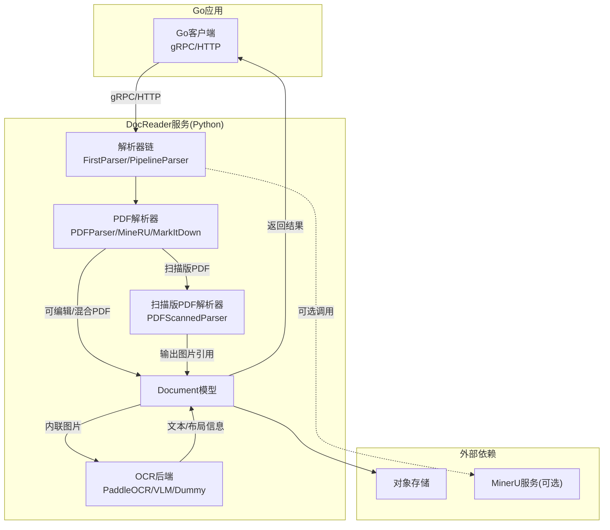
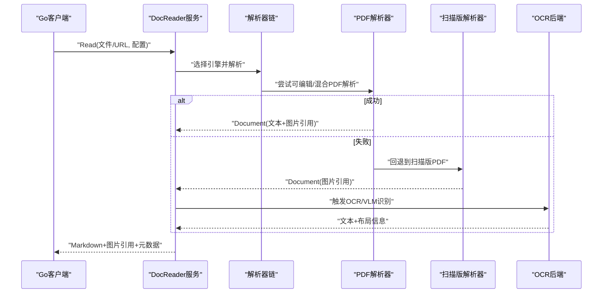
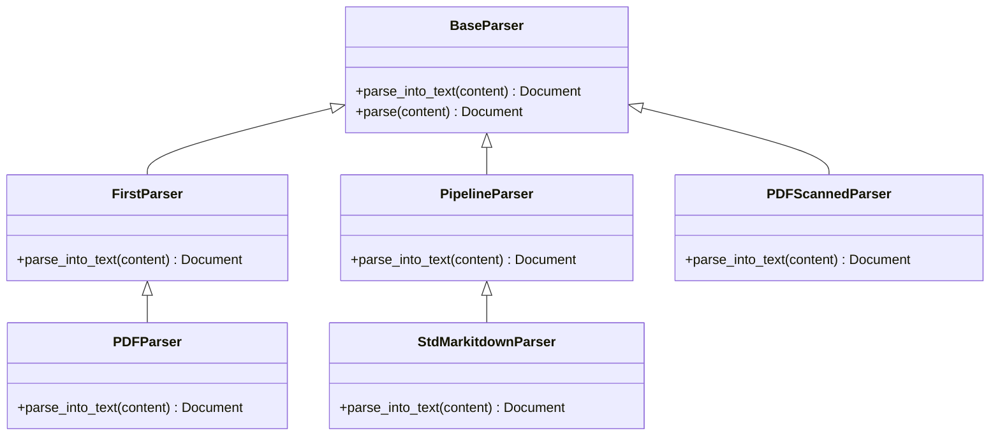
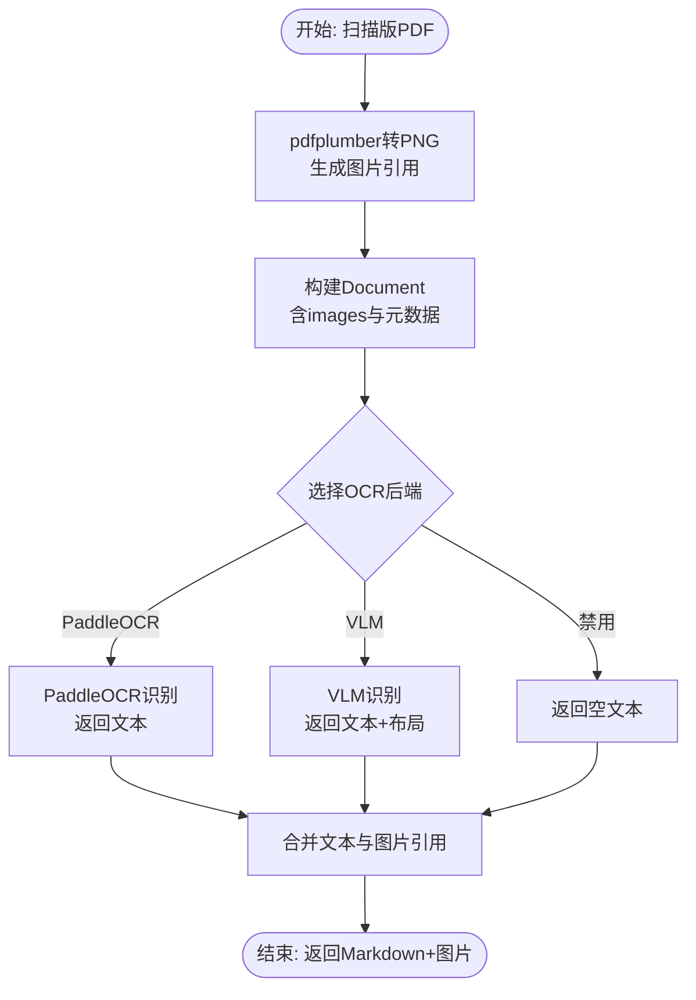
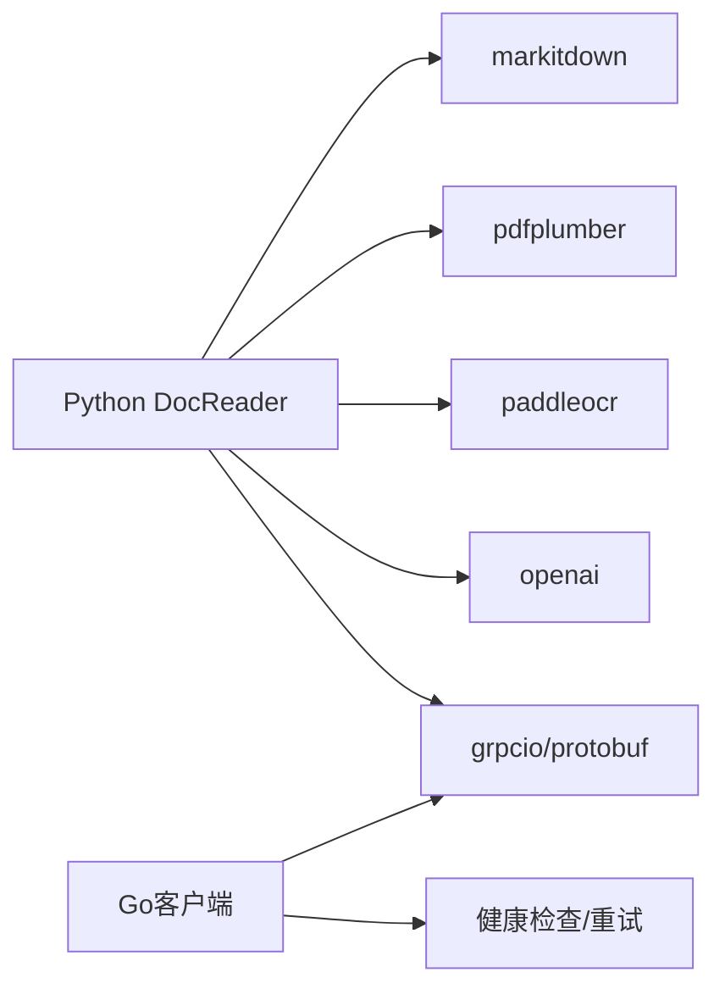

# PDF解析器

<cite>
**本文引用的文件**
- [docreader/parser/pdf_parser.py](file://docreader/parser/pdf_parser.py)
- [docreader/parser/markitdown_parser.py](file://docreader/parser/markitdown_parser.py)
- [docreader/parser/chain_parser.py](file://docreader/parser/chain_parser.py)
- [docreader/parser/base_parser.py](file://docreader/parser/base_parser.py)
- [docreader/models/document.py](file://docreader/models/document.py)
- [docreader/ocr/paddle.py](file://docreader/ocr/paddle.py)
- [docreader/ocr/vlm.py](file://docreader/ocr/vlm.py)
- [docreader/ocr/base.py](file://docreader/ocr/base.py)
- [docreader/main.py](file://docreader/main.py)
- [docreader/config.py](file://docreader/config.py)
- [docreader/pyproject.toml](file://docreader/pyproject.toml)
- [docreader/README.md](file://docreader/README.md)
- [internal/infrastructure/docparser/grpc_parser.go](file://internal/infrastructure/docparser/grpc_parser.go)
- [internal/infrastructure/docparser/http_parser.go](file://internal/infrastructure/docparser/http_parser.go)
- [internal/infrastructure/docparser/helpers.go](file://internal/infrastructure/docparser/helpers.go)
</cite>

## 目录
1. [简介](#简介)
2. [项目结构](#项目结构)
3. [核心组件](#核心组件)
4. [架构总览](#架构总览)
5. [详细组件分析](#详细组件分析)
6. [依赖分析](#依赖分析)
7. [性能考虑](#性能考虑)
8. [故障排查指南](#故障排查指南)
9. [结论](#结论)
10. [附录](#附录)

## 简介
本技术文档围绕WeKnora的PDF解析能力展开，重点解释PDF文档解析的核心算法、文本提取策略与布局保持机制；详述对扫描版PDF、可编辑PDF与混合内容PDF的差异化处理；阐述OCR集成机制、文字识别精度控制与图像处理流程；并覆盖元数据提取、页面分割思路、表格识别现状与建议、解析配置参数、性能优化技巧以及常见问题解决方案。

## 项目结构
WeKnora的PDF解析由Python侧DocReader服务与Go侧文档读取器协同完成：
- Python侧DocReader服务负责文档解析、OCR/VLM调用、图像内联与响应封装；
- Go侧DocReader客户端通过gRPC/HTTP对接DocReader服务，统一读取接口；
- PDF解析采用“链式责任模式”与“流水线模式”，优先尝试高精度解析，失败则回退至扫描版PDF图像化方案。

图表来源
- [docreader/parser/pdf_parser.py:57-69](file://docreader/parser/pdf_parser.py#L57-L69)
- [docreader/parser/chain_parser.py:20-92](file://docreader/parser/chain_parser.py#L20-L92)
- [docreader/main.py:98-182](file://docreader/main.py#L98-L182)
- [internal/infrastructure/docparser/grpc_parser.go:28-128](file://internal/infrastructure/docparser/grpc_parser.go#L28-L128)
- [internal/infrastructure/docparser/http_parser.go:57-231](file://internal/infrastructure/docparser/http_parser.go#L57-L231)

章节来源
- [docreader/parser/pdf_parser.py:13-69](file://docreader/parser/pdf_parser.py#L13-L69)
- [docreader/parser/chain_parser.py:1-180](file://docreader/parser/chain_parser.py#L1-L180)
- [docreader/main.py:98-215](file://docreader/main.py#L98-L215)
- [internal/infrastructure/docparser/grpc_parser.go:1-176](file://internal/infrastructure/docparser/grpc_parser.go#L1-L176)
- [internal/infrastructure/docparser/http_parser.go:1-232](file://internal/infrastructure/docparser/http_parser.go#L1-L232)

## 核心组件
- 解析器基类与接口
  - BaseParser：定义统一的parse_into_text接口，约束子类仅产出Markdown文本与图片引用，不执行分块、OCR与VLM。
- 链式解析器
  - FirstParser：按序尝试多个解析器，首个成功即返回。
  - PipelineParser：将多个解析器串联，逐级传递内容与图片，最终合并结果。
- PDF专用解析器
  - PDFParser：组合MarkItDown与扫描版回退策略。
  - PDFScannedParser：扫描版PDF转图片，供Go侧OCR处理。
  - StdMarkitdownParser：基于MarkItDown的通用文档转换包装。
- 文档模型
  - Document：承载content、images、metadata与chunks等字段，并提供有效性判断。
- OCR后端
  - PaddleOCRBackend：本地PaddleOCR引擎，支持CPU兼容性检测与参数调优。
  - VLMOCRBackend：OpenAI兼容接口的视觉语言模型OCR。
  - DummyOCRBackend：占位后端，便于禁用OCR。
- 服务入口与配置
  - main.py：gRPC服务端实现，统一Read/ListEngines接口，负责图片解码与内联。
  - config.py：环境变量加载与配置导出，含gRPC、代理、图片输出目录等。

章节来源
- [docreader/parser/base_parser.py:13-62](file://docreader/parser/base_parser.py#L13-L62)
- [docreader/parser/chain_parser.py:20-180](file://docreader/parser/chain_parser.py#L20-L180)
- [docreader/parser/pdf_parser.py:13-69](file://docreader/parser/pdf_parser.py#L13-L69)
- [docreader/parser/markitdown_parser.py:14-46](file://docreader/parser/markitdown_parser.py#L14-L46)
- [docreader/models/document.py:62-88](file://docreader/models/document.py#L62-L88)
- [docreader/ocr/paddle.py:16-176](file://docreader/ocr/paddle.py#L16-L176)
- [docreader/ocr/vlm.py:14-88](file://docreader/ocr/vlm.py#L14-L88)
- [docreader/ocr/base.py:10-32](file://docreader/ocr/base.py#L10-L32)
- [docreader/main.py:98-215](file://docreader/main.py#L98-L215)
- [docreader/config.py:48-122](file://docreader/config.py#L48-L122)

## 架构总览
PDF解析的整体流程如下：
- 输入：文件字节流或URL，请求携带文件名、类型、标题与请求ID。
- 解析：DocReader服务根据引擎与覆盖配置选择解析器链，优先尝试可编辑/混合PDF解析，失败则回退到扫描版PDF图像化。
- OCR/VLM：扫描版PDF的图片由Go侧触发OCR/VLM识别，生成文本与布局信息。
- 输出：返回Markdown文本、图片引用列表与元数据；图片由Go侧负责持久化。

图表来源
- [docreader/parser/pdf_parser.py:57-69](file://docreader/parser/pdf_parser.py#L57-L69)
- [docreader/parser/chain_parser.py:48-73](file://docreader/parser/chain_parser.py#L48-L73)
- [docreader/main.py:103-167](file://docreader/main.py#L103-L167)
- [docreader/ocr/paddle.py:118-176](file://docreader/ocr/paddle.py#L118-L176)
- [docreader/ocr/vlm.py:41-88](file://docreader/ocr/vlm.py#L41-L88)

## 详细组件分析

### PDF解析器链与策略
- FirstParser按序尝试多个解析器，首个成功即返回；适合“快速成功优先”的场景。
- PDFParser组合MarkItDown与扫描版回退，兼顾可编辑与扫描版PDF。
- StdMarkitdownParser基于MarkItDown库，自动推断文件扩展名并转换为文本/Markdown。
- PDFScannedParser在可编辑解析失败时，将每一页转为PNG图片，生成Markdown图片引用与页数元数据，交由Go侧OCR处理。

图表来源
- [docreader/parser/base_parser.py:13-62](file://docreader/parser/base_parser.py#L13-L62)
- [docreader/parser/chain_parser.py:20-180](file://docreader/parser/chain_parser.py#L20-L180)
- [docreader/parser/pdf_parser.py:13-69](file://docreader/parser/pdf_parser.py#L13-L69)
- [docreader/parser/markitdown_parser.py:14-46](file://docreader/parser/markitdown_parser.py#L14-L46)

章节来源
- [docreader/parser/pdf_parser.py:13-69](file://docreader/parser/pdf_parser.py#L13-L69)
- [docreader/parser/chain_parser.py:20-92](file://docreader/parser/chain_parser.py#L20-L92)
- [docreader/parser/markitdown_parser.py:14-46](file://docreader/parser/markitdown_parser.py#L14-L46)

### 扫描版PDF图像化与OCR集成
- 图像化策略：使用pdfplumber将每页渲染为PNG，生成Markdown图片引用与images映射，记录页数元数据。
- OCR后端：
  - PaddleOCRBackend：CPU优先、AVX兼容性检测、可调阈值与模型参数，适合本地部署。
  - VLMOCRBackend：OpenAI兼容接口，支持提示词控制（表格HTML、公式LaTeX、忽略页眉页脚等），适合云端模型。
  - DummyOCRBackend：禁用OCR时的占位实现。
- 图片内联：DocReader服务将base64图片解码为二进制，封装为ImageRef返回给Go侧，由Go侧负责持久化。

图表来源
- [docreader/parser/pdf_parser.py:21-55](file://docreader/parser/pdf_parser.py#L21-L55)
- [docreader/ocr/paddle.py:16-176](file://docreader/ocr/paddle.py#L16-L176)
- [docreader/ocr/vlm.py:14-88](file://docreader/ocr/vlm.py#L14-L88)
- [docreader/main.py:54-96](file://docreader/main.py#L54-L96)

章节来源
- [docreader/parser/pdf_parser.py:21-55](file://docreader/parser/pdf_parser.py#L21-L55)
- [docreader/ocr/paddle.py:16-176](file://docreader/ocr/paddle.py#L16-L176)
- [docreader/ocr/vlm.py:14-88](file://docreader/ocr/vlm.py#L14-L88)
- [docreader/main.py:54-96](file://docreader/main.py#L54-L96)

### 文档模型与元数据
- Document模型包含content、images、metadata与chunks；提供有效性判断is_valid。
- PDFScannedParser在Document.metadata中写入image_source_type与page_count，便于后续处理与统计。

章节来源
- [docreader/models/document.py:62-88](file://docreader/models/document.py#L62-L88)
- [docreader/parser/pdf_parser.py:48-52](file://docreader/parser/pdf_parser.py#L48-L52)

### OCR后端实现要点
- PaddleOCRBackend
  - 禁用GPU、强制CPU运行，避免硬件不兼容。
  - Linux下检测AVX支持，必要时降级指令集以保证稳定性。
  - 提供丰富的检测/识别阈值与模型参数，提升准确率与召回。
- VLMOCRBackend
  - 通过OpenAI兼容接口调用VLM模型，支持提示词控制表格、公式与页眉页脚忽略。
  - 控制temperature与max_tokens，稳定输出长度与质量。

章节来源
- [docreader/ocr/paddle.py:16-176](file://docreader/ocr/paddle.py#L16-L176)
- [docreader/ocr/vlm.py:14-88](file://docreader/ocr/vlm.py#L14-L88)
- [docreader/ocr/base.py:10-32](file://docreader/ocr/base.py#L10-L32)

### 服务端接口与客户端对接
- DocReader gRPC服务
  - Read接口：支持文件模式与URL模式，统一返回Markdown、图片引用与元数据。
  - ListEngines接口：返回可用解析引擎清单。
- Go客户端
  - gRPC/HTTP两种接入方式，自动设置消息大小与超时，支持重连与健康检查。
  - 通过DocReader客户端读取文档，获得统一的解析结果。

章节来源
- [docreader/main.py:98-215](file://docreader/main.py#L98-L215)
- [internal/infrastructure/docparser/grpc_parser.go:28-176](file://internal/infrastructure/docparser/grpc_parser.go#L28-L176)
- [internal/infrastructure/docparser/http_parser.go:57-232](file://internal/infrastructure/docparser/http_parser.go#L57-L232)

## 依赖分析
- Python依赖
  - MarkItDown：通用文档转换，支持PDF等多格式。
  - pdfplumber：扫描版PDF转图片。
  - PaddleOCR/PaddlePaddle：本地OCR识别。
  - OpenAI：VLM OCR调用。
  - grpcio/protobuf：gRPC协议栈。
- Go依赖
  - gRPC客户端：与DocReader服务交互。
  - 日志与工具：健康检查、超时与重试策略。

图表来源
- [docreader/pyproject.toml:7-39](file://docreader/pyproject.toml#L7-L39)
- [internal/infrastructure/docparser/grpc_parser.go:1-176](file://internal/infrastructure/docparser/grpc_parser.go#L1-L176)
- [internal/infrastructure/docparser/http_parser.go:1-232](file://internal/infrastructure/docparser/http_parser.go#L1-L232)

章节来源
- [docreader/pyproject.toml:1-40](file://docreader/pyproject.toml#L1-L40)
- [docreader/README.md:1-252](file://docreader/README.md#L1-L252)

## 性能考虑
- 解析链路优化
  - FirstParser优先尝试高精度解析（MarkItDown），失败再回退扫描版图像化，减少不必要的OCR开销。
  - PipelineParser在多阶段解析时，仅在必要阶段累积图片，降低内存压力。
- OCR与图像处理
  - PaddleOCRBackend在CPU上运行，避免GPU不兼容导致的崩溃与重试成本。
  - VLMOCRBackend通过提示词控制输出，减少后处理复杂度。
- 并发与资源
  - DocReader服务端通过环境变量控制最大工作线程与消息大小，避免单点瓶颈。
  - Go客户端设置合理的超时与重试策略，提升鲁棒性。

章节来源
- [docreader/parser/chain_parser.py:48-151](file://docreader/parser/chain_parser.py#L48-L151)
- [docreader/ocr/paddle.py:16-176](file://docreader/ocr/paddle.py#L16-L176)
- [docreader/config.py:66-97](file://docreader/config.py#L66-L97)
- [internal/infrastructure/docparser/grpc_parser.go:19-70](file://internal/infrastructure/docparser/grpc_parser.go#L19-L70)
- [internal/infrastructure/docparser/http_parser.go:64-102](file://internal/infrastructure/docparser/http_parser.go#L64-L102)

## 故障排查指南
- 服务无法启动或崩溃
  - 若出现PaddleOCR相关错误，可临时禁用OCR或切换至VLM后端。
  - 检查OCR后端环境变量配置（OCR_BACKEND、OCR_API_BASE_URL、OCR_API_KEY、OCR_MODEL）。
- 图片无法显示
  - 检查MinIO公共端点配置（MINIO_PUBLIC_ENDPOINT），确保可从浏览器访问。
  - 如跨设备访问，请勿使用localhost，需替换为真实IP。
- 文件上传失败
  - 检查MAX_FILE_SIZE_MB配置，确保前后端一致。
- OCR识别效果不佳
  - 调整PaddleOCR阈值与模型参数；或切换至VLM后端并优化提示词。
- 解析结果为空
  - 确认FirstParser链路中各解析器是否抛出异常；检查PDF是否为纯扫描版，需依赖扫描版解析器与OCR。

章节来源
- [docreader/README.md:205-252](file://docreader/README.md#L205-L252)
- [docreader/ocr/paddle.py:95-117](file://docreader/ocr/paddle.py#L95-L117)
- [docreader/main.py:162-167](file://docreader/main.py#L162-L167)

## 结论
WeKnora的PDF解析器通过“可编辑PDF优先、扫描版回退”的双轨策略，结合PaddleOCR与VLM的OCR能力，实现了对多种PDF类型的稳健处理。DocReader服务将解析与OCR解耦，Go侧负责统一读取与持久化，整体架构清晰、可扩展性强。通过合理配置与参数调优，可在准确性与性能之间取得良好平衡。

## 附录

### PDF解析配置参数说明
- gRPC与文件大小
  - DOCREADER_GRPC_MAX_WORKERS：DocReader服务最大工作线程数。
  - DOCREADER_GRPC_PORT：DocReader服务监听端口。
  - MAX_FILE_SIZE_MB：允许的最大文件大小（MB）。
- OCR与VLM
  - OCR_BACKEND：可选paddle/no_ocr/api，默认paddle。
  - OCR_API_BASE_URL/OCR_API_KEY/OCR_MODEL：外部OCR API配置。
  - VLM_MODEL_BASE_URL/VLM_MODEL_NAME/VLM_MODEL_API_KEY/VLM_INTERFACE_TYPE：VLM模型配置。
- 存储与代理
  - EXTERNAL_HTTP_PROXY/EXTERNAL_HTTPS_PROXY：HTTP/HTTPS代理。
  - IMAGE_OUTPUT_DIR：图片输出目录（与Go侧共享卷）。
- MinerU（可选）
  - MINERU_ENDPOINT：MinerU服务地址，启用高级解析能力。

章节来源
- [docreader/config.py:66-122](file://docreader/config.py#L66-L122)
- [docreader/README.md:71-150](file://docreader/README.md#L71-L150)