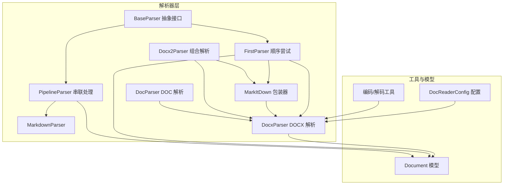
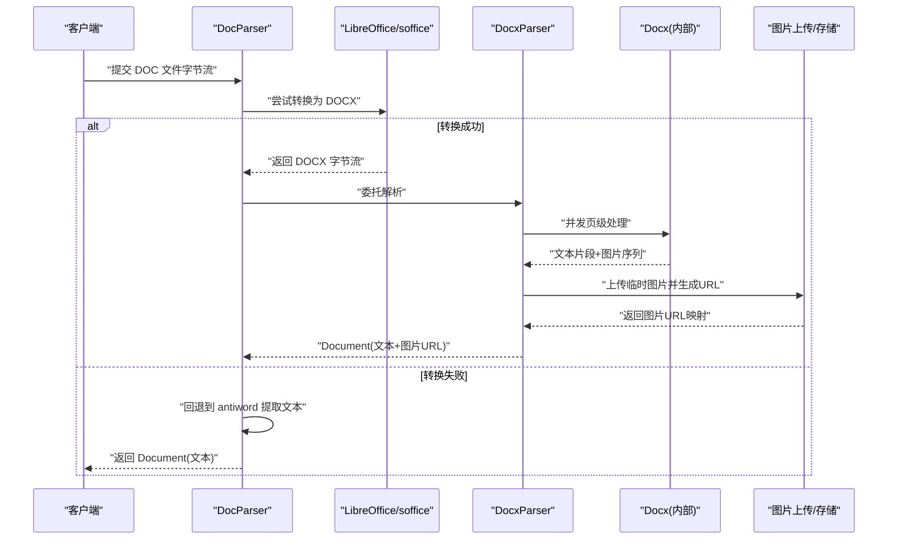
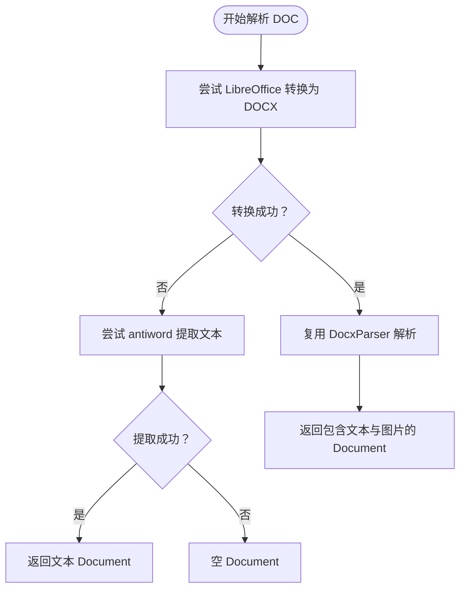
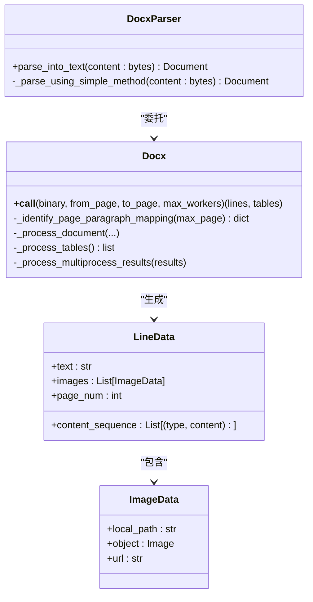
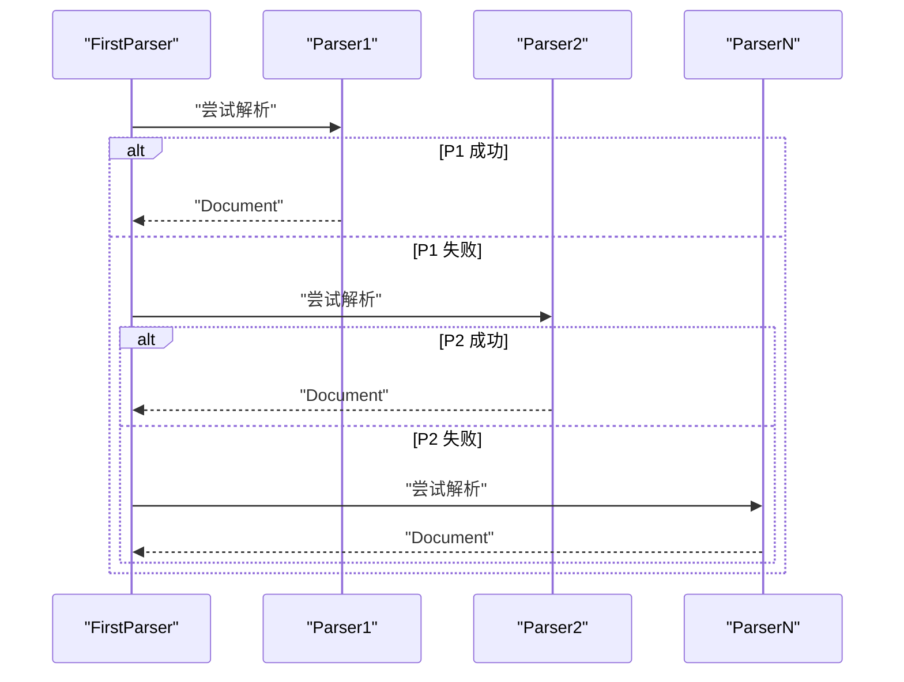
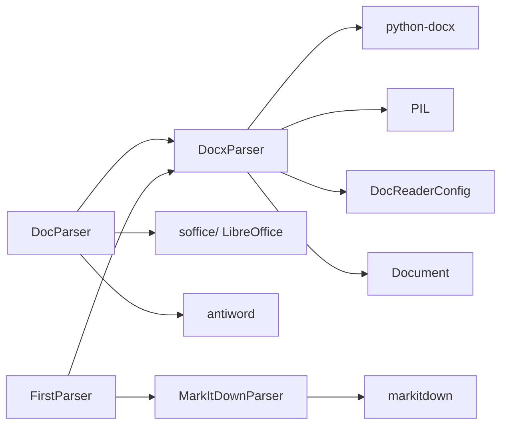

# Word文档解析器

<cite>
**本文档引用的文件**
- [doc_parser.py](file://docreader/parser/doc_parser.py)
- [docx_parser.py](file://docreader/parser/docx_parser.py)
- [docx2_parser.py](file://docreader/parser/docx2_parser.py)
- [base_parser.py](file://docreader/parser/base_parser.py)
- [chain_parser.py](file://docreader/parser/chain_parser.py)
- [markitdown_parser.py](file://docreader/parser/markitdown_parser.py)
- [document.py](file://docreader/models/document.py)
- [read_config.py](file://docreader/models/read_config.py)
- [config.py](file://docreader/config.py)
- [endecode.py](file://docreader/utils/endecode.py)
</cite>

## 目录
1. [简介](#简介)
2. [项目结构](#项目结构)
3. [核心组件](#核心组件)
4. [架构总览](#架构总览)
5. [详细组件分析](#详细组件分析)
6. [依赖关系分析](#依赖关系分析)
7. [性能考虑](#性能考虑)
8. [故障排除指南](#故障排除指南)
9. [结论](#结论)
10. [附录](#附录)

## 简介
本文件为 WeKnora Word 文档解析器的技术文档，聚焦 DOC 和 DOCX 格式的解析实现。内容涵盖：
- DOC/DOCX 解析流程与多阶段回退策略
- XML 结构解析、样式信息提取与图片嵌入处理
- 文档对象模型（DOM）转换过程、段落与表格结构重建
- 样式继承机制、字体信息保留与格式化文本处理
- 文档版本兼容性处理、宏文档支持与加密文档解密流程
- 解析器配置选项、解析质量评估与错误处理策略

## 项目结构
WeKnora 的文档解析子系统位于 docreader 模块中，采用“解析器链 + 多后端”的设计，既保证了对多种文档格式的支持，又通过并行处理提升大文档解析效率。

**图表来源**
- [base_parser.py:13-62](file://docreader/parser/base_parser.py#L13-L62)
- [chain_parser.py:20-180](file://docreader/parser/chain_parser.py#L20-L180)
- [markitdown_parser.py:14-46](file://docreader/parser/markitdown_parser.py#L14-L46)
- [docx_parser.py:75-290](file://docreader/parser/docx_parser.py#L75-L290)
- [docx2_parser.py:10-12](file://docreader/parser/docx2_parser.py#L10-L12)
- [doc_parser.py:95-332](file://docreader/parser/doc_parser.py#L95-L332)
- [document.py:62-88](file://docreader/models/document.py#L62-L88)
- [config.py:48-97](file://docreader/config.py#L48-L97)
- [endecode.py:23-131](file://docreader/utils/endecode.py#L23-L131)

**章节来源**
- [base_parser.py:1-62](file://docreader/parser/base_parser.py#L1-L62)
- [chain_parser.py:1-180](file://docreader/parser/chain_parser.py#L1-L180)
- [docx_parser.py:1-1533](file://docreader/parser/docx_parser.py#L1-L1533)
- [doc_parser.py:1-332](file://docreader/parser/doc_parser.py#L1-L332)
- [docx2_parser.py:1-29](file://docreader/parser/docx2_parser.py#L1-L29)
- [document.py:1-88](file://docreader/models/document.py#L1-L88)
- [config.py:1-122](file://docreader/config.py#L1-L122)
- [endecode.py:1-205](file://docreader/utils/endecode.py#L1-L205)

## 核心组件
- BaseParser：定义统一的解析接口，负责从文档中抽取纯文本与图像引用，不进行分块、OCR 或 VLM 处理。
- FirstParser/PipelineParser：实现解析器链式编排，前者按顺序尝试多个解析器直到成功；后者将前一解析器输出作为下一解析器输入，并合并图像与元数据。
- DocxParser：面向 DOCX 的高性能解析器，支持并发页级处理、图片提取与表格 HTML 转换。
- DocParser：面向 DOC 的解析器，优先尝试 LibreOffice 转换为 DOCX 后复用 DocxParser，否则回退到 antiword 提取文本。
- MarkItDown 包装器：利用 markitdown 库统一处理多种文档格式（含 DOCX/PPTX/PDF），作为 Pipeline 的前置或备用路径。
- Document 模型：承载解析结果（文本、图像映射、分块、元数据）。
- 配置系统：集中管理 gRPC、代理、最大页数、图片输出目录等运行时参数。

**章节来源**
- [base_parser.py:13-62](file://docreader/parser/base_parser.py#L13-L62)
- [chain_parser.py:20-180](file://docreader/parser/chain_parser.py#L20-L180)
- [docx_parser.py:75-290](file://docreader/parser/docx_parser.py#L75-L290)
- [doc_parser.py:95-332](file://docreader/parser/doc_parser.py#L95-L332)
- [markitdown_parser.py:14-46](file://docreader/parser/markitdown_parser.py#L14-L46)
- [document.py:62-88](file://docreader/models/document.py#L62-L88)
- [config.py:48-97](file://docreader/config.py#L48-L97)

## 架构总览
下图展示 DOC 与 DOCX 的解析路径及回退策略，以及 DOCX 的并发处理与图片上传流程。

**图表来源**
- [doc_parser.py:95-229](file://docreader/parser/doc_parser.py#L95-L229)
- [docx_parser.py:102-207](file://docreader/parser/docx_parser.py#L102-L207)

## 详细组件分析

### DOC 解析器（DocParser）
- 多阶段回退策略：
  1) 尝试 LibreOffice/OpenOffice 将 DOC 转换为 DOCX；
  2) 若启用多模态且转换成功，则复用 DocxParser；
  3) 若转换失败，回退到 antiword 提取文本；
  4) textract 路径因安全风险被禁用（注释说明）。
- 安全沙箱执行：通过 SandboxExecutor 在受限环境中执行外部命令，设置代理环境变量，超时控制，避免 SSRF 等风险。
- 可执行程序发现：支持在常见路径与环境变量中定位 soffice 与 antiword。

**图表来源**
- [doc_parser.py:95-168](file://docreader/parser/doc_parser.py#L95-L168)

**章节来源**
- [doc_parser.py:95-332](file://docreader/parser/doc_parser.py#L95-L332)

### DOCX 解析器（DocxParser）
- 并发页级处理：根据文档页数与 CPU 核心数动态调整进程数，将页面映射到独立进程并行处理。
- 页面结构识别：通过段落中的“最后渲染分页符”、“分页符标记”和“节属性”判断分页位置，支持启发式估算以降低大文档解析开销。
- 图片提取与上传：在子进程中保存图片到临时文件，主进程统一上传并生成图片 URL，再按原文本与图片交错顺序重建最终文本。
- 表格处理：将表格转为 HTML 字符串，便于后续统一处理。
- 回退机制：若主流程失败，自动降级为简化方法（直接读取段落与表格），保证最低可用性。

**图表来源**
- [docx_parser.py:75-290](file://docreader/parser/docx_parser.py#L75-L290)
- [docx_parser.py:291-542](file://docreader/parser/docx_parser.py#L291-L542)
- [docx_parser.py:544-800](file://docreader/parser/docx_parser.py#L544-L800)
- [docx_parser.py:801-1014](file://docreader/parser/docx_parser.py#L801-L1014)
- [docx_parser.py:1028-1081](file://docreader/parser/docx_parser.py#L1028-L1081)
- [docx_parser.py:1168-1291](file://docreader/parser/docx_parser.py#L1168-L1291)

**章节来源**
- [docx_parser.py:75-1533](file://docreader/parser/docx_parser.py#L75-L1533)

### 解析器链（FirstParser/PipelineParser）
- FirstParser：按顺序尝试多个解析器，首个成功者即返回结果；适合“优先尝试高精度解析器，失败则尝试通用解析器”的场景。
- PipelineParser：将前一解析器的输出作为下一解析器输入，累积所有阶段的图片与元数据，适合“预处理 + 主解析 + 后处理”的复合流程。

**图表来源**
- [chain_parser.py:20-92](file://docreader/parser/chain_parser.py#L20-L92)

**章节来源**
- [chain_parser.py:1-180](file://docreader/parser/chain_parser.py#L1-L180)

### MarkItDown 包装器（MarkItDownParser）
- 利用 markitdown 库统一处理多种文档格式（如 DOCX、PPTX、PDF 等），作为 Pipeline 的前置或备用路径，提升多格式兼容性。
- 通过文件类型提示（继承自 BaseParser）指导流格式识别，保持一致性。

**章节来源**
- [markitdown_parser.py:14-46](file://docreader/parser/markitdown_parser.py#L14-L46)

### 文档对象模型（Document）
- 结构：包含文本内容、图片映射（相对路径到 base64）、分块列表、元数据字典。
- 校验：提供 is_valid 方法判断是否成功解析。
- 与 Go 侧协作：图片映射在 Go 侧完成实际存储上传，Python 侧仅负责生成引用。

**章节来源**
- [document.py:62-88](file://docreader/models/document.py#L62-L88)

### 配置系统（DocReaderConfig）
- 关键参数：
  - gRPC 最大工作线程数、最大文件大小、端口
  - DOCX 最大处理页数
  - 外部 HTTP/HTTPS 代理
  - 图片输出目录（与 Go 侧共享卷）
- 环境变量优先加载，提供掩码打印与调试输出。

**章节来源**
- [config.py:48-97](file://docreader/config.py#L48-L97)
- [config.py:103-122](file://docreader/config.py#L103-L122)

### 编码与解码工具（Image/Bytes）
- 图像编码：支持从文件路径、字节、PIL 图像、NumPy 数组转换为 base64 字符串。
- 图像解码：支持将 base64 字符串解码回字节。
- 文本解码：提供多编码集自动检测与回退（UTF-8、GB 系列、BIG5、ASCII、Latin-1）。

**章节来源**
- [endecode.py:23-131](file://docreader/utils/endecode.py#L23-L131)
- [endecode.py:133-197](file://docreader/utils/endecode.py#L133-L197)

## 依赖关系分析
- DocParser 依赖 DocxParser 与外部可执行程序（LibreOffice/soffice、antiword），并通过 SandboxExecutor 执行命令。
- DocxParser 依赖 python-docx、PIL、并发框架（ProcessPoolExecutor）与配置系统。
- MarkItDownParser 依赖 markitdown 库，作为 Pipeline 的一部分。
- Document 模型被各解析器返回，供上层服务使用。

**图表来源**
- [doc_parser.py:95-332](file://docreader/parser/doc_parser.py#L95-L332)
- [docx_parser.py:75-290](file://docreader/parser/docx_parser.py#L75-L290)
- [markitdown_parser.py:14-46](file://docreader/parser/markitdown_parser.py#L14-L46)
- [config.py:48-97](file://docreader/config.py#L48-L97)

**章节来源**
- [doc_parser.py:95-332](file://docreader/parser/doc_parser.py#L95-L332)
- [docx_parser.py:75-290](file://docreader/parser/docx_parser.py#L75-L290)
- [markitdown_parser.py:14-46](file://docreader/parser/markitdown_parser.py#L14-L46)
- [config.py:48-97](file://docreader/config.py#L48-L97)

## 性能考虑
- 并发策略：根据文档页数与 CPU 核心数动态选择进程数，避免过度并发导致内存压力。
- 分页映射优化：大文档采用启发式估算每页段落数，减少 XML 解析开销；小文档使用精确扫描。
- 图片处理：子进程内保存临时图片，主进程统一上传，避免跨进程共享复杂对象。
- 资源清理：批量删除临时图片与临时文件，降低磁盘占用。
- 回退路径：主流程失败自动降级为简化方法，保障吞吐与可用性。

**章节来源**
- [docx_parser.py:649-711](file://docreader/parser/docx_parser.py#L649-L711)
- [docx_parser.py:342-474](file://docreader/parser/docx_parser.py#L342-L474)
- [docx_parser.py:801-860](file://docreader/parser/docx_parser.py#L801-L860)
- [docx_parser.py:1015-1027](file://docreader/parser/docx_parser.py#L1015-L1027)

## 故障排除指南
- LibreOffice/soffice 未安装或不可执行：DocParser 会回退到 antiword；若仍失败，检查 PATH 与环境变量（如 LIBREOFFICE_PATH、ANTIWORD_PATH）。
- antiword 提取失败：检查文件权限、字符集与代理设置；确认 SandboxExecutor 的超时与代理配置。
- 图片提取异常：检查图片格式是否受支持、blob 是否完整、尺寸阈值与缩放逻辑。
- 大文档解析缓慢：调整 DOCX 最大页数限制（docx_max_pages），或减少并发进程数。
- 文本乱码：确认目标语言编码，必要时在上游进行编码检测与转换。
- 图片上传失败：检查图片输出目录权限与网络代理配置。

**章节来源**
- [doc_parser.py:231-312](file://docreader/parser/doc_parser.py#L231-L312)
- [docx_parser.py:300-341](file://docreader/parser/docx_parser.py#L300-L341)
- [config.py:66-97](file://docreader/config.py#L66-L97)

## 结论
WeKnora 的 Word 文档解析器通过“解析器链 + 多后端 + 并发处理”的架构，在保证多格式兼容性的同时，兼顾性能与稳定性。DOC 解析优先走 LibreOffice 转换 + DocxParser，DOCX 解析采用页级并发与图片统一上传，具备良好的扩展性与容错能力。建议在生产环境中结合配置参数与日志监控，持续优化解析质量与性能。

## 附录

### 配置项一览
- gRPC 最大工作线程数：DOCREADER_GRPC_MAX_WORKERS
- gRPC 最大文件大小（MB）：DOCREADER_GRPC_MAX_FILE_SIZE_MB
- gRPC 端口：DOCREADER_GRPC_PORT
- DOCX 最大处理页数：DOCREADER_DOCX_MAX_PAGES
- 外部 HTTP 代理：DOCREADER_EXTERNAL_HTTP_PROXY
- 外部 HTTPS 代理：DOCREADER_EXTERNAL_HTTPS_PROXY
- 图片输出目录：DOCREADER_IMAGE_OUTPUT_DIR

**章节来源**
- [config.py:66-97](file://docreader/config.py#L66-L97)
- [config.py:103-122](file://docreader/config.py#L103-L122)

### 解析器配置选项（构造参数）
- file_name：文件名
- file_type：文件类型（若为空则从文件名推断）
- enable_multimodal：是否启用多模态（提取图片）
- chunk_size/chunk_overlap/separators：分块参数（已迁移至 Go 侧）
- ocr_backend/ocr_config/max_image_size/max_concurrent_tasks：OCR/VLM/图片处理相关参数（由 Go 侧统一管理）

**章节来源**
- [base_parser.py:21-35](file://docreader/parser/base_parser.py#L21-L35)
- [read_config.py:4-18](file://docreader/models/read_config.py#L4-L18)