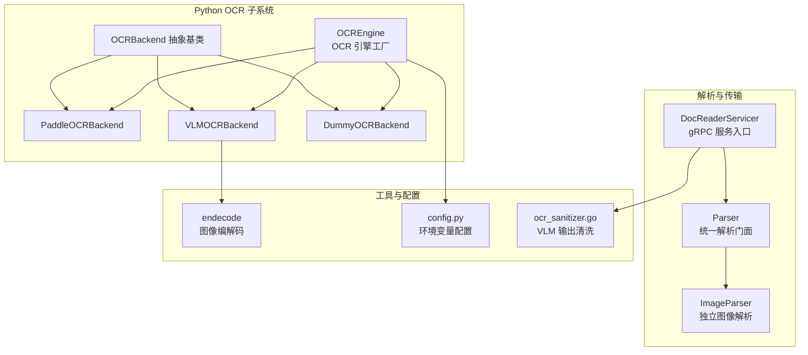
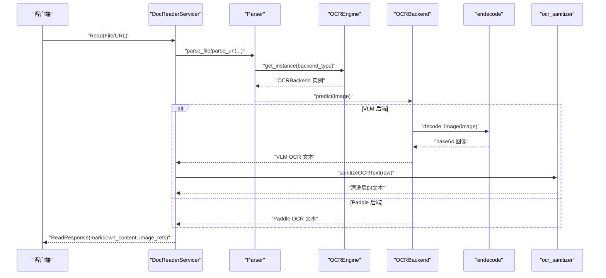
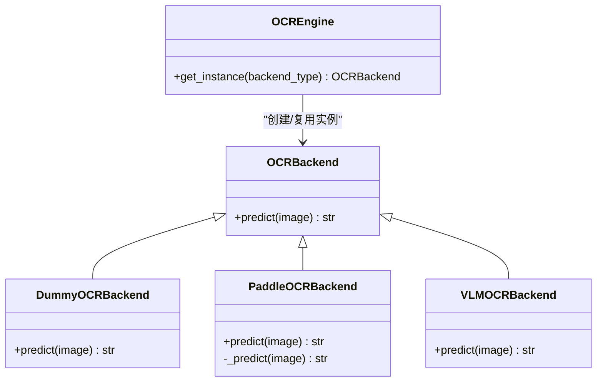
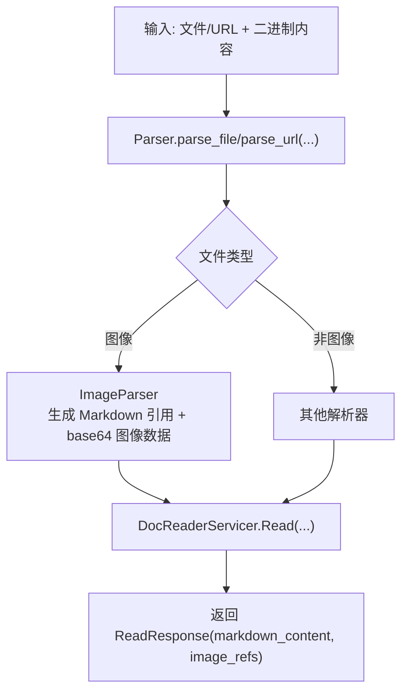
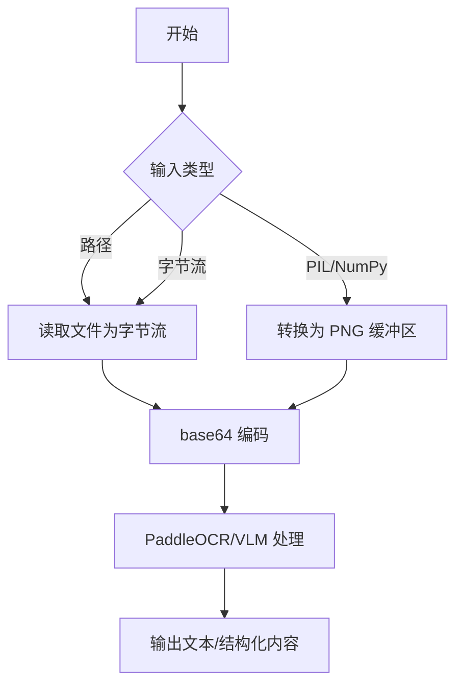
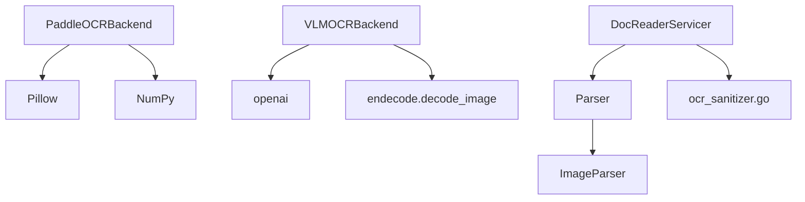

# 图像解析器

<cite>
**本文引用的文件**
- [docreader/ocr/__init__.py](file://docreader/ocr/__init__.py)
- [docreader/ocr/base.py](file://docreader/ocr/base.py)
- [docreader/ocr/paddle.py](file://docreader/ocr/paddle.py)
- [docreader/ocr/vlm.py](file://docreader/ocr/vlm.py)
- [docreader/parser/image_parser.py](file://docreader/parser/image_parser.py)
- [docreader/parser/parser.py](file://docreader/parser/parser.py)
- [docreader/models/read_config.py](file://docreader/models/read_config.py)
- [docreader/config.py](file://docreader/config.py)
- [docreader/utils/endecode.py](file://docreader/utils/endecode.py)
- [docreader/main.py](file://docreader/main.py)
- [internal/application/service/ocr_sanitizer.go](file://internal/application/service/ocr_sanitizer.go)
- [docreader/pyproject.toml](file://docreader/pyproject.toml)
</cite>

## 目录
1. [简介](#简介)
2. [项目结构](#项目结构)
3. [核心组件](#核心组件)
4. [架构总览](#架构总览)
5. [详细组件分析](#详细组件分析)
6. [依赖分析](#依赖分析)
7. [性能考虑](#性能考虑)
8. [故障排查指南](#故障排查指南)
9. [结论](#结论)
10. [附录](#附录)

## 简介
本技术文档围绕 WeKnora 的图像解析器展开，重点解释图像 OCR（光学字符识别）与视觉语言模型（VLM）的集成方案，涵盖图像预处理、噪声去除、图像增强、多语言文本提取、图像格式支持、分辨率处理、批量处理机制、配置参数、识别精度提升技巧以及常见图像质量问题的解决方案。文档以代码级事实为基础，结合可视化图表帮助读者快速理解系统设计与实现。

## 项目结构
WeKnora 的图像解析能力主要由 Python 子系统提供，核心模块包括：
- OCR 引擎工厂与后端：docreader/ocr
- 解析器：docreader/parser
- 工具库：docreader/utils
- 配置：docreader/config.py
- 主服务入口：docreader/main.py
- 文本清洗（Go 侧）：internal/application/service/ocr_sanitizer.go

**图表来源**
- [docreader/ocr/__init__.py:12-38](file://docreader/ocr/__init__.py#L12-L38)
- [docreader/ocr/base.py:10-32](file://docreader/ocr/base.py#L10-L32)
- [docreader/ocr/paddle.py:16-176](file://docreader/ocr/paddle.py#L16-L176)
- [docreader/ocr/vlm.py:14-88](file://docreader/ocr/vlm.py#L14-L88)
- [docreader/parser/parser.py:11-83](file://docreader/parser/parser.py#L11-L83)
- [docreader/parser/image_parser.py:11-29](file://docreader/parser/image_parser.py#L11-L29)
- [docreader/utils/endecode.py:23-76](file://docreader/utils/endecode.py#L23-L76)
- [docreader/config.py:48-122](file://docreader/config.py#L48-L122)
- [docreader/main.py:98-215](file://docreader/main.py#L98-L215)
- [internal/application/service/ocr_sanitizer.go:27-110](file://internal/application/service/ocr_sanitizer.go#L27-L110)

**章节来源**
- [docreader/ocr/__init__.py:12-38](file://docreader/ocr/__init__.py#L12-L38)
- [docreader/ocr/base.py:10-32](file://docreader/ocr/base.py#L10-L32)
- [docreader/parser/parser.py:11-83](file://docreader/parser/parser.py#L11-L83)
- [docreader/main.py:98-215](file://docreader/main.py#L98-L215)

## 核心组件
- OCR 引擎工厂（OCREngine）：根据后端类型选择并缓存 OCR 实例，支持“paddle”、“vlm”与“dummy”三种后端。
- OCR 后端抽象与实现：
  - OCRBackend：定义统一预测接口。
  - PaddleOCRBackend：基于 PaddleOCR 的本地 CPU 推理，启用方向分类与文本行方向检测，适配不同 CPU 指令集。
  - VLMOCRBackend：通过 OpenAI 兼容客户端调用大模型进行图像 OCR，支持中文提示词与 Markdown 结构化输出。
  - DummyOCRBackend：占位实现，返回空结果。
- 解析器：
  - Parser：统一解析门面，负责选择具体解析器并执行解析。
  - ImageParser：对独立图像文件生成 Markdown 图片引用，并在 Document.images 中携带原始数据，交由 Go 侧处理存储。
- 工具与配置：
  - endecode.decode_image：将多种输入格式的图像转换为 base64 字符串，用于 API 传输。
  - config.py：从环境变量加载 DocReader 配置，如 gRPC 参数、代理、临时图像输出目录等。
  - ocr_sanitizer.go：对 VLM OCR 输出进行 HTML 清洗、Markdown 转换与空回复过滤。

**章节来源**
- [docreader/ocr/__init__.py:12-38](file://docreader/ocr/__init__.py#L12-L38)
- [docreader/ocr/base.py:10-32](file://docreader/ocr/base.py#L10-L32)
- [docreader/ocr/paddle.py:16-176](file://docreader/ocr/paddle.py#L16-L176)
- [docreader/ocr/vlm.py:14-88](file://docreader/ocr/vlm.py#L14-L88)
- [docreader/parser/image_parser.py:11-29](file://docreader/parser/image_parser.py#L11-L29)
- [docreader/parser/parser.py:11-83](file://docreader/parser/parser.py#L11-L83)
- [docreader/utils/endecode.py:23-76](file://docreader/utils/endecode.py#L23-L76)
- [docreader/config.py:48-122](file://docreader/config.py#L48-L122)
- [internal/application/service/ocr_sanitizer.go:27-110](file://internal/application/service/ocr_sanitizer.go#L27-L110)

## 架构总览
WeKnora 的图像解析采用“Python OCR 子系统 + Go 应用”的分层设计。gRPC 服务入口负责接收请求、调度解析器、执行 OCR 并将结果返回；图像数据以 Markdown 引用形式返回，同时携带 base64 编码的原始图像，由 Go 侧负责持久化与存储。

**图表来源**
- [docreader/main.py:98-167](file://docreader/main.py#L98-L167)
- [docreader/parser/parser.py:25-63](file://docreader/parser/parser.py#L25-L63)
- [docreader/ocr/__init__.py:18-37](file://docreader/ocr/__init__.py#L18-L37)
- [docreader/ocr/vlm.py:41-87](file://docreader/ocr/vlm.py#L41-L87)
- [docreader/utils/endecode.py:23-76](file://docreader/utils/endecode.py#L23-L76)
- [internal/application/service/ocr_sanitizer.go:27-58](file://internal/application/service/ocr_sanitizer.go#L27-L58)

## 详细组件分析

### OCR 引擎工厂与后端
- 设计要点
  - 单例缓存：OCREngine 使用线程锁保护的实例字典，避免重复初始化。
  - 后端选择：根据 backend_type 返回对应实现；默认 dummy。
  - 扩展性：新增后端只需继承 OCRBackend 并在工厂中注册。
- 关键行为
  - PaddleOCRBackend：禁用 GPU、检测 CPU 指令集（AVX），设置 OCR 模型名称与阈值，确保稳定性与兼容性。
  - VLMOCRBackend：通过 OpenAI 兼容客户端调用模型，使用中文提示词要求 Markdown 结构化输出。
  - DummyOCRBackend：记录警告并返回空字符串，便于调试与降级。

**图表来源**
- [docreader/ocr/base.py:10-32](file://docreader/ocr/base.py#L10-L32)
- [docreader/ocr/paddle.py:16-176](file://docreader/ocr/paddle.py#L16-L176)
- [docreader/ocr/vlm.py:14-88](file://docreader/ocr/vlm.py#L14-L88)
- [docreader/ocr/__init__.py:12-38](file://docreader/ocr/__init__.py#L12-L38)

**章节来源**
- [docreader/ocr/__init__.py:12-38](file://docreader/ocr/__init__.py#L12-L38)
- [docreader/ocr/base.py:10-32](file://docreader/ocr/base.py#L10-L32)
- [docreader/ocr/paddle.py:16-176](file://docreader/ocr/paddle.py#L16-L176)
- [docreader/ocr/vlm.py:14-88](file://docreader/ocr/vlm.py#L14-L88)

### 图像解析器与传输
- ImageParser：对独立图像文件生成 Markdown 图片引用，并将原始二进制数据以 base64 形式放入 Document.images，供 Go 侧解析与存储。
- Parser：统一解析门面，按文件类型选择解析器并执行，不包含 OCR/VLM 功能（轻量化版本）。
- DocReaderServicer：gRPC 服务入口，负责解析文件或 URL，调用解析器，处理图像引用与返回响应。

**图表来源**
- [docreader/parser/image_parser.py:11-29](file://docreader/parser/image_parser.py#L11-L29)
- [docreader/parser/parser.py:25-63](file://docreader/parser/parser.py#L25-L63)
- [docreader/main.py:103-167](file://docreader/main.py#L103-L167)

**章节来源**
- [docreader/parser/image_parser.py:11-29](file://docreader/parser/image_parser.py#L11-L29)
- [docreader/parser/parser.py:11-83](file://docreader/parser/parser.py#L11-L83)
- [docreader/main.py:98-167](file://docreader/main.py#L98-L167)

### 图像预处理、噪声去除与增强
- 输入适配：endecode.decode_image 支持字符串路径、字节流、PIL 图像对象与 NumPy 数组，统一编码为 base64，便于 API 传输。
- PaddleOCR 预处理：
  - 禁用 GPU，强制 CPU 推理，避免硬件差异导致的崩溃。
  - 自动检测 CPU 是否支持 AVX 指令集，不支持时切换兼容模式。
  - 设置检测与识别阈值、方向分类与文本行方向检测，提升准确性。
- VLM 预处理：通过 base64 编码传递图像，保持像素信息完整。

**图表来源**
- [docreader/utils/endecode.py:23-76](file://docreader/utils/endecode.py#L23-L76)
- [docreader/ocr/paddle.py:19-93](file://docreader/ocr/paddle.py#L19-L93)
- [docreader/ocr/vlm.py:54-61](file://docreader/ocr/vlm.py#L54-L61)

**章节来源**
- [docreader/utils/endecode.py:23-76](file://docreader/utils/endecode.py#L23-L76)
- [docreader/ocr/paddle.py:19-93](file://docreader/ocr/paddle.py#L19-L93)
- [docreader/ocr/vlm.py:54-61](file://docreader/ocr/vlm.py#L54-L61)

### 多语言文本提取与提示词设计
- PaddleOCR：通过配置项指定识别模型与语言，当前示例使用中文语言设置，适合中文场景。
- VLM：使用中文提示词，要求提取正文、忽略页眉页脚、表格使用 HTML、公式使用 LaTeX、按阅读顺序组织，输出 Markdown 格式。
- 文本清洗：Go 侧对 VLM 输出进行 HTML 清洗、Markdown 转换与空回复过滤，提升下游可用性。

**章节来源**
- [docreader/ocr/paddle.py:72-90](file://docreader/ocr/paddle.py#L72-L90)
- [docreader/ocr/vlm.py:34-40](file://docreader/ocr/vlm.py#L34-L40)
- [internal/application/service/ocr_sanitizer.go:27-110](file://internal/application/service/ocr_sanitizer.go#L27-L110)

### 图像格式支持、分辨率处理与批量处理
- 图像格式支持：endecode.decode_image 支持多种输入类型；内部保存时优先使用原图格式，否则回退到 PNG。
- 分辨率处理：PaddleOCR 在配置中设置检测上限尺寸与阈值，平衡速度与精度；VLM 以 base64 传递像素，分辨率由上游决定。
- 批量处理：DocReaderServicer 使用线程池执行 gRPC 请求，Parser 作为轻量门面，实际解析逻辑按文件类型路由。

**章节来源**
- [docreader/utils/endecode.py:60-73](file://docreader/utils/endecode.py#L60-L73)
- [docreader/ocr/paddle.py:72-90](file://docreader/ocr/paddle.py#L72-L90)
- [docreader/main.py:187-193](file://docreader/main.py#L187-L193)

### 配置参数与运行时设置
- 环境变量配置：DocReaderConfig 从环境变量加载 gRPC 最大工作线程数、最大文件大小、端口、代理、图像输出目录等。
- OCR 模型配置：VLMOCRBackend 从全局配置读取模型名、API 密钥与基础地址；PaddleOCRBackend 在初始化时设置模型与阈值。
- 配置导出与打印：提供 dump_config 与 print_config，便于运维核对生效配置。

**章节来源**
- [docreader/config.py:48-122](file://docreader/config.py#L48-L122)
- [docreader/ocr/vlm.py:25-32](file://docreader/ocr/vlm.py#L25-L32)
- [docreader/ocr/paddle.py:69-93](file://docreader/ocr/paddle.py#L69-L93)

## 依赖分析
- Python 依赖：docreader/pyproject.toml 明确列出 OCR、图像处理、gRPC、OpenAI 客户端等关键依赖。
- 组件耦合：
  - OCR 后端与工具库解耦，通过抽象接口交互。
  - VLM 后端依赖 OpenAI 兼容客户端与 base64 编解码工具。
  - Go 侧清洗器独立于 Python，仅消费文本输出。

**图表来源**
- [docreader/pyproject.toml:7-39](file://docreader/pyproject.toml#L7-L39)
- [docreader/ocr/paddle.py:8-11](file://docreader/ocr/paddle.py#L8-L11)
- [docreader/ocr/vlm.py:4-9](file://docreader/ocr/vlm.py#L4-L9)
- [docreader/utils/endecode.py:17-18](file://docreader/utils/endecode.py#L17-L18)
- [docreader/main.py:98-101](file://docreader/main.py#L98-L101)
- [internal/application/service/ocr_sanitizer.go](file://internal/application/service/ocr_sanitizer.go#L7)

**章节来源**
- [docreader/pyproject.toml:1-40](file://docreader/pyproject.toml#L1-L40)

## 性能考虑
- CPU 指令集兼容：PaddleOCRBackend 在 Linux 上检测 AVX 支持，不支持时切换兼容模式，避免非法指令导致崩溃。
- 模型阈值与检测上限：通过调整检测阈值、方向分类与检测上限尺寸，在精度与性能间取得平衡。
- 线程池与并发：gRPC 服务器使用线程池处理请求，合理设置最大工作线程数与消息长度，避免阻塞。
- VLM 调用：控制温度与最大 token，减少不必要的上下文开销；Go 侧清洗器避免重复转换。

**章节来源**
- [docreader/ocr/paddle.py:34-67](file://docreader/ocr/paddle.py#L34-L67)
- [docreader/ocr/paddle.py:72-90](file://docreader/ocr/paddle.py#L72-L90)
- [docreader/main.py:187-193](file://docreader/main.py#L187-L193)
- [docreader/ocr/vlm.py:31-32](file://docreader/ocr/vlm.py#L31-L32)

## 故障排查指南
- PaddleOCR 初始化失败
  - 症状：导入失败或操作系统错误。
  - 处理：检查是否安装了 paddle 与 paddleocr；确认 CPU 指令集兼容性；必要时切换到兼容模式或更换后端。
- VLM OCR 调用异常
  - 症状：API 调用超时或返回空内容。
  - 处理：检查 OCR API 密钥与基础地址；确认网络代理配置；适当提高超时时间。
- VLM 输出质量差
  - 症状：HTML 包裹、Markdown 代码块包裹、无内容回复。
  - 处理：Go 侧清洗器会自动过滤 HTML、转换 Markdown、剔除已知空回复；建议优化提示词与图像质量。
- 图像解析为空
  - 症状：解析后内容为空。
  - 处理：确认图像中存在可识别文本；检查图像清晰度与对比度；尝试增强后再识别。

**章节来源**
- [docreader/ocr/paddle.py:95-117](file://docreader/ocr/paddle.py#L95-L117)
- [docreader/ocr/vlm.py:50-58](file://docreader/ocr/vlm.py#L50-L58)
- [internal/application/service/ocr_sanitizer.go:27-110](file://internal/application/service/ocr_sanitizer.go#L27-L110)
- [docreader/parser/image_parser.py:19-28](file://docreader/parser/image_parser.py#L19-L28)

## 结论
WeKnora 的图像解析器通过“抽象后端 + 工厂缓存 + 轻量解析门面”的设计，实现了 PaddleOCR 与 VLM 的灵活集成。配合 Go 侧的图像解析与清洗，系统在多语言文本提取、格式支持与性能优化方面具备良好可扩展性。建议在生产环境中根据硬件条件选择合适的后端，并持续优化提示词与图像质量以提升识别准确率。

## 附录
- 常用配置键
  - gRPC：DOCREADER_GRPC_MAX_WORKERS、DOCREADER_GRPC_MAX_FILE_SIZE_MB、DOCREADER_GRPC_PORT
  - 代理：DOCREADER_EXTERNAL_HTTP_PROXY、DOCREADER_EXTERNAL_HTTPS_PROXY
  - 图像输出：DOCREADER_IMAGE_OUTPUT_DIR
- OCR 后端选择
  - paddle：本地 CPU 推理，适合稳定与离线场景。
  - vlm：云端大模型，适合复杂版式与多语言场景。
  - dummy：仅用于测试与降级。

**章节来源**
- [docreader/config.py:66-97](file://docreader/config.py#L66-L97)
- [docreader/ocr/__init__.py:18-37](file://docreader/ocr/__init__.py#L18-L37)