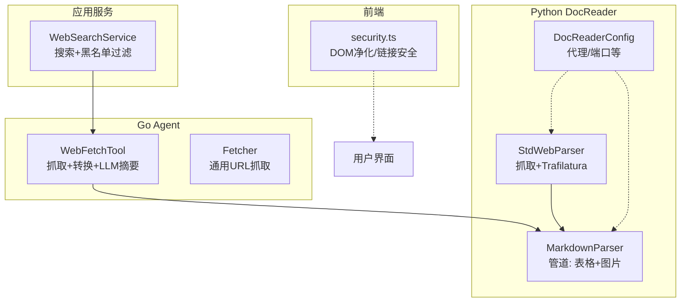
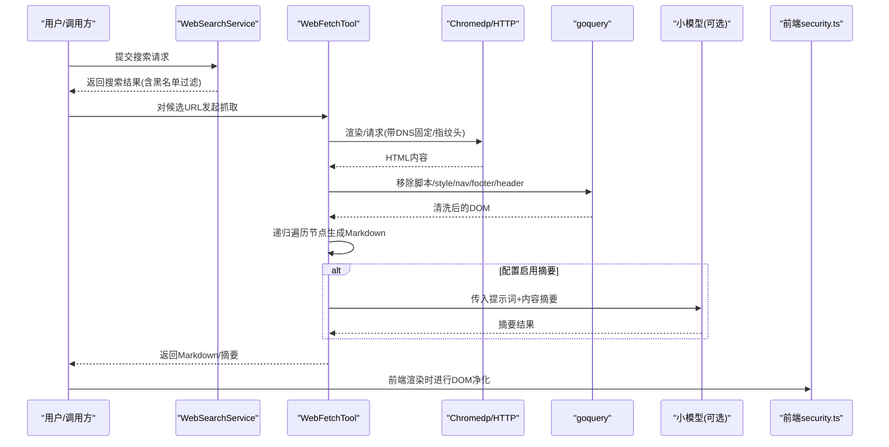
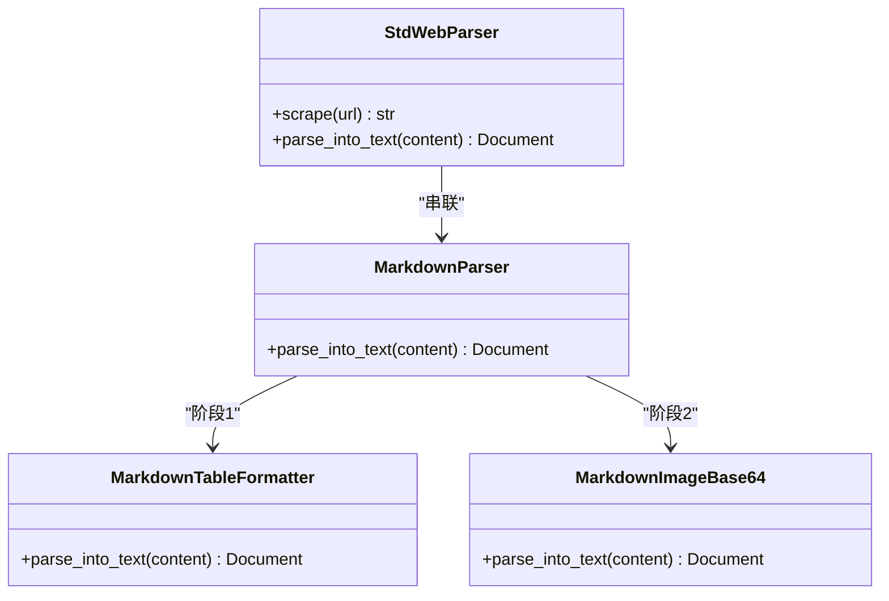
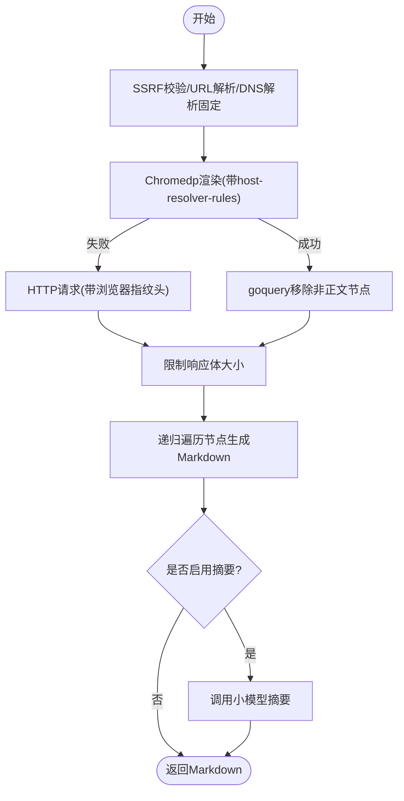
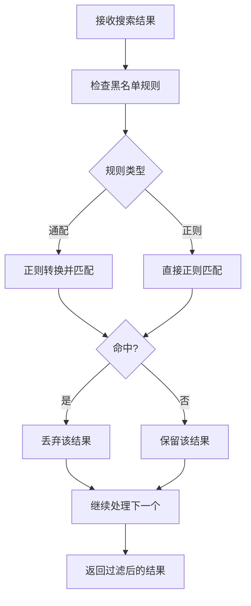
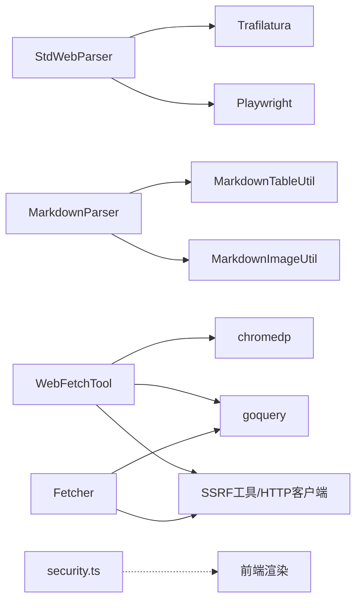

# 网页解析器

<cite>
**本文引用的文件**
- [docreader/parser/web_parser.py](file://docreader/parser/web_parser.py)
- [docreader/parser/markdown_parser.py](file://docreader/parser/markdown_parser.py)
- [docreader/config.py](file://docreader/config.py)
- [internal/agent/tools/web_fetch.go](file://internal/agent/tools/web_fetch.go)
- [internal/infrastructure/web_fetch/fetcher.go](file://internal/infrastructure/web_fetch/fetcher.go)
- [internal/application/service/web_search.go](file://internal/application/service/web_search.go)
- [frontend/src/utils/security.ts](file://frontend/src/utils/security.ts)
- [docreader/testdata/test.html](file://docreader/testdata/test.html)
- [docreader/testdata/test.md](file://docreader/testdata/test.md)
</cite>

## 目录
1. [简介](#简介)
2. [项目结构](#项目结构)
3. [核心组件](#核心组件)
4. [架构总览](#架构总览)
5. [详细组件分析](#详细组件分析)
6. [依赖分析](#依赖分析)
7. [性能考虑](#性能考虑)
8. [故障排除指南](#故障排除指南)
9. [结论](#结论)
10. [附录](#附录)

## 简介
本文件面向WeKnora的网页解析能力，围绕以下目标展开：
- HTML文档解析实现：DOM树构建、内容提取与结构化处理
- 网页内容净化机制：广告过滤与导航栏移除策略
- Markdown解析器：语法转换与格式保持技术
- 网页抓取策略：反爬虫应对与缓存机制
- 配置选项、内容质量控制与跨站点兼容性处理方案

WeKnora提供两条主要路径：
- Python侧DocReader：基于Playwright+Trafilatura的网页抓取与Markdown输出，并通过管道进一步标准化表格与图片。
- Go侧WebFetch工具：在Agent执行链路中抓取网页并转换为Markdown，同时进行节点级净化与结构化。

## 项目结构
与网页解析相关的核心模块分布如下：
- Python DocReader
  - 网页抓取与Markdown转换：docreader/parser/web_parser.py
  - Markdown管道处理（表格、图片）：docreader/parser/markdown_parser.py
  - 配置加载：docreader/config.py
  - 测试数据：docreader/testdata/*.html, *.md
- Go Agent工具链
  - 网页抓取与转换：internal/agent/tools/web_fetch.go
  - 通用URL抓取（供聊天管线复用）：internal/infrastructure/web_fetch/fetcher.go
  - 网络搜索服务（含黑名单过滤）：internal/application/service/web_search.go
- 前端安全工具
  - DOM净化与链接安全处理：frontend/src/utils/security.ts

**图表来源**
- [docreader/parser/web_parser.py:18-126](file://docreader/parser/web_parser.py#L18-L126)
- [docreader/parser/markdown_parser.py:376-388](file://docreader/parser/markdown_parser.py#L376-L388)
- [docreader/config.py:66-97](file://docreader/config.py#L66-L97)
- [internal/agent/tools/web_fetch.go:80-98](file://internal/agent/tools/web_fetch.go#L80-L98)
- [internal/infrastructure/web_fetch/fetcher.go:26-130](file://internal/infrastructure/web_fetch/fetcher.go#L26-L130)
- [internal/application/service/web_search.go:363-415](file://internal/application/service/web_search.go#L363-L415)
- [frontend/src/utils/security.ts:52-89](file://frontend/src/utils/security.ts#L52-L89)

**章节来源**
- [docreader/parser/web_parser.py:18-126](file://docreader/parser/web_parser.py#L18-L126)
- [docreader/parser/markdown_parser.py:376-388](file://docreader/parser/markdown_parser.py#L376-L388)
- [docreader/config.py:66-97](file://docreader/config.py#L66-L97)
- [internal/agent/tools/web_fetch.go:80-98](file://internal/agent/tools/web_fetch.go#L80-L98)
- [internal/infrastructure/web_fetch/fetcher.go:26-130](file://internal/infrastructure/web_fetch/fetcher.go#L26-L130)
- [internal/application/service/web_search.go:363-415](file://internal/application/service/web_search.go#L363-L415)
- [frontend/src/utils/security.ts:52-89](file://frontend/src/utils/security.ts#L52-L89)

## 核心组件
- Python网页解析器
  - StdWebParser：使用Playwright启动WebKit浏览器，抓取页面HTML；随后用Trafilatura提取正文、标题、图片、表格、链接，输出Markdown。
  - MarkdownParser：管道式处理，先标准化表格格式，再抽取并转换Markdown中的图片（含Base64与路径），统一输出Document对象。
- Go网页抓取工具
  - WebFetchTool：对单个或批量URL执行抓取，优先使用Chromedp渲染，失败则回退HTTP；抓取后用goquery移除脚本/style/nav/footer/header等非正文元素，递归遍历节点生成Markdown；可选调用小模型做摘要。
  - FetchURLContent：独立的通用URL抓取器，用于聊天管线或其他场景，具备SSRF校验、DNS固定、浏览器指纹头、大小限制等。
- 网络搜索与黑名单
  - WebSearchService：对搜索结果进行黑名单过滤，支持通配与正则两种规则。
- 前端安全
  - security.ts：移除script标签、事件属性，强制外链rel="noopener noreferrer"，确保图片alt存在等。

**章节来源**
- [docreader/parser/web_parser.py:18-126](file://docreader/parser/web_parser.py#L18-L126)
- [docreader/parser/markdown_parser.py:127-388](file://docreader/parser/markdown_parser.py#L127-L388)
- [internal/agent/tools/web_fetch.go:80-352](file://internal/agent/tools/web_fetch.go#L80-L352)
- [internal/infrastructure/web_fetch/fetcher.go:26-130](file://internal/infrastructure/web_fetch/fetcher.go#L26-L130)
- [internal/application/service/web_search.go:363-415](file://internal/application/service/web_search.go#L363-L415)
- [frontend/src/utils/security.ts:52-89](file://frontend/src/utils/security.ts#L52-L89)

## 架构总览
下图展示从“搜索结果到最终Markdown”的关键流程，以及净化与安全策略的落点。

**图表来源**
- [internal/application/service/web_search.go:363-415](file://internal/application/service/web_search.go#L363-L415)
- [internal/agent/tools/web_fetch.go:417-480](file://internal/agent/tools/web_fetch.go#L417-L480)
- [internal/agent/tools/web_fetch.go:528-655](file://internal/agent/tools/web_fetch.go#L528-L655)
- [frontend/src/utils/security.ts:52-89](file://frontend/src/utils/security.ts#L52-L89)

## 详细组件分析

### Python网页解析器（DocReader）
- StdWebParser
  - 抓取：使用Playwright启动WebKit，按超时访问URL，返回完整HTML。
  - 解析：调用Trafilatura提取正文、标题、图片、表格、链接，输出Markdown文本及元数据。
  - 代理：若配置了外部HTTPS代理，则注入到浏览器启动参数。
- MarkdownParser（管道）
  - MarkdownTableFormatter：标准化表格行与对齐标记，统一列间距与缩进。
  - MarkdownImageBase64：抽取Markdown中的Base64图片，生成唯一文件名并返回原始字节，供后续存储与替换。
  - 输出：Document对象，包含content、metadata、images等字段。

**图表来源**
- [docreader/parser/web_parser.py:18-126](file://docreader/parser/web_parser.py#L18-L126)
- [docreader/parser/markdown_parser.py:127-388](file://docreader/parser/markdown_parser.py#L127-L388)

**章节来源**
- [docreader/parser/web_parser.py:18-126](file://docreader/parser/web_parser.py#L18-L126)
- [docreader/parser/markdown_parser.py:127-388](file://docreader/parser/markdown_parser.py#L127-L388)
- [docreader/config.py:66-97](file://docreader/config.py#L66-L97)

### Go网页抓取工具链
- WebFetchTool
  - 输入：URL列表+提示词，支持批量异步抓取。
  - 安全：SSRF校验、DNS固定（解析一次并固定IP）、Host头与TLS SNI一致，避免重绑定。
  - 抓取：优先Chromedp渲染，失败回退HTTP；限制响应体大小，避免内存膨胀。
  - 转换：goquery移除脚本/style/nav/footer/header等，递归遍历节点生成Markdown（标题、段落、链接、图片、列表、代码块、表格、引用线等）。
  - 摘要：可选调用小模型生成摘要，便于后续回答。
- FetchURLContent（通用抓取）
  - 与WebFetchTool共享核心逻辑，但更轻量，适合聊天管线直接调用。

**图表来源**
- [internal/agent/tools/web_fetch.go:252-352](file://internal/agent/tools/web_fetch.go#L252-L352)
- [internal/agent/tools/web_fetch.go:417-526](file://internal/agent/tools/web_fetch.go#L417-L526)
- [internal/agent/tools/web_fetch.go:528-655](file://internal/agent/tools/web_fetch.go#L528-L655)

**章节来源**
- [internal/agent/tools/web_fetch.go:80-352](file://internal/agent/tools/web_fetch.go#L80-L352)
- [internal/infrastructure/web_fetch/fetcher.go:26-130](file://internal/infrastructure/web_fetch/fetcher.go#L26-L130)

### 网络搜索与黑名单过滤
- WebSearchService在返回搜索结果前，会对URL进行黑名单过滤：
  - 支持通配规则（如*://*.example.com/*）
  - 支持正则规则（/pattern/）
  - 规则无效时记录警告并跳过该条目

**图表来源**
- [internal/application/service/web_search.go:363-415](file://internal/application/service/web_search.go#L363-L415)

**章节来源**
- [internal/application/service/web_search.go:363-415](file://internal/application/service/web_search.go#L363-L415)

### 前端内容净化与安全
- security.ts在渲染前对DOM进行净化：
  - 移除script标签与事件属性（如onerror/onload等）
  - 外链强制rel="noopener noreferrer"并target="_blank"
  - 确保图片有alt属性
- 该策略与后端抓取时的节点移除相辅相成，共同降低XSS与钓鱼风险。

**章节来源**
- [frontend/src/utils/security.ts:52-89](file://frontend/src/utils/security.ts#L52-L89)

## 依赖分析
- Python侧
  - StdWebParser依赖Playwright与Trafilatura，负责抓取与正文抽取。
  - MarkdownParser依赖自定义工具类（表格格式化、图片处理），输出结构化Document。
  - DocReaderConfig提供代理与端口等配置项。
- Go侧
  - WebFetchTool依赖chromedp与goquery，结合SSRF工具与HTTP客户端，保证抓取安全与稳定性。
  - FetchURLContent作为独立抓取器，复用相同的安全与净化策略。
- 前端
  - security.ts与UI渲染配合，确保最终展示内容的安全性。

**图表来源**
- [docreader/parser/web_parser.py:18-126](file://docreader/parser/web_parser.py#L18-L126)
- [docreader/parser/markdown_parser.py:127-388](file://docreader/parser/markdown_parser.py#L127-L388)
- [internal/agent/tools/web_fetch.go:80-98](file://internal/agent/tools/web_fetch.go#L80-L98)
- [internal/infrastructure/web_fetch/fetcher.go:26-130](file://internal/infrastructure/web_fetch/fetcher.go#L26-L130)
- [frontend/src/utils/security.ts:52-89](file://frontend/src/utils/security.ts#L52-L89)

**章节来源**
- [docreader/parser/web_parser.py:18-126](file://docreader/parser/web_parser.py#L18-L126)
- [docreader/parser/markdown_parser.py:127-388](file://docreader/parser/markdown_parser.py#L127-L388)
- [internal/agent/tools/web_fetch.go:80-98](file://internal/agent/tools/web_fetch.go#L80-L98)
- [internal/infrastructure/web_fetch/fetcher.go:26-130](file://internal/infrastructure/web_fetch/fetcher.go#L26-L130)
- [frontend/src/utils/security.ts:52-89](file://frontend/src/utils/security.ts#L52-L89)

## 性能考虑
- 并发与限流
  - WebFetchTool对多个URL采用并发抓取，内部使用WaitGroup聚合结果，避免阻塞。
  - 可结合全局并发门控（Redis INCR/DECR）与每用户队列限制，防止资源争用。
- 资源限制
  - Go侧抓取限制响应体大小，避免内存暴涨；Python侧Trafilatura默认输出Markdown，减少二次解析成本。
- 渲染与回退
  - 优先Chromedp渲染，失败自动回退HTTP，兼顾成功率与性能。
- 前端渲染
  - security.ts在渲染前净化DOM，减少潜在脚本执行与资源加载开销。

[本节为通用指导，无需具体文件分析]

## 故障排除指南
- 抓取失败
  - 检查SSRF校验与DNS固定是否生效；确认Host头与TLS SNI一致。
  - 若Chromedp失败，观察回退HTTP的响应状态码与Body长度。
- 内容不完整
  - 使用WebFetchTool对搜索结果中的URL进行二次抓取与摘要，提升信息完整性。
- 黑名单误伤
  - 核对WebSearchService的黑名单规则（通配/正则），必要时调整或临时移除。
- 前端显示异常
  - 确认security.ts已对script与事件属性进行清理，外链已添加noopener noreferrer。

**章节来源**
- [internal/agent/tools/web_fetch.go:417-480](file://internal/agent/tools/web_fetch.go#L417-L480)
- [internal/application/service/web_search.go:363-415](file://internal/application/service/web_search.go#L363-L415)
- [frontend/src/utils/security.ts:52-89](file://frontend/src/utils/security.ts#L52-L89)

## 结论
WeKnora的网页解析体系在两端互补：
- Python DocReader侧重“高质量正文抽取+结构化输出”，适合离线或批处理场景；
- Go WebFetchTool侧重“实时抓取+安全净化+可选摘要”，适合Agent执行链路与在线交互。

通过SSRF校验、DNS固定、浏览器指纹头、节点级净化与前端DOM净化，系统在可用性与安全性之间取得平衡；通过管道化的Markdown处理与黑名单过滤，进一步提升了内容质量与跨站点兼容性。

[本节为总结，无需具体文件分析]

## 附录

### 配置选项与环境变量
- DocReader配置（来自环境变量）
  - gRPC相关：最大工作线程数、最大文件大小、端口
  - 文档解析：docx最大页数
  - 外部代理：HTTP/HTTPS代理
  - 图片输出目录：临时图片输出路径
- Go抓取工具
  - 超时与响应体上限、User-Agent与Accept等浏览器指纹头
  - SSRF校验与DNS固定策略

**章节来源**
- [docreader/config.py:66-97](file://docreader/config.py#L66-L97)
- [internal/agent/tools/web_fetch.go:25-28](file://internal/agent/tools/web_fetch.go#L25-L28)
- [internal/infrastructure/web_fetch/fetcher.go:21-24](file://internal/infrastructure/web_fetch/fetcher.go#L21-L24)

### 示例与测试数据
- HTML示例：docreader/testdata/test.html
- Markdown示例：docreader/testdata/test.md

**章节来源**
- [docreader/testdata/test.html:1-56](file://docreader/testdata/test.html#L1-L56)
- [docreader/testdata/test.md:1-37](file://docreader/testdata/test.md#L1-L37)