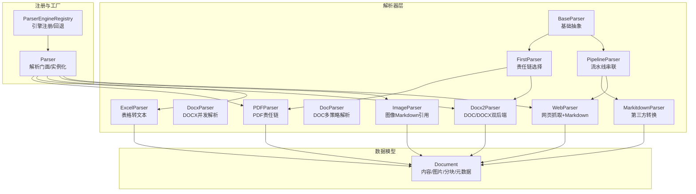
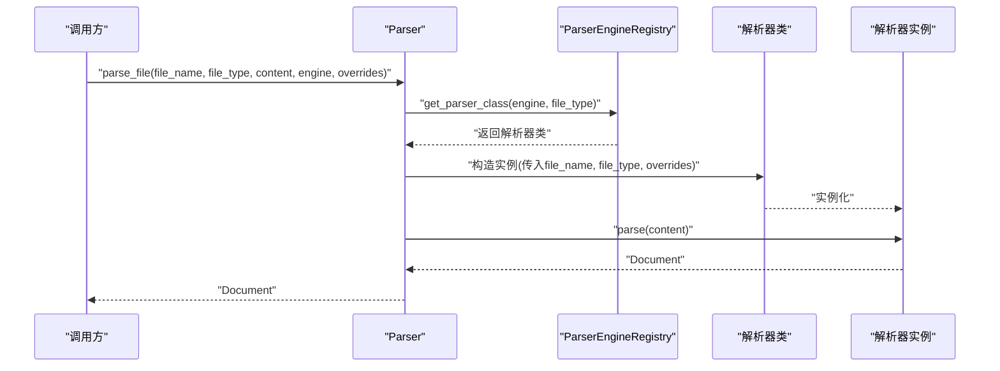
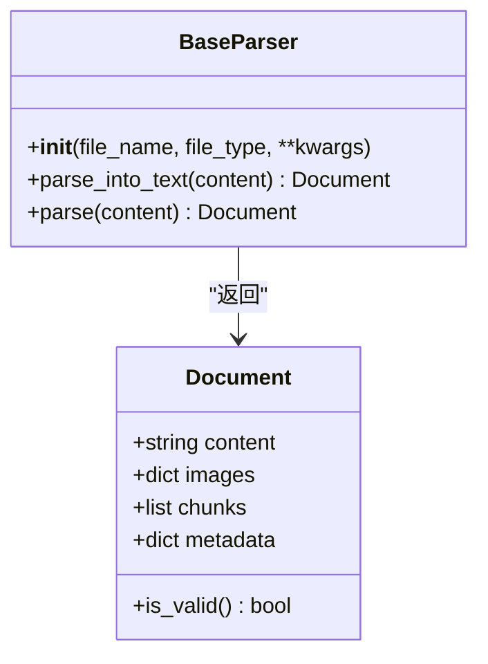
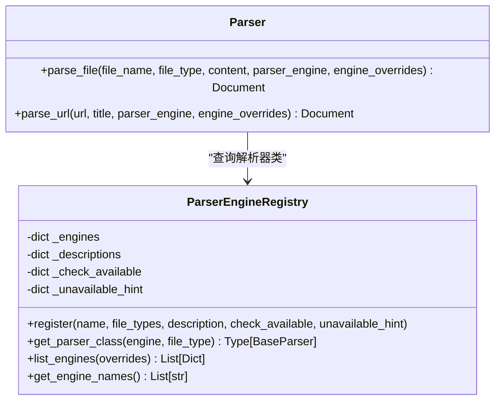
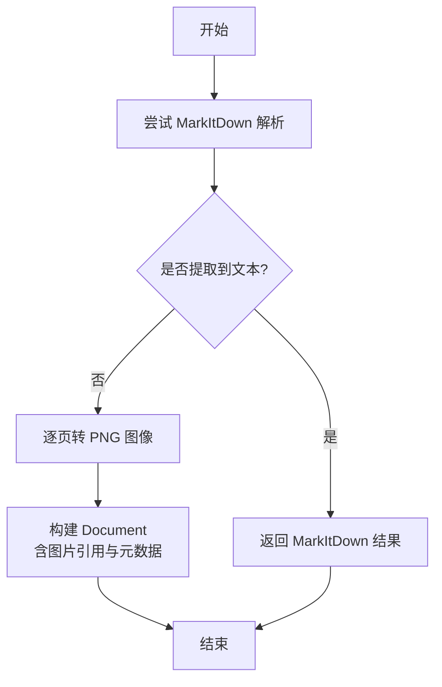
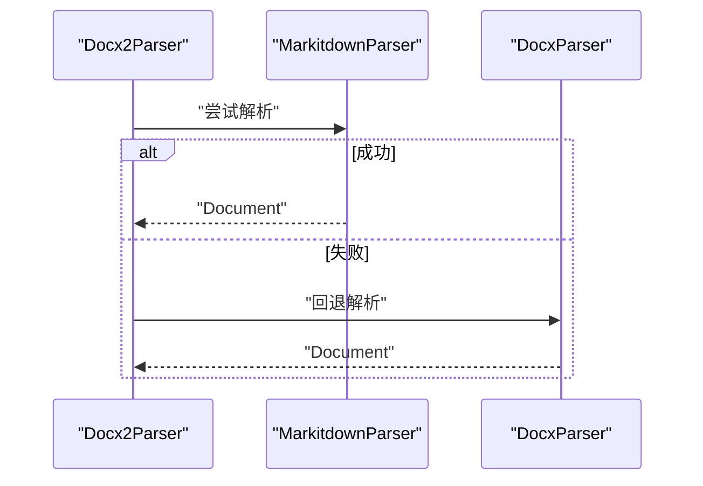
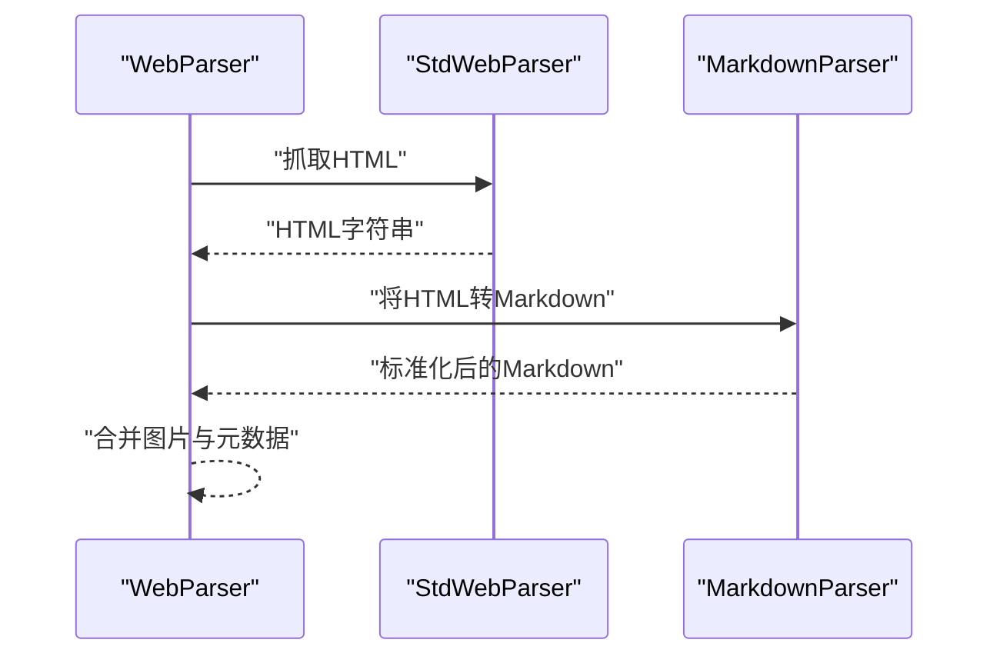
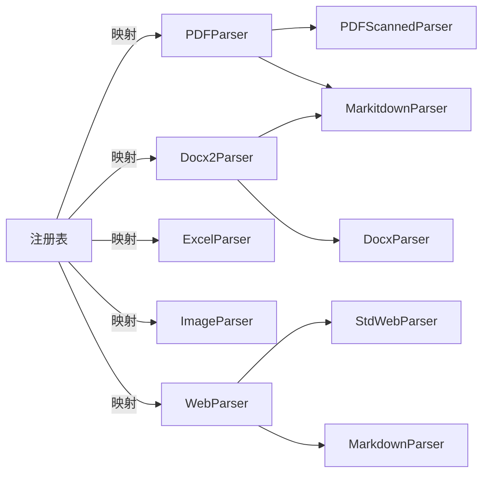

# 解析器实现

<cite>
**本文引用的文件**
- [docreader/parser/base_parser.py](file://docreader/parser/base_parser.py)
- [docreader/parser/registry.py](file://docreader/parser/registry.py)
- [docreader/parser/chain_parser.py](file://docreader/parser/chain_parser.py)
- [docreader/parser/parser.py](file://docreader/parser/parser.py)
- [docreader/parser/pdf_parser.py](file://docreader/parser/pdf_parser.py)
- [docreader/parser/docx_parser.py](file://docreader/parser/docx_parser.py)
- [docreader/parser/docx2_parser.py](file://docreader/parser/docx2_parser.py)
- [docreader/parser/doc_parser.py](file://docreader/parser/doc_parser.py)
- [docreader/parser/excel_parser.py](file://docreader/parser/excel_parser.py)
- [docreader/parser/image_parser.py](file://docreader/parser/image_parser.py)
- [docreader/parser/web_parser.py](file://docreader/parser/web_parser.py)
- [docreader/parser/markitdown_parser.py](file://docreader/parser/markitdown_parser.py)
- [docreader/models/document.py](file://docreader/models/document.py)
</cite>

## 目录
1. [简介](#简介)
2. [项目结构](#项目结构)
3. [核心组件](#核心组件)
4. [架构总览](#架构总览)
5. [详细组件分析](#详细组件分析)
6. [依赖分析](#依赖分析)
7. [性能考虑](#性能考虑)
8. [故障排查指南](#故障排查指南)
9. [结论](#结论)
10. [附录：新解析器开发指南与最佳实践](#附录新解析器开发指南与最佳实践)

## 简介
本文件面向WeKnora解析器实现，系统化阐述解析器注册机制、基类设计与具体解析器实现，覆盖PDF、Word、图像与网页解析器的技术细节；同时解释工厂模式、动态加载与配置参数传递方式，给出解析质量控制、错误恢复与性能优化策略，并提供新解析器开发指南与最佳实践。

## 项目结构
WeKnora的解析能力位于Python子模块docreader/parser中，采用“基类 + 注册表 + 工厂式解析器”的分层设计：
- 基类定义统一接口与通用行为
- 注册表负责引擎与文件类型的映射、可用性检测与回退策略
- 工厂式解析器通过组合模式（责任链/流水线）组织多后端解析
- 文档模型在独立模块中定义，承载解析结果与分块信息

**图表来源**
- [docreader/parser/base_parser.py:13-62](file://docreader/parser/base_parser.py#L13-L62)
- [docreader/parser/chain_parser.py:20-180](file://docreader/parser/chain_parser.py#L20-L180)
- [docreader/parser/registry.py:18-161](file://docreader/parser/registry.py#L18-L161)
- [docreader/parser/parser.py:11-83](file://docreader/parser/parser.py#L11-L83)
- [docreader/models/document.py:62-88](file://docreader/models/document.py#L62-L88)

**章节来源**
- [docreader/parser/__init__.py:1-39](file://docreader/parser/__init__.py#L1-L39)
- [docreader/parser/registry.py:18-161](file://docreader/parser/registry.py#L18-L161)
- [docreader/parser/parser.py:11-83](file://docreader/parser/parser.py#L11-L83)

## 核心组件
- 基类BaseParser：定义统一的解析接口与日志记录，约束所有解析器返回Document对象，且不执行分块、OCR、VLM等操作，交由Go侧处理。
- 责任链FirstParser：按顺序尝试多个解析器，首个成功者即返回结果。
- 流水线PipelineParser：将前一解析器输出作为下一解析器输入，累积图片与元数据。
- 注册表ParserEngineRegistry：维护引擎名到文件类型到解析器类的映射，支持引擎可用性检查与自动回退至内置引擎。
- 解析门面Parser：根据文件类型与引擎名解析文件或URL，实例化对应解析器并调用parse。

**章节来源**
- [docreader/parser/base_parser.py:13-62](file://docreader/parser/base_parser.py#L13-L62)
- [docreader/parser/chain_parser.py:20-180](file://docreader/parser/chain_parser.py#L20-L180)
- [docreader/parser/registry.py:18-161](file://docreader/parser/registry.py#L18-L161)
- [docreader/parser/parser.py:11-83](file://docreader/parser/parser.py#L11-L83)

## 架构总览
解析流程分为“文件解析”和“URL解析”两条主线，均由Parser门面发起，经注册表定位解析器，再由解析器内部的组合模式完成多阶段处理。

**图表来源**
- [docreader/parser/parser.py:25-63](file://docreader/parser/parser.py#L25-L63)
- [docreader/parser/registry.py:51-76](file://docreader/parser/registry.py#L51-L76)

## 详细组件分析

### 基类与文档模型
- BaseParser：统一构造函数接收文件名与类型，记录解析开始与结束日志；parse方法默认委托parse_into_text，并记录提取字符数。
- Document：包含content、images、chunks、metadata字段，提供is_valid判断与序列化工具。

**图表来源**
- [docreader/parser/base_parser.py:13-62](file://docreader/parser/base_parser.py#L13-L62)
- [docreader/models/document.py:62-88](file://docreader/models/document.py#L62-L88)

**章节来源**
- [docreader/parser/base_parser.py:13-62](file://docreader/parser/base_parser.py#L13-L62)
- [docreader/models/document.py:62-88](file://docreader/models/document.py#L62-L88)

### 注册表与工厂模式
- ParserEngineRegistry：以字典维护引擎名到文件类型到解析器类的映射；提供register、get_parser_class、list_engines、get_engine_names等方法；当请求引擎不支持该类型时自动回退到内置引擎；支持可选的可用性检查回调与提示信息。
- Parser：解析门面，负责从注册表解析出解析器类并实例化，支持引擎覆盖参数透传。

**图表来源**
- [docreader/parser/registry.py:18-161](file://docreader/parser/registry.py#L18-L161)
- [docreader/parser/parser.py:11-83](file://docreader/parser/parser.py#L11-L83)

**章节来源**
- [docreader/parser/registry.py:18-161](file://docreader/parser/registry.py#L18-L161)
- [docreader/parser/parser.py:11-83](file://docreader/parser/parser.py#L11-L83)

### PDF解析器
- PDFParser：采用FirstParser，按顺序尝试MarkitdownParser与PDFScannedParser；若主解析无文本则回退到扫描版PDF解析器，将每页转为PNG并通过Markdown链接引用，供Go侧OCR处理。
- PDFScannedParser：使用pdfplumber读取PDF页面，以固定分辨率导出PNG，生成图片引用与基础元数据。

**图表来源**
- [docreader/parser/pdf_parser.py:57-69](file://docreader/parser/pdf_parser.py#L57-L69)
- [docreader/parser/pdf_parser.py:13-56](file://docreader/parser/pdf_parser.py#L13-L56)

**章节来源**
- [docreader/parser/pdf_parser.py:13-69](file://docreader/parser/pdf_parser.py#L13-L69)

### Word解析器
- Docx2Parser：FirstParser，优先尝试MarkitdownParser，失败则回退DocxParser。
- DocxParser：并发解析大文档，基于段落与分页标记识别页面范围，使用进程池并行处理各页，提取文本与内嵌图片，支持简化回退路径。
- DocParser：DOC文档的多策略解析，依次尝试DOC->DOCX转换（LibreOffice/OpenOffice）、antiword文本提取、以及已禁用的textract方案（存在SSRF风险）。

**图表来源**
- [docreader/parser/docx2_parser.py:10-12](file://docreader/parser/docx2_parser.py#L10-L12)
- [docreader/parser/docx_parser.py:102-207](file://docreader/parser/docx_parser.py#L102-L207)
- [docreader/parser/doc_parser.py:95-128](file://docreader/parser/doc_parser.py#L95-L128)

**章节来源**
- [docreader/parser/docx2_parser.py:10-12](file://docreader/parser/docx2_parser.py#L10-L12)
- [docreader/parser/docx_parser.py:75-289](file://docreader/parser/docx_parser.py#L75-L289)
- [docreader/parser/doc_parser.py:95-313](file://docreader/parser/doc_parser.py#L95-L313)

### 图像解析器
- ImageParser：将单张图片编码为base64，生成Markdown图片引用与存储相对路径，交由Go侧上传与解析。

**章节来源**
- [docreader/parser/image_parser.py:11-29](file://docreader/parser/image_parser.py#L11-L29)

### 网页解析器
- WebParser：PipelineParser，先用StdWebParser抓取HTML（Playwright + WebKit），再用MarkdownParser进行表格/图片/链接等标准化处理；支持代理配置与Trafilatura抽取。
- StdWebParser：异步抓取URL，支持代理；抽取标题元信息写入Document.metadata。

**图表来源**
- [docreader/parser/web_parser.py:128-138](file://docreader/parser/web_parser.py#L128-L138)
- [docreader/parser/web_parser.py:18-126](file://docreader/parser/web_parser.py#L18-L126)

**章节来源**
- [docreader/parser/web_parser.py:18-172](file://docreader/parser/web_parser.py#L18-L172)

### Markdown与MarkItDown解析器
- MarkdownParser：PipelineParser，先MarkdownTableFormatter标准化表格，再MarkdownImageBase64提取base64图片并生成引用。
- MarkitdownParser：PipelineParser，先StdMarkitdownParser调用第三方库转换，再MarkdownParser做二次处理。

**章节来源**
- [docreader/parser/markitdown_parser.py:14-46](file://docreader/parser/markitdown_parser.py#L14-L46)
- [docreader/parser/markdown_parser.py:376-388](file://docreader/parser/markdown_parser.py#L376-L388)

### Excel解析器
- ExcelParser：使用pandas读取多工作表，去除全空行，将非空单元格拼接为“列: 值”格式，逐行生成Chunk，便于后续检索与可视化。

**章节来源**
- [docreader/parser/excel_parser.py:20-98](file://docreader/parser/excel_parser.py#L20-L98)

## 依赖分析
- 组件耦合度：解析器均依赖BaseParser与Document；注册表与工厂解耦具体解析器实现，降低耦合。
- 回退策略：注册表对未显式支持的类型自动回退内置引擎；PDF/DOCX/DOC等解析器内部也实现多后端回退。
- 外部依赖：PDFScannedParser依赖pdfplumber；WebParser依赖Playwright与Trafilatura；DocParser依赖LibreOffice/antiword；MarkitdownParser依赖markitdown；ExcelParser依赖pandas。

**图表来源**
- [docreader/parser/registry.py:112-157](file://docreader/parser/registry.py#L112-L157)
- [docreader/parser/pdf_parser.py:57-69](file://docreader/parser/pdf_parser.py#L57-L69)
- [docreader/parser/docx2_parser.py:10-12](file://docreader/parser/docx2_parser.py#L10-L12)
- [docreader/parser/web_parser.py:128-138](file://docreader/parser/web_parser.py#L128-L138)

**章节来源**
- [docreader/parser/registry.py:18-161](file://docreader/parser/registry.py#L18-L161)

## 性能考虑
- 并发与分页：DocxParser对大文档采用进程池并行处理各页，结合页面上限限制与CPU核数自适应调整工作进程数量，减少内存峰值。
- 回退与容错：PDFParser与Docx2Parser在主解析失败时快速回退到更稳健的备选解析器，避免长时间阻塞。
- 资源清理：DocParser在转换完成后清理临时目录与文件，防止磁盘占用。
- 日志与可观测：解析器广泛使用结构化日志记录耗时、页面统计与警告，便于性能分析与问题定位。

**章节来源**
- [docreader/parser/docx_parser.py:649-711](file://docreader/parser/docx_parser.py#L649-L711)
- [docreader/parser/doc_parser.py:170-229](file://docreader/parser/doc_parser.py#L170-L229)
- [docreader/parser/pdf_parser.py:13-56](file://docreader/parser/pdf_parser.py#L13-L56)

## 故障排查指南
- 空内容返回：解析器在返回空content时会记录警告，建议检查输入内容、文件类型推断与引擎可用性。
- 引擎不可用：通过list_engines查看各引擎可用状态与原因，必要时提供engine_overrides参数。
- 网页抓取失败：StdWebParser在导航超时或浏览器启动失败时返回空内容，检查代理配置与网络连通性。
- DOC转换失败：确认LibreOffice/antiword安装路径与环境变量，sandbox执行超时会抛出异常。
- 图片解析异常：确认图片格式与大小限制，注意base64编码与存储路径一致性。

**章节来源**
- [docreader/parser/parser.py:58-63](file://docreader/parser/parser.py#L58-L63)
- [docreader/parser/web_parser.py:39-85](file://docreader/parser/web_parser.py#L39-L85)
- [docreader/parser/doc_parser.py:54-90](file://docreader/parser/doc_parser.py#L54-L90)

## 结论
WeKnora解析器体系以BaseParser为核心，通过注册表与工厂模式实现灵活的引擎选择与回退；PDF、Word、图像与网页解析器分别采用责任链与流水线策略，兼顾鲁棒性与可扩展性。配合Go侧的分块、OCR与VLM处理，形成端到端的高质量文档解析管线。

## 附录：新解析器开发指南与最佳实践
- 设计原则
  - 继承BaseParser并实现parse_into_text，仅返回Document，不进行分块、OCR、VLM等操作。
  - 尽量采用FirstParser或PipelineParser组合已有成熟解析器，减少重复造轮子。
- 注册与回退
  - 在注册表中为新引擎注册文件类型到解析器类的映射；如需可用性检查，提供check_available回调与unavailable_hint。
  - 对于未知类型，注册表会自动回退到内置引擎，确保系统可用性。
- 参数传递
  - 通过Parser.parse_file的engine_overrides参数向解析器传递配置（如endpoint、api_key等），解析器在构造函数中接收并生效。
- 错误恢复
  - 在解析器内部捕获并记录异常，必要时回退到备用解析器；对外保持一致的Document返回。
- 性能优化
  - 对大文件采用并发/分页策略，合理设置工作进程数；及时释放临时资源。
  - 记录关键步骤耗时与统计信息，便于性能分析。
- 质量控制
  - 提供最小可运行示例与测试用例；对表格、图片、链接等关键元素进行专项测试。
  - 严格区分“内容提取”与“后处理”，避免在解析阶段引入格式偏差。

**章节来源**
- [docreader/parser/base_parser.py:13-62](file://docreader/parser/base_parser.py#L13-L62)
- [docreader/parser/registry.py:32-76](file://docreader/parser/registry.py#L32-L76)
- [docreader/parser/parser.py:34-53](file://docreader/parser/parser.py#L34-L53)