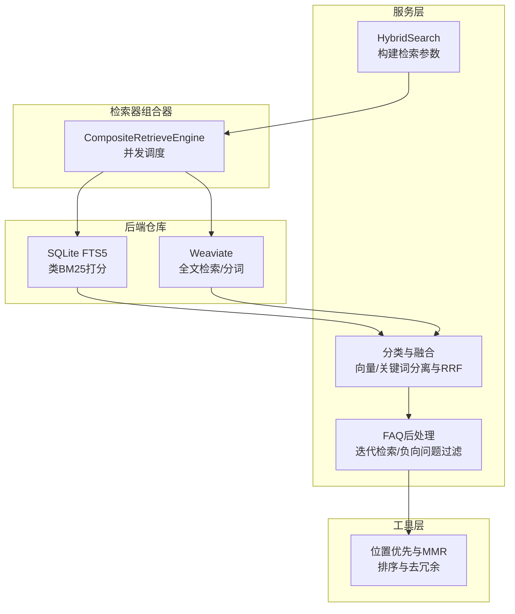
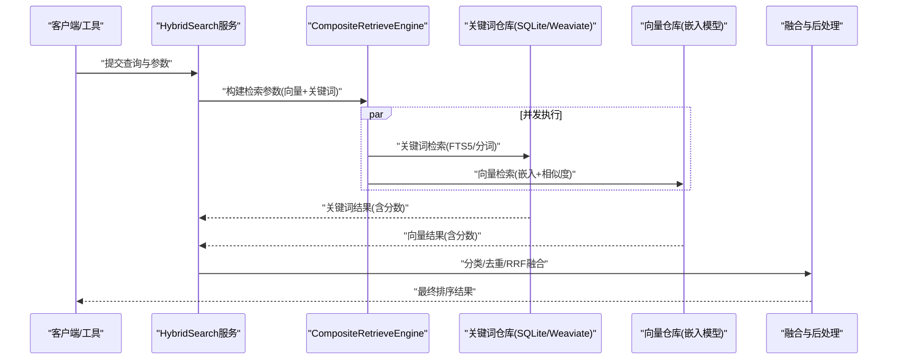
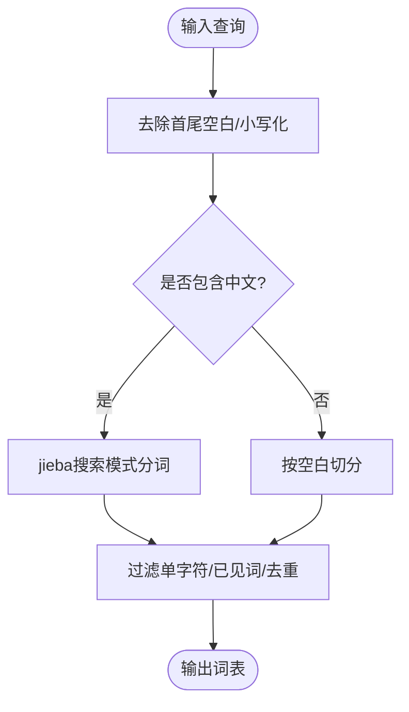
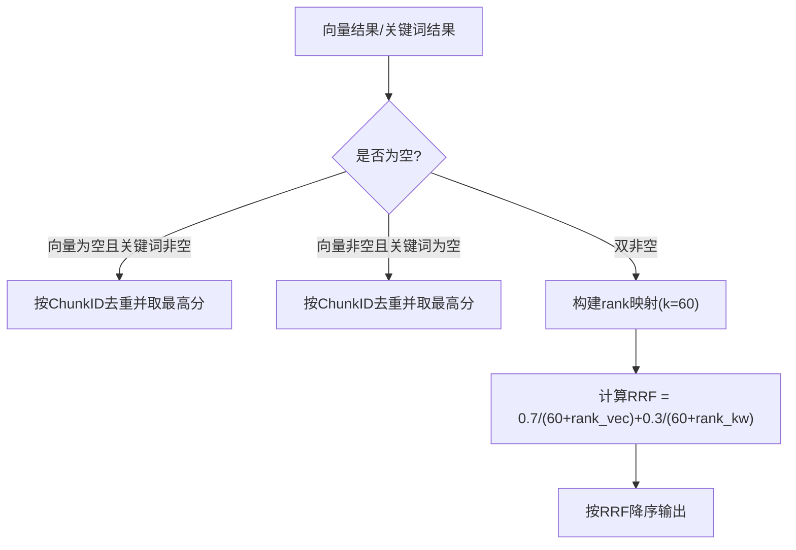
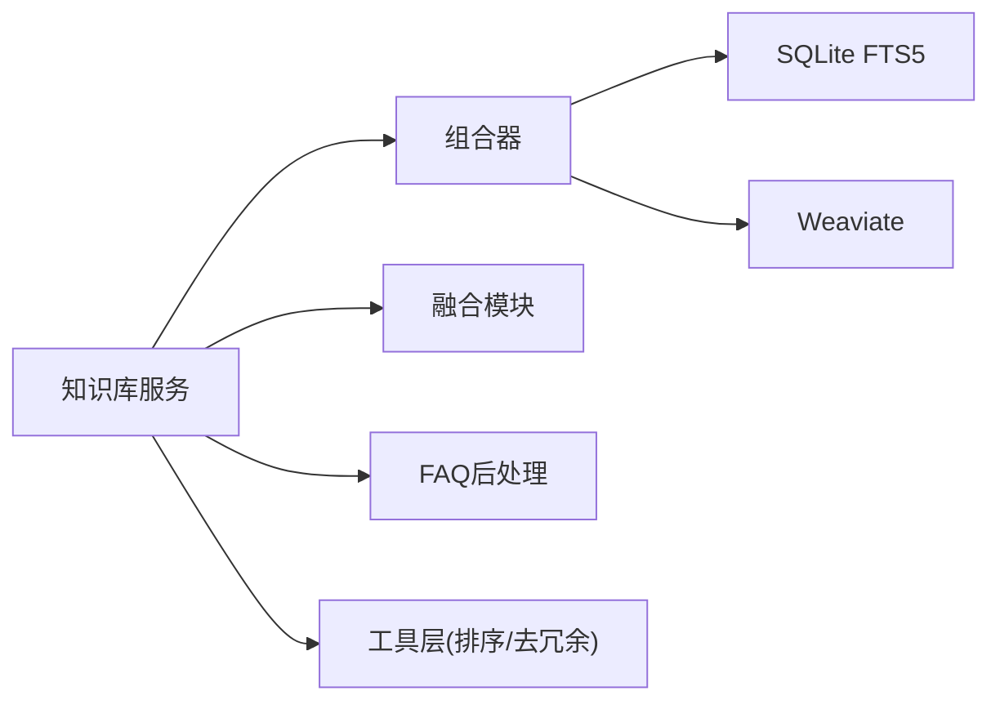

# 关键词搜索配置

<cite>
**本文引用的文件**
- [knowledgebase_search.go](file://internal/application/service/knowledgebase_search.go)
- [knowledgebase_search_fusion.go](file://internal/application/service/knowledgebase_search_fusion.go)
- [composite.go](file://internal/application/service/retriever/composite.go)
- [textutil.go](file://internal/searchutil/textutil.go)
- [normalize.go](file://internal/searchutil/normalize.go)
- [repository.go（Weaviate）](file://internal/application/repository/retriever/weaviate/repository.go)
- [repository.go（SQLite FTS5）](file://internal/application/repository/retriever/sqlite/repository.go)
- [knowledgebase_search_faq.go](file://internal/application/service/knowledgebase_search_faq.go)
- [knowledge_search.go](file://internal/agent/tools/knowledge_search.go)
- [config.yaml](file://config/config.yaml)
- [ndcg.go](file://internal/application/service/metric/ndcg.go)
- [KBIndexingStrategy.vue](file://frontend/src/views/knowledge/settings/KBIndexingStrategy.vue)
</cite>

## 目录
1. [简介](#简介)
2. [项目结构](#项目结构)
3. [核心组件](#核心组件)
4. [架构总览](#架构总览)
5. [详细组件分析](#详细组件分析)
6. [依赖分析](#依赖分析)
7. [性能考虑](#性能考虑)
8. [故障排查指南](#故障排查指南)
9. [结论](#结论)
10. [附录](#附录)

## 简介
本文件面向WeKnora关键词搜索配置系统，聚焦以下目标：
- 深入解释关键词匹配策略与文本预处理、分词技术
- 详述关键词检索与向量检索的融合机制（权重分配与结果合并）
- 提供关键词搜索的性能优化路径（倒排索引、查询优化、缓存策略）
- 给出配置参数与实际应用场景，并提供效果评估方法

在WeKnora中，关键词搜索并非直接实现BM25公式，而是通过SQLite FTS5与Weaviate等后端实现“类BM25”的打分逻辑，并结合向量检索进行混合融合。本文将从代码实现出发，给出可操作的配置建议与调优策略。

## 项目结构
WeKnora的关键词搜索能力由服务层、检索器组合器、具体检索仓库（SQLite FTS5、Weaviate）以及工具层共同构成。整体流程为：上层服务构建检索参数，组合器并发调度不同后端，后端返回带分数的结果，再由服务层进行去重、融合与后处理。

**图表来源**
- [knowledgebase_search.go:84-168](file://internal/application/service/knowledgebase_search.go#L84-L168)
- [composite.go:32-62](file://internal/application/service/retriever/composite.go#L32-L62)
- [knowledgebase_search_fusion.go:12-49](file://internal/application/service/knowledgebase_search_fusion.go#L12-L49)
- [knowledgebase_search_faq.go:50-183](file://internal/application/service/knowledgebase_search_faq.go#L50-L183)
- [repository.go（Weaviate）:1039-1064](file://internal/application/repository/retriever/weaviate/repository.go#L1039-L1064)
- [repository.go（SQLite FTS5）:320-362](file://internal/application/repository/retriever/sqlite/repository.go#L320-L362)
- [knowledge_search.go:1423-1467](file://internal/agent/tools/knowledge_search.go#L1423-L1467)

**章节来源**
- [knowledgebase_search.go:84-168](file://internal/application/service/knowledgebase_search.go#L84-L168)
- [composite.go:32-62](file://internal/application/service/retriever/composite.go#L32-L62)
- [knowledgebase_search_fusion.go:12-49](file://internal/application/service/knowledgebase_search_fusion.go#L12-L49)
- [knowledgebase_search_faq.go:50-183](file://internal/application/service/knowledgebase_search_faq.go#L50-L183)
- [repository.go（Weaviate）:1039-1064](file://internal/application/repository/retriever/weaviate/repository.go#L1039-L1064)
- [repository.go（SQLite FTS5）:320-362](file://internal/application/repository/retriever/sqlite/repository.go#L320-L362)
- [knowledge_search.go:1423-1467](file://internal/agent/tools/knowledge_search.go#L1423-L1467)

## 核心组件
- 混合检索服务：负责构建检索参数、并发触发检索、分类与融合、FAQ后处理与截断。
- 检索器组合器：按检索类型路由到具体引擎，支持并发执行与错误聚合。
- 关键词检索后端：
  - SQLite FTS5：基于全文检索表，返回类BM25的打分（经SQL转换为正数便于理解）。
  - Weaviate：使用jieba分词，支持OR查询与过滤条件。
- 文本预处理与分词：统一采用简体中文分词（搜索模式），英文按空白切分；同时提供通用TokenizeSimple与Jaccard相似度计算。
- 融合与后处理：RRF融合、去重、FAQ迭代检索与负向问题过滤、位置优先与MMR。

**章节来源**
- [knowledgebase_search.go:170-267](file://internal/application/service/knowledgebase_search.go#L170-L267)
- [composite.go:32-62](file://internal/application/service/retriever/composite.go#L32-L62)
- [textutil.go:36-63](file://internal/searchutil/textutil.go#L36-L63)
- [knowledgebase_search_fusion.go:79-141](file://internal/application/service/knowledgebase_search_fusion.go#L79-L141)
- [knowledgebase_search_faq.go:50-183](file://internal/application/service/knowledgebase_search_faq.go#L50-L183)
- [repository.go（Weaviate）:1039-1064](file://internal/application/repository/retriever/weaviate/repository.go#L1039-L1064)
- [repository.go（SQLite FTS5）:320-362](file://internal/application/repository/retriever/sqlite/repository.go#L320-L362)

## 架构总览
下图展示关键词搜索从请求到结果的端到端流程，强调关键词与向量的并行检索、融合与后处理。

**图表来源**
- [knowledgebase_search.go:84-168](file://internal/application/service/knowledgebase_search.go#L84-L168)
- [composite.go:32-62](file://internal/application/service/retriever/composite.go#L32-L62)
- [knowledgebase_search_fusion.go:12-49](file://internal/application/service/knowledgebase_search_fusion.go#L12-L49)

## 详细组件分析

### 关键词匹配策略与文本预处理
- 分词与归一化
  - 中文：使用jieba搜索模式进行分词，过滤单字符与重复词，统一转小写。
  - 英文：按空白切分，同样过滤单字符与纯标点。
  - 通用工具提供TokenizeSimple、Jaccard相似度、内容规范化与重叠比计算。
- 查询分词示例（Weaviate）
  - 对查询进行分词、去重与过滤，形成OR查询的词表。
- SQLite FTS5
  - 使用内置全文检索，返回类BM25打分（经SQL转换为正数便于理解），支持WHERE过滤与LIMIT。

**图表来源**
- [textutil.go:36-63](file://internal/searchutil/textutil.go#L36-L63)
- [repository.go（Weaviate）:1039-1064](file://internal/application/repository/retriever/weaviate/repository.go#L1039-L1064)

**章节来源**
- [textutil.go:36-63](file://internal/searchutil/textutil.go#L36-L63)
- [repository.go（Weaviate）:1039-1064](file://internal/application/repository/retriever/weaviate/repository.go#L1039-L1064)
- [repository.go（SQLite FTS5）:320-362](file://internal/application/repository/retriever/sqlite/repository.go#L320-L362)

### 关键词检索与“类BM25”打分
- SQLite FTS5
  - 返回分数为类BM25（经SQL转换为正数），支持WHERE过滤与LIMIT。
  - 结果按分数降序，满足召回与排序需求。
- Weaviate
  - 使用分词后的词表构造OR查询，结合过滤条件与排序。
- 注意：代码未直接实现经典BM25公式，而是依赖后端的全文检索与打分策略。

**章节来源**
- [repository.go（SQLite FTS5）:320-362](file://internal/application/repository/retriever/sqlite/repository.go#L320-L362)
- [repository.go（Weaviate）:1039-1064](file://internal/application/repository/retriever/weaviate/repository.go#L1039-L1064)

### 关键词与向量融合机制
- 分类与去重
  - 将检索结果按检索器类型（向量/关键词）分离。
  - 单一类型时，按ChunkID去重并保留最高分数。
- RRF融合
  - 使用Reciprocal Rank Fusion：RRF = w1/(k+rank1) + w2/(k+rank2)，默认k=60，向量权重0.7、关键词权重0.3。
  - 对每个ChunkID，取向量侧更高分数作为元数据，合并后按RRF分数降序。
- FAQ特殊处理
  - FAQ场景下保持原始分数（FAQ索引）。
  - 支持迭代检索与负向问题过滤，减少不相关结果。

**图表来源**
- [knowledgebase_search_fusion.go:31-49](file://internal/application/service/knowledgebase_search_fusion.go#L31-L49)
- [knowledgebase_search_fusion.go:79-141](file://internal/application/service/knowledgebase_search_fusion.go#L79-L141)

**章节来源**
- [knowledgebase_search_fusion.go:31-49](file://internal/application/service/knowledgebase_search_fusion.go#L31-L49)
- [knowledgebase_search_fusion.go:79-141](file://internal/application/service/knowledgebase_search_fusion.go#L79-L141)

### FAQ场景的关键词搜索增强
- 迭代检索：当首次检索不足时，逐步扩大TopK并去重合并，直至达到目标数量或无更多结果。
- 负向问题过滤：对FAQ类型的块，读取FAQ元数据中的负向问题列表，若查询命中则过滤该块。
- Chunk数据缓存：跨轮次复用已拉取的Chunk数据，降低数据库压力。

**章节来源**
- [knowledgebase_search_faq.go:50-183](file://internal/application/service/knowledgebase_search_faq.go#L50-L183)
- [knowledgebase_search_faq.go:185-249](file://internal/application/service/knowledgebase_search_faq.go#L185-L249)

### 工具层的排序与去冗余
- 位置优先：对命中片段的位置进行微调加权，靠前位置给予小幅增益。
- 复合评分：向量分数、基础分数与来源权重的加权组合，并乘以位置优先系数，最终clamp至[0,1]。
- MMR：应用最大边际相关性减少冗余，提升多样性。

**章节来源**
- [knowledge_search.go:1423-1467](file://internal/agent/tools/knowledge_search.go#L1423-L1467)

### 配置与前端策略
- 系统配置项
  - keyword_threshold、vector_threshold、embedding_top_k、rerank_top_k等影响检索阈值与召回规模。
  - enable_query_expansion、enable_rerank等开关控制检索管线行为。
- 前端索引策略
  - 知识库索引策略界面显示“向量+关键词”组合的混合检索语义，便于用户理解与配置。

**章节来源**
- [config.yaml:11-15](file://config/config.yaml#L11-L15)
- [config.yaml:19-24](file://config/config.yaml#L19-L24)
- [KBIndexingStrategy.vue:70-85](file://frontend/src/views/knowledge/settings/KBIndexingStrategy.vue#L70-L85)

## 依赖分析
- 服务层依赖
  - 检索器组合器：负责并发调度与错误聚合。
  - 具体仓库：SQLite FTS5与Weaviate分别提供关键词检索能力。
  - 工具层：提供位置优先与MMR等排序与去冗余能力。
- 耦合与内聚
  - 服务层高内聚地组织检索参数构建、融合与后处理；组合器低耦合地对接不同后端。
  - 关键词与向量的融合逻辑集中于融合模块，便于统一调参与评估。

**图表来源**
- [knowledgebase_search.go:84-168](file://internal/application/service/knowledgebase_search.go#L84-L168)
- [composite.go:32-62](file://internal/application/service/retriever/composite.go#L32-L62)
- [knowledgebase_search_fusion.go:12-49](file://internal/application/service/knowledgebase_search_fusion.go#L12-L49)
- [knowledgebase_search_faq.go:50-183](file://internal/application/service/knowledgebase_search_faq.go#L50-L183)
- [knowledge_search.go:1423-1467](file://internal/agent/tools/knowledge_search.go#L1423-L1467)

**章节来源**
- [knowledgebase_search.go:84-168](file://internal/application/service/knowledgebase_search.go#L84-L168)
- [composite.go:32-62](file://internal/application/service/retriever/composite.go#L32-L62)
- [knowledgebase_search_fusion.go:12-49](file://internal/application/service/knowledgebase_search_fusion.go#L12-L49)
- [knowledgebase_search_faq.go:50-183](file://internal/application/service/knowledgebase_search_faq.go#L50-L183)
- [knowledge_search.go:1423-1467](file://internal/agent/tools/knowledge_search.go#L1423-L1467)

## 性能考虑
- 过检索与TopK
  - 为保证融合质量，服务层采用5倍过检索（最多500），并在多KB场景按KB数量线性放大。
- 并发检索
  - 组合器并发执行不同后端的检索，显著降低端到端延迟。
- 去重与融合
  - 基于ChunkID去重与RRF融合，避免重复与冗余，提升结果质量。
- FAQ迭代检索
  - 在FAQ场景下动态扩大TopK并缓存Chunk数据，减少多次查询开销。
- 缓存与限流
  - 系统提供分布式限流与队列门控，保障高并发下的稳定性（与关键词搜索间接相关）。

**章节来源**
- [knowledgebase_search.go:113-118](file://internal/application/service/knowledgebase_search.go#L113-L118)
- [composite.go:131-165](file://internal/application/service/retriever/composite.go#L131-L165)
- [knowledgebase_search_faq.go:50-183](file://internal/application/service/knowledgebase_search_faq.go#L50-L183)

## 故障排查指南
- 无结果或结果过少
  - 检查索引策略：确认关键词索引已启用；查看前端索引策略界面。
  - 检查阈值配置：keyword_threshold、vector_threshold是否过高。
  - 检查Over-retrieval：确认MatchCount与Multi-KB场景下的TopK设置。
- 结果重复或冗余
  - 确认融合流程是否正确执行（RRF/去重）。
  - FAQ场景检查负向问题过滤是否生效。
- 分数异常
  - SQLite FTS5分数为类BM25，注意其为负值经转换为正数；Weaviate分数为后端打分。
  - 若需更精细的关键词打分，可考虑在后端层面引入自定义打分函数（当前代码未直接实现BM25公式）。

**章节来源**
- [KBIndexingStrategy.vue:70-85](file://frontend/src/views/knowledge/settings/KBIndexingStrategy.vue#L70-L85)
- [knowledgebase_search_fusion.go:31-49](file://internal/application/service/knowledgebase_search_fusion.go#L31-L49)
- [knowledgebase_search_faq.go:185-249](file://internal/application/service/knowledgebase_search_faq.go#L185-L249)
- [repository.go（SQLite FTS5）:320-362](file://internal/application/repository/retriever/sqlite/repository.go#L320-L362)

## 结论
WeKnora的关键词搜索通过“类BM25”的后端打分与向量检索的RRF融合实现高质量检索。服务层在参数构建、并发调度、去重与融合方面提供了稳健的实现；FAQ场景的迭代检索与负向问题过滤进一步提升了准确性。对于BM25参数调优，由于后端负责打分，建议通过调整后端索引策略与查询形态（如分词粒度、过滤条件）来间接影响关键词得分分布，并结合系统阈值与融合权重进行端到端调优。

## 附录

### 实际应用场景与效果评估
- 应用场景
  - 通用问答：关键词与向量混合，提升召回与相关性。
  - FAQ知识库：启用迭代检索与负向问题过滤，提高命中准确率。
  - 多知识库检索：按KB数量线性放大TopK，确保每KB的召回质量。
- 效果评估
  - 使用NDCG指标评估检索质量，支持Top-k裁剪与理想排序对比。
  - 评估任务可通过客户端接口提交与查询，获取详细的检索与生成指标。

**章节来源**
- [knowledgebase_search.go:113-118](file://internal/application/service/knowledgebase_search.go#L113-L118)
- [knowledgebase_search_faq.go:50-183](file://internal/application/service/knowledgebase_search_faq.go#L50-L183)
- [ndcg.go:19-55](file://internal/application/service/metric/ndcg.go#L19-L55)
- [client/evaluation.go:76-113](file://client/evaluation.go#L76-L113)