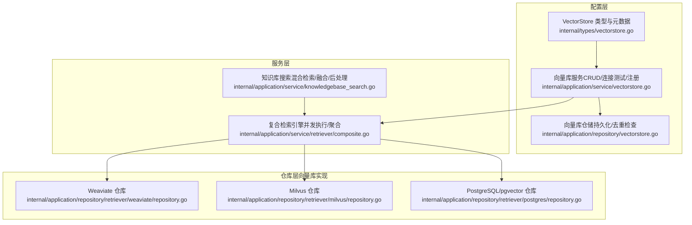
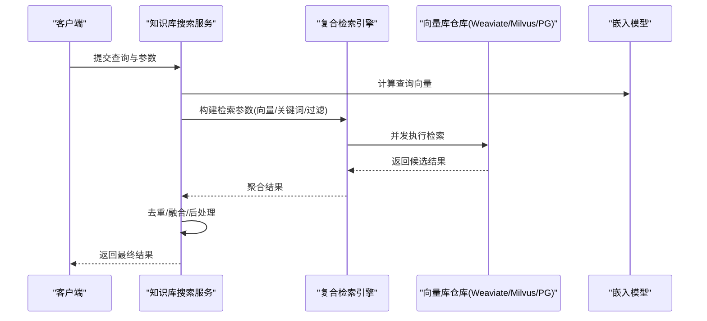
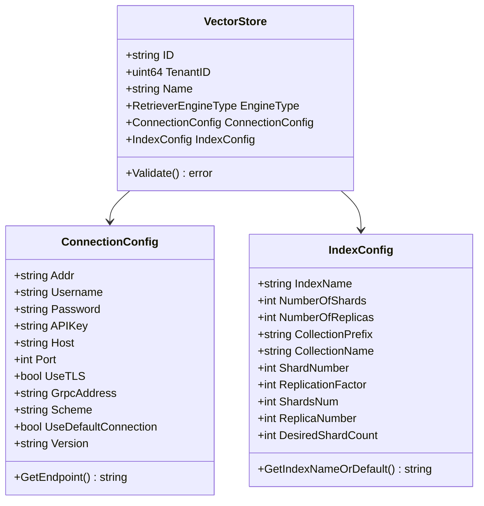
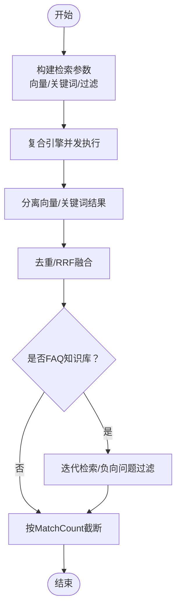
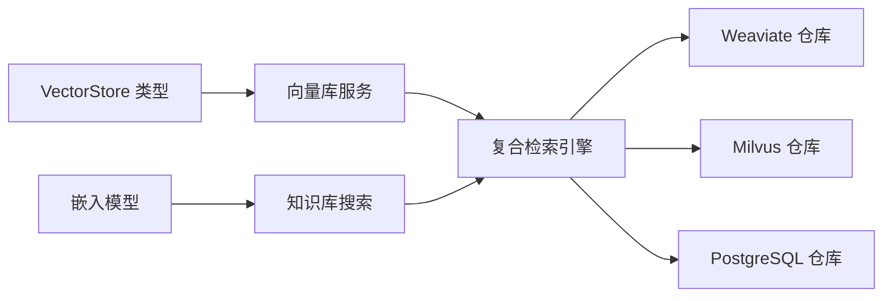

# 向量搜索配置

<cite>
**本文引用的文件**
- [internal/types/vectorstore.go](file://internal/types/vectorstore.go)
- [internal/application/service/vectorstore.go](file://internal/application/service/vectorstore.go)
- [internal/application/repository/vectorstore.go](file://internal/application/repository/vectorstore.go)
- [internal/application/service/knowledgebase_search.go](file://internal/application/service/knowledgebase_search.go)
- [internal/application/service/retriever/composite.go](file://internal/application/service/retriever/composite.go)
- [internal/application/repository/retriever/weaviate/repository.go](file://internal/application/repository/retriever/weaviate/repository.go)
- [internal/application/repository/retriever/milvus/repository.go](file://internal/application/repository/retriever/milvus/repository.go)
- [internal/application/repository/retriever/postgres/repository.go](file://internal/application/repository/retriever/postgres/repository.go)
- [internal/types/retrieval_config.go](file://internal/types/retrieval_config.go)
- [internal/types/embedding.go](file://internal/types/embedding.go)
- [internal/models/embedding/embedder.go](file://internal/models/embedding/embedder.go)
- [internal/models/embedding/openai.go](file://internal/models/embedding/openai.go)
- [internal/models/embedding/weknoracloud.go](file://internal/models/embedding/weknoracloud.go)
- [internal/application/service/metric/recall.go](file://internal/application/service/metric/recall.go)
- [internal/application/service/metric/map.go](file://internal/application/service/metric/map.go)
- [internal/application/service/metric/ndcg.go](file://internal/application/service/metric/ndcg.go)
- [internal/application/service/metric/precision.go](file://internal/application/service/metric/precision.go)
- [internal/event/usage_example.md](file://internal/event/usage_example.md)
- [docs/wiki/集成扩展/集成向量数据库.md](file://docs/wiki/集成扩展/集成向量数据库.md)
</cite>

## 目录
1. [简介](#简介)
2. [项目结构](#项目结构)
3. [核心组件](#核心组件)
4. [架构总览](#架构总览)
5. [详细组件分析](#详细组件分析)
6. [依赖分析](#依赖分析)
7. [性能考虑](#性能考虑)
8. [故障排查指南](#故障排查指南)
9. [结论](#结论)
10. [附录](#附录)

## 简介
本文件面向WeKnora向量搜索配置系统，提供从嵌入模型选择、相似度与阈值策略、查询优化到性能调优与监控的完整技术文档。内容覆盖多引擎向量库（Weaviate、Milvus、PostgreSQL/pgvector、Elasticsearch、Qdrant、SQLite）的配置要点、检索参数与融合策略，并给出实际配置案例与监控方法。

## 项目结构
WeKnora的向量搜索由“配置层（VectorStore）—服务层（知识库搜索/检索引擎）—仓库层（各向量库实现）”三层构成，支持多租户、多引擎、可插拔注册机制。

图表来源
- [internal/types/vectorstore.go:30-120](file://internal/types/vectorstore.go#L30-L120)
- [internal/application/service/vectorstore.go:36-99](file://internal/application/service/vectorstore.go#L36-L99)
- [internal/application/repository/vectorstore.go:22-101](file://internal/application/repository/vectorstore.go#L22-L101)
- [internal/application/service/knowledgebase_search.go:84-168](file://internal/application/service/knowledgebase_search.go#L84-L168)
- [internal/application/service/retriever/composite.go:26-90](file://internal/application/service/retriever/composite.go#L26-L90)
- [internal/application/repository/retriever/weaviate/repository.go:37-168](file://internal/application/repository/retriever/weaviate/repository.go#L37-L168)
- [internal/application/repository/retriever/milvus/repository.go:44-200](file://internal/application/repository/retriever/milvus/repository.go#L44-L200)
- [internal/application/repository/retriever/postgres/repository.go:318-462](file://internal/application/repository/retriever/postgres/repository.go#L318-L462)

章节来源
- [internal/types/vectorstore.go:30-120](file://internal/types/vectorstore.go#L30-L120)
- [internal/application/service/vectorstore.go:36-99](file://internal/application/service/vectorstore.go#L36-L99)
- [internal/application/repository/vectorstore.go:22-101](file://internal/application/repository/vectorstore.go#L22-L101)
- [internal/application/service/knowledgebase_search.go:84-168](file://internal/application/service/knowledgebase_search.go#L84-L168)
- [internal/application/service/retriever/composite.go:26-90](file://internal/application/service/retriever/composite.go#L26-L90)

## 核心组件
- 向量存储配置（VectorStore）：定义引擎类型、连接参数、索引配置及校验逻辑；支持环境变量注入与默认值解析。
- 检索配置（RetrievalConfig）：统一管理向量TopK、阈值、关键词阈值、重排序TopK与阈值等全局参数。
- 复合检索引擎（CompositeRetrieveEngine）：按检索类型分派到具体引擎，支持并发执行与错误聚合。
- 知识库混合检索（HybridSearch）：构建向量与关键词检索参数，执行检索并进行去重/融合/后处理。
- 各引擎仓库实现：Weaviate、Milvus、PostgreSQL/pgvector等，负责集合/索引创建、过滤、阈值与TopK处理。

章节来源
- [internal/types/vectorstore.go:30-120](file://internal/types/vectorstore.go#L30-L120)
- [internal/types/retrieval_config.go:14-27](file://internal/types/retrieval_config.go#L14-L27)
- [internal/application/service/retriever/composite.go:26-90](file://internal/application/service/retriever/composite.go#L26-L90)
- [internal/application/service/knowledgebase_search.go:84-168](file://internal/application/service/knowledgebase_search.go#L84-L168)

## 架构总览
WeKnora采用“配置即代码”的向量搜索架构：通过VectorStore定义目标向量库，服务层根据租户配置动态注册引擎，知识库搜索阶段统一构建检索参数并交由复合引擎并发执行，最终对向量与关键词结果进行融合与后处理。

图表来源
- [internal/application/service/knowledgebase_search.go:170-206](file://internal/application/service/knowledgebase_search.go#L170-L206)
- [internal/application/service/retriever/composite.go:32-62](file://internal/application/service/retriever/composite.go#L32-L62)
- [internal/application/repository/retriever/weaviate/repository.go:561-596](file://internal/application/repository/retriever/weaviate/repository.go#L561-L596)
- [internal/application/repository/retriever/milvus/repository.go:662-699](file://internal/application/repository/retriever/milvus/repository.go#L662-L699)
- [internal/application/repository/retriever/postgres/repository.go:318-462](file://internal/application/repository/retriever/postgres/repository.go#L318-L462)

## 详细组件分析

### 向量存储配置（VectorStore）
- 引擎类型与校验：支持Postgres、Elasticsearch、Qdrant、Milvus、Weaviate、SQLite，提供有效性检查与重复性检测。
- 连接配置：地址、用户名/密码、API Key、TLS开关等；敏感字段加密存储并在读取时解密。
- 索引配置：索引名/集合前缀/集合名、分片数、副本数、期望分片数等；提供默认值与环境变量回退。
- 服务端版本探测：创建时自动探测ES版本以选择正确SDK，避免协议错误。
- 环境变量注入：RETRIEVE_DRIVER支持从环境变量构建虚拟向量库，便于快速接入。

图表来源
- [internal/types/vectorstore.go:30-120](file://internal/types/vectorstore.go#L30-L120)
- [internal/types/vectorstore.go:101-197](file://internal/types/vectorstore.go#L101-L197)
- [internal/types/vectorstore.go:203-330](file://internal/types/vectorstore.go#L203-L330)

章节来源
- [internal/types/vectorstore.go:30-120](file://internal/types/vectorstore.go#L30-L120)
- [internal/types/vectorstore.go:101-197](file://internal/types/vectorstore.go#L101-L197)
- [internal/types/vectorstore.go:203-330](file://internal/types/vectorstore.go#L203-L330)
- [internal/application/service/vectorstore.go:36-99](file://internal/application/service/vectorstore.go#L36-L99)

### 检索配置（RetrievalConfig）
- 参数含义：EmbeddingTopK、VectorThreshold、KeywordThreshold、RerankTopK、RerankThreshold、RerankModelID。
- 默认值策略：未设置或非法时使用安全默认值，保证系统稳定运行。
- 存储与反序列化：以JSONB形式存储于租户配置表，支持数据库序列化/反序列化。

章节来源
- [internal/types/retrieval_config.go:14-27](file://internal/types/retrieval_config.go#L14-L27)
- [internal/types/retrieval_config.go:29-67](file://internal/types/retrieval_config.go#L29-L67)

### 复合检索引擎（CompositeRetrieveEngine）
- 分派机制：根据检索类型（向量/关键词）选择对应引擎实例。
- 并发执行：对多个检索参数并发执行，聚合结果并收集首个错误。
- 批量操作：支持批量更新chunk启用状态与标签ID，统一并发执行。

章节来源
- [internal/application/service/retriever/composite.go:26-90](file://internal/application/service/retriever/composite.go#L26-L90)
- [internal/application/service/retriever/composite.go:131-165](file://internal/application/service/retriever/composite.go#L131-L165)
- [internal/application/service/retriever/composite.go:167-197](file://internal/application/service/retriever/composite.go#L167-L197)

### 知识库混合检索（HybridSearch）
- 查询向量生成：按知识库绑定的嵌入模型计算查询向量，支持跨租户复用模型键。
- 参数构建：根据KB索引策略与引擎能力，构建向量与关键词检索参数；按KB数量与Over-retrieval策略扩大候选集。
- 结果分类与融合：分离向量/关键词结果，执行去重与RRF融合；FAQ场景支持迭代检索与负向问题过滤。
- 输出限制：最终结果按MatchCount截断。

图表来源
- [internal/application/service/knowledgebase_search.go:170-206](file://internal/application/service/knowledgebase_search.go#L170-L206)
- [internal/application/service/knowledgebase_search_fusion.go:36-71](file://internal/application/service/knowledgebase_search_fusion.go#L36-L71)
- [internal/application/service/knowledgebase_search_faq.go:50-105](file://internal/application/service/knowledgebase_search_faq.go#L50-L105)

章节来源
- [internal/application/service/knowledgebase_search.go:84-168](file://internal/application/service/knowledgebase_search.go#L84-L168)
- [internal/application/service/knowledgebase_search_fusion.go:36-71](file://internal/application/service/knowledgebase_search_fusion.go#L36-L71)
- [internal/application/service/knowledgebase_search_faq.go:50-105](file://internal/application/service/knowledgebase_search_faq.go#L50-L105)

### 向量相似度与阈值策略
- Weaviate：使用GraphQL NearVector查询，以certainty阈值过滤；集合按维度命名，支持复制因子与分片配置。
- Milvus：支持IP/COSINE/L2度量类型；使用ANN半径参数作为阈值；集合按维度命名，支持分片数与内存副本数。
- PostgreSQL/pgvector：通过HNSW ef_search与iterative_scan提升召回稳定性；阈值后处理与TopK裁剪。

章节来源
- [internal/application/repository/retriever/weaviate/repository.go:561-596](file://internal/application/repository/retriever/weaviate/repository.go#L561-L596)
- [internal/application/repository/retriever/milvus/repository.go:662-699](file://internal/application/repository/retriever/milvus/repository.go#L662-L699)
- [internal/application/repository/retriever/postgres/repository.go:318-462](file://internal/application/repository/retriever/postgres/repository.go#L318-L462)

### 嵌入模型选择与配置
- 模型接口：Embedder统一抽象Embed/BatchEmbed/维度/模型标识。
- 实现示例：OpenAI嵌入器、WeKnoraCloud远程嵌入器等。
- 选择策略：知识库绑定嵌入模型ID，跨租户可共享同一模型键以优化分组与缓存。

章节来源
- [internal/models/embedding/embedder.go:15-37](file://internal/models/embedding/embedder.go#L15-L37)
- [internal/models/embedding/openai.go:16-48](file://internal/models/embedding/openai.go#L16-L48)
- [internal/models/embedding/weknoracloud.go:125-140](file://internal/models/embedding/weknoracloud.go#L125-L140)
- [internal/application/service/knowledgebase_search.go:16-36](file://internal/application/service/knowledgebase_search.go#L16-L36)

### 向量库实现细节

#### Weaviate
- 集合命名：基于集合前缀与向量维度组合；按需创建Schema与属性索引。
- 查询：NearVector + GraphQL，以certainty阈值过滤；支持过滤条件拼装。
- 性能：复制因子与分片数可配置，影响写入并行与查询可用性。

章节来源
- [internal/application/repository/retriever/weaviate/repository.go:37-168](file://internal/application/repository/retriever/weaviate/repository.go#L37-L168)
- [internal/application/repository/retriever/weaviate/repository.go:561-596](file://internal/application/repository/retriever/weaviate/repository.go#L561-L596)

#### Milvus
- 集合命名：基于集合名与向量维度组合；自动创建Schema与索引（HNSW、BM25）。
- 查询：支持半径阈值（ANN radius），表达式过滤与模板参数；可配置分片数与内存副本数。
- 性能：分片数决定写入并行度，内存副本数决定查询HA与吞吐。

章节来源
- [internal/application/repository/retriever/milvus/repository.go:44-200](file://internal/application/repository/retriever/milvus/repository.go#L44-L200)
- [internal/application/repository/retriever/milvus/repository.go:662-699](file://internal/application/repository/retriever/milvus/repository.go#L662-L699)

#### PostgreSQL/pgvector
- 查询：HNSW ef_search与iterative_scan优化；阈值后处理与TopK裁剪。
- 性能：在不支持新GUC时回退至普通查询，保证兼容性。

章节来源
- [internal/application/repository/retriever/postgres/repository.go:318-462](file://internal/application/repository/retriever/postgres/repository.go#L318-L462)

## 依赖分析
- 配置层依赖：类型定义与校验、连接/索引配置解析与验证。
- 服务层依赖：嵌入模型服务、复合检索引擎、知识库仓储。
- 仓库层依赖：各向量库SDK、过滤表达式与阈值参数。

图表来源
- [internal/types/vectorstore.go:30-120](file://internal/types/vectorstore.go#L30-L120)
- [internal/application/service/vectorstore.go:36-99](file://internal/application/service/vectorstore.go#L36-L99)
- [internal/application/service/retriever/composite.go:26-90](file://internal/application/service/retriever/composite.go#L26-L90)
- [internal/application/service/knowledgebase_search.go:84-168](file://internal/application/service/knowledgebase_search.go#L84-L168)

章节来源
- [internal/types/vectorstore.go:30-120](file://internal/types/vectorstore.go#L30-L120)
- [internal/application/service/vectorstore.go:36-99](file://internal/application/service/vectorstore.go#L36-L99)
- [internal/application/service/retriever/composite.go:26-90](file://internal/application/service/retriever/composite.go#L26-L90)
- [internal/application/service/knowledgebase_search.go:84-168](file://internal/application/service/knowledgebase_search.go#L84-L168)

## 性能考虑
- Over-retrieval策略：为RRF与重排序预留足够候选，按KB数量与上限控制规模。
- 并发执行：复合引擎对检索参数并发执行，减少整体延迟。
- 索引与阈值：根据引擎特性合理设置TopK、阈值与索引参数，平衡准确率与吞吐。
- 回退与兼容：PostgreSQL在不支持新GUC时自动回退，确保稳定性。
- 监控与评估：内置召回率、精确率、MAP、NDCG指标，结合事件上报进行性能观测。

章节来源
- [internal/application/service/knowledgebase_search.go:113-118](file://internal/application/service/knowledgebase_search.go#L113-L118)
- [internal/application/service/retriever/composite.go:131-165](file://internal/application/service/retriever/composite.go#L131-L165)
- [internal/application/repository/retriever/postgres/repository.go:412-443](file://internal/application/repository/retriever/postgres/repository.go#L412-L443)
- [internal/application/service/metric/recall.go:15-41](file://internal/application/service/metric/recall.go#L15-L41)
- [internal/application/service/metric/precision.go:15-44](file://internal/application/service/metric/precision.go#L15-L44)
- [internal/application/service/metric/map.go:15-49](file://internal/application/service/metric/map.go#L15-L49)
- [internal/application/service/metric/ndcg.go:19-55](file://internal/application/service/metric/ndcg.go#L19-L55)

## 故障排查指南
- 连接失败：通过服务层TestConnection检测并返回服务器版本；若版本不匹配，优先修正配置或回退到受支持版本。
- 重复配置：创建前进行端点与索引名重复检查，避免同名冲突。
- 引擎不可用：复合引擎按检索类型分派，若类型不支持会返回明确错误；检查引擎Support列表与注册状态。
- 结果为空：确认阈值设置、TopK扩大策略与过滤条件；Weaviate/Milvus会记录低于阈值的告警日志。
- 事件上报：检索完成后可触发事件，携带查询、TopK、结果数与耗时，便于定位慢查询。

章节来源
- [internal/application/service/vectorstore.go:75-85](file://internal/application/service/vectorstore.go#L75-L85)
- [internal/application/repository/vectorstore.go:78-101](file://internal/application/repository/vectorstore.go#L78-L101)
- [internal/application/service/retriever/composite.go:32-62](file://internal/application/service/retriever/composite.go#L32-L62)
- [internal/application/repository/retriever/weaviate/repository.go:587-596](file://internal/application/repository/retriever/weaviate/repository.go#L587-L596)
- [internal/application/repository/retriever/milvus/repository.go:674-677](file://internal/application/repository/retriever/milvus/repository.go#L674-L677)
- [internal/event/usage_example.md:72-81](file://internal/event/usage_example.md#L72-L81)

## 结论
WeKnora的向量搜索配置体系以清晰的分层设计与可插拔架构为核心，通过统一的VectorStore配置、灵活的RetrievalConfig参数与复合检索引擎，实现了跨引擎的一致体验。结合合理的阈值与TopK策略、并发执行与融合算法，可在准确性与性能之间取得良好平衡。配合内置评估指标与事件上报，可持续优化向量搜索质量。

## 附录

### 实际配置案例
- Weaviate：设置集合前缀与复制因子/分片数，NearVector使用certainty阈值；适合高召回与强过滤场景。
- Milvus：选择合适度量类型（IP/COSINE/L2），配置半径阈值与分片/副本数；适合大规模向量检索。
- PostgreSQL/pgvector：启用HNSW ef_search与iterative_scan，结合阈值后处理；适合已有数据库环境。

章节来源
- [docs/wiki/集成扩展/集成向量数据库.md:56-78](file://docs/wiki/集成扩展/集成向量数据库.md#L56-L78)
- [internal/types/vectorstore.go:482-547](file://internal/types/vectorstore.go#L482-L547)