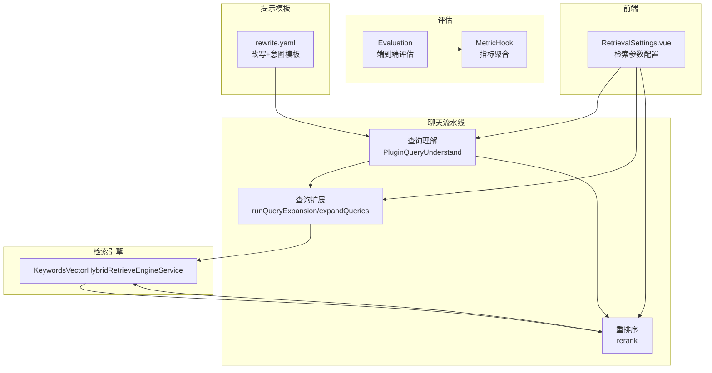
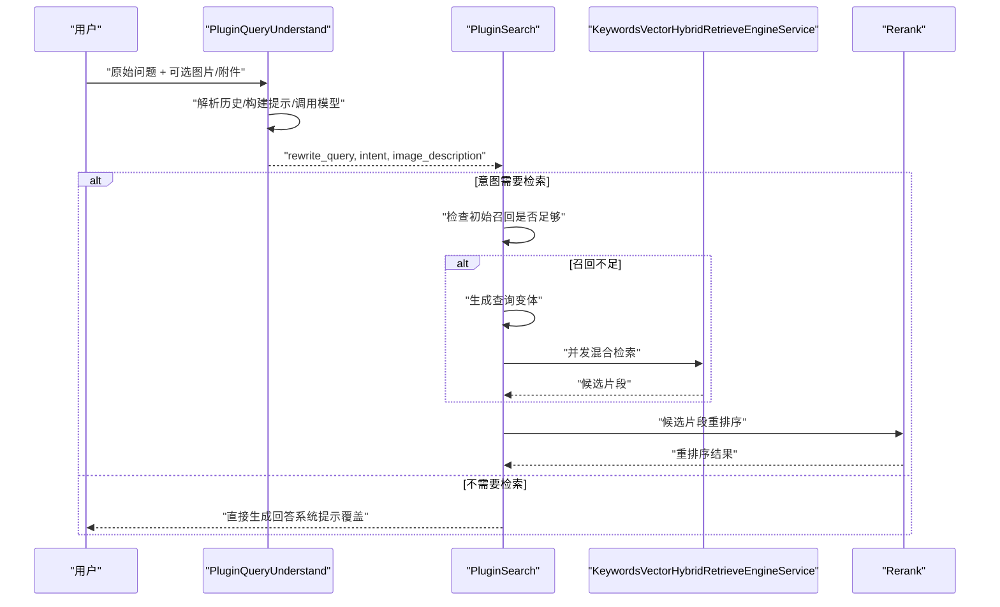
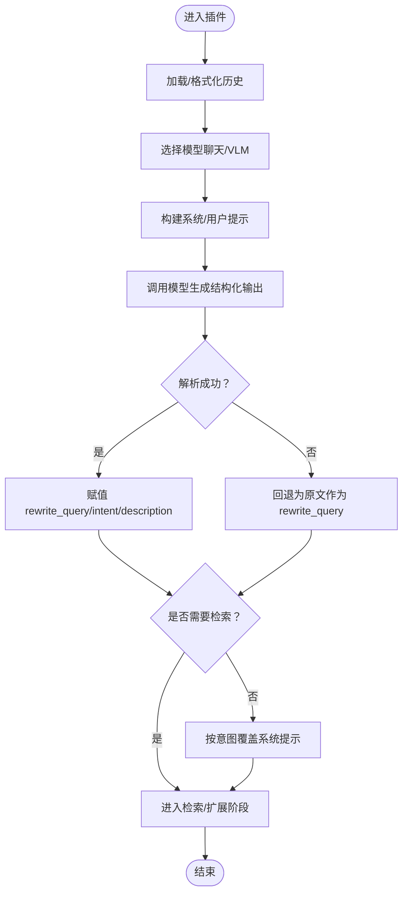
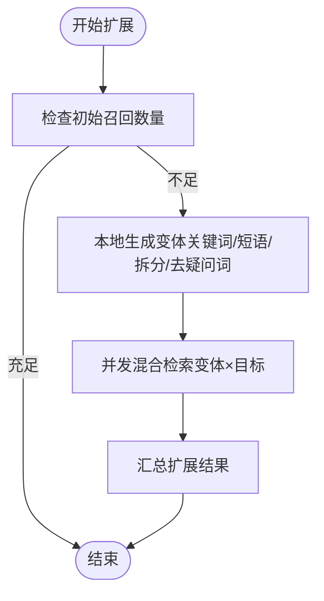
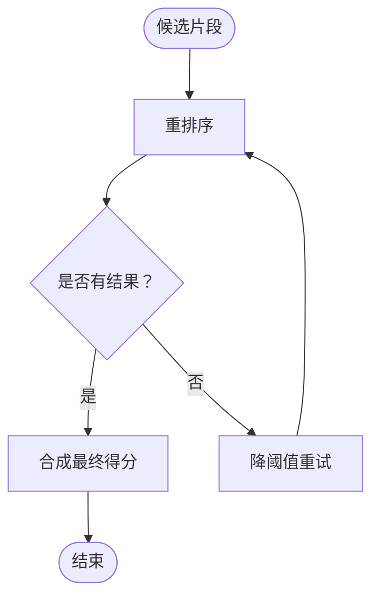
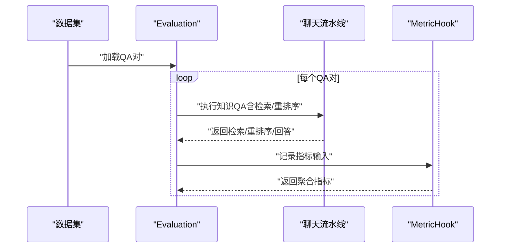
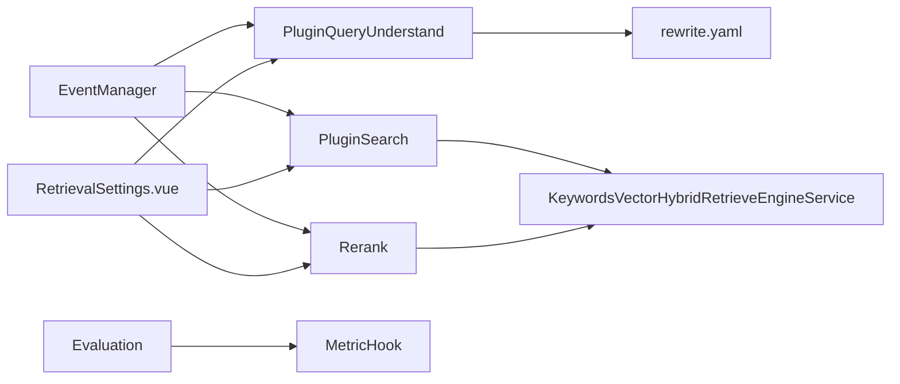

# 查询扩展与优化

<cite>
**本文引用的文件**   
- [query_expansion.go](file://internal/application/service/chat_pipeline/query_expansion.go)
- [query_understand.go](file://internal/application/service/chat_pipeline/query_understand.go)
- [rewrite.yaml](file://config/prompt_templates/rewrite.yaml)
- [chat_pipeline.go](file://internal/application/service/chat_pipeline/chat_pipeline.go)
- [metric_hook.go](file://internal/application/service/metric_hook.go)
- [evaluation.go](file://internal/application/service/evaluation.go)
- [evaluation.go（类型定义）](file://internal/types/evaluation.go)
- [keywords_vector_hybrid_indexer.go](file://internal/application/service/retriever/keywords_vector_hybrid_indexer.go)
- [rerank.go](file://internal/application/service/chat_pipeline/rerank.go)
- [RetrievalSettings.vue](file://frontend/src/views/settings/RetrievalSettings.vue)
- [agent.md](file://docs/api/agent.md)
</cite>

## 目录
1. [简介](#简介)
2. [项目结构](#项目结构)
3. [核心组件](#核心组件)
4. [架构总览](#架构总览)
5. [详细组件分析](#详细组件分析)
6. [依赖分析](#依赖分析)
7. [性能考量](#性能考量)
8. [故障排查指南](#故障排查指南)
9. [结论](#结论)
10. [附录](#附录)

## 简介
本技术文档聚焦 WeKnora 的“查询扩展与优化”能力，系统性阐述以下方面：
- 查询扩展算法：本地关键词扩展、短语提取、分段拆分与停用词/疑问词处理等轻量策略，以及在召回不足时触发的并发扩展检索。
- 查询优化策略：基于对话历史的查询改写与意图识别，支持文本+图像的多模态理解，以及系统提示词覆盖。
- 多轮对话上下文：历史轮次加载、改写后的独立问题构造、意图驱动的后续处理路径。
- 查询质量评估：检索指标（召回、NDCG、MRR、MAP）、生成指标（BLEU、ROUGE），以及端到端评估流水线。
- 实战应用与效果：结合前端检索参数配置与后端阈值策略，给出可落地的优化建议与案例。

## 项目结构
WeKnora 的查询扩展与优化主要分布在如下模块：
- 聊天流水线插件：查询理解（改写+意图）、查询扩展（低召回时触发）、重排序（rerank）。
- 提示模板：标准化的改写与意图分类提示，约束输出格式与关键规则。
- 检索引擎：关键词与向量混合检索，支撑召回阶段的双通道检索。
- 评估体系：指标钩子与评估任务，量化查询质量与优化收益。
- 前端配置：检索参数可视化与动态调整入口。

**图表来源**
- [query_understand.go:19-208](file://internal/application/service/chat_pipeline/query_understand.go#L19-L208)
- [query_expansion.go:13-100](file://internal/application/service/chat_pipeline/query_expansion.go#L13-L100)
- [rerank.go:115-153](file://internal/application/service/chat_pipeline/rerank.go#L115-L153)
- [rewrite.yaml:20-115](file://config/prompt_templates/rewrite.yaml#L20-L115)
- [keywords_vector_hybrid_indexer.go:16-36](file://internal/application/service/retriever/keywords_vector_hybrid_indexer.go#L16-L36)
- [metric_hook.go:84-147](file://internal/application/service/metric_hook.go#L84-L147)
- [evaluation.go:396-432](file://internal/application/service/evaluation.go#L396-L432)
- [RetrievalSettings.vue:73-119](file://frontend/src/views/settings/RetrievalSettings.vue#L73-L119)

**章节来源**
- [chat_pipeline.go:9-78](file://internal/application/service/chat_pipeline/chat_pipeline.go#L9-L78)

## 核心组件
- 查询理解（改写+意图识别）
  - 基于对话历史与提示模板，对用户输入进行消解与改写，输出“rewrite_query”“intent”“image_description”，并可按意图覆盖系统提示。
  - 支持纯文本与多模态（VLM）两种路径，自动选择具备视觉能力的模型。
- 查询扩展
  - 在初始召回不足时，生成若干查询变体（关键词、引号短语、长段落拆分、去疑问词等），并发执行混合检索以扩大命中。
- 重排序
  - 对候选片段进行重排序，若初次阈值无结果则自动降阈值重试，保证稳定性。
- 检索引擎
  - 关键词与向量混合检索，支持向量相似度与关键词匹配双通道，便于在不同场景下取得更好召回。
- 评估体系
  - 指标钩子记录检索与生成阶段关键指标，评估任务串联端到端流程，形成闭环优化。

**章节来源**
- [query_understand.go:19-208](file://internal/application/service/chat_pipeline/query_understand.go#L19-L208)
- [query_expansion.go:13-100](file://internal/application/service/chat_pipeline/query_expansion.go#L13-L100)
- [rerank.go:115-153](file://internal/application/service/chat_pipeline/rerank.go#L115-L153)
- [keywords_vector_hybrid_indexer.go:16-36](file://internal/application/service/retriever/keywords_vector_hybrid_indexer.go#L16-L36)
- [metric_hook.go:84-147](file://internal/application/service/metric_hook.go#L84-L147)
- [evaluation.go:396-432](file://internal/application/service/evaluation.go#L396-L432)

## 架构总览
查询扩展与优化在聊天流水线中以事件驱动的方式串联多个插件，形成“理解—扩展—检索—重排序”的主干链路，并通过评估体系持续反馈优化。

**图表来源**
- [query_understand.go:61-208](file://internal/application/service/chat_pipeline/query_understand.go#L61-L208)
- [query_expansion.go:15-100](file://internal/application/service/chat_pipeline/query_expansion.go#L15-L100)
- [rerank.go:115-153](file://internal/application/service/chat_pipeline/rerank.go#L115-L153)
- [keywords_vector_hybrid_indexer.go:36-120](file://internal/application/service/retriever/keywords_vector_hybrid_indexer.go#L36-L120)

## 详细组件分析

### 组件一：查询理解（改写与意图识别）
- 功能要点
  - 加载并格式化对话历史，限制轮次上限，避免过长历史影响模型效率。
  - 自动选择模型：优先具备视觉能力的聊天模型，否则回退到专用视觉语言模型（VLM）。
  - 构建系统/用户提示，注入当前时间、语言、历史、附件/图片状态等上下文。
  - 结构化输出解析：从 JSON 中抽取 rewrite_query、intent、image_description，必要时容忍 Markdown 包裹或多余文本。
  - 意图覆盖：当不需要检索时，按意图动态覆盖系统提示，指导后续回答风格。
- 多模态支持
  - 当存在图片时，触发图片分析进度事件，异步持久化 OCR/视觉描述，供后续轮次复用。
- 输出形态
  - rewrite_query：改写后的独立问题，适合作为检索关键词。
  - intent：greeting/summarize/web_search/kb_search/clarification/follow_up/image_only/doc_only/chitchat 等。
  - image_description：图片内容与 OCR 的合并描述（若存在）。

**图表来源**
- [query_understand.go:61-208](file://internal/application/service/chat_pipeline/query_understand.go#L61-L208)
- [rewrite.yaml:20-115](file://config/prompt_templates/rewrite.yaml#L20-L115)

**章节来源**
- [query_understand.go:19-208](file://internal/application/service/chat_pipeline/query_understand.go#L19-L208)
- [rewrite.yaml:20-115](file://config/prompt_templates/rewrite.yaml#L20-L115)

### 组件二：查询扩展（低召回时的本地变体生成与并发检索）
- 触发条件
  - 初始检索命中数量低于 EmbeddingTopK 阈值时启动扩展。
- 扩展策略（本地生成，无需 LLM）
  - 去停用词仅保留关键词，形成关键词短语。
  - 提取引号包裹的短语与关键片段。
  - 按常见标点/空格拆分为多段，取较长段落作为变体。
  - 去除中文疑问词前缀，减少口语化干扰。
  - 去重与长度过滤，最多产出 5 个变体。
- 并发检索
  - 对每个变体与每个搜索目标（知识库/知识条目）并发执行混合检索，控制并发上限，记录命中统计。
  - 将扩展新增的候选统一纳入后续合并与重排序。

**图表来源**
- [query_expansion.go:13-100](file://internal/application/service/chat_pipeline/query_expansion.go#L13-L100)

**章节来源**
- [query_expansion.go:13-100](file://internal/application/service/chat_pipeline/query_expansion.go#L13-L100)

### 组件三：重排序与阈值降级
- 流程
  - 对候选片段执行重排序，记录模型响应数量与样本打分。
  - 若初次阈值无结果，则自动降低阈值重试一次，恢复原阈值，保证稳定性。
- 影响
  - 在低召回场景下提升命中率，同时保留原始阈值的可控性。

**图表来源**
- [rerank.go:115-153](file://internal/application/service/chat_pipeline/rerank.go#L115-L153)

**章节来源**
- [rerank.go:115-153](file://internal/application/service/chat_pipeline/rerank.go#L115-L153)

### 组件四：检索引擎（关键词与向量混合）
- 能力
  - 支持关键词与向量双通道检索，可估计存储占用、复制索引、删除索引等。
- 作用
  - 为查询扩展与重排序提供稳定的底层检索能力，兼顾语义与精确匹配。

**章节来源**
- [keywords_vector_hybrid_indexer.go:16-36](file://internal/application/service/retriever/keywords_vector_hybrid_indexer.go#L16-L36)

### 组件五：评估与指标（检索与生成）
- 指标钩子
  - 记录每轮 QA 的检索结果、重排序结果与生成内容，计算平均指标（如召回、NDCG、MRR、MAP、BLEU、ROUGE）。
- 评估任务
  - 读取 QA 数据集，逐条运行知识问答流水线，记录指标并更新评估状态。
- 指标定义
  - 检索指标：Recall、NDCG@3、NDCG@10、MRR、MAP。
  - 生成指标：BLEU-1/2/4、ROUGE-1/2/L。

**图表来源**
- [evaluation.go:396-432](file://internal/application/service/evaluation.go#L396-L432)
- [metric_hook.go:84-147](file://internal/application/service/metric_hook.go#L84-L147)
- [evaluation.go（类型定义）:68-99](file://internal/types/evaluation.go#L68-L99)

**章节来源**
- [metric_hook.go:84-147](file://internal/application/service/metric_hook.go#L84-L147)
- [evaluation.go:396-432](file://internal/application/service/evaluation.go#L396-L432)
- [evaluation.go（类型定义）:68-99](file://internal/types/evaluation.go#L68-L99)

## 依赖分析
- 插件注册与事件链
  - 事件管理器负责插件注册与链式调用，确保查询理解、扩展、重排序等按序执行。
- 模型选择与提示模板
  - 查询理解依赖提示模板与模型服务，根据输入类型（文本/图片）选择合适模型。
- 检索与重排序
  - 查询扩展与重排序均依赖混合检索引擎与重排序模型，形成“召回—精排”的闭环。
- 评估与前端配置
  - 前端提供检索参数可视化（embedding_top_k、keyword_threshold、vector_threshold、rerank_top_k、rerank_threshold），后端据此调整阈值与TopK，评估体系贯穿全流程。

**图表来源**
- [chat_pipeline.go:24-78](file://internal/application/service/chat_pipeline/chat_pipeline.go#L24-L78)
- [query_understand.go:38-49](file://internal/application/service/chat_pipeline/query_understand.go#L38-L49)
- [query_expansion.go:13-100](file://internal/application/service/chat_pipeline/query_expansion.go#L13-L100)
- [rerank.go:115-153](file://internal/application/service/chat_pipeline/rerank.go#L115-L153)
- [rewrite.yaml:20-115](file://config/prompt_templates/rewrite.yaml#L20-L115)
- [keywords_vector_hybrid_indexer.go:16-36](file://internal/application/service/retriever/keywords_vector_hybrid_indexer.go#L16-L36)
- [RetrievalSettings.vue:73-119](file://frontend/src/views/settings/RetrievalSettings.vue#L73-L119)
- [evaluation.go:396-432](file://internal/application/service/evaluation.go#L396-L432)
- [metric_hook.go:84-147](file://internal/application/service/metric_hook.go#L84-L147)

**章节来源**
- [chat_pipeline.go:24-78](file://internal/application/service/chat_pipeline/chat_pipeline.go#L24-L78)
- [rewrite.yaml:20-115](file://config/prompt_templates/rewrite.yaml#L20-L115)
- [RetrievalSettings.vue:73-119](file://frontend/src/views/settings/RetrievalSettings.vue#L73-L119)
- [evaluation.go:396-432](file://internal/application/service/evaluation.go#L396-L432)

## 性能考量
- 并发控制
  - 查询扩展采用信号量控制并发作业数，避免过度并发导致资源争用。
- 阈值降级
  - 重排序阶段在无命中时自动降阈值重试，提高稳定性，同时记录降级日志便于观测。
- 去重与长度过滤
  - 扩展变体生成阶段进行去重与最小长度过滤，减少无效检索。
- 前端参数联动
  - embedding_top_k、rerank_top_k、keyword_threshold、vector_threshold 等参数直接影响召回与重排序效果，应结合业务场景与硬件资源进行权衡。

**章节来源**
- [query_expansion.go:31-47](file://internal/application/service/chat_pipeline/query_expansion.go#L31-L47)
- [rerank.go:115-130](file://internal/application/service/chat_pipeline/rerank.go#L115-L130)
- [RetrievalSettings.vue:73-119](file://frontend/src/views/settings/RetrievalSettings.vue#L73-L119)
- [agent.md:488-496](file://docs/api/agent.md#L488-L496)

## 故障排查指南
- 查询理解失败
  - 现象：无法获取模型、提示模板解析失败、历史拉取异常。
  - 排查：确认模型可用性与权限、检查提示模板语法、核对历史轮次与消息存储。
- 查询扩展无结果
  - 现象：扩展变体生成但未命中。
  - 排查：检查关键词提取与停用词表、确认并发上限与目标范围、核对阈值设置。
- 重排序无结果或效果差
  - 现象：阈值过高导致无命中或命中质量不高。
  - 排查：启用阈值降级日志、适当降低 rerank_threshold 或增加 rerank_top_k。
- 评估指标异常
  - 现象：召回/NDCG/MRR/ MAP偏低或生成指标不达标。
  - 排查：对比评估前后版本的阈值与TopK变化，检查检索与重排序链路是否被正确记录。

**章节来源**
- [query_understand.go:96-162](file://internal/application/service/chat_pipeline/query_understand.go#L96-L162)
- [query_expansion.go:68-92](file://internal/application/service/chat_pipeline/query_expansion.go#L68-L92)
- [rerank.go:115-130](file://internal/application/service/chat_pipeline/rerank.go#L115-L130)
- [metric_hook.go:84-147](file://internal/application/service/metric_hook.go#L84-L147)

## 结论
WeKnora 的查询扩展与优化通过“查询理解—查询扩展—混合检索—重排序”的流水线，实现了对多轮对话、多模态输入与复杂意图的稳健支持。本地化的查询变体生成与并发检索显著提升了召回覆盖率，而阈值降级与指标评估保障了系统的鲁棒性与可迭代性。结合前端检索参数的可视化配置，可在不同业务场景下快速调优，获得稳定且可量化的查询质量提升。

## 附录
- 实战应用与效果提升案例（示例思路）
  - 场景一：FAQ 与术语一致性
    - 通过查询理解将“RAG 是什么”改写为“RAG架构定义”，意图识别为 kb_search，配合关键词与向量混合检索，提升术语检索命中。
  - 场景二：多轮追问
    - 历史中出现“RAG 和传统搜索的区别”，后续问题“它和向量检索的关系”经核心消解后变为“RAG架构与向量检索的关系”，意图仍为 kb_search，扩展检索覆盖更多相关文档。
  - 场景三：图片辅助检索
    - 用户上传架构图并问“知识库有类似文件吗”，意图识别为 kb_search，图像分析生成描述，扩展检索命中相关架构类文档。
  - 场景四：阈值与TopK调优
    - 面向召回不足的领域，适度提高 embedding_top_k 与 rerank_top_k，降低 keyword_threshold/vector_threshold，观察 NDCG/MRR 提升与延迟变化，找到平衡点。