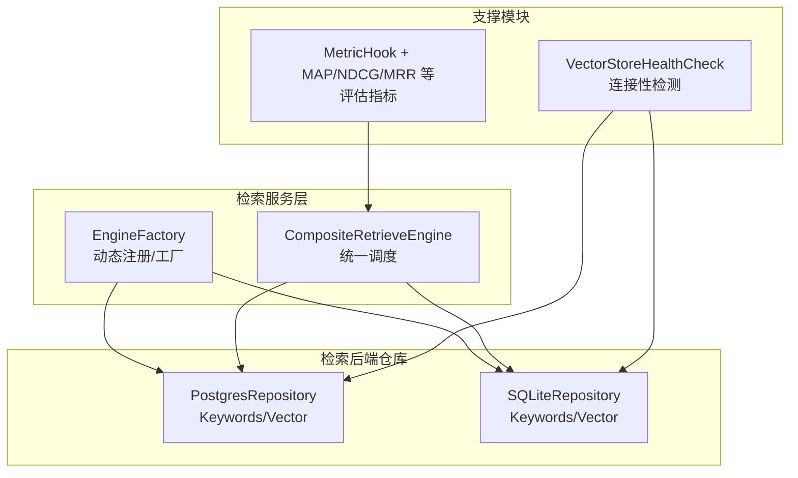
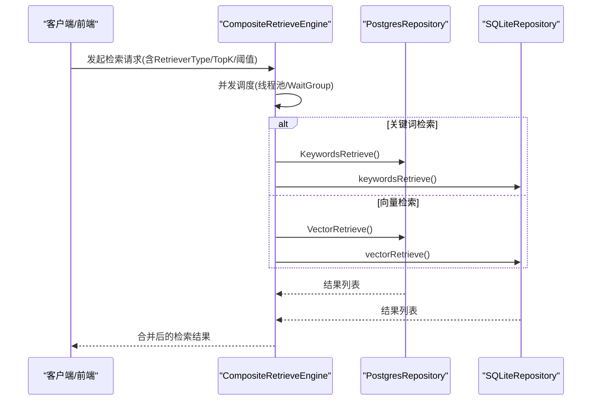
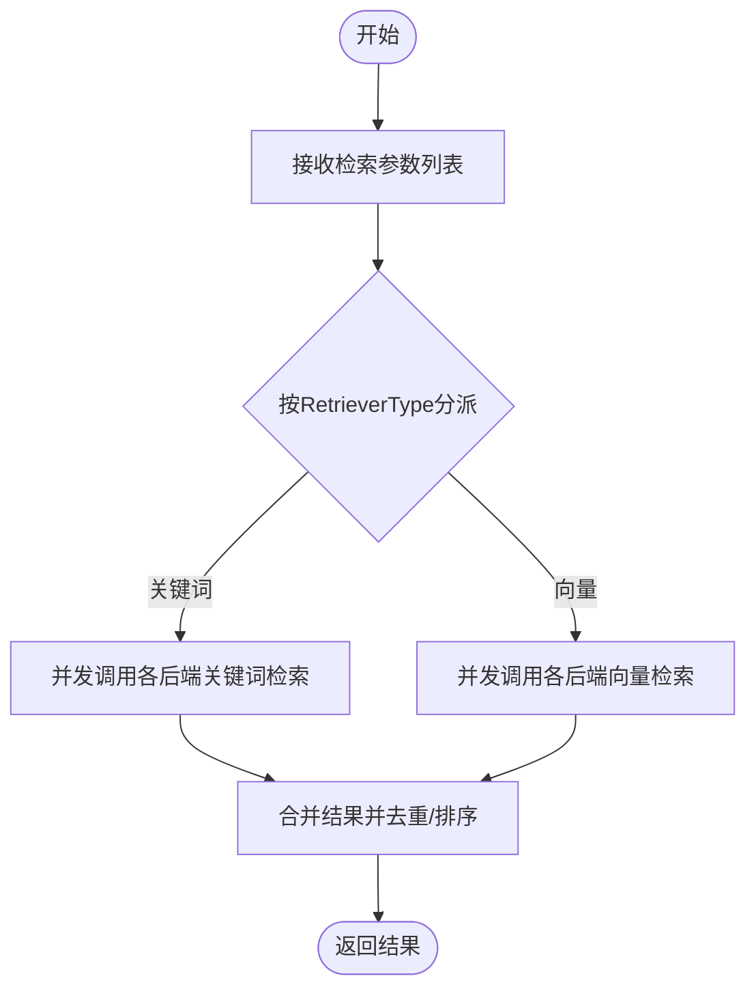
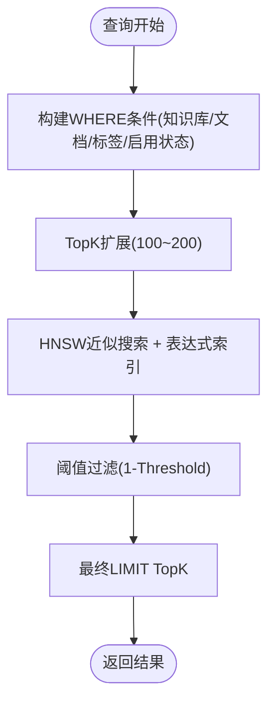
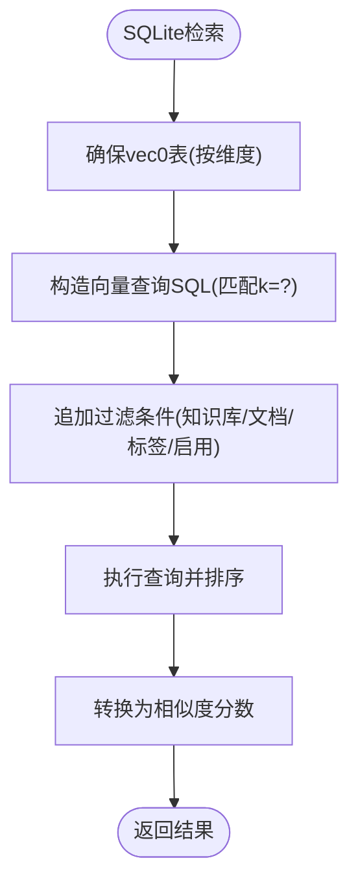
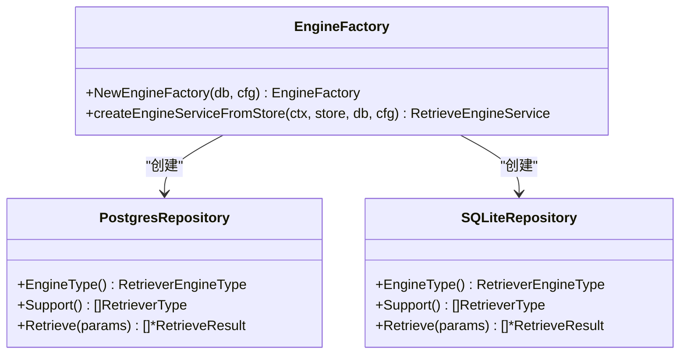
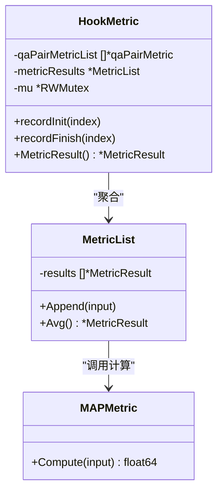
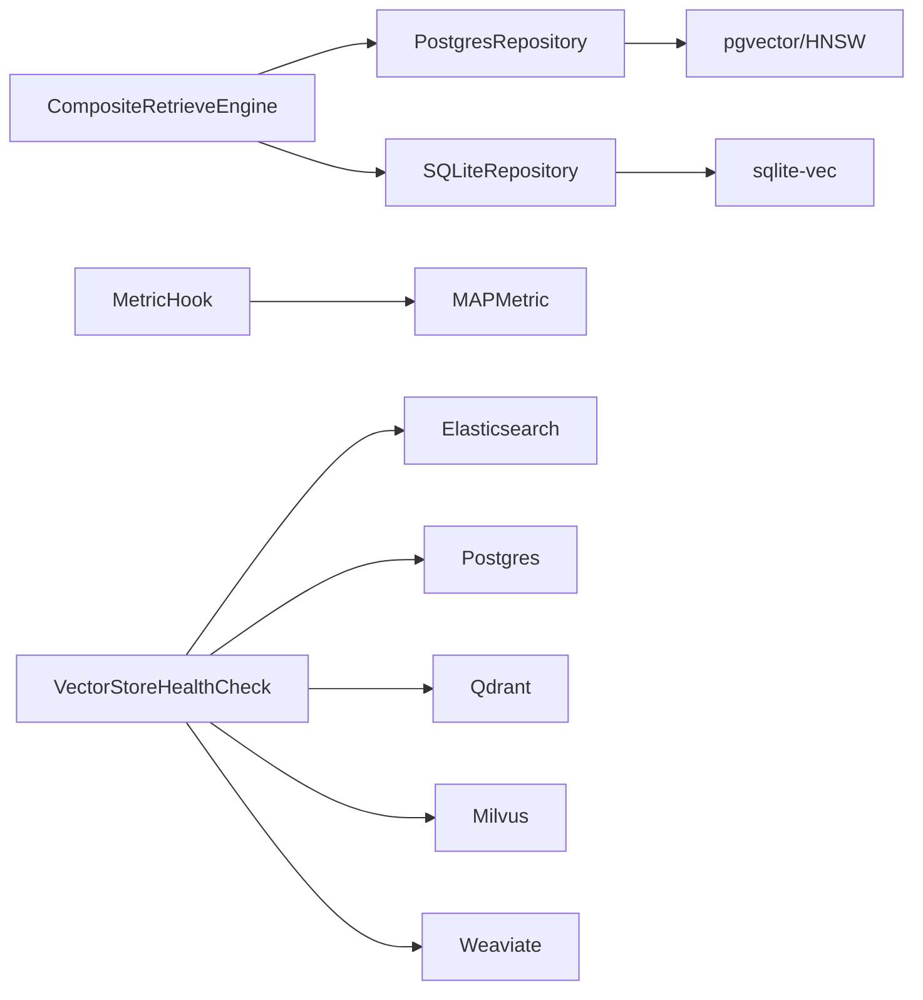

# 检索性能调优

<cite>
**本文引用的文件**
- [engine_factory.go](file://internal/container/engine_factory.go)
- [composite.go](file://internal/application/service/retriever/composite.go)
- [postgres_repository.go](file://internal/application/repository/retriever/postgres/repository.go)
- [sqlite_repository.go](file://internal/application/repository/retriever/sqlite/repository.go)
- [indexing_strategy.go](file://internal/types/indexing_strategy.go)
- [vectorstore_healthcheck.go](file://internal/application/service/vectorstore_healthcheck.go)
- [metric_hook.go](file://internal/application/service/metric_hook.go)
- [map.go](file://internal/application/service/metric/map.go)
- [evaluation.go](file://client/evaluation.go)
</cite>

## 目录
1. [简介](#简介)
2. [项目结构](#项目结构)
3. [核心组件](#核心组件)
4. [架构总览](#架构总览)
5. [详细组件分析](#详细组件分析)
6. [依赖分析](#依赖分析)
7. [性能考虑](#性能考虑)
8. [故障排除指南](#故障排除指南)
9. [结论](#结论)
10. [附录](#附录)

## 简介
本文件面向WeKnora检索性能调优系统，聚焦于索引优化、查询优化与缓存策略，以及并发控制、资源管理与负载均衡的实现机制。文档同时覆盖多后端（PostgreSQL/ParadeDB、SQLite/vec、Elasticsearch、Qdrant、Milvus、Weaviate）的性能特征与优化要点，并给出性能监控指标、基准测试与容量规划的最佳实践，以及针对不同规模数据集的调优方案与故障排除建议。

## 项目结构
WeKnora的检索子系统采用“复合引擎 + 多后端仓库”的架构：通过复合引擎统一调度多个检索后端，每个后端以独立仓库实现具体能力；同时提供健康检查、评估与指标聚合等支撑模块。

图表来源
- [engine_factory.go:34-60](file://internal/container/engine_factory.go#L34-L60)
- [composite.go:26-90](file://internal/application/service/retriever/composite.go#L26-L90)
- [postgres_repository.go:19-38](file://internal/application/repository/retriever/postgres/repository.go#L19-L38)
- [sqlite_repository.go:38-41](file://internal/application/repository/retriever/sqlite/repository.go#L38-L41)
- [vectorstore_healthcheck.go:25-50](file://internal/application/service/vectorstore_healthcheck.go#L25-L50)
- [metric_hook.go:18-50](file://internal/application/service/metric_hook.go#L18-L50)

章节来源
- [engine_factory.go:34-60](file://internal/container/engine_factory.go#L34-L60)
- [composite.go:26-90](file://internal/application/service/retriever/composite.go#L26-L90)
- [postgres_repository.go:19-38](file://internal/application/repository/retriever/postgres/repository.go#L19-L38)
- [sqlite_repository.go:38-41](file://internal/application/repository/retriever/sqlite/repository.go#L38-L41)
- [vectorstore_healthcheck.go:25-50](file://internal/application/service/vectorstore_healthcheck.go#L25-L50)
- [metric_hook.go:18-50](file://internal/application/service/metric_hook.go#L18-L50)

## 核心组件
- 复合检索引擎：负责并发执行检索、批量索引、删除与复制等操作，支持多后端并行与错误聚合。
- 引擎工厂：基于配置动态创建具体检索引擎实例，支持从数据库存储中加载后端配置。
- 后端仓库：
  - PostgreSQL/ParadeDB：关键词检索（FTS）、向量检索（HNSW + 半精度向量），具备阈值过滤与迭代扫描优化。
  - SQLite/vec：关键词检索（FTS5，大词元分词与BM25打分）、向量检索（vec0，余弦距离）。
- 指标与评估：提供检索与生成类指标（Precision/Recall/NDCG/MRR/MAP/BLEU/ROUGE），并支持批量平均。
- 健康检查：对各后端进行连通性与版本探测，辅助运维与容量规划。

章节来源
- [composite.go:26-336](file://internal/application/service/retriever/composite.go#L26-L336)
- [engine_factory.go:34-60](file://internal/container/engine_factory.go#L34-L60)
- [postgres_repository.go:163-483](file://internal/application/repository/retriever/postgres/repository.go#L163-L483)
- [sqlite_repository.go:298-467](file://internal/application/repository/retriever/sqlite/repository.go#L298-L467)
- [indexing_strategy.go:34-77](file://internal/types/indexing_strategy.go#L34-L77)
- [metric_hook.go:18-167](file://internal/application/service/metric_hook.go#L18-L167)
- [vectorstore_healthcheck.go:25-229](file://internal/application/service/vectorstore_healthcheck.go#L25-L229)

## 架构总览
检索系统通过复合引擎统一编排，依据检索类型与参数选择合适的后端执行；PostgreSQL/ParadeDB侧重高吞吐与高召回场景，SQLite/vec适合轻量与单机部署；评估模块贯穿检索链路，提供可量化的质量反馈。

图表来源
- [composite.go:32-62](file://internal/application/service/retriever/composite.go#L32-L62)
- [postgres_repository.go:163-261](file://internal/application/repository/retriever/postgres/repository.go#L163-L261)
- [sqlite_repository.go:298-375](file://internal/application/repository/retriever/sqlite/repository.go#L298-L375)

## 详细组件分析

### 复合检索引擎（CompositeRetrieveEngine）
- 并发执行：对检索参数与批量操作采用goroutine并发执行，配合WaitGroup与错误通道聚合，确保快速收敛与错误早发现。
- 动态路由：根据RetrieverType选择对应后端，避免无效调用。
- 批量优化：在索引与删除等操作上进行去重与分批处理，降低数据库压力。
- 存储估算：提供跨后端的存储占用估算，辅助容量规划。

图表来源
- [composite.go:32-62](file://internal/application/service/retriever/composite.go#L32-L62)
- [composite.go:131-165](file://internal/application/service/retriever/composite.go#L131-L165)
- [composite.go:167-197](file://internal/application/service/retriever/composite.go#L167-L197)

章节来源
- [composite.go:26-336](file://internal/application/service/retriever/composite.go#L26-L336)

### PostgreSQL/ParadeDB 向量检索优化
- HNSW索引与半精度向量：使用halfvec存储向量，结合表达式索引embedding::halfvec(dim) halfvec_cosine_ops，严格匹配ORDER BY表达式以避免回退到顺序扫描。
- TopK扩展与阈值过滤：先扩大候选数（100~200之间），再应用阈值过滤，平衡召回与性能。
- GUC优化：在事务内设置hnsw.ef_search与hnsw.iterative_scan，提升选择性过滤下的召回稳定性。
- 存储估算：内容长度 + 向量大小（半精度2字节/维度） + 元数据 + HNSW索引开销（约2倍向量大小）。

图表来源
- [postgres_repository.go:343-398](file://internal/application/repository/retriever/postgres/repository.go#L343-L398)
- [postgres_repository.go:412-443](file://internal/application/repository/retriever/postgres/repository.go#L412-L443)
- [postgres_repository.go:40-61](file://internal/application/repository/retriever/postgres/repository.go#L40-L61)

章节来源
- [postgres_repository.go:263-483](file://internal/application/repository/retriever/postgres/repository.go#L263-L483)
- [postgres_repository.go:40-61](file://internal/application/repository/retriever/postgres/repository.go#L40-L61)

### SQLite/vec 向量检索优化
- vec0虚拟表：按维度创建独立表，避免混合维度带来的索引失效。
- k=?约束：sqlite-vec要求k参数，确保查询计划稳定。
- 过滤与排序：先过滤再按距离排序，必要时显式ORDER BY保证一致性。
- FTS5 BM25：关键词检索采用FTS5与BM25打分，支持CJK大词元分词。

图表来源
- [sqlite_repository.go:376-467](file://internal/application/repository/retriever/sqlite/repository.go#L376-L467)
- [sqlite_repository.go:108-126](file://internal/application/repository/retriever/sqlite/repository.go#L108-L126)

章节来源
- [sqlite_repository.go:298-467](file://internal/application/repository/retriever/sqlite/repository.go#L298-L467)

### 引擎工厂与动态注册
- 工厂函数：根据VectorStore配置创建具体引擎实例，支持Postgres、Elasticsearch、Qdrant、Milvus、Weaviate、SQLite等类型。
- 注册更新：通过容器注入的工厂与注册表，支持运行时动态切换与更新后端配置。

图表来源
- [engine_factory.go:34-60](file://internal/container/engine_factory.go#L34-L60)
- [postgres_repository.go:30-38](file://internal/application/repository/retriever/postgres/repository.go#L30-L38)
- [sqlite_repository.go:136-142](file://internal/application/repository/retriever/sqlite/repository.go#L136-L142)

章节来源
- [engine_factory.go:34-60](file://internal/container/engine_factory.go#L34-L60)

### 指标与评估体系
- 检索指标：Precision、Recall、NDCG@3/10、MRR、MAP，用于衡量检索质量。
- 生成指标：BLEU-1/2/4、ROUGE-1/2/L，用于衡量生成质量。
- 聚合与线程安全：支持批量计算与平均值统计，内部使用互斥锁保护。

图表来源
- [metric_hook.go:13-82](file://internal/application/service/metric_hook.go#L13-L82)
- [metric_hook.go:84-167](file://internal/application/service/metric_hook.go#L84-L167)
- [map.go:7-71](file://internal/application/service/metric/map.go#L7-L71)

章节来源
- [metric_hook.go:18-167](file://internal/application/service/metric_hook.go#L18-L167)
- [map.go:15-71](file://internal/application/service/metric/map.go#L15-L71)

### 健康检查与运维
- 连接性检测：对Elasticsearch、Postgres、Qdrant、Milvus、Weaviate等后端分别进行连通性与版本探测。
- 返回版本信息：便于运维确认后端版本兼容性与特性可用性。

章节来源
- [vectorstore_healthcheck.go:25-229](file://internal/application/service/vectorstore_healthcheck.go#L25-L229)

## 依赖分析
- 组件耦合：复合引擎与后端仓库通过接口解耦，工厂负责实例化；指标模块与检索链路弱耦合，仅在评估阶段参与。
- 并发与同步：复合引擎广泛使用WaitGroup与错误通道，确保并发安全与快速失败；指标模块使用读写锁保障多协程写入安全。
- 外部依赖：PostgreSQL/ParadeDB依赖pgvector/HNSW；SQLite依赖sqlite-vec；各云/开源向量库通过官方SDK接入。

图表来源
- [composite.go:26-336](file://internal/application/service/retriever/composite.go#L26-L336)
- [postgres_repository.go:19-38](file://internal/application/repository/retriever/postgres/repository.go#L19-L38)
- [sqlite_repository.go:38-41](file://internal/application/repository/retriever/sqlite/repository.go#L38-L41)
- [metric_hook.go:18-50](file://internal/application/service/metric_hook.go#L18-L50)
- [vectorstore_healthcheck.go:25-229](file://internal/application/service/vectorstore_healthcheck.go#L25-L229)

## 性能考虑
- 索引优化
  - PostgreSQL/ParadeDB：确保表达式索引embedding::halfvec(dim) halfvec_cosine_ops与ORDER BY一致；合理设置hnsw.ef_search与hnsw.iterative_scan；按维度拆分向量表或保持维度一致以避免索引失效。
  - SQLite/vec：按维度创建vec0表，查询时确保k=?；关键词检索使用FTS5与BM25，结合CJK大词元分词提升召回。
- 查询优化
  - TopK扩展策略：在选择性过滤前扩大候选数（100~200），再阈值过滤，避免HNSW ef_search过大导致回退顺序扫描。
  - 过滤条件：尽量使用索引列（知识库ID、文档ID、标签ID、启用状态）减少回表与全表扫描。
- 缓存策略
  - 结果缓存：对高频查询（如常见FAQ）可引入应用层缓存；注意缓存失效与一致性。
  - 向量预计算：批量索引时使用ON CONFLICT DO NOTHING避免重复写入。
- 并发控制
  - 复合引擎使用WaitGroup与错误通道聚合，避免单点阻塞；批量操作应分批提交，防止长事务。
  - 指标计算使用读写锁，避免高并发写入造成竞争。
- 资源管理
  - 存储估算：PostgreSQL按内容长度 + 向量大小（半精度） + 元数据 + HNSW索引开销估算；SQLite按内容长度 + 固定元数据估算。
  - 连接池：Postgres/ParadeDB建议使用连接池与超时控制；远程向量库建议复用客户端连接。
- 负载均衡
  - 多后端并行：复合引擎对不同后端并行检索，提升整体吞吐；可根据后端性能与数据规模分配权重。
  - 分片与副本：大规模场景下可按知识库ID哈希分片，或在向量库侧配置副本与分片。

## 故障排除指南
- PostgreSQL/ParadeDB
  - 现象：查询回退到顺序扫描或性能骤降
  - 排查：确认表达式索引是否匹配embedding::halfvec(dim)，ORDER BY是否一致；检查hnsw.ef_search与hnsw.iterative_scan是否生效；验证WHERE条件是否使用索引列。
  - 参考路径
    - [postgres_repository.go:361-393](file://internal/application/repository/retriever/postgres/repository.go#L361-L393)
    - [postgres_repository.go:412-443](file://internal/application/repository/retriever/postgres/repository.go#L412-L443)
- SQLite/vec
  - 现象：向量查询无结果或报错
  - 排查：确认已按维度创建vec0表；查询SQL需包含k=?；检查过滤条件与启用状态；必要时显式ORDER BY。
  - 参考路径
    - [sqlite_repository.go:376-467](file://internal/application/repository/retriever/sqlite/repository.go#L376-L467)
- 连接性问题
  - 使用健康检查接口探测后端连通性与版本，定位认证、网络与服务就绪问题。
  - 参考路径
    - [vectorstore_healthcheck.go:25-229](file://internal/application/service/vectorstore_healthcheck.go#L25-L229)
- 评估与指标异常
  - 现象：指标为空或异常
  - 排查：确认评估任务完成、Ground Truth与预测ID正确；检查指标聚合逻辑与线程安全。
  - 参考路径
    - [metric_hook.go:108-167](file://internal/application/service/metric_hook.go#L108-L167)
    - [map.go:15-71](file://internal/application/service/metric/map.go#L15-L71)

## 结论
WeKnora的检索系统通过复合引擎与多后端并行，结合PostgreSQL/ParadeDB与SQLite/vec的各自优势，在不同规模与场景下实现高效检索。通过表达式索引、TopK扩展、阈值过滤与迭代扫描等策略，显著提升向量检索性能；通过FTS5与BM25优化关键词检索；通过健康检查与指标体系保障系统可观测性与可维护性。建议在生产环境中结合容量规划与基准测试，持续优化索引与查询策略，并完善缓存与负载均衡机制。

## 附录
- 基准测试建议
  - 场景：不同TopK、阈值、过滤条件组合；不同维度与数据规模。
  - 指标：P95/P99延迟、吞吐、召回率、MAP/NDCG/MRR。
  - 工具：压测脚本模拟真实查询分布；结合Prometheus/Grafana采集系统指标。
- 容量规划
  - PostgreSQL：按内容长度 + 向量大小（半精度） + 元数据 + HNSW索引开销估算；预留20%~30%冗余。
  - SQLite：按内容长度 + 固定元数据估算；关注vec0表数量与磁盘IO。
- 不同规模数据集的调优方案
  - 小规模（单机/本地）：优先SQLite/vec，简化部署；关键词检索使用FTS5 + BM25。
  - 中等规模（多租户/多知识库）：PostgreSQL/ParadeDB + HNSW，合理设置TopK扩展与阈值；开启迭代扫描。
  - 大规模（多副本/分片）：向量库侧分片/副本；复合引擎多后端并行；引入应用层缓存与限流。