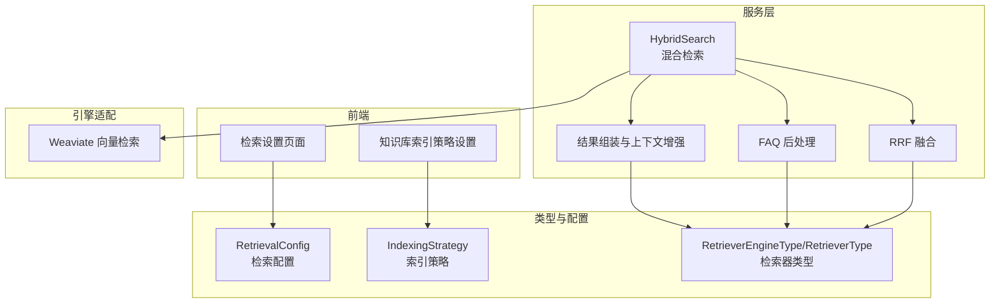
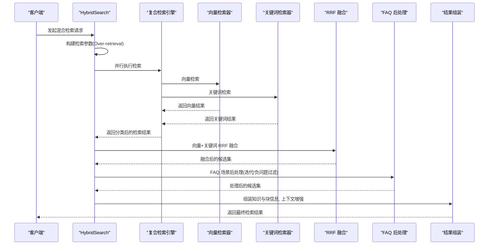
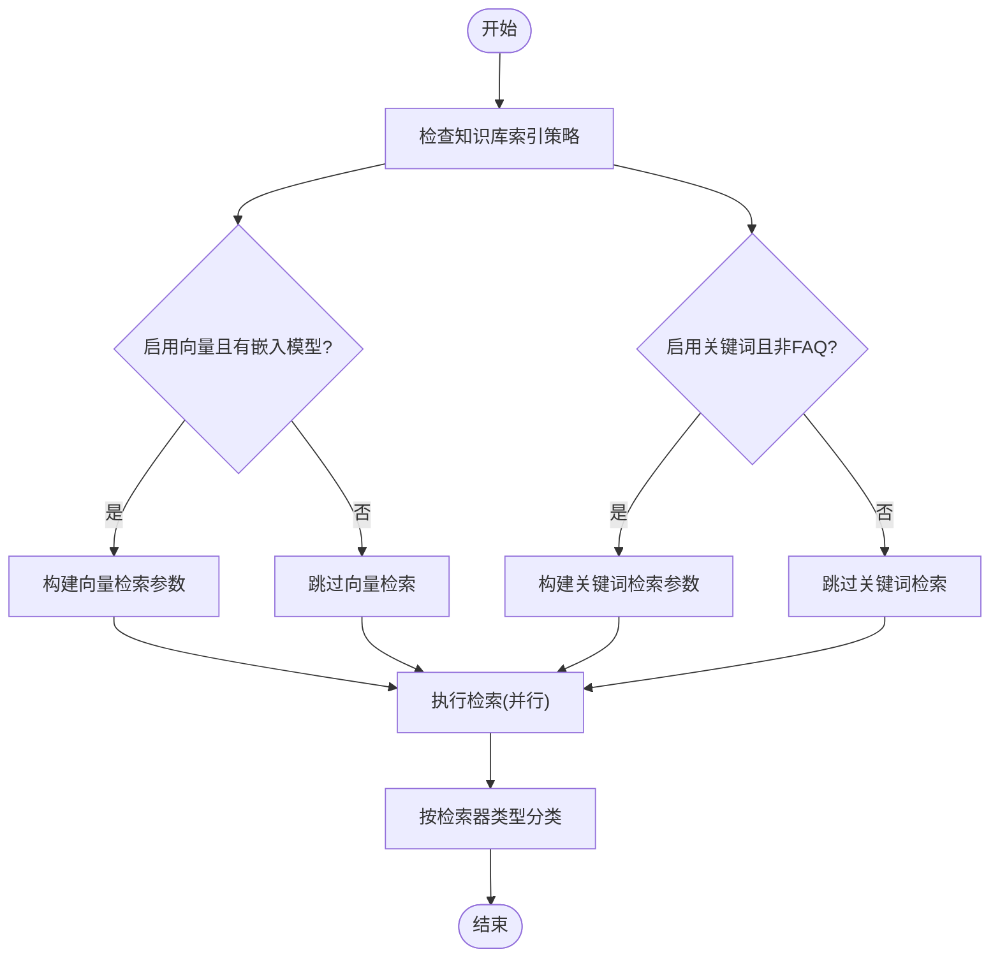
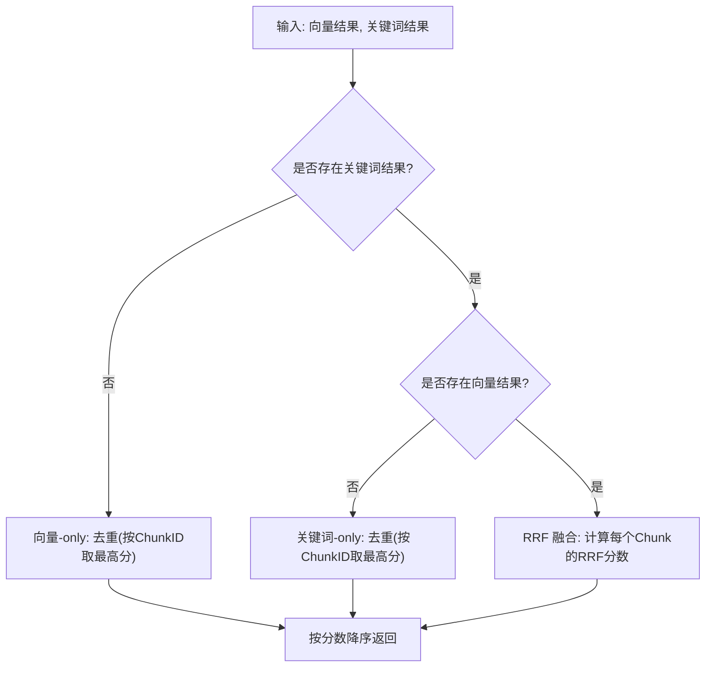
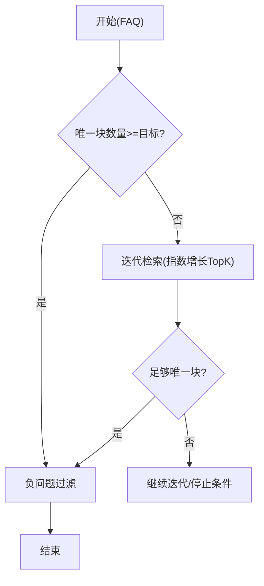
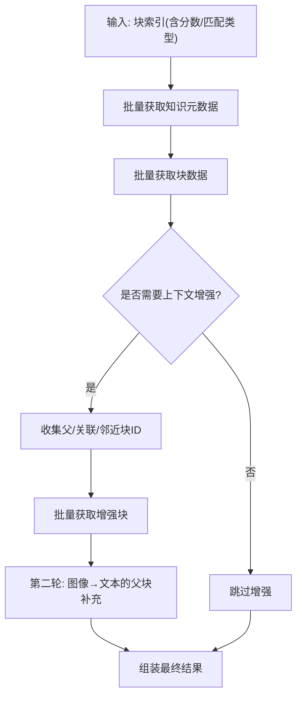
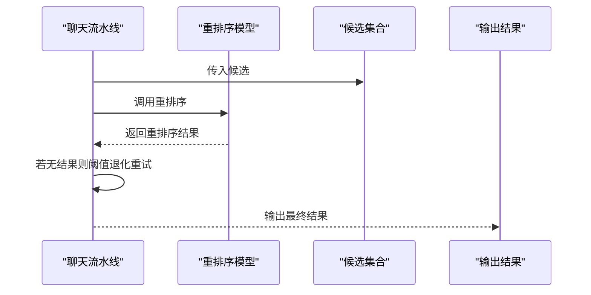
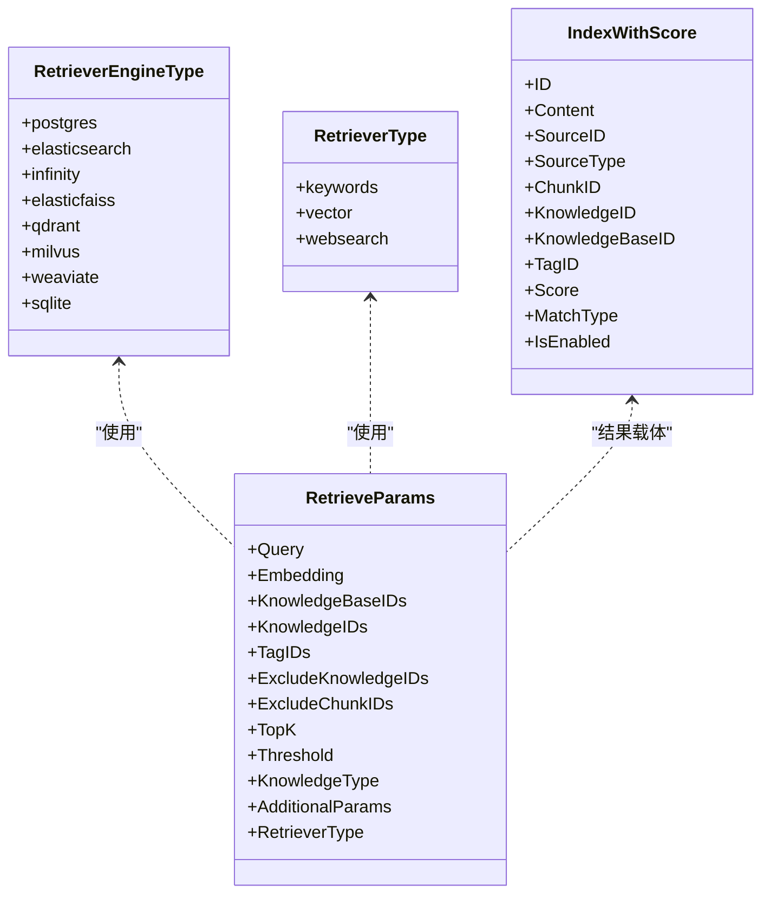
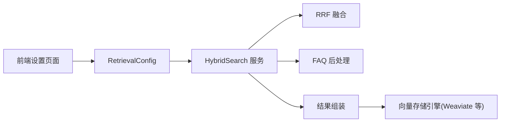

# 检索策略配置

<cite>
**本文引用的文件**
- [internal/application/service/knowledgebase_search.go](file://internal/application/service/knowledgebase_search.go)
- [internal/application/service/knowledgebase_search_fusion.go](file://internal/application/service/knowledgebase_search_fusion.go)
- [internal/application/service/knowledgebase_search_faq.go](file://internal/application/service/knowledgebase_search_faq.go)
- [internal/application/service/knowledgebase_search_results.go](file://internal/application/service/knowledgebase_search_results.go)
- [internal/types/retrieval_config.go](file://internal/types/retrieval_config.go)
- [internal/types/retriever.go](file://internal/types/retriever.go)
- [internal/types/vectorstore.go](file://internal/types/vectorstore.go)
- [internal/types/indexing_strategy.go](file://internal/types/indexing_strategy.go)
- [frontend/src/views/settings/RetrievalSettings.vue](file://frontend/src/views/settings/RetrievalSettings.vue)
- [frontend/src/i18n/locales/zh-CN.ts](file://frontend/src/i18n/locales/zh-CN.ts)
- [frontend/src/views/knowledge/settings/KBIndexingStrategy.vue](file://frontend/src/views/knowledge/settings/KBIndexingStrategy.vue)
- [internal/application/repository/retriever/weaviate/repository.go](file://internal/application/repository/retriever/weaviate/repository.go)
- [docs/swagger.json](file://docs/swagger.json)
- [docs/docs.go](file://docs/docs.go)
- [internal/agent/tools/knowledge_search.go](file://internal/agent/tools/knowledge_search.go)
- [internal/application/service/chat_pipeline/rerank.go](file://internal/application/service/chat_pipeline/rerank.go)
</cite>

## 目录
1. [简介](#简介)
2. [项目结构](#项目结构)
3. [核心组件](#核心组件)
4. [架构总览](#架构总览)
5. [详细组件分析](#详细组件分析)
6. [依赖分析](#依赖分析)
7. [性能考量](#性能考量)
8. [故障排查指南](#故障排查指南)
9. [结论](#结论)
10. [附录](#附录)

## 简介
本文件面向数据工程师与系统管理员，系统化阐述 WeKnora 的检索策略配置体系，涵盖索引策略配置、向量搜索与关键词搜索的组合使用、检索管道设计、查询扩展与重排序、融合算法实现原理，并给出不同策略的适用场景、性能特征、配置参数与优化建议。同时提供监控、调试与故障排除指南，帮助在生产环境中稳定高效地运行检索系统。

## 项目结构
WeKnora 的检索能力由“服务层”“类型定义”“前端配置界面”“向量存储引擎适配”等模块协同完成。关键路径如下：
- 服务层：知识库混合检索、结果后处理、FAQ 专用流程、结果组装与上下文增强
- 类型定义：检索参数、融合与重排序配置、向量存储引擎类型与字段
- 前端：检索配置项可视化、索引策略开关
- 引擎适配：各向量存储引擎的查询实现（如 Weaviate）

**图表来源**
- [internal/application/service/knowledgebase_search.go:84-168](file://internal/application/service/knowledgebase_search.go#L84-L168)
- [internal/application/service/knowledgebase_search_fusion.go:12-49](file://internal/application/service/knowledgebase_search_fusion.go#L12-L49)
- [internal/application/service/knowledgebase_search_faq.go:13-48](file://internal/application/service/knowledgebase_search_faq.go#L13-L48)
- [internal/application/service/knowledgebase_search_results.go:13-91](file://internal/application/service/knowledgebase_search_results.go#L13-L91)
- [internal/types/retrieval_config.go:8-27](file://internal/types/retrieval_config.go#L8-L27)
- [internal/types/retriever.go:3-26](file://internal/types/retriever.go#L3-L26)
- [internal/types/indexing_strategy.go:34-52](file://internal/types/indexing_strategy.go#L34-L52)
- [frontend/src/views/settings/RetrievalSettings.vue:1-119](file://frontend/src/views/settings/RetrievalSettings.vue#L1-L119)
- [frontend/src/views/knowledge/settings/KBIndexingStrategy.vue:70-85](file://frontend/src/views/knowledge/settings/KBIndexingStrategy.vue#L70-L85)
- [internal/application/repository/retriever/weaviate/repository.go:561-596](file://internal/application/repository/retriever/weaviate/repository.go#L561-L596)

**章节来源**
- [internal/application/service/knowledgebase_search.go:84-168](file://internal/application/service/knowledgebase_search.go#L84-L168)
- [internal/application/service/knowledgebase_search_fusion.go:12-49](file://internal/application/service/knowledgebase_search_fusion.go#L12-L49)
- [internal/application/service/knowledgebase_search_results.go:13-91](file://internal/application/service/knowledgebase_search_results.go#L13-L91)
- [internal/types/retrieval_config.go:8-27](file://internal/types/retrieval_config.go#L8-L27)
- [internal/types/retriever.go:3-26](file://internal/types/retriever.go#L3-L26)
- [internal/types/indexing_strategy.go:34-52](file://internal/types/indexing_strategy.go#L34-L52)
- [frontend/src/views/settings/RetrievalSettings.vue:1-119](file://frontend/src/views/settings/RetrievalSettings.vue#L1-L119)
- [frontend/src/views/knowledge/settings/KBIndexingStrategy.vue:70-85](file://frontend/src/views/knowledge/settings/KBIndexingStrategy.vue#L70-L85)
- [internal/application/repository/retriever/weaviate/repository.go:561-596](file://internal/application/repository/retriever/weaviate/repository.go#L561-L596)

## 核心组件
- 混合检索服务：负责构建向量与关键词检索参数、执行检索、分类与融合、FAQ 后处理、结果组装与上下文增强
- 融合与重排序：基于 RRF 的向量与关键词融合；支持重排序模型对候选进行二次打分
- 检索配置：全局检索参数（EmbeddingTopK、VectorThreshold、KeywordThreshold、RerankTopK、RerankThreshold、RerankModelID）
- 引擎类型与参数：统一的检索器类型枚举与检索参数结构体
- 索引策略：控制向量、关键词、Wiki、图谱等索引管线的启用状态
- 前端配置：可视化设置检索阈值与 TopK，以及索引策略开关

**章节来源**
- [internal/application/service/knowledgebase_search.go:84-168](file://internal/application/service/knowledgebase_search.go#L84-L168)
- [internal/application/service/knowledgebase_search_fusion.go:12-49](file://internal/application/service/knowledgebase_search_fusion.go#L12-L49)
- [internal/application/service/knowledgebase_search_results.go:13-91](file://internal/application/service/knowledgebase_search_results.go#L13-L91)
- [internal/types/retrieval_config.go:8-27](file://internal/types/retrieval_config.go#L8-L27)
- [internal/types/retriever.go:28-54](file://internal/types/retriever.go#L28-L54)
- [internal/types/indexing_strategy.go:34-52](file://internal/types/indexing_strategy.go#L34-L52)
- [frontend/src/views/settings/RetrievalSettings.vue:1-119](file://frontend/src/views/settings/RetrievalSettings.vue#L1-L119)

## 架构总览
WeKnora 的检索系统采用“混合检索 + 结果后处理”的架构。其核心流程包括：
- 参数构建：根据知识库类型与索引策略，决定是否启用向量或关键词检索，并计算 Over-retrieval 的 TopK
- 执行检索：通过复合检索引擎并行执行向量与关键词检索
- 分类与融合：按检索器类型分离结果，若仅有单一类型则去重，若双通道均有则使用 RRF 融合
- FAQ 后处理：针对 FAQ 场景进行迭代检索或负问题过滤
- 结果组装：批量获取知识与块信息，按需补充父块、关联块、邻近块，最终输出可直接用于回答生成的检索结果

**图表来源**
- [internal/application/service/knowledgebase_search.go:84-168](file://internal/application/service/knowledgebase_search.go#L84-L168)
- [internal/application/service/knowledgebase_search_fusion.go:12-49](file://internal/application/service/knowledgebase_search_fusion.go#L12-L49)
- [internal/application/service/knowledgebase_search_faq.go:13-48](file://internal/application/service/knowledgebase_search_faq.go#L13-L48)
- [internal/application/service/knowledgebase_search_results.go:13-91](file://internal/application/service/knowledgebase_search_results.go#L13-L91)

## 详细组件分析

### 混合检索与 Over-retrieval 设计
- Over-retrieval：为保证融合与重排序有足够的候选，系统按匹配数量的若干倍进行检索，并对多知识库场景按 KB 数比例缩放，上限限制，避免资源浪费
- 参数构建：依据知识库类型与索引策略，动态决定是否启用向量与关键词检索；FAQ 场景走专用路径
- 执行与分类：检索完成后按检索器类型分离向量与关键词结果，便于后续处理

**图表来源**
- [internal/application/service/knowledgebase_search.go:170-267](file://internal/application/service/knowledgebase_search.go#L170-L267)

**章节来源**
- [internal/application/service/knowledgebase_search.go:113-134](file://internal/application/service/knowledgebase_search.go#L113-L134)
- [internal/application/service/knowledgebase_search.go:170-267](file://internal/application/service/knowledgebase_search.go#L170-L267)

### RRF 融合算法
- 分类：将向量与关键词两类结果分别收集
- 去重：当仅一种检索器可用时，按 ChunkID 去重并保留最高分数
- 融合：当两种检索器均可用时，使用 Reciprocal Rank Fusion 将两路结果合并，权重常量与 K 值固定，最终按融合分数降序排列
- 日志：记录前若干条结果的向量/关键词排名与融合分数，便于调试

**图表来源**
- [internal/application/service/knowledgebase_search_fusion.go:12-49](file://internal/application/service/knowledgebase_search_fusion.go#L12-L49)
- [internal/application/service/knowledgebase_search_fusion.go:79-141](file://internal/application/service/knowledgebase_search_fusion.go#L79-L141)

**章节来源**
- [internal/application/service/knowledgebase_search_fusion.go:12-49](file://internal/application/service/knowledgebase_search_fusion.go#L12-L49)
- [internal/application/service/knowledgebase_search_fusion.go:79-141](file://internal/application/service/knowledgebase_search_fusion.go#L79-L141)

### FAQ 专用后处理
- 迭代检索：当 FAQ 且首次检索得到的唯一块不足目标数量，且向量检索已达到 TopK 上限时，逐步扩大 TopK 进行多次检索，并在每次迭代中应用负问题过滤
- 负问题过滤：在非迭代场景下，对候选块进行负问题过滤，减少不相关结果
- 目标：提升 FAQ 的召回质量与相关性

**图表来源**
- [internal/application/service/knowledgebase_search_faq.go:13-48](file://internal/application/service/knowledgebase_search_faq.go#L13-L48)
- [internal/application/service/knowledgebase_search_faq.go:50-183](file://internal/application/service/knowledgebase_search_faq.go#L50-L183)

**章节来源**
- [internal/application/service/knowledgebase_search_faq.go:13-48](file://internal/application/service/knowledgebase_search_faq.go#L13-L48)
- [internal/application/service/knowledgebase_search_faq.go:50-183](file://internal/application/service/knowledgebase_search_faq.go#L50-L183)

### 结果组装与上下文增强
- 批量获取：先批量获取知识元数据，再批量获取块数据，减少往返次数
- 上下文增强：按需补充父块、关联块、邻近块；若存在图像块，第二轮补充父文本块
- 图像信息增强：对检索结果中的图像进行 OCR 与标题补充
- 输出：组装为最终可直接用于回答生成的检索结果

**图表来源**
- [internal/application/service/knowledgebase_search_results.go:13-91](file://internal/application/service/knowledgebase_search_results.go#L13-L91)
- [internal/application/service/knowledgebase_search_results.go:127-193](file://internal/application/service/knowledgebase_search_results.go#L127-L193)

**章节来源**
- [internal/application/service/knowledgebase_search_results.go:13-91](file://internal/application/service/knowledgebase_search_results.go#L13-L91)
- [internal/application/service/knowledgebase_search_results.go:127-193](file://internal/application/service/knowledgebase_search_results.go#L127-L193)

### 重排序与阈值退化
- 重排序：对候选块调用重排序模型进行二次打分，结合基础分数生成综合得分
- 阈值退化：若重排序后无结果，系统会自动降低阈值重试，确保输出非空
- 可视化：前端展示重排序模型选择、TopK 与阈值配置

**图表来源**
- [internal/application/service/chat_pipeline/rerank.go:115-153](file://internal/application/service/chat_pipeline/rerank.go#L115-L153)

**章节来源**
- [internal/application/service/chat_pipeline/rerank.go:115-153](file://internal/application/service/chat_pipeline/rerank.go#L115-L153)
- [frontend/src/views/settings/RetrievalSettings.vue:1-119](file://frontend/src/views/settings/RetrievalSettings.vue#L1-L119)

### 引擎类型与参数
- 引擎类型：postgres、elasticsearch、infinity、elasticfaiss、qdrant、milvus、weaviate、sqlite
- 检索器类型：keywords、vector、websearch
- 检索参数：查询文本、嵌入向量、知识库/知识/标签过滤、TopK、阈值、知识类型、附加参数等

**图表来源**
- [internal/types/retriever.go:3-26](file://internal/types/retriever.go#L3-L26)
- [internal/types/retriever.go:28-54](file://internal/types/retriever.go#L28-L54)
- [internal/types/retriever.go:64-88](file://internal/types/retriever.go#L64-L88)

**章节来源**
- [internal/types/retriever.go:3-26](file://internal/types/retriever.go#L3-L26)
- [internal/types/retriever.go:28-54](file://internal/types/retriever.go#L28-L54)
- [internal/types/retriever.go:64-88](file://internal/types/retriever.go#L64-L88)
- [docs/swagger.json:12427-12468](file://docs/swagger.json#L12427-L12468)
- [docs/docs.go:12434-12475](file://docs/docs.go#L12434-L12475)

### 向量存储配置与连接
- 支持多种向量存储引擎，每种引擎提供连接与索引配置字段
- 连接字段示例：地址、用户名、密码、API Key 等
- 索引字段示例：索引名、分片数、副本数、集合名等

**章节来源**
- [internal/types/vectorstore.go:203-480](file://internal/types/vectorstore.go#L203-L480)
- [internal/types/vectorstore.go:482-656](file://internal/types/vectorstore.go#L482-L656)

### 索引策略与适用场景
- 索引策略包含向量、关键词、Wiki、图谱四个维度的开关
- “仅 Wiki 索引”场景：适合文档仅用于语义检索但不需要向量/关键词索引的情况
- 搜索 = 向量 + 关键词（系统内部始终采用混合搜索）

**章节来源**
- [internal/types/indexing_strategy.go:34-52](file://internal/types/indexing_strategy.go#L34-L52)
- [frontend/src/views/knowledge/settings/KBIndexingStrategy.vue:70-85](file://frontend/src/views/knowledge/settings/KBIndexingStrategy.vue#L70-L85)

### 前端检索配置
- 检索设置页面提供 EmbeddingTopK、VectorThreshold、KeywordThreshold、RerankTopK、RerankThreshold、RerankModelID 的可视化配置
- 国际化文案描述各项参数的作用与影响

**章节来源**
- [frontend/src/views/settings/RetrievalSettings.vue:1-119](file://frontend/src/views/settings/RetrievalSettings.vue#L1-L119)
- [frontend/src/i18n/locales/zh-CN.ts:2672-2707](file://frontend/src/i18n/locales/zh-CN.ts#L2672-L2707)

## 依赖分析
- 服务层依赖类型定义与检索配置，通过复合检索引擎调用具体向量存储实现
- 前端通过设置页面驱动后端配置，形成闭环
- 引擎适配层提供统一接口，便于扩展新引擎

**图表来源**
- [internal/application/service/knowledgebase_search.go:84-168](file://internal/application/service/knowledgebase_search.go#L84-L168)
- [internal/application/service/knowledgebase_search_fusion.go:12-49](file://internal/application/service/knowledgebase_search_fusion.go#L12-L49)
- [internal/application/service/knowledgebase_search_faq.go:13-48](file://internal/application/service/knowledgebase_search_faq.go#L13-L48)
- [internal/application/service/knowledgebase_search_results.go:13-91](file://internal/application/service/knowledgebase_search_results.go#L13-L91)
- [internal/types/retrieval_config.go:8-27](file://internal/types/retrieval_config.go#L8-L27)
- [internal/application/repository/retriever/weaviate/repository.go:561-596](file://internal/application/repository/retriever/weaviate/repository.go#L561-L596)

**章节来源**
- [internal/application/service/knowledgebase_search.go:84-168](file://internal/application/service/knowledgebase_search.go#L84-L168)
- [internal/application/service/knowledgebase_search_fusion.go:12-49](file://internal/application/service/knowledgebase_search_fusion.go#L12-L49)
- [internal/application/service/knowledgebase_search_results.go:13-91](file://internal/application/service/knowledgebase_search_results.go#L13-L91)
- [internal/types/retrieval_config.go:8-27](file://internal/types/retrieval_config.go#L8-L27)
- [internal/application/repository/retriever/weaviate/repository.go:561-596](file://internal/application/repository/retriever/weaviate/repository.go#L561-L596)

## 性能考量
- Over-retrieval 与 TopK 控制：EmbeddingTopK 与向量阈值直接影响候选规模与召回质量；关键词阈值与 TopK 影响关键词召回
- RRF 权重与 K：融合权重与 K 值固定，建议通过重排序模型进一步优化
- 重排序阈值退化：在无结果时自动降低阈值，保障输出稳定性
- 批量获取与上下文增强：减少数据库往返，提升整体吞吐
- 引擎选择：根据数据规模与查询模式选择合适的向量存储引擎与索引参数

[本节为通用指导，无需列出具体文件来源]

## 故障排查指南
- 向量检索失败：检查嵌入模型配置、跨租户共享 KB 的模型解析、查询向量长度与引擎兼容性
- Weaviate 查询异常：关注 GraphQL 错误、阈值过严导致无命中、Certainty 参数设置
- 结果为空：确认索引策略是否启用向量/关键词；检查 Over-retrieval 是否足够；查看重排序阈值退化日志
- FAQ 召回不足：启用迭代检索，逐步增大 TopK；检查负问题过滤逻辑
- 结果组装错误：核对知识与块的批量获取是否成功，上下文增强链路是否正确

**章节来源**
- [internal/application/repository/retriever/weaviate/repository.go:561-596](file://internal/application/repository/retriever/weaviate/repository.go#L561-L596)
- [internal/application/service/knowledgebase_search.go:113-134](file://internal/application/service/knowledgebase_search.go#L113-L134)
- [internal/application/service/knowledgebase_search_faq.go:50-183](file://internal/application/service/knowledgebase_search_faq.go#L50-L183)
- [internal/application/service/chat_pipeline/rerank.go:115-153](file://internal/application/service/chat_pipeline/rerank.go#L115-L153)

## 结论
WeKnora 的检索策略以“混合检索 + 结果后处理”为核心，通过 Over-retrieval、RRF 融合、FAQ 专用流程与上下文增强，实现了高召回与高相关性的平衡。配合可视化的检索配置与灵活的索引策略，可在不同业务场景下快速调优。建议优先从索引策略与阈值配置入手，再引入重排序模型，持续监控与迭代。

[本节为总结性内容，无需列出具体文件来源]

## 附录

### 配置参数一览
- EmbeddingTopK：向量召回阶段保留的文档数量
- VectorThreshold：向量召回的最低相似度阈值
- KeywordThreshold：关键词检索的最低得分阈值
- RerankTopK：重排序后进入答案生成的文档数量
- RerankThreshold：重排序阶段的最低得分阈值
- RerankModelID：重排序模型 ID（必填）

**章节来源**
- [internal/types/retrieval_config.go:14-27](file://internal/types/retrieval_config.go#L14-L27)
- [frontend/src/views/settings/RetrievalSettings.vue:1-119](file://frontend/src/views/settings/RetrievalSettings.vue#L1-L119)
- [frontend/src/i18n/locales/zh-CN.ts:2672-2707](file://frontend/src/i18n/locales/zh-CN.ts#L2672-L2707)

### 检索结果输出字段说明
- 结果 ID、块索引、知识 ID、知识库 ID、知识标题、得分、来源查询、片段、内容、图像信息、FAQ 标准问题与相似问题等

**章节来源**
- [internal/agent/tools/knowledge_search.go:1219-1254](file://internal/agent/tools/knowledge_search.go#L1219-L1254)