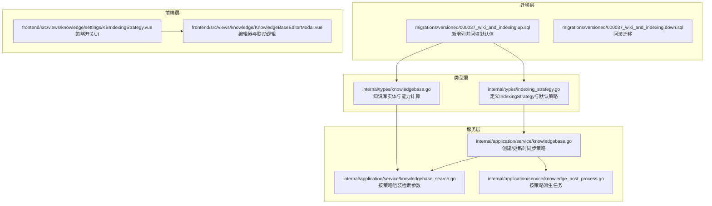
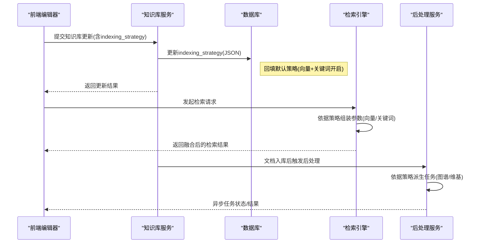
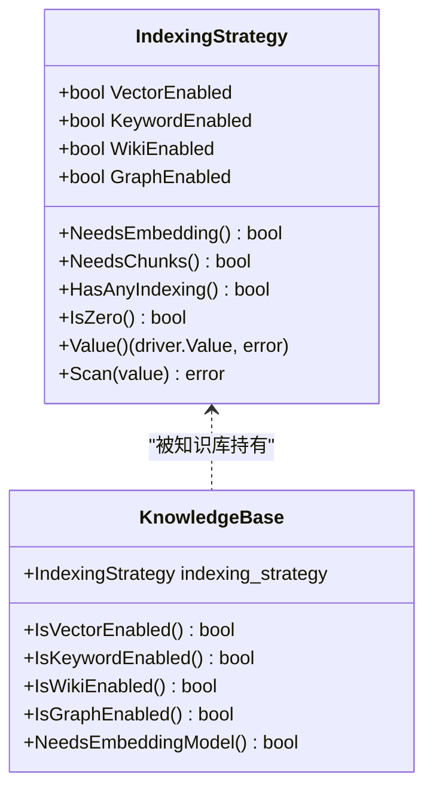
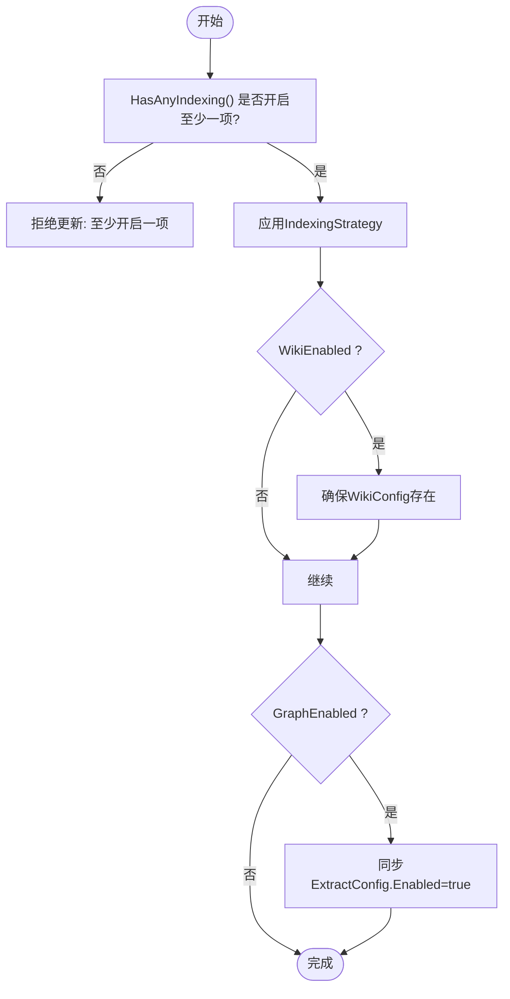
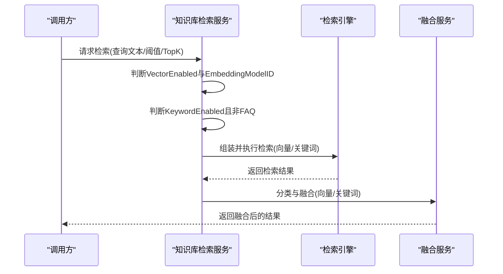
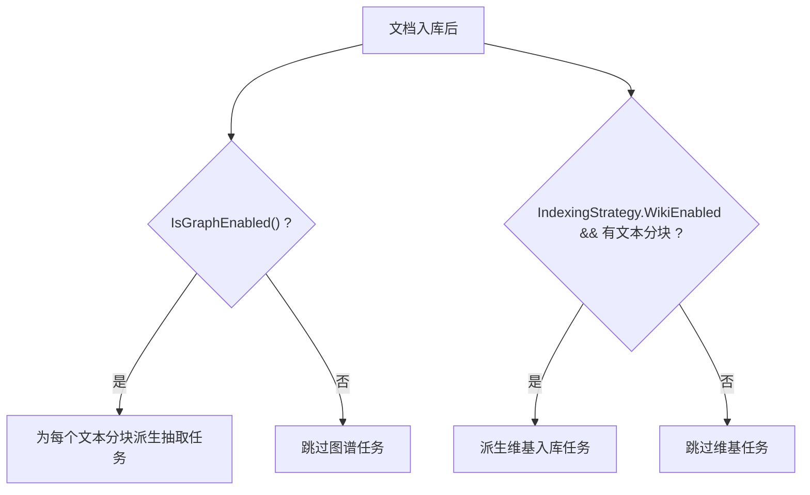
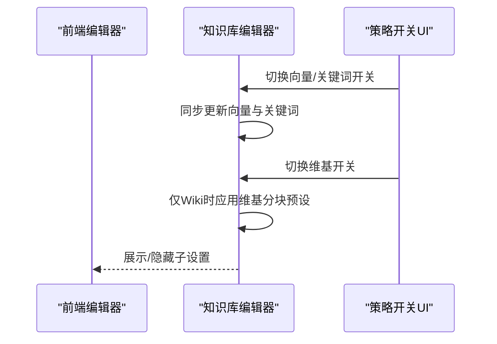
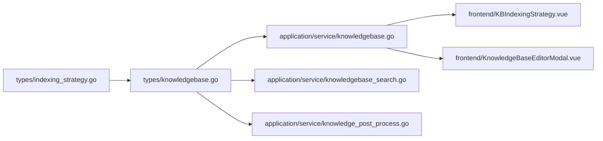

# 索引策略配置

<cite>
**本文引用的文件**
- [indexing_strategy.go](file://internal/types/indexing_strategy.go)
- [knowledgebase.go](file://internal/types/knowledgebase.go)
- [knowledgebase_search.go](file://internal/application/service/knowledgebase_search.go)
- [knowledge_post_process.go](file://internal/application/service/knowledge_post_process.go)
- [knowledgebase.go](file://internal/application/service/knowledgebase.go)
- [KBIndexingStrategy.vue](file://frontend/src/views/knowledge/settings/KBIndexingStrategy.vue)
- [KnowledgeBaseEditorModal.vue](file://frontend/src/views/knowledge/KnowledgeBaseEditorModal.vue)
- [000037_wiki_and_indexing.up.sql](file://migrations/versioned/000037_wiki_and_indexing.up.sql)
- [000037_wiki_and_indexing.down.sql](file://migrations/versioned/000037_wiki_and_indexing.down.sql)
- [knowledge_search.go](file://internal/agent/tools/knowledge_search.go)
- [query_knowledge_graph.go](file://internal/agent/tools/query_knowledge_graph.go)
- [keywords_vector_hybrid_indexer.go](file://internal/application/service/retriever/keywords_vector_hybrid_indexer.go)
- [knowledgebase_search_fusion.go](file://internal/application/service/knowledgebase_search_fusion.go)
</cite>

## 目录
1. [简介](#简介)
2. [项目结构](#项目结构)
3. [核心组件](#核心组件)
4. [架构总览](#架构总览)
5. [详细组件分析](#详细组件分析)
6. [依赖分析](#依赖分析)
7. [性能考量](#性能考量)
8. [故障排除指南](#故障排除指南)
9. [结论](#结论)
10. [附录](#附录)

## 简介
本文件面向WeKnora的索引策略配置系统，围绕IndexingStrategy结构体展开，系统性阐述其设计原理、字段作用机制、组合使用方式、与知识库类型的关系，以及对向量搜索、关键词搜索、维基生成、知识图谱提取的影响。文档同时提供最佳实践、性能考量与故障排除建议，并给出可操作的配置示例与常见场景解决方案。

## 项目结构
WeKnora的索引策略配置横跨后端类型层、服务层、迁移脚本与前端界面层：
- 类型层：定义IndexingStrategy及其默认行为与序列化规则
- 服务层：在知识库创建/更新、检索、后处理阶段应用策略
- 迁移层：为知识库表新增indexing_strategy列并回填默认值
- 前端层：提供策略开关UI与联动逻辑

**图表来源**
- [indexing_strategy.go:1-78](file://internal/types/indexing_strategy.go#L1-L78)
- [knowledgebase.go:1-200](file://internal/types/knowledgebase.go#L1-L200)
- [knowledgebase.go:290-333](file://internal/application/service/knowledgebase.go#L290-L333)
- [knowledgebase_search.go:180-268](file://internal/application/service/knowledgebase_search.go#L180-L268)
- [knowledge_post_process.go:110-133](file://internal/application/service/knowledge_post_process.go#L110-L133)
- [000037_wiki_and_indexing.up.sql:80-100](file://migrations/versioned/000037_wiki_and_indexing.up.sql#L80-L100)
- [000037_wiki_and_indexing.down.sql:1-13](file://migrations/versioned/000037_wiki_and_indexing.down.sql#L1-L13)
- [KBIndexingStrategy.vue:36-85](file://frontend/src/views/knowledge/settings/KBIndexingStrategy.vue#L36-L85)
- [KnowledgeBaseEditorModal.vue:620-726](file://frontend/src/views/knowledge/KnowledgeBaseEditorModal.vue#L620-L726)

**章节来源**
- [indexing_strategy.go:1-78](file://internal/types/indexing_strategy.go#L1-L78)
- [knowledgebase.go:1-200](file://internal/types/knowledgebase.go#L1-L200)
- [knowledgebase.go:290-333](file://internal/application/service/knowledgebase.go#L290-L333)
- [knowledgebase_search.go:180-268](file://internal/application/service/knowledgebase_search.go#L180-L268)
- [knowledge_post_process.go:110-133](file://internal/application/service/knowledge_post_process.go#L110-L133)
- [000037_wiki_and_indexing.up.sql:80-100](file://migrations/versioned/000037_wiki_and_indexing.up.sql#L80-L100)
- [000037_wiki_and_indexing.down.sql:1-13](file://migrations/versioned/000037_wiki_and_indexing.down.sql#L1-L13)
- [KBIndexingStrategy.vue:36-85](file://frontend/src/views/knowledge/settings/KBIndexingStrategy.vue#L36-L85)
- [KnowledgeBaseEditorModal.vue:620-726](file://frontend/src/views/knowledge/KnowledgeBaseEditorModal.vue#L620-L726)

## 核心组件
- IndexingStrategy结构体：控制知识库的索引管道开关，独立布尔标志决定是否启用向量、关键词、维基、图谱管道。提供默认策略、嵌入需求判断、分块需求判断、任意索引存在判断与零值判断，并实现GORM序列化/反序列化以兼容历史数据。
- 知识库实体与能力：知识库对象通过IndexingStrategy推导能力标志（向量、关键词、维基、图谱），并在JSON序列化中暴露给前端用于过滤与展示。
- 检索服务：根据IndexingStrategy与知识库类型动态组装检索参数，支持向量与关键词混合检索。
- 后处理服务：依据策略派生后续任务（如知识图谱抽取、维基入库）。
- 前端编辑器：提供策略开关UI，并在特定策略下联动分块预设与子设置显示。

**章节来源**
- [indexing_strategy.go:8-78](file://internal/types/indexing_strategy.go#L8-L78)
- [knowledgebase.go:529-625](file://internal/types/knowledgebase.go#L529-L625)
- [knowledgebase_search.go:180-268](file://internal/application/service/knowledgebase_search.go#L180-L268)
- [knowledge_post_process.go:110-133](file://internal/application/service/knowledge_post_process.go#L110-L133)
- [KBIndexingStrategy.vue:36-85](file://frontend/src/views/knowledge/settings/KBIndexingStrategy.vue#L36-L85)
- [KnowledgeBaseEditorModal.vue:684-726](file://frontend/src/views/knowledge/KnowledgeBaseEditorModal.vue#L684-L726)

## 架构总览
索引策略贯穿“配置—持久化—检索—后处理—前端”的完整链路，确保策略变更即时生效且向后兼容。

**图表来源**
- [knowledgebase.go:290-333](file://internal/application/service/knowledgebase.go#L290-L333)
- [000037_wiki_and_indexing.up.sql:80-100](file://migrations/versioned/000037_wiki_and_indexing.up.sql#L80-L100)
- [knowledgebase_search.go:180-268](file://internal/application/service/knowledgebase_search.go#L180-L268)
- [knowledge_post_process.go:110-133](file://internal/application/service/knowledge_post_process.go#L110-L133)

## 详细组件分析

### IndexingStrategy结构体与默认策略
- 字段语义
  - VectorEnabled：启用语义向量嵌入与检索
  - KeywordEnabled：启用基于BM25的关键词检索
  - WikiEnabled：启用文档到维基页面的自动生成
  - GraphEnabled：启用知识图谱实体/关系抽取
- 默认策略：向量与关键词开启，维基与图谱关闭，匹配历史行为
- 功能方法
  - NeedsEmbedding：任一需要嵌入（向量或关键词）
  - NeedsChunks：任一需要分块（向量、关键词、维基、图谱）
  - HasAnyIndexing：至少开启一个索引
  - IsZero：未开启任何索引
- 序列化：GORM通过JSON存储；扫描NULL时回退到默认策略，保证迁移兼容

**图表来源**
- [indexing_strategy.go:8-78](file://internal/types/indexing_strategy.go#L8-L78)
- [knowledgebase.go:585-625](file://internal/types/knowledgebase.go#L585-L625)

**章节来源**
- [indexing_strategy.go:8-78](file://internal/types/indexing_strategy.go#L8-L78)
- [knowledgebase.go:516-527](file://internal/types/knowledgebase.go#L516-L527)

### 策略与知识库类型的组合使用
- 策略与能力映射
  - 向量/关键词：通用文档知识库的主检索通道
  - 维基：面向知识沉淀与百科式内容生成
  - 图谱：面向实体关系抽取与可视化
- 策略组合建议
  - 文档检索为主：VectorEnabled=KeywordEnabled=true（默认）
  - 维基优先：WikiEnabled=true，VectorEnabled/KeywordEnabled可选
  - 图谱优先：GraphEnabled=true，需配合ExtractConfig.Enabled
  - 维基-only：仅WikiEnabled=true，系统会联动分块预设
- 策略校验
  - 更新时要求至少开启一项索引，否则拒绝
  - 维基开启时确保WikiConfig存在，图谱开启时同步ExtractConfig.Enabled

**图表来源**
- [knowledgebase.go:301-318](file://internal/application/service/knowledgebase.go#L301-L318)

**章节来源**
- [knowledgebase.go:290-333](file://internal/application/service/knowledgebase.go#L290-L333)
- [knowledgebase.go:529-574](file://internal/types/knowledgebase.go#L529-L574)

### 对检索与融合的影响
- 检索参数组装
  - 仅当知识库具备向量索引且配置了嵌入模型时，才加入向量检索参数
  - 关键词检索仅在支持且未禁用、非FAQ类型的前提下加入
- 结果融合
  - 将向量与关键词结果按类型分离，再进行去重或RRF融合
  - FAQ场景保留原始分数，非FAQ场景进行去重

**图表来源**
- [knowledgebase_search.go:180-268](file://internal/application/service/knowledgebase_search.go#L180-L268)
- [knowledgebase_search_fusion.go:12-39](file://internal/application/service/knowledgebase_search_fusion.go#L12-L39)

**章节来源**
- [knowledgebase_search.go:180-268](file://internal/application/service/knowledgebase_search.go#L180-L268)
- [knowledgebase_search_fusion.go:12-39](file://internal/application/service/knowledgebase_search_fusion.go#L12-L39)

### 对维基生成与知识图谱的影响
- 维基生成
  - 当WikiEnabled=true且存在文本分块时，派生维基入库任务
  - 维基-only策略会联动调整分块预设，避免误改
- 知识图谱
  - 当GraphEnabled=true时，为每个文本分块派生抽取任务
  - 图谱抽取依赖ExtractConfig.Enabled，策略开启时自动同步

**图表来源**
- [knowledge_post_process.go:116-131](file://internal/application/service/knowledge_post_process.go#L116-L131)

**章节来源**
- [knowledge_post_process.go:110-133](file://internal/application/service/knowledge_post_process.go#L110-L133)

### 前端交互与策略联动
- 策略开关UI：提供向量/关键词、维基、图谱开关
- 维基-only联动：当仅开启Wiki时，自动应用维基专用分块预设
- 编辑锁定：已上传文件的知识库在编辑模式下锁定索引策略切换，避免误改

**图表来源**
- [KBIndexingStrategy.vue:36-85](file://frontend/src/views/knowledge/settings/KBIndexingStrategy.vue#L36-L85)
- [KnowledgeBaseEditorModal.vue:684-726](file://frontend/src/views/knowledge/KnowledgeBaseEditorModal.vue#L684-L726)

**章节来源**
- [KBIndexingStrategy.vue:36-85](file://frontend/src/views/knowledge/settings/KBIndexingStrategy.vue#L36-L85)
- [KnowledgeBaseEditorModal.vue:684-726](file://frontend/src/views/knowledge/KnowledgeBaseEditorModal.vue#L684-L726)

## 依赖分析
- 类型层依赖
  - IndexingStrategy依赖GORM驱动接口实现JSON序列化/反序列化
  - KnowledgeBase通过IndexingStrategy推导能力标志，并在JSON中暴露
- 服务层依赖
  - 知识库服务在创建/更新时校验策略合法性并同步ExtractConfig
  - 检索服务按策略组装参数，避免对不支持的KB发起无效检索
  - 后处理服务按策略派生任务，确保资源合理分配
- 前端依赖
  - 前端编辑器读取后端返回的indexing_strategy并渲染UI
  - 前端在策略变化时联动分块配置与子设置

**图表来源**
- [indexing_strategy.go:1-78](file://internal/types/indexing_strategy.go#L1-L78)
- [knowledgebase.go:1-200](file://internal/types/knowledgebase.go#L1-L200)
- [knowledgebase.go:290-333](file://internal/application/service/knowledgebase.go#L290-L333)
- [knowledgebase_search.go:180-268](file://internal/application/service/knowledgebase_search.go#L180-L268)
- [knowledge_post_process.go:110-133](file://internal/application/service/knowledge_post_process.go#L110-L133)
- [KBIndexingStrategy.vue:36-85](file://frontend/src/views/knowledge/settings/KBIndexingStrategy.vue#L36-L85)
- [KnowledgeBaseEditorModal.vue:620-726](file://frontend/src/views/knowledge/KnowledgeBaseEditorModal.vue#L620-L726)

**章节来源**
- [indexing_strategy.go:1-78](file://internal/types/indexing_strategy.go#L1-L78)
- [knowledgebase.go:1-200](file://internal/types/knowledgebase.go#L1-L200)
- [knowledgebase.go:290-333](file://internal/application/service/knowledgebase.go#L290-L333)
- [knowledgebase_search.go:180-268](file://internal/application/service/knowledgebase_search.go#L180-L268)
- [knowledge_post_process.go:110-133](file://internal/application/service/knowledge_post_process.go#L110-L133)
- [KBIndexingStrategy.vue:36-85](file://frontend/src/views/knowledge/settings/KBIndexingStrategy.vue#L36-L85)
- [KnowledgeBaseEditorModal.vue:620-726](file://frontend/src/views/knowledge/KnowledgeBaseEditorModal.vue#L620-L726)

## 性能考量
- 向量与关键词检索
  - 仅在具备嵌入模型且策略允许时才发起，避免无效调用
  - FAQ类型KB不参与关键词检索，减少无关负载
- 结果融合
  - 无关键词结果时采用去重策略保留向量分数；有关键词结果时进行融合，平衡召回与精度
- 维基与图谱
  - 仅在策略开启且存在文本分块时派生任务，避免空转
  - 维基-only策略下优化分块参数，降低维基生成成本

[本节为通用性能讨论，无需列出具体文件来源]

## 故障排除指南
- 现象：创建/更新知识库时报错“至少开启一项索引”
  - 原因：IndexingStrategy全部关闭
  - 处理：至少开启VectorEnabled或KeywordEnabled之一
- 现象：图谱抽取未生效
  - 原因：GraphEnabled开启但ExtractConfig.Enabled未同步
  - 处理：确认策略开启后，服务层会自动同步ExtractConfig.Enabled
- 现象：维基生成未触发
  - 原因：WikiEnabled未开启或无文本分块
  - 处理：开启WikiEnabled并确保分块成功
- 现象：检索报“模型ID为空”
  - 原因：仅维基-only或图谱-only的KB未配置嵌入模型
  - 处理：为该KB配置嵌入模型或调整策略为向量/关键词开启

**章节来源**
- [knowledgebase.go:301-318](file://internal/application/service/knowledgebase.go#L301-L318)
- [knowledgebase_search.go:180-268](file://internal/application/service/knowledgebase_search.go#L180-L268)
- [knowledge_post_process.go:116-131](file://internal/application/service/knowledge_post_process.go#L116-L131)

## 结论
IndexingStrategy通过四个独立布尔位精确控制WeKnora的四大索引管道，既保证灵活性又确保向后兼容。结合服务层的策略校验、检索参数组装与后处理任务派生，系统实现了从配置到执行的闭环。前端层面的策略联动进一步提升了用户体验与一致性。遵循本文最佳实践与故障排除建议，可在不同知识库类型与业务场景下高效落地索引策略。

[本节为总结性内容，无需列出具体文件来源]

## 附录

### 配置示例与最佳实践
- 示例A：通用文档检索
  - 策略：VectorEnabled=true、KeywordEnabled=true、WikiEnabled=false、GraphEnabled=false
  - 说明：默认策略，适合大多数文档检索场景
- 示例B：维基优先
  - 策略：WikiEnabled=true、VectorEnabled=false、KeywordEnabled=false
  - 说明：系统将自动应用维基专用分块预设；适合知识沉淀与百科式内容
- 示例C：图谱优先
  - 策略：GraphEnabled=true、VectorEnabled=false、KeywordEnabled=false
  - 说明：需确保ExtractConfig.Enabled=true；适合实体关系探索
- 示例D：向量+关键词+维基
  - 策略：VectorEnabled=true、KeywordEnabled=true、WikiEnabled=true、GraphEnabled=false
  - 说明：综合检索与维基生成，适合高质量问答与知识沉淀
- 最佳实践
  - 创建KB时明确目标场景，避免盲目开启所有管道
  - FAQ类型KB不参与关键词检索，应通过向量检索或专用FAQ索引
  - 维基-only策略下谨慎修改分块配置，避免影响生成质量
  - 图谱抽取需配合ExtractConfig节点/关系配置，逐步完善

**章节来源**
- [indexing_strategy.go:22-31](file://internal/types/indexing_strategy.go#L22-L31)
- [knowledgebase_search.go:241-263](file://internal/application/service/knowledgebase_search.go#L241-L263)
- [knowledge_post_process.go:116-131](file://internal/application/service/knowledge_post_process.go#L116-L131)
- [KnowledgeBaseEditorModal.vue:708-726](file://frontend/src/views/knowledge/KnowledgeBaseEditorModal.vue#L708-L726)

### 数据库迁移与兼容性
- 迁移脚本为知识库表新增indexing_strategy列，并对历史记录回填默认策略
- 回滚脚本删除相关列与表，恢复至迁移前状态
- GORM扫描NULL时自动回退到默认策略，确保旧数据可用

**章节来源**
- [000037_wiki_and_indexing.up.sql:80-100](file://migrations/versioned/000037_wiki_and_indexing.up.sql#L80-L100)
- [000037_wiki_and_indexing.down.sql:1-13](file://migrations/versioned/000037_wiki_and_indexing.down.sql#L1-L13)
- [indexing_strategy.go:59-77](file://internal/types/indexing_strategy.go#L59-L77)