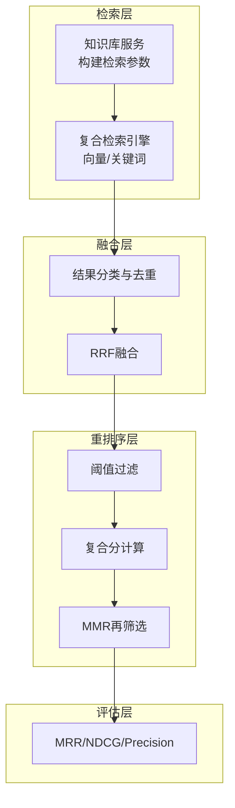
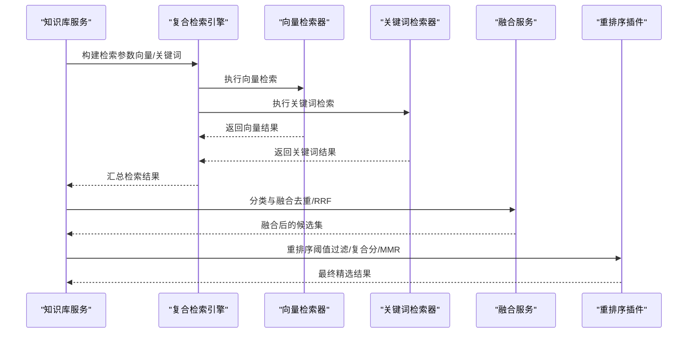
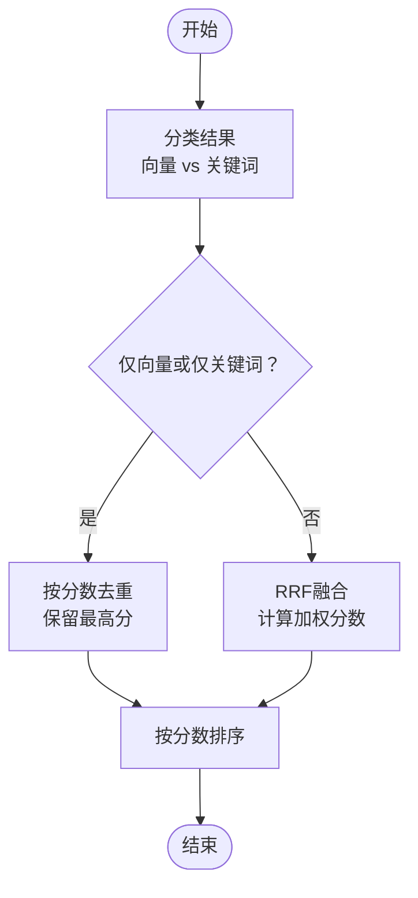
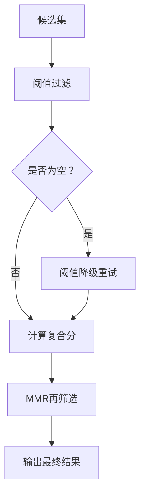
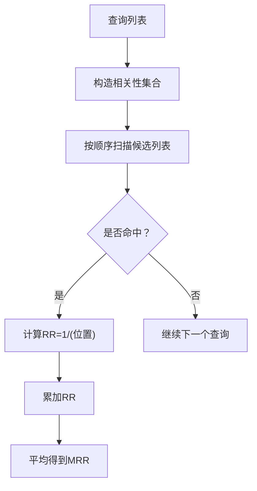
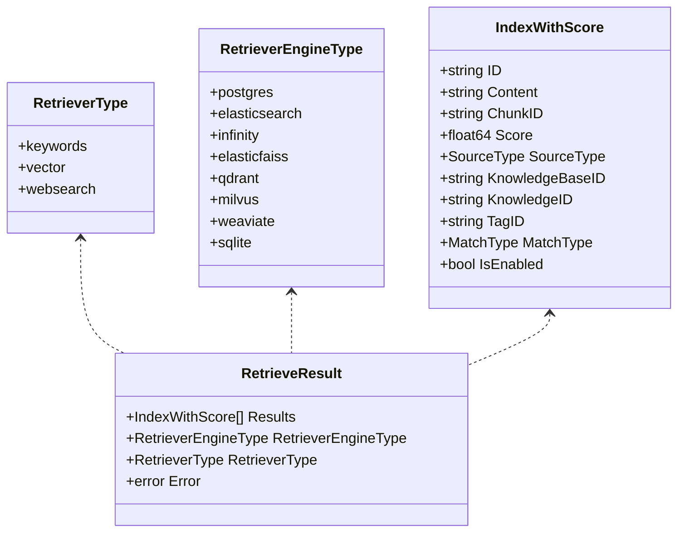
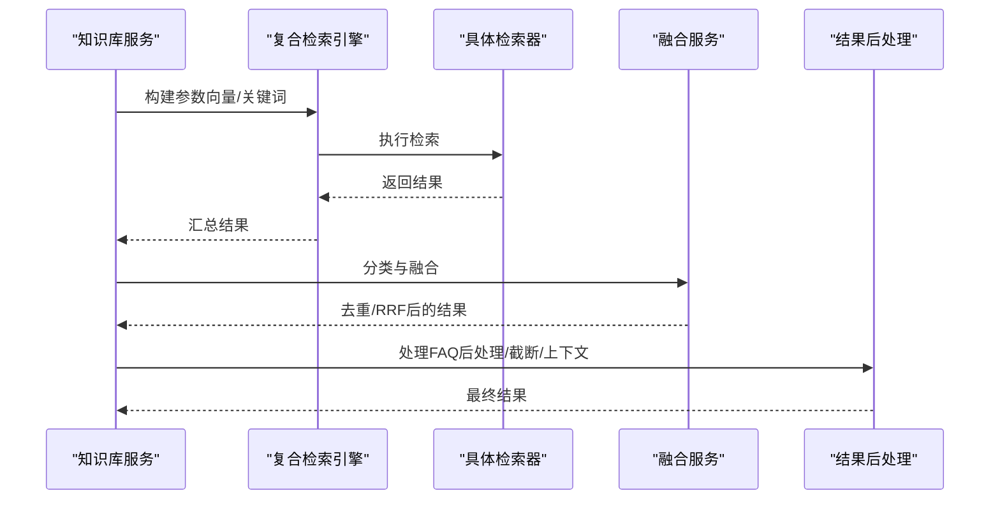
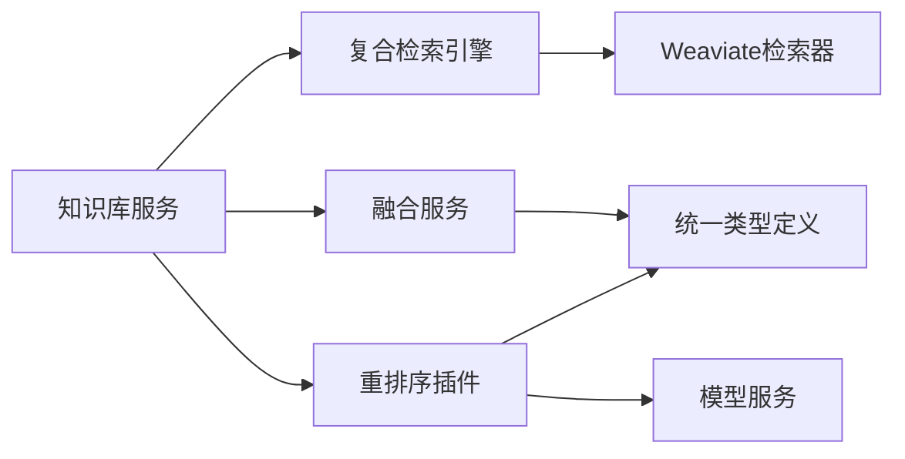

# 结果融合算法

<cite>
**本文引用的文件**
- [knowledgebase_search_fusion.go](file://internal/application/service/knowledgebase_search_fusion.go)
- [knowledgebase_search.go](file://internal/application/service/knowledgebase_search.go)
- [rerank.go](file://internal/application/service/chat_pipeline/rerank.go)
- [retriever.go](file://internal/types/retriever.go)
- [mrr.go](file://internal/application/service/metric/mrr.go)
- [mrr_test.go](file://internal/application/service/metric/mrr_test.go)
- [evaluation.go](file://internal/types/evaluation.go)
- [keywords_vector_hybrid_indexer.go](file://internal/application/service/retriever/keywords_vector_hybrid_indexer.go)
- [repository.go](file://internal/application/repository/retriever/weaviate/repository.go)
- [search.go](file://internal/application/service/chat_pipeline/search.go)
</cite>

## 目录
1. [简介](#简介)
2. [项目结构](#项目结构)
3. [核心组件](#核心组件)
4. [架构总览](#架构总览)
5. [详细组件分析](#详细组件分析)
6. [依赖分析](#依赖分析)
7. [性能考虑](#性能考虑)
8. [故障排查指南](#故障排查指南)
9. [结论](#结论)
10. [附录](#附录)

## 简介
本文件面向WeKnora的结果融合与重排序系统，系统性梳理了多检索器（向量与关键词）的融合策略与重排序流程，重点覆盖以下能力：
- 多源检索结果的分类与去重
- Reciprocal Rank Fusion（RRF）融合算法的实现与参数
- 重排序阶段的阈值过滤、复合分计算与最大边际相关（MMR）再筛选
- 评估指标（MRR、NDCG、Precision等）与测试用例
- 参数调优、性能优化与效果评估方法
- 不同业务场景下的融合策略选择与最佳实践

## 项目结构
WeKnora在检索与融合方面主要由以下模块构成：
- 检索服务：负责构建向量/关键词检索参数并执行检索，返回统一结构的结果
- 融合服务：对来自不同检索器的结果进行分类、去重与RRF融合
- 重排序插件：在聊天管线中对候选结果进行重排，包含阈值过滤、复合分计算与MMR
- 评估工具：提供MRR/NDCG/Precision等指标计算与测试样例
- 类型定义：统一检索结果与评分结构，便于跨模块协作

**图表来源**
- [knowledgebase_search.go:76-168](file://internal/application/service/knowledgebase_search.go#L76-L168)
- [knowledgebase_search_fusion.go:12-49](file://internal/application/service/knowledgebase_search_fusion.go#L12-L49)
- [rerank.go:17-206](file://internal/application/service/chat_pipeline/rerank.go#L17-L206)

**章节来源**
- [knowledgebase_search.go:76-168](file://internal/application/service/knowledgebase_search.go#L76-L168)
- [knowledgebase_search_fusion.go:12-49](file://internal/application/service/knowledgebase_search_fusion.go#L12-L49)
- [rerank.go:17-206](file://internal/application/service/chat_pipeline/rerank.go#L17-L206)

## 核心组件
- 检索参数与结果类型
  - 检索参数包含查询文本、嵌入向量、知识库范围、阈值、TopK等
  - 检索结果统一为IndexWithScore，包含内容、元数据与分数
- 检索执行与融合
  - 构建向量/关键词检索参数，执行检索后按检索器类型分类
  - 单一检索器时按分数去重；混合检索器时采用RRF融合
- 重排序与再筛选
  - 基于阈值过滤候选，必要时自动降阈值兜底
  - 计算复合分并应用MMR，最终输出精选结果

**章节来源**
- [retriever.go:28-101](file://internal/types/retriever.go#L28-L101)
- [knowledgebase_search.go:170-267](file://internal/application/service/knowledgebase_search.go#L170-L267)
- [knowledgebase_search_fusion.go:12-49](file://internal/application/service/knowledgebase_search_fusion.go#L12-L49)
- [rerank.go:108-206](file://internal/application/service/chat_pipeline/rerank.go#L108-L206)

## 架构总览
下图展示了从检索到融合再到重排序的整体流程：

**图表来源**
- [knowledgebase_search.go:136-167](file://internal/application/service/knowledgebase_search.go#L136-L167)
- [knowledgebase_search_fusion.go:12-49](file://internal/application/service/knowledgebase_search_fusion.go#L12-L49)
- [rerank.go:108-206](file://internal/application/service/chat_pipeline/rerank.go#L108-L206)

## 详细组件分析

### 融合策略：分类、去重与RRF
- 分类与去重
  - 将检索结果按检索器类型分为向量与关键词两组
  - 当仅一种检索器有结果时，按分数去重并保留最高分记录
- RRF融合
  - 对每个唯一Chunk，基于其在向量与关键词结果中的排名计算加权分数
  - 公式：RRF = w1/(k+r1) + w2/(k+r2)，其中k为调参常量，w1+w2=1
  - 默认参数：k=60，向量权重0.7，关键词权重0.3
  - 排序：按RRF分数降序

**图表来源**
- [knowledgebase_search_fusion.go:31-49](file://internal/application/service/knowledgebase_search_fusion.go#L31-L49)
- [knowledgebase_search_fusion.go:79-141](file://internal/application/service/knowledgebase_search_fusion.go#L79-L141)

**章节来源**
- [knowledgebase_search_fusion.go:12-49](file://internal/application/service/knowledgebase_search_fusion.go#L12-L49)
- [knowledgebase_search_fusion.go:79-141](file://internal/application/service/knowledgebase_search_fusion.go#L79-L141)

### 重排序：阈值过滤、复合分与MMR
- 阈值过滤与降级
  - 若阈值较高导致无命中，自动降低阈值继续尝试，避免完全无结果
- 复合分计算
  - 组合重排模型分与基础分，引入来源权重与位置优先因子，归一化至[0,1]
- MMR再筛选
  - 在候选集中选择与已选集合冗余度最小的项，提升多样性与代表性

**图表来源**
- [rerank.go:108-206](file://internal/application/service/chat_pipeline/rerank.go#L108-L206)
- [rerank.go:321-343](file://internal/application/service/chat_pipeline/rerank.go#L321-L343)
- [rerank.go:345-426](file://internal/application/service/chat_pipeline/rerank.go#L345-L426)

**章节来源**
- [rerank.go:108-206](file://internal/application/service/chat_pipeline/rerank.go#L108-L206)
- [rerank.go:321-343](file://internal/application/service/chat_pipeline/rerank.go#L321-L343)
- [rerank.go:345-426](file://internal/application/service/chat_pipeline/rerank.go#L345-L426)

### 评估指标：MRR、NDCG、Precision
- MRR（Mean Reciprocal Rank）
  - 计算每个查询中首次命中的倒数排名，再求平均
  - 用于衡量“首个相关结果”的质量
- NDCG（Normalized Discounted Cumulative Gain）
  - 考虑相关性的排序位置，限制Top-K
- Precision（精确率）
  - 命中相关文档数 / 总检索数

**图表来源**
- [mrr.go:15-48](file://internal/application/service/metric/mrr.go#L15-L48)
- [mrr_test.go:9-72](file://internal/application/service/metric/mrr_test.go#L9-L72)
- [evaluation.go:65-85](file://internal/types/evaluation.go#L65-L85)

**章节来源**
- [mrr.go:15-48](file://internal/application/service/metric/mrr.go#L15-L48)
- [mrr_test.go:9-72](file://internal/application/service/metric/mrr_test.go#L9-L72)
- [evaluation.go:65-85](file://internal/types/evaluation.go#L65-L85)

### 检索器类型与结果结构
- 检索器类型
  - keywords、vector、websearch
  - 引擎类型支持多种后端（如Postgres、Elasticsearch、Weaviate等）
- 结果结构
  - IndexWithScore统一承载ChunkID、内容、元数据与分数
  - RetrieveResult封装结果集、来源类型与错误

**图表来源**
- [retriever.go:18-26](file://internal/types/retriever.go#L18-L26)
- [retriever.go:3-16](file://internal/types/retriever.go#L3-L16)
- [retriever.go:64-101](file://internal/types/retriever.go#L64-L101)

**章节来源**
- [retriever.go:18-26](file://internal/types/retriever.go#L18-L26)
- [retriever.go:3-16](file://internal/types/retriever.go#L3-L16)
- [retriever.go:64-101](file://internal/types/retriever.go#L64-L101)

### 检索执行与结果处理
- 检索执行
  - 根据知识库类型与引擎能力，分别构建向量与关键词检索参数
  - 向量检索支持跨租户共享模型的兼容处理
- 结果处理
  - 融合前先按ChunkID去重，保留最高分
  - FAQ场景可能进行迭代检索或负向问题过滤
  - 输出前可跳过上下文增强以适配不同流水线

**图表来源**
- [knowledgebase_search.go:170-267](file://internal/application/service/knowledgebase_search.go#L170-L267)
- [knowledgebase_search_fusion.go:31-49](file://internal/application/service/knowledgebase_search_fusion.go#L31-L49)
- [knowledgebase_search.go:159-167](file://internal/application/service/knowledgebase_search.go#L159-L167)

**章节来源**
- [knowledgebase_search.go:170-267](file://internal/application/service/knowledgebase_search.go#L170-L267)
- [knowledgebase_search_fusion.go:31-49](file://internal/application/service/knowledgebase_search_fusion.go#L31-L49)
- [knowledgebase_search.go:159-167](file://internal/application/service/knowledgebase_search.go#L159-L167)

## 依赖分析
- 模块耦合
  - 知识库服务依赖复合检索引擎与模型服务，负责参数构建与结果后处理
  - 融合服务独立于具体检索器实现，仅依赖统一结果结构
  - 重排序插件依赖模型服务与工具函数，完成阈值过滤、复合分与MMR
- 外部依赖
  - Weaviate等检索后端通过字段映射返回分数/置信度，供融合与重排序使用

**图表来源**
- [knowledgebase_search.go:98-103](file://internal/application/service/knowledgebase_search.go#L98-L103)
- [repository.go:913-922](file://internal/application/repository/retriever/weaviate/repository.go#L913-L922)
- [knowledgebase_search_fusion.go:12-49](file://internal/application/service/knowledgebase_search_fusion.go#L12-L49)
- [rerank.go:17-29](file://internal/application/service/chat_pipeline/rerank.go#L17-L29)

**章节来源**
- [knowledgebase_search.go:98-103](file://internal/application/service/knowledgebase_search.go#L98-L103)
- [repository.go:913-922](file://internal/application/repository/retriever/weaviate/repository.go#L913-L922)
- [knowledgebase_search_fusion.go:12-49](file://internal/application/service/knowledgebase_search_fusion.go#L12-L49)
- [rerank.go:17-29](file://internal/application/service/chat_pipeline/rerank.go#L17-L29)

## 性能考虑
- Over-retrieval策略
  - 为保证RRF与重排序的多样性与召回，采用5倍过采样，按KB数量比例缩放，上限控制
- RRF参数
  - k=60、向量权重0.7、关键词权重0.3为默认值，可根据业务调整
- 重排序阈值降级
  - 当高阈值导致空结果时自动降阈值，避免完全无输出
- 去重与近似重复过滤
  - 基于ID/签名的去重与部分重叠过滤，减少冗余

**章节来源**
- [knowledgebase_search.go:113-118](file://internal/application/service/knowledgebase_search.go#L113-L118)
- [knowledgebase_search_fusion.go:82-85](file://internal/application/service/knowledgebase_search_fusion.go#L82-L85)
- [rerank.go:114-129](file://internal/application/service/chat_pipeline/rerank.go#L114-L129)
- [search.go:194-276](file://internal/application/service/chat_pipeline/search.go#L194-L276)

## 故障排查指南
- 无结果
  - 检查阈值设置是否过高，必要时启用阈值降级逻辑
  - 确认检索器类型与引擎配置是否正确
- 结果重复
  - 确保融合前已按ChunkID去重
  - 使用部分重叠过滤进一步清理近似重复
- FAQ优先
  - 若启用FAQ优先，检查FAQ分数加权与阈值设置
- 评估指标异常
  - 核对Ground Truth格式与查询顺序，确保MRR/NDCG输入一致

**章节来源**
- [rerank.go:114-129](file://internal/application/service/chat_pipeline/rerank.go#L114-L129)
- [search.go:194-276](file://internal/application/service/chat_pipeline/search.go#L194-L276)
- [mrr.go:15-48](file://internal/application/service/metric/mrr.go#L15-L48)

## 结论
WeKnora通过“分类-去重-RRF融合-重排序”的流水线，实现了多检索器结果的高质量整合。系统在FAQ等特定场景下提供了针对性的后处理与优先策略，并通过MRR/NDCG/Precision等指标支撑效果评估。结合阈值降级、复合分与MMR，能够在保证相关性的同时提升多样性与稳定性。

## 附录

### 参数调优与最佳实践
- RRF参数
  - k：影响远距离排名的衰减速度，默认60；较大k更平滑，较小k更强调前排
  - 权重：向量权重0.7、关键词权重0.3；偏FAQ可提高向量权重
- 阈值
  - 向量/关键词阈值：根据召回与精度平衡调整
  - 重排序阈值：建议从0.3起调，若无命中自动降级
- TopK
  - 重排序TopK：通常设为10~20，兼顾质量与性能
- FAQ优先
  - 启用FAQ优先时，适当提高FAQ分数加权与阈值，确保直接答案的准确性

**章节来源**
- [knowledgebase_search_fusion.go:82-85](file://internal/application/service/knowledgebase_search_fusion.go#L82-L85)
- [rerank.go:114-129](file://internal/application/service/chat_pipeline/rerank.go#L114-L129)
- [evaluation.go:65-85](file://internal/types/evaluation.go#L65-L85)