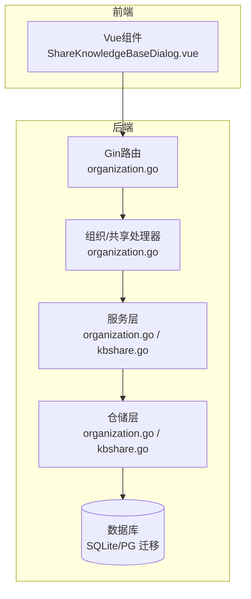
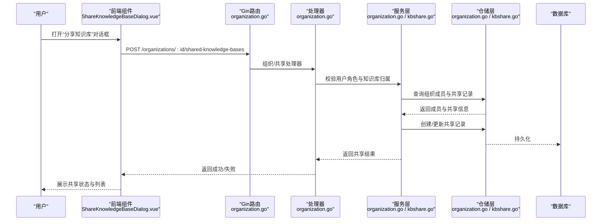
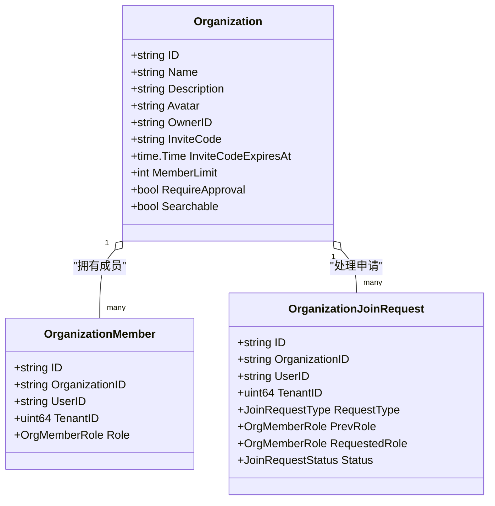
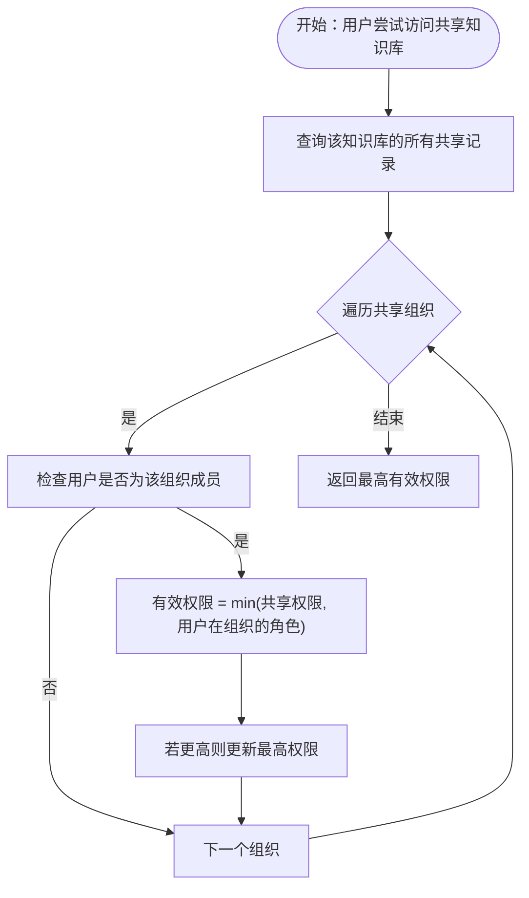
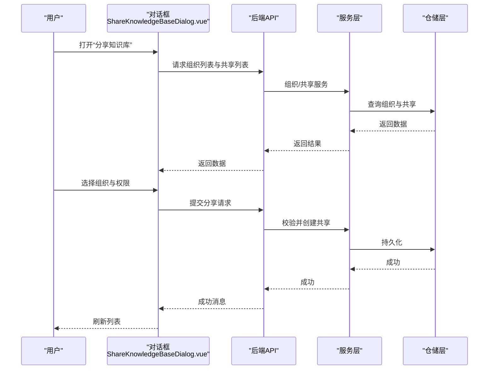
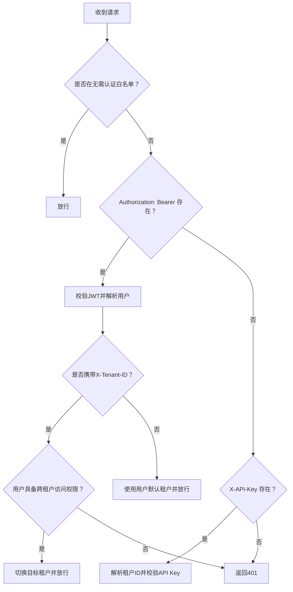
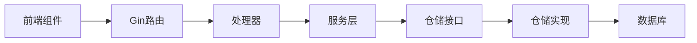

# 知识共享与协作

<cite>
**本文引用的文件**
- [README_CN.md](file://README_CN.md)
- [共享空间说明.md](file://docs/共享空间说明.md)
- [organization.go](file://internal/application/service/organization.go)
- [organization.go](file://internal/application/repository/organization.go)
- [organization.go](file://internal/types/organization.go)
- [organization.go](file://internal/handler/organization.go)
- [kbshare.go](file://internal/application/service/kbshare.go)
- [kbshare.go](file://internal/application/repository/kbshare.go)
- [organization.go](file://internal/types/interfaces/organization.go)
- [knowledgebase.go](file://client/knowledgebase.go)
- [ShareKnowledgeBaseDialog.vue](file://frontend/src/components/ShareKnowledgeBaseDialog.vue)
- [auth.go](file://internal/middleware/auth.go)
- [000000_init.up.sql](file://migrations/sqlite/000000_init.up.sql)
- [000012_organizations.up.sql](file://migrations/versioned/000012_organizations.up.sql)
</cite>

## 目录
1. [简介](#简介)
2. [项目结构](#项目结构)
3. [核心组件](#核心组件)
4. [架构总览](#架构总览)
5. [详细组件分析](#详细组件分析)
6. [依赖关系分析](#依赖关系分析)
7. [性能考虑](#性能考虑)
8. [故障排查指南](#故障排查指南)
9. [结论](#结论)
10. [附录](#附录)

## 简介
本文件面向WeKnora知识共享与协作系统，围绕跨租户知识库共享、组织间协作与权限控制展开，系统性阐述共享机制、访问控制、权限继承、生命周期管理、版本控制与变更通知、状态跟踪、使用统计与审计日志，以及面向管理员的策略配置与面向用户的操作手册。文档严格基于仓库现有代码与文档进行分析与总结。

## 项目结构
WeKnora采用分层架构：前端Vue应用负责用户交互与共享操作；后端Gin路由处理HTTP请求；应用服务层封装业务规则；仓储层对接数据库；类型定义统一数据契约；中间件负责认证与跨租户访问控制；迁移脚本定义数据库结构。

**章节来源**
- [README_CN.md: 162-210:162-210](file://README_CN.md#L162-L210)

## 核心组件
- 组织与成员管理：创建、加入、角色管理、邀请码、成员上限、加入审批与升级请求。
- 知识库共享：跨租户共享、权限继承、共享列表、去重与统计。
- 权限模型：组织内角色（管理员/编辑者/只读）与共享权限（只读/可写）的组合判定。
- 审计与统计：共享计数、资源计数、加入请求计数、邀请码有效期。
- 前端共享UI：组织选择、权限选择、共享列表与操作。

**章节来源**
- [organization.go: 40-61:40-61](file://internal/application/service/organization.go#L40-L61)
- [kbshare.go: 24-48:24-48](file://internal/application/service/kbshare.go#L24-L48)
- [organization.go: 12-39:12-39](file://internal/types/organization.go#L12-L39)

## 架构总览
WeKnora通过“共享空间”实现跨租户协作，知识库与智能体在空间内共享，用户在空间内的角色决定其对共享资源的操作权限。服务层负责权限校验与资源聚合，仓储层负责持久化与查询，前端提供直观的共享配置与列表展示。

**图表来源**
- [organization.go: 54-94:54-94](file://internal/handler/organization.go#L54-L94)
- [organization.go: 72-131:72-131](file://internal/application/service/organization.go#L72-L131)
- [kbshare.go: 50-120:50-120](file://internal/application/service/kbshare.go#L50-L120)

**章节来源**
- [organization.go: 54-94:54-94](file://internal/handler/organization.go#L54-L94)
- [organization.go: 72-131:72-131](file://internal/application/service/organization.go#L72-L131)
- [kbshare.go: 50-120:50-120](file://internal/application/service/kbshare.go#L50-L120)

## 详细组件分析

### 组件A：组织与成员管理
- 组织创建：创建者自动成为管理员，支持邀请码有效期与成员上限配置。
- 加入机制：支持邀请码直接加入（可选审批）与公开搜索加入（可发现空间）。
- 成员管理：角色升级申请、成员移除、角色变更、邀请码刷新。
- 资源统计：组织内共享知识库与智能体数量统计，用于前端侧栏展示。

**图表来源**
- [organization.go: 41-108:41-108](file://internal/types/organization.go#L41-L108)
- [organization.go: 129-169:129-169](file://internal/types/organization.go#L129-L169)

**章节来源**
- [organization.go: 72-131:72-131](file://internal/application/service/organization.go#L72-L131)
- [organization.go: 334-422:334-422](file://internal/application/service/organization.go#L334-L422)
- [organization.go: 134-186:134-186](file://internal/application/repository/organization.go#L134-L186)

### 组件B：知识库共享与权限继承
- 共享发起：仅知识库所属租户用户且为组织成员（管理员/编辑者）可发起共享；可设置共享权限（只读/可写）。
- 权限继承：用户在组织内的角色与共享权限取最小值，形成最终有效权限。
- 列表与去重：按知识库ID去重，保留最高权限；支持按组织列出共享项。
- 统计与计数：共享计数、按组织计数、知识条目/分块计数。

**图表来源**
- [kbshare.go: 404-452:404-452](file://internal/application/service/kbshare.go#L404-L452)
- [kbshare.go: 194-290:194-290](file://internal/application/service/kbshare.go#L194-L290)

**章节来源**
- [kbshare.go: 50-120:50-120](file://internal/application/service/kbshare.go#L50-L120)
- [kbshare.go: 194-290:194-290](file://internal/application/service/kbshare.go#L194-L290)
- [kbshare.go: 380-402:380-402](file://internal/application/service/kbshare.go#L380-L402)

### 组件C：前端共享对话框与操作
- 组织选择：仅展示用户可共享的组织（管理员/编辑者）且未重复共享。
- 权限选择：只读/可写两种权限。
- 列表与操作：查看共享列表、跳转组织设置、取消共享。
- 交互反馈：成功/失败消息提示。

**图表来源**
- [ShareKnowledgeBaseDialog.vue: 177-278:177-278](file://frontend/src/components/ShareKnowledgeBaseDialog.vue#L177-L278)
- [knowledgebase.go: 198-284:198-284](file://client/knowledgebase.go#L198-L284)

**章节来源**
- [ShareKnowledgeBaseDialog.vue: 177-278:177-278](file://frontend/src/components/ShareKnowledgeBaseDialog.vue#L177-L278)
- [knowledgebase.go: 198-284:198-284](file://client/knowledgebase.go#L198-L284)

### 组件D：认证与跨租户访问控制
- 认证方式：支持JWT Bearer与X-API-Key两种方式。
- 跨租户访问：通过X-Tenant-ID头切换目标租户，需具备跨租户访问权限。
- 无认证API白名单：健康检查、OIDC、登录注册等接口无需认证。

**图表来源**
- [auth.go: 65-228:65-228](file://internal/middleware/auth.go#L65-L228)

**章节来源**
- [auth.go: 65-228:65-228](file://internal/middleware/auth.go#L65-L228)

## 依赖关系分析
- 服务层依赖仓储层接口，保证业务规则与数据访问解耦。
- 处理器依赖服务层，负责参数绑定、错误处理与响应封装。
- 类型定义贯穿前后端，统一角色、权限与共享结构。
- 数据库迁移脚本定义组织、成员、共享记录等核心表结构。

**图表来源**
- [organization.go: 19-52:19-52](file://internal/handler/organization.go#L19-L52)
- [organization.go: 161-181:161-181](file://internal/types/interfaces/organization.go#L161-L181)
- [000000_init.up.sql: 316-372:316-372](file://migrations/sqlite/000000_init.up.sql#L316-L372)
- [000012_organizations.up.sql: 56-69:56-69](file://migrations/versioned/000012_organizations.up.sql#L56-L69)

**章节来源**
- [organization.go: 19-52:19-52](file://internal/handler/organization.go#L19-L52)
- [organization.go: 161-181:161-181](file://internal/types/interfaces/organization.go#L161-L181)
- [000000_init.up.sql: 316-372:316-372](file://migrations/sqlite/000000_init.up.sql#L316-L372)
- [000012_organizations.up.sql: 56-69:56-69](file://migrations/versioned/000012_organizations.up.sql#L56-L69)

## 性能考虑
- 批量查询与计数：服务层提供批量共享ID与计数接口，减少多次往返。
- 前端侧栏统计：处理器一次性聚合知识库与智能体计数，避免前端多次请求。
- 数据库索引：组织、成员、共享记录均有索引，保障查询效率。
- 建议：对高频查询（如共享列表、成员列表）增加缓存层，降低数据库压力。

[本节为通用指导，不涉及具体文件分析]

## 故障排查指南
- 共享失败：确认发起用户为知识库所属租户且为组织成员（管理员/编辑者）；检查共享权限是否有效。
- 权限异常：检查用户在组织内的角色与共享权限的最小值计算是否符合预期。
- 成员上限：当组织成员达到上限时，无法加入或审批通过；调整上限或移除成员。
- 邀请码过期：确认邀请码有效期；刷新邀请码后重试。
- API 401/403：检查认证头（Bearer或X-API-Key）与跨租户头（X-Tenant-ID）是否正确。

**章节来源**
- [organization.go: 27-38:27-38](file://internal/application/service/organization.go#L27-L38)
- [kbshare.go: 151-175:151-175](file://internal/application/service/kbshare.go#L151-L175)
- [auth.go: 224-228:224-228](file://internal/middleware/auth.go#L224-L228)

## 结论
WeKnora通过“共享空间”实现了跨租户知识库与智能体的协作共享，结合组织内角色与共享权限的双重控制，形成清晰的权限继承与访问边界。服务层提供完善的共享生命周期管理、统计与审计能力，前端提供直观的共享配置与列表展示。建议在生产环境中强化缓存与监控，完善审计日志与合规性检查，确保跨组织协作的安全与稳定。

[本节为总结性内容，不涉及具体文件分析]

## 附录

### 管理员配置与协作流程（管理指南）
- 创建共享空间：设置名称、描述、邀请码有效期、成员上限与是否需要审批。
- 成员管理：邀请/移除成员、角色变更、处理加入与权限升级申请。
- 共享管理：查看组织内共享列表、修改共享权限、取消共享。
- 资源统计：查看知识库与智能体在各空间的分布与数量。

**章节来源**
- [organization.go: 72-131:72-131](file://internal/application/service/organization.go#L72-L131)
- [organization.go: 272-332:272-332](file://internal/application/service/organization.go#L272-L332)
- [organization.go: 566-776:566-776](file://internal/application/service/organization.go#L566-L776)

### 用户操作手册（使用指南）
- 查看共享：在知识库列表中查看来自共享空间的资源。
- 使用共享：在对话或智能体中选择共享知识库与共享智能体。
- 分享知识库：选择组织与权限，提交分享请求；查看与管理已分享列表。
- 权限升级：在组织内提交权限升级申请，等待管理员审批。

**章节来源**
- [ShareKnowledgeBaseDialog.vue: 177-278:177-278](file://frontend/src/components/ShareKnowledgeBaseDialog.vue#L177-L278)
- [organization.go: 566-776:566-776](file://internal/application/service/organization.go#L566-L776)

### 数据模型与迁移
- 组织、成员、共享记录与加入请求的表结构定义与索引。
- 初始化与版本化迁移脚本，确保数据库结构一致性。

**章节来源**
- [000000_init.up.sql: 316-372:316-372](file://migrations/sqlite/000000_init.up.sql#L316-L372)
- [000012_organizations.up.sql: 56-69:56-69](file://migrations/versioned/000012_organizations.up.sql#L56-L69)