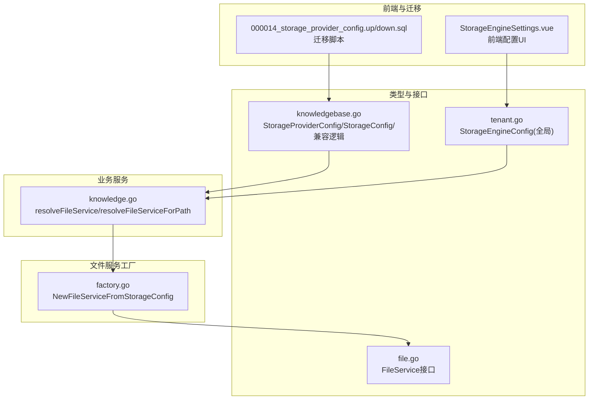
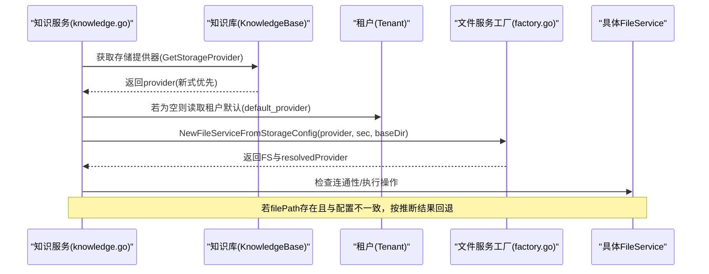
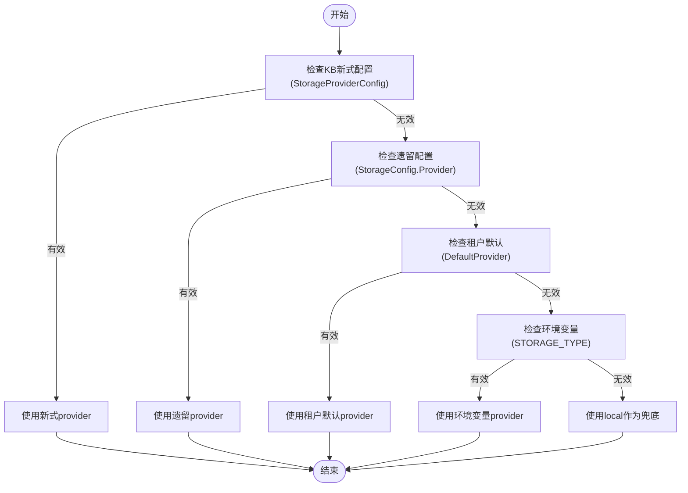
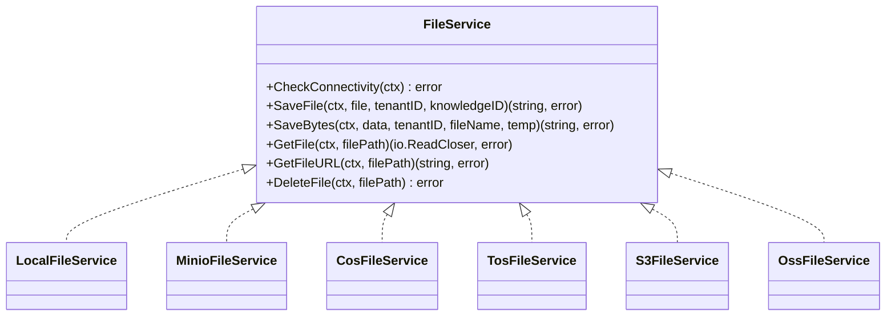
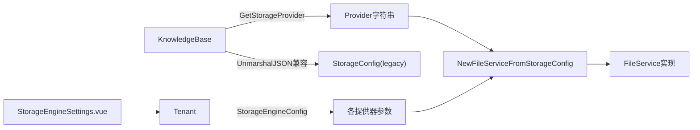

# 知识库存储配置

<cite>
**本文引用的文件**
- [knowledgebase.go](file://internal/types/knowledgebase.go)
- [tenant.go](file://internal/types/tenant.go)
- [factory.go](file://internal/application/service/file/factory.go)
- [knowledge.go](file://internal/application/service/knowledge.go)
- [file.go](file://internal/types/interfaces/file.go)
- [knowledgebase_test.go](file://internal/types/knowledgebase_test.go)
- [000014_storage_provider_config.up.sql](file://migrations/versioned/000014_storage_provider_config.up.sql)
- [000014_storage_provider_config.down.sql](file://migrations/versioned/000014_storage_provider_config.down.sql)
- [storage.py](file://docreader/parser/storage.py)
- [StorageEngineSettings.vue](file://frontend/src/views/settings/StorageEngineSettings.vue)
</cite>

## 目录
1. [简介](#简介)
2. [项目结构](#项目结构)
3. [核心组件](#核心组件)
4. [架构总览](#架构总览)
5. [详细组件分析](#详细组件分析)
6. [依赖分析](#依赖分析)
7. [性能考虑](#性能考虑)
8. [故障排查指南](#故障排查指南)
9. [结论](#结论)
10. [附录](#附录)

## 简介
本技术文档聚焦WeKnora知识库存储配置系统，系统性阐述“新式存储配置”（StorageProviderConfig）与“遗留配置”（StorageConfig）的兼容机制，详解支持的存储提供商（local、minio、cos、tos、s3、oss）及其参数，说明存储提供器的优先级选择与自动推断（InferStorageFromFilePath），解释文件路径格式（provider://scheme）与统一格式解析规则，给出配置验证与错误处理策略，并提供从遗留配置到新式配置的迁移指南及在文档导入、图片处理、附件管理中的应用。

## 项目结构
围绕存储配置的关键代码分布在以下模块：
- 类型定义与兼容层：internal/types 下的 knowledgebase.go、tenant.go
- 文件服务工厂与具体实现：internal/application/service/file 下的 factory.go 及各提供商实现
- 业务服务：internal/application/service/knowledge.go 中的存储解析与回退逻辑
- 接口契约：internal/types/interfaces/file.go
- 迁移脚本：migrations/versioned/000014_storage_provider_config.*.sql
- 前端配置界面：frontend/src/views/settings/StorageEngineSettings.vue
- 文档解析侧Python侧配置：docreader/parser/storage.py

图表来源
- [knowledgebase.go:170-293](file://internal/types/knowledgebase.go#L170-L293)
- [tenant.go:388-458](file://internal/types/tenant.go#L388-L458)
- [factory.go:14-132](file://internal/application/service/file/factory.go#L14-L132)
- [knowledge.go:7676-7741](file://internal/application/service/knowledge.go#L7676-L7741)
- [file.go:9-26](file://internal/types/interfaces/file.go#L9-L26)
- [000014_storage_provider_config.up.sql:1-32](file://migrations/versioned/000014_storage_provider_config.up.sql#L1-L32)
- [000014_storage_provider_config.down.sql:1-17](file://migrations/versioned/000014_storage_provider_config.down.sql#L1-L17)

章节来源
- [knowledgebase.go:170-293](file://internal/types/knowledgebase.go#L170-L293)
- [tenant.go:388-458](file://internal/types/tenant.go#L388-L458)
- [factory.go:14-132](file://internal/application/service/file/factory.go#L14-L132)
- [knowledge.go:7676-7741](file://internal/application/service/knowledge.go#L7676-L7741)
- [file.go:9-26](file://internal/types/interfaces/file.go#L9-L26)
- [000014_storage_provider_config.up.sql:1-32](file://migrations/versioned/000014_storage_provider_config.up.sql#L1-L32)
- [000014_storage_provider_config.down.sql:1-17](file://migrations/versioned/000014_storage_provider_config.down.sql#L1-L17)

## 核心组件
- 新式存储配置（KB级）
  - StorageProviderConfig：仅保存“provider”字段，凭此在运行时从租户级StorageEngineConfig读取凭证与参数。
  - 作用域：每个知识库独立选择提供器；凭证集中于租户级别，便于统一管理与轮换。
- 遗留配置（KB级）
  - StorageConfig：历史遗留的COS专用配置（含SecretID/SecretKey/Region/BucketName/AppID/PathPrefix/Provider），用于向前兼容。
- 租户级全局配置
  - StorageEngineConfig：包含默认提供器与各提供器的参数（local/minio/cos/tos/s3/oss），由业务服务在解析KB存储时合并使用。
- 文件服务接口
  - FileService：抽象了检查连通性、保存、读取、删除、生成下载URL等能力，不同提供器通过工厂方法创建具体实例。

章节来源
- [knowledgebase.go:170-216](file://internal/types/knowledgebase.go#L170-L216)
- [tenant.go:388-458](file://internal/types/tenant.go#L388-L458)
- [file.go:9-26](file://internal/types/interfaces/file.go#L9-L26)

## 架构总览
新式配置优先于遗留配置；当KB未显式设置提供器时，回退至租户默认提供器；若仍不可得，则回退至环境变量或默认值。对于历史数据，系统提供自动推断以保护文件访问。

图表来源
- [knowledge.go:7676-7741](file://internal/application/service/knowledge.go#L7676-L7741)
- [factory.go:14-132](file://internal/application/service/file/factory.go#L14-L132)
- [knowledgebase.go:242-263](file://internal/types/knowledgebase.go#L242-L263)

## 详细组件分析

### 组件A：存储提供器选择与兼容机制
- 优先级
  - 新式：KnowledgeBase.StorageProviderConfig.Provider（非空且非占位符）
  - 遗留：KnowledgeBase.StorageConfig.Provider（cos_config）
  - 租户默认：Tenant.StorageEngineConfig.DefaultProvider
  - 环境变量：STORAGE_TYPE
  - 默认：local
- 自动推断
  - InferStorageFromFilePath(filePath)：从provider://scheme或历史URL中推断提供器，用于保护历史数据访问。
  - ParseProviderScheme(filePath)：匹配local/minio/cos/tos/s3/oss前缀。
- 兼容策略
  - UnmarshalJSON：当仅有legacy cos_config时，自动填充StorageProviderConfig。
  - 运行期：resolveFileServiceForPath在配置与文件路径不一致时回退到默认服务，避免历史数据丢失。

图表来源
- [knowledgebase.go:242-263](file://internal/types/knowledgebase.go#L242-L263)
- [knowledge.go:7676-7741](file://internal/application/service/knowledge.go#L7676-L7741)

章节来源
- [knowledgebase.go:220-263](file://internal/types/knowledgebase.go#L220-L263)
- [knowledge.go:7676-7741](file://internal/application/service/knowledge.go#L7676-L7741)

### 组件B：文件路径格式与统一解析
- 支持格式
  - provider://scheme：如 local://tenant/file.pdf、minio://bucket/key、cos://bucket/key、tos://bucket/key、s3://bucket/key、oss://bucket/key
  - 历史URL：例如 https://my-bucket.cos.ap-guangzhou.myqcloud.com/key
- 解析规则
  - ParseProviderScheme：识别provider前缀并返回对应提供器名
  - InferStorageFromFilePath：先尝试scheme，再匹配历史URL后缀
- 用途
  - 在resolveFileServiceForPath中，若配置与文件路径暗示的提供器不一致，系统会回退到默认服务，确保历史数据可访问

章节来源
- [knowledgebase.go:265-293](file://internal/types/knowledgebase.go#L265-L293)
- [knowledgebase_test.go:9-59](file://internal/types/knowledgebase_test.go#L9-L59)
- [knowledge.go:7709-7741](file://internal/application/service/knowledge.go#L7709-L7741)

### 组件C：文件服务工厂与各提供器实现
- 工厂方法
  - NewFileServiceFromStorageConfig(provider, sec, localBaseDir)：根据provider与StorageEngineConfig构造具体FileService
  - 参数解析顺序：显式provider > sec.DefaultProvider > 环境变量 > 默认local
- 各提供器校验与参数
  - local：校验baseDir与prefix安全拼接
  - minio：校验endpoint/accessKey/secretKey/bucket；支持remote/docker两种模式
  - cos：校验SecretID/SecretKey/Region/BucketName；默认pathPrefix为weknora
  - tos：校验Endpoint/Region/AccessKey/SecretKey/BucketName
  - s3：校验Endpoint/Region/AccessKey/SecretKey/BucketName；默认pathPrefix为weknora/
  - oss：校验Endpoint/Region/AccessKey/SecretKey/BucketName；支持临时桶开关与参数
- 错误处理
  - 缺少provider或参数不完整时返回错误
  - 创建失败时记录日志并回退到默认服务

图表来源
- [file.go:9-26](file://internal/types/interfaces/file.go#L9-L26)
- [factory.go:14-132](file://internal/application/service/file/factory.go#L14-L132)

章节来源
- [factory.go:14-132](file://internal/application/service/file/factory.go#L14-L132)

### 组件D：支持的存储提供商与参数
- local
  - 参数：path_prefix（可选，拼接到baseDir下）
  - 说明：单机部署场景，baseDir默认/data/files，可通过环境变量覆盖
- minio
  - 参数：mode（docker/remote）、endpoint、access_key_id、secret_access_key、bucket_name、use_ssl、path_prefix
  - 说明：docker模式从环境变量读取endpoint/credentials；remote模式使用配置字段
- cos
  - 参数：secret_id、secret_key、region、bucket_name、app_id、path_prefix
- tos
  - 参数：endpoint、region、access_key、secret_key、bucket_name、path_prefix
- s3
  - 参数：endpoint、region、access_key、secret_key、bucket_name、path_prefix
- oss
  - 参数：endpoint、region、access_key、secret_key、bucket_name、path_prefix、use_temp_bucket、temp_bucket_name、temp_region

章节来源
- [tenant.go:400-458](file://internal/types/tenant.go#L400-L458)
- [factory.go:37-132](file://internal/application/service/file/factory.go#L37-L132)

### 组件E：配置验证与错误处理策略
- 验证点
  - provider为空：直接报错
  - 各提供器参数缺失：返回“incomplete config”错误
  - local路径越权：通过安全拼接校验，防止逃逸baseDir
- 错误处理
  - resolveFileService：创建失败时记录错误并回退到默认FileService
  - resolveFileServiceForPath：当配置与文件路径暗示的提供器不一致时，记录告警并回退

章节来源
- [factory.go:22-28](file://internal/application/service/file/factory.go#L22-L28)
- [factory.go:53-74](file://internal/application/service/file/factory.go#L53-L74)
- [knowledge.go:7699-7706](file://internal/application/service/knowledge.go#L7699-L7706)
- [knowledge.go:7735-7739](file://internal/application/service/knowledge.go#L7735-L7739)

### 组件F：迁移指南（从遗留配置到新式配置）
- 迁移步骤
  - 升级数据库：执行000014_storage_provider_config.up.sql，新增storage_provider_config列并从cos_config迁移provider字段
  - 应用启动：对已有KB，若未设置provider且存在文档，则标记为“待环境值”，应用会在启动时替换为实际STORAGE_TYPE
  - 清理与回滚：down脚本将provider写回cos_config并删除新列
- 注意事项
  - 迁移后，KB不再直接持有密钥，需在租户级StorageEngineConfig中维护
  - 历史数据访问通过InferStorageFromFilePath保护，避免因配置变更导致无法访问

章节来源
- [000014_storage_provider_config.up.sql:1-32](file://migrations/versioned/000014_storage_provider_config.up.sql#L1-L32)
- [000014_storage_provider_config.down.sql:1-17](file://migrations/versioned/000014_storage_provider_config.down.sql#L1-L17)
- [knowledgebase.go:220-240](file://internal/types/knowledgebase.go#L220-L240)

### 组件G：在文档导入、图片处理、附件管理中的应用
- 文档导入
  - 导入流程会根据KB配置解析文件服务，保存解析后的图片与附件到对应存储
- 图片处理
  - docreader侧Python实现同样遵循STORAGE_TYPE与各提供器配置，上传图片到对应桶
- 附件管理
  - 附件上传/下载/删除均通过FileService接口完成，路径统一采用provider://scheme或绝对路径

章节来源
- [knowledge.go:7676-7741](file://internal/application/service/knowledge.go#L7676-L7741)
- [storage.py:396-419](file://docreader/parser/storage.py#L396-L419)

## 依赖分析
- 类型层
  - KnowledgeBase依赖StorageProviderConfig与StorageConfig进行兼容与回退
  - Tenant提供全局StorageEngineConfig，作为KB配置的参数来源
- 服务层
  - knowledgeService依赖KnowledgeBase与Tenant解析出最终FileService
  - file.Factory根据provider与StorageEngineConfig创建具体FileService
- 前端
  - StorageEngineSettings.vue负责编辑与提交StorageEngineConfig

图表来源
- [knowledgebase.go:220-263](file://internal/types/knowledgebase.go#L220-L263)
- [tenant.go:388-458](file://internal/types/tenant.go#L388-L458)
- [factory.go:14-132](file://internal/application/service/file/factory.go#L14-L132)
- [StorageEngineSettings.vue:725-744](file://frontend/src/views/settings/StorageEngineSettings.vue#L725-L744)

章节来源
- [knowledgebase.go:220-263](file://internal/types/knowledgebase.go#L220-L263)
- [tenant.go:388-458](file://internal/types/tenant.go#L388-L458)
- [factory.go:14-132](file://internal/application/service/file/factory.go#L14-L132)
- [StorageEngineSettings.vue:725-744](file://frontend/src/views/settings/StorageEngineSettings.vue#L725-L744)

## 性能考虑
- 本地存储
  - local基于文件系统，I/O受限于磁盘性能；建议合理规划baseDir与path_prefix，避免过多小文件
- 对象存储
  - minio/cos/tos/s3/oss通过HTTP(S)访问，注意网络延迟与带宽；合理设置path_prefix减少键冲突
- 连通性检查
  - FileService.CheckConnectivity用于预检，可在批量导入前调用以降低失败率

## 故障排查指南
- 常见错误
  - “empty provider”：未设置provider或默认值为空
  - “incomplete config”：某提供器缺少必要参数
  - “configured≠inferred”：配置与文件路径暗示的提供器不一致，系统回退
- 排查步骤
  - 检查KnowledgeBase.StorageProviderConfig与Tenant.StorageEngineConfig
  - 使用resolveFileServiceForPath定位问题文件路径
  - 查看日志中“[storage]”标记的提示信息
- 建议
  - 迁移完成后，确认cos_config已清空或仅保留provider字段
  - 对历史数据，优先通过InferStorageFromFilePath确认提供器

章节来源
- [factory.go:22-28](file://internal/application/service/file/factory.go#L22-L28)
- [knowledge.go:7718-7741](file://internal/application/service/knowledge.go#L7718-L7741)

## 结论
WeKnora通过“新式配置+租户级参数”的设计，实现了存储配置的清晰分离与灵活管理；通过兼容层与自动推断机制，保障了从遗留配置到新式配置的平滑过渡与历史数据安全。运维工程师与系统管理员应优先使用新式配置，配合前端界面与迁移脚本完成升级，并在导入与附件管理中遵循统一的provider://scheme路径规范。

## 附录

### A. 配置参数一览表
- local
  - path_prefix：可选，拼接在baseDir之后
- minio
  - mode：docker或remote
  - endpoint/access_key_id/secret_access_key：docker模式从环境变量读取；remote模式从配置读取
  - bucket_name/use_ssl/path_prefix
- cos
  - secret_id/secret_key/region/bucket_name/app_id/path_prefix
- tos
  - endpoint/region/access_key/secret_key/bucket_name/path_prefix
- s3
  - endpoint/region/access_key/secret_key/bucket_name/path_prefix
- oss
  - endpoint/region/access_key/secret_key/bucket_name/path_prefix
  - use_temp_bucket/temp_bucket_name/temp_region（可选）

章节来源
- [tenant.go:400-458](file://internal/types/tenant.go#L400-L458)

### B. 前端配置入口
- StorageEngineSettings.vue：提供default_provider与各提供器参数的编辑界面，提交后写入Tenant.StorageEngineConfig

章节来源
- [StorageEngineSettings.vue:725-744](file://frontend/src/views/settings/StorageEngineSettings.vue#L725-L744)