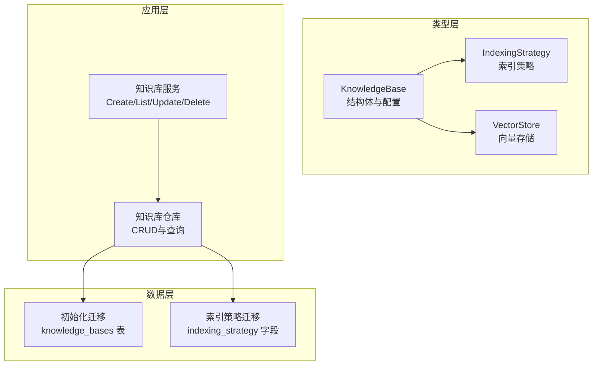
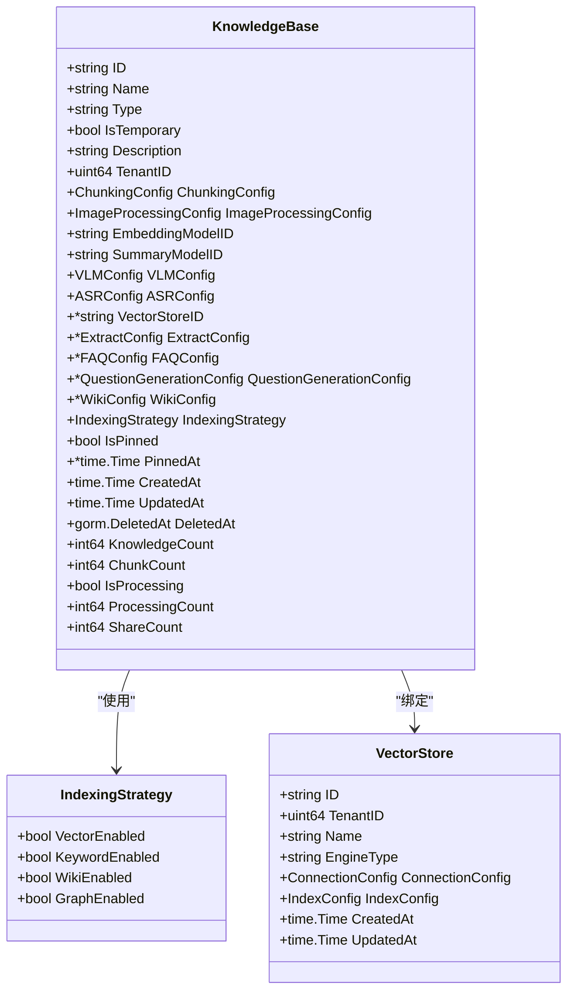
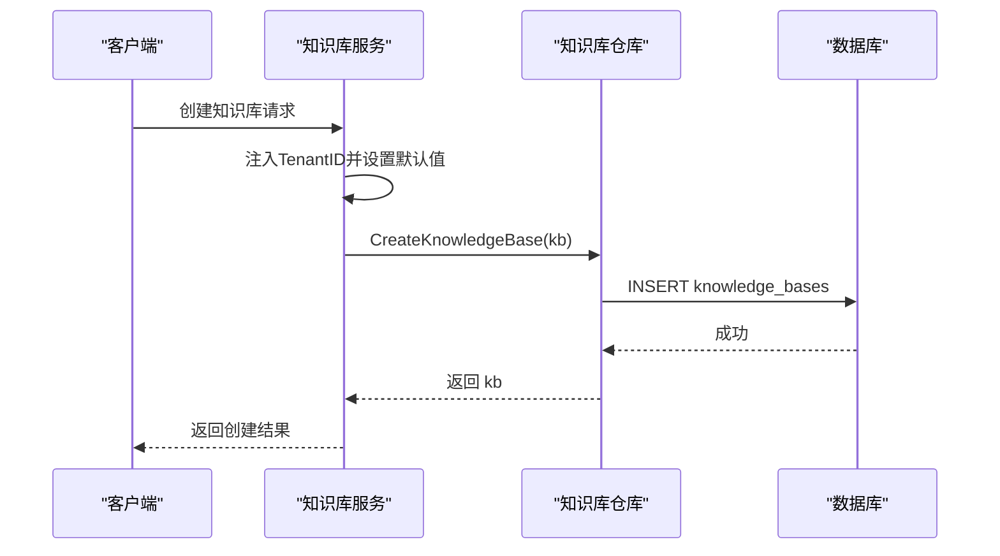
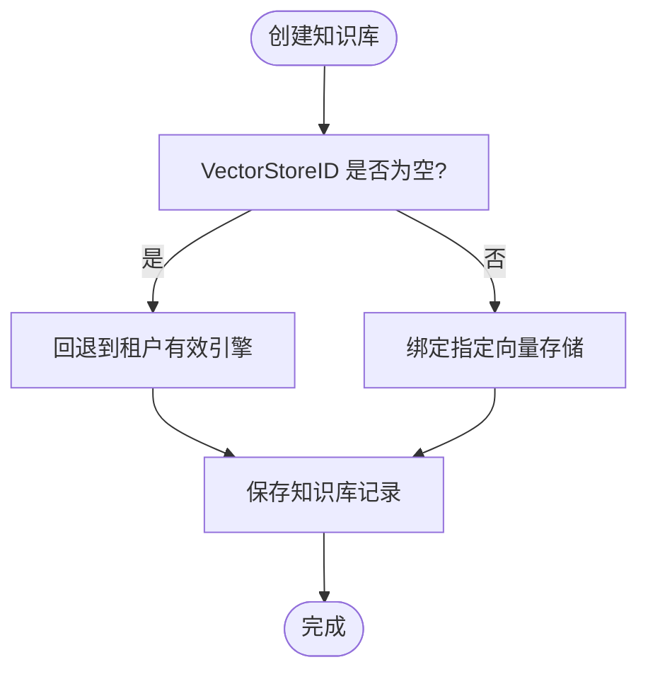
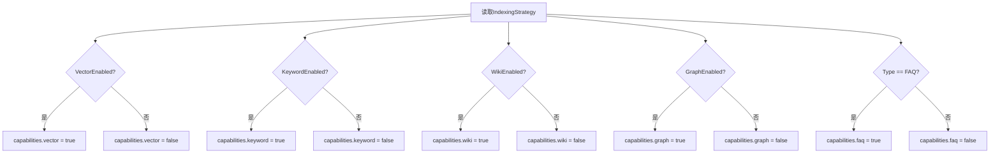
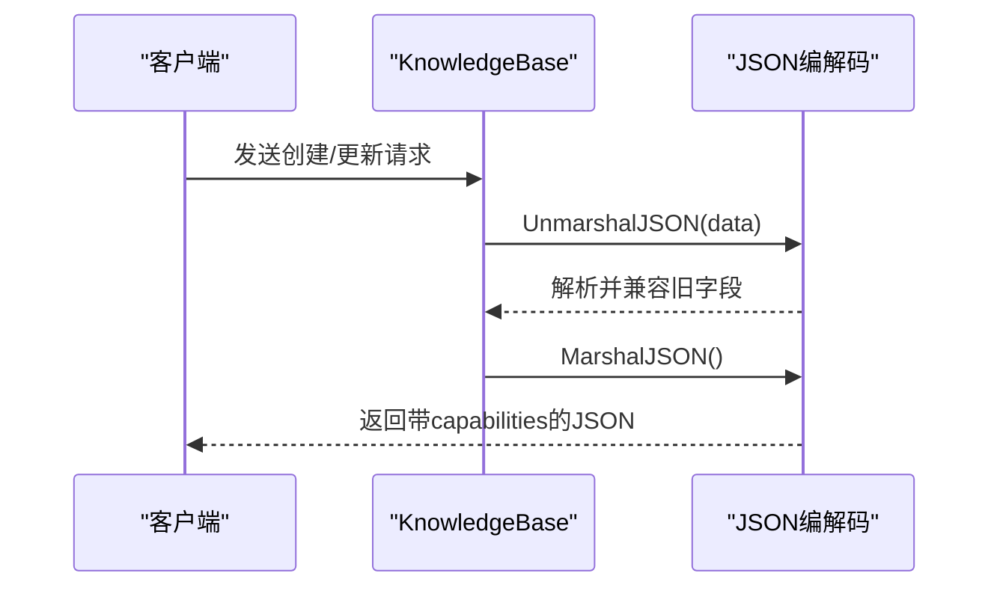
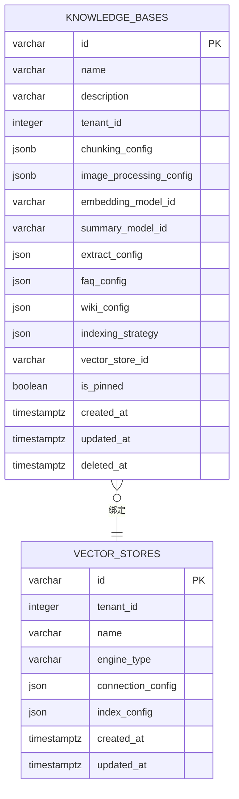
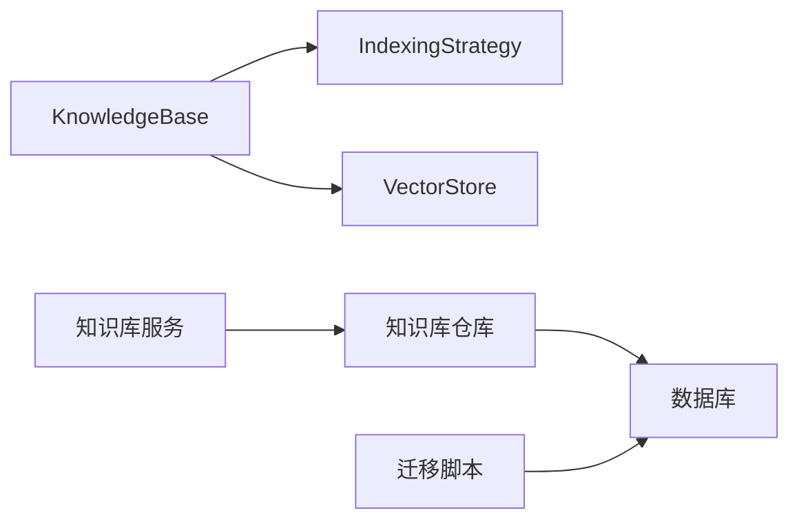

# 知识库实体设计

<cite>
**本文档引用的文件**
- [knowledgebase.go](file://internal/types/knowledgebase.go)
- [indexing_strategy.go](file://internal/types/indexing_strategy.go)
- [knowledgebase.go](file://internal/application/repository/knowledgebase.go)
- [knowledgebase.go](file://internal/application/service/knowledgebase.go)
- [vectorstore.go](file://internal/types/vectorstore.go)
- [vectorstore.go](file://internal/application/repository/vectorstore.go)
- [vectorstore.go](file://internal/application/service/vectorstore.go)
- [000000_init.up.sql](file://migrations/versioned/000000_init.up.sql)
- [000037_wiki_and_indexing.up.sql](file://migrations/versioned/000037_wiki_and_indexing.up.sql)
</cite>

## 目录
1. [简介](#简介)
2. [项目结构](#项目结构)
3. [核心组件](#核心组件)
4. [架构总览](#架构总览)
5. [详细组件分析](#详细组件分析)
6. [依赖关系分析](#依赖关系分析)
7. [性能考虑](#性能考虑)
8. [故障排除指南](#故障排除指南)
9. [结论](#结论)

## 简介
本文件针对 WeKnora 知识库实体进行系统化技术文档整理，重点围绕 KnowledgeBase 结构体的设计理念、字段语义与约束、知识库类型枚举差异、租户隔离机制、临时知识库设计、向量存储绑定策略以及 JSON 序列化/反序列化与向前兼容的存储配置迁移进行深入解析。文档同时提供面向数据库开发者与架构师的实体设计参考，辅以可视化图示帮助理解。

## 项目结构
WeKnora 的知识库实体设计横跨类型层、应用服务层与数据持久层，并通过迁移脚本确保数据库 Schema 的演进与兼容性：
- 类型层：定义 KnowledgeBase、IndexingStrategy、FAQConfig 等核心结构及序列化/反序列化行为
- 应用层：服务层负责创建、查询、更新、删除与统计填充；仓库层负责数据访问
- 数据层：迁移脚本定义初始表结构与后续演进（如 indexing_strategy）

**图表来源**
- [knowledgebase.go:40-108](file://internal/types/knowledgebase.go#L40-L108)
- [indexing_strategy.go:8-20](file://internal/types/indexing_strategy.go#L8-L20)
- [knowledgebase.go:74-99](file://internal/application/service/knowledgebase.go#L74-L99)
- [knowledgebase.go:25-28](file://internal/application/repository/knowledgebase.go#L25-L28)
- [000000_init.up.sql:70-88](file://migrations/versioned/000000_init.up.sql#L70-L88)
- [000037_wiki_and_indexing.up.sql:80-98](file://migrations/versioned/000037_wiki_and_indexing.up.sql#L80-L98)

**章节来源**
- [knowledgebase.go:40-108](file://internal/types/knowledgebase.go#L40-L108)
- [indexing_strategy.go:8-20](file://internal/types/indexing_strategy.go#L8-L20)
- [knowledgebase.go:25-28](file://internal/application/repository/knowledgebase.go#L25-L28)
- [knowledgebase.go:74-99](file://internal/application/service/knowledgebase.go#L74-L99)
- [000000_init.up.sql:70-88](file://migrations/versioned/000000_init.up.sql#L70-L88)
- [000037_wiki_and_indexing.up.sql:80-98](file://migrations/versioned/000037_wiki_and_indexing.up.sql#L80-L98)

## 核心组件
本节聚焦 KnowledgeBase 结构体及其关键字段的语义、约束与默认值，涵盖主键 ID、名称、类型、描述、租户 ID、临时标记、向量存储绑定、索引策略、时间戳与统计字段等。

- 主键 ID（ID）：全局唯一标识符，采用可读性强的字符串格式（UUID），用于跨模块引用与外部展示
- 名称（Name）：知识库对外可见的名称
- 类型（Type）：知识库类型枚举，支持 document、faq、wiki，默认为 document
- 描述（Description）：对知识库用途与范围的简要说明
- 租户 ID（TenantID）：用于实现多租户隔离，所有资源均与租户绑定
- 临时标记（IsTemporary）：用于隐藏临时或临时生成的知识库，不参与常规 UI 展示
- 向量存储绑定（VectorStoreID）：指向具体向量存储实例的引用；创建后禁止修改
- 索引策略（IndexingStrategy）：控制向量检索、关键词检索、Wiki 自动生成、知识图谱抽取等管道的启用状态
- 时间戳（CreatedAt/UpdatedAt/DeletedAt）：标准生命周期记录
- 统计字段（KnowledgeCount/ChunkCount/ProcessingCount/IsProcessing/ShareCount）：仅用于查询展示，不落库

**章节来源**
- [knowledgebase.go:40-108](file://internal/types/knowledgebase.go#L40-L108)
- [indexing_strategy.go:8-20](file://internal/types/indexing_strategy.go#L8-L20)

## 架构总览
下图展示了知识库实体在系统中的位置与交互关系：类型层定义结构与序列化规则，应用层的服务与仓库负责业务编排与数据持久化，迁移脚本保证数据库 Schema 的一致性与演进。

**图表来源**
- [knowledgebase.go:40-108](file://internal/types/knowledgebase.go#L40-L108)
- [indexing_strategy.go:8-20](file://internal/types/indexing_strategy.go#L8-L20)
- [vectorstore.go:30-40](file://internal/types/vectorstore.go#L30-L40)

**章节来源**
- [knowledgebase.go:40-108](file://internal/types/knowledgebase.go#L40-L108)
- [indexing_strategy.go:8-20](file://internal/types/indexing_strategy.go#L8-L20)
- [vectorstore.go:30-40](file://internal/types/vectorstore.go#L30-L40)

## 详细组件分析

### 知识库类型枚举与适用场景
- document：文档型知识库，支持分块、向量与关键词检索、Wiki 自动生成、知识图谱抽取等
- faq：问答型知识库，支持问题与相似问题索引、问题-答案联合索引等
- wiki：维基型知识库，强调页面生成与编辑能力

类型字段默认值为 document，若非 faq 类型，FAQConfig 将被清空以避免误用。

**章节来源**
- [knowledgebase.go:12-18](file://internal/types/knowledgebase.go#L12-L18)
- [knowledgebase.go:488-527](file://internal/types/knowledgebase.go#L488-L527)

### 租户隔离机制（TenantID）
- 所有知识库实体均携带 TenantID 字段，确保资源归属明确
- 仓库层在按 ID 查询时支持“仅按 ID”与“按 ID+租户”的两种模式，后者强制租户隔离
- 服务层在创建时自动注入上下文中的租户 ID

**图表来源**
- [knowledgebase.go:74-99](file://internal/application/service/knowledgebase.go#L74-L99)
- [knowledgebase.go:25-28](file://internal/application/repository/knowledgebase.go#L25-L28)

**章节来源**
- [knowledgebase.go:74-99](file://internal/application/service/knowledgebase.go#L74-L99)
- [knowledgebase.go:42-52](file://internal/application/repository/knowledgebase.go#L42-L52)

### 临时知识库（IsTemporary）设计目的
- 用于隐藏临时或临时生成的知识库，避免干扰用户界面与常规检索
- 在按租户列出知识库时默认过滤 IsTemporary=false，确保 UI 清晰度
- 临时知识库仍可参与内部处理流程，但不暴露给最终用户

**章节来源**
- [knowledgebase.go:48-49](file://internal/types/knowledgebase.go#L48-L49)
- [knowledgebase.go:76-84](file://internal/application/repository/knowledgebase.go#L76-L84)

### 向量存储绑定（VectorStoreID）的延迟绑定策略与 GORM 限制
- VectorStoreID 支持延迟绑定：创建时可为空，表示回退到租户的有效引擎（环境变量驱动）
- 创建后禁止修改：通过 GORM 标记 <-:create 限制写入，服务层更新 DTO 也排除该字段
- 若显式绑定，则在检索与嵌入写入时使用该向量存储

**图表来源**
- [knowledgebase.go:70-76](file://internal/types/knowledgebase.go#L70-L76)

**章节来源**
- [knowledgebase.go:70-76](file://internal/types/knowledgebase.go#L70-L76)

### 索引策略（IndexingStrategy）与能力计算
- 控制向量检索、关键词检索、Wiki 自动生成、知识图谱抽取四个管道的启用状态
- 提供默认策略：向量与关键词启用，Wiki 与图谱禁用
- 能力计算（Capabilities）将根据策略与类型动态生成，便于前端筛选与控制

**图表来源**
- [indexing_strategy.go:8-20](file://internal/types/indexing_strategy.go#L8-L20)
- [knowledgebase.go:546-559](file://internal/types/knowledgebase.go#L546-L559)

**章节来源**
- [indexing_strategy.go:8-20](file://internal/types/indexing_strategy.go#L8-L20)
- [knowledgebase.go:546-559](file://internal/types/knowledgebase.go#L546-L559)

### JSON 序列化/反序列化与向前兼容的存储配置迁移
- KnowledgeBase 实现了自定义的 JSON 编解码：MarshalJSON 动态附加 capabilities 字段；UnmarshalJSON 兼容旧版 cos_config/storage_config
- 存储配置从 legacy 的 StorageConfig 迁移到 KB 级别的 StorageProviderConfig，同时保留向后兼容逻辑
- JSON 类型封装（JSON）确保数据库中 JSON 字段的稳定读写与空值处理

**图表来源**
- [knowledgebase.go:220-240](file://internal/types/knowledgebase.go#L220-L240)
- [knowledgebase.go:564-574](file://internal/types/knowledgebase.go#L564-L574)

**章节来源**
- [knowledgebase.go:220-240](file://internal/types/knowledgebase.go#L220-L240)
- [knowledgebase.go:564-574](file://internal/types/knowledgebase.go#L564-L574)

### 数据库 Schema 演进与约束
- 初始化迁移创建 knowledge_bases 表，包含基础字段与 JSONB 配置列
- 索引策略迁移为 knowledge_bases 表增加 indexing_strategy 字段，并对历史数据进行回填
- 仓库层在查询时使用租户隔离条件，确保跨租户数据安全

**图表来源**
- [000000_init.up.sql:70-88](file://migrations/versioned/000000_init.up.sql#L70-L88)
- [000037_wiki_and_indexing.up.sql:80-98](file://migrations/versioned/000037_wiki_and_indexing.up.sql#L80-L98)
- [vectorstore.go:30-40](file://internal/types/vectorstore.go#L30-L40)

**章节来源**
- [000000_init.up.sql:70-88](file://migrations/versioned/000000_init.up.sql#L70-L88)
- [000037_wiki_and_indexing.up.sql:80-98](file://migrations/versioned/000037_wiki_and_indexing.up.sql#L80-L98)
- [vectorstore.go:30-40](file://internal/types/vectorstore.go#L30-L40)

## 依赖关系分析
- KnowledgeBase 依赖 IndexingStrategy 控制索引管道；可选绑定 VectorStore 以指定向量存储
- 服务层通过仓库层访问数据库，遵循租户隔离与只读/不可变字段约束
- 迁移脚本确保 Schema 的演进与历史数据的兼容性

**图表来源**
- [knowledgebase.go:40-108](file://internal/types/knowledgebase.go#L40-L108)
- [indexing_strategy.go:8-20](file://internal/types/indexing_strategy.go#L8-L20)
- [knowledgebase.go:74-99](file://internal/application/service/knowledgebase.go#L74-L99)
- [knowledgebase.go:25-28](file://internal/application/repository/knowledgebase.go#L25-L28)

**章节来源**
- [knowledgebase.go:40-108](file://internal/types/knowledgebase.go#L40-L108)
- [indexing_strategy.go:8-20](file://internal/types/indexing_strategy.go#L8-L20)
- [knowledgebase.go:74-99](file://internal/application/service/knowledgebase.go#L74-L99)
- [knowledgebase.go:25-28](file://internal/application/repository/knowledgebase.go#L25-L28)

## 性能考虑
- 索引策略的启用直接影响检索与写入开销：仅启用必要的管道可降低资源消耗
- 向量存储绑定建议在创建阶段确定，避免运行期频繁切换带来的配置复杂度
- 统计字段（知识数、分块数、处理中数量）仅用于展示，查询时应结合合适的索引与分页策略

## 故障排除指南
- 创建失败：检查 TenantID 是否正确注入、类型与索引策略是否合法、向量存储绑定是否符合约束
- 查询异常：确认仓库层是否使用了租户隔离条件；对于历史数据，确认 indexing_strategy 是否已回填
- JSON 解析错误：确认请求体中是否包含旧版存储配置字段，必要时迁移到新的 KB 级别配置

**章节来源**
- [knowledgebase.go:74-99](file://internal/application/service/knowledgebase.go#L74-L99)
- [knowledgebase.go:42-52](file://internal/application/repository/knowledgebase.go#L42-L52)
- [000037_wiki_and_indexing.up.sql:80-98](file://migrations/versioned/000037_wiki_and_indexing.up.sql#L80-L98)

## 结论
WeKnora 的知识库实体设计通过清晰的字段语义、严格的租户隔离、灵活的索引策略与向量存储绑定，以及完善的 JSON 序列化与迁移兼容机制，为多租户场景下的知识管理提供了稳健的基础设施。建议在实际部署中：
- 明确知识库类型与索引策略组合，避免不必要的索引管道
- 在创建阶段确定向量存储绑定，减少运行期变更
- 逐步迁移旧版存储配置至 KB 级别，保持前后兼容