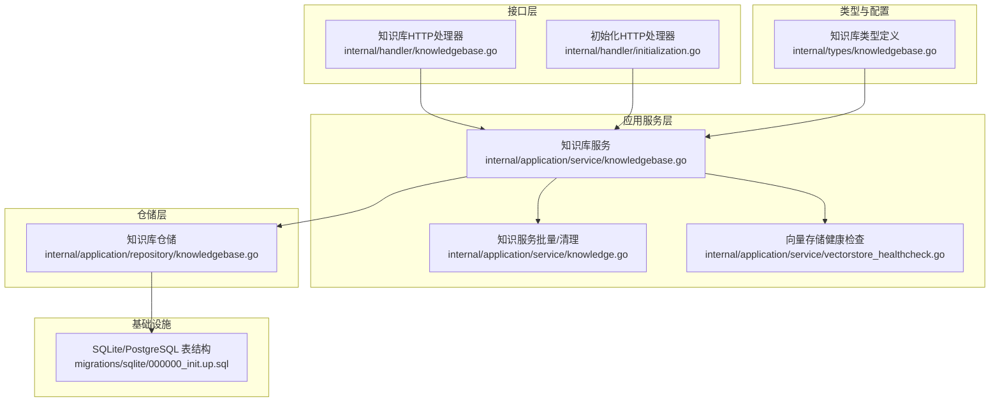
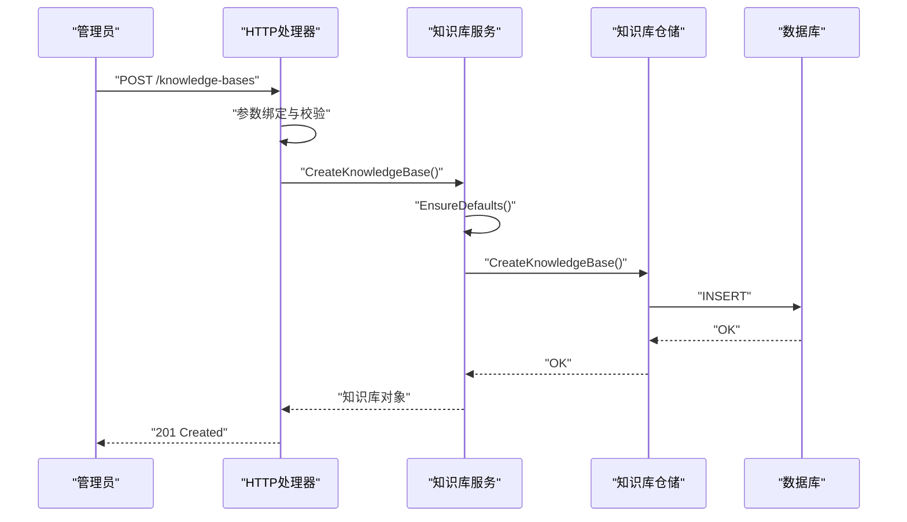
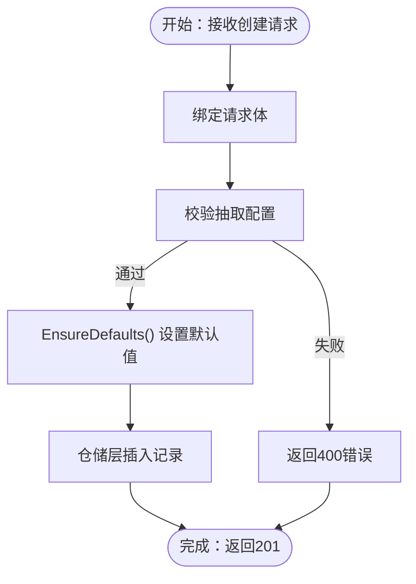
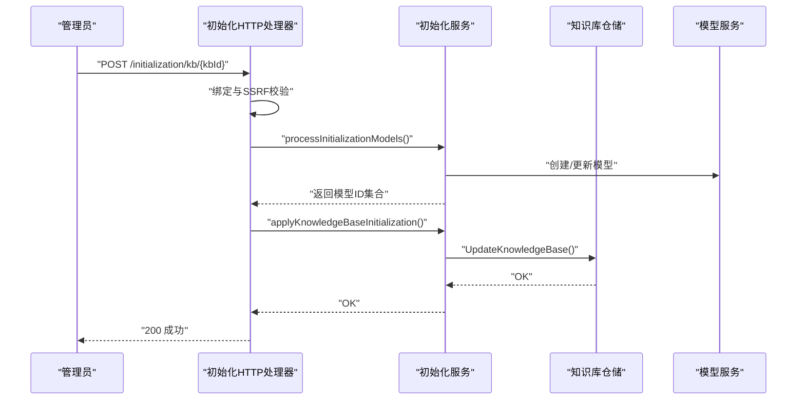
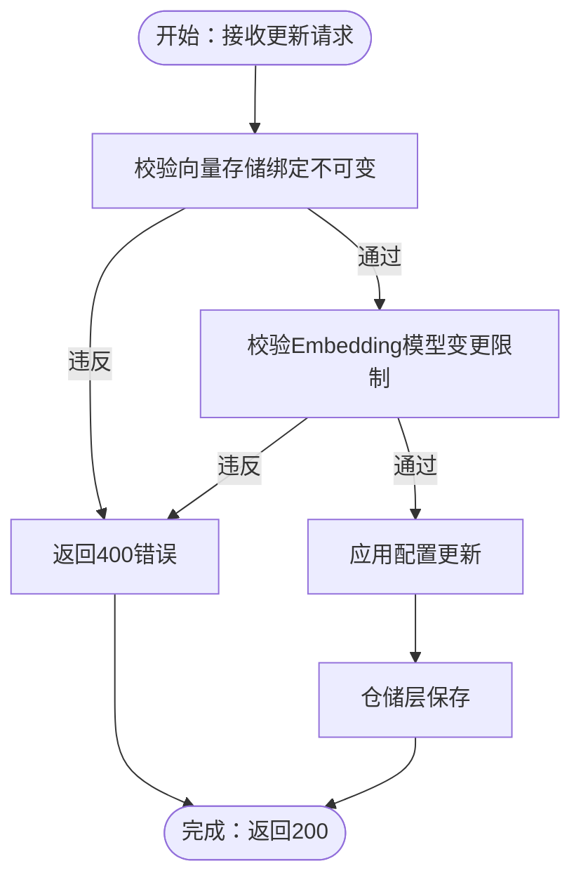
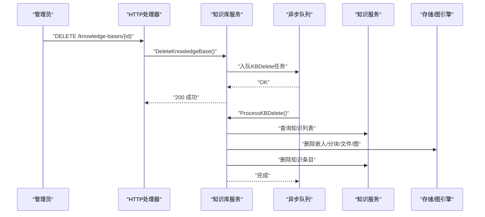
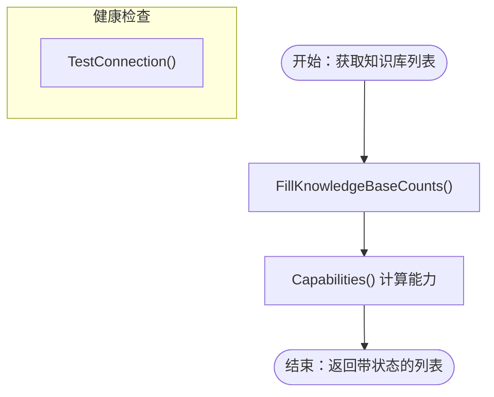
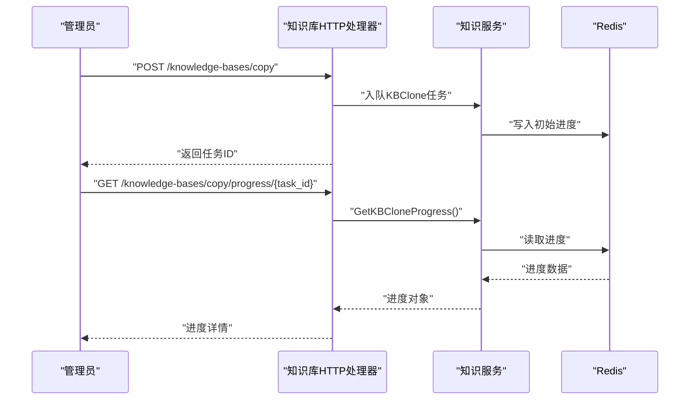
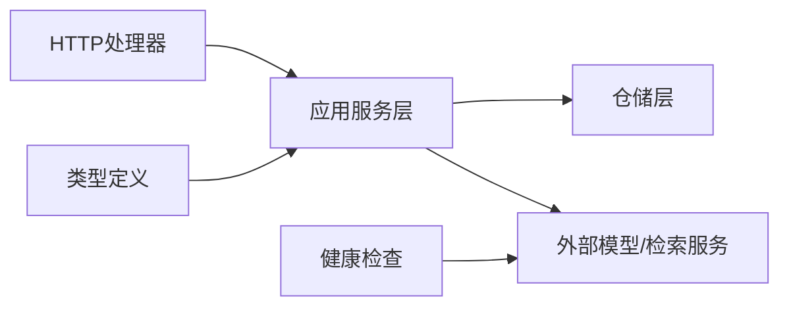

# 知识库生命周期管理

<cite>
**本文引用的文件**
- [knowledgebase.go](file://internal/application/service/knowledgebase.go)
- [knowledgebase.go](file://internal/handler/knowledgebase.go)
- [knowledgebase.go](file://internal/types/knowledgebase.go)
- [knowledgebase.go](file://internal/application/repository/knowledgebase.go)
- [vectorstore_healthcheck.go](file://internal/application/service/vectorstore_healthcheck.go)
- [initialization.go](file://internal/handler/initialization.go)
- [knowledge.go](file://internal/application/service/knowledge.go)
- [knowledge.go](file://internal/handler/knowledge.go)
- [faq.md](file://docs/api/faq.md)
- [knowledge.md](file://docs/api/knowledge.md)
- [initialization.md](file://docs/api/initialization.md)
- [000000_init.up.sql](file://migrations/sqlite/000000_init.up.sql)
- [knowledgebase_sqlite_test.go](file://internal/application/repository/knowledgebase_sqlite_test.go)
</cite>

## 目录
1. [简介](#简介)
2. [项目结构](#项目结构)
3. [核心组件](#核心组件)
4. [架构总览](#架构总览)
5. [详细组件分析](#详细组件分析)
6. [依赖分析](#依赖分析)
7. [性能考虑](#性能考虑)
8. [故障排查指南](#故障排查指南)
9. [结论](#结论)
10. [附录](#附录)

## 简介
本操作文档面向系统管理员，系统化阐述 WeKnora 知识库的完整生命周期管理，覆盖创建、配置、启用、更新、禁用、删除等阶段，并深入解析配置验证机制（类型检查、模型可用性验证、存储配置校验）、变更控制与约束（尤其是向量存储绑定的不可变性限制）、删除安全机制与数据清理策略、状态监控与健康检查、以及批量操作、导入导出与备份恢复等高级能力。文档同时提供可视化流程图与时序图，帮助快速理解端到端流程。

## 项目结构
WeKnora 的知识库生命周期由“HTTP 接口层 → 应用服务层 → 仓储层 → 类型与配置定义 → 数据库迁移”协同完成。关键路径如下：
- HTTP 层：处理请求、鉴权、参数校验与错误返回
- 应用服务层：编排业务规则、跨模块协作、异步任务调度
- 仓储层：数据库 CRUD、事务与隔离
- 类型与配置：知识库结构、配置项、默认值与能力计算
- 健康检查：向量数据库连接测试
- 文档与迁移：API 文档与数据库表结构

图表来源
- [knowledgebase.go:1-800](file://internal/handler/knowledgebase.go#L1-800)
- [initialization.go:1-800](file://internal/handler/initialization.go#L1-800)
- [knowledgebase.go:1-639](file://internal/application/service/knowledgebase.go#L1-639)
- [knowledge.go:8989-9366](file://internal/application/service/knowledge.go#L8989-9366)
- [vectorstore_healthcheck.go:1-229](file://internal/application/service/vectorstore_healthcheck.go#L1-229)
- [knowledgebase.go:1-124](file://internal/application/repository/knowledgebase.go#L1-124)
- [knowledgebase.go:1-625](file://internal/types/knowledgebase.go#L1-625)
- [000000_init.up.sql:50-66](file://migrations/sqlite/000000_init.up.sql#L50-L66)

章节来源
- [knowledgebase.go:1-800](file://internal/handler/knowledgebase.go#L1-800)
- [knowledgebase.go:1-639](file://internal/application/service/knowledgebase.go#L1-639)
- [knowledgebase.go:1-124](file://internal/application/repository/knowledgebase.go#L1-124)
- [knowledgebase.go:1-625](file://internal/types/knowledgebase.go#L1-625)
- [000000_init.up.sql:50-66](file://migrations/sqlite/000000_init.up.sql#L50-L66)

## 核心组件
- HTTP 处理器：负责路由、鉴权、参数绑定与错误处理
- 知识库服务：封装生命周期业务逻辑（创建、更新、删除、计数填充、复制等）
- 知识服务：支持批量删除、清理、复制进度跟踪
- 仓储层：提供知识库的增删改查与排序、置顶等操作
- 类型与配置：定义知识库结构、配置项、默认值、能力计算与序列化
- 健康检查：对多种向量数据库进行连通性与版本检测
- 数据库迁移：定义知识库表结构与字段

章节来源
- [knowledgebase.go:1-639](file://internal/application/service/knowledgebase.go#L1-639)
- [knowledgebase.go:1-124](file://internal/application/repository/knowledgebase.go#L1-124)
- [knowledgebase.go:1-625](file://internal/types/knowledgebase.go#L1-625)
- [vectorstore_healthcheck.go:1-229](file://internal/application/service/vectorstore_healthcheck.go#L1-229)
- [000000_init.up.sql:50-66](file://migrations/sqlite/000000_init.up.sql#L50-L66)

## 架构总览
下图展示了知识库创建、配置、更新、删除的端到端流程与关键交互点：

图表来源
- [knowledgebase.go:116-149](file://internal/handler/knowledgebase.go#L116-L149)
- [knowledgebase.go:74-99](file://internal/application/service/knowledgebase.go#L74-L99)
- [knowledgebase.go:25-28](file://internal/application/repository/knowledgebase.go#L25-L28)

章节来源
- [knowledgebase.go:116-149](file://internal/handler/knowledgebase.go#L116-L149)
- [knowledgebase.go:74-99](file://internal/application/service/knowledgebase.go#L74-L99)
- [knowledgebase.go:25-28](file://internal/application/repository/knowledgebase.go#L25-L28)

## 详细组件分析

### 1) 知识库创建与配置验证
- 参数绑定与校验：HTTP 层对请求体进行绑定，若失败返回 400；随后对抽取配置进行专项校验（文本、标签、节点、关系等）。
- 默认值与类型保障：服务层在创建前调用 EnsureDefaults，确保类型与配置项具备默认值，避免空缺导致的异常。
- 数据持久化：仓储层执行插入，数据库迁移脚本定义了知识库表结构与字段。

图表来源
- [knowledgebase.go:121-132](file://internal/handler/knowledgebase.go#L121-L132)
- [knowledgebase.go:78-85](file://internal/application/service/knowledgebase.go#L78-L85)
- [knowledgebase.go:487-527](file://internal/types/knowledgebase.go#L487-L527)
- [000000_init.up.sql:50-66](file://migrations/sqlite/000000_init.up.sql#L50-L66)

章节来源
- [knowledgebase.go:121-132](file://internal/handler/knowledgebase.go#L121-L132)
- [knowledgebase.go:78-85](file://internal/application/service/knowledgebase.go#L78-L85)
- [knowledgebase.go:487-527](file://internal/types/knowledgebase.go#L487-L527)
- [000000_init.up.sql:50-66](file://migrations/sqlite/000000_init.up.sql#L50-L66)

### 2) 知识库配置与启用（初始化）
- 初始化接口：支持按知识库 ID 执行完整配置更新，包含 LLM、Embedding、重排、多模态、文档分块、存储引擎、知识图谱抽取、问题生成等。
- 配置验证：对 SSRF、多模态存储、重排、知识图谱抽取等进行严格校验；抽取配置通过专用校验函数进行完整性检查。
- 模型可用性：初始化过程中会创建或更新模型记录，确保后续检索与问答可用。
- 存储配置：新字段为存储提供商选择，参数从租户全局配置读取，避免在 KB 层重复存储敏感凭据。

图表来源
- [initialization.go:420-470](file://internal/handler/initialization.go#L420-L470)
- [initialization.go:494-526](file://internal/handler/initialization.go#L494-L526)
- [initialization.go:652-704](file://internal/handler/initialization.go#L652-L704)
- [initialization.go:743-804](file://internal/handler/initialization.go#L743-L804)

章节来源
- [initialization.go:420-470](file://internal/handler/initialization.go#L420-L470)
- [initialization.go:494-526](file://internal/handler/initialization.go#L494-L526)
- [initialization.go:652-704](file://internal/handler/initialization.go#L652-L704)
- [initialization.go:743-804](file://internal/handler/initialization.go#L743-L804)

### 3) 知识库更新与变更控制
- 支持更新名称、描述与配置（分块、图像处理、FAQ/Wiki/抽取配置、索引策略等）。
- 关键约束：
  - 向量存储绑定不可变：VectorStoreID 一经设置不得修改，GORM 层通过 `<-:create` 标签与服务层 DTO 排除更新字段共同保证。
  - Embedding 模型变更限制：若知识库已有文件，不允许修改 Embedding 模型，防止向量空间不一致。
  - 存储引擎变更提示：若已有文件且变更存储引擎，将产生兼容性风险提示。
- 异步任务：复制知识库采用异步队列，进度写入 Redis，便于前端轮询。

图表来源
- [knowledgebase.go:472-514](file://internal/handler/knowledgebase.go#L472-L514)
- [knowledgebase.go:266-333](file://internal/application/service/knowledgebase.go#L266-L333)
- [knowledgebase.go:238-251](file://internal/handler/initialization.go#L238-L251)
- [knowledgebase_sqlite_test.go:82-105](file://internal/application/repository/knowledgebase_sqlite_test.go#L82-L105)

章节来源
- [knowledgebase.go:472-514](file://internal/handler/knowledgebase.go#L472-L514)
- [knowledgebase.go:266-333](file://internal/application/service/knowledgebase.go#L266-L333)
- [knowledgebase.go:238-251](file://internal/handler/initialization.go#L238-L251)
- [knowledgebase_sqlite_test.go:82-105](file://internal/application/repository/knowledgebase_sqlite_test.go#L82-L105)

### 4) 知识库删除与安全清理
- 删除流程：
  - 标记删除：先在数据库中删除知识库记录，并移除组织分享。
  - 异步清理：入队清理任务，删除嵌入、分块、文件、图数据，回收存储用量。
- 清理细节：
  - 嵌入删除：按嵌入模型与类型分组，调用检索引擎删除。
  - 分块与文件：删除所有分块，清理物理文件与提取图片，调整租户存储用量。
  - 图数据：删除命名空间对应的图数据。
  - 知识条目：最后从数据库删除。

图表来源
- [knowledgebase.go:528-562](file://internal/handler/knowledgebase.go#L528-L562)
- [knowledgebase.go:352-408](file://internal/application/service/knowledgebase.go#L352-L408)
- [knowledgebase.go:410-543](file://internal/application/service/knowledgebase.go#L410-L543)
- [knowledge.go:1636-1673](file://internal/application/service/knowledge.go#L1636-L1673)

章节来源
- [knowledgebase.go:528-562](file://internal/handler/knowledgebase.go#L528-L562)
- [knowledgebase.go:352-408](file://internal/application/service/knowledgebase.go#L352-L408)
- [knowledgebase.go:410-543](file://internal/application/service/knowledgebase.go#L410-L543)
- [knowledge.go:1636-1673](file://internal/application/service/knowledge.go#L1636-L1673)

### 5) 状态监控与健康检查
- 知识库状态：
  - 计数与处理状态：服务层在列举时填充知识条目数、分块数、处理中状态与数量。
  - 能力标识：通过 Capabilities 计算向量/关键词/Wiki/图/FAQ 能力，供前端过滤与启用。
- 向量存储健康检查：
  - 支持 Elasticsearch、Postgres、Qdrant、Milvus、Weaviate、SQLite 等引擎的连通性与版本检测。
  - 返回检测到的服务器版本字符串（未知则为空）。

图表来源
- [knowledgebase.go:157-211](file://internal/application/service/knowledgebase.go#L157-L211)
- [knowledgebase.go:529-606](file://internal/types/knowledgebase.go#L529-L606)
- [vectorstore_healthcheck.go:25-50](file://internal/application/service/vectorstore_healthcheck.go#L25-L50)

章节来源
- [knowledgebase.go:157-211](file://internal/application/service/knowledgebase.go#L157-L211)
- [knowledgebase.go:529-606](file://internal/types/knowledgebase.go#L529-L606)
- [vectorstore_healthcheck.go:25-50](file://internal/application/service/vectorstore_healthcheck.go#L25-L50)

### 6) 批量操作、导入导出与备份恢复
- 批量获取知识：支持按 ID 列表批量获取知识条目，便于前端聚合展示。
- FAQ 管理：
  - 批量导入：支持异步导入，返回任务 ID，可通过进度接口查询。
  - 导出：支持将知识库下的 FAQ 条目导出为 CSV。
  - 最近导入结果展示状态：可控制前端是否展示导入结果提示。
- 复制知识库：
  - 支持在同租户内复制知识库，异步执行，进度写入 Redis，支持轮询查询。
  - FAQ 类型与文档类型采用不同同步策略（FAQ 基于条目级复制，文档基于文件哈希差集）。

图表来源
- [knowledgebase.go:589-706](file://internal/handler/knowledgebase.go#L589-L706)
- [knowledgebase.go:708-741](file://internal/handler/knowledgebase.go#L708-L741)
- [knowledge.go:8989-9366](file://internal/application/service/knowledge.go#L8989-L9366)

章节来源
- [knowledge.md:229-301](file://docs/api/knowledge.md#L229-L301)
- [faq.md:1-451](file://docs/api/faq.md#L1-L451)
- [knowledgebase.go:589-706](file://internal/handler/knowledgebase.go#L589-L706)
- [knowledgebase.go:708-741](file://internal/handler/knowledgebase.go#L708-L741)
- [knowledge.go:8989-9366](file://internal/application/service/knowledge.go#L8989-L9366)

### 7) 高级功能：FAQ 导入导出与备份恢复
- FAQ 导入：
  - 支持批量导入与干运行（dry-run），返回任务进度与统计信息（成功/失败/跳过条目数、失败详情或下载地址）。
  - 支持更新最近导入结果的显示状态，控制前端提示。
- FAQ 导出：
  - 将知识库下的所有 FAQ 条目导出为 CSV 文件，便于备份与迁移。
- 备份恢复建议：
  - 结合知识库复制与 FAQ 导出，实现跨环境迁移与灾难恢复。
  - 对于文档类知识库，可结合文件存储与分块元数据进行增量备份。

章节来源
- [faq.md:1-451](file://docs/api/faq.md#L1-L451)
- [knowledgebase.go:589-706](file://internal/handler/knowledgebase.go#L589-L706)
- [knowledge.go:8989-9366](file://internal/application/service/knowledge.go#L8989-L9366)

## 依赖分析
- 组件耦合：
  - HTTP 处理器依赖应用服务层；应用服务层依赖仓储层与外部模型/检索服务；类型定义贯穿各层。
- 不可变性与一致性：
  - VectorStoreID 的不可变性通过 GORM 标签与服务层 DTO 排除实现，配合测试用例保障。
- 外部依赖：
  - 向量数据库客户端（Elasticsearch、Postgres、Qdrant、Milvus、Weaviate）用于健康检查。
  - 异步队列（Asynq）用于删除与复制等重任务。

图表来源
- [knowledgebase.go:1-800](file://internal/handler/knowledgebase.go#L1-800)
- [knowledgebase.go:1-639](file://internal/application/service/knowledgebase.go#L1-639)
- [knowledgebase.go:1-124](file://internal/application/repository/knowledgebase.go#L1-124)
- [knowledgebase.go:1-625](file://internal/types/knowledgebase.go#L1-625)
- [vectorstore_healthcheck.go:1-229](file://internal/application/service/vectorstore_healthcheck.go#L1-229)

章节来源
- [knowledgebase.go:1-800](file://internal/handler/knowledgebase.go#L1-800)
- [knowledgebase.go:1-639](file://internal/application/service/knowledgebase.go#L1-639)
- [knowledgebase.go:1-124](file://internal/application/repository/knowledgebase.go#L1-124)
- [knowledgebase.go:1-625](file://internal/types/knowledgebase.go#L1-625)
- [vectorstore_healthcheck.go:1-229](file://internal/application/service/vectorstore_healthcheck.go#L1-229)

## 性能考虑
- 异步化重任务：删除与复制采用异步队列，避免阻塞主请求线程。
- 分批处理：复制知识库时按批次处理，降低内存与并发压力。
- 嵌入删除分组：按嵌入模型与类型分组，减少跨模型调用次数。
- 计数与处理状态延迟计算：仅在需要时查询数据库，减少不必要的负载。

## 故障排查指南
- 创建失败（400）：
  - 检查请求体格式与抽取配置完整性；确认文本、标签、节点、关系等字段非空且唯一。
- 更新失败（400）：
  - 若提示“已有文件，无法修改 Embedding 模型”，需先清空知识库或保持模型不变。
  - 若提示“向量存储绑定不可变”，请勿尝试修改 VectorStoreID。
- 删除失败（500）：
  - 检查异步队列是否正常；查看清理任务日志；确认嵌入、分块、文件与图引擎可用。
- 健康检查失败：
  - 根据引擎类型检查地址、认证与版本；确认网络连通性与防火墙策略。

章节来源
- [knowledgebase.go:121-132](file://internal/handler/knowledgebase.go#L121-L132)
- [knowledgebase.go:238-251](file://internal/handler/initialization.go#L238-L251)
- [knowledgebase.go:352-408](file://internal/application/service/knowledgebase.go#L352-L408)
- [vectorstore_healthcheck.go:25-50](file://internal/application/service/vectorstore_healthcheck.go#L25-L50)

## 结论
WeKnora 的知识库生命周期管理通过严格的参数校验、不可变性约束与异步清理机制，确保在复杂场景下的稳定性与一致性。管理员可借助初始化接口完成模型与配置的启用，利用批量与复制能力提升运维效率，并通过健康检查与状态监控保障系统健康。建议在生产环境中遵循“先备份、后变更”的原则，配合异步任务与进度查询，实现平滑的运维升级。

## 附录
- API 参考：
  - 初始化配置：[初始化API文档:22-100](file://docs/api/initialization.md#L22-L100)
  - 知识批量获取：[知识API文档:229-301](file://docs/api/knowledge.md#L229-L301)
  - FAQ 管理：[FAQ API文档:1-451](file://docs/api/faq.md#L1-L451)
- 数据库表结构：
  - 知识库表字段与默认值：[SQLite迁移脚本:50-66](file://migrations/sqlite/000000_init.up.sql#L50-L66)