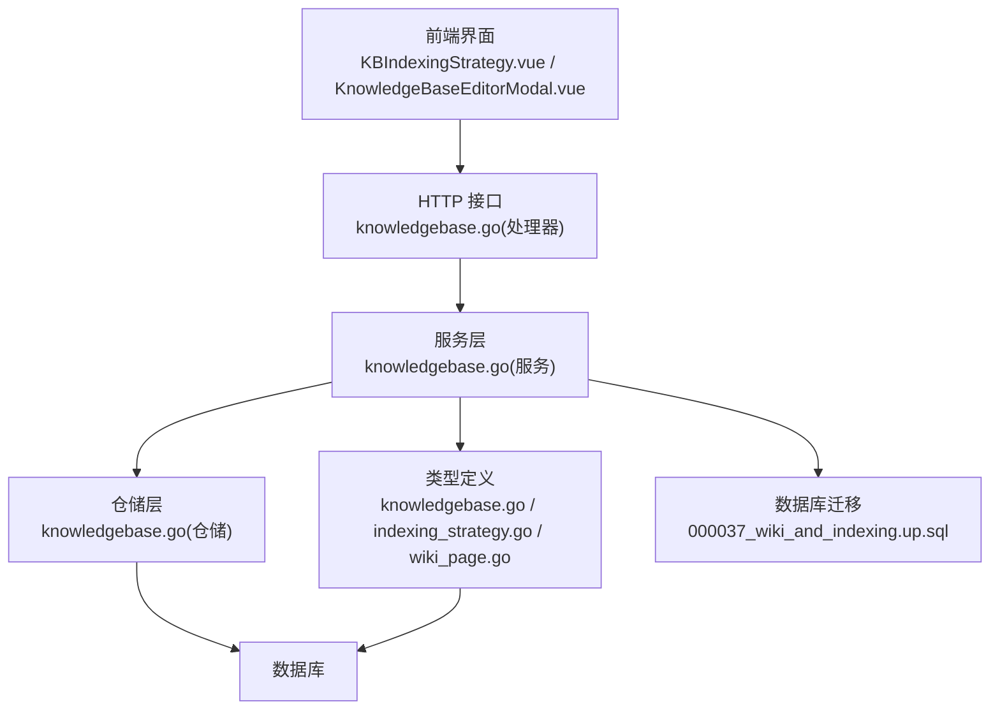
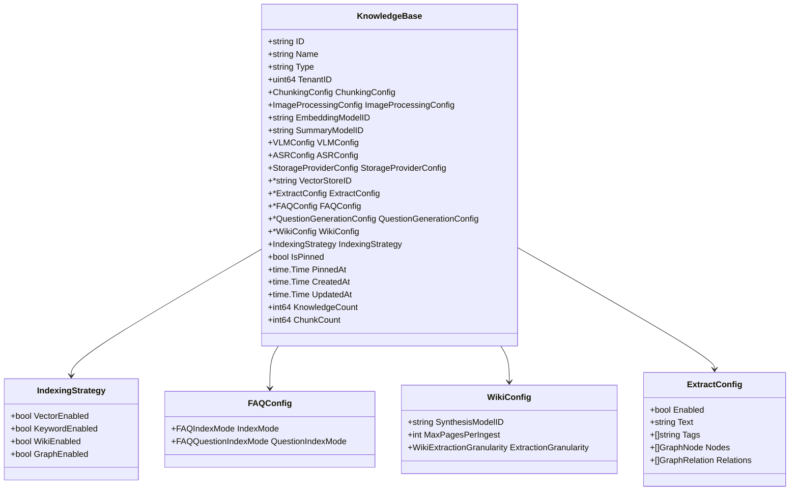
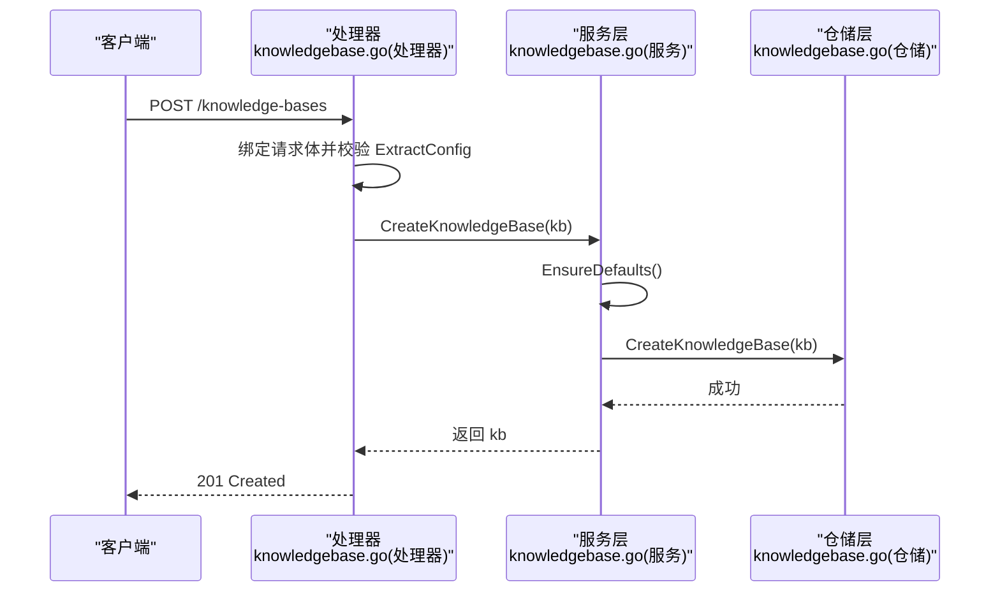
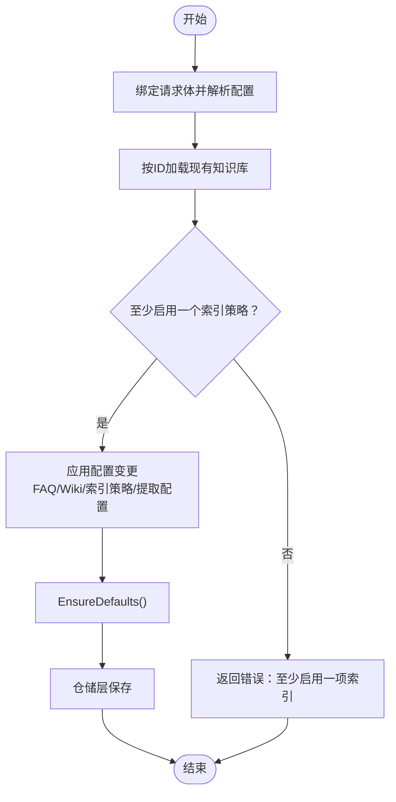
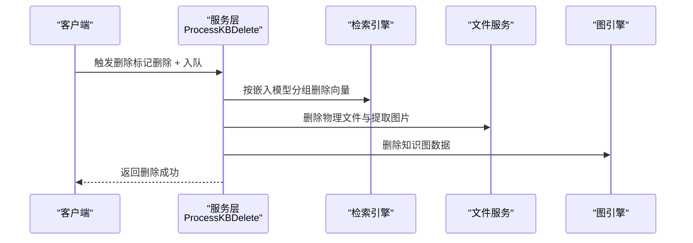
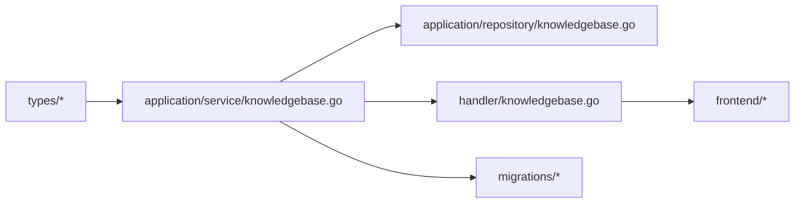

# 知识库管理

<cite>
**本文引用的文件**
- [knowledgebase.go](file://internal/types/knowledgebase.go)
- [indexing_strategy.go](file://internal/types/indexing_strategy.go)
- [wiki_page.go](file://internal/types/wiki_page.go)
- [knowledgebase.go](file://internal/application/service/knowledgebase.go)
- [knowledgebase.go](file://internal/application/repository/knowledgebase.go)
- [knowledgebase.go](file://internal/handler/knowledgebase.go)
- [knowledgebase.go](file://client/knowledgebase.go)
- [KBIndexingStrategy.vue](file://frontend/src/views/knowledge/settings/KBIndexingStrategy.vue)
- [KnowledgeBaseEditorModal.vue](file://frontend/src/views/knowledge/KnowledgeBaseEditorModal.vue)
- [zh-CN.ts](file://frontend/src/i18n/locales/zh-CN.ts)
- [organization.go](file://internal/types/organization.go)
- [kbshare.go](file://internal/application/service/kbshare.go)
- [knowledge.go](file://internal/handler/knowledge.go)
- [knowledgebase.go](file://internal/tensorflow/knowledgebase.go)
- [000037_wiki_and_indexing.up.sql](file://migrations/versioned/000037_wiki_and_indexing.up.sql)
- [knowledge.md](file://docs/api/knowledge.md)
</cite>

## 目录
1. [简介](#简介)
2. [项目结构](#项目结构)
3. [核心组件](#核心组件)
4. [架构总览](#架构总览)
5. [详细组件分析](#详细组件分析)
6. [依赖关系分析](#依赖关系分析)
7. [性能考量](#性能考量)
8. [故障排查指南](#故障排查指南)
9. [结论](#结论)
10. [附录](#附录)

## 简介
本文件为 WeKnora 知识库管理系统的权威操作与技术文档，面向管理员与开发者，系统性阐述知识库实体设计、类型分类（文档、FAQ、Wiki）、配置选项与工作流，覆盖创建、更新、删除的全流程，包括配置验证、权限控制、数据一致性保障、能力检测、向量与关键词搜索启用、Wiki 配置、提取配置、FAQ 索引模式、知识库共享与租户隔离、临时知识库等高级功能。

## 项目结构
WeKnora 采用分层架构：前端通过 API 与后端交互；后端服务层封装业务规则，仓储层负责持久化；类型定义统一于 types 包，迁移脚本确保数据库演进。知识库管理涉及以下关键模块：
- 类型与配置：知识库实体、索引策略、Wiki 配置、FAQ 配置、提取配置
- 服务层：知识库生命周期管理、计数统计、异步删除、复制
- 仓储层：数据库访问接口与实现
- 处理器层：HTTP 接口、鉴权与权限校验
- 前端：可视化编辑器、索引策略开关、Wiki 设置面板
- 迁移：索引策略列与默认值初始化

图表来源
- [knowledgebase.go:108-143](file://internal/handler/knowledgebase.go#L108-L143)
- [knowledgebase.go:74-99](file://internal/application/service/knowledgebase.go#L74-L99)
- [knowledgebase.go:25-40](file://internal/application/repository/knowledgebase.go#L25-L40)
- [knowledgebase.go:40-108](file://internal/types/knowledgebase.go#L40-L108)
- [indexing_strategy.go:8-37](file://internal/types/indexing_strategy.go#L8-L37)
- [wiki_page.go:149-161](file://internal/types/wiki_page.go#L149-L161)
- [000037_wiki_and_indexing.up.sql:80-100](file://migrations/versioned/000037_wiki_and_indexing.up.sql#L80-L100)

章节来源
- [knowledgebase.go:108-143](file://internal/handler/knowledgebase.go#L108-L143)
- [knowledgebase.go:74-99](file://internal/application/service/knowledgebase.go#L74-L99)
- [knowledgebase.go:25-40](file://internal/application/repository/knowledgebase.go#L25-L40)
- [knowledgebase.go:40-108](file://internal/types/knowledgebase.go#L40-L108)
- [indexing_strategy.go:8-37](file://internal/types/indexing_strategy.go#L8-L37)
- [wiki_page.go:149-161](file://internal/types/wiki_page.go#L149-L161)
- [000037_wiki_and_indexing.up.sql:80-100](file://migrations/versioned/000037_wiki_and_indexing.up.sql#L80-L100)

## 核心组件
- 知识库实体与类型
  - 支持三种类型：文档、FAQ、Wiki
  - 关键字段：ID、名称、类型、租户ID、嵌入模型ID、图像处理配置、存储提供方配置、向量库绑定、索引策略、是否置顶、创建/更新时间、计数统计等
- 索引策略
  - 控制向量（语义）搜索、关键词（BM25）搜索、Wiki 自动生成、知识图谱抽取四个管道的启用状态
  - 默认策略：向量与关键词启用，Wiki 与图谱禁用
- FAQ 配置
  - 索引模式：仅问题、问题+答案
  - 问题索引模式：合并或分离
- Wiki 配置
  - 合成模型ID、单次最大页面数、提取粒度（聚焦/标准/详尽）
- 提取配置
  - 知识图谱抽取开关、文本标签、节点与关系
- 能力检测
  - 通过 Capabilities 计算向量、关键词、Wiki、图谱、FAQ 能力位，前端据此过滤与启用功能

章节来源
- [knowledgebase.go:12-18](file://internal/types/knowledgebase.go#L12-L18)
- [knowledgebase.go:40-108](file://internal/types/knowledgebase.go#L40-L108)
- [indexing_strategy.go:8-37](file://internal/types/indexing_strategy.go#L8-L37)
- [knowledgebase.go:464-485](file://internal/types/knowledgebase.go#L464-L485)
- [wiki_page.go:149-161](file://internal/types/wiki_page.go#L149-L161)
- [knowledgebase.go:438-462](file://internal/types/knowledgebase.go#L438-L462)
- [knowledgebase.go:529-574](file://internal/types/knowledgebase.go#L529-L574)

## 架构总览
知识库管理遵循“类型定义—服务层—仓储层—持久化”的分层设计。前端通过编辑器提交配置，处理器进行参数绑定与配置校验，服务层执行业务逻辑（创建/更新/删除/复制），仓储层完成数据持久化，迁移脚本确保数据库结构演进。

图表来源
- [knowledgebase.go:40-108](file://internal/types/knowledgebase.go#L40-L108)
- [indexing_strategy.go:8-20](file://internal/types/indexing_strategy.go#L8-L20)
- [knowledgebase.go:464-485](file://internal/types/knowledgebase.go#L464-L485)
- [wiki_page.go:149-161](file://internal/types/wiki_page.go#L149-L161)
- [knowledgebase.go:438-462](file://internal/types/knowledgebase.go#L438-L462)

## 详细组件分析

### 知识库实体与类型
- 类型常量：文档、FAQ、Wiki
- 关键字段与职责：
  - 租户隔离：TenantID
  - 分块与图像：ChunkingConfig、ImageProcessingConfig
  - 多模态：VLMConfig、ASRConfig
  - 存储：StorageProviderConfig（新方案）与 StorageConfig（兼容旧方案）
  - 向量库绑定：VectorStoreID（创建后不可修改）
  - 配置：ExtractConfig、FAQConfig、QuestionGenerationConfig、WikiConfig
  - 策略：IndexingStrategy
  - 视图辅助：IsPinned、PinnedAt、计数统计字段
- 默认值与兼容性：
  - EnsureDefaults：类型默认、FAQ 配置默认、索引策略默认、ExtractConfig 同步到 IndexingStrategy
  - 反序列化兼容：cos_config → storage_provider_config

章节来源
- [knowledgebase.go:12-18](file://internal/types/knowledgebase.go#L12-L18)
- [knowledgebase.go:40-108](file://internal/types/knowledgebase.go#L40-L108)
- [knowledgebase.go:487-527](file://internal/types/knowledgebase.go#L487-L527)
- [knowledgebase.go:218-240](file://internal/types/knowledgebase.go#L218-L240)

### 索引策略与能力检测
- 索引策略字段：向量、关键词、Wiki、图谱四类管道
- 默认策略：向量与关键词启用，Wiki 与图谱禁用
- 能力检测：Capabilities 将根据策略与类型计算能力位，前端据此筛选可用 KB
- 前端开关：KBIndexingStrategy.vue 展示并同步策略变更

章节来源
- [indexing_strategy.go:8-37](file://internal/types/indexing_strategy.go#L8-L37)
- [knowledgebase.go:529-574](file://internal/types/knowledgebase.go#L529-L574)
- [KBIndexingStrategy.vue:1-85](file://frontend/src/views/knowledge/settings/KBIndexingStrategy.vue#L1-L85)

### FAQ 配置与索引模式
- 索引模式：
  - 仅问题：提升检索精度
  - 问题+答案：提升召回率
- 问题索引模式：
  - 合并：标准问题与相似问题合并索引
  - 分离：独立索引，更精确但占用更多空间
- 前端表单：支持选择索引模式与问题索引模式，并提供引导说明

章节来源
- [knowledgebase.go:20-28](file://internal/types/knowledgebase.go#L20-L28)
- [knowledgebase.go:30-38](file://internal/types/knowledgebase.go#L30-L38)
- [knowledgebase.go:464-485](file://internal/types/knowledgebase.go#L464-L485)
- [KnowledgeBaseEditorModal.vue:165-184](file://frontend/src/views/knowledge/KnowledgeBaseEditorModal.vue#L165-L184)
- [zh-CN.ts:2116-2142](file://frontend/src/i18n/locales/zh-CN.ts#L2116-L2142)

### Wiki 配置与提取粒度
- Wiki 配置项：
  - 合成模型ID：用于 Wiki 页面生成与更新
  - 单次最大页面数：限制每次 Ingest 创建/更新的页面数量
  - 提取粒度：聚焦/标准/详尽，控制候选 slug 数量
- 提取粒度规范化：未知值回退为标准粒度
- 前端编辑器：加载与保存 Wiki 配置，支持粒度规范化

章节来源
- [wiki_page.go:106-147](file://internal/types/wiki_page.go#L106-L147)
- [wiki_page.go:149-161](file://internal/types/wiki_page.go#L149-L161)
- [KnowledgeBaseEditorModal.vue:620-653](file://frontend/src/views/knowledge/KnowledgeBaseEditorModal.vue#L620-L653)
- [zh-CN.ts:2129-2142](file://frontend/src/i18n/locales/zh-CN.ts#L2129-L2142)

### 提取配置（知识图谱）
- ExtractConfig：启用/禁用抽取、文本标签、节点与关系
- 与索引策略联动：当 ExtractConfig.Enabled 为真且 IndexingStrategy.GraphEnabled 为假时，自动同步启用图谱抽取

章节来源
- [knowledgebase.go:438-462](file://internal/types/knowledgebase.go#L438-L462)
- [knowledgebase.go:516-527](file://internal/types/knowledgebase.go#L516-L527)

### 知识库创建流程
- 请求入口：POST /knowledge-bases
- 参数绑定与校验：请求体绑定到 KnowledgeBase，校验 ExtractConfig
- 服务层：
  - 生成 ID、填充租户、时间戳
  - EnsureDefaults 设置默认值
  - 仓储层持久化
- 返回：创建成功后的知识库对象

图表来源
- [knowledgebase.go:108-143](file://internal/handler/knowledgebase.go#L108-L143)
- [knowledgebase.go:74-99](file://internal/application/service/knowledgebase.go#L74-L99)
- [knowledgebase.go:25-28](file://internal/application/repository/knowledgebase.go#L25-L28)

章节来源
- [knowledgebase.go:108-143](file://internal/handler/knowledgebase.go#L108-L143)
- [knowledgebase.go:74-99](file://internal/application/service/knowledgebase.go#L74-L99)
- [knowledgebase.go:25-28](file://internal/application/repository/knowledgebase.go#L25-L28)

### 知识库更新流程
- 请求入口：PUT /knowledge-bases/{id}
- 服务层：
  - 获取现有知识库
  - 更新名称、描述与配置（ChunkingConfig、ImageProcessingConfig、FAQConfig、WikiConfig、IndexingStrategy）
  - 校验至少开启一个索引策略
  - 当启用 Wiki 时确保 WikiConfig 存在
  - 同步 GraphEnabled 到 ExtractConfig.Enabled
  - EnsureDefaults
  - 仓储层保存
- 返回：更新后的知识库对象

图表来源
- [knowledgebase.go:266-333](file://internal/application/service/knowledgebase.go#L266-L333)

章节来源
- [knowledgebase.go:266-333](file://internal/application/service/knowledgebase.go#L266-L333)

### 知识库删除流程
- 请求入口：DELETE /knowledge-bases/{id}
- 服务层：
  - 标记删除知识库记录
  - 清理组织分享记录
  - 异步任务队列：删除嵌入、分块、文件、图数据
- 异步清理流程：

图表来源
- [knowledgebase.go:352-408](file://internal/application/service/knowledgebase.go#L352-L408)
- [knowledgebase.go:410-543](file://internal/application/service/knowledgebase.go#L410-L543)

章节来源
- [knowledgebase.go:352-408](file://internal/application/service/knowledgebase.go#L352-L408)
- [knowledgebase.go:410-543](file://internal/application/service/knowledgebase.go#L410-L543)

### 知识库复制与克隆
- 复制接口：CopyKnowledgeBase 支持同租户浅拷贝，目标为空则新建目标 KB 并复制配置
- 前端调用：复制后返回任务进度查询接口

章节来源
- [knowledgebase.go:591-638](file://internal/application/service/knowledgebase.go#L591-L638)
- [knowledgebase.go:382-422](file://client/knowledgebase.go#L382-L422)

### 权限控制与租户隔离
- 租户隔离：仓储层提供按租户查询与校验方法
- 权限判定：
  - 所有者：租户ID匹配
  - 共享访问：检查共享权限与来源租户
  - 代理共享：通过共享代理判断访问权限
- 前端展示：根据权限决定可见性与操作按钮

章节来源
- [knowledgebase.go:42-52](file://internal/application/repository/knowledgebase.go#L42-L52)
- [knowledge.go:68-105](file://internal/handler/knowledge.go#L68-L105)
- [organization.go:182-211](file://internal/types/organization.go#L182-L211)
- [kbshare.go:227-270](file://internal/application/service/kbshare.go#L227-L270)

### 知识库共享与跨租户访问
- 共享记录：组织成员角色、来源租户、共享时间等
- 共享信息聚合：统计知识/分块数量，合并重复 KB
- 跨租户访问：通过共享 KB 的来源租户上下文访问

章节来源
- [organization.go:182-211](file://internal/types/organization.go#L182-L211)
- [kbshare.go:227-270](file://internal/application/service/kbshare.go#L227-L270)

### 临时知识库
- IsTemporary 字段：用于标识临时知识库，UI 默认隐藏
- 用途：临时会话、测试、一次性任务等

章节来源
- [knowledgebase.go:48-49](file://internal/types/knowledgebase.go#L48-L49)

### 能力检测与前端筛选
- Capabilities：向量、关键词、Wiki、图谱、FAQ 能力位
- 前端：基于能力位过滤可用 KB，指导工具选择与界面显示

章节来源
- [knowledgebase.go:529-574](file://internal/types/knowledgebase.go#L529-L574)

### 索引策略迁移与默认值
- 迁移脚本：新增 indexing_strategy JSONB 列，默认启用向量与关键词，禁用 Wiki 与图谱
- 回填：历史数据统一设置默认策略

章节来源
- [000037_wiki_and_indexing.up.sql:80-100](file://migrations/versioned/000037_wiki_and_indexing.up.sql#L80-L100)

### 前端编辑器与配置面板
- 索引策略开关：KBIndexingStrategy.vue
- Wiki 设置：合成模型、最大页面数、提取粒度
- FAQ 设置：索引模式、问题索引模式
- 配置联动：策略变更时自动应用/撤销 Wiki-only 预设

章节来源
- [KBIndexingStrategy.vue:1-85](file://frontend/src/views/knowledge/settings/KBIndexingStrategy.vue#L1-L85)
- [KnowledgeBaseEditorModal.vue:620-727](file://frontend/src/views/knowledge/KnowledgeBaseEditorModal.vue#L620-L727)
- [zh-CN.ts:2116-2142](file://frontend/src/i18n/locales/zh-CN.ts#L2116-L2142)

## 依赖关系分析
- 类型依赖：知识库实体依赖索引策略、FAQ/Wiki/提取配置
- 服务依赖：服务层依赖仓储、模型服务、检索引擎注册表、文件服务、图引擎、任务队列
- 前端依赖：编辑器依赖 i18n、API、路由与工具函数

图表来源
- [knowledgebase.go:40-108](file://internal/types/knowledgebase.go#L40-L108)
- [knowledgebase.go:21-62](file://internal/application/service/knowledgebase.go#L21-L62)
- [knowledgebase.go:15-23](file://internal/application/repository/knowledgebase.go#L15-L23)
- [knowledgebase.go:108-143](file://internal/handler/knowledgebase.go#L108-L143)

章节来源
- [knowledgebase.go:21-62](file://internal/application/service/knowledgebase.go#L21-L62)
- [knowledgebase.go:15-23](file://internal/application/repository/knowledgebase.go#L15-L23)
- [knowledgebase.go:108-143](file://internal/handler/knowledgebase.go#L108-L143)

## 性能考量
- 索引策略选择：仅启用必要的管道，减少向量与关键词索引的资源消耗
- 分块策略：合理设置分块大小与重叠，平衡召回与延迟
- 图谱抽取：仅在需要时启用，避免不必要的计算开销
- 异步删除：将重型清理操作放入队列，避免阻塞主流程
- 存储提供方：统一使用 KB 级别存储提供方配置，减少凭证管理复杂度

## 故障排查指南
- 创建失败
  - 检查请求体绑定与 ExtractConfig 校验
  - 查看服务层日志与错误码
- 更新失败
  - 确认至少启用一个索引策略
  - 检查 WikiConfig 是否存在（启用 Wiki 时）
- 删除异常
  - 确认异步任务已入队
  - 检查向量删除、文件清理、图数据删除的日志
- 权限拒绝
  - 核对租户上下文与共享权限
  - 检查代理共享访问路径

章节来源
- [knowledgebase.go:108-143](file://internal/handler/knowledgebase.go#L108-L143)
- [knowledgebase.go:266-333](file://internal/application/service/knowledgebase.go#L266-L333)
- [knowledgebase.go:352-408](file://internal/application/service/knowledgebase.go#L352-L408)
- [knowledge.go:68-105](file://internal/handler/knowledge.go#L68-L105)

## 结论
WeKnora 的知识库管理以类型与配置为中心，通过清晰的索引策略、完善的权限控制与异步清理机制，实现了灵活、可扩展、安全的多租户知识库管理。FAQ、Wiki、图谱等特性通过配置驱动，既满足通用需求，又允许精细化调优。建议在生产环境中：
- 明确索引策略与分块配置
- 启用必要的能力并定期评估成本
- 使用共享与租户隔离保障协作与安全
- 通过异步任务与迁移脚本确保数据一致性与可维护性

## 附录
- API 参考：知识库 CRUD 与相关接口
- 前端操作：编辑器、索引策略开关、Wiki 设置面板

章节来源
- [knowledge.md:303-423](file://docs/api/knowledge.md#L303-L423)