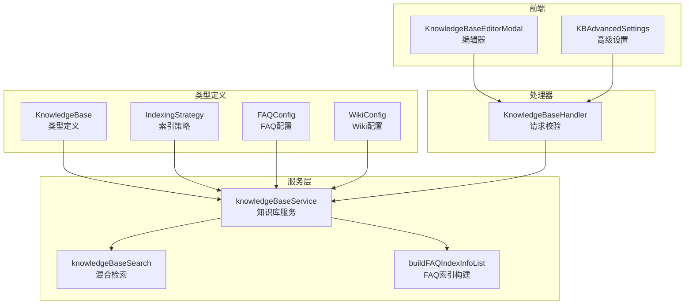
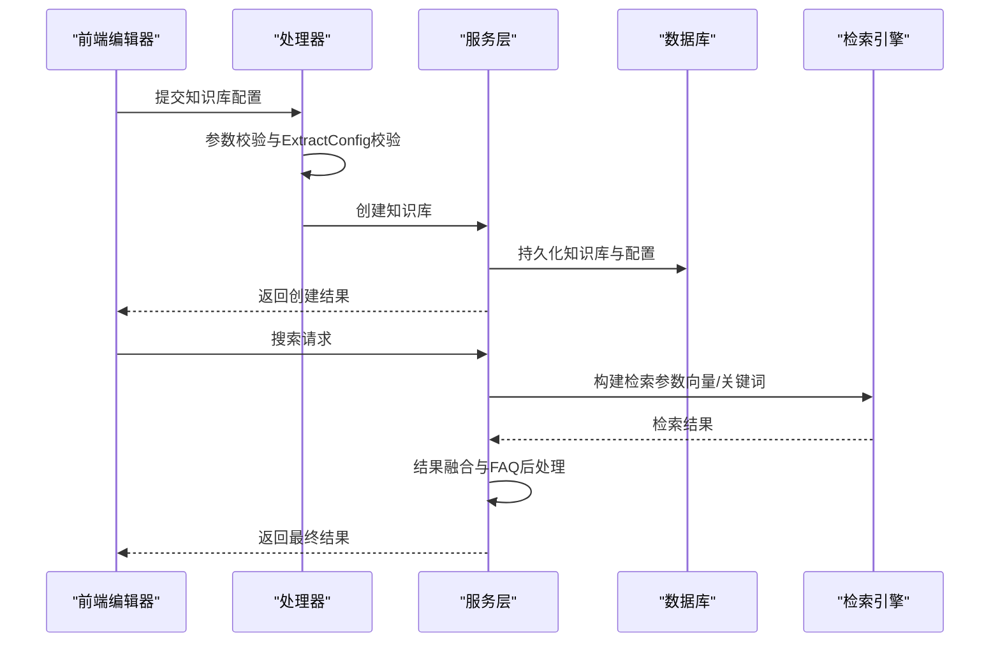
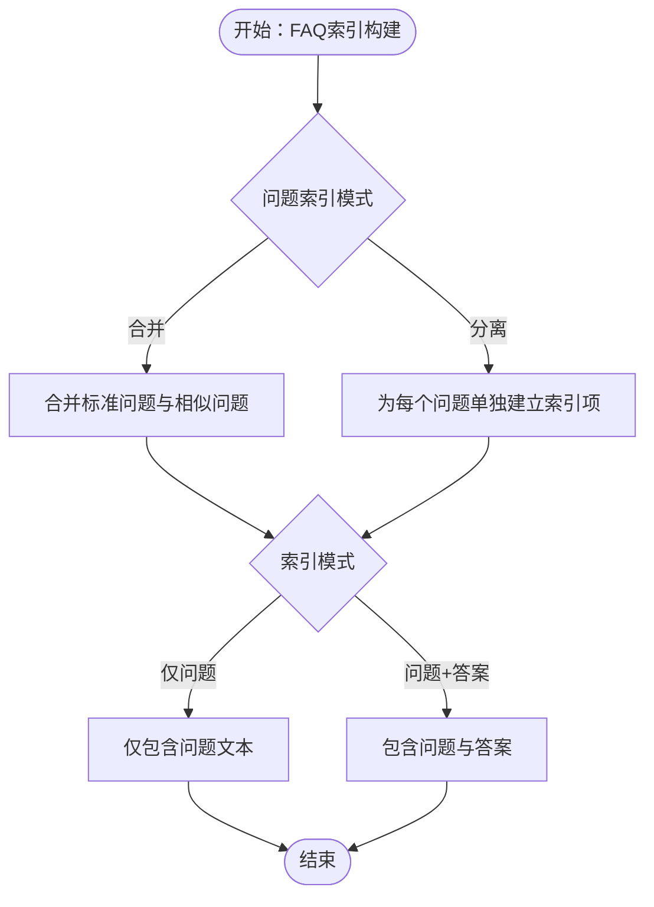
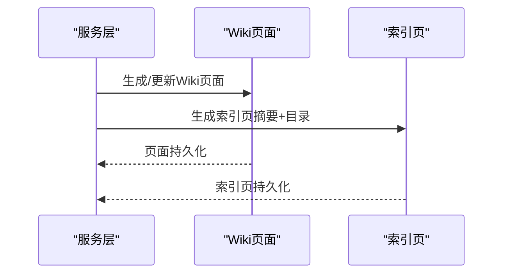
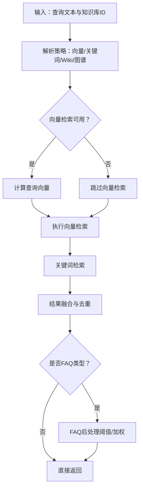
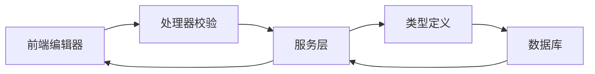

# 知识库类型配置

<cite>
**本文档引用的文件**
- [knowledgebase.go](file://internal/types/knowledgebase.go)
- [faq.go](file://internal/types/faq.go)
- [wiki_page.go](file://internal/types/wiki_page.go)
- [indexing_strategy.go](file://internal/types/indexing_strategy.go)
- [knowledgebase.go](file://internal/application/service/knowledgebase.go)
- [knowledgebase_search.go](file://internal/application/service/knowledgebase_search.go)
- [knowledgebase.go](file://internal/handler/knowledgebase.go)
- [KnowledgeBaseEditorModal.vue](file://frontend/src/views/knowledge/KnowledgeBaseEditorModal.vue)
- [KBAdvancedSettings.vue](file://frontend/src/views/knowledge/settings/KBAdvancedSettings.vue)
- [000037_wiki_and_indexing.up.sql](file://migrations/versioned/000037_wiki_and_indexing.up.sql)
- [000037_wiki_and_indexing.down.sql](file://migrations/versioned/000037_wiki_and_indexing.down.sql)
- [000014_storage_provider_config.up.sql](file://migrations/versioned/000014_storage_provider_config.up.sql)
- [000031_add_asr_config.up.sql](file://migrations/versioned/000031_add_asr_config.up.sql)
- [000031_add_asr_config.down.sql](file://migrations/versioned/000031_add_asr_config.down.sql)
</cite>

## 目录
1. [简介](#简介)
2. [项目结构](#项目结构)
3. [核心组件](#核心组件)
4. [架构总览](#架构总览)
5. [详细组件分析](#详细组件分析)
6. [依赖分析](#依赖分析)
7. [性能考虑](#性能考虑)
8. [故障排查指南](#故障排查指南)
9. [结论](#结论)
10. [附录](#附录)

## 简介
本指南面向系统管理员与开发者，全面解析 WeKnora 知识库类型配置体系，重点覆盖三类知识库类型（文档、FAQ、Wiki）的配置差异、FAQ 的索引模式与问题索引模式策略、Wiki 的启用条件与页面生成机制，并阐述不同类型的索引策略、检索方式与 UI 展示差异。文档还提供配置验证规则、错误处理机制与最佳实践建议，帮助您安全高效地完成知识库配置。

## 项目结构
WeKnora 的知识库配置由后端类型定义、服务层逻辑、处理器校验与前端编辑器共同组成。核心结构如下：
- 类型定义：知识库实体、索引策略、FAQ 配置、Wiki 配置等
- 服务层：知识库创建、检索、混合检索、FAQ 索引构建等
- 处理器：请求参数校验、错误处理
- 前端：知识库编辑器、高级设置面板
- 迁移：索引策略与 Wiki 功能的数据库演进

图表来源
- [knowledgebase.go:41-108](file://internal/types/knowledgebase.go#L41-L108)
- [indexing_strategy.go:8-20](file://internal/types/indexing_strategy.go#L8-L20)
- [knowledgebase.go:75-99](file://internal/application/service/knowledgebase.go#L75-L99)
- [knowledgebase_search.go:84-168](file://internal/application/service/knowledgebase_search.go#L84-L168)
- [knowledgebase.go:116-142](file://internal/handler/knowledgebase.go#L116-L142)
- [KnowledgeBaseEditorModal.vue:1-200](file://frontend/src/views/knowledge/KnowledgeBaseEditorModal.vue#L1-L200)
- [KBAdvancedSettings.vue:1-33](file://frontend/src/views/knowledge/settings/KBAdvancedSettings.vue#L1-L33)

章节来源
- [knowledgebase.go:1-108](file://internal/types/knowledgebase.go#L1-L108)
- [indexing_strategy.go:1-78](file://internal/types/indexing_strategy.go#L1-L78)
- [knowledgebase.go:75-99](file://internal/application/service/knowledgebase.go#L75-L99)
- [knowledgebase_search.go:84-168](file://internal/application/service/knowledgebase_search.go#L84-L168)
- [knowledgebase.go:116-142](file://internal/handler/knowledgebase.go#L116-L142)
- [KnowledgeBaseEditorModal.vue:1-200](file://frontend/src/views/knowledge/KnowledgeBaseEditorModal.vue#L1-L200)
- [KBAdvancedSettings.vue:1-33](file://frontend/src/views/knowledge/settings/KBAdvancedSettings.vue#L1-L33)

## 核心组件
- 知识库类型与配置
  - 知识库类型：文档、FAQ、Wiki
  - 索引策略：向量检索、关键词检索、Wiki 自动生成、知识图谱抽取
  - FAQ 配置：索引模式（仅问题、问题+答案）、问题索引模式（合并、分离）
  - Wiki 配置：合成模型、每批最大页面数、提取粒度
- 能力标志与默认值
  - 能力标志：向量、关键词、Wiki、图谱、FAQ
  - 默认策略：向量与关键词开启，Wiki 与图谱关闭
  - 类型特定配置清理与默认填充

章节来源
- [knowledgebase.go:12-18](file://internal/types/knowledgebase.go#L12-L18)
- [knowledgebase.go:20-38](file://internal/types/knowledgebase.go#L20-L38)
- [knowledgebase.go:464-485](file://internal/types/knowledgebase.go#L464-L485)
- [knowledgebase.go:487-527](file://internal/types/knowledgebase.go#L487-L527)
- [knowledgebase.go:529-574](file://internal/types/knowledgebase.go#L529-L574)

## 架构总览
知识库配置贯穿“类型定义—服务处理—检索融合—UI 展示”的闭环。前端编辑器负责收集配置并通过处理器校验，服务层据此执行创建与检索；检索阶段按索引策略组合向量与关键词结果并进行融合与后处理（FAQ 特殊处理）。

图表来源
- [knowledgebase.go:116-142](file://internal/handler/knowledgebase.go#L116-L142)
- [knowledgebase.go:75-99](file://internal/application/service/knowledgebase.go#L75-L99)
- [knowledgebase_search.go:84-168](file://internal/application/service/knowledgebase_search.go#L84-L168)

章节来源
- [knowledgebase.go:116-142](file://internal/handler/knowledgebase.go#L116-L142)
- [knowledgebase.go:75-99](file://internal/application/service/knowledgebase.go#L75-L99)
- [knowledgebase_search.go:84-168](file://internal/application/service/knowledgebase_search.go#L84-L168)

## 详细组件分析

### 文档知识库配置
- 索引策略
  - 向量检索：需嵌入模型 ID 且策略允许
  - 关键词检索：需嵌入模型 ID 且策略允许
  - Wiki 自动生成：由策略控制开关
  - 知识图谱抽取：由策略控制开关
- 配置要点
  - 类型固定为文档
  - FAQ 配置清空（非 FAQ 类型）
  - 索引策略默认值：向量与关键词开启，Wiki 与图谱关闭
- UI 展示
  - 编辑器中显示索引策略开关与 Wiki 提取粒度（当 Wiki 启用时）

章节来源
- [knowledgebase.go:487-527](file://internal/types/knowledgebase.go#L487-L527)
- [knowledgebase.go:585-600](file://internal/types/knowledgebase.go#L585-L600)
- [KnowledgeBaseEditorModal.vue:56-94](file://frontend/src/views/knowledge/KnowledgeBaseEditorModal.vue#L56-L94)
- [KnowledgeBaseEditorModal.vue:96-116](file://frontend/src/views/knowledge/KnowledgeBaseEditorModal.vue#L96-L116)

### FAQ 知识库配置
- 索引模式
  - 仅问题：仅索引标准问题与相似问题
  - 问题+答案：在上述基础上额外索引答案
- 问题索引模式
  - 合并：将标准问题与相似问题合并为一条索引内容
  - 分离：为每个问题（标准/相似）单独建立索引项
- 索引构建流程
  - 根据配置选择构建内容与索引项数量
  - 分别索引模式下，标准问题可选择是否附加答案
- 检索与后处理
  - 混合检索阶段对 FAQ 进行特殊后处理（阈值、分数加权等）

图表来源
- [faq.go:6961-7023](file://internal/types/faq.go#L6961-L7023)
- [knowledgebase_search.go:159-167](file://internal/application/service/knowledgebase_search.go#L159-L167)

章节来源
- [knowledgebase.go:20-38](file://internal/types/knowledgebase.go#L20-L38)
- [knowledgebase.go:464-485](file://internal/types/knowledgebase.go#L464-L485)
- [faq.go:6961-7023](file://internal/types/faq.go#L6961-L7023)
- [knowledgebase_search.go:159-167](file://internal/application/service/knowledgebase_search.go#L159-L167)

### Wiki 知识库配置
- 启用条件
  - 通过索引策略中的 WikiEnabled 控制
  - 仅对文档类型知识库有意义（作为“文档+Wiki”组合）
- 配置参数
  - 合成模型 ID：用于页面生成与更新
  - 每批最大页面数：限制每次批量生成/更新的页面数量
  - 提取粒度：聚焦、标准、详尽，影响候选 slug 数量
- 页面生成机制
  - 基于文档内容生成 Wiki 页面与索引页
  - 支持增量更新与目录构建

图表来源
- [wiki_page.go:149-161](file://internal/types/wiki_page.go#L149-L161)
- [knowledgebase.go:75-99](file://internal/application/service/knowledgebase.go#L75-L99)

章节来源
- [wiki_page.go:149-161](file://internal/types/wiki_page.go#L149-L161)
- [knowledgebase.go:75-99](file://internal/application/service/knowledgebase.go#L75-L99)

### 索引策略与检索
- 策略字段
  - 向量检索、关键词检索、Wiki 自动生成、知识图谱抽取
- 默认行为
  - 新建知识库默认开启向量与关键词检索
  - Wiki 与图谱默认关闭
- 检索流程
  - 按策略构建检索参数
  - 执行向量与关键词检索
  - 结果融合与去重
  - FAQ 特殊后处理（迭代检索或负例过滤）

图表来源
- [indexing_strategy.go:22-31](file://internal/types/indexing_strategy.go#L22-L31)
- [knowledgebase_search.go:170-200](file://internal/application/service/knowledgebase_search.go#L170-L200)

章节来源
- [indexing_strategy.go:8-20](file://internal/types/indexing_strategy.go#L8-L20)
- [indexing_strategy.go:22-31](file://internal/types/indexing_strategy.go#L22-L31)
- [knowledgebase_search.go:170-200](file://internal/application/service/knowledgebase_search.go#L170-L200)

### UI 展示与交互
- 知识库编辑器
  - 类型选择：文档/FAQ
  - 索引策略：向量检索、关键词检索、Wiki 自动生成
  - FAQ 配置：索引模式与问题索引模式
  - Wiki 提取粒度：聚焦/标准/详尽
- 高级设置
  - 问题生成（仅 RAG 索引场景有用）
  - 问题数量配置

章节来源
- [KnowledgeBaseEditorModal.vue:46-54](file://frontend/src/views/knowledge/KnowledgeBaseEditorModal.vue#L46-L54)
- [KnowledgeBaseEditorModal.vue:56-94](file://frontend/src/views/knowledge/KnowledgeBaseEditorModal.vue#L56-L94)
- [KnowledgeBaseEditorModal.vue:155-188](file://frontend/src/views/knowledge/KnowledgeBaseEditorModal.vue#L155-L188)
- [KnowledgeBaseEditorModal.vue:96-116](file://frontend/src/views/knowledge/KnowledgeBaseEditorModal.vue#L96-L116)
- [KBAdvancedSettings.vue:1-33](file://frontend/src/views/knowledge/settings/KBAdvancedSettings.vue#L1-L33)

## 依赖分析
- 类型与服务耦合
  - KnowledgeBase 依赖 IndexingStrategy 与各配置子结构
  - 服务层在创建与检索时读取并应用策略
- 前后端契约
  - 前端传递索引策略与配置，后端进行校验与默认填充
- 数据库演进
  - 索引策略与 Wiki 功能通过迁移引入并回填默认值

图表来源
- [knowledgebase.go:116-142](file://internal/handler/knowledgebase.go#L116-L142)
- [knowledgebase.go:75-99](file://internal/application/service/knowledgebase.go#L75-L99)
- [knowledgebase.go:41-108](file://internal/types/knowledgebase.go#L41-L108)

章节来源
- [knowledgebase.go:116-142](file://internal/handler/knowledgebase.go#L116-L142)
- [knowledgebase.go:75-99](file://internal/application/service/knowledgebase.go#L75-L99)
- [knowledgebase.go:41-108](file://internal/types/knowledgebase.go#L41-L108)

## 性能考虑
- 索引策略
  - 向量与关键词检索均需嵌入模型，建议仅在确有需求时开启
  - Wiki 自动生成会增加处理开销，可通过“每批最大页面数”限制
- 检索优化
  - 混合检索采用超采样与融合策略，合理设置 MatchCount 与 over-retrieval 比例
  - FAQ 后处理（阈值、加权）可提升命中质量，避免过度过滤
- 存储与迁移
  - 新旧存储配置分离（KB 级 provider 与租户级凭证），减少迁移成本

章节来源
- [indexing_strategy.go:33-47](file://internal/types/indexing_strategy.go#L33-L47)
- [knowledgebase_search.go:113-118](file://internal/application/service/knowledgebase_search.go#L113-L118)
- [000014_storage_provider_config.up.sql:1-24](file://migrations/versioned/000014_storage_provider_config.up.sql#L1-L24)

## 故障排查指南
- 常见错误与处理
  - 请求参数无效：处理器返回“请求参数错误”，检查必填字段与格式
  - ExtractConfig 校验失败：节点/关系校验失败时返回具体索引与缺失项
  - 无检索管道：当知识库既未启用向量也未启用关键词时返回空结果
- 配置验证
  - 索引策略默认值回填：NULL 值自动恢复为默认策略
  - 类型特定配置清理：非对应类型的配置会被清空，避免误用
- 数据库迁移
  - 索引策略列新增并回填默认值
  - Wiki 相关表与列创建/删除
  - ASR 配置列新增/删除

章节来源
- [knowledgebase.go:122-132](file://internal/handler/knowledgebase.go#L122-L132)
- [knowledgebase.go:774-807](file://internal/handler/knowledgebase.go#L774-L807)
- [knowledgebase.go:125-134](file://internal/application/service/knowledgebase_search.go#L125-L134)
- [knowledgebase.go:516-527](file://internal/types/knowledgebase.go#L516-L527)
- [000037_wiki_and_indexing.up.sql:87-98](file://migrations/versioned/000037_wiki_and_indexing.up.sql#L87-L98)
- [000037_wiki_and_indexing.down.sql:5-12](file://migrations/versioned/000037_wiki_and_indexing.down.sql#L5-L12)
- [000031_add_asr_config.up.sql:1-10](file://migrations/versioned/000031_add_asr_config.up.sql#L1-L10)
- [000031_add_asr_config.down.sql:1-7](file://migrations/versioned/000031_add_asr_config.down.sql#L1-L7)

## 结论
WeKnora 的知识库类型配置以“类型 + 策略 + 配置”的分层设计实现灵活与可控。文档、FAQ、Wiki 三类知识库在索引策略、检索方式与 UI 展示上各有侧重：文档强调向量与关键词检索；FAQ 强调问题与答案的多维度索引与后处理；Wiki 强调基于文档的自动化页面生成与链接图谱。通过合理的配置与最佳实践，可在保证检索质量的同时兼顾性能与可维护性。

## 附录
- 最佳实践
  - 文档知识库：默认开启向量与关键词检索；仅在需要时启用 Wiki 自动生成
  - FAQ 知识库：优先使用“问题+答案”的索引模式；问题索引模式建议采用“分离”以提升召回
  - Wiki 知识库：根据内容体量与质量目标选择提取粒度（标准/聚焦/详尽）
  - 配置验证：提交前在前端编辑器核对必填项与策略一致性
- 错误处理
  - 参数校验失败时查看处理器返回的详细错误信息
  - 索引策略为空时依赖默认值回填，确保检索可用
  - 迁移失败时检查数据库权限与迁移脚本执行日志