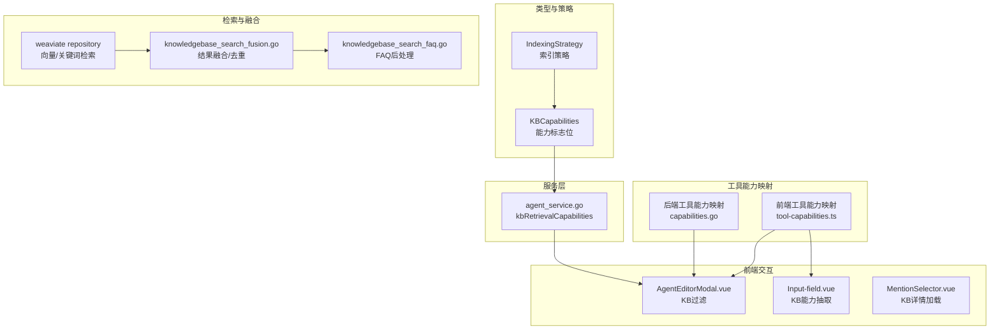
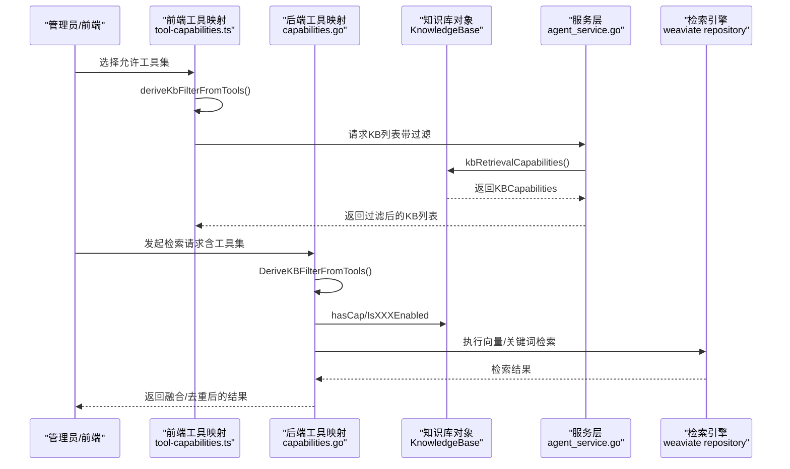
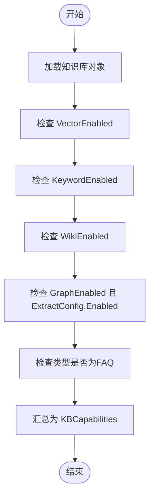
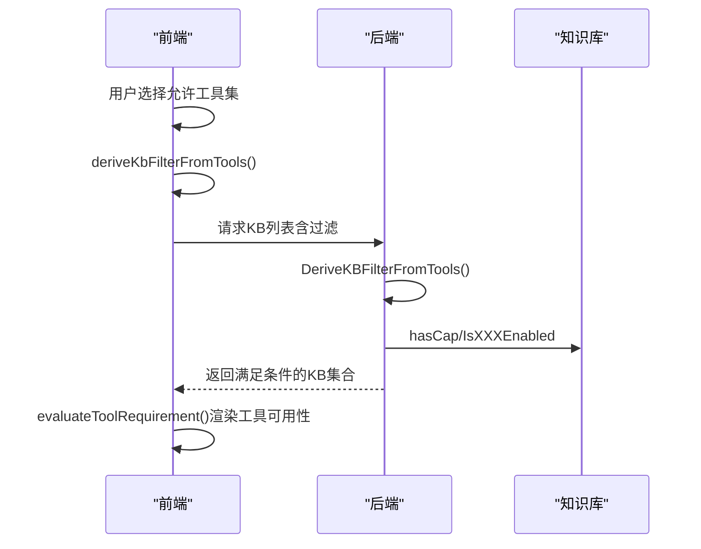
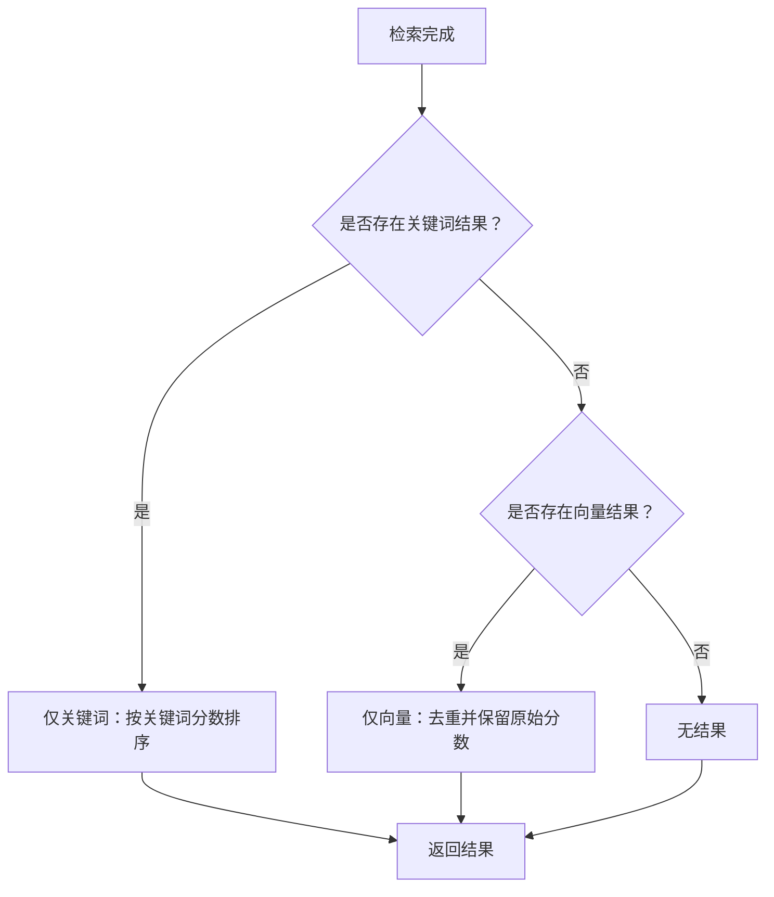

# 知识库能力检测

<cite>
**本文引用的文件**
- [internal/timeseries/indexing_strategy.go](file://internal/types/indexing_strategy.go)
- [internal/types/knowledgebase.go](file://internal/types/knowledgebase.go)
- [internal/agent/tools/capabilities.go](file://internal/agent/tools/capabilities.go)
- [frontend/src/utils/tool-capabilities.ts](file://frontend/src/utils/tool-capabilities.ts)
- [frontend/src/views/agent/AgentEditorModal.vue](file://frontend/src/views/agent/AgentEditorModal.vue)
- [frontend/src/components/Input-field.vue](file://frontend/src/components/Input-field.vue)
- [frontend/src/components/MentionSelector.vue](file://frontend/src/components/MentionSelector.vue)
- [internal/application/service/agent_service.go](file://internal/application/service/agent_service.go)
- [internal/application/service/knowledgebase_search_faq.go](file://internal/application/service/knowledgebase_search_faq.go)
- [internal/application/service/knowledgebase_search_fusion.go](file://internal/application/service/knowledgebase_search_fusion.go)
- [internal/application/repository/retriever/weaviate/repository.go](file://internal/application/repository/retriever/weaviate/repository.go)
- [migrations/versioned/000037_wiki_and_indexing.up.sql](file://migrations/versioned/000037_wiki_and_indexing.up.sql)
- [docs/wiki/集成扩展/集成向量数据库.md](file://docs/wiki/集成扩展/集成向量数据库.md)
</cite>

## 目录
1. [引言](#引言)
2. [项目结构](#项目结构)
3. [核心组件](#核心组件)
4. [架构总览](#架构总览)
5. [详细组件分析](#详细组件分析)
6. [依赖分析](#依赖分析)
7. [性能考虑](#性能考虑)
8. [故障排查指南](#故障排查指南)
9. [结论](#结论)
10. [附录](#附录)

## 引言
本技术文档围绕WeKnora知识库能力检测体系，系统化阐述KBCapabilities结构体的设计原理、计算逻辑与映射关系，详解向量搜索（Vector）、关键词搜索（Keyword）、Wiki、知识图谱（Graph）、FAQ等能力的检测机制，并说明IndexingStrategy与具体能力之间的映射规则。文档还覆盖前端过滤、代理配置、工具调用中的应用实践，提供性能优化策略与缓存机制建议，以及能力变更通知与实时更新的实现思路，面向前端开发者与系统集成人员提供完整的技术参考。

## 项目结构
WeKnora采用前后端分离的模块化设计，能力检测贯穿前端工具能力映射、后端知识库能力计算与检索引擎实现。关键位置如下：
- 类型与策略：internal/types 下的 KBCapabilities 与 IndexingStrategy
- 工具能力映射：internal/agent/tools/capabilities.go 与前端 frontend/src/utils/tool-capabilities.ts
- 前端过滤与交互：AgentEditorModal.vue、Input-field.vue、MentionSelector.vue
- 服务层能力暴露：internal/application/service/agent_service.go
- 检索融合与FAQ处理：knowledgebase_search_fusion.go、knowledgebase_search_faq.go
- 向量检索实现：internal/application/repository/retriever/weaviate/repository.go
- 数据库迁移：migrations/versioned/000037_wiki_and_indexing.up.sql
- 扩展文档：docs/wiki/集成扩展/集成向量数据库.md

**图表来源**
- [internal/types/knowledgebase.go:532-625](file://internal/types/knowledgebase.go#L532-L625)
- [internal/types/indexing_strategy.go:11-52](file://internal/types/indexing_strategy.go#L11-L52)
- [internal/agent/tools/capabilities.go:47-177](file://internal/agent/tools/capabilities.go#L47-L177)
- [frontend/src/utils/tool-capabilities.ts:43-76](file://frontend/src/utils/tool-capabilities.ts#L43-L76)
- [frontend/src/views/agent/AgentEditorModal.vue:1984-2016](file://frontend/src/views/agent/AgentEditorModal.vue#L1984-L2016)
- [frontend/src/components/Input-field.vue:249-256](file://frontend/src/components/Input-field.vue#L249-L256)
- [internal/application/service/agent_service.go:725-725](file://internal/application/service/agent_service.go#L725-L725)
- [internal/application/repository/retriever/weaviate/repository.go:663-922](file://internal/application/repository/retriever/weaviate/repository.go#L663-L922)
- [internal/application/service/knowledgebase_search_fusion.go:12-39](file://internal/application/service/knowledgebase_search_fusion.go#L12-L39)
- [internal/application/service/knowledgebase_search_faq.go:13-42](file://internal/application/service/knowledgebase_search_faq.go#L13-L42)

**章节来源**
- [internal/types/indexing_strategy.go:1-78](file://internal/types/indexing_strategy.go#L1-L78)
- [internal/types/knowledgebase.go:530-625](file://internal/types/knowledgebase.go#L530-L625)
- [internal/agent/tools/capabilities.go:1-177](file://internal/agent/tools/capabilities.go#L1-L177)
- [frontend/src/utils/tool-capabilities.ts:1-209](file://frontend/src/utils/tool-capabilities.ts#L1-L209)

## 核心组件
本节聚焦KBCapabilities结构体及其计算逻辑，以及IndexingStrategy与各能力的映射关系。

- KBCapabilities能力标志位
  - Vector：语义向量检索可用
  - Keyword：关键词（BM25）检索可用
  - Wiki：Wiki页面索引与生成可用
  - Graph：知识图谱抽取可用
  - FAQ：该知识库为FAQ类型（问答对）

- 计算逻辑
  - Capabilities()根据IndexingStrategy与类型（FAQ）计算能力标志位
  - IsVectorEnabled/IsKeywordEnabled/IsWikiEnabled/IsGraphEnabled提供便捷查询
  - NeedsEmbeddingModel用于判断是否需要嵌入模型（向量与关键词均需）

- IndexingStrategy与能力映射
  - VectorEnabled → 启用向量搜索
  - KeywordEnabled → 启用关键词搜索
  - WikiEnabled → 启用Wiki功能
  - GraphEnabled + ExtractConfig.Enabled → 启用知识图谱抽取
  - 默认策略：向量与关键词启用，Wiki与图谱关闭

- 前后端一致性
  - 前端工具能力映射与后端工具能力映射保持同步，确保前端过滤与后端最终防线一致

**章节来源**
- [internal/types/knowledgebase.go:532-625](file://internal/types/knowledgebase.go#L532-L625)
- [internal/types/indexing_strategy.go:11-52](file://internal/types/indexing_strategy.go#L11-L52)
- [internal/agent/tools/capabilities.go:47-82](file://internal/agent/tools/capabilities.go#L47-L82)
- [frontend/src/utils/tool-capabilities.ts:43-76](file://frontend/src/utils/tool-capabilities.ts#L43-L76)

## 架构总览
能力检测贯穿“策略配置—能力计算—前端过滤—工具调用—检索执行”的全链路。

**图表来源**
- [frontend/src/utils/tool-capabilities.ts:154-166](file://frontend/src/utils/tool-capabilities.ts#L154-L166)
- [internal/agent/tools/capabilities.go:114-153](file://internal/agent/tools/capabilities.go#L114-L153)
- [internal/types/knowledgebase.go:546-606](file://internal/types/knowledgebase.go#L546-L606)
- [internal/application/service/agent_service.go:725-725](file://internal/application/service/agent_service.go#L725-L725)
- [internal/application/repository/retriever/weaviate/repository.go:663-922](file://internal/application/repository/retriever/weaviate/repository.go#L663-L922)

## 详细组件分析

### KBCapabilities与IndexingStrategy映射
- 设计原则
  - 能力标志位由IndexingStrategy与知识库类型共同决定
  - FAQ能力通过类型字段直接标注
  - 图谱能力需同时满足策略开启与抽取配置有效

- 计算流程
  - Capabilities()统一汇总各能力位
  - IsXXXEnabled提供细粒度查询
  - NeedsEmbeddingModel用于检索前置判断

**图表来源**
- [internal/types/knowledgebase.go:546-606](file://internal/types/knowledgebase.go#L546-L606)
- [internal/types/indexing_strategy.go:33-47](file://internal/types/indexing_strategy.go#L33-L47)

**章节来源**
- [internal/types/knowledgebase.go:532-625](file://internal/types/knowledgebase.go#L532-L625)
- [internal/types/indexing_strategy.go:11-52](file://internal/types/indexing_strategy.go#L11-L52)

### 工具能力映射与KB过滤
- 后端映射
  - ToolCapabilityRequirements定义工具对能力的需求（anyOf/allOf/consumesFiles）
  - DeriveKBFilterFromTools从允许工具集中推导KB过滤条件
  - KBSatisfiesToolRequirements判定KB是否满足工具需求

- 前端映射
  - TOOL_CAPABILITY_REQUIREMENTS与后端保持一致
  - deriveKbFilterFromTools与evaluateToolRequirement驱动UI过滤与提示

- 前端应用
  - AgentEditorModal.vue：根据过滤条件禁用不兼容KB并给出原因
  - Input-field.vue：从KB对象抽取ScopeCapabilities，优先使用backend capabilities，否则回退到indexing_strategy
  - MentionSelector.vue：按需加载KB详情，结合能力进行筛选

**图表来源**
- [internal/agent/tools/capabilities.go:114-153](file://internal/agent/tools/capabilities.go#L114-L153)
- [frontend/src/utils/tool-capabilities.ts:154-166](file://frontend/src/utils/tool-capabilities.ts#L154-L166)
- [frontend/src/views/agent/AgentEditorModal.vue:1984-2016](file://frontend/src/views/agent/AgentEditorModal.vue#L1984-L2016)
- [frontend/src/components/Input-field.vue:249-256](file://frontend/src/components/Input-field.vue#L249-L256)

**章节来源**
- [internal/agent/tools/capabilities.go:47-177](file://internal/agent/tools/capabilities.go#L47-L177)
- [frontend/src/utils/tool-capabilities.ts:43-209](file://frontend/src/utils/tool-capabilities.ts#L43-L209)
- [frontend/src/views/agent/AgentEditorModal.vue:1984-2016](file://frontend/src/views/agent/AgentEditorModal.vue#L1984-L2016)
- [frontend/src/components/Input-field.vue:249-256](file://frontend/src/components/Input-field.vue#L249-L256)
- [frontend/src/components/MentionSelector.vue:201-219](file://frontend/src/components/MentionSelector.vue#L201-L219)

### 检索与融合处理
- 结果分类
  - classifyRetrievalResults按检索器类型（向量/关键词）分离结果

- 融合或去重
  - 若仅有关键词结果：按关键词分数排序
  - 若仅有向量结果：去重并保留原始分数（FAQ场景重要）
  - 若向量+关键词：使用RRF融合

- FAQ后处理
  - 当FAQ KB未达匹配数量时，触发迭代检索以提升覆盖率

**图表来源**
- [internal/application/service/knowledgebase_search_fusion.go:12-39](file://internal/application/service/knowledgebase_search_fusion.go#L12-L39)
- [internal/application/service/knowledgebase_search_faq.go:13-42](file://internal/application/service/knowledgebase_search_faq.go#L13-L42)

**章节来源**
- [internal/application/service/knowledgebase_search_fusion.go:12-39](file://internal/application/service/knowledgebase_search_fusion.go#L12-L39)
- [internal/application/service/knowledgebase_search_faq.go:13-42](file://internal/application/service/knowledgebase_search_faq.go#L13-L42)

### 向量与关键词检索实现
- Weaviate检索
  - 支持向量嵌入检索与关键词检索两种路径
  - GraphQL字段选择控制返回内容与额外分数/向量
  - TopK限制与日志记录便于调试与性能观测

- 扩展性
  - 文档提供了向量数据库扩展的参考实现路径，便于接入其他向量存储

**章节来源**
- [internal/application/repository/retriever/weaviate/repository.go:663-922](file://internal/application/repository/retriever/weaviate/repository.go#L663-L922)
- [docs/wiki/集成扩展/集成向量数据库.md:56-78](file://docs/wiki/集成扩展/集成向量数据库.md#L56-L78)

### 能力检测在前端过滤、代理配置、工具调用中的应用
- 前端过滤
  - AgentEditorModal.vue：根据KB过滤条件禁用不可用KB并提示原因
  - Input-field.vue：从KB对象抽取能力位，优先使用backend capabilities字段
  - MentionSelector.vue：按需加载KB详情，结合能力进行筛选

- 代理配置
  - 工具能力映射用于决定是否显示“文件”提及菜单（consumesFiles），避免对不消费文件的工具显示无关入口

- 工具调用
  - 后端在检索管线中再次校验KB能力，作为最终防线，防止绕过前端过滤

**章节来源**
- [frontend/src/views/agent/AgentEditorModal.vue:1984-2016](file://frontend/src/views/agent/AgentEditorModal.vue#L1984-L2016)
- [frontend/src/components/Input-field.vue:249-256](file://frontend/src/components/Input-field.vue#L249-L256)
- [frontend/src/utils/tool-capabilities.ts:197-208](file://frontend/src/utils/tool-capabilities.ts#L197-L208)
- [internal/agent/tools/capabilities.go:138-153](file://internal/agent/tools/capabilities.go#L138-L153)

## 依赖分析
- 组件耦合
  - KBCapabilities依赖IndexingStrategy与知识库类型
  - 前后端工具能力映射保持强一致性，避免重复过滤逻辑
  - 服务层kbRetrievalCapabilities统一输出能力位供前端使用

- 外部依赖
  - Weaviate检索依赖外部向量数据库
  - FAQ后处理依赖检索结果统计与迭代检索

**图表来源**
- [internal/types/indexing_strategy.go:11-52](file://internal/types/indexing_strategy.go#L11-L52)
- [internal/types/knowledgebase.go:546-606](file://internal/types/knowledgebase.go#L546-L606)
- [internal/application/service/agent_service.go:725-725](file://internal/application/service/agent_service.go#L725-L725)
- [internal/agent/tools/capabilities.go:114-153](file://internal/agent/tools/capabilities.go#L114-L153)
- [internal/application/repository/retriever/weaviate/repository.go:663-922](file://internal/application/repository/retriever/weaviate/repository.go#L663-L922)

**章节来源**
- [internal/types/indexing_strategy.go:11-52](file://internal/types/indexing_strategy.go#L11-L52)
- [internal/types/knowledgebase.go:546-606](file://internal/types/knowledgebase.go#L546-L606)
- [internal/agent/tools/capabilities.go:114-153](file://internal/agent/tools/capabilities.go#L114-L153)
- [internal/application/service/agent_service.go:725-725](file://internal/application/service/agent_service.go#L725-L725)

## 性能考虑
- 检索路径优化
  - 仅在需要时启用向量/关键词检索，减少不必要的嵌入计算与索引扫描
  - 使用TopK限制与早期日志记录，快速定位性能瓶颈

- 结果融合策略
  - 仅向量检索时进行去重与保留原始分数，避免评分失真
  - 关键词检索时按关键词分数排序，减少后续处理成本

- 缓存机制建议
  - KB详情与能力位可缓存于前端组件内，避免重复请求
  - 检索结果可按查询参数与TopK进行短期缓存，降低重复查询开销

- 数据库迁移兼容
  - 索引策略列默认值与NULL回退逻辑保证历史数据兼容，避免迁移期间能力检测异常

**章节来源**
- [internal/application/repository/retriever/weaviate/repository.go:663-922](file://internal/application/repository/retriever/weaviate/repository.go#L663-L922)
- [internal/application/service/knowledgebase_search_fusion.go:31-39](file://internal/application/service/knowledgebase_search_fusion.go#L31-L39)
- [migrations/versioned/000037_wiki_and_indexing.up.sql:87-98](file://migrations/versioned/000037_wiki_and_indexing.up.sql#L87-L98)

## 故障排查指南
- 能力位不生效
  - 检查IndexingStrategy配置是否正确写入数据库
  - 确认迁移脚本已执行，历史数据是否回退到默认策略

- 工具不可用
  - 核对前端与后端工具能力映射是否一致
  - 检查DeriveKBFilterFromTools是否正确推导过滤条件

- 检索结果异常
  - 查看Weaviate检索日志与TopK设置
  - 对比向量与关键词检索路径，确认融合策略是否符合预期

- FAQ覆盖率不足
  - 触发迭代检索逻辑，确认matchCount与unique chunk去重策略

**章节来源**
- [migrations/versioned/000037_wiki_and_indexing.up.sql:87-98](file://migrations/versioned/000037_wiki_and_indexing.up.sql#L87-L98)
- [internal/agent/tools/capabilities.go:114-153](file://internal/agent/tools/capabilities.go#L114-L153)
- [internal/application/repository/retriever/weaviate/repository.go:663-922](file://internal/application/repository/retriever/weaviate/repository.go#L663-L922)
- [internal/application/service/knowledgebase_search_faq.go:13-42](file://internal/application/service/knowledgebase_search_faq.go#L13-L42)

## 结论
WeKnora的能力检测体系通过“策略—能力—映射—过滤—检索”的闭环，实现了对向量、关键词、Wiki、图谱与FAQ等能力的精确控制。前后端能力映射保持一致，既保障了用户体验，又确保了后端安全防线。通过合理的检索融合策略与缓存机制，系统在性能与准确性之间取得平衡。未来可在能力变更通知与实时更新方面进一步增强，以提供更流畅的动态体验。

## 附录
- 数据库迁移要点
  - 新增索引策略列并回退默认值，确保历史数据兼容
- 扩展向量数据库
  - 参考现有实现路径，遵循接口契约与注册机制

**章节来源**
- [migrations/versioned/000037_wiki_and_indexing.up.sql:87-98](file://migrations/versioned/000037_wiki_and_indexing.up.sql#L87-L98)
- [docs/wiki/集成扩展/集成向量数据库.md:56-78](file://docs/wiki/集成扩展/集成向量数据库.md#L56-L78)