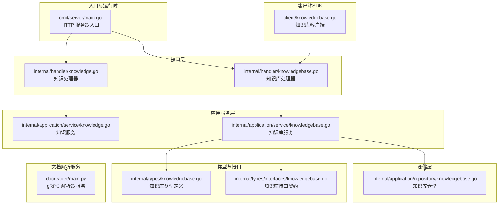
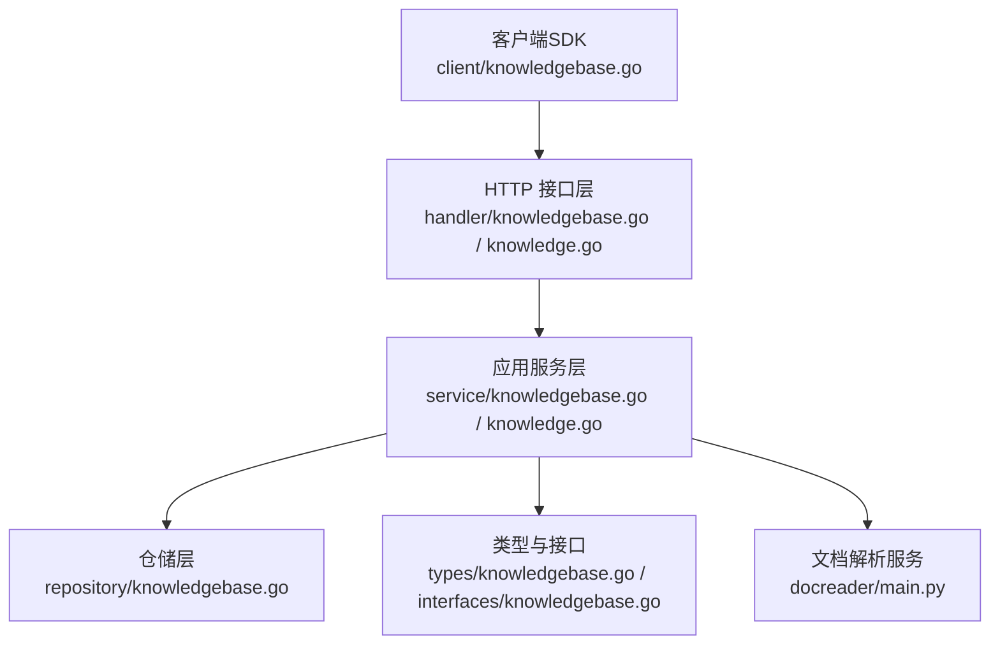
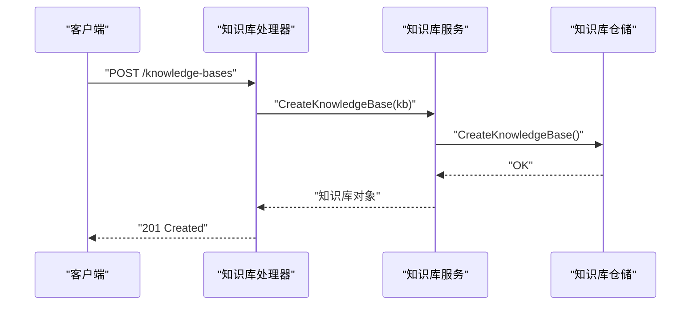
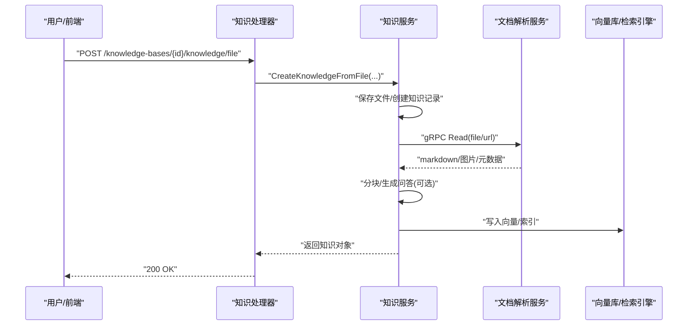
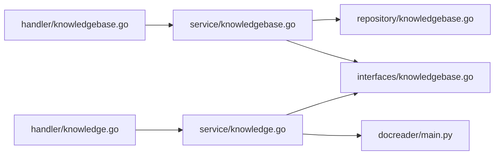

# 知识管理系统

<cite>
**本文引用的文件**
- [README.md](file://README.md)
- [cmd/server/main.go](file://cmd/server/main.go)
- [internal/application/service/knowledgebase.go](file://internal/application/service/knowledgebase.go)
- [internal/handler/knowledgebase.go](file://internal/handler/knowledgebase.go)
- [client/knowledgebase.go](file://client/knowledgebase.go)
- [internal/application/service/knowledge.go](file://internal/application/service/knowledge.go)
- [internal/handler/knowledge.go](file://internal/handler/knowledge.go)
- [docreader/main.py](file://docreader/main.py)
- [internal/types/knowledgebase.go](file://internal/types/knowledgebase.go)
- [internal/types/interfaces/knowledgebase.go](file://internal/types/interfaces/knowledgebase.go)
- [internal/application/repository/knowledgebase.go](file://internal/application/repository/knowledgebase.go)
</cite>

## 目录
1. [简介](#简介)
2. [项目结构](#项目结构)
3. [核心组件](#核心组件)
4. [架构总览](#架构总览)
5. [详细组件分析](#详细组件分析)
6. [依赖关系分析](#依赖关系分析)
7. [性能考量](#性能考量)
8. [故障排查指南](#故障排查指南)
9. [结论](#结论)
10. [附录](#附录)

## 简介
WeKnora 是一个企业级的大语言模型驱动的文档理解与语义检索框架，支持快速问答与智能推理两种模式，提供知识库管理、文档导入处理、解析服务调用、分块与向量化、检索策略配置、知识图谱、标签管理与共享空间等能力。系统采用模块化设计，支持本地/私有云部署，具备完整的数据主权保障。

## 项目结构
WeKnora 的代码组织遵循分层与职责分离原则：
- cmd/server：后端服务入口，负责启动 HTTP 服务器与信号处理
- internal/*：核心业务逻辑，按领域拆分为 service、repository、handler、types、models 等子包
- client：Go 客户端 SDK，封装 API 接口
- docreader：独立的 Python 文档解析服务，通过 gRPC 对接后端
- docs：产品文档与 API 文档
- 前端与 Helm 部署脚本等位于相应目录

图表来源
- [cmd/server/main.go:1-124](file://cmd/server/main.go#L1-L124)
- [internal/handler/knowledgebase.go:1-800](file://internal/handler/knowledgebase.go#L1-L800)
- [internal/handler/knowledge.go:1-800](file://internal/handler/knowledge.go#L1-L800)
- [internal/application/service/knowledgebase.go:1-639](file://internal/application/service/knowledgebase.go#L1-L639)
- [internal/application/service/knowledge.go:1-800](file://internal/application/service/knowledge.go#L1-L800)
- [internal/application/repository/knowledgebase.go:1-124](file://internal/application/repository/knowledgebase.go#L1-L124)
- [internal/types/knowledgebase.go:1-625](file://internal/types/knowledgebase.go#L1-L625)
- [internal/types/interfaces/knowledgebase.go:1-211](file://internal/types/interfaces/knowledgebase.go#L1-L211)
- [client/knowledgebase.go:1-423](file://client/knowledgebase.go#L1-L423)
- [docreader/main.py:1-215](file://docreader/main.py#L1-L215)

章节来源
- [README.md:1-387](file://README.md#L1-L387)
- [cmd/server/main.go:1-124](file://cmd/server/main.go#L1-L124)

## 核心组件
- 知识库服务：负责知识库的创建、查询、更新、删除、置顶、复制、混合检索、嵌入模型设置、异步删除清理等
- 知识服务：负责从文件/URL/手动内容创建知识条目，触发解析与向量化任务，处理去重、配额检查、存储引擎选择、异步任务编排等
- 文档解析服务：独立的 Python gRPC 服务，统一处理文件与 URL 的解析、图像内联、元数据提取
- 类型与接口：定义知识库类型、配置项、能力标志、索引策略、接口契约等
- 客户端 SDK：封装知识库与知识相关 API，便于外部集成

章节来源
- [internal/application/service/knowledgebase.go:1-639](file://internal/application/service/knowledgebase.go#L1-L639)
- [internal/application/service/knowledge.go:1-800](file://internal/application/service/knowledge.go#L1-L800)
- [docreader/main.py:1-215](file://docreader/main.py#L1-L215)
- [internal/types/knowledgebase.go:1-625](file://internal/types/knowledgebase.go#L1-L625)
- [internal/types/interfaces/knowledgebase.go:1-211](file://internal/types/interfaces/knowledgebase.go#L1-L211)
- [client/knowledgebase.go:1-423](file://client/knowledgebase.go#L1-L423)

## 架构总览
WeKnora 的整体架构由“入口服务 + 处理器 + 应用服务 + 仓储 + 类型/接口 + 客户端 + 文档解析服务”构成，采用分层解耦与接口契约约束，确保可替换性与可扩展性。

图表来源
- [client/knowledgebase.go:1-423](file://client/knowledgebase.go#L1-L423)
- [internal/handler/knowledgebase.go:1-800](file://internal/handler/knowledgebase.go#L1-L800)
- [internal/handler/knowledge.go:1-800](file://internal/handler/knowledge.go#L1-L800)
- [internal/application/service/knowledgebase.go:1-639](file://internal/application/service/knowledgebase.go#L1-L639)
- [internal/application/service/knowledge.go:1-800](file://internal/application/service/knowledge.go#L1-L800)
- [internal/application/repository/knowledgebase.go:1-124](file://internal/application/repository/knowledgebase.go#L1-L124)
- [internal/types/knowledgebase.go:1-625](file://internal/types/knowledgebase.go#L1-L625)
- [internal/types/interfaces/knowledgebase.go:1-211](file://internal/types/interfaces/knowledgebase.go#L1-L211)
- [docreader/main.py:1-215](file://docreader/main.py#L1-L215)

## 详细组件分析

### 知识库管理流程
- 创建：校验配置、生成 ID、写入数据库、返回结果
- 查询：按租户隔离列出，填充计数与处理状态
- 更新：支持修改名称、描述与配置（分块策略、图像处理、FAQ/Wiki/图谱配置、索引策略）
- 删除：标记删除并异步清理向量、分块、文件与图数据
- 置顶：支持置顶/取消置顶
- 复制：异步克隆知识库（含任务进度）

图表来源
- [internal/handler/knowledgebase.go:104-149](file://internal/handler/knowledgebase.go#L104-L149)
- [internal/application/service/knowledgebase.go:74-99](file://internal/application/service/knowledgebase.go#L74-L99)
- [internal/application/repository/knowledgebase.go:25-28](file://internal/application/repository/knowledgebase.go#L25-L28)

章节来源
- [internal/application/service/knowledgebase.go:74-333](file://internal/application/service/knowledgebase.go#L74-L333)
- [internal/handler/knowledgebase.go:104-149](file://internal/handler/knowledgebase.go#L104-L149)
- [internal/application/repository/knowledgebase.go:25-84](file://internal/application/repository/knowledgebase.go#L25-L84)

### 文档导入处理与解析服务调用
- 文件上传：校验类型、去重、配额、存储引擎配置、创建知识记录、保存文件、入队异步任务
- URL 导入：URL 校验与 SSRF 保护、去重、创建知识记录、入队异步任务
- 解析服务：后端通过 gRPC 调用 docreader 服务，统一解析文件/URL，提取文本、图像与元数据
- 向量化：根据知识库配置选择嵌入模型，生成向量并写入向量库
- 分块策略：支持常规分块与父子块策略，提升检索上下文与召回精度

图表来源
- [internal/handler/knowledge.go:190-313](file://internal/handler/knowledge.go#L190-L313)
- [internal/application/service/knowledge.go:202-462](file://internal/application/service/knowledge.go#L202-L462)
- [docreader/main.py:98-182](file://docreader/main.py#L98-L182)

章节来源
- [internal/handler/knowledge.go:190-408](file://internal/handler/knowledge.go#L190-L408)
- [internal/application/service/knowledge.go:202-625](file://internal/application/service/knowledge.go#L202-L625)
- [docreader/main.py:98-182](file://docreader/main.py#L98-L182)

### 索引策略与检索配置
- 索引策略：向量检索、关键词检索、Wiki 生成、知识图谱抽取可独立开关
- 能力标志：根据策略与类型计算 KB 能力，供前端过滤与工具集匹配
- 图谱抽取：可配置节点与关系，支持 GraphRAG
- 父子块：大父块提供上下文，小子块用于向量匹配，提升检索准确性

章节来源
- [internal/types/knowledgebase.go:487-625](file://internal/types/knowledgebase.go#L487-L625)
- [internal/types/interfaces/knowledgebase.go:86-106](file://internal/types/interfaces/knowledgebase.go#L86-L106)

### 文件上传处理机制与多格式支持
- 支持格式：PDF、Word、TXT、Markdown、HTML、图片、CSV、Excel、PPT、JSON 等
- 文件校验：大小限制、类型白名单、SSRF 保护、文件哈希去重
- 存储引擎：支持本地、MinIO、COS、TOS、S3、OSS 等，按 KB 或租户默认配置
- 多模态：图片需配置 VLM 模型与对象存储；音频需配置 ASR 模型

章节来源
- [internal/application/service/knowledge.go:295-300](file://internal/application/service/knowledge.go#L295-L300)
- [internal/application/service/knowledge.go:505-516](file://internal/application/service/knowledge.go#L505-L516)
- [internal/types/knowledgebase.go:170-294](file://internal/types/knowledgebase.go#L170-L294)

### 元数据提取与质量控制
- 元数据：解析服务返回的元数据会注入到知识条目
- 质量控制：重复检测（文件/URL）、SSRF 校验、配额检查、存储引擎完整性校验
- 去重：基于文件名、大小、哈希判断重复，避免重复入库

章节来源
- [internal/application/service/knowledge.go:340-350](file://internal/application/service/knowledge.go#L340-L350)
- [internal/application/service/knowledge.go:310-331](file://internal/application/service/knowledge.go#L310-L331)
- [internal/application/service/knowledge.go:518-541](file://internal/application/service/knowledge.go#L518-L541)

### 知识图谱支持与标签管理
- 知识图谱：通过 ExtractConfig 开启，配置节点与关系，支持 GraphRAG
- 标签管理：知识条目支持标签分类，前端可按标签筛选

章节来源
- [internal/types/knowledgebase.go:438-462](file://internal/types/knowledgebase.go#L438-L462)
- [internal/handler/knowledge.go:278-284](file://internal/handler/knowledge.go#L278-L284)

### 共享空间与跨租户访问
- 组织共享：支持知识库共享，校验用户权限与来源租户
- 共享智能体：允许通过共享智能体访问特定知识库范围

章节来源
- [internal/handler/knowledgebase.go:151-246](file://internal/handler/knowledgebase.go#L151-L246)
- [internal/handler/knowledge.go:56-105](file://internal/handler/knowledge.go#L56-L105)

## 依赖关系分析
- 依赖注入：服务通过容器构建，Handler 注入 Service，Service 注入 Repository、模型服务、任务队列、图引擎等
- 异步任务：使用 Asynq 编排知识导入、清理、复制等后台任务
- gRPC：文档解析服务通过 gRPC 与后端通信
- 接口契约：通过 interfaces 定义清晰的边界，降低耦合度

图表来源
- [internal/handler/knowledgebase.go:1-800](file://internal/handler/knowledgebase.go#L1-L800)
- [internal/handler/knowledge.go:1-800](file://internal/handler/knowledge.go#L1-L800)
- [internal/application/service/knowledgebase.go:1-639](file://internal/application/service/knowledgebase.go#L1-L639)
- [internal/application/service/knowledge.go:1-800](file://internal/application/service/knowledge.go#L1-L800)
- [internal/application/repository/knowledgebase.go:1-124](file://internal/application/repository/knowledgebase.go#L1-L124)
- [internal/types/interfaces/knowledgebase.go:1-211](file://internal/types/interfaces/knowledgebase.go#L1-L211)
- [docreader/main.py:1-215](file://docreader/main.py#L1-L215)

章节来源
- [internal/application/service/knowledgebase.go:21-62](file://internal/application/service/knowledgebase.go#L21-L62)
- [internal/application/service/knowledge.go:61-88](file://internal/application/service/knowledge.go#L61-L88)

## 性能考量
- 并行与分组：检索时对目标知识库进行分组与嵌入复用，减少重复计算
- 父子块策略：大父块提供上下文，小字块用于向量匹配，提升召回与上下文覆盖
- 异步任务：导入、清理、复制等重操作异步执行，避免阻塞主流程
- 存储与网络：解析服务与存储引擎解耦，支持多种对象存储后端，按需选择

章节来源
- [README.md:108-110](file://README.md#L108-L110)
- [internal/application/service/knowledgebase.go:301-318](file://internal/application/service/knowledgebase.go#L301-L318)

## 故障排查指南
- 权限与租户：确认租户 ID、用户权限与共享规则
- 存储引擎：检查 KB 级或租户级存储配置是否完整
- URL 安全：确认 URL 通过 SSRF 校验
- 重复导入：查看去重逻辑与错误码
- 异步任务：关注任务队列状态与日志

章节来源
- [internal/handler/knowledgebase.go:151-246](file://internal/handler/knowledgebase.go#L151-L246)
- [internal/application/service/knowledge.go:235-237](file://internal/application/service/knowledge.go#L235-L237)
- [internal/application/service/knowledge.go:513-516](file://internal/application/service/knowledge.go#L513-L516)
- [internal/handler/knowledge.go:171-188](file://internal/handler/knowledge.go#L171-L188)

## 结论
WeKnora 通过清晰的分层架构、完善的接口契约与可插拔的解析与存储后端，提供了从知识库管理、文档导入、解析、分块、向量化到检索与知识图谱的完整能力闭环。其模块化设计与异步任务编排使其适合大规模数据处理与企业级部署场景。

## 附录
- 快速开始与部署：参见 README 的安装与启动说明
- API 参考：参见 docs/api 与 Swagger 文档
- 开发指南：参见 docs/开发指南

章节来源
- [README.md:226-284](file://README.md#L226-L284)