# 扩展性设计

<cite>
**本文档引用的文件**
- [engine_factory.go](file://internal/container/engine_factory.go)
- [event.go](file://internal/event/event.go)
- [auth.go](file://internal/middleware/auth.go)
- [config.go](file://internal/config/config.go)
- [loader.go](file://internal/agent/skills/loader.go)
- [connector.go](file://internal/datasource/connector.go)
- [provider.go](file://internal/models/provider/provider.go)
- [chat_pipeline.go](file://internal/application/service/chat_pipeline/chat_pipeline.go)
- [manager.go](file://internal/mcp/manager.go)
- [registry.go](file://internal/infrastructure/web_search/registry.go)
</cite>

## 目录
1. [引言](#引言)
2. [项目结构](#项目结构)
3. [核心组件](#核心组件)
4. [架构总览](#架构总览)
5. [详细组件分析](#详细组件分析)
6. [依赖分析](#依赖分析)
7. [性能考量](#性能考量)
8. [故障排查指南](#故障排查指南)
9. [结论](#结论)
10. [附录](#附录)

## 引言
本文件聚焦 WeKnora 的扩展性设计，系统性阐述其可扩展架构与实现机制，覆盖插件机制、工厂模式、策略模式、接口抽象、事件总线、钩子与中间件、第三方集成（MCP 服务、数据源连接器、LLM 提供商、Web 搜索提供者、向量数据库）、配置驱动的动态加载与热更新、安全与权限控制等主题。文档同时提供扩展架构图与插件开发指南，帮助读者快速理解并构建自定义扩展。

## 项目结构
WeKnora 的扩展性围绕“接口抽象 + 注册表/工厂 + 事件总线 + 中间件 + 配置驱动”的组合展开。后端采用 Go 编写，前端使用 Vue3/Vite，整体通过配置文件与运行时参数驱动扩展点。

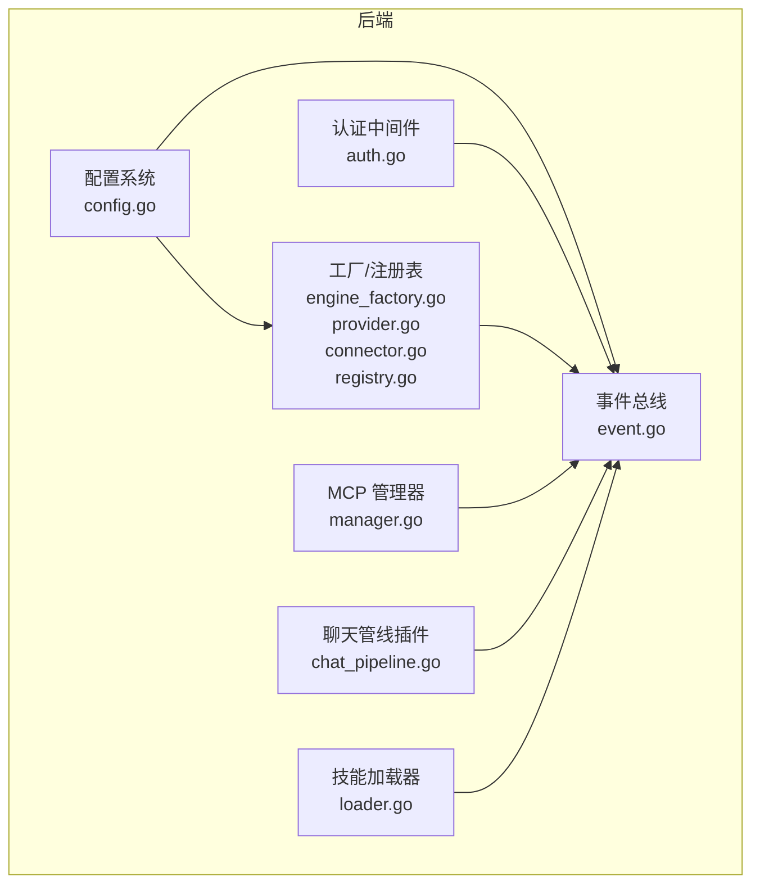

图表来源
- [config.go:341-438](file://internal/config/config.go#L341-L438)
- [event.go:80-231](file://internal/event/event.go#L80-L231)
- [auth.go:65-228](file://internal/middleware/auth.go#L65-L228)
- [engine_factory.go:32-208](file://internal/container/engine_factory.go#L32-L208)
- [provider.go:149-296](file://internal/models/provider/provider.go#L149-L296)
- [connector.go:33-208](file://internal/datasource/connector.go#L33-L208)
- [registry.go:14-46](file://internal/infrastructure/web_search/registry.go#L14-L46)
- [manager.go:13-226](file://internal/mcp/manager.go#L13-L226)
- [chat_pipeline.go:9-41](file://internal/application/service/chat_pipeline/chat_pipeline.go#L9-L41)
- [loader.go:10-309](file://internal/agent/skills/loader.go#L10-L309)

章节来源
- [config.go:341-438](file://internal/config/config.go#L341-L438)
- [event.go:80-231](file://internal/event/event.go#L80-L231)
- [auth.go:65-228](file://internal/middleware/auth.go#L65-L228)
- [engine_factory.go:32-208](file://internal/container/engine_factory.go#L32-L208)
- [provider.go:149-296](file://internal/models/provider/provider.go#L149-L296)
- [connector.go:33-208](file://internal/datasource/connector.go#L33-L208)
- [registry.go:14-46](file://internal/infrastructure/web_search/registry.go#L14-L46)
- [manager.go:13-226](file://internal/mcp/manager.go#L13-L226)
- [chat_pipeline.go:9-41](file://internal/application/service/chat_pipeline/chat_pipeline.go#L9-L41)
- [loader.go:10-309](file://internal/agent/skills/loader.go#L10-L309)

## 核心组件
- 接口抽象与策略模式
  - LLM 提供商注册表与工厂：统一多厂商适配，支持检测与回退。
  - 数据源连接器接口与注册表：统一外部系统接入规范。
  - Web 搜索提供者工厂注册表：按租户参数按需实例化。
  - 向量数据库引擎工厂：基于配置选择具体实现。
- 插件与事件系统
  - 事件总线：同步/异步事件发布订阅，支持并发与错误聚合。
  - 聊天管线插件：事件驱动的插件链，支持链式调用与错误传播。
- 配置驱动与动态加载
  - 配置系统：YAML/环境变量/模板文件合并，支持运行时校验与回填。
  - 技能加载器：分级发现与加载，支持重载与沙箱安全路径限制。
- 第三方集成
  - MCP 管理器：集中管理客户端生命周期与初始化。
  - 认证中间件：统一鉴权与跨租户访问控制。
- 安全与权限
  - 认证中间件：JWT/OIDC/X-API-Key 三通道，跨租户访问校验。
  - MCP 管理器：禁用 stdio 传输，降低本地风险。

章节来源
- [provider.go:141-193](file://internal/models/provider/provider.go#L141-L193)
- [connector.go:9-73](file://internal/datasource/connector.go#L9-L73)
- [registry.go:11-46](file://internal/infrastructure/web_search/registry.go#L11-L46)
- [engine_factory.go:32-64](file://internal/container/engine_factory.go#L32-L64)
- [event.go:80-231](file://internal/event/event.go#L80-L231)
- [chat_pipeline.go:9-41](file://internal/application/service/chat_pipeline/chat_pipeline.go#L9-L41)
- [config.go:341-438](file://internal/config/config.go#L341-L438)
- [loader.go:10-309](file://internal/agent/skills/loader.go#L10-L309)
- [manager.go:13-96](file://internal/mcp/manager.go#L13-L96)
- [auth.go:65-228](file://internal/middleware/auth.go#L65-L228)

## 架构总览
下图展示了扩展点之间的交互关系与数据流向，体现“配置驱动 + 工厂/注册表 + 事件总线 + 中间件”的扩展架构。

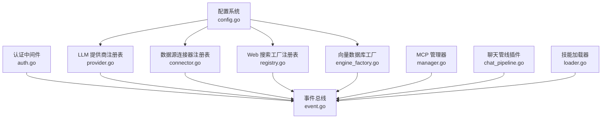

图表来源
- [config.go:341-438](file://internal/config/config.go#L341-L438)
- [event.go:80-231](file://internal/event/event.go#L80-L231)
- [auth.go:65-228](file://internal/middleware/auth.go#L65-L228)
- [provider.go:149-296](file://internal/models/provider/provider.go#L149-L296)
- [connector.go:33-208](file://internal/datasource/connector.go#L33-L208)
- [registry.go:14-46](file://internal/infrastructure/web_search/registry.go#L14-L46)
- [engine_factory.go:32-208](file://internal/container/engine_factory.go#L32-L208)
- [manager.go:13-226](file://internal/mcp/manager.go#L13-L226)
- [chat_pipeline.go:9-41](file://internal/application/service/chat_pipeline/chat_pipeline.go#L9-L41)
- [loader.go:10-309](file://internal/agent/skills/loader.go#L10-L309)

## 详细组件分析

### 工厂模式与策略模式：向量数据库引擎工厂
- 设计要点
  - 工厂函数接收向量库配置，按类型分支创建具体检索引擎服务。
  - 支持多种后端（Postgres、Elasticsearch v7/v8、Qdrant、Milvus、Weaviate、SQLite）。
  - Elasticsearch 版本自动识别，按版本选择不同 SDK。
- 扩展方式
  - 新增类型：在 switch 分支新增分支，添加对应仓库与引擎封装。
  - 参数校验：在工厂内增加连接参数校验与默认值处理。
- 安全与健壮性
  - 禁止自定义 Postgres 连接（仅默认连接），避免迁移与连接池复杂性。
  - Milvus/Weaviate/ES 等均进行连接与初始化超时控制。

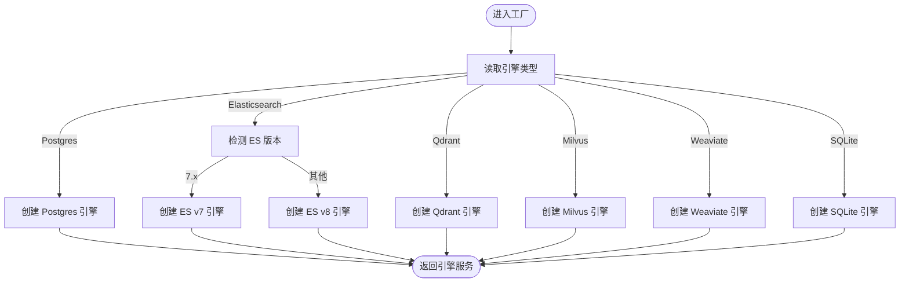

图表来源
- [engine_factory.go:40-208](file://internal/container/engine_factory.go#L40-L208)

章节来源
- [engine_factory.go:32-208](file://internal/container/engine_factory.go#L32-L208)

### LLM 提供商注册表与工厂
- 设计要点
  - 统一 Provider 接口，注册表按名称维护映射。
  - 支持按模型类型筛选可用提供者，支持默认提供者回退。
  - BaseURL 自动检测提供者类型，便于兼容自定义部署。
- 扩展方式
  - 实现 Provider 接口并注册，即可被模型配置自动识别。
  - 通过 ExtraFields 定义额外配置项，前端可渲染表单。
- 运行时行为
  - GetOrDefault 未命中时回退到通用提供者，保障稳定性。

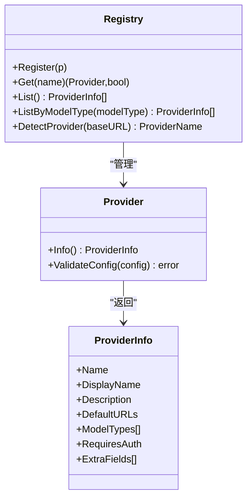

图表来源
- [provider.go:141-193](file://internal/models/provider/provider.go#L141-L193)
- [provider.go:149-296](file://internal/models/provider/provider.go#L149-L296)

章节来源
- [provider.go:149-296](file://internal/models/provider/provider.go#L149-L296)

### 数据源连接器接口与注册表
- 设计要点
  - Connector 接口定义统一能力：类型、校验、资源枚举、全量/增量拉取。
  - ConnectorRegistry 提供注册、查找、列举能力。
  - ConnectorMetadataRegistry 提供 UI 展示元数据（优先级、认证方式、能力）。
- 扩展方式
  - 实现 Connector 接口并通过 Register 注册，即可在 UI 中显示并使用。
  - 通过 Metadata 的 Capabilities 标注增量/Webhook/删除同步等能力。
- 运行时行为
  - ListAvailableConnectors 按优先级排序，便于前端展示。

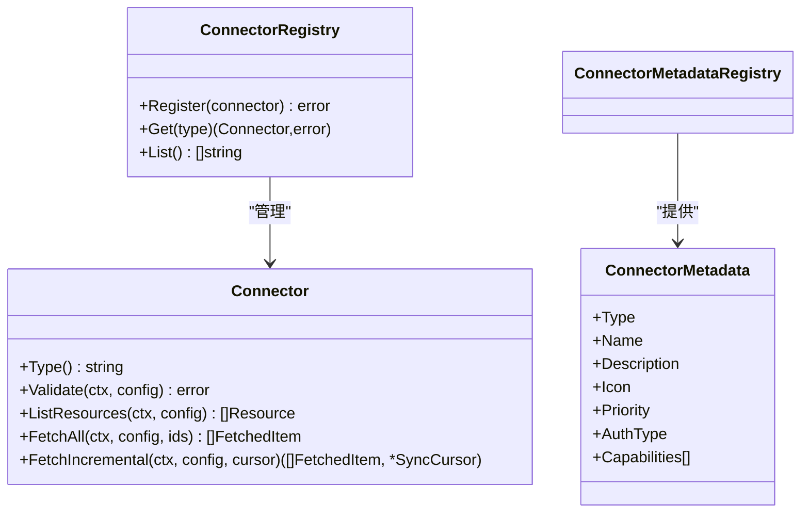

图表来源
- [connector.go:9-73](file://internal/datasource/connector.go#L9-L73)
- [connector.go:33-208](file://internal/datasource/connector.go#L33-L208)

章节来源
- [connector.go:33-208](file://internal/datasource/connector.go#L33-L208)

### Web 搜索提供者工厂注册表
- 设计要点
  - ProviderFactory 按租户参数创建具体提供者实例。
  - Registry 以 ID 映射工厂，支持并发读写锁保护。
- 扩展方式
  - Register(id, factory) 即可接入新搜索提供商，按需传入参数。
- 运行时行为
  - CreateProvider 未注册时返回明确错误，便于诊断。

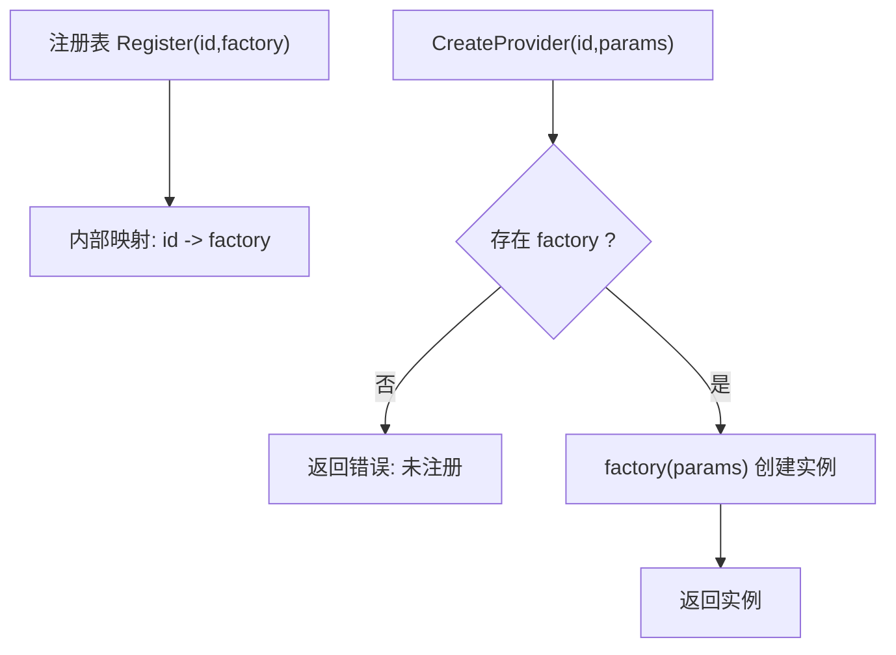

图表来源
- [registry.go:14-46](file://internal/infrastructure/web_search/registry.go#L14-L46)

章节来源
- [registry.go:14-46](file://internal/infrastructure/web_search/registry.go#L14-L46)

### MCP 管理器：第三方服务扩展
- 设计要点
  - 集中管理 MCP 客户端生命周期，复用 SSE/HTTP 连接。
  - 禁用 stdio 传输，提升安全性。
  - 初始化超时控制，定期清理断开连接。
- 扩展方式
  - 通过服务配置启用/禁用，管理器按需创建与缓存。
- 运行时行为
  - 支持获取活跃客户端数量与服务列表，便于运维监控。

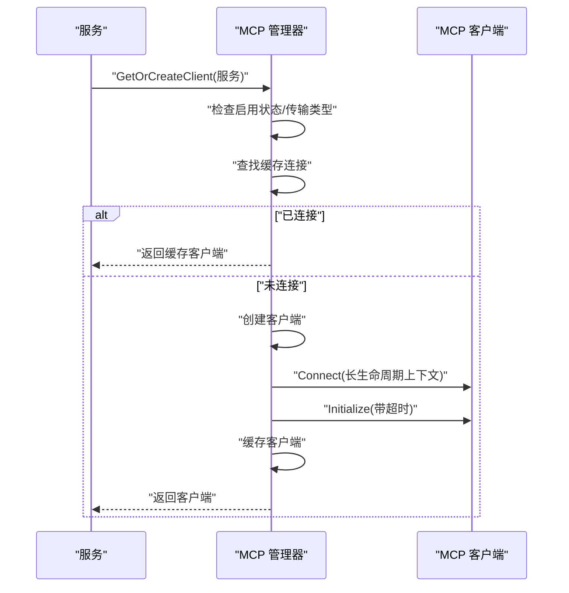

图表来源
- [manager.go:37-120](file://internal/mcp/manager.go#L37-L120)

章节来源
- [manager.go:13-226](file://internal/mcp/manager.go#L13-L226)

### 事件总线：扩展点与钩子
- 设计要点
  - EventType 枚举覆盖查询、检索、重排序、合并、聊天、Agent、会话、控制与错误等阶段。
  - EventBus 支持同步/异步模式，提供 Emit/EmitAndWait、HasHandlers、Clear 等能力。
- 扩展方式
  - 通过 EventBus.On 注册处理器，按事件类型分发。
  - 聊天管线插件通过 Plugin 接口参与事件链。
- 运行时行为
  - 异步模式下 fire-and-forget，同步模式下顺序执行并聚合错误。

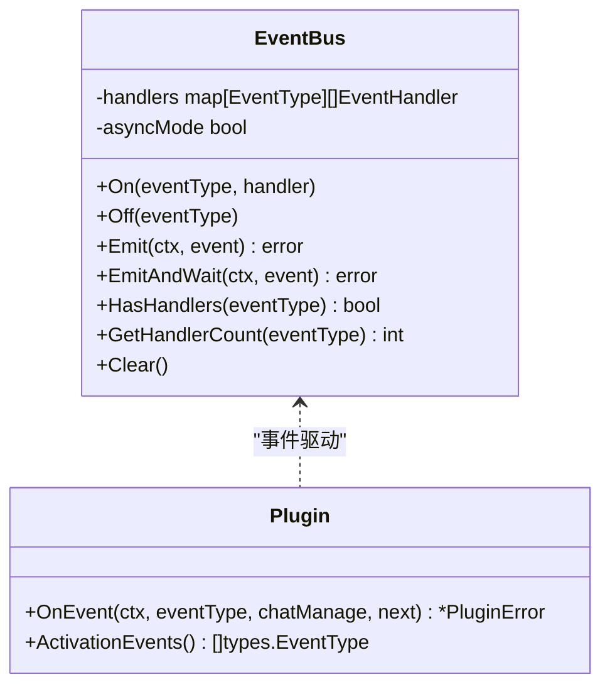

图表来源
- [event.go:80-231](file://internal/event/event.go#L80-L231)
- [chat_pipeline.go:9-41](file://internal/application/service/chat_pipeline/chat_pipeline.go#L9-L41)

章节来源
- [event.go:80-231](file://internal/event/event.go#L80-L231)
- [chat_pipeline.go:9-41](file://internal/application/service/chat_pipeline/chat_pipeline.go#L9-L41)

### 技能加载器：插件式能力扩展
- 设计要点
  - 分级发现与加载：先扫描元数据，再按需加载指令与脚本文件。
  - 安全路径限制：防止路径穿越，确保文件在技能目录内。
  - 缓存与重载：支持 Reload 清空缓存重新发现。
- 扩展方式
  - 在配置的目录中新增技能子目录与 SKILL.md，即可被发现与加载。
- 运行时行为
  - 通过 GetSkillBasePath 返回绝对路径，便于沙箱执行。

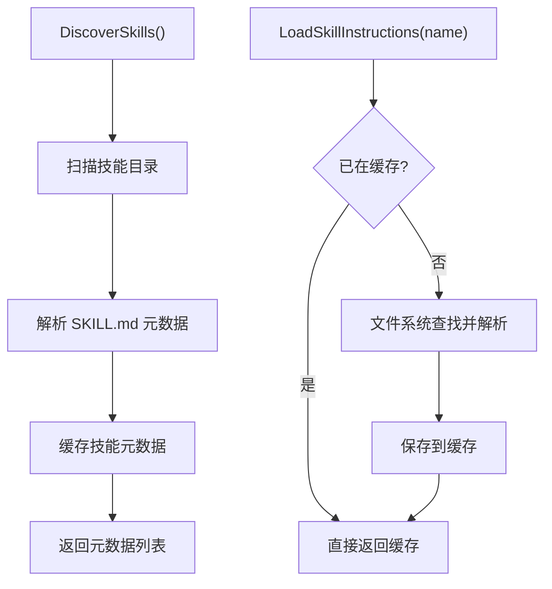

图表来源
- [loader.go:28-126](file://internal/agent/skills/loader.go#L28-L126)

章节来源
- [loader.go:10-309](file://internal/agent/skills/loader.go#L10-L309)

### 认证中间件：安全与权限控制
- 设计要点
  - 三通道认证：JWT/OIDC、X-API-Key，支持跨租户访问校验。
  - 无需认证 API 白名单，OPTIONS 预检放行。
  - 通过上下文注入用户与租户信息，下游组件可直接读取。
- 扩展方式
  - 新增无需认证端点：在白名单中添加路径与方法。
  - 新增认证策略：扩展 Auth 函数逻辑或引入新中间件。
- 运行时行为
  - 未提供认证信息时统一返回 401，跨租户访问失败返回 403。

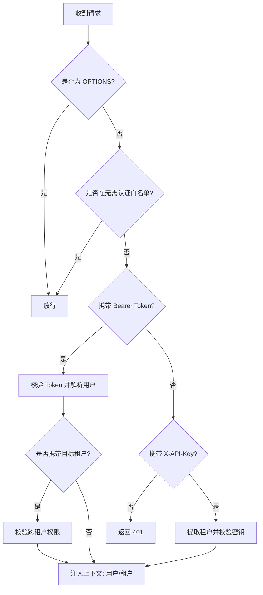

图表来源
- [auth.go:65-228](file://internal/middleware/auth.go#L65-L228)

章节来源
- [auth.go:65-228](file://internal/middleware/auth.go#L65-L228)

## 依赖分析
- 松耦合与高内聚
  - 各扩展点通过接口与工厂解耦，新增实现只需满足接口契约。
  - 注册表/工厂承担“选择器”职责，业务层仅依赖抽象。
- 潜在循环依赖
  - 事件总线与插件之间为单向依赖（插件订阅事件），未见循环。
  - 认证中间件与业务路由为单向依赖，未见循环。
- 外部依赖与集成点
  - LLM 提供商注册表依赖模型类型与 BaseURL 检测。
  - 向量数据库工厂依赖具体后端 SDK。
  - MCP 管理器依赖服务配置与初始化协议。
  - Web 搜索工厂依赖租户参数与具体提供商实现。

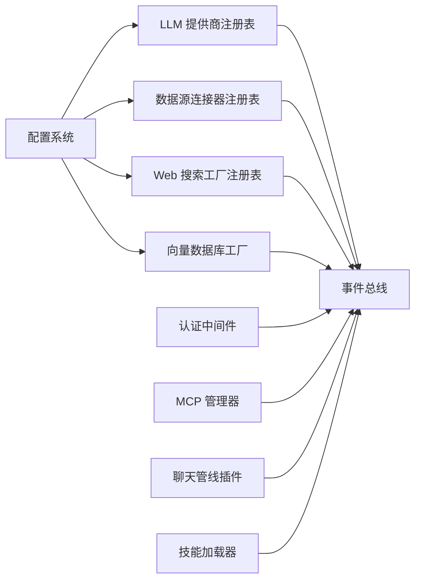

图表来源
- [config.go:341-438](file://internal/config/config.go#L341-L438)
- [provider.go:149-296](file://internal/models/provider/provider.go#L149-L296)
- [connector.go:33-208](file://internal/datasource/connector.go#L33-L208)
- [registry.go:14-46](file://internal/infrastructure/web_search/registry.go#L14-L46)
- [engine_factory.go:32-208](file://internal/container/engine_factory.go#L32-L208)
- [event.go:80-231](file://internal/event/event.go#L80-L231)
- [auth.go:65-228](file://internal/middleware/auth.go#L65-L228)
- [manager.go:13-226](file://internal/mcp/manager.go#L13-L226)
- [chat_pipeline.go:9-41](file://internal/application/service/chat_pipeline/chat_pipeline.go#L9-L41)
- [loader.go:10-309](file://internal/agent/skills/loader.go#L10-L309)

章节来源
- [provider.go:149-296](file://internal/models/provider/provider.go#L149-L296)
- [connector.go:33-208](file://internal/datasource/connector.go#L33-L208)
- [registry.go:14-46](file://internal/infrastructure/web_search/registry.go#L14-L46)
- [engine_factory.go:32-208](file://internal/container/engine_factory.go#L32-L208)
- [event.go:80-231](file://internal/event/event.go#L80-L231)
- [auth.go:65-228](file://internal/middleware/auth.go#L65-L228)
- [manager.go:13-226](file://internal/mcp/manager.go#L13-L226)
- [chat_pipeline.go:9-41](file://internal/application/service/chat_pipeline/chat_pipeline.go#L9-L41)
- [loader.go:10-309](file://internal/agent/skills/loader.go#L10-L309)

## 性能考量
- 工厂与注册表
  - 读多写少场景，采用并发读写锁保护，降低竞争。
  - 工厂内连接/初始化超时控制，避免阻塞。
- 事件总线
  - 异步模式 fire-and-forget，适合非关键路径日志/指标上报。
  - 同步模式顺序执行，适合强一致性的前置校验。
- MCP 管理器
  - 复用 SSE/HTTP 连接，减少握手成本；定期清理断连，避免资源泄漏。
- 技能加载器
  - 缓存元数据与已加载技能，避免重复解析；重载时清空缓存。
- 配置系统
  - 环境变量替换与模板回填在启动时完成，运行时只读，降低运行时开销。

## 故障排查指南
- 事件总线
  - 若事件未触发：检查 HasHandlers 与 ActivationEvents 是否匹配。
  - 异步模式错误丢失：使用 EmitAndWait 获取聚合错误。
- 认证中间件
  - 401：确认 Authorization 头或 X-API-Key 是否正确。
  - 403：检查跨租户权限与目标租户有效性。
- 向量数据库工厂
  - 不支持的引擎类型：确认配置类型与 switch 分支。
  - 连接失败：检查地址、凭据与版本（ES v7/v8）。
- LLM 提供商
  - 未注册提供者：确认 DetectProvider 结果或显式设置 Provider。
  - 配置校验失败：检查 API Key/BaseURL/模型类型。
- 数据源连接器
  - 未找到类型：确认 Register 与 Type 返回值。
  - 资源枚举失败：检查凭据与资源范围。
- Web 搜索工厂
  - 未注册类型：确认 Register 与 CreateProvider 调用。
- MCP 管理器
  - stdio 禁用：改为 SSE/HTTP Streamable。
  - 初始化超时：调整服务 AdvancedConfig.Timeout。
- 技能加载器
  - 路径穿越：检查相对路径与目录边界。
  - 未发现技能：确认 SKILL.md 与目录命名。

章节来源
- [event.go:120-202](file://internal/event/event.go#L120-L202)
- [auth.go:84-227](file://internal/middleware/auth.go#L84-L227)
- [engine_factory.go:48-63](file://internal/container/engine_factory.go#L48-L63)
- [provider.go:145-147](file://internal/models/provider/provider.go#L145-L147)
- [connector.go:46-64](file://internal/datasource/connector.go#L46-L64)
- [registry.go:36-45](file://internal/infrastructure/web_search/registry.go#L36-L45)
- [manager.go:46-49](file://internal/mcp/manager.go#L46-L49)
- [loader.go:211-229](file://internal/agent/skills/loader.go#L211-L229)

## 结论
WeKnora 的扩展性设计以“接口抽象 + 工厂/注册表 + 事件总线 + 中间件 + 配置驱动”为核心，既保证了核心模块的稳定与一致性，又为第三方集成与自定义扩展提供了清晰的契约与便捷的接入路径。通过严格的错误处理、超时控制与安全策略（如禁用 stdio、跨租户权限校验），系统在可扩展的同时兼顾了可靠性与安全性。

## 附录

### 扩展架构图（代码级）
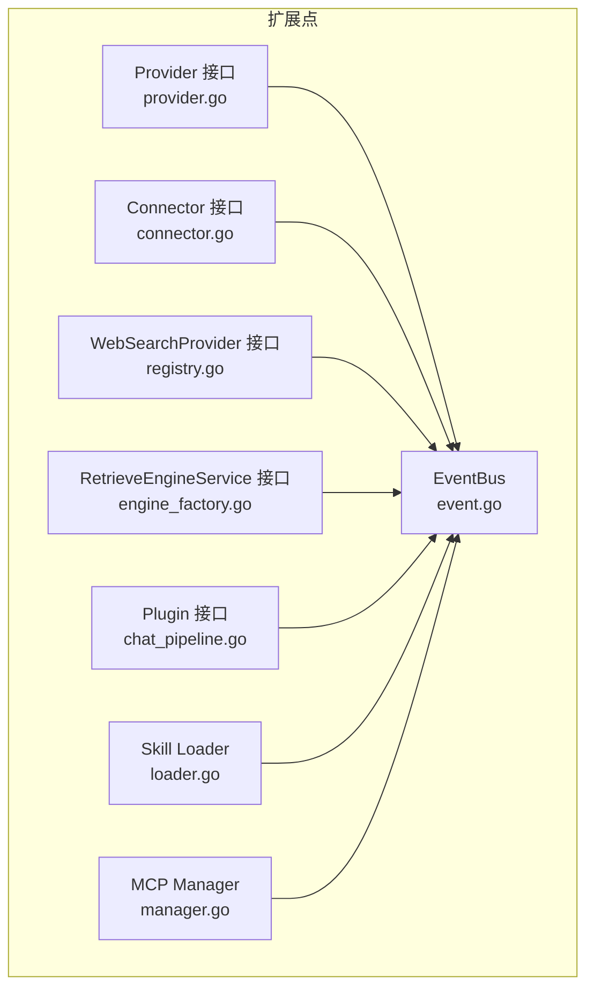

图表来源
- [provider.go:141-193](file://internal/models/provider/provider.go#L141-L193)
- [connector.go:9-73](file://internal/datasource/connector.go#L9-L73)
- [registry.go:11-46](file://internal/infrastructure/web_search/registry.go#L11-L46)
- [engine_factory.go:32-64](file://internal/container/engine_factory.go#L32-L64)
- [event.go:80-231](file://internal/event/event.go#L80-L231)
- [chat_pipeline.go:9-41](file://internal/application/service/chat_pipeline/chat_pipeline.go#L9-L41)
- [loader.go:10-309](file://internal/agent/skills/loader.go#L10-L309)
- [manager.go:13-226](file://internal/mcp/manager.go#L13-L226)

### 插件开发指南（步骤）
- 事件系统插件
  - 实现 Plugin 接口，定义 ActivationEvents。
  - 在 OnEvent 中调用 next() 实现链式处理。
  - 通过 EventBus.On 注册处理器或在聊天管线中注册。
- LLM 提供商扩展
  - 实现 Provider 接口，注册到注册表。
  - 如需自定义 URL/参数，通过 ExtraFields 定义。
- 数据源连接器扩展
  - 实现 Connector 接口并通过 Register 注册。
  - 在 ConnectorMetadataRegistry 中补充 UI 元数据。
- Web 搜索提供者扩展
  - 实现 ProviderFactory 并通过 Registry.Register 注册。
- MCP 服务扩展
  - 在服务配置中启用，管理器自动复用连接。
- 技能扩展
  - 在技能目录中新增子目录与 SKILL.md，系统自动发现与加载。

章节来源
- [chat_pipeline.go:9-41](file://internal/application/service/chat_pipeline/chat_pipeline.go#L9-L41)
- [provider.go:141-193](file://internal/models/provider/provider.go#L141-L193)
- [connector.go:9-73](file://internal/datasource/connector.go#L9-L73)
- [registry.go:11-46](file://internal/infrastructure/web_search/registry.go#L11-L46)
- [manager.go:37-96](file://internal/mcp/manager.go#L37-L96)
- [loader.go:28-126](file://internal/agent/skills/loader.go#L28-L126)

### 配置驱动的扩展模式
- 动态加载
  - 配置文件与环境变量合并，模板文件回填，运行时校验。
- 热更新
  - 建议通过重启进程或服务治理实现配置热生效；当前工厂/注册表在运行时读取配置，不支持自动热替换。
- 运行时配置
  - 认证中间件、MCP 管理器、Web 搜索工厂均支持按运行时参数创建实例。

章节来源
- [config.go:341-438](file://internal/config/config.go#L341-L438)
- [auth.go:65-228](file://internal/middleware/auth.go#L65-L228)
- [manager.go:98-120](file://internal/mcp/manager.go#L98-L120)
- [registry.go:36-45](file://internal/infrastructure/web_search/registry.go#L36-L45)

### 兼容性保证与版本管理
- 兼容性
  - Provider/Datasource/WebSearch 等均通过接口抽象与注册表管理，新增实现不影响现有代码。
  - 向量数据库工厂通过类型分支与版本检测，保证多版本共存。
- 版本管理
  - 建议通过 Git 标签与变更日志记录扩展点破坏性变更；对外暴露的接口应保持向后兼容。

[本节为通用指导，无需特定文件引用]