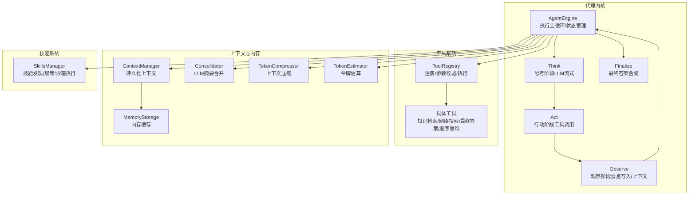
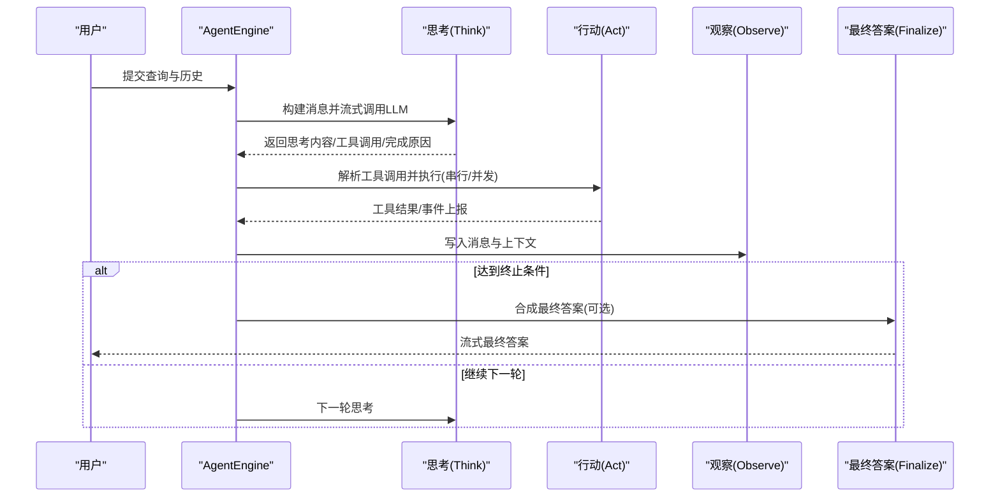
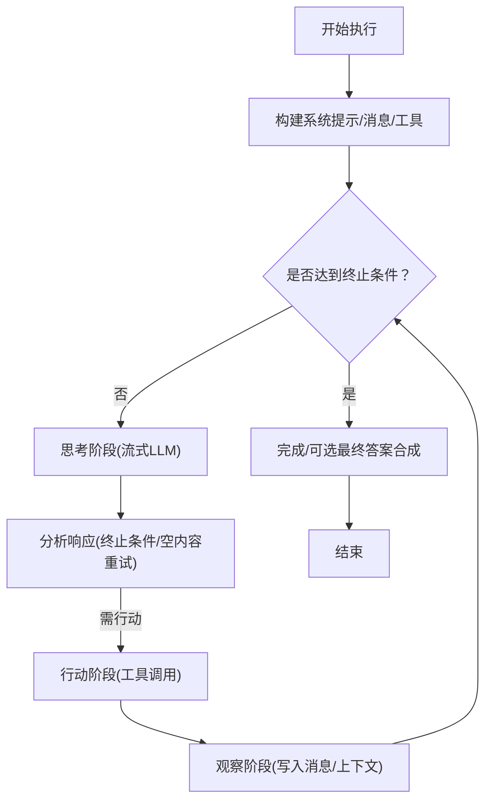
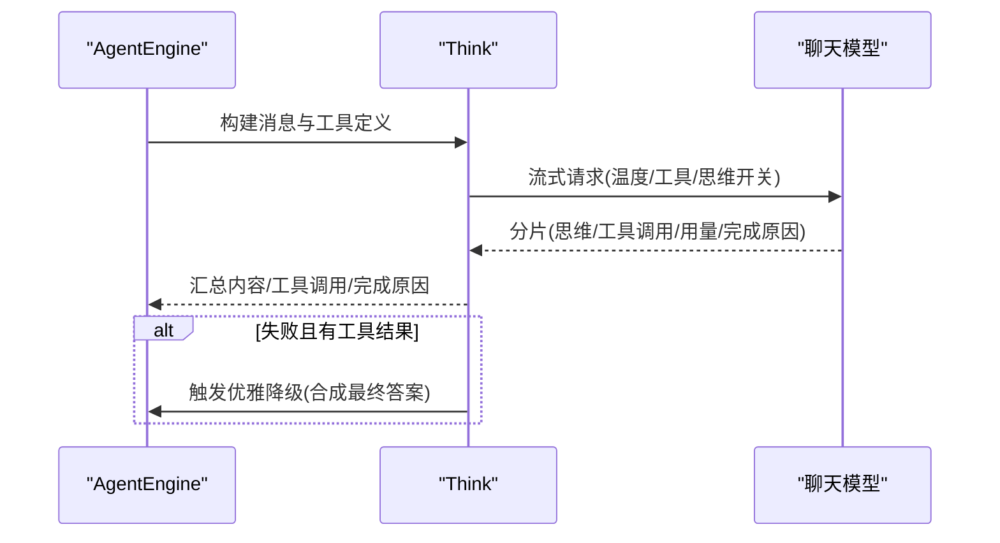
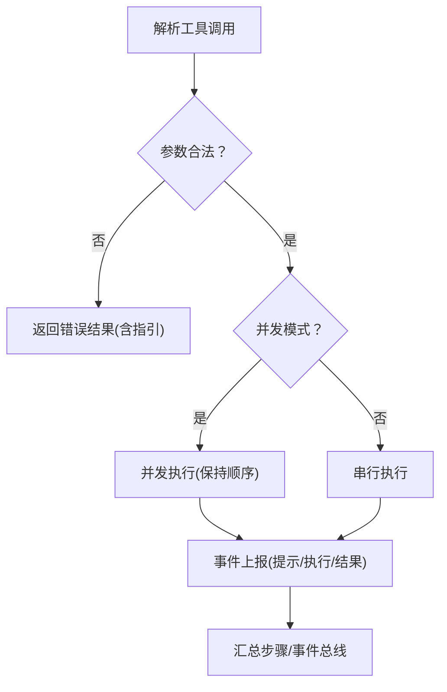
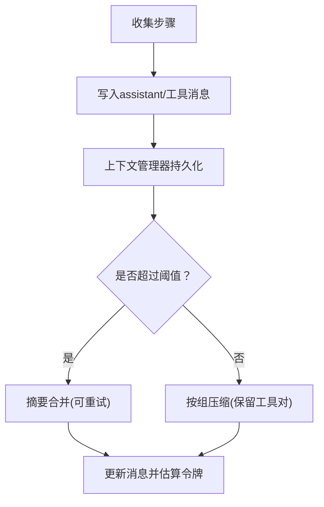
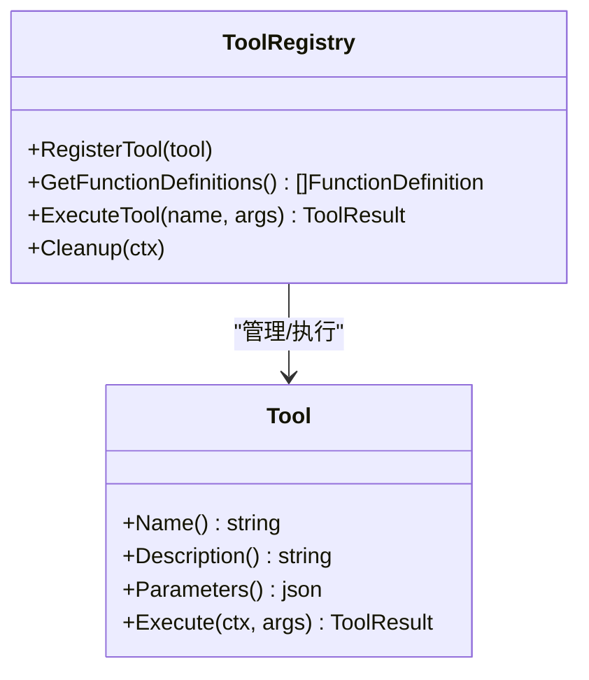
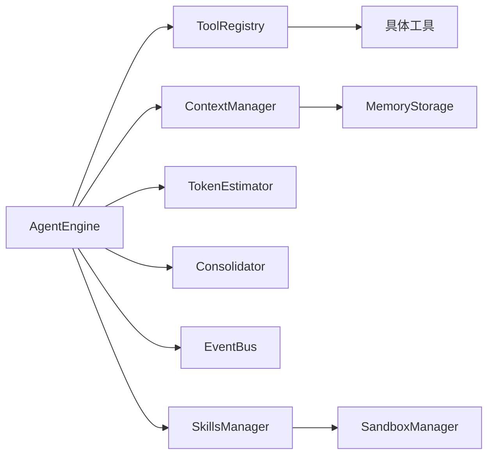

# 代理执行流程

<cite>
**本文引用的文件**
- [engine.go](file://internal/agent/engine.go)
- [think.go](file://internal/agent/think.go)
- [act.go](file://internal/agent/act.go)
- [observe.go](file://internal/agent/observe.go)
- [finalize.go](file://internal/agent/finalize.go)
- [registry.go](file://internal/agent/tools/registry.go)
- [tool.go](file://internal/agent/tools/tool.go)
- [knowledge_search.go](file://internal/agent/tools/knowledge_search.go)
- [web_search.go](file://internal/agent/tools/web_search.go)
- [final_answer.go](file://internal/agent/tools/final_answer.go)
- [sequentialthinking.go](file://internal/agent/tools/sequentialthinking.go)
- [consolidator.go](file://internal/agent/memory/consolidator.go)
- [compress.go](file://internal/agent/token/compress.go)
- [estimator.go](file://internal/agent/token/estimator.go)
- [manager.go](file://internal/agent/skills/manager.go)
- [context_manager.go](file://internal/application/service/llmcontext/context_manager.go)
- [memory_storage.go](file://internal/application/service/llmcontext/memory_storage.go)
- [agent.go](file://internal/types/agent.go)
</cite>

## 目录
1. [简介](#简介)
2. [项目结构](#项目结构)
3. [核心组件](#核心组件)
4. [架构总览](#架构总览)
5. [详细组件分析](#详细组件分析)
6. [依赖关系分析](#依赖关系分析)
7. [性能考量](#性能考量)
8. [故障排查指南](#故障排查指南)
9. [结论](#结论)
10. [附录](#附录)

## 简介
本文件面向WeKnora的ReACT推理代理执行流程，系统化梳理从“思考-行动-观察”循环到状态管理、工具系统、多步推理、上下文窗口优化、流式思维展示、错误与超时控制等关键机制，并提供可操作的流程图与状态转换图，帮助开发者与使用者全面理解代理在不同场景下的行为路径。

## 项目结构
WeKnora的代理执行位于internal/agent子系统，围绕AgentEngine为核心，配合工具注册中心、上下文管理器、内存压缩与合并、令牌估算、以及事件总线进行端到端执行。前端通过事件总线实时接收“思维流”“工具调用”“最终答案”等事件，实现流式可视化。

图表来源
- [engine.go:158-298](file://internal/agent/engine.go#L158-L298)
- [think.go:232-353](file://internal/agent/think.go#L232-L353)
- [act.go:163-301](file://internal/agent/act.go#L163-L301)
- [observe.go:371-442](file://internal/agent/observe.go#L371-L442)
- [finalize.go:15-176](file://internal/agent/finalize.go#L15-L176)
- [registry.go:87-159](file://internal/agent/tools/registry.go#L87-L159)
- [consolidator.go:79-151](file://internal/agent/memory/consolidator.go#L79-L151)
- [compress.go:19-78](file://internal/agent/token/compress.go#L19-L78)
- [estimator.go:50-87](file://internal/agent/token/estimator.go#L50-L87)
- [context_manager.go:49-69](file://internal/application/service/llmcontext/context_manager.go#L49-L69)
- [memory_storage.go:24-65](file://internal/application/service/llmcontext/memory_storage.go#L24-L65)
- [manager.go:34-114](file://internal/agent/skills/manager.go#L34-L114)

章节来源
- [engine.go:158-298](file://internal/agent/engine.go#L158-L298)
- [context_manager.go:49-69](file://internal/application/service/llmcontext/context_manager.go#L49-L69)
- [memory_storage.go:24-65](file://internal/application/service/llmcontext/memory_storage.go#L24-L65)

## 核心组件
- AgentEngine：ReACT执行主控，负责循环调度、状态维护、上下文窗口管理、事件发射、最终答案合成与完成事件。
- 工具注册中心（ToolRegistry）：统一注册、参数校验、类型转换、执行与清理；限制工具输出长度，保障上下文安全。
- 思考阶段（Think）：以流式方式调用LLM，支持思维工具与最终答案工具的分发，记录完成原因与令牌用量。
- 行动阶段（Act）：解析工具调用，串行或并发执行，事件化上报工具提示、结果与执行详情，带超时控制与可观测性。
- 观察阶段（Observe）：将工具结果写回消息历史与上下文管理器，按回合与工具类型进行红化处理，避免过期检索结果污染。
- 最终答案合成（Finalize）：当达到最大轮次或异常中断时，基于已收集工具结果生成最终答案并流式返回。
- 上下文与内存：ContextManager持久化消息；MemoryStorage内存缓存；Consolidator与TokenCompressor在接近阈值时进行摘要合并与压缩。
- 技能系统（SkillsManager）：按进度披露模式注入技能元数据，支持脚本加载与沙箱执行。

章节来源
- [engine.go:28-92](file://internal/agent/engine.go#L28-L92)
- [registry.go:16-85](file://internal/agent/tools/registry.go#L16-L85)
- [think.go:232-353](file://internal/agent/think.go#L232-L353)
- [act.go:163-301](file://internal/agent/act.go#L163-L301)
- [observe.go:371-442](file://internal/agent/observe.go#L371-L442)
- [finalize.go:15-176](file://internal/agent/finalize.go#L15-L176)
- [consolidator.go:79-151](file://internal/agent/memory/consolidator.go#L79-L151)
- [compress.go:19-78](file://internal/agent/token/compress.go#L19-L78)
- [estimator.go:50-87](file://internal/agent/token/estimator.go#L50-L87)
- [manager.go:34-114](file://internal/agent/skills/manager.go#L34-L114)

## 架构总览
ReACT执行链路由AgentEngine驱动，每轮包含思考、分析、行动、观察四个阶段，循环直至满足终止条件（自然停止、内容安全拦截、最终答案工具、达到最大迭代次数）。上下文窗口通过估算与压缩/合并策略维持稳定，工具执行具备参数校验、类型修复、并发与超时控制，事件总线贯穿全程用于流式展示与监控。

图表来源
- [engine.go:341-405](file://internal/agent/engine.go#L341-L405)
- [think.go:232-353](file://internal/agent/think.go#L232-L353)
- [act.go:163-301](file://internal/agent/act.go#L163-L301)
- [observe.go:371-442](file://internal/agent/observe.go#L371-L442)
- [finalize.go:15-176](file://internal/agent/finalize.go#L15-L176)

## 详细组件分析

### AgentEngine：ReACT执行主控
- 执行入口：构建系统提示词、消息历史、工具定义，启动主循环。
- 主循环：检测取消/超时，逐轮运行思考-行动-观察，维护当前轮次、步骤集合、最终答案与知识引用。
- 终止判定：内容安全拦截、自然停止、最终答案工具、达到最大迭代次数。
- 事件与可观测性：顶层与回合级Span，记录令牌用量、工具调用数、持续时间等。
- 资源清理：会话结束时清理工具注册表。

图表来源
- [engine.go:158-298](file://internal/agent/engine.go#L158-L298)
- [engine.go:341-405](file://internal/agent/engine.go#L341-L405)
- [engine.go:422-603](file://internal/agent/engine.go#L422-L603)

章节来源
- [engine.go:158-298](file://internal/agent/engine.go#L158-L298)
- [engine.go:341-405](file://internal/agent/engine.go#L341-L405)
- [engine.go:422-603](file://internal/agent/engine.go#L422-L603)

### 思考阶段（Think）：流式思维与工具调用
- 流式调用：封装聊天模型的流式接口，统计首包延迟、分片数量与类型分布。
- 工具调用识别：区分思维工具与最终答案工具，分别通过事件总线推送“思维块”与“最终答案块”，支持增量展示。
- 错误与重试：对瞬时错误进行有限次重试；失败时触发优雅降级，尝试从已有工具结果合成最终答案。
- 完成原因：优先采用流式返回的完成原因，否则回退为“stop”。

图表来源
- [think.go:24-90](file://internal/agent/think.go#L24-L90)
- [think.go:92-230](file://internal/agent/think.go#L92-L230)
- [think.go:232-353](file://internal/agent/think.go#L232-L353)

章节来源
- [think.go:24-90](file://internal/agent/think.go#L24-L90)
- [think.go:92-230](file://internal/agent/think.go#L92-L230)
- [think.go:232-353](file://internal/agent/think.go#L232-L353)

### 行动阶段（Act）：工具注册、参数校验与执行
- 参数修复与校验：对LLM返回的JSON参数进行修复与Schema校验，失败则直接返回错误结果。
- 执行策略：支持串行与并发（errgroup），并发时保持原始顺序，事件化上报工具提示、执行与结果。
- 超时控制：默认工具执行超时，超时即中止并记录。
- 可观测性：为每个工具调用开启Span，记录成功/失败、耗时、输出长度、错误与结构化数据键等。

图表来源
- [act.go:163-301](file://internal/agent/act.go#L163-L301)
- [registry.go:87-159](file://internal/agent/tools/registry.go#L87-L159)

章节来源
- [act.go:163-301](file://internal/agent/act.go#L163-L301)
- [registry.go:87-159](file://internal/agent/tools/registry.go#L87-L159)

### 观察阶段（Observe）：消息写入与上下文管理
- 写入消息：将思考与工具调用写入assistant消息，工具结果写入tool消息，并通过上下文管理器持久化。
- 历史红化：对可能随时间变化的检索类工具结果进行简要替换，防止跨回合使用过期信息。
- 上下文窗口管理：先尝试摘要合并，再进行简单压缩，保留工具调用-结果配对不被拆分。

图表来源
- [observe.go:371-442](file://internal/agent/observe.go#L371-L442)
- [observe.go:26-57](file://internal/agent/observe.go#L26-L57)
- [consolidator.go:79-151](file://internal/agent/memory/consolidator.go#L79-L151)
- [compress.go:19-78](file://internal/agent/token/compress.go#L19-L78)

章节来源
- [observe.go:26-57](file://internal/agent/observe.go#L26-L57)
- [observe.go:371-442](file://internal/agent/observe.go#L371-L442)
- [consolidator.go:79-151](file://internal/agent/memory/consolidator.go#L79-L151)
- [compress.go:19-78](file://internal/agent/token/compress.go#L19-L78)

### 最终答案合成（Finalize）：超时/失败兜底
- 当达到最大迭代次数或发生不可恢复错误时，基于所有工具结果构建最终答案消息，再次通过流式LLM生成并推送事件。
- 事件ID唯一，确保UI正确拼接与收尾。

章节来源
- [finalize.go:15-176](file://internal/agent/finalize.go#L15-L176)

### 工具系统：注册、参数验证、执行与结果处理
- 注册与函数定义：统一暴露工具函数定义供LLM函数调用。
- 参数修复与校验：CastParams与ValidateParams保证类型与Schema一致性。
- 输出截断：超过阈值自动截断，避免污染上下文。
- 清理机制：会话结束时调用Cleanable接口释放资源。

图表来源
- [registry.go:16-85](file://internal/agent/tools/registry.go#L16-L85)
- [registry.go:87-159](file://internal/agent/tools/registry.go#L87-L159)
- [tool.go:10-47](file://internal/agent/tools/tool.go#L10-L47)

章节来源
- [registry.go:16-85](file://internal/agent/tools/registry.go#L16-L85)
- [registry.go:87-159](file://internal/agent/tools/registry.go#L87-L159)
- [tool.go:10-47](file://internal/agent/tools/tool.go#L10-L47)

### 具体工具示例
- 知识检索工具：支持语义/向量检索、关键词检索、去重与会话缓存，结合Rerank与会话临时KB。
- 网络搜索工具：遵循“KB优先”规则，仅在知识库不足时使用，支持RAG压缩与会话缓存。
- 最终答案工具：严格解析参数，三段容错恢复，确保循环终止且避免重复答案。
- 顺序思维工具：支持修订、分支、动态调整总步数，便于复杂问题的反思式推理。

章节来源
- [knowledge_search.go:161-200](file://internal/agent/tools/knowledge_search.go#L161-L200)
- [web_search.go:113-200](file://internal/agent/tools/web_search.go#L113-L200)
- [final_answer.go:62-151](file://internal/agent/tools/final_answer.go#L62-L151)
- [sequentialthinking.go:161-260](file://internal/agent/tools/sequentialthinking.go#L161-L260)

### 上下文窗口优化：压缩、摘要与阈值
- 令牌估算：优先使用API返回的Usage，其次使用BPE估算作为增量估计。
- 合并策略：当接近阈值时，先尝试LLM摘要合并旧历史，失败则回退纯文本归档。
- 压缩策略：按“assistant+tool结果”组进行压缩，避免拆分工具调用-结果对。
- 阈值与比例：默认阈值比例0.8（压缩）与0.5（摘要合并触发），可配置。

章节来源
- [estimator.go:50-87](file://internal/agent/token/estimator.go#L50-L87)
- [consolidator.go:79-151](file://internal/agent/memory/consolidator.go#L79-L151)
- [compress.go:19-78](file://internal/agent/token/compress.go#L19-L78)

### 流式思维展示：逐步思考与用户交互
- 事件分发：思维工具与最终答案工具通过事件总线推送“思维块”“最终答案块”，UI可增量渲染。
- 诊断指标：统计分片数量、首包延迟、事件类型分布，辅助定位非流式回退问题。
- 用户提示：工具提示显示友好名称与关键参数摘要，屏蔽敏感参数（如SQL）。

章节来源
- [think.go:92-230](file://internal/agent/think.go#L92-L230)
- [act.go:116-161](file://internal/agent/act.go#L116-L161)

### 多步骤推理与计划制定
- 顺序思维工具：支持修订、分支、动态调整总步数，适合复杂问题的反思式推理。
- 计划-执行-验证：通过工具调用与观察阶段的多次迭代，逐步细化与验证假设，最终提交最终答案工具。

章节来源
- [sequentialthinking.go:161-260](file://internal/agent/tools/sequentialthinking.go#L161-L260)

### 技能系统集成：进度披露与沙箱执行
- 进度披露：在系统提示中注入技能元数据，按Level 1注入，提升工具可用性与透明度。
- 加载与执行：支持按白名单加载技能指令与脚本文件，通过沙箱执行脚本，隔离执行环境。
- 生命周期：初始化发现、缓存元数据、按需加载与清理。

章节来源
- [manager.go:34-114](file://internal/agent/skills/manager.go#L34-L114)
- [manager.go:174-215](file://internal/agent/skills/manager.go#L174-L215)

## 依赖关系分析
- AgentEngine依赖工具注册中心、上下文管理器、令牌估算器、内存合并器与事件总线。
- 工具注册中心依赖各具体工具实现与参数校验模块。
- 上下文管理器依赖内存存储与消息仓库（可选）。
- 技能管理器依赖文件系统加载器与沙箱管理器。

图表来源
- [engine.go:28-92](file://internal/agent/engine.go#L28-L92)
- [registry.go:16-85](file://internal/agent/tools/registry.go#L16-L85)
- [context_manager.go:49-69](file://internal/application/service/llmcontext/context_manager.go#L49-L69)
- [memory_storage.go:24-65](file://internal/application/service/llmcontext/memory_storage.go#L24-L65)
- [manager.go:34-114](file://internal/agent/skills/manager.go#L34-L114)

章节来源
- [engine.go:28-92](file://internal/agent/engine.go#L28-L92)
- [registry.go:16-85](file://internal/agent/tools/registry.go#L16-L85)
- [context_manager.go:49-69](file://internal/application/service/llmcontext/context_manager.go#L49-L69)
- [memory_storage.go:24-65](file://internal/application/service/llmcontext/memory_storage.go#L24-L65)
- [manager.go:34-114](file://internal/agent/skills/manager.go#L34-L114)

## 性能考量
- 令牌估算与增量估计：减少不必要的API往返，提高决策效率。
- 并发工具调用：在多工具场景下显著降低总时延，但需注意资源竞争与超时。
- 上下文压缩与摘要：在长对话中维持稳定上下文大小，避免OOM与延迟飙升。
- 工具输出截断：防止大输出污染上下文，平衡信息完整性与成本。
- 事件流式化：前端可边接收边渲染，改善用户体验与感知延迟。

## 故障排查指南
- LLM瞬时错误：自动重试（有限次数），若仍失败且存在工具结果，则尝试优雅降级合成最终答案。
- 工具参数错误：严格校验与修复，返回明确错误并附带“分析错误并换种方法”的提示。
- 内容安全拦截：直接终止循环并返回安全提示，避免无效轮次。
- 空内容重试：在自然停止且无工具调用时，最多重试若干次后给出兜底回复。
- 超时控制：工具执行与LLM调用均设置超时，超时即中止并记录，避免资源泄漏。
- 上下文溢出：启用摘要合并与压缩，必要时回退到纯文本归档，确保继续运行。

章节来源
- [think.go:232-353](file://internal/agent/think.go#L232-L353)
- [act.go:303-462](file://internal/agent/act.go#L303-L462)
- [observe.go:68-120](file://internal/agent/observe.go#L68-L120)
- [finalize.go:128-176](file://internal/agent/finalize.go#L128-L176)

## 结论
WeKnora的代理执行流程以AgentEngine为核心，通过ReACT循环与事件驱动实现“思考-行动-观察”的闭环。工具系统提供强健的参数校验与执行隔离，上下文窗口优化确保长对话稳定性，流式思维展示提升交互体验。在错误处理、超时控制与资源管理方面，系统提供了完善的兜底与可观测性能力，适用于复杂多步骤推理与多模态任务编排。

## 附录
- 配置要点：最大迭代次数、工具白名单、温度、最大上下文令牌、并发工具调用、最大工具输出字符、LLM调用超时等。
- 事件类型：思维块、工具提示、工具执行、工具结果、最终答案、完成事件等。
- 类型定义：AgentConfig、AgentState、AgentStep、ToolResult、ToolCall等。

章节来源
- [agent.go:13-65](file://internal/types/agent.go#L13-L65)
- [agent.go:146-225](file://internal/types/agent.go#L146-L225)