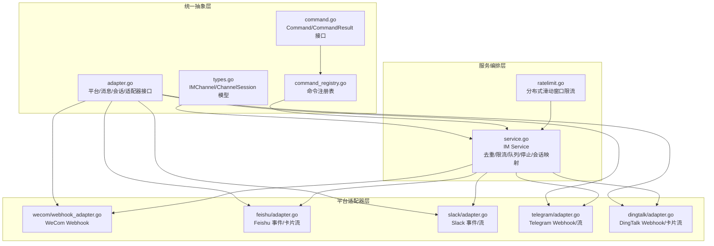
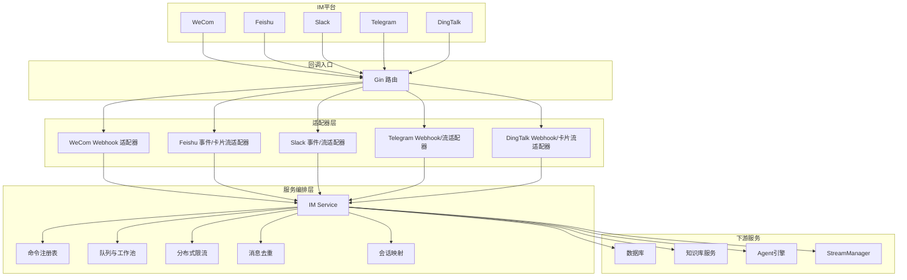
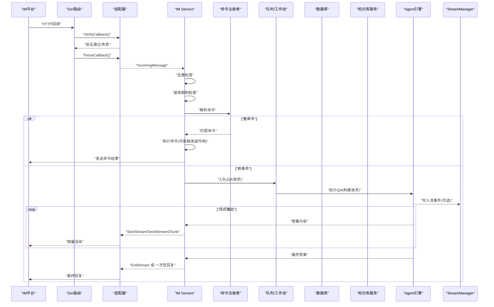
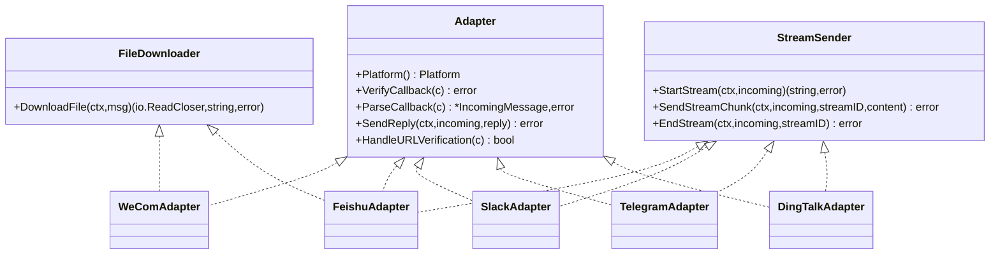
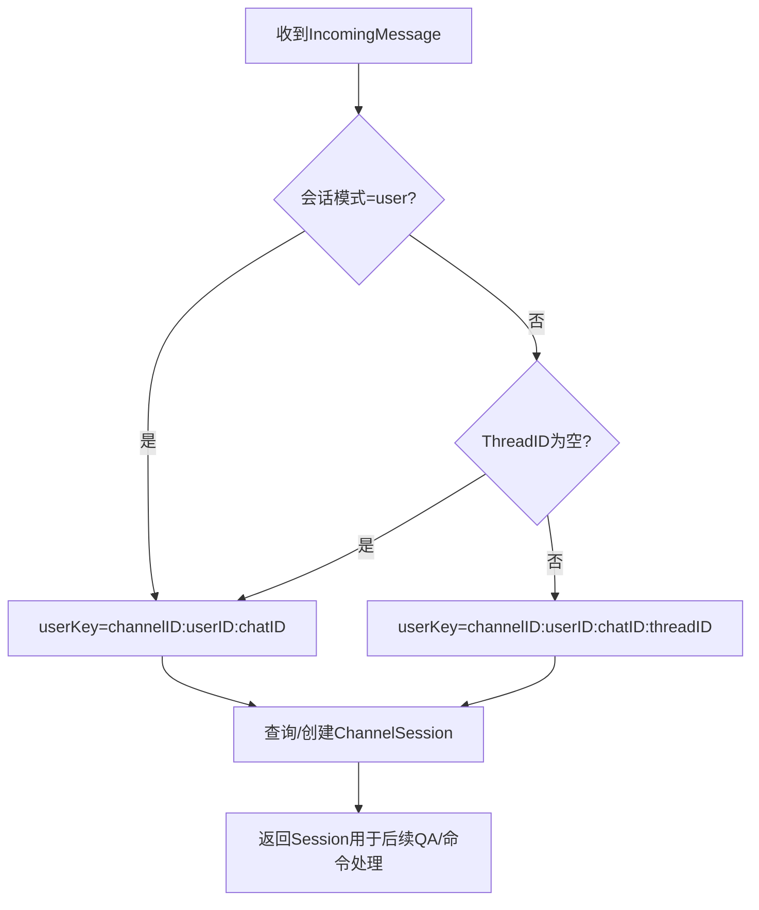
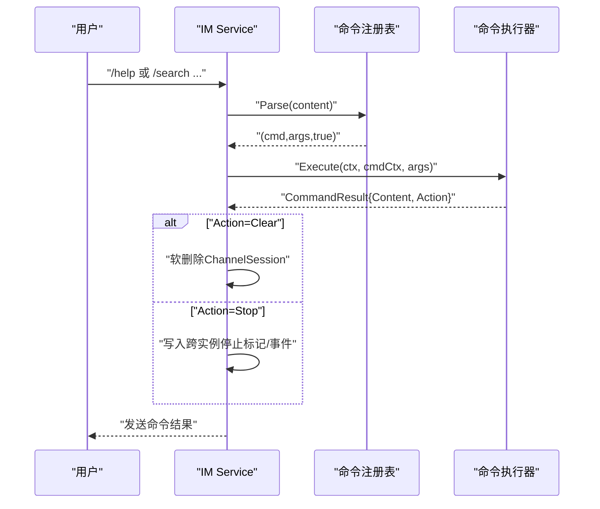
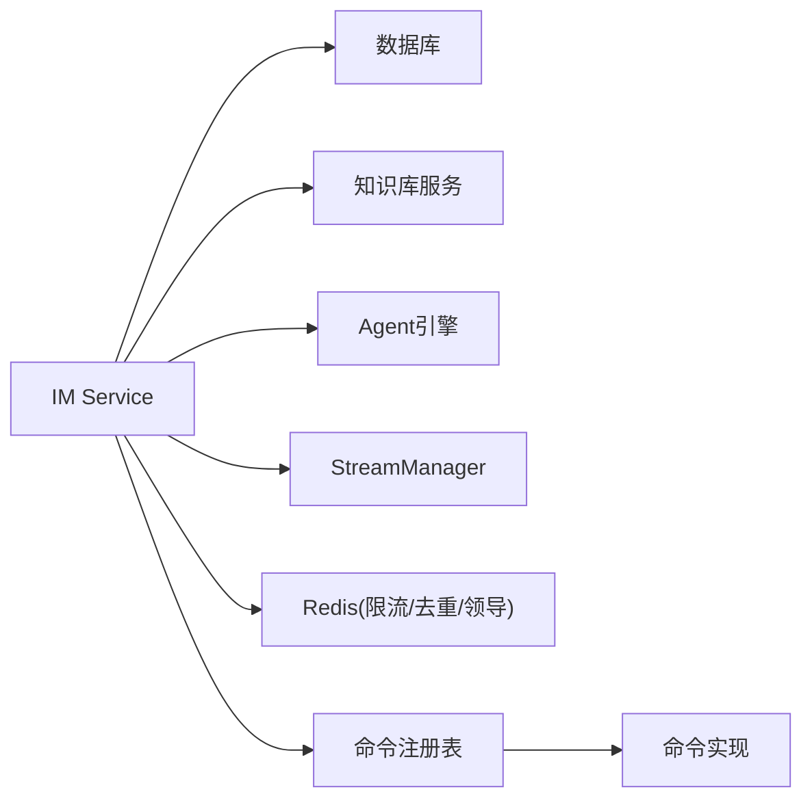

# 即时通讯消息流程

<cite>
**本文档引用的文件**
- [service.go](file://internal/im/service.go)
- [adapter.go](file://internal/im/adapter.go)
- [types.go](file://internal/im/types.go)
- [command.go](file://internal/im/command.go)
- [command_registry.go](file://internal/im/command_registry.go)
- [wecom/webhook_adapter.go](file://internal/im/wecom/webhook_adapter.go)
- [feishu/adapter.go](file://internal/im/feishu/adapter.go)
- [slack/adapter.go](file://internal/im/slack/adapter.go)
- [telegram/adapter.go](file://internal/im/telegram/adapter.go)
- [dingtalk/adapter.go](file://internal/im/dingtalk/adapter.go)
- [cmd_help.go](file://internal/im/cmd_help.go)
- [cmd_search.go](file://internal/im/cmd_search.go)
- [cmd_clear.go](file://internal/im/cmd_clear.go)
- [cmd_stop.go](file://internal/im/cmd_stop.go)
- [ratelimit.go](file://internal/im/ratelimit.go)
</cite>

## 目录
1. [简介](#简介)
2. [项目结构](#项目结构)
3. [核心组件](#核心组件)
4. [架构总览](#架构总览)
5. [详细组件分析](#详细组件分析)
6. [依赖关系分析](#依赖关系分析)
7. [性能考量](#性能考量)
8. [故障排查指南](#故障排查指南)
9. [结论](#结论)
10. [附录](#附录)

## 简介
本文件面向WeKnora的即时通讯（IM）消息处理子系统，系统性梳理从IM平台消息接收到底层处理的完整数据链路，覆盖消息路由、命令解析、会话管理、响应发送、多平台适配、消息转发与多租户隔离、消息去重与历史记录、消息队列与异步处理、以及错误恢复策略。文档同时给出关键流程的时序图与架构图，帮助开发者与运维人员快速理解并高效定位问题。

## 项目结构
IM子系统采用“统一适配器接口 + 多平台适配器 + 服务编排”的分层设计：
- 统一抽象层：定义平台枚举、消息类型、会话模式、适配器接口与流式发送接口。
- 平台适配器层：针对WeCom、Feishu、Slack、Telegram、DingTalk等平台实现各自的回调解析、签名验证、消息发送与文件下载。
- 服务编排层：负责通道生命周期管理、消息去重、速率限制、命令注册与执行、会话映射、队列与工作池、跨实例停止信号、流式输出与卡片渲染。
- 命令系统：内置帮助、搜索、清会话、停止等命令，支持扩展注册。

图表来源
- [adapter.go:10-165](file://internal/im/adapter.go#L10-L165)
- [types.go:14-179](file://internal/im/types.go#L14-L179)
- [command.go:52-67](file://internal/im/command.go#L52-L67)
- [command_registry.go:5-93](file://internal/im/command_registry.go#L5-L93)
- [wecom/webhook_adapter.go:77-126](file://internal/im/wecom/webhook_adapter.go#L77-L126)
- [feishu/adapter.go:38-60](file://internal/im/feishu/adapter.go#L38-L60)
- [slack/adapter.go:28-50](file://internal/im/slack/adapter.go#L28-L50)
- [telegram/adapter.go:29-52](file://internal/im/telegram/adapter.go#L29-L52)
- [dingtalk/adapter.go:40-72](file://internal/im/dingtalk/adapter.go#L40-L72)
- [service.go:101-163](file://internal/im/service.go#L101-L163)
- [ratelimit.go:53-104](file://internal/im/ratelimit.go#L53-L104)

章节来源
- [adapter.go:10-165](file://internal/im/adapter.go#L10-L165)
- [types.go:14-179](file://internal/im/types.go#L14-L179)
- [command.go:52-67](file://internal/im/command.go#L52-L67)
- [command_registry.go:5-93](file://internal/im/command_registry.go#L5-L93)
- [service.go:101-163](file://internal/im/service.go#L101-L163)

## 核心组件
- 统一适配器接口：所有平台必须实现平台标识、回调校验、回调解析、回复发送、URL验证处理；部分平台可选实现流式发送与文件下载。
- 通道配置与会话映射：IMChannel绑定Agent与凭证，ChannelSession将IM用户×聊天×线程映射到WeKnora会话，支持用户级与线程级两种会话模式。
- 服务编排：负责通道启动/停止、消息去重、速率限制、命令注册与执行、队列与工作池、跨实例停止信号、流式输出与卡片渲染。
- 命令系统：内置帮助、搜索、清会话、停止命令，支持扩展注册；命令执行结果可触发服务侧副作用（如清会话、停止）。

章节来源
- [adapter.go:120-165](file://internal/im/adapter.go#L120-L165)
- [types.go:14-179](file://internal/im/types.go#L14-L179)
- [service.go:101-163](file://internal/im/service.go#L101-L163)
- [command.go:52-67](file://internal/im/command.go#L52-L67)
- [command_registry.go:5-93](file://internal/im/command_registry.go#L5-L93)

## 架构总览
下图展示从IM平台回调到WeKnora服务处理再到平台回复的整体架构与关键交互点。

图表来源
- [wecom/webhook_adapter.go:128-131](file://internal/im/wecom/webhook_adapter.go#L128-L131)
- [feishu/adapter.go:100-103](file://internal/im/feishu/adapter.go#L100-L103)
- [slack/adapter.go:96-98](file://internal/im/slack/adapter.go#L96-L98)
- [telegram/adapter.go:54-56](file://internal/im/telegram/adapter.go#L54-L56)
- [dingtalk/adapter.go:74-76](file://internal/im/dingtalk/adapter.go#L74-L76)
- [service.go:101-163](file://internal/im/service.go#L101-L163)
- [command_registry.go:5-23](file://internal/im/command_registry.go#L5-L23)
- [ratelimit.go:53-104](file://internal/im/ratelimit.go#L53-L104)

## 详细组件分析

### 服务编排与消息处理流水线
- 通道管理：按平台注册适配器工厂，加载数据库中的启用通道并启动；WebSocket/长轮询通道支持Redis领导选举，避免多实例重复连接。
- 回调入口：适配器先进行签名/令牌验证，再解析回调为统一IncomingMessage。
- 去重与限流：优先使用Redis SetNX进行跨实例去重；速率限制采用Redis ZSET滑动窗口，失败回退本地滑动窗口。
- 命令解析：识别以“/”开头的命令，解析为具体命令与参数；未识别的斜杠词不作为命令，允许透传至QA。
- 会话映射：根据会话模式（用户/线程）与用户×聊天×线程生成唯一键，查询或创建ChannelSession。
- 命令执行与业务处理：内置命令（帮助、搜索、清会话、停止）执行后可触发服务侧副作用；普通文本进入QA流水线。
- 流式输出：若平台支持，通过StartStream/SendStreamChunk/EndStream或卡片流进行增量渲染；否则一次性发送。
- 响应发送：根据聊天类型（个人/群组）选择目标ID，调用平台API发送回复。

图表来源
- [service.go:784-800](file://internal/im/service.go#L784-L800)
- [service.go:217-241](file://internal/im/service.go#L217-L241)
- [service.go:390-410](file://internal/im/service.go#L390-L410)
- [service.go:412-451](file://internal/im/service.go#L412-L451)
- [service.go:758-782](file://internal/im/service.go#L758-L782)
- [service.go:101-163](file://internal/im/service.go#L101-L163)
- [command_registry.go:25-51](file://internal/im/command_registry.go#L25-L51)
- [command.go:52-67](file://internal/im/command.go#L52-L67)

章节来源
- [service.go:784-800](file://internal/im/service.go#L784-L800)
- [service.go:217-241](file://internal/im/service.go#L217-L241)
- [service.go:390-410](file://internal/im/service.go#L390-L410)
- [service.go:412-451](file://internal/im/service.go#L412-L451)
- [service.go:758-782](file://internal/im/service.go#L758-L782)
- [service.go:101-163](file://internal/im/service.go#L101-L163)
- [command_registry.go:25-51](file://internal/im/command_registry.go#L25-L51)
- [command.go:52-67](file://internal/im/command.go#L52-L67)

### 多平台适配器架构与消息格式转换
- WeCom Webhook：回调解密、消息类型解析（文本/图片）、群聊@去除、应用群聊优先回复、一次性Markdown回复；支持文件下载。
- Feishu 事件：事件头校验、加密事件解密、消息类型解析（文本/富文本/图片/文件）、线程ID提取、一次性文本回复；支持卡片流式渲染。
- Slack 事件：事件解析、提及去除、文件分享识别、一次性文本回复；支持流式更新消息。
- Telegram Webhook：消息解析、群组@去除、文件/照片识别；支持Markdown与流式编辑消息。
- DingTalk Webhook：回调签名验证、消息解析、群/单聊区分；支持会话Webhook或OpenAPI回复；支持AI卡片流式更新。

图表来源
- [adapter.go:120-165](file://internal/im/adapter.go#L120-L165)
- [wecom/webhook_adapter.go:95-97](file://internal/im/wecom/webhook_adapter.go#L95-L97)
- [feishu/adapter.go:32-34](file://internal/im/feishu/adapter.go#L32-L34)
- [slack/adapter.go:21-26](file://internal/im/slack/adapter.go#L21-L26)
- [telegram/adapter.go:22-27](file://internal/im/telegram/adapter.go#L22-L27)
- [dingtalk/adapter.go:34-38](file://internal/im/dingtalk/adapter.go#L34-L38)

章节来源
- [adapter.go:120-165](file://internal/im/adapter.go#L120-L165)
- [wecom/webhook_adapter.go:128-131](file://internal/im/wecom/webhook_adapter.go#L128-L131)
- [feishu/adapter.go:100-103](file://internal/im/feishu/adapter.go#L100-L103)
- [slack/adapter.go:96-98](file://internal/im/slack/adapter.go#L96-L98)
- [telegram/adapter.go:54-56](file://internal/im/telegram/adapter.go#L54-L56)
- [dingtalk/adapter.go:74-76](file://internal/im/dingtalk/adapter.go#L74-L76)

### 会话状态管理与线程消息关联
- 会话模式：用户模式（用户×聊天）与线程模式（线程×聊天）。线程模式下，顶级消息使用自身ID作为ThreadID，形成独立会话。
- 用户键生成：makeUserKey综合通道ID、用户ID、聊天ID与线程ID，确保跨实例一致性。
- 会话映射：ChannelSession持久化映射关系，支持软删除与状态字段；会话清理触发后，下一条消息将创建新会话。
- 线程消息：各平台ThreadID来源不同（如Slack thread_ts、Feishu root_id、Telegram message_thread_id），统一映射到IncomingMessage.ThreadID。

图表来源
- [service.go:165-174](file://internal/im/service.go#L165-L174)
- [types.go:147-179](file://internal/im/types.go#L147-L179)

章节来源
- [service.go:165-174](file://internal/im/service.go#L165-L174)
- [types.go:147-179](file://internal/im/types.go#L147-L179)

### 命令系统设计
- 命令接口：Name/Description/Execute，返回CommandResult，其中Action可触发服务侧副作用（清会话、停止）。
- 注册表：大小写不敏感注册，重复注册在启动期即panic，避免静默覆盖。
- 命令识别：LooksLikeCommand区分“/help”这类命令尝试与“/api/v2/users”这类路径，前者走命令，后者透传QA。
- 内置命令：
  - /help：列出或展示指定命令详情。
  - /search：在知识库中检索原文，限制结果数量与每条长度，支持工具能力过滤。
  - /clear：清空当前会话上下文，下次消息开启全新会话。
  - /stop：请求中止当前进行中的QA请求。

图表来源
- [command_registry.go:25-51](file://internal/im/command_registry.go#L25-L51)
- [command.go:24-30](file://internal/im/command.go#L24-L30)
- [cmd_help.go:24-50](file://internal/im/cmd_help.go#L24-L50)
- [cmd_search.go:38-132](file://internal/im/cmd_search.go#L38-L132)
- [cmd_clear.go:17-22](file://internal/im/cmd_clear.go#L17-L22)
- [cmd_stop.go:16-21](file://internal/im/cmd_stop.go#L16-L21)

章节来源
- [command_registry.go:25-51](file://internal/im/command_registry.go#L25-L51)
- [command.go:24-30](file://internal/im/command.go#L24-L30)
- [cmd_help.go:24-50](file://internal/im/cmd_help.go#L24-L50)
- [cmd_search.go:38-132](file://internal/im/cmd_search.go#L38-L132)
- [cmd_clear.go:17-22](file://internal/im/cmd_clear.go#L17-L22)
- [cmd_stop.go:16-21](file://internal/im/cmd_stop.go#L16-L21)

### 消息转发机制与多租户隔离
- 多租户隔离：IMChannel包含TenantID字段，通道加载与查询均按租户过滤；会话映射也包含TenantID，确保跨租户互不影响。
- 消息去重：Redis SetNX键“im:dedup:{messageID}”，TTL控制过期；单实例模式使用本地sync.Map，失败闭合策略避免重复处理。
- 历史记录：会话映射与消息存储配合，支持后续检索与审计；引用消息格式化为LLM上下文，非文本引用生成提示而非占位符。
- 跨实例停止：/stop通过Redis预检查与StreamManager事件写入，结合watcher循环检测，实现跨实例取消。

章节来源
- [types.go:14-32](file://internal/im/types.go#L14-L32)
- [service.go:758-782](file://internal/im/service.go#L758-L782)
- [service.go:628-727](file://internal/im/service.go#L628-L727)

### 消息队列、异步处理与错误恢复
- 队列与工作池：newQAQueue创建有界队列与工作池，支持全局并发上限与每用户上限，保护下游资源。
- 流式输出：各平台适配器实现StartStream/SendStreamChunk/EndStream，或卡片流式更新；流状态带超时清理，防止内存泄漏。
- 错误恢复：Redis失败时限流与去重采用本地回退；通道启动失败释放锁；WebSocket领导权丢失自动停止适配器；/stop事件驱动取消。

章节来源
- [service.go:325-327](file://internal/im/service.go#L325-L327)
- [service.go:520-617](file://internal/im/service.go#L520-L617)
- [service.go:699-727](file://internal/im/service.go#L699-L727)
- [feishu/adapter.go:636-728](file://internal/im/feishu/adapter.go#L636-L728)
- [slack/adapter.go:227-307](file://internal/im/slack/adapter.go#L227-L307)
- [telegram/adapter.go:359-446](file://internal/im/telegram/adapter.go#L359-L446)
- [dingtalk/adapter.go:492-594](file://internal/im/dingtalk/adapter.go#L492-L594)

## 依赖关系分析
- 低耦合：适配器通过统一接口对接服务编排层，平台差异被封装在适配器内部。
- 关键依赖：服务编排依赖数据库（通道/会话）、知识库服务（搜索命令）、Agent引擎（QA流水线）、StreamManager（跨实例停止）、Redis（去重/限流/领导选举）。
- 命令注册：命令注册表集中管理，命令实现与服务层解耦，便于扩展。

图表来源
- [service.go:108-126](file://internal/im/service.go#L108-L126)
- [command_registry.go:5-23](file://internal/im/command_registry.go#L5-L23)

章节来源
- [service.go:108-126](file://internal/im/service.go#L108-L126)
- [command_registry.go:5-23](file://internal/im/command_registry.go#L5-L23)

## 性能考量
- 去重与限流：Redis SetNX与ZSET滑动窗口减少重复计算与下游压力；失败回退本地实现保证可用性。
- 流式输出：平台侧增量渲染降低首屏延迟，同时避免API限流；流状态带节流与超时清理。
- 队列背压：有界队列与工作池限制并发，保护LLM与下游资源。
- 文件下载：平台直链优先，必要时经WeKnora代理，避免阻塞主流程。

## 故障排查指南
- 回调验证失败：检查平台签名/令牌配置是否正确，确认回调URL与平台设置一致。
- 消息未处理：确认消息ID是否已在Redis去重键或本地缓存中存在；检查通道是否启用且实例拥有领导权。
- 限流导致拒绝：观察Redis限流键是否存在，调整窗口与阈值；检查本地清理协程是否正常运行。
- 命令未生效：确认命令名称大小写不敏感注册是否冲突；检查命令执行是否返回Action副作用。
- 流式输出异常：检查StartStream是否成功创建会话，SendStreamChunk是否被节流；EndStream是否正确关闭。

章节来源
- [wecom/webhook_adapter.go:133-162](file://internal/im/wecom/webhook_adapter.go#L133-L162)
- [feishu/adapter.go:105-147](file://internal/im/feishu/adapter.go#L105-L147)
- [slack/adapter.go:100-123](file://internal/im/slack/adapter.go#L100-L123)
- [telegram/adapter.go:62-71](file://internal/im/telegram/adapter.go#L62-L71)
- [dingtalk/adapter.go:82-113](file://internal/im/dingtalk/adapter.go#L82-L113)
- [service.go:758-782](file://internal/im/service.go#L758-L782)
- [ratelimit.go:74-104](file://internal/im/ratelimit.go#L74-L104)

## 结论
WeKnora的IM消息处理通过统一适配器接口与服务编排层，实现了对多平台的高内聚低耦合适配；借助Redis实现跨实例一致性（去重、限流、领导选举、停止信号），辅以有界队列与流式输出，兼顾性能与可靠性。命令系统与会话映射进一步增强了可扩展性与用户体验。建议在生产环境启用Redis以获得最佳一致性与可观测性，并根据平台特性合理配置输出模式与流式策略。

## 附录
- 关键常量与默认值：最大内容长度、引用截断长度、流刷新间隔、去重TTL、限流窗口与阈值等。
- 会话模式与ThreadID语义：明确线程模式下的会话边界与顶级消息行为。
- 命令扩展：新增命令需实现Command接口并通过注册表注册，遵循“返回内容 + 可选副作用”的约定。

章节来源
- [service.go:30-80](file://internal/im/service.go#L30-L80)
- [types.go:147-179](file://internal/im/types.go#L147-L179)
- [command.go:24-30](file://internal/im/command.go#L24-L30)
- [command_registry.go:15-23](file://internal/im/command_registry.go#L15-L23)