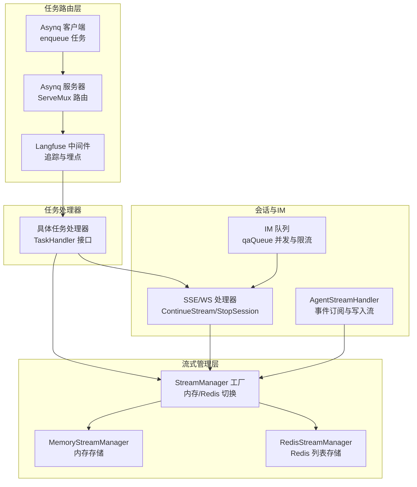
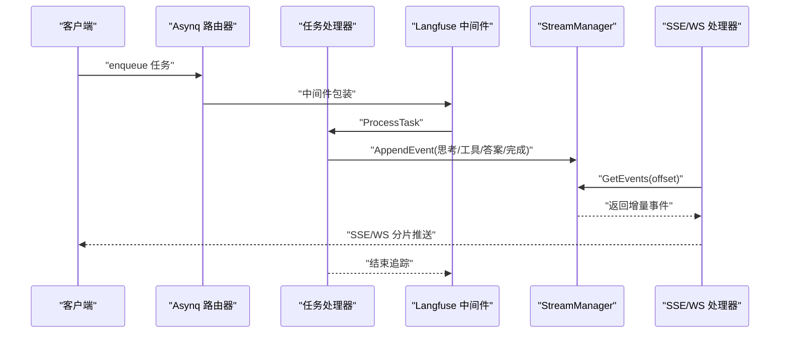
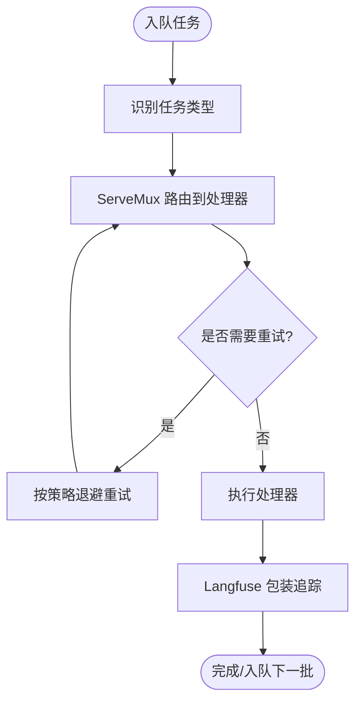
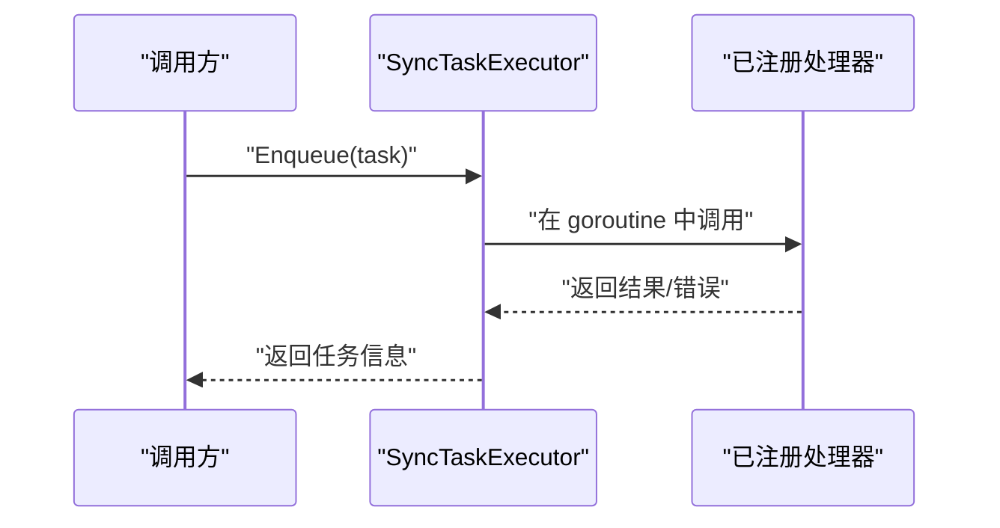
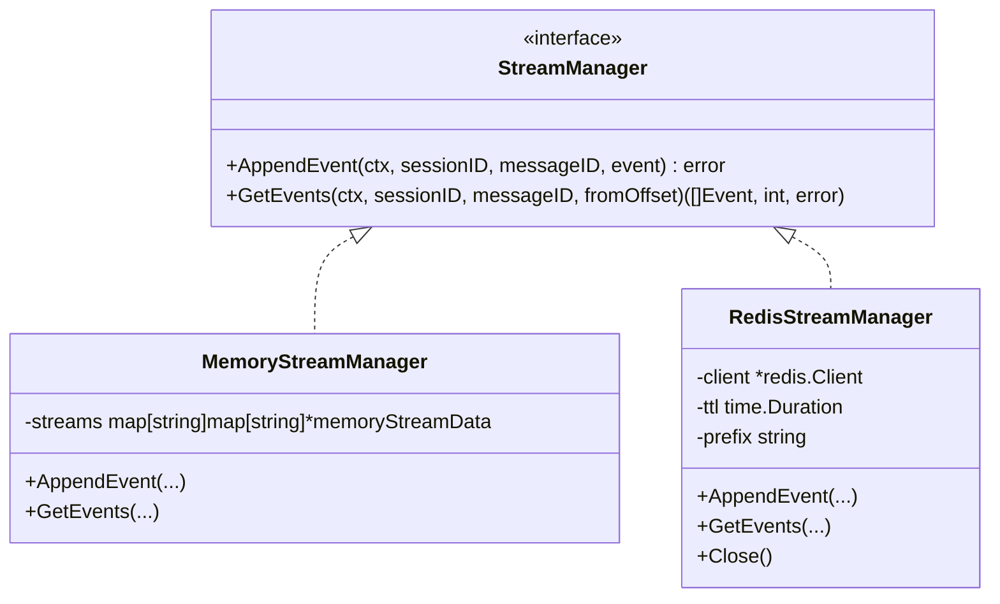
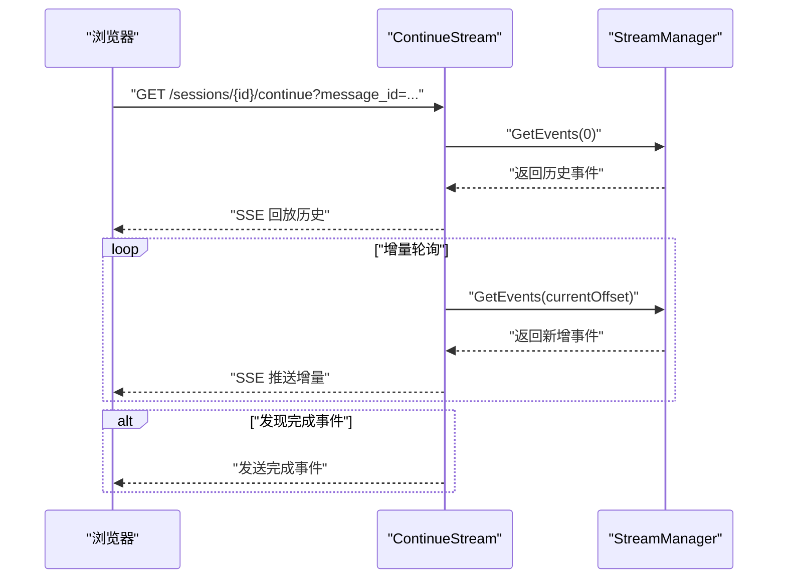
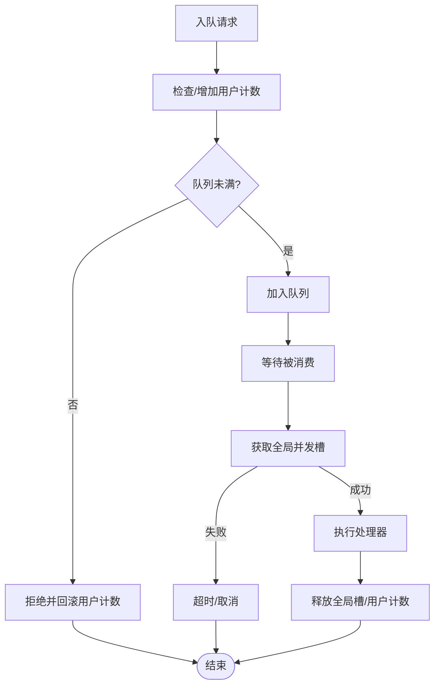
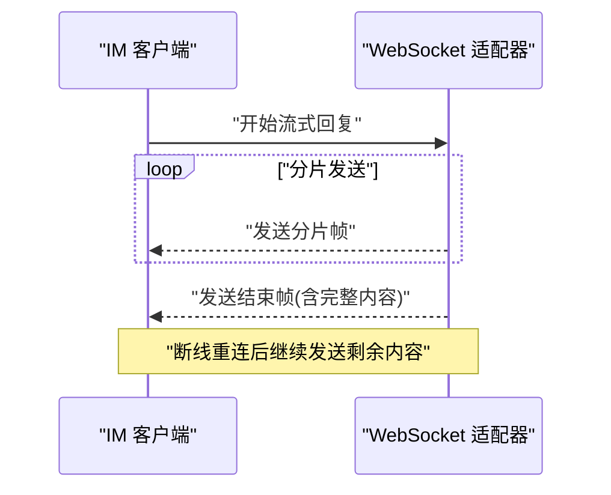
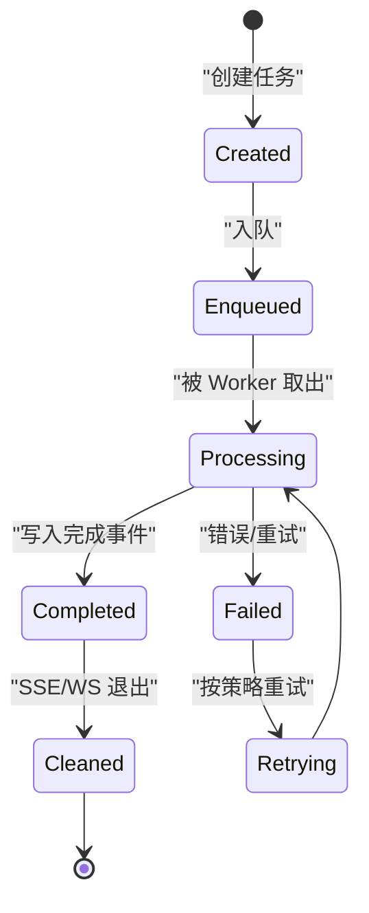
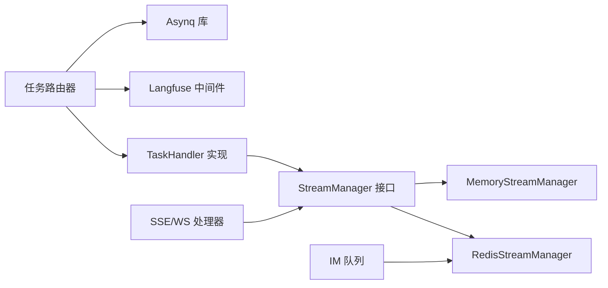

# 异步数据处理机制

<cite>
**本文引用的文件**
- [internal/router/task.go](file://internal/router/task.go)
- [internal/router/sync_task.go](file://internal/router/sync_task.go)
- [internal/stream/factory.go](file://internal/stream/factory.go)
- [internal/stream/memory_manager.go](file://internal/stream/memory_manager.go)
- [internal/stream/redis_manager.go](file://internal/stream/redis_manager.go)
- [internal/handler/session/stream.go](file://internal/handler/session/stream.go)
- [internal/handler/session/agent_stream_handler.go](file://internal/handler/session/agent_stream_handler.go)
- [internal/im/qaqueue.go](file://internal/im/qaqueue.go)
- [internal/im/wecom/longconn.go](file://internal/im/wecom/longconn.go)
- [internal/im/service.go](file://internal/im/service.go)
- [internal/tracing/langfuse/asynq.go](file://internal/tracing/langfuse/asynq.go)
- [internal/types/interfaces/task_handler.go](file://internal/types/interfaces/task_handler.go)
- [internal/utils/taskid.go](file://internal/utils/taskid.go)
</cite>

## 目录
1. [简介](#简介)
2. [项目结构](#项目结构)
3. [核心组件](#核心组件)
4. [架构总览](#架构总览)
5. [详细组件分析](#详细组件分析)
6. [依赖分析](#依赖分析)
7. [性能考虑](#性能考虑)
8. [故障排查指南](#故障排查指南)
9. [结论](#结论)
10. [附录](#附录)

## 简介
本文件系统性梳理 WeKnora 的异步数据处理机制，覆盖以下关键主题：
- 异步任务路由与执行：基于 Asynq 的任务路由器、队列管理、并发控制与重试策略
- 流式数据处理：内存流与 Redis 流存储的实现差异与选择
- 任务生命周期：创建、入队、执行、监控、完成通知与清理回收
- 流式响应处理：SSE/WS 连接管理、事件分片传输与客户端同步
- 错误处理与重试：失败检测、自动重试与死信处理
- 性能监控、资源管理与故障恢复

## 项目结构
WeKnora 的异步处理由“任务路由层（Asynq）+ 任务处理器 + 流式管理层 + 会话/IM 层”构成，形成从请求到响应的完整链路。

图表来源
- [internal/router/task.go:100-165](file://internal/router/task.go#L100-L165)
- [internal/router/sync_task.go:86-106](file://internal/router/sync_task.go#L86-L106)
- [internal/stream/factory.go:17-37](file://internal/stream/factory.go#L17-L37)
- [internal/stream/memory_manager.go:18-118](file://internal/stream/memory_manager.go#L18-L118)
- [internal/stream/redis_manager.go:13-138](file://internal/stream/redis_manager.go#L13-L138)
- [internal/handler/session/stream.go:31-176](file://internal/handler/session/stream.go#L31-L176)
- [internal/handler/session/agent_stream_handler.go:15-506](file://internal/handler/session/agent_stream_handler.go#L15-L506)
- [internal/im/qaqueue.go:67-407](file://internal/im/qaqueue.go#L67-L407)

章节来源
- [internal/router/task.go:18-98](file://internal/router/task.go#L18-L98)
- [internal/router/sync_task.go:17-84](file://internal/router/sync_task.go#L17-L84)
- [internal/stream/factory.go:11-37](file://internal/stream/factory.go#L11-L37)
- [internal/stream/memory_manager.go:11-118](file://internal/stream/memory_manager.go#L11-L118)
- [internal/stream/redis_manager.go:13-138](file://internal/stream/redis_manager.go#L13-L138)
- [internal/handler/session/stream.go:18-176](file://internal/handler/session/stream.go#L18-L176)
- [internal/handler/session/agent_stream_handler.go:15-506](file://internal/handler/session/agent_stream_handler.go#L15-L506)
- [internal/im/qaqueue.go:15-407](file://internal/im/qaqueue.go#L15-L407)

## 核心组件
- 任务路由器与执行器
  - Asynq 客户端/服务器：负责任务入队与路由，支持多队列优先级与自定义重试策略
  - Langfuse 中间件：在任务执行前后开启/延续追踪，保证可观测性
  - 同步执行器（Lite 模式）：无 Redis 时的替代方案，直接在 goroutine 中执行
- 流式管理层
  - 工厂：根据环境变量选择内存或 Redis 实现
  - 内存实现：适合单实例、低延迟场景
  - Redis 实现：适合分布式、持久化与 TTL 控制
- 会话与 IM
  - SSE/WS：持续拉取流事件，支持断线重连与完成通知
  - IM 队列：带全局并发门禁与用户级限流，保障稳定性

章节来源
- [internal/router/task.go:100-165](file://internal/router/task.go#L100-L165)
- [internal/router/sync_task.go:17-106](file://internal/router/sync_task.go#L17-L106)
- [internal/stream/factory.go:17-37](file://internal/stream/factory.go#L17-L37)
- [internal/stream/memory_manager.go:18-118](file://internal/stream/memory_manager.go#L18-L118)
- [internal/stream/redis_manager.go:13-138](file://internal/stream/redis_manager.go#L13-L138)
- [internal/handler/session/stream.go:31-176](file://internal/handler/session/stream.go#L31-L176)
- [internal/im/qaqueue.go:67-407](file://internal/im/qaqueue.go#L67-L407)

## 架构总览
下图展示了从任务入队到流式响应的关键路径与组件交互。

图表来源
- [internal/router/task.go:100-165](file://internal/router/task.go#L100-L165)
- [internal/tracing/langfuse/asynq.go:101-142](file://internal/tracing/langfuse/asynq.go#L101-L142)
- [internal/handler/session/agent_stream_handler.go:104-114](file://internal/handler/session/agent_stream_handler.go#L104-L114)
- [internal/handler/session/stream.go:84-176](file://internal/handler/session/stream.go#L84-L176)

## 详细组件分析

### 任务路由器与队列管理
- 任务类型识别与路由
  - ServeMux 注册多种任务类型处理器，统一通过类型字符串进行分发
  - 支持知识库、数据源、图像多模态、后处理等任务类型
- 队列与并发控制
  - 多队列优先级：critical/default/low
  - 自定义重试策略：针对特定错误（如 Wiki 并发锁冲突）采用固定延迟重试
- 中间件与追踪
  - Langfuse 中间件在任务执行前后开启/延续追踪，确保跨服务链路可观测

图表来源
- [internal/router/task.go:67-82](file://internal/router/task.go#L67-L82)
- [internal/router/task.go:84-98](file://internal/router/task.go#L84-L98)
- [internal/router/task.go:100-165](file://internal/router/task.go#L100-L165)
- [internal/tracing/langfuse/asynq.go:101-142](file://internal/tracing/langfuse/asynq.go#L101-L142)

章节来源
- [internal/router/task.go:18-98](file://internal/router/task.go#L18-L98)
- [internal/router/task.go:100-165](file://internal/router/task.go#L100-L165)
- [internal/tracing/langfuse/asynq.go:101-142](file://internal/tracing/langfuse/asynq.go#L101-L142)

### 同步任务执行器（Lite 模式）
- 替代 Asynq 客户端，在无 Redis 场景下直接在 goroutine 中执行
- 通过注册表将任务类型映射到处理器函数
- 记录执行耗时与错误日志，便于运维观测

图表来源
- [internal/router/sync_task.go:37-69](file://internal/router/sync_task.go#L37-L69)
- [internal/router/sync_task.go:86-106](file://internal/router/sync_task.go#L86-L106)

章节来源
- [internal/router/sync_task.go:17-106](file://internal/router/sync_task.go#L17-L106)

### 流式数据处理：内存与 Redis 实现
- 工厂模式选择
  - 内存：默认实现，适合单实例与低延迟
  - Redis：通过环境变量启用，支持 TTL 与分布式共享
- 内存实现要点
  - 以会话/消息维度维护事件列表，支持偏移增量读取
  - 读写加锁，避免竞态；返回副本防止外部修改
- Redis 实现要点
  - 使用列表结构追加事件，支持 LRange 增量读取
  - 设置键 TTL，自动清理过期数据

图表来源
- [internal/stream/factory.go:17-37](file://internal/stream/factory.go#L17-L37)
- [internal/stream/memory_manager.go:18-118](file://internal/stream/memory_manager.go#L18-L118)
- [internal/stream/redis_manager.go:13-138](file://internal/stream/redis_manager.go#L13-L138)

章节来源
- [internal/stream/factory.go:11-37](file://internal/stream/factory.go#L11-L37)
- [internal/stream/memory_manager.go:11-118](file://internal/stream/memory_manager.go#L11-L118)
- [internal/stream/redis_manager.go:13-138](file://internal/stream/redis_manager.go#L13-L138)

### 会话流式响应与客户端同步
- SSE 持续拉取
  - 服务端设置 SSE 头，定时轮询流管理器获取增量事件
  - 发现完成事件后发送最终完成事件并退出
- 停止生成
  - 写入停止事件，前端收到后触发取消与停止提示
- 事件构建
  - 将流事件转换为 SSE 消息，包含内容、元数据与完成标记

图表来源
- [internal/handler/session/stream.go:31-176](file://internal/handler/session/stream.go#L31-L176)

章节来源
- [internal/handler/session/stream.go:18-176](file://internal/handler/session/stream.go#L18-L176)

### IM 队列与并发控制
- 限流与排队
  - 全局并发门禁：通过 Redis INCR/PEXPIRE 实现跨实例计数
  - 用户级限流：Redis 计数 + TTL，避免单用户堆积
  - 队列容量与超时：超过容量或等待超时则拒绝或丢弃
- 指标与可观测性
  - 定期记录深度、活跃工作者、拒绝/超时计数等指标

图表来源
- [internal/im/qaqueue.go:134-175](file://internal/im/qaqueue.go#L134-L175)
- [internal/im/qaqueue.go:216-262](file://internal/im/qaqueue.go#L216-L262)
- [internal/im/qaqueue.go:291-341](file://internal/im/qaqueue.go#L291-L341)
- [internal/im/qaqueue.go:353-381](file://internal/im/qaqueue.go#L353-L381)

章节来源
- [internal/im/qaqueue.go:15-407](file://internal/im/qaqueue.go#L15-L407)

### WebSocket 连接与流式传输（IM）
- 长连接与重连
  - 断线重连后保留缓冲区，确保替换协议下的内容完整性
  - 结束流时清理缓冲区，避免内存泄漏
- 重试与健壮性
  - 结束帧发送失败时进行有限次重试，降低瞬断影响

图表来源
- [internal/im/wecom/longconn.go:259-329](file://internal/im/wecom/longconn.go#L259-L329)
- [internal/im/wecom/longconn.go:359-385](file://internal/im/wecom/longconn.go#L359-L385)

章节来源
- [internal/im/wecom/longconn.go:226-385](file://internal/im/wecom/longconn.go#L226-L385)

### 任务生命周期管理
- 创建与入队
  - 通过 Asynq 客户端创建任务并入队，支持自定义队列与选项
- 执行监控
  - Langfuse 中间件贯穿执行过程，记录输入/输出与结果
- 完成通知与清理
  - 处理器写入完成事件；SSE/WS 检测完成后发送完成事件并退出
  - Redis TTL 自动清理过期流数据

图表来源
- [internal/router/task.go:100-165](file://internal/router/task.go#L100-L165)
- [internal/handler/session/agent_stream_handler.go:489-505](file://internal/handler/session/agent_stream_handler.go#L489-L505)
- [internal/stream/redis_manager.go:76-87](file://internal/stream/redis_manager.go#L76-L87)

章节来源
- [internal/router/task.go:100-165](file://internal/router/task.go#L100-L165)
- [internal/handler/session/agent_stream_handler.go:412-505](file://internal/handler/session/agent_stream_handler.go#L412-L505)
- [internal/stream/redis_manager.go:76-87](file://internal/stream/redis_manager.go#L76-L87)

### 错误处理与重试策略
- 失败检测
  - Langfuse 中间件在任务执行后记录结果标签，便于告警与审计
- 自动重试
  - Asynq 默认指数退避；对特定错误（如 Wiki 并发冲突）采用固定短延迟重试
- 死信处理
  - 通过队列优先级与重试上限控制，避免无限循环
  - IM 队列对超时请求进行丢弃并通知用户

章节来源
- [internal/tracing/langfuse/asynq.go:130-138](file://internal/tracing/langfuse/asynq.go#L130-L138)
- [internal/router/task.go:67-82](file://internal/router/task.go#L67-L82)
- [internal/im/qaqueue.go:230-241](file://internal/im/qaqueue.go#L230-L241)

## 依赖分析
- 组件耦合
  - 任务路由器依赖 Asynq 与 Langfuse 中间件，处理器实现遵循 TaskHandler 接口
  - 流式管理层通过接口抽象，可切换内存/Redis 实现
  - 会话处理器依赖流式管理层与事件总线
- 外部依赖
  - Redis：用于全局并发门禁、用户计数与流数据 TTL
  - Gin：SSE 响应与路由
  - Langfuse：任务执行链路追踪

图表来源
- [internal/router/task.go:100-165](file://internal/router/task.go#L100-L165)
- [internal/types/interfaces/task_handler.go:9-13](file://internal/types/interfaces/task_handler.go#L9-L13)
- [internal/stream/factory.go:17-37](file://internal/stream/factory.go#L17-L37)

章节来源
- [internal/router/task.go:100-165](file://internal/router/task.go#L100-L165)
- [internal/types/interfaces/task_handler.go:9-13](file://internal/types/interfaces/task_handler.go#L9-L13)
- [internal/stream/factory.go:17-37](file://internal/stream/factory.go#L17-L37)

## 性能考虑
- 队列与并发
  - 合理配置队列优先级与 Worker 数量，避免热点任务阻塞
  - 使用全局并发门禁与用户级限流，防止雪崩
- 流式读写
  - 内存实现适合低延迟；Redis 实现适合分布式与持久化
  - 增量读取与偏移游标减少重复传输
- 追踪与指标
  - Langfuse 中间件提供端到端时延与错误率观测
  - IM 队列定期日志输出，便于运营监控

## 故障排查指南
- 任务未执行或长时间滞留
  - 检查 Asynq 服务器是否运行、队列优先级是否合理
  - 查看 Langfuse 追踪链路，定位异常阶段
- 流式响应中断
  - 确认 SSE/WS 连接状态与心跳
  - 检查流管理器实现与 Redis 连接
- IM 请求超时或被拒绝
  - 核对队列容量、用户级限流与全局并发门禁
  - 关注超时阈值与重试策略

章节来源
- [internal/router/task.go:100-165](file://internal/router/task.go#L100-L165)
- [internal/handler/session/stream.go:134-176](file://internal/handler/session/stream.go#L134-L176)
- [internal/im/qaqueue.go:230-241](file://internal/im/qaqueue.go#L230-L241)

## 结论
WeKnora 的异步处理机制通过 Asynq 路由器、Langfuse 追踪、可插拔流式管理层与会话/IM 层，实现了高可用、可观测与可扩展的异步数据处理能力。内存与 Redis 两种流式实现满足不同部署形态的需求；全局并发门禁与用户级限流保障系统稳定性；SSE/WS 与停止事件机制提供良好的用户体验。建议在生产环境中结合指标与日志完善告警与容量规划。

## 附录
- 任务 ID 规范
  - 支持生成带前缀的任务 ID，包含任务类型、租户 ID、时间戳与业务 ID
  - 提供解析方法，便于审计与排障

章节来源
- [internal/utils/taskid.go:44-115](file://internal/utils/taskid.go#L44-L115)