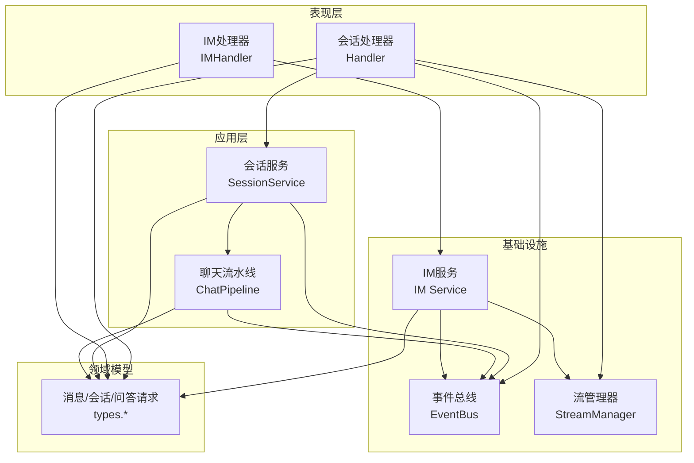
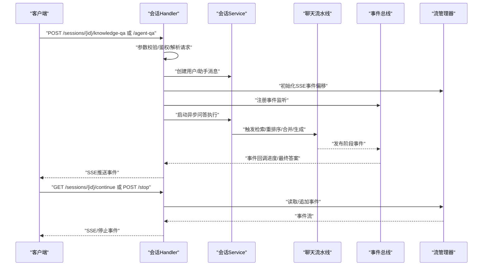
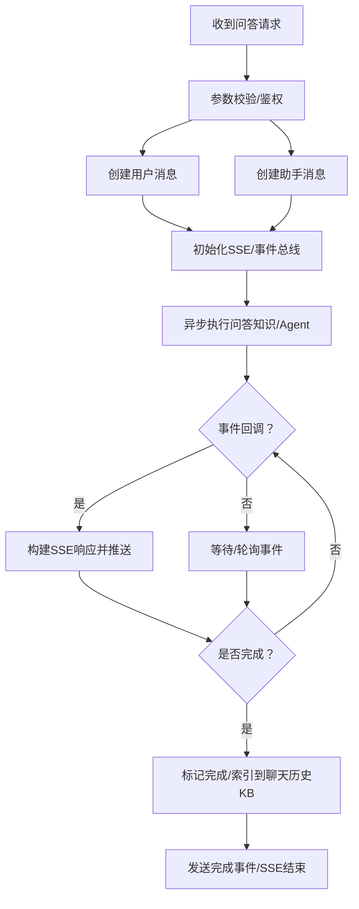
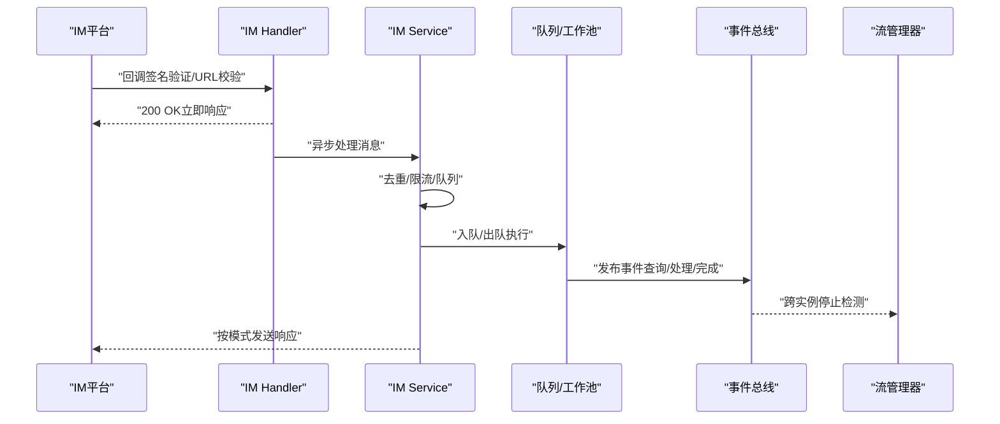
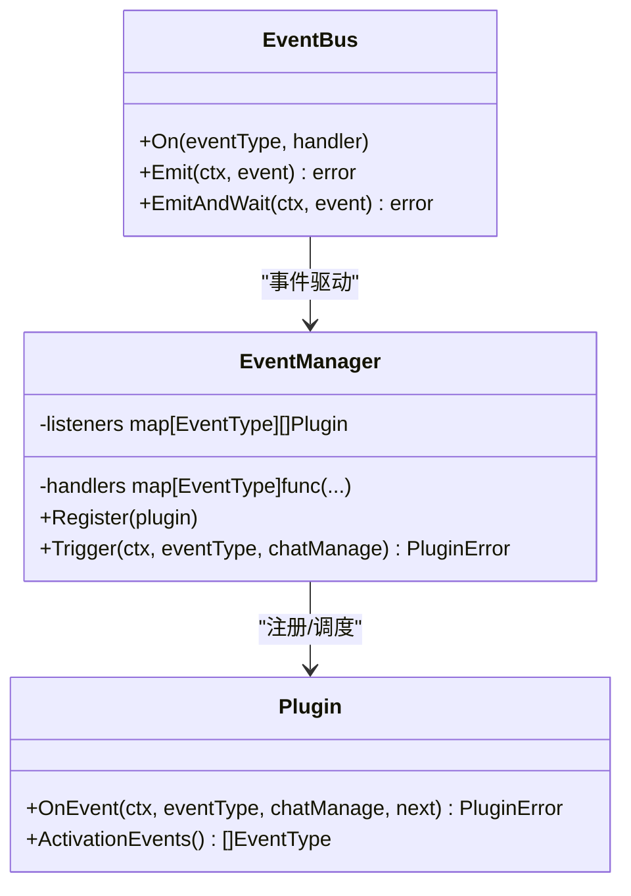
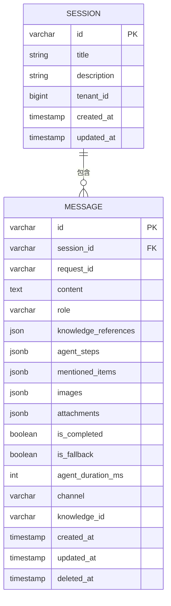
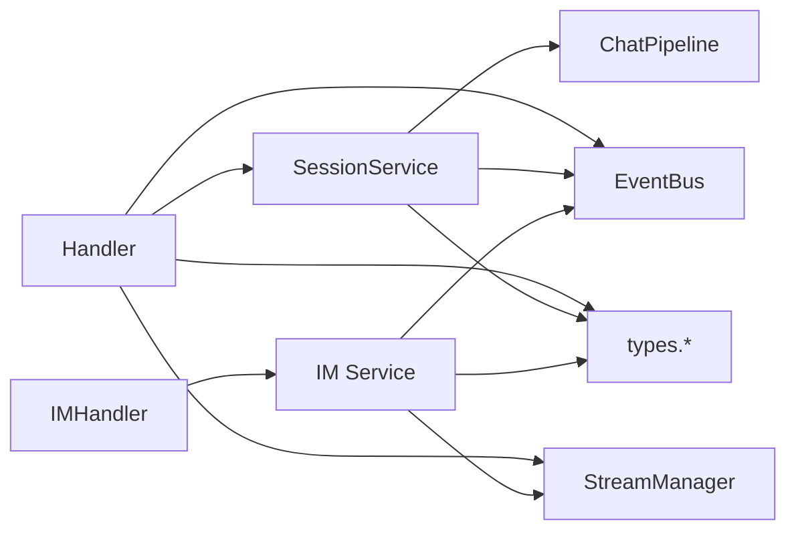

# 数据流设计

<cite>
**本文引用的文件**
- [internal/handler/session/handler.go](file://internal/handler/session/handler.go)
- [internal/handler/session/qa.go](file://internal/handler/session/qa.go)
- [internal/handler/session/stream.go](file://internal/handler/session/stream.go)
- [internal/handler/im.go](file://internal/handler/im.go)
- [internal/application/service/session.go](file://internal/application/service/session.go)
- [internal/application/service/chat_pipeline/chat_pipeline.go](file://internal/application/service/chat_pipeline/chat_pipeline.go)
- [internal/event/event.go](file://internal/event/event.go)
- [internal/stream/factory.go](file://internal/stream/factory.go)
- [internal/im/service.go](file://internal/im/service.go)
- [internal/types/chat.go](file://internal/types/chat.go)
- [internal/types/message.go](file://internal/types/message.go)
- [internal/types/session.go](file://internal/types/session.go)
- [internal/types/qa_request.go](file://internal/types/qa_request.go)
- [internal/types/agent.go](file://internal/types/agent.go)
</cite>

## 目录
1. [引言](#引言)
2. [项目结构](#项目结构)
3. [核心组件](#核心组件)
4. [架构总览](#架构总览)
5. [详细组件分析](#详细组件分析)
6. [依赖分析](#依赖分析)
7. [性能考虑](#性能考虑)
8. [故障排查指南](#故障排查指南)
9. [结论](#结论)

## 引言
本文件面向WeKnora系统的数据流设计，聚焦四大核心数据流转路径：
- 文档处理流程：从上传/解析到向量化与索引，支撑RAG检索与生成。
- 问答处理流程：从HTTP请求到SSE流式响应，覆盖知识问答与Agent问答。
- 代理执行流程：基于事件总线与插件化的聊天流水线，实现工具调用与逐步反馈。
- IM消息处理流程：从平台回调到会话路由、队列与停止信号的分布式协作。

文档将系统性阐述请求参数校验、业务逻辑处理、数据持久化与响应返回的完整链路；解释异步数据处理机制（任务队列、事件驱动、流式处理）；明确数据转换与映射规则（DTO模式、领域模型转换、API响应格式）；并提供数据流图与时序图以直观展示关键业务场景。

## 项目结构
WeKnora采用分层架构与清晰的职责划分：
- 表现层（Handler）：接收HTTP请求，进行参数校验与授权，协调服务层与流管理器。
- 应用层（Service）：封装业务编排，负责会话、消息、知识库、Agent等核心业务。
- 领域层（Types）：统一的数据模型与类型定义，确保跨层一致的数据契约。
- 基础设施（Event/Stream/IM）：事件总线、流管理器、IM适配器与队列，支撑异步与分布式能力。

**图表来源**
- [internal/handler/session/handler.go:17-64](file://internal/handler/session/handler.go#L17-L64)
- [internal/handler/im.go:21-30](file://internal/handler/im.go#L21-L30)
- [internal/application/service/session.go:27-79](file://internal/application/service/session.go#L27-L79)
- [internal/application/service/chat_pipeline/chat_pipeline.go:9-21](file://internal/application/service/chat_pipeline/chat_pipeline.go#L9-L21)
- [internal/event/event.go:80-101](file://internal/event/event.go#L80-L101)
- [internal/stream/factory.go:17-37](file://internal/stream/factory.go#L17-L37)
- [internal/im/service.go:107-163](file://internal/im/service.go#L107-L163)
- [internal/types/chat.go:62-75](file://internal/types/chat.go#L62-L75)
- [internal/types/message.go:176-224](file://internal/types/message.go#L176-L224)
- [internal/types/session.go:74-108](file://internal/types/session.go#L74-L108)
- [internal/types/qa_request.go:3-21](file://internal/types/qa_request.go#L3-L21)

**章节来源**
- [internal/handler/session/handler.go:17-64](file://internal/handler/session/handler.go#L17-L64)
- [internal/handler/im.go:21-30](file://internal/handler/im.go#L21-L30)
- [internal/application/service/session.go:27-79](file://internal/application/service/session.go#L27-L79)
- [internal/application/service/chat_pipeline/chat_pipeline.go:9-21](file://internal/application/service/chat_pipeline/chat_pipeline.go#L9-L21)
- [internal/event/event.go:80-101](file://internal/event/event.go#L80-L101)
- [internal/stream/factory.go:17-37](file://internal/stream/factory.go#L17-L37)
- [internal/im/service.go:107-163](file://internal/im/service.go#L107-L163)
- [internal/types/chat.go:62-75](file://internal/types/chat.go#L62-L75)
- [internal/types/message.go:176-224](file://internal/types/message.go#L176-L224)
- [internal/types/session.go:74-108](file://internal/types/session.go#L74-L108)
- [internal/types/qa_request.go:3-21](file://internal/types/qa_request.go#L3-L21)

## 核心组件
- Handler（会话与IM）
  - 会话Handler：负责会话生命周期管理、问答入口（知识问答/Agent问答）、SSE流控制与停止。
  - IM Handler：负责IM通道的CRUD与回调接入。
- Service（会话与流水线）
  - SessionService：会话与消息的增删改查、标题生成、上下文清理、聊天历史KB索引。
  - ChatPipeline：插件化事件管理器，串联检索、重排序、合并、生成等阶段。
- Event（事件总线）
  - EventBus：统一事件发布订阅，支持同步/异步模式，贯穿Agent执行与SSE推送。
- StreamManager（流管理器）
  - 抽象流事件存储与拉取，支持内存/Redis实现，保障跨实例停止检测与事件回放。
- IM Service
  - IM消息处理：去重、速率限制、队列与工作池、WebSocket领导者选举、跨实例停止信号。

**章节来源**
- [internal/handler/session/handler.go:17-64](file://internal/handler/session/handler.go#L17-L64)
- [internal/handler/im.go:21-30](file://internal/handler/im.go#L21-L30)
- [internal/application/service/session.go:27-79](file://internal/application/service/session.go#L27-L79)
- [internal/application/service/chat_pipeline/chat_pipeline.go:23-37](file://internal/application/service/chat_pipeline/chat_pipeline.go#L23-L37)
- [internal/event/event.go:80-101](file://internal/event/event.go#L80-L101)
- [internal/stream/factory.go:17-37](file://internal/stream/factory.go#L17-L37)
- [internal/im/service.go:107-163](file://internal/im/service.go#L107-L163)

## 架构总览
WeKnora通过Handler编排业务，Service承载领域逻辑，Event/Stream/IM提供异步与分布式能力，Types统一数据契约。整体呈现“请求-编排-事件驱动-持久化-响应”的闭环。

**图表来源**
- [internal/handler/session/qa.go:463-512](file://internal/handler/session/qa.go#L463-L512)
- [internal/handler/session/qa.go:524-658](file://internal/handler/session/qa.go#L524-L658)
- [internal/handler/session/stream.go:31-176](file://internal/handler/session/stream.go#L31-L176)
- [internal/application/service/session.go:449-519](file://internal/application/service/session.go#L449-L519)
- [internal/application/service/chat_pipeline/chat_pipeline.go:70-78](file://internal/application/service/chat_pipeline/chat_pipeline.go#L70-L78)
- [internal/event/event.go:120-157](file://internal/event/event.go#L120-L157)
- [internal/stream/factory.go:17-37](file://internal/stream/factory.go#L17-L37)

## 详细组件分析

### 会话Handler：问答与SSE流
- 请求参数校验与鉴权：从URL/Body提取参数，校验必填字段，进行SSRF保护（图像URL/Caption清空）。
- 会话与消息管理：创建用户消息、助手消息；必要时异步生成会话标题。
- 事件总线与SSE：建立EventBus，注册完成/最终答案等事件；通过SSE推送事件，支持断线重连与继续流。
- 停止机制：支持用户主动停止，写入停止事件至StreamManager，触发上下文取消。

**图表来源**
- [internal/handler/session/qa.go:65-231](file://internal/handler/session/qa.go#L65-L231)
- [internal/handler/session/qa.go:524-658](file://internal/handler/session/qa.go#L524-L658)
- [internal/handler/session/stream.go:31-176](file://internal/handler/session/stream.go#L31-L176)
- [internal/application/service/session.go:730-740](file://internal/application/service/session.go#L730-L740)

**章节来源**
- [internal/handler/session/qa.go:65-231](file://internal/handler/session/qa.go#L65-L231)
- [internal/handler/session/qa.go:524-658](file://internal/handler/session/qa.go#L524-L658)
- [internal/handler/session/stream.go:31-176](file://internal/handler/session/stream.go#L31-L176)
- [internal/application/service/session.go:730-740](file://internal/application/service/session.go#L730-L740)

### IM处理器与IM服务：消息回调与队列
- 回调接入：校验平台签名、URL验证、解析消息体；立即应答避免超时，异步处理。
- 通道管理：支持多种模式（websocket/webhook/longpoll），Redis领导者选举避免重复连接。
- 队列与限流：全局/单用户队列与滑动窗口限流，保障下游资源安全。
- 去重与停止：消息ID去重、跨实例停止标记与流事件检测，支持分布式停止。
- 会话路由：根据渠道解析会话，支持引用上下文注入与智能通知回复。

**图表来源**
- [internal/handler/im.go:249-327](file://internal/handler/im.go#L249-L327)
- [internal/im/service.go:784-800](file://internal/im/service.go#L784-L800)
- [internal/im/service.go:325-328](file://internal/im/service.go#L325-L328)
- [internal/im/service.go:619-727](file://internal/im/service.go#L619-L727)
- [internal/im/service.go:758-782](file://internal/im/service.go#L758-L782)

**章节来源**
- [internal/handler/im.go:249-327](file://internal/handler/im.go#L249-L327)
- [internal/im/service.go:325-328](file://internal/im/service.go#L325-L328)
- [internal/im/service.go:619-727](file://internal/im/service.go#L619-L727)
- [internal/im/service.go:758-782](file://internal/im/service.go#L758-L782)

### 聊天流水线与事件驱动
- 插件化事件管理：通过EventManager注册多个Plugin，按事件类型构建处理链。
- 预定义事件：查询接收/验证/改写、检索（向量/关键词/实体）、重排序、合并、生成、Agent思考/工具调用/最终答案、错误、会话标题、停止等。
- 插件错误：统一的PluginError结构，便于上层捕获与提示。

**图表来源**
- [internal/application/service/chat_pipeline/chat_pipeline.go:9-21](file://internal/application/service/chat_pipeline/chat_pipeline.go#L9-L21)
- [internal/application/service/chat_pipeline/chat_pipeline.go:23-37](file://internal/application/service/chat_pipeline/chat_pipeline.go#L23-L37)
- [internal/application/service/chat_pipeline/chat_pipeline.go:70-78](file://internal/application/service/chat_pipeline/chat_pipeline.go#L70-L78)
- [internal/event/event.go:80-101](file://internal/event/event.go#L80-L101)

**章节来源**
- [internal/application/service/chat_pipeline/chat_pipeline.go:9-21](file://internal/application/service/chat_pipeline/chat_pipeline.go#L9-L21)
- [internal/application/service/chat_pipeline/chat_pipeline.go:23-37](file://internal/application/service/chat_pipeline/chat_pipeline.go#L23-L37)
- [internal/application/service/chat_pipeline/chat_pipeline.go:70-78](file://internal/application/service/chat_pipeline/chat_pipeline.go#L70-L78)
- [internal/event/event.go:80-101](file://internal/event/event.go#L80-L101)

### 数据转换与映射规则
- DTO模式
  - CreateKnowledgeQARequest/IM回调请求等作为HTTP层DTO，进入Handler后转换为内部qaRequestContext与QARequest。
- 领域模型转换
  - Message/Session/AgentConfig等作为领域模型，持久化前通过GORM钩子初始化默认值。
- API响应格式
  - StreamResponse统一SSE响应结构，包含响应类型、内容、引用、用量、完成标志等。

**图表来源**
- [internal/types/session.go:74-108](file://internal/types/session.go#L74-L108)
- [internal/types/message.go:176-224](file://internal/types/message.go#L176-L224)

**章节来源**
- [internal/types/qa_request.go:3-21](file://internal/types/qa_request.go#L3-L21)
- [internal/types/chat.go:62-75](file://internal/types/chat.go#L62-L75)
- [internal/types/message.go:176-224](file://internal/types/message.go#L176-L224)
- [internal/types/session.go:74-108](file://internal/types/session.go#L74-L108)

## 依赖分析
- Handler依赖Service与StreamManager，通过EventBus解耦事件处理。
- Service依赖聊天流水线与事件总线，编排检索与生成。
- IM Service依赖队列、限流、Redis领导者选举与流管理器，实现分布式一致性。
- Types提供统一的数据契约，贯穿各层。

**图表来源**
- [internal/handler/session/handler.go:17-64](file://internal/handler/session/handler.go#L17-L64)
- [internal/application/service/session.go:27-79](file://internal/application/service/session.go#L27-L79)
- [internal/stream/factory.go:17-37](file://internal/stream/factory.go#L17-L37)
- [internal/event/event.go:80-101](file://internal/event/event.go#L80-L101)
- [internal/im/service.go:107-163](file://internal/im/service.go#L107-L163)
- [internal/types/chat.go:62-75](file://internal/types/chat.go#L62-L75)
- [internal/types/message.go:176-224](file://internal/types/message.go#L176-L224)
- [internal/types/session.go:74-108](file://internal/types/session.go#L74-L108)

**章节来源**
- [internal/handler/session/handler.go:17-64](file://internal/handler/session/handler.go#L17-L64)
- [internal/application/service/session.go:27-79](file://internal/application/service/session.go#L27-L79)
- [internal/stream/factory.go:17-37](file://internal/stream/factory.go#L17-L37)
- [internal/event/event.go:80-101](file://internal/event/event.go#L80-L101)
- [internal/im/service.go:107-163](file://internal/im/service.go#L107-L163)
- [internal/types/chat.go:62-75](file://internal/types/chat.go#L62-L75)
- [internal/types/message.go:176-224](file://internal/types/message.go#L176-L224)
- [internal/types/session.go:74-108](file://internal/types/session.go#L74-L108)

## 性能考虑
- SSE轮询间隔与缓冲刷新：Handler侧100ms轮询，IM侧300ms刷新，平衡实时性与平台限流。
- 限流与背压：IM服务采用全局/单用户队列与滑动窗口限流，防止下游过载。
- 分布式一致性：Redis领导者选举与停止标记，避免重复连接与竞态。
- 异步索引：问答完成后异步索引聊天历史，降低主流程延迟。
- 并发处理：附件并发处理、Agent工具调用可并行（配置项），提升吞吐。

[本节为通用指导，无需特定文件引用]

## 故障排查指南
- 参数校验失败：检查请求体绑定与必填字段，关注SSRF防护导致的URL/Caption清空。
- 会话/消息不存在：确认租户上下文与ID合法性，检查鉴权头。
- SSE断流：Handler侧通过偏移量回放事件，前端需实现重连与继续流。
- 停止无效：确认停止事件写入StreamManager成功，跨实例停止依赖Redis键空间。
- IM重复处理：启用Redis去重或检查本地去重Map清理周期。
- 事件未达：检查EventBus注册与异步模式，必要时使用EmitAndWait。

**章节来源**
- [internal/handler/session/qa.go:76-87](file://internal/handler/session/qa.go#L76-L87)
- [internal/handler/session/stream.go:84-99](file://internal/handler/session/stream.go#L84-L99)
- [internal/im/service.go:619-727](file://internal/im/service.go#L619-L727)
- [internal/im/service.go:758-782](file://internal/im/service.go#L758-L782)
- [internal/event/event.go:120-157](file://internal/event/event.go#L120-L157)

## 结论
WeKnora通过Handler编排、Service承载、Event/Stream/IM基础设施协同，实现了高可用、可扩展的数据流体系。问答与IM两大场景均具备完善的参数校验、事件驱动、异步处理与分布式一致性保障。建议在生产环境中结合Redis与合理的队列/限流配置，持续监控事件延迟与SSE稳定性，以获得最佳用户体验。