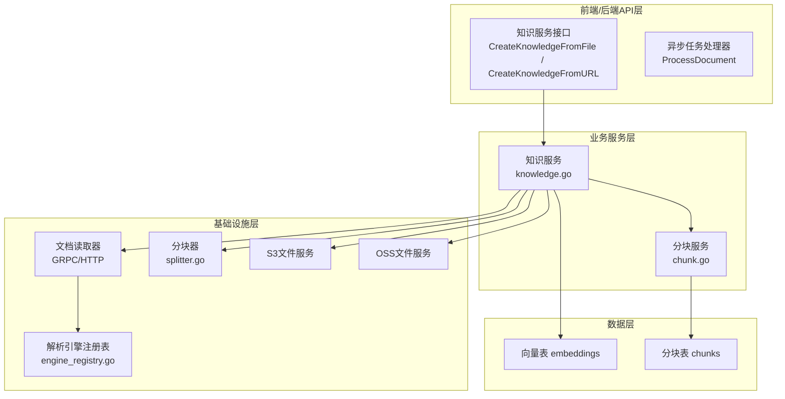
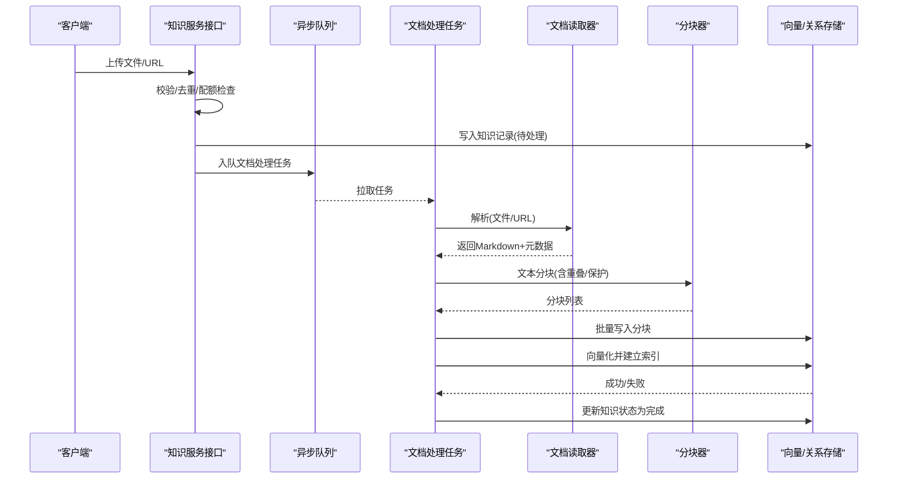
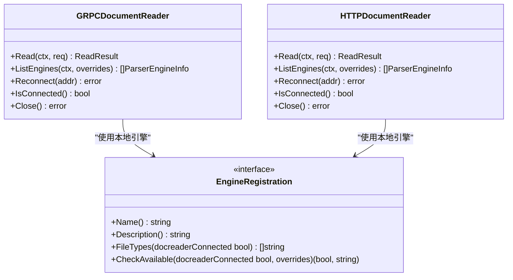
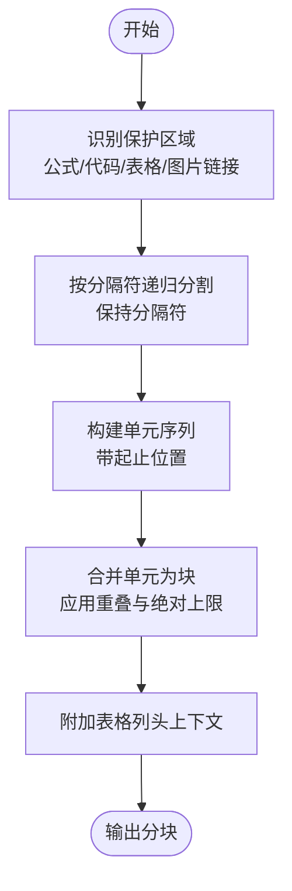
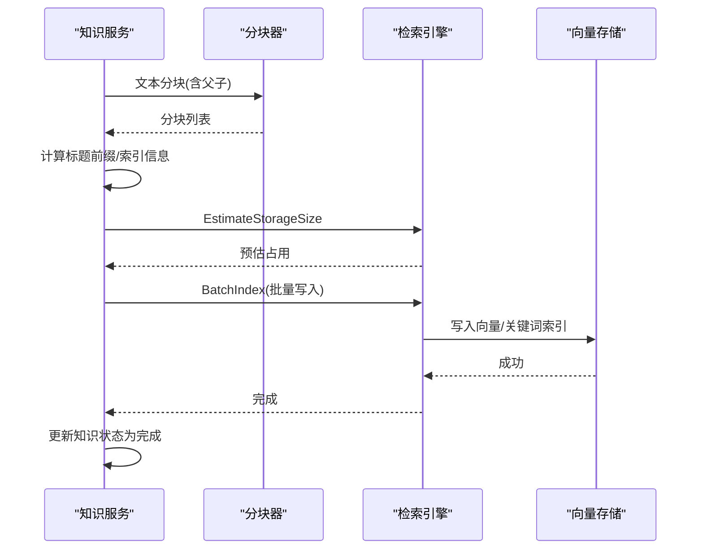
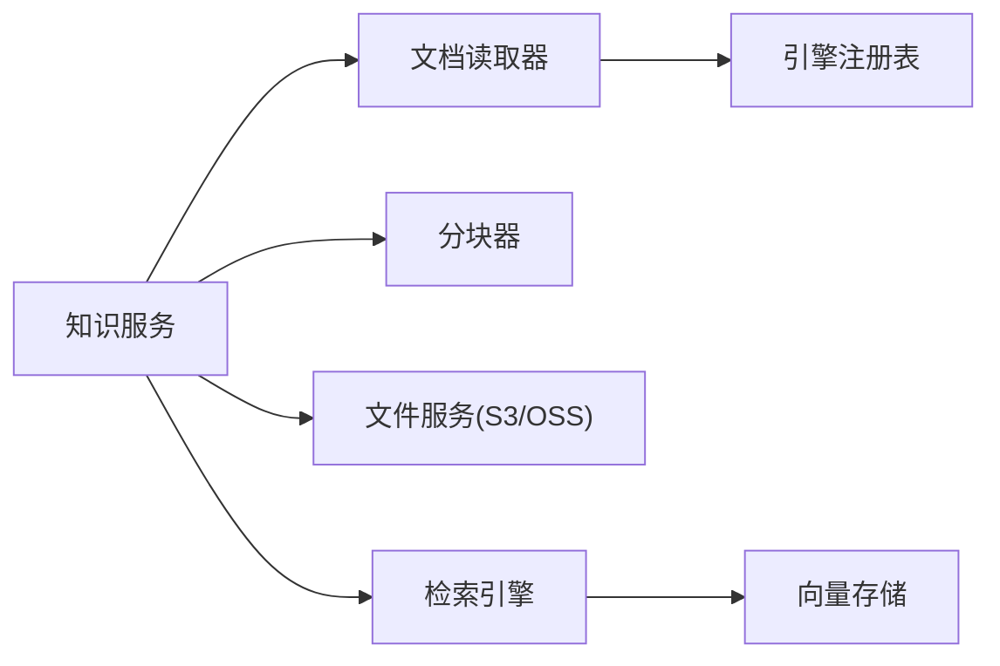

# 文档处理流程

<cite>
**本文引用的文件**
- [docreader/main.py](file://docreader/main.py)
- [docreader/parser/parser.py](file://docreader/parser/parser.py)
- [docreader/parser/registry.py](file://docreader/parser/registry.py)
- [internal/infrastructure/docparser/grpc_parser.go](file://internal/infrastructure/docparser/grpc_parser.go)
- [internal/infrastructure/docparser/http_parser.go](file://internal/infrastructure/docparser/http_parser.go)
- [internal/infrastructure/docparser/engine_registry.go](file://internal/infrastructure/docparser/engine_registry.go)
- [internal/infrastructure/chunker/splitter.go](file://internal/infrastructure/chunker/splitter.go)
- [internal/application/service/knowledge.go](file://internal/application/service/knowledge.go)
- [internal/application/service/chunk.go](file://internal/application/service/chunk.go)
- [internal/application/service/file/s3.go](file://internal/application/service/file/s3.go)
- [internal/application/service/file/oss.go](file://internal/application/service/file/oss.go)
- [internal/application/repository/retriever/postgres/structs.go](file://internal/application/repository/retriever/postgres/structs.go)
- [migrations/paradedb/00-init-db.sql](file://migrations/paradedb/00-init-db.sql)
- [internal/types/interfaces/task_handler.go](file://internal/types/interfaces/task_handler.go)
</cite>

## 目录
1. [简介](#简介)
2. [项目结构](#项目结构)
3. [核心组件](#核心组件)
4. [架构总览](#架构总览)
5. [详细组件分析](#详细组件分析)
6. [依赖分析](#依赖分析)
7. [性能考虑](#性能考虑)
8. [故障排查指南](#故障排查指南)
9. [结论](#结论)
10. [附录](#附录)

## 简介
本文面向WeKnora的“文档处理流程”，系统化梳理从“文件上传”到“知识库存储”的完整数据链路，覆盖以下关键环节：
- 文件上传与接收：本地存储、对象存储（S3、OSS）与文件大小限制
- 文档解析器：gRPC/HTTP通信、并发与可用性检测、错误恢复
- 文本分块：语义分块、重叠策略、元数据保留
- 向量化处理：嵌入模型选择、批量索引与性能优化
- 存储入库：向量与关键词索引、持久化与一致性保障
- 进度跟踪、错误处理与重试机制

## 项目结构
WeKnora采用分层架构：
- 前端/后端API层负责接收上传请求与调度异步任务
- 业务服务层协调解析、分块、向量化与存储
- 基础设施层提供解析器、分块器、文件服务与检索引擎
- 数据层通过向量数据库与关系型数据库持久化

图表来源
- [internal/application/service/knowledge.go](file://internal/application/service/knowledge.go)
- [internal/infrastructure/docparser/grpc_parser.go](file://internal/infrastructure/docparser/grpc_parser.go)
- [internal/infrastructure/docparser/http_parser.go](file://internal/infrastructure/docparser/http_parser.go)
- [internal/infrastructure/docparser/engine_registry.go](file://internal/infrastructure/docparser/engine_registry.go)
- [internal/infrastructure/chunker/splitter.go](file://internal/infrastructure/chunker/splitter.go)
- [internal/application/service/file/s3.go](file://internal/application/service/file/s3.go)
- [internal/application/service/file/oss.go](file://internal/application/service/file/oss.go)
- [internal/application/repository/retriever/postgres/structs.go](file://internal/application/repository/retriever/postgres/structs.go)

章节来源
- [internal/application/service/knowledge.go](file://internal/application/service/knowledge.go)
- [internal/infrastructure/docparser/grpc_parser.go](file://internal/infrastructure/docparser/grpc_parser.go)
- [internal/infrastructure/docparser/http_parser.go](file://internal/infrastructure/docparser/http_parser.go)
- [internal/infrastructure/docparser/engine_registry.go](file://internal/infrastructure/docparser/engine_registry.go)
- [internal/infrastructure/chunker/splitter.go](file://internal/infrastructure/chunker/splitter.go)
- [internal/application/service/file/s3.go](file://internal/application/service/file/s3.go)
- [internal/application/service/file/oss.go](file://internal/application/service/file/oss.go)
- [internal/application/repository/retriever/postgres/structs.go](file://internal/application/repository/retriever/postgres/structs.go)

## 核心组件
- 文档读取器（DocReader）
  - 提供gRPC与HTTP两种客户端实现，统一对外暴露Read与ListEngines能力
  - 支持引擎可用性检测与远程引擎发现
- 解析引擎注册表
  - 维护本地引擎（builtin/simple/weknoracloud/mineru/mineru_cloud）与远程引擎（docreader RPC）
  - 提供合并策略：本地优先、远程权威补充
- 文本分块器
  - 递归分割、保护不可切分区域（公式、代码块、表格、图片链接）
  - 支持父-子两层分块，控制重叠与绝对最大长度
- 文件服务
  - S3与OSS适配，含桶存在性检查、临时桶、预签名下载URL生成
- 知识服务
  - 负责上传校验、去重、入队异步任务、解析、分块、向量化与入库
- 分块服务
  - 提供分块的增删改查与分页查询
- 向量存储
  - embeddings表，支持BM25关键词检索与HNSW向量检索索引

章节来源
- [internal/infrastructure/docparser/grpc_parser.go](file://internal/infrastructure/docparser/grpc_parser.go)
- [internal/infrastructure/docparser/http_parser.go](file://internal/infrastructure/docparser/http_parser.go)
- [internal/infrastructure/docparser/engine_registry.go](file://internal/infrastructure/docparser/engine_registry.go)
- [internal/infrastructure/chunker/splitter.go](file://internal/infrastructure/chunker/splitter.go)
- [internal/application/service/file/s3.go](file://internal/application/service/file/s3.go)
- [internal/application/service/file/oss.go](file://internal/application/service/file/oss.go)
- [internal/application/service/knowledge.go](file://internal/application/service/knowledge.go)
- [internal/application/service/chunk.go](file://internal/application/service/chunk.go)
- [internal/application/repository/retriever/postgres/structs.go](file://internal/application/repository/retriever/postgres/structs.go)

## 架构总览
WeKnora的文档处理采用“同步入口 + 异步处理”的模式：
- 同步阶段：校验、去重、落库、入队
- 异步阶段：解析、分块、向量化、入库、状态更新

图表来源
- [internal/application/service/knowledge.go](file://internal/application/service/knowledge.go)
- [internal/infrastructure/docparser/grpc_parser.go](file://internal/infrastructure/docparser/grpc_parser.go)
- [internal/infrastructure/chunker/splitter.go](file://internal/infrastructure/chunker/splitter.go)
- [internal/application/service/chunk.go](file://internal/application/service/chunk.go)

## 详细组件分析

### 文件上传与接收
- 支持文件上传与URL导入两类入口
- 上传文件路径：
  - 校验文件类型、大小、重复、配额
  - 生成知识记录（状态为pending）
  - 保存文件至KB级或租户级配置的文件服务（S3/OSS）
  - 入队异步任务进行后续解析与入库
- URL导入路径：
  - 对直链文件URL走独立逻辑（白名单扩展名、大小限制）
  - 对网页URL走通用抓取流程
- 文件大小限制：
  - URL直链文件最大10MB
  - gRPC消息大小默认约50MB（可通过环境变量调整）

章节来源
- [internal/application/service/knowledge.go](file://internal/application/service/knowledge.go)
- [internal/application/service/file/s3.go](file://internal/application/service/file/s3.go)
- [internal/application/service/file/oss.go](file://internal/application/service/file/oss.go)
- [docreader/main.py](file://docreader/main.py)

### 文档解析器工作原理
- gRPC客户端
  - 自动连接docreader服务，设置最大消息尺寸
  - Read与ListEngines封装为统一接口
- HTTP客户端
  - 以JSON/HTTP方式访问docreader服务端点
  - 支持超时与连接池配置
- 引擎选择与可用性
  - 本地引擎：builtin/simple/weknoracloud/mineru/mineru_cloud
  - 远程引擎：通过docreader ListEngines RPC动态发现
  - 合并规则：本地优先、远程权威补充
- 错误恢复
  - 连接失败时返回统一错误
  - 解析失败时记录错误并回滚状态

图表来源
- [internal/infrastructure/docparser/grpc_parser.go](file://internal/infrastructure/docparser/grpc_parser.go)
- [internal/infrastructure/docparser/http_parser.go](file://internal/infrastructure/docparser/http_parser.go)
- [internal/infrastructure/docparser/engine_registry.go](file://internal/infrastructure/docparser/engine_registry.go)

章节来源
- [internal/infrastructure/docparser/grpc_parser.go](file://internal/infrastructure/docparser/grpc_parser.go)
- [internal/infrastructure/docparser/http_parser.go](file://internal/infrastructure/docparser/http_parser.go)
- [internal/infrastructure/docparser/engine_registry.go](file://internal/infrastructure/docparser/engine_registry.go)
- [docreader/main.py](file://docreader/main.py)
- [docreader/parser/parser.py](file://docreader/parser/parser.py)
- [docreader/parser/registry.py](file://docreader/parser/registry.py)

### 文本分块算法
- 分割策略
  - 优先按段落、换行、中文句号分割
  - 保护不可切分区域：LaTeX公式、代码块、表格、图片链接
- 重叠策略
  - 控制重叠长度，避免跨单元断裂
  - 对超长保护单元强制拆分，防止超过下游限制
- 上下文保留
  - 表格列头上下文自动前置到新块，避免重复
- 两层分块
  - 父块：较大窗口，提供上下文
  - 子块：较小窗口，用于向量化检索
  - 子块携带ParentIndex以便重建父子关系

图表来源
- [internal/infrastructure/chunker/splitter.go](file://internal/infrastructure/chunker/splitter.go)

章节来源
- [internal/infrastructure/chunker/splitter.go](file://internal/infrastructure/chunker/splitter.go)

### 向量化处理与存储入库
- 嵌入模型选择
  - 由知识库绑定的嵌入模型决定维度与能力
  - 支持估算存储占用，结合租户配额进行容量校验
- 批量处理
  - 将扁平或父子分块转换为索引信息，批量写入向量数据库
  - 支持BM25关键词检索与HNSW向量检索
- 性能优化
  - 预估存储占用，避免超配额
  - 幂等检查：若知识被删除则清理已创建的分块与索引
  - 失败回滚：删除分块、删除向量索引，更新状态为失败

图表来源
- [internal/application/service/knowledge.go](file://internal/application/service/knowledge.go)
- [internal/application/repository/retriever/postgres/structs.go](file://internal/application/repository/retriever/postgres/structs.go)
- [migrations/paradedb/00-init-db.sql](file://migrations/paradedb/00-init-db.sql)

章节来源
- [internal/application/service/knowledge.go](file://internal/application/service/knowledge.go)
- [internal/application/repository/retriever/postgres/structs.go](file://internal/application/repository/retriever/postgres/structs.go)
- [migrations/paradedb/00-init-db.sql](file://migrations/paradedb/00-init-db.sql)

### 对象存储（S3/OSS）与文件大小限制
- S3
  - 支持自定义endpoint（兼容S3兼容网关）
  - 自动检查/创建桶，支持临时桶分离
  - 生成24小时有效期预签名下载URL
- OSS
  - 自动检查/创建桶，支持临时桶
  - 生成24小时有效期预签名下载URL
- 文件大小限制
  - gRPC消息最大约50MB（可由环境变量调整）
  - URL直链文件最大10MB

章节来源
- [internal/application/service/file/s3.go](file://internal/application/service/file/s3.go)
- [internal/application/service/file/oss.go](file://internal/application/service/file/oss.go)
- [docreader/main.py](file://docreader/main.py)
- [internal/application/service/knowledge.go](file://internal/application/service/knowledge.go)

### 进度跟踪、错误处理与重试机制
- 进度跟踪
  - 知识记录状态：pending/processing/failed/enabled
  - 分块服务提供分页查询与批量更新
- 错误处理
  - 解析失败：回滚状态并记录错误
  - 向量化失败：删除分块与索引，回滚状态
  - 删除冲突：若知识在处理中被删除，清理已创建资源
- 重试机制
  - 异步任务最大重试次数为3次
  - 任务处理器幂等：根据知识状态与租户上下文执行

章节来源
- [internal/application/service/knowledge.go](file://internal/application/service/knowledge.go)
- [internal/types/interfaces/task_handler.go](file://internal/types/interfaces/task_handler.go)
- [internal/application/service/chunk.go](file://internal/application/service/chunk.go)

## 依赖分析
- 组件耦合
  - 知识服务依赖文档读取器、分块器、文件服务、检索引擎与仓库
  - 文档读取器依赖解析引擎注册表与Python docreader服务
  - 分块器与检索引擎解耦，便于替换与扩展
- 外部依赖
  - gRPC/HTTP通信、S3/OSS SDK、向量数据库（HNSW/BM25）
- 循环依赖
  - 未发现直接循环依赖；通过接口与服务注入降低耦合

图表来源
- [internal/application/service/knowledge.go](file://internal/application/service/knowledge.go)
- [internal/infrastructure/docparser/grpc_parser.go](file://internal/infrastructure/docparser/grpc_parser.go)
- [internal/infrastructure/docparser/engine_registry.go](file://internal/infrastructure/docparser/engine_registry.go)
- [internal/infrastructure/chunker/splitter.go](file://internal/infrastructure/chunker/splitter.go)
- [internal/application/repository/retriever/postgres/structs.go](file://internal/application/repository/retriever/postgres/structs.go)

## 性能考虑
- 并发与限流
  - gRPC服务端线程池与消息大小限制
  - HTTP客户端连接池与超时控制
- 批量处理
  - 分块后批量写入，减少数据库往返
  - 向量化采用批量索引，提升吞吐
- 存储与索引
  - 预估存储占用，避免超配额
  - HNSW索引按维度建不同参数索引，BM25用于关键词检索

## 故障排查指南
- 文档读取失败
  - 检查docreader服务连通性与日志
  - 确认引擎可用性与配置覆盖
- 解析引擎不可用
  - 查看本地引擎可用性检查结果
  - 若使用远程引擎，确认RPC可达
- 向量化失败
  - 检查嵌入模型维度与索引维度匹配
  - 确认存储配额与实际占用
- 文件上传异常
  - 检查S3/OSS桶权限与endpoint配置
  - 确认文件大小与扩展名限制

章节来源
- [internal/infrastructure/docparser/grpc_parser.go](file://internal/infrastructure/docparser/grpc_parser.go)
- [internal/infrastructure/docparser/http_parser.go](file://internal/infrastructure/docparser/http_parser.go)
- [internal/infrastructure/docparser/engine_registry.go](file://internal/infrastructure/docparser/engine_registry.go)
- [internal/application/service/knowledge.go](file://internal/application/service/knowledge.go)

## 结论
WeKnora的文档处理流程以“同步入口 + 异步处理”为核心，通过可插拔的解析引擎、稳健的文本分块与高效的向量化索引，实现了从文件上传到知识库存储的完整闭环。其设计强调：
- 易扩展：本地/远程引擎混合发现与替换
- 高可靠：幂等处理、错误回滚与重试机制
- 高性能：批量索引、预估存储与索引优化

## 附录
- 关键配置项
  - MAX_FILE_SIZE_MB：gRPC消息大小限制
  - LOG_LEVEL：日志级别
- 数据模型要点
  - embeddings表：向量与关键词索引
  - chunks表：分块内容与前后关系
- 常见问题
  - 上传文件过大：调整MAX_FILE_SIZE_MB或使用对象存储直传
  - 引擎不可用：检查docreader连通性与引擎配置覆盖