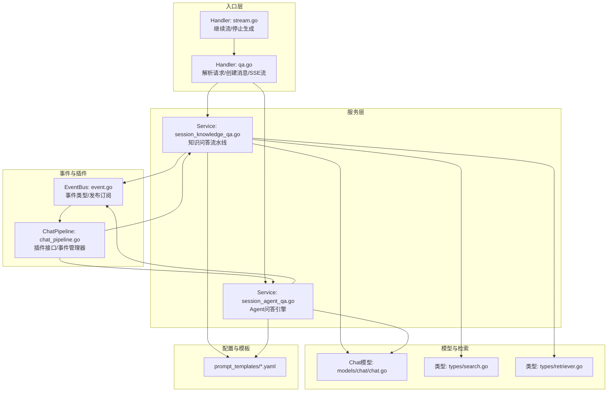
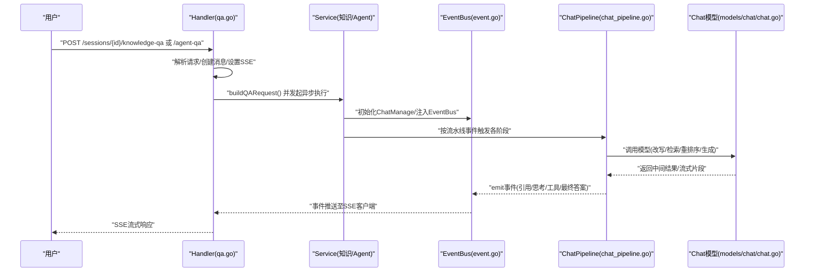
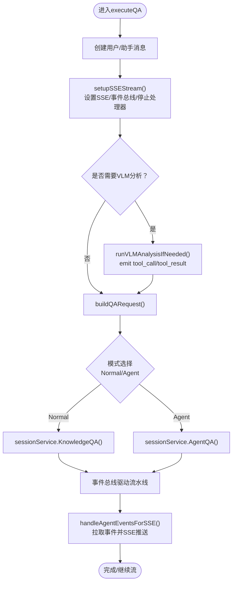
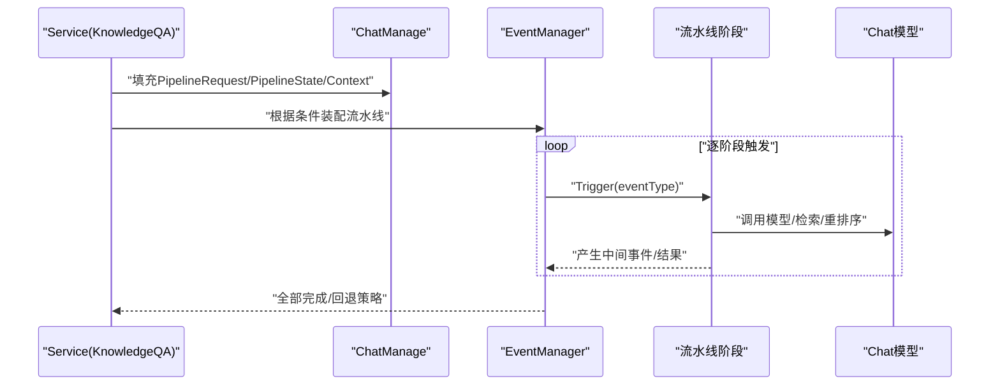
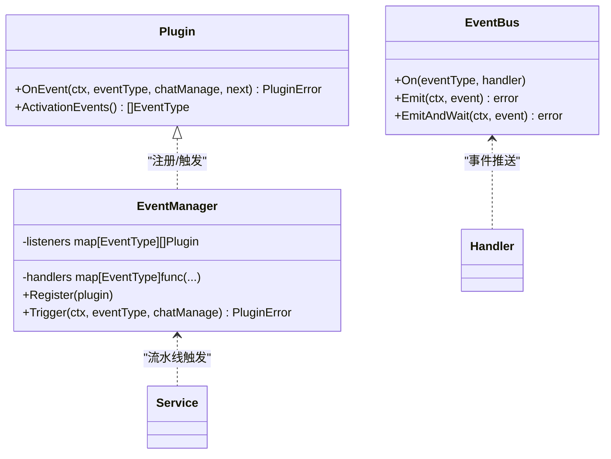
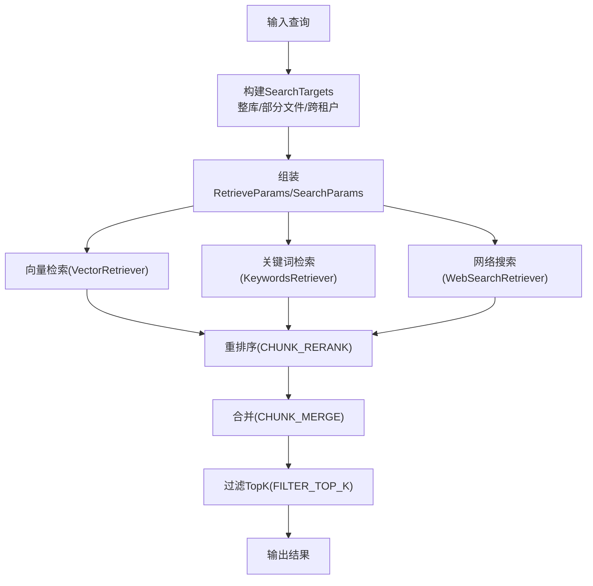
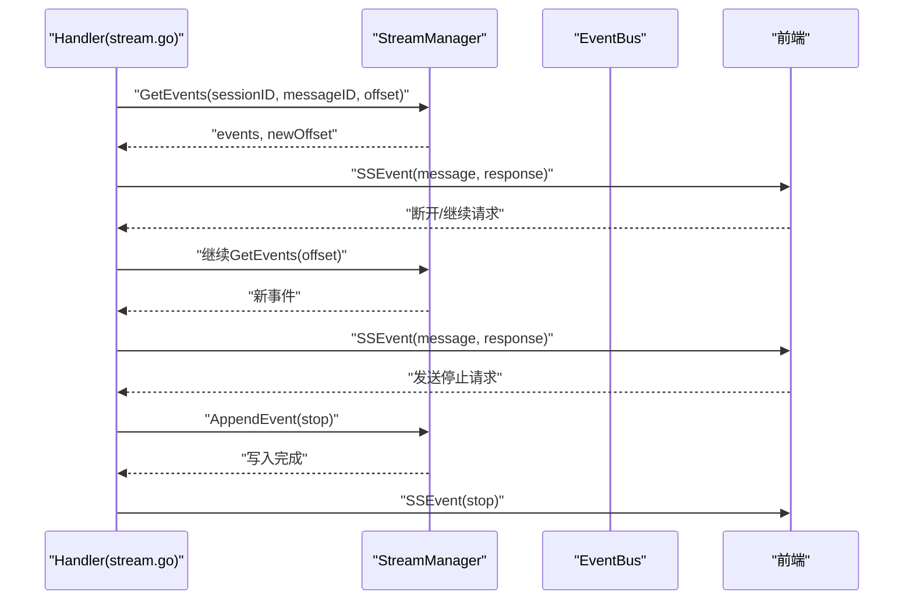
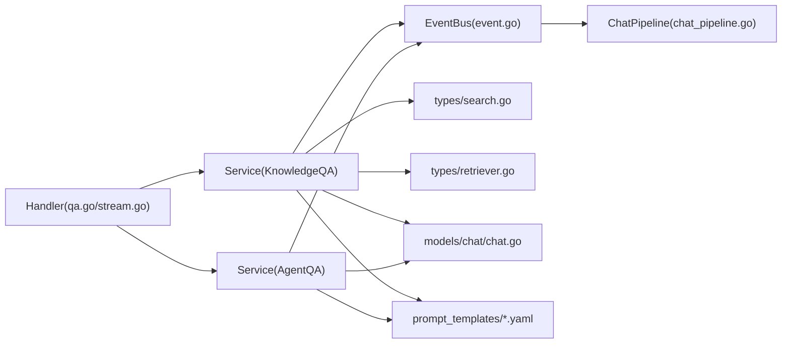

# 问答处理流程

<cite>
**本文引用的文件**
- [internal/handler/session/qa.go](file://internal/handler/session/qa.go)
- [internal/handler/session/stream.go](file://internal/handler/session/stream.go)
- [internal/application/service/session_knowledge_qa.go](file://internal/application/service/session_knowledge_qa.go)
- [internal/application/service/session_agent_qa.go](file://internal/application/service/session_agent_qa.go)
- [internal/application/service/chat_pipeline/chat_pipeline.go](file://internal/application/service/chat_pipeline/chat_pipeline.go)
- [internal/event/event.go](file://internal/event/event.go)
- [internal/models/chat/chat.go](file://internal/models/chat/chat.go)
- [internal/types/retriever.go](file://internal/types/retriever.go)
- [internal/types/search.go](file://internal/types/search.go)
- [config/prompt_templates/system_prompt.yaml](file://config/prompt_templates/system_prompt.yaml)
- [config/prompt_templates/context_template.yaml](file://config/prompt_templates/context_template.yaml)
- [config/prompt_templates/fallback.yaml](file://config/prompt_templates/fallback.yaml)
- [config/prompt_templates/generate_questions.yaml](file://config/prompt_templates/generate_questions.yaml)
- [config/prompt_templates/generate_session_title.yaml](file://config/prompt_templates/generate_session_title.yaml)
- [config/prompt_templates/generate_summary.yaml](file://config/prompt_templates/generate_summary.yaml)
- [config/prompt_templates/graph_extraction.yaml](file://config/prompt_templates/graph_extraction.yaml)
- [config/prompt_templates/intent_prompts.yaml](file://config/prompt_templates/intent_prompts.yaml)
- [config/prompt_templates/keywords_extraction.yaml](file://config/prompt_templates/keywords_extraction.yaml)
- [config/prompt_templates/rewrite.yaml](file://config/prompt_templates/rewrite.yaml)
- [config/prompt_templates/agent_system_prompt.yaml](file://config/prompt_templates/agent_system_prompt.yaml)
</cite>

## 目录
1. [引言](#引言)
2. [项目结构](#项目结构)
3. [核心组件](#核心组件)
4. [架构总览](#架构总览)
5. [详细组件分析](#详细组件分析)
6. [依赖分析](#依赖分析)
7. [性能考虑](#性能考虑)
8. [故障排查指南](#故障排查指南)
9. [结论](#结论)
10. [附录](#附录)

## 引言
本文件面向WeKnora的问答处理流程，系统化梳理从用户提问到最终回答生成的完整数据链路，覆盖查询理解、知识检索、结果重排序、上下文构建与模型生成等环节；同时深入解释聊天管道插件机制（事件驱动、插件注册与事件处理链）、多源检索策略（向量检索、关键词检索与混合检索）、结果重排序算法（交叉编码器重排序与相关性评分）、上下文窗口管理与提示词模板应用、以及流式响应生成（WebSocket风格的SSE）。

## 项目结构
WeKnora后端采用分层架构：HTTP入口层（Handler）负责请求解析与SSE流式输出；服务层（Service）封装业务逻辑，包括知识问答与Agent问答；事件总线（EventBus）驱动聊天管道（Chat Pipeline）插件链；模型层（Chat/Rerank等）抽象不同推理后端；类型与配置层（Types/Config）统一数据结构与提示词模板。

图表来源
- [internal/handler/session/qa.go:1-741](file://internal/handler/session/qa.go#L1-L741)
- [internal/handler/session/stream.go:1-441](file://internal/handler/session/stream.go#L1-L441)
- [internal/application/service/session_knowledge_qa.go:1-896](file://internal/application/service/session_knowledge_qa.go#L1-L896)
- [internal/application/service/session_agent_qa.go:1-379](file://internal/application/service/session_agent_qa.go#L1-L379)
- [internal/application/service/chat_pipeline/chat_pipeline.go:1-141](file://internal/application/service/chat_pipeline/chat_pipeline.go#L1-L141)
- [internal/event/event.go:1-231](file://internal/event/event.go#L1-L231)
- [internal/models/chat/chat.go:1-177](file://internal/models/chat/chat.go#L1-L177)
- [internal/types/search.go:1-233](file://internal/types/search.go#L1-L233)
- [internal/types/retriever.go:1-102](file://internal/types/retriever.go#L1-L102)

章节来源
- [internal/handler/session/qa.go:1-741](file://internal/handler/session/qa.go#L1-L741)
- [internal/handler/session/stream.go:1-441](file://internal/handler/session/stream.go#L1-L441)
- [internal/application/service/session_knowledge_qa.go:1-896](file://internal/application/service/session_knowledge_qa.go#L1-L896)
- [internal/application/service/session_agent_qa.go:1-379](file://internal/application/service/session_agent_qa.go#L1-L379)
- [internal/application/service/chat_pipeline/chat_pipeline.go:1-141](file://internal/application/service/chat_pipeline/chat_pipeline.go#L1-L141)
- [internal/event/event.go:1-231](file://internal/event/event.go#L1-L231)
- [internal/models/chat/chat.go:1-177](file://internal/models/chat/chat.go#L1-L177)
- [internal/types/search.go:1-233](file://internal/types/search.go#L1-L233)
- [internal/types/retriever.go:1-102](file://internal/types/retriever.go#L1-L102)

## 核心组件
- Handler层：解析请求、创建用户/助手消息、建立SSE事件总线、触发异步问答、处理继续流与停止生成。
- Service层：知识问答（RAG/纯对话）与Agent问答（工具调用/计划执行）两大路径，统一通过事件驱动流水线推进。
- 事件总线：定义丰富事件类型（查询、检索、重排序、合并、聊天、Agent步骤、错误、会话标题等），支持同步/异步处理。
- 聊天管道插件：以插件形式实现各阶段（查询理解、向量/关键词检索、重排序、合并、上下文组装、模型生成等）的可插拔扩展。
- 模型层：抽象Chat与Rerank模型，支持本地（如Ollama）与远端（OpenAI兼容）推理后端。
- 类型与检索：统一检索目标（知识库/特定知识文件）、检索参数、结果结构；支持多种检索引擎类型。
- 提示词模板：系统提示、上下文模板、回退策略、改写、摘要生成等模板集中管理。

章节来源
- [internal/handler/session/qa.go:21-62](file://internal/handler/session/qa.go#L21-L62)
- [internal/application/service/session_knowledge_qa.go:18-224](file://internal/application/service/session_knowledge_qa.go#L18-L224)
- [internal/application/service/session_agent_qa.go:20-206](file://internal/application/service/session_agent_qa.go#L20-L206)
- [internal/event/event.go:14-65](file://internal/event/event.go#L14-L65)
- [internal/application/service/chat_pipeline/chat_pipeline.go:9-78](file://internal/application/service/chat_pipeline/chat_pipeline.go#L9-L78)
- [internal/models/chat/chat.go:82-94](file://internal/models/chat/chat.go#L82-L94)
- [internal/types/retriever.go:28-102](file://internal/types/retriever.go#L28-L102)
- [internal/types/search.go:18-233](file://internal/types/search.go#L18-L233)

## 架构总览
WeKnora的问答处理采用“请求-事件-插件”的事件驱动架构。Handler负责接入与流式输出，Service负责业务编排与模型调用，EventBus承载跨阶段通信，Chat Pipeline以插件链串联各阶段。提示词模板与配置贯穿上下文构建与模型生成。

图表来源
- [internal/handler/session/qa.go:463-658](file://internal/handler/session/qa.go#L463-L658)
- [internal/application/service/session_knowledge_qa.go:18-224](file://internal/application/service/session_knowledge_qa.go#L18-L224)
- [internal/application/service/session_agent_qa.go:20-206](file://internal/application/service/session_agent_qa.go#L20-L206)
- [internal/event/event.go:103-157](file://internal/event/event.go#L103-L157)
- [internal/application/service/chat_pipeline/chat_pipeline.go:70-78](file://internal/application/service/chat_pipeline/chat_pipeline.go#L70-L78)
- [internal/models/chat/chat.go:82-94](file://internal/models/chat/chat.go#L82-L94)

## 详细组件分析

### Handler：请求解析、消息创建与SSE流
- 解析与校验：从URL与Body提取会话ID、查询、附件、图片、@提及项等，进行空值与大小限制检查。
- 代理与共享：解析自定义Agent，优先共享Agent，再回退到自有Agent；对共享Agent使用“有效租户”解析模型/知识库/MCP范围。
- 消息创建：创建用户消息与助手消息，记录请求ID、通道、提及项、附件等。
- SSE设置：设置SSE头部、初始事件、停止事件处理器、流处理器；支持会话标题异步生成。
- 流式事件处理：基于StreamManager的偏移拉取，持续推送事件，支持断连重连与停止事件。

图表来源
- [internal/handler/session/qa.go:524-658](file://internal/handler/session/qa.go#L524-L658)
- [internal/handler/session/qa.go:665-727](file://internal/handler/session/qa.go#L665-L727)
- [internal/handler/session/stream.go:296-440](file://internal/handler/session/stream.go#L296-L440)

章节来源
- [internal/handler/session/qa.go:65-231](file://internal/handler/session/qa.go#L65-L231)
- [internal/handler/session/qa.go:325-372](file://internal/handler/session/qa.go#L325-L372)
- [internal/handler/session/qa.go:524-658](file://internal/handler/session/qa.go#L524-L658)
- [internal/handler/session/qa.go:665-727](file://internal/handler/session/qa.go#L665-L727)
- [internal/handler/session/stream.go:296-440](file://internal/handler/session/stream.go#L296-L440)

### Service：知识问答（RAG/纯对话）与Agent问答
- 知识问答（Normal）：
  - 参数解析：解析知识库/知识ID、模型ID、检索阈值、重排序参数、改写/扩展开关、Web搜索配置等。
  - 构建ChatManage：统一承载查询、历史、检索目标、模型、提示词配置、上下文等。
  - 动态流水线：根据是否存在知识库或Web搜索，动态装配“加载历史/查询理解/并行检索/重排序/合并/过滤/数据分析/上下文组装/流式生成/记忆存储”等阶段。
  - 引用事件：将合并后的结果作为“引用”事件推送给前端。
- Agent问答（Agent）：
  - 自定义Agent配置：合并租户与Agent配置，解析知识库/搜索目标、工具集、Web搜索、思维链、最大迭代等。
  - 上下文管理：从LLM Context Manager加载/压缩历史，按多轮开关清空或保留。
  - 引擎执行：创建Agent引擎（含EventBus、ContextManager、Rerank模型等），异步执行并流式产出事件。

图表来源
- [internal/application/service/session_knowledge_qa.go:18-224](file://internal/application/service/session_knowledge_qa.go#L18-L224)
- [internal/application/service/session_knowledge_qa.go:522-575](file://internal/application/service/session_knowledge_qa.go#L522-L575)
- [internal/application/service/session_agent_qa.go:20-206](file://internal/application/service/session_agent_qa.go#L20-L206)

章节来源
- [internal/application/service/session_knowledge_qa.go:18-224](file://internal/application/service/session_knowledge_qa.go#L18-L224)
- [internal/application/service/session_knowledge_qa.go:522-575](file://internal/application/service/session_knowledge_qa.go#L522-L575)
- [internal/application/service/session_agent_qa.go:20-206](file://internal/application/service/session_agent_qa.go#L20-L206)

### 聊天管道插件机制：事件驱动与插件注册
- 插件接口：Plugin定义OnEvent(ctx, eventType, chatManage, next)与ActivationEvents()，支持在特定事件上挂载处理逻辑。
- 事件管理器：EventManager维护事件类型到插件列表的映射，构建处理链next，按注册顺序串行执行。
- 触发机制：Trigger(ctx, eventType, chatManage)按链式调用，支持预定义错误包装（如搜索无结果、重排序失败等）。
- 与Handler/Service协作：Handler通过EventBus向前端推送事件；Service在流水线中触发事件，插件完成具体阶段逻辑。

图表来源
- [internal/application/service/chat_pipeline/chat_pipeline.go:9-78](file://internal/application/service/chat_pipeline/chat_pipeline.go#L9-L78)
- [internal/event/event.go:103-202](file://internal/event/event.go#L103-L202)

章节来源
- [internal/application/service/chat_pipeline/chat_pipeline.go:9-78](file://internal/application/service/chat_pipeline/chat_pipeline.go#L9-L78)
- [internal/event/event.go:103-202](file://internal/event/event.go#L103-L202)

### 多源检索策略：向量、关键词与混合
- 检索目标统一：SearchTargets支持“整库检索”和“指定知识文件检索”，并记录租户ID以支持跨租户共享知识库场景。
- 检索参数：RetrieveParams包含查询文本/嵌入、知识库/知识ID、过滤标签、排除ID、TopK、阈值、知识类型、附加参数与检索器类型。
- 检索类型：RetrieverType支持关键词、向量、网络搜索；RetrieverEngineType支持多种后端（Postgres/Elasticsearch/Qdrant等）。
- 混合检索：SearchParams支持禁用关键词/向量匹配，支持多知识库聚合；实际执行由流水线阶段完成（向量检索、关键词检索、实体检索等）。

图表来源
- [internal/types/search.go:18-233](file://internal/types/search.go#L18-L233)
- [internal/types/retriever.go:28-102](file://internal/types/retriever.go#L28-L102)

章节来源
- [internal/types/search.go:18-233](file://internal/types/search.go#L18-L233)
- [internal/types/retriever.go:28-102](file://internal/types/retriever.go#L28-L102)

### 结果重排序算法：交叉编码器与相关性评分
- 重排序模型：Rerank模型抽象，支持本地与远端实现；Service层在需要时加载rerank模型（如Agent启用知识搜索工具时）。
- 重排序触发：流水线阶段（CHUNK_RERANK）对候选块进行交叉编码器打分与重排。
- 评分与阈值：结合RerankTopK与RerankThreshold控制重排规模与质量门槛。
- 回退策略：当无结果或重排序失败时，按固定或模型回退策略生成回复。

章节来源
- [internal/application/service/session_knowledge_qa.go:686-762](file://internal/application/service/session_knowledge_qa.go#L686-L762)
- [internal/application/service/session_agent_qa.go:94-118](file://internal/application/service/session_agent_qa.go#L94-L118)

### 上下文窗口管理与提示词模板
- 上下文管理：Agent模式通过LLM Context Manager加载/压缩历史，支持多轮关闭与令牌压缩策略。
- 提示词模板：系统提示、上下文模板、摘要生成、问题生成、意图识别、关键词抽取、改写、回退策略等模板集中于config/prompt_templates目录，Service在运行时渲染占位符（如query、language）。
- 会话标题：首次生成时异步触发标题生成，完成后通过事件推送。

章节来源
- [internal/application/service/session_agent_qa.go:120-150](file://internal/application/service/session_agent_qa.go#L120-L150)
- [internal/handler/session/qa.go:360-371](file://internal/handler/session/qa.go#L360-L371)
- [config/prompt_templates/system_prompt.yaml](file://config/prompt_templates/system_prompt.yaml)
- [config/prompt_templates/context_template.yaml](file://config/prompt_templates/context_template.yaml)
- [config/prompt_templates/generate_summary.yaml](file://config/prompt_templates/generate_summary.yaml)
- [config/prompt_templates/keywords_extraction.yaml](file://config/prompt_templates/keywords_extraction.yaml)
- [config/prompt_templates/rewrite.yaml](file://config/prompt_templates/rewrite.yaml)
- [config/prompt_templates/fallback.yaml](file://config/prompt_templates/fallback.yaml)

### 流式响应生成：SSE与客户端渲染
- SSE设置：Handler设置SSE头部、初始事件、停止事件监听；服务层通过EventBus推送事件。
- 事件拉取：handleAgentEventsForSSE基于StreamManager偏移拉取事件，周期性轮询，支持断连重连。
- 停止与继续：StopSession写入停止事件；ContinueStream复播历史事件并继续推送新事件。
- 客户端渲染：前端监听SSE事件，逐步渲染“思考/工具/引用/答案片段/完成”等状态。

图表来源
- [internal/handler/session/stream.go:31-176](file://internal/handler/session/stream.go#L31-L176)
- [internal/handler/session/stream.go:296-440](file://internal/handler/session/stream.go#L296-L440)

章节来源
- [internal/handler/session/stream.go:31-176](file://internal/handler/session/stream.go#L31-L176)
- [internal/handler/session/stream.go:296-440](file://internal/handler/session/stream.go#L296-L440)

## 依赖分析
- Handler依赖Service与EventBus；Service依赖模型层与类型定义；EventBus与ChatPipeline共同驱动流水线。
- 检索侧依赖SearchTargets与Retriever类型；重排序依赖Rerank模型；提示词模板由配置层提供。
- 事件类型覆盖查询、检索、重排序、合并、聊天、Agent步骤、错误与会话标题等，形成完整的问答生命周期。

图表来源
- [internal/handler/session/qa.go:1-741](file://internal/handler/session/qa.go#L1-L741)
- [internal/handler/session/stream.go:1-441](file://internal/handler/session/stream.go#L1-L441)
- [internal/application/service/session_knowledge_qa.go:1-896](file://internal/application/service/session_knowledge_qa.go#L1-L896)
- [internal/application/service/session_agent_qa.go:1-379](file://internal/application/service/session_agent_qa.go#L1-L379)
- [internal/event/event.go:1-231](file://internal/event/event.go#L1-L231)
- [internal/application/service/chat_pipeline/chat_pipeline.go:1-141](file://internal/application/service/chat_pipeline/chat_pipeline.go#L1-L141)
- [internal/models/chat/chat.go:1-177](file://internal/models/chat/chat.go#L1-L177)
- [internal/types/search.go:1-233](file://internal/types/search.go#L1-L233)
- [internal/types/retriever.go:1-102](file://internal/types/retriever.go#L1-L102)

章节来源
- [internal/handler/session/qa.go:1-741](file://internal/handler/session/qa.go#L1-L741)
- [internal/handler/session/stream.go:1-441](file://internal/handler/session/stream.go#L1-L441)
- [internal/application/service/session_knowledge_qa.go:1-896](file://internal/application/service/session_knowledge_qa.go#L1-L896)
- [internal/application/service/session_agent_qa.go:1-379](file://internal/application/service/session_agent_qa.go#L1-L379)
- [internal/event/event.go:1-231](file://internal/event/event.go#L1-L231)
- [internal/application/service/chat_pipeline/chat_pipeline.go:1-141](file://internal/application/service/chat_pipeline/chat_pipeline.go#L1-L141)
- [internal/models/chat/chat.go:1-177](file://internal/models/chat/chat.go#L1-L177)
- [internal/types/search.go:1-233](file://internal/types/search.go#L1-L233)
- [internal/types/retriever.go:1-102](file://internal/types/retriever.go#L1-L102)

## 性能考虑
- 并行检索：流水线支持并行检索（CHUNK_SEARCH_PARALLEL），提升大规模知识库下的召回效率。
- 重排序裁剪：通过RerankTopK与RerankThreshold减少下游模型负担，提高吞吐。
- 上下文压缩：Agent模式下通过ContextManager压缩历史，降低Token占用。
- 缓存与回退：未命中或重排序失败时采用固定或模型回退策略，保障可用性。
- SSE拉取节流：handleAgentEventsForSSE使用100ms定时器轮询，平衡实时性与资源消耗。

## 故障排查指南
- 事件错误：EventBus在同步模式下若任一处理器失败会返回错误；异步模式仅记录日志。
- 回退策略：当流水线阶段返回ErrSearchNothing或ErrRerank等错误时，按策略生成回退内容或模型回退。
- 停止生成：用户可通过StopSession写入停止事件，Handler检测到后向EventBus发出停止事件并推送前端。
- 断连恢复：ContinueStream支持从任意偏移继续拉取事件，确保断连后的事件完整性。

章节来源
- [internal/event/event.go:103-202](file://internal/event/event.go#L103-L202)
- [internal/application/service/session_knowledge_qa.go:542-561](file://internal/application/service/session_knowledge_qa.go#L542-L561)
- [internal/handler/session/stream.go:178-294](file://internal/handler/session/stream.go#L178-L294)

## 结论
WeKnora通过事件驱动的聊天管道插件机制，将查询理解、多源检索、重排序、上下文构建与模型生成解耦为可插拔阶段，既支持灵活的RAG问答，也支持强大的Agent工具调用。配合SSE流式输出、上下文压缩与回退策略，系统在准确性、可扩展性与用户体验之间取得良好平衡。

## 附录
- 提示词模板清单（节选）
  - 系统提示：system_prompt.yaml
  - 上下文模板：context_template.yaml
  - 回退策略：fallback.yaml
  - 问题生成：generate_questions.yaml
  - 会话标题：generate_session_title.yaml
  - 摘要生成：generate_summary.yaml
  - 图谱抽取：graph_extraction.yaml
  - 意图识别：intent_prompts.yaml
  - 关键词抽取：keywords_extraction.yaml
  - 查询改写：rewrite.yaml
  - Agent系统提示：agent_system_prompt.yaml

章节来源
- [config/prompt_templates/system_prompt.yaml](file://config/prompt_templates/system_prompt.yaml)
- [config/prompt_templates/context_template.yaml](file://config/prompt_templates/context_template.yaml)
- [config/prompt_templates/fallback.yaml](file://config/prompt_templates/fallback.yaml)
- [config/prompt_templates/generate_questions.yaml](file://config/prompt_templates/generate_questions.yaml)
- [config/prompt_templates/generate_session_title.yaml](file://config/prompt_templates/generate_session_title.yaml)
- [config/prompt_templates/generate_summary.yaml](file://config/prompt_templates/generate_summary.yaml)
- [config/prompt_templates/graph_extraction.yaml](file://config/prompt_templates/graph_extraction.yaml)
- [config/prompt_templates/intent_prompts.yaml](file://config/prompt_templates/intent_prompts.yaml)
- [config/prompt_templates/keywords_extraction.yaml](file://config/prompt_templates/keywords_extraction.yaml)
- [config/prompt_templates/rewrite.yaml](file://config/prompt_templates/rewrite.yaml)
- [config/prompt_templates/agent_system_prompt.yaml](file://config/prompt_templates/agent_system_prompt.yaml)