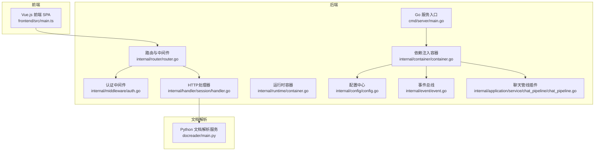
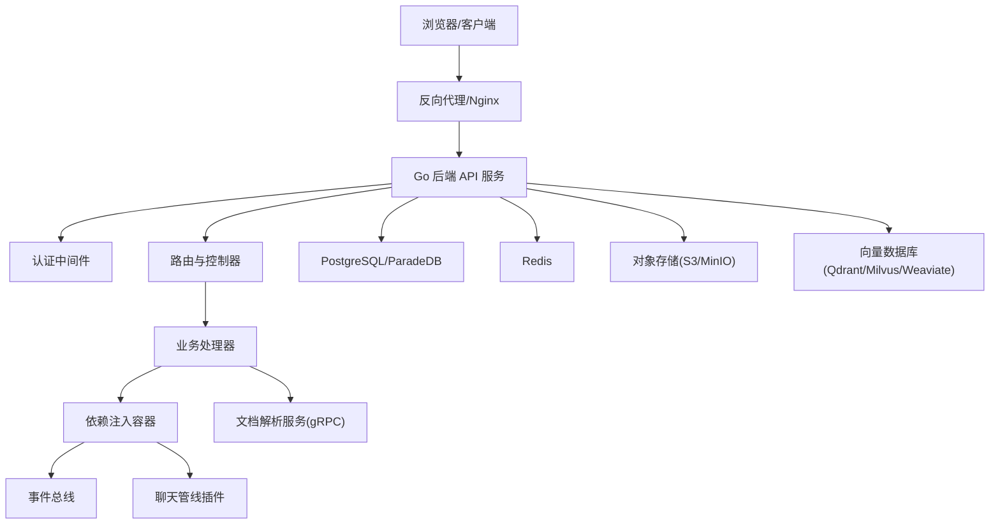
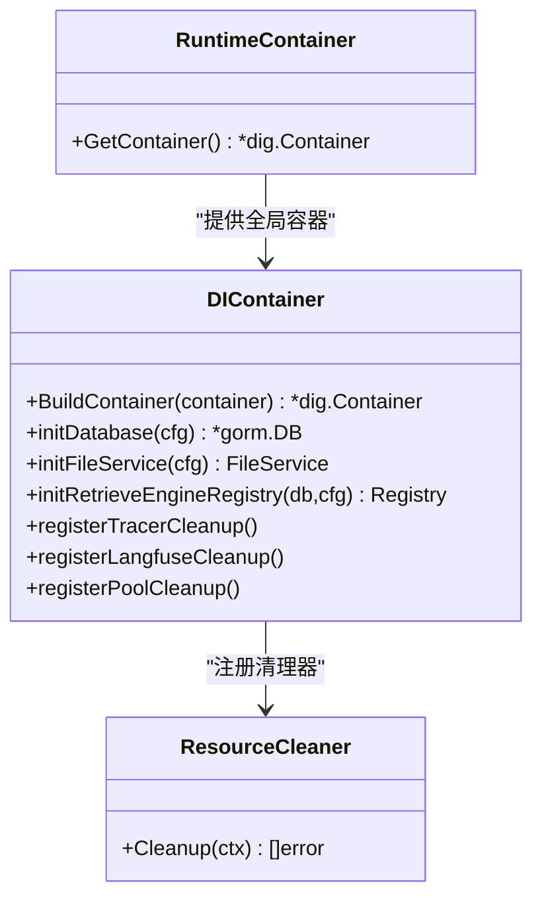
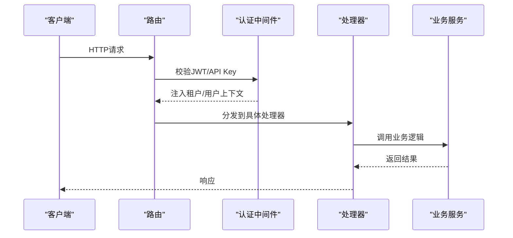
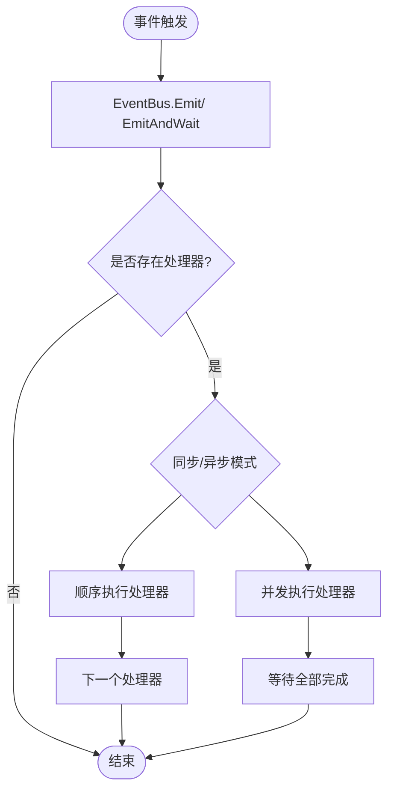
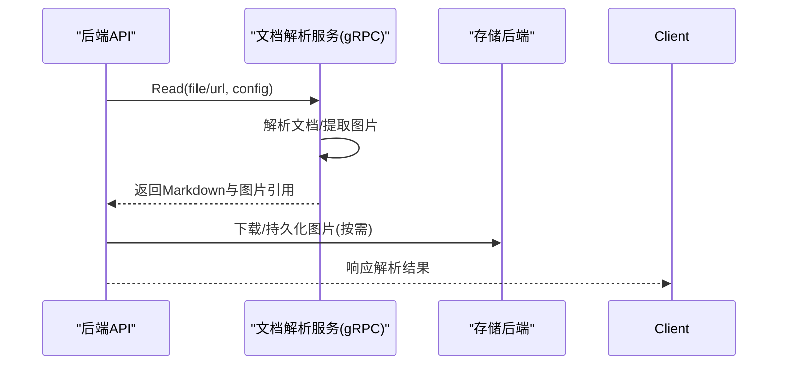
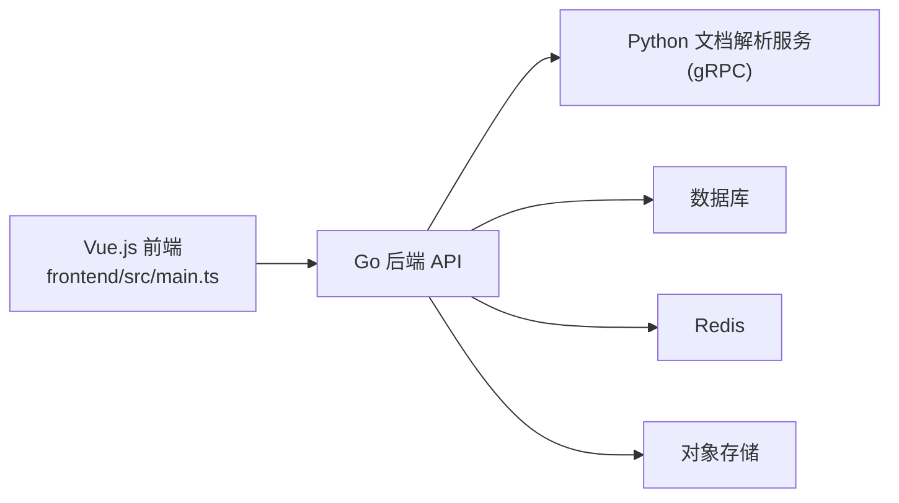
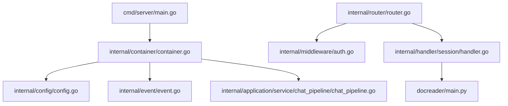

# 整体架构设计

<cite>
**本文引用的文件**
- [cmd/server/main.go](file://cmd/server/main.go)
- [internal/container/container.go](file://internal/container/container.go)
- [internal/runtime/container.go](file://internal/runtime/container.go)
- [internal/config/config.go](file://internal/config/config.go)
- [internal/router/router.go](file://internal/router/router.go)
- [internal/middleware/auth.go](file://internal/middleware/auth.go)
- [internal/handler/session/handler.go](file://internal/handler/session/handler.go)
- [internal/event/event.go](file://internal/event/event.go)
- [internal/application/service/chat_pipeline/chat_pipeline.go](file://internal/application/service/chat_pipeline/chat_pipeline.go)
- [frontend/src/main.ts](file://frontend/src/main.ts)
- [docreader/main.py](file://docreader/main.py)
- [docker-compose.yml](file://docker-compose.yml)
- [helm/values.yaml](file://helm/values.yaml)
- [README.md](file://README.md)
</cite>

## 目录
1. [简介](#简介)
2. [项目结构](#项目结构)
3. [核心组件](#核心组件)
4. [架构总览](#架构总览)
5. [详细组件分析](#详细组件分析)
6. [依赖关系分析](#依赖关系分析)
7. [性能考虑](#性能考虑)
8. [故障排查指南](#故障排查指南)
9. [结论](#结论)
10. [附录](#附录)

## 简介
本文件面向WeKnora的整体架构设计，系统采用微服务化、分层架构与事件驱动相结合的模式，围绕“Go后端服务 + Vue.js前端应用 + Python文档解析服务”的协作体系构建。通过依赖注入容器集中管理服务生命周期，结合事件总线实现模块间松耦合的异步协作；路由层统一接入认证与中间件，业务层以插件化聊天管线承载RAG与智能体推理流程；基础设施层提供数据库、缓存、对象存储与向量数据库等可插拔能力。

## 项目结构
WeKnora采用模块化分层组织代码：
- cmd/server：后端服务入口，负责容器构建、HTTP服务启动与优雅关停
- internal：核心业务逻辑，按领域拆分为application、handler、types、event、router、middleware等层次
- frontend：Vue.js前端应用，SPA入口与状态管理
- docreader：Python文档解析服务，提供gRPC接口供后端调用
- docker-compose与helm：容器化与Kubernetes部署编排

**图表来源**
- [cmd/server/main.go:43-123](file://cmd/server/main.go#L43-L123)
- [internal/router/router.go:71-161](file://internal/router/router.go#L71-L161)
- [internal/middleware/auth.go:65-228](file://internal/middleware/auth.go#L65-L228)
- [internal/handler/session/handler.go:16-64](file://internal/handler/session/handler.go#L16-L64)
- [internal/container/container.go:93-311](file://internal/container/container.go#L93-L311)
- [internal/runtime/container.go:9-24](file://internal/runtime/container.go#L9-L24)
- [internal/config/config.go:17-438](file://internal/config/config.go#L17-L438)
- [internal/event/event.go:80-231](file://internal/event/event.go#L80-L231)
- [internal/application/service/chat_pipeline/chat_pipeline.go:23-141](file://internal/application/service/chat_pipeline/chat_pipeline.go#L23-L141)
- [docreader/main.py:184-215](file://docreader/main.py#L184-L215)

**章节来源**
- [README.md:164-168](file://README.md#L164-L168)
- [docker-compose.yml:1-613](file://docker-compose.yml#L1-L613)
- [helm/values.yaml:1-493](file://helm/values.yaml#L1-L493)

## 核心组件
- 依赖注入容器：集中注册配置、服务、仓库、处理器与任务队列，支持资源清理与生命周期管理
- 路由与中间件：统一CORS、日志、错误处理、认证与可观测性中间件，按租户隔离与API Key兼容
- 事件总线：定义事件类型与发布订阅模型，支持同步/异步处理
- 聊天管线插件：以插件链形式串联检索、重排序、合并、对话生成等阶段
- 文档解析服务：Python gRPC服务，统一处理多种文档格式解析与图片内嵌
- 前端应用：Vue.js SPA，Pinia状态管理与路由系统

**章节来源**
- [internal/container/container.go:93-311](file://internal/container/container.go#L93-L311)
- [internal/router/router.go:71-161](file://internal/router/router.go#L71-L161)
- [internal/middleware/auth.go:65-228](file://internal/middleware/auth.go#L65-L228)
- [internal/event/event.go:80-231](file://internal/event/event.go#L80-L231)
- [internal/application/service/chat_pipeline/chat_pipeline.go:23-141](file://internal/application/service/chat_pipeline/chat_pipeline.go#L23-L141)
- [docreader/main.py:184-215](file://docreader/main.py#L184-L215)
- [frontend/src/main.ts:1-31](file://frontend/src/main.ts#L1-L31)

## 架构总览
WeKnora采用“三层+多层”架构：
- 表现层：Vue.js前端SPA，静态资源托管于后端路由或独立Nginx
- 协议层：HTTP REST API，Swagger文档，CORS跨域，认证支持JWT与API Key
- 业务层：聊天管线插件化，事件驱动，支持RAG与智能体推理
- 基础设施层：PostgreSQL/ParadeDB、Redis、MinIO/S3、Qdrant/Milvus/Weaviate等可插拔组件

**图表来源**
- [internal/router/router.go:71-161](file://internal/router/router.go#L71-L161)
- [internal/middleware/auth.go:65-228](file://internal/middleware/auth.go#L65-L228)
- [internal/handler/session/handler.go:16-64](file://internal/handler/session/handler.go#L16-L64)
- [internal/container/container.go:93-311](file://internal/container/container.go#L93-L311)
- [docker-compose.yml:1-613](file://docker-compose.yml#L1-L613)

## 详细组件分析

### 依赖注入容器与生命周期管理
- 容器初始化：全局运行时容器在runtime包中创建，后端入口通过BuildContainer集中注册配置、数据库、存储、检索引擎、服务、仓库、处理器与任务队列
- 资源清理：容器提供ResourceCleaner，服务关闭时统一执行清理
- 条件装配：根据环境变量动态启用/禁用Redis、MinIO、COS等组件
- 生命周期：数据库迁移、序列同步、任务重置等在启动阶段完成，确保状态一致性

**图表来源**
- [internal/runtime/container.go:9-24](file://internal/runtime/container.go#L9-L24)
- [internal/container/container.go:93-311](file://internal/container/container.go#L93-L311)

**章节来源**
- [internal/runtime/container.go:9-24](file://internal/runtime/container.go#L9-L24)
- [internal/container/container.go:93-311](file://internal/container/container.go#L93-L311)

### 路由与中间件体系
- 路由：统一注册认证前/后路由，健康检查、Swagger文档、前端静态资源托管
- 中间件：CORS、请求ID、语言、日志、恢复、错误处理、认证、Langfuse可观测性
- 认证：支持JWT与API Key两种模式，跨租户访问控制，租户上下文注入

**图表来源**
- [internal/router/router.go:71-161](file://internal/router/router.go#L71-L161)
- [internal/middleware/auth.go:65-228](file://internal/middleware/auth.go#L65-L228)
- [internal/handler/session/handler.go:76-127](file://internal/handler/session/handler.go#L76-L127)

**章节来源**
- [internal/router/router.go:71-161](file://internal/router/router.go#L71-L161)
- [internal/middleware/auth.go:65-228](file://internal/middleware/auth.go#L65-L228)
- [internal/handler/session/handler.go:76-127](file://internal/handler/session/handler.go#L76-L127)

### 事件驱动与聊天管线
- 事件总线：定义丰富事件类型（检索、重排序、合并、对话生成、工具调用、错误等），支持同步/异步发布
- 插件化管线：以插件链串联各阶段处理，按事件类型激活对应插件，支持错误包装与传播
- 会话处理器：封装消息与会话管理，对接附件处理、文档解析与模型服务

**图表来源**
- [internal/event/event.go:120-202](file://internal/event/event.go#L120-L202)
- [internal/application/service/chat_pipeline/chat_pipeline.go:39-78](file://internal/application/service/chat_pipeline/chat_pipeline.go#L39-L78)

**章节来源**
- [internal/event/event.go:120-202](file://internal/event/event.go#L120-L202)
- [internal/application/service/chat_pipeline/chat_pipeline.go:39-78](file://internal/application/service/chat_pipeline/chat_pipeline.go#L39-L78)
- [internal/handler/session/handler.go:16-64](file://internal/handler/session/handler.go#L16-L64)

### 文档解析服务（Python gRPC）
- 服务职责：统一解析文件/URL，输出Markdown与内嵌图片引用，支持引擎列表查询
- 协议：gRPC健康检查、线程池并发、消息大小限制
- 集成：后端通过配置选择gRPC或HTTP模式，统一抽象为DocumentReader接口

**图表来源**
- [docreader/main.py:184-215](file://docreader/main.py#L184-L215)
- [internal/handler/session/handler.go:57-62](file://internal/handler/session/handler.go#L57-L62)

**章节来源**
- [docreader/main.py:184-215](file://docreader/main.py#L184-L215)
- [internal/handler/session/handler.go:57-62](file://internal/handler/session/handler.go#L57-L62)

### 前后端分离与协作
- 前端：Vue.js + Pinia + 路由，应用初始化时挂载，避免闪烁
- 静态托管：后端路由在Lite模式下提供前端静态资源
- API交互：前端通过HTTP与后端交互，后端通过gRPC调用文档解析服务

**图表来源**
- [frontend/src/main.ts:1-31](file://frontend/src/main.ts#L1-L31)
- [internal/router/router.go:109-112](file://internal/router/router.go#L109-L112)
- [docker-compose.yml:1-613](file://docker-compose.yml#L1-L613)

**章节来源**
- [frontend/src/main.ts:1-31](file://frontend/src/main.ts#L1-L31)
- [internal/router/router.go:109-112](file://internal/router/router.go#L109-L112)

## 依赖关系分析
- 容器装配：后端入口通过BuildContainer集中注册配置、数据库、存储、检索引擎、服务、仓库、处理器与任务队列
- 路由依赖：路由依赖认证中间件与各类处理器，处理器依赖服务层与文档解析客户端
- 事件依赖：事件总线被服务层与聊天管线共享，插件按事件类型注册
- 基础设施：数据库、缓存、对象存储与向量数据库通过环境变量与配置文件驱动

**图表来源**
- [cmd/server/main.go:51-60](file://cmd/server/main.go#L51-L60)
- [internal/container/container.go:93-311](file://internal/container/container.go#L93-L311)
- [internal/router/router.go:71-161](file://internal/router/router.go#L71-L161)
- [internal/middleware/auth.go:65-228](file://internal/middleware/auth.go#L65-L228)
- [internal/handler/session/handler.go:16-64](file://internal/handler/session/handler.go#L16-L64)
- [docreader/main.py:184-215](file://docreader/main.py#L184-L215)

**章节来源**
- [cmd/server/main.go:51-60](file://cmd/server/main.go#L51-L60)
- [internal/container/container.go:93-311](file://internal/container/container.go#L93-L311)

## 性能考虑
- 并发与限流：Redis作为分布式队列与限流基础，IM模块支持全局最大并发与用户级队列上限
- 连接池：数据库连接池按驱动类型配置，SQLite限制并发写入避免锁冲突
- 缓存：Redis用于LLM上下文存储、流管理与任务队列，支持TTL与前缀隔离
- 搜索：检索引擎可多驱动组合（PostgreSQL、Elasticsearch、Qdrant、Milvus、Weaviate），按需启用
- 解析：文档解析服务线程池并发处理，消息大小限制防止内存溢出

**章节来源**
- [internal/config/config.go:42-67](file://internal/config/config.go#L42-L67)
- [internal/container/container.go:391-526](file://internal/container/container.go#L391-L526)
- [docker-compose.yml:173-199](file://docker-compose.yml#L173-L199)

## 故障排查指南
- 启动与关停：后端监听端口绑定失败时自动重试；收到信号后先关闭监听，再优雅关闭HTTP服务，最后执行资源清理
- 认证失败：检查Authorization头或X-API-Key格式与有效性；确认租户上下文与跨租户权限
- 文档解析：确认文档解析服务健康检查与gRPC端口可达；检查解析引擎可用性与文件大小限制
- 数据库迁移：若迁移失败，查看日志并确认外部迁移脚本执行情况；SQLite场景注意并发写入限制
- 观测性：Jaeger与Langfuse按需启用，检查环境变量与服务连通性

**章节来源**
- [cmd/server/main.go:66-119](file://cmd/server/main.go#L66-L119)
- [internal/middleware/auth.go:84-228](file://internal/middleware/auth.go#L84-L228)
- [docreader/main.py:184-215](file://docreader/main.py#L184-L215)
- [internal/container/container.go:477-507](file://internal/container/container.go#L477-L507)

## 结论
WeKnora通过依赖注入容器实现模块化装配与生命周期管理，借助事件总线与插件化聊天管线达成高内聚低耦合的业务扩展能力；前后端分离与gRPC文档解析服务形成清晰边界，配合多驱动基础设施满足企业级部署与私有化需求。整体架构在可扩展性、可观测性与可维护性方面具备良好平衡。

## 附录
- 部署方式：Docker Compose与Helm Chart提供一键部署，支持Profile扩展组件
- 开发模式：Fast Dev模式支持前后端热更新与断点调试
- 配置中心：YAML配置与环境变量覆盖，支持提示词模板与多语言

**章节来源**
- [docker-compose.yml:1-613](file://docker-compose.yml#L1-L613)
- [helm/values.yaml:1-493](file://helm/values.yaml#L1-L493)
- [README.md:308-348](file://README.md#L308-L348)