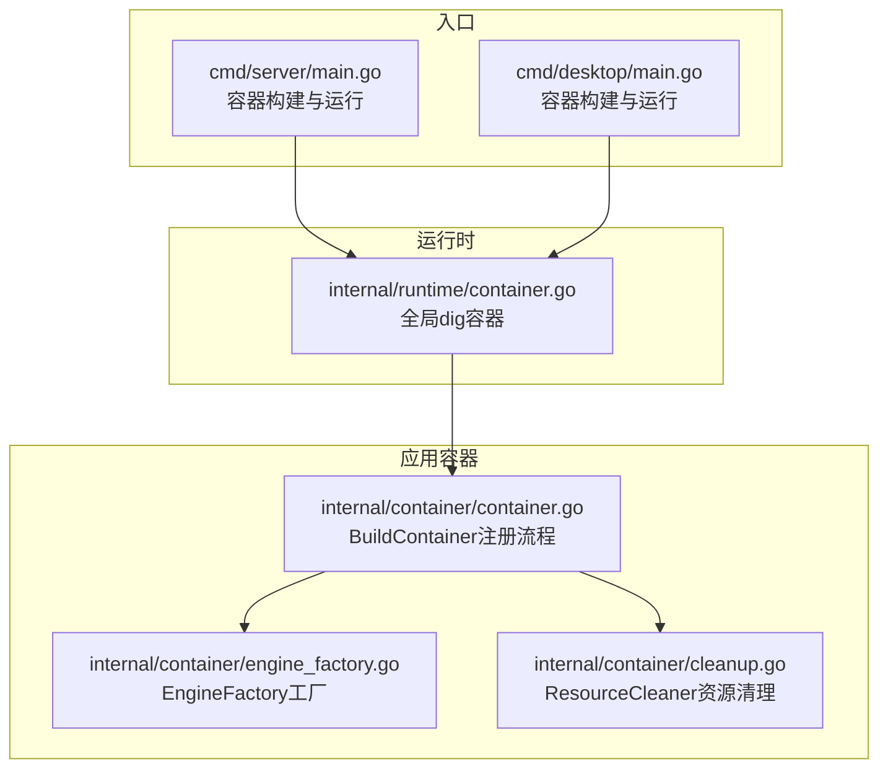
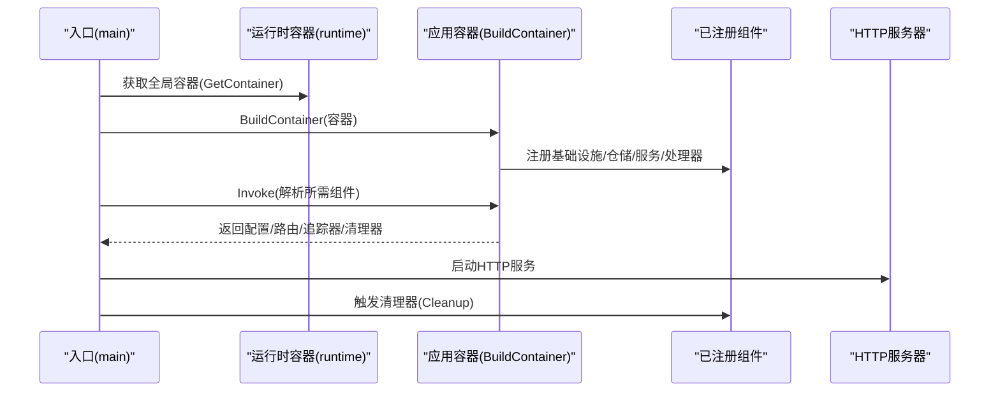
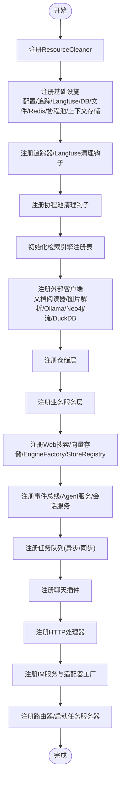
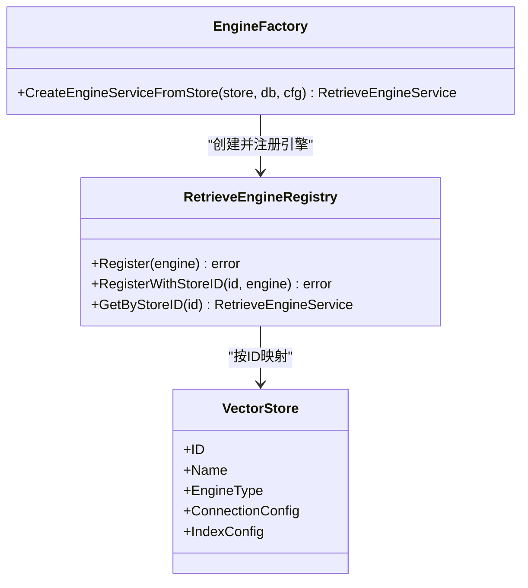
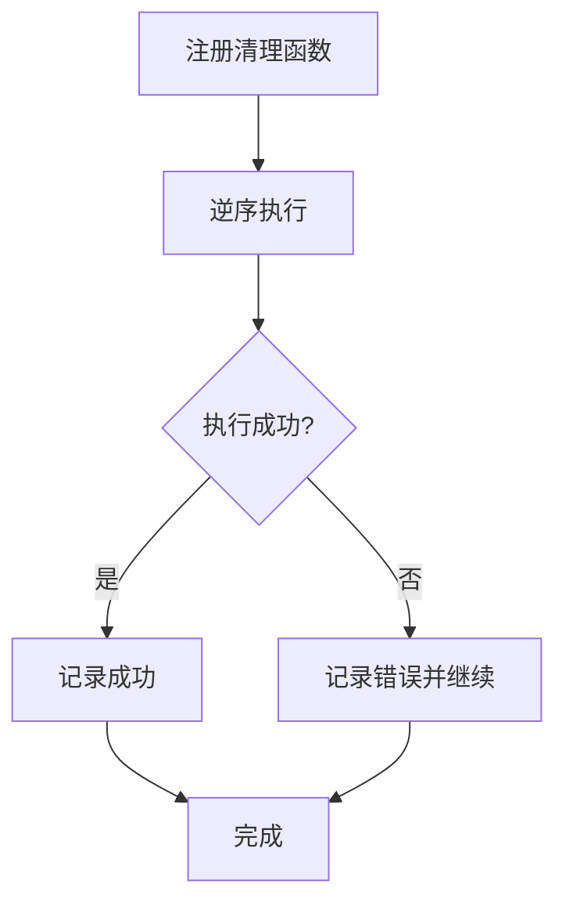
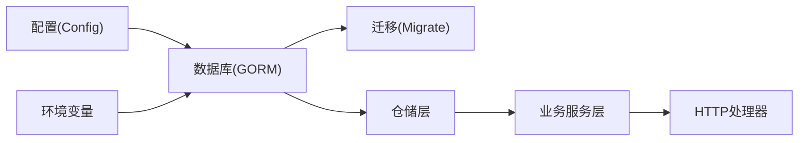
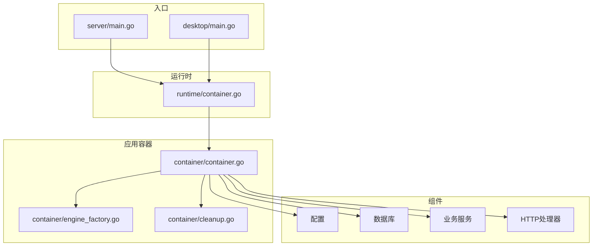

# 依赖注入容器

<cite>
**本文引用的文件**
- [internal/container/container.go](file://internal/container/container.go)
- [internal/container/engine_factory.go](file://internal/container/engine_factory.go)
- [internal/container/cleanup.go](file://internal/container/cleanup.go)
- [internal/runtime/container.go](file://internal/runtime/container.go)
- [cmd/server/main.go](file://cmd/server/main.go)
- [cmd/desktop/main.go](file://cmd/desktop/main.go)
</cite>

## 目录
1. [简介](#简介)
2. [项目结构](#项目结构)
3. [核心组件](#核心组件)
4. [架构总览](#架构总览)
5. [详细组件分析](#详细组件分析)
6. [依赖关系分析](#依赖关系分析)
7. [性能考量](#性能考量)
8. [故障排查指南](#故障排查指南)
9. [结论](#结论)
10. [附录](#附录)

## 简介
本文聚焦WeKnora的依赖注入容器，系统性阐述基于uber/dig的容器初始化与组件注册机制，重点覆盖以下内容：
- BuildContainer函数的初始化流程与组件注册顺序
- 基础设施组件、仓储层、业务服务层、HTTP处理器的分层注册策略
- EngineFactory的设计与作用，如何通过工厂模式按需创建检索引擎实例
- 容器配置最佳实践：组件生命周期管理、错误处理与资源清理
- 依赖关系图与模块间依赖注入实现示例

## 项目结构
WeKnora的依赖注入容器由两部分组成：
- 运行时容器：提供全局dig容器实例，供各模块注册与解析
- 应用容器：集中完成所有组件的注册与装配，形成可运行的应用上下文

**图表来源**
- [internal/runtime/container.go:1-24](file://internal/runtime/container.go#L1-L24)
- [internal/container/container.go:85-311](file://internal/container/container.go#L85-L311)
- [internal/container/engine_factory.go:32-38](file://internal/container/engine_factory.go#L32-L38)
- [internal/container/cleanup.go:12-87](file://internal/container/cleanup.go#L12-L87)
- [cmd/server/main.go:51-124](file://cmd/server/main.go#L51-L124)
- [cmd/desktop/main.go:176-253](file://cmd/desktop/main.go#L176-L253)

**章节来源**
- [internal/runtime/container.go:1-24](file://internal/runtime/container.go#L1-L24)
- [internal/container/container.go:85-311](file://internal/container/container.go#L85-L311)
- [cmd/server/main.go:51-124](file://cmd/server/main.go#L51-L124)
- [cmd/desktop/main.go:176-253](file://cmd/desktop/main.go#L176-L253)

## 核心组件
- 运行时容器
  - 提供全局dig容器实例，并在init中完成初始化
  - 通过GetContainer暴露给其他模块使用
- 应用容器
  - BuildContainer集中注册基础设施、外部客户端、仓储、服务、聊天插件、HTTP处理器等
  - 通过must封装错误处理，确保注册阶段失败即panic
- 资源清理器
  - ResourceCleaner统一注册清理函数，支持带名称的日志化清理与逆序执行
- EngineFactory
  - 基于向量存储配置动态创建检索引擎服务实例，支持多种后端

**章节来源**
- [internal/runtime/container.go:9-23](file://internal/runtime/container.go#L9-L23)
- [internal/container/container.go:313-321](file://internal/container/container.go#L313-L321)
- [internal/container/cleanup.go:12-87](file://internal/container/cleanup.go#L12-L87)
- [internal/container/engine_factory.go:32-38](file://internal/container/engine_factory.go#L32-L38)

## 架构总览
下图展示了从入口到容器构建、组件注册与运行时解析的关键交互。

**图表来源**
- [cmd/server/main.go:51-124](file://cmd/server/main.go#L51-L124)
- [cmd/desktop/main.go:176-253](file://cmd/desktop/main.go#L176-L253)
- [internal/runtime/container.go:19-23](file://internal/runtime/container.go#L19-L23)
- [internal/container/container.go:85-311](file://internal/container/container.go#L85-L311)

## 详细组件分析

### BuildContainer初始化与注册流程
- 初始化阶段
  - 注册ResourceCleaner用于统一资源清理
  - 注册核心基础设施：配置、追踪器、Langfuse、数据库、文件服务、Redis、协程池、上下文存储
  - 注册清理钩子：追踪器、Langfuse、协程池
  - 初始化检索引擎注册表
  - 注册外部客户端：文档阅读器、图片解析器、Ollama、Neo4j、流管理、DuckDB
- 仓储层注册
  - 租户、知识库、知识、块、标签、会话、消息、模型、用户、令牌、MCP服务、自定义Agent、组织、分享、数据源、同步日志、Wiki页面等仓储
- 业务服务层注册
  - 租户、知识库、组织、分享、知识、块、标签、嵌入批处理、模型、数据集、评估、用户、WeKnora Cloud、消息、MCP服务、自定义Agent、内存、Wiki页面、数据源调度等
  - 注册提取服务与命名实例
- 检索与向量存储
  - 注册Web搜索注册表与提供者、向量存储仓库与服务
  - 注册EngineFactory与StoreRegistry接口
- Agent与会话
  - 注册事件总线与Agent服务，随后注册会话服务
- 任务队列
  - 根据Redis可用性选择异步队列或同步执行器
- 聊天插件
  - 注册数据源同步框架、事件管理器与一系列聊天插件（搜索、重排序、网页抓取、合并、数据分析、消息转换、补全、流式补全、TopK过滤、查询理解、历史加载、实体抽取、实体搜索、并行搜索、Wiki增强、记忆）
- HTTP处理器
  - 注册租户、知识库、知识、块、FAQ、标签、会话、消息、模型、评估、初始化、认证、系统、MCP服务、Web搜索、Web搜索提供者、向量存储、自定义Agent、技能、组织等处理器
- IM集成
  - 注册IM服务与适配器工厂，加载启用的通道
- 路由与任务服务器
  - 注册路由器；根据队列类型启动Asynq或注册同步处理器

**图表来源**
- [internal/container/container.go:93-311](file://internal/container/container.go#L93-L311)

**章节来源**
- [internal/container/container.go:93-311](file://internal/container/container.go#L93-L311)

### EngineFactory设计与作用
- 设计要点
  - NewEngineFactory返回一个闭包，接收数据库与配置，用于动态创建检索引擎服务
  - createEngineServiceFromStore根据向量存储配置选择具体引擎类型（Postgres、Elasticsearch、Qdrant、Milvus、Weaviate、SQLite）
  - 支持按存储ID动态注册到StoreRegistry，实现“按需创建、按需注册”
- 适用场景
  - 动态配置的向量存储（如多租户不同引擎）
  - 运行时新增存储时无需重启即可注册新引擎

**图表来源**
- [internal/container/engine_factory.go:32-64](file://internal/container/engine_factory.go#L32-L64)
- [internal/container/container.go:963-990](file://internal/container/container.go#L963-L990)

**章节来源**
- [internal/container/engine_factory.go:32-64](file://internal/container/engine_factory.go#L32-L64)
- [internal/container/container.go:963-990](file://internal/container/container.go#L963-L990)

### 生命周期管理与资源清理
- ResourceCleaner
  - 采用逆序执行策略，确保后注册的先清理
  - 支持带名称的清理函数，便于日志追踪
  - 清理过程中遇到错误会记录但不中断后续清理
- 注册清理钩子
  - 追踪器、Langfuse、协程池均通过Invoke注册清理函数
  - 数据源调度器在启动时注册停止逻辑

**图表来源**
- [internal/container/cleanup.go:58-78](file://internal/container/cleanup.go#L58-L78)

**章节来源**
- [internal/container/cleanup.go:12-87](file://internal/container/cleanup.go#L12-L87)
- [internal/container/container.go:111-117](file://internal/container/container.go#L111-L117)
- [internal/container/container.go:1519-1529](file://internal/container/container.go#L1519-L1529)

### 组件注册示例与依赖关系
- 示例一：数据库与迁移
  - 注册GORM连接与迁移，按驱动类型配置DSN与跳过嵌入迁移参数
  - SQLite限制最大连接数，PostgreSQL设置空闲连接数
- 示例二：文件存储
  - 根据STORAGE_TYPE选择本地/MinIO/COS/S3/OSS/TOS或Dummy实现
- 示例三：检索引擎
  - 通过RETRIEVE_DRIVER选择PostgreSQL、Elasticsearch V7/V8、Qdrant、Weaviate、Milvus、SQLite
  - 支持从数据库加载向量存储并按ID注册

**图表来源**
- [internal/container/container.go:382-526](file://internal/container/container.go#L382-L526)
- [internal/container/container.go:630-747](file://internal/container/container.go#L630-L747)
- [internal/container/container.go:749-961](file://internal/container/container.go#L749-L961)

**章节来源**
- [internal/container/container.go:382-526](file://internal/container/container.go#L382-L526)
- [internal/container/container.go:630-747](file://internal/container/container.go#L630-L747)
- [internal/container/container.go:749-961](file://internal/container/container.go#L749-L961)

## 依赖关系分析
- 入口与容器
  - server与desktop入口均通过runtime.GetContainer获取全局容器，再调用BuildContainer完成注册
  - 通过c.Invoke解析配置、路由、追踪器与清理器，启动HTTP服务并在关闭信号时触发清理
- 组件耦合
  - 仓储层对数据库与配置强依赖
  - 业务服务层依赖仓储与外部客户端（如Ollama、Neo4j、DuckDB）
  - HTTP处理器依赖业务服务层
  - EngineFactory依赖配置与数据库，向检索引擎注册表提供动态创建能力
- 循环依赖规避
  - 通过分层注册与接口抽象（如StoreRegistry、ResourceCleaner）避免循环引用
  - 会话服务在Agent服务之后注册，Agent服务在会话服务需要时才注入

**图表来源**
- [cmd/server/main.go:51-124](file://cmd/server/main.go#L51-L124)
- [cmd/desktop/main.go:176-253](file://cmd/desktop/main.go#L176-L253)
- [internal/runtime/container.go:19-23](file://internal/runtime/container.go#L19-L23)
- [internal/container/container.go:85-311](file://internal/container/container.go#L85-L311)
- [internal/container/engine_factory.go:32-38](file://internal/container/engine_factory.go#L32-L38)
- [internal/container/cleanup.go:12-87](file://internal/container/cleanup.go#L12-L87)

**章节来源**
- [cmd/server/main.go:51-124](file://cmd/server/main.go#L51-L124)
- [cmd/desktop/main.go:176-253](file://cmd/desktop/main.go#L176-L253)
- [internal/runtime/container.go:19-23](file://internal/runtime/container.go#L19-L23)
- [internal/container/container.go:85-311](file://internal/container/container.go#L85-L311)

## 性能考量
- 连接池与并发
  - SQLite限制最大连接数以避免“数据库被锁定”，PostgreSQL设置空闲连接数
  - 协程池大小可通过环境变量配置，预分配提升性能
- 清理与优雅停机
  - 通过ResourceCleaner逆序清理，确保外部依赖有序释放
  - HTTP服务支持信号监听与超时控制，避免资源泄漏
- 检索引擎
  - 按RETRIEVE_DRIVER动态启用后端，减少不必要的连接与初始化开销
  - 引擎工厂按存储配置创建，避免全局常驻多个引擎实例

[本节为通用指导，无需特定文件引用]

## 故障排查指南
- 注册失败
  - must封装导致任何注册错误都会panic，检查对应初始化函数的返回值与环境变量
- 数据库连接
  - 检查DB_DRIVER、DB_HOST、DB_PORT、DB_NAME、DB_USER、DB_PASSWORD等是否正确
  - SQLite路径与权限、PostgreSQL SSL与序列同步问题
- 文件存储
  - STORAGE_TYPE与对应密钥/端点/桶名是否齐全
- 检索引擎
  - RETRIEVE_DRIVER与后端地址、认证信息是否正确
  - Weaviate/Milvus/Qdrant等外部服务可达性
- 清理异常
  - ResourceCleaner会记录错误但不停止后续清理，关注日志中的清理失败条目

**章节来源**
- [internal/container/container.go:313-321](file://internal/container/container.go#L313-L321)
- [internal/container/container.go:382-526](file://internal/container/container.go#L382-L526)
- [internal/container/container.go:630-747](file://internal/container/container.go#L630-L747)
- [internal/container/container.go:749-961](file://internal/container/container.go#L749-L961)
- [internal/container/cleanup.go:58-78](file://internal/container/cleanup.go#L58-L78)

## 结论
WeKnora的依赖注入容器以uber/dig为核心，采用分层注册与工厂模式实现高内聚、低耦合的组件体系。BuildContainer统一负责基础设施、仓储、服务、处理器与清理钩子的装配，EngineFactory则提供按需创建检索引擎的能力。配合ResourceCleaner与优雅停机机制，系统在复杂场景下仍能保持稳定与可维护性。

[本节为总结，无需特定文件引用]

## 附录
- 最佳实践清单
  - 明确分层注册顺序，避免跨层依赖
  - 使用接口抽象（如StoreRegistry、ResourceCleaner）隔离实现细节
  - 通过环境变量控制可选组件（Redis、外部引擎），降低部署成本
  - 对外部依赖进行健康检查与重试策略
  - 在生产环境启用迁移与序列同步，避免数据不一致
  - 记录并监控清理钩子执行情况，确保资源回收

[本节为通用指导，无需特定文件引用]