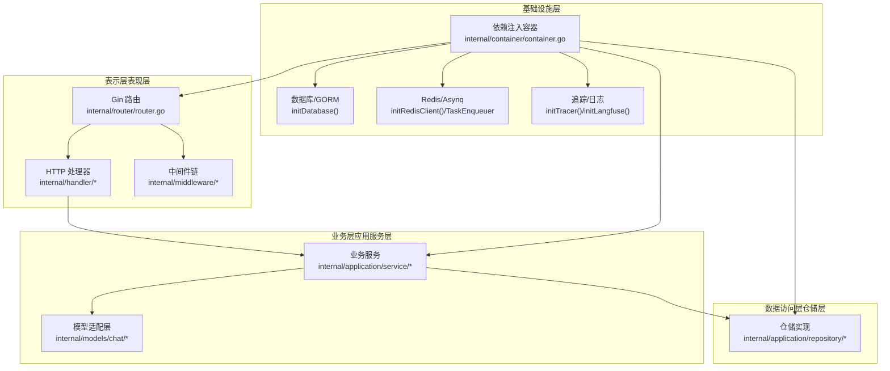
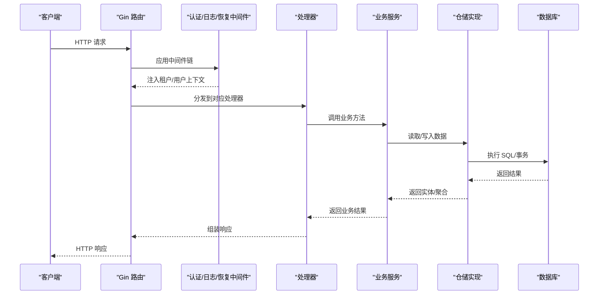
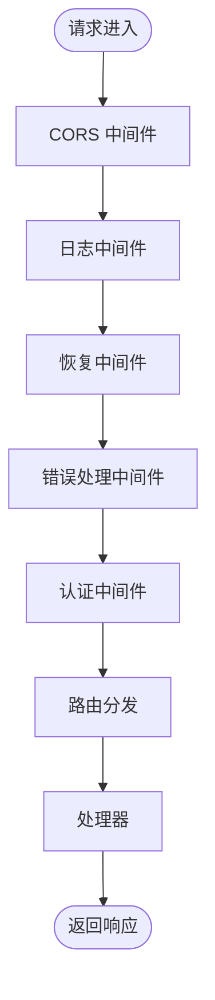
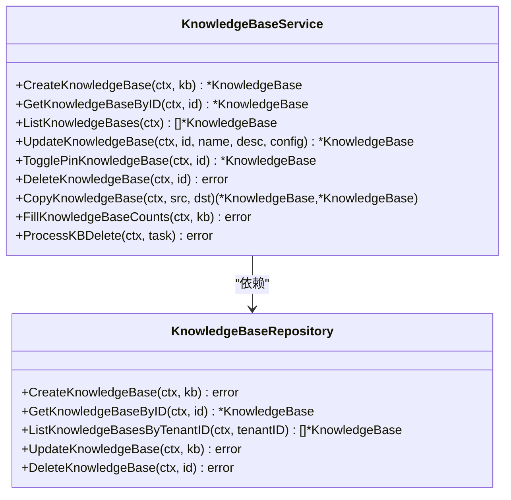
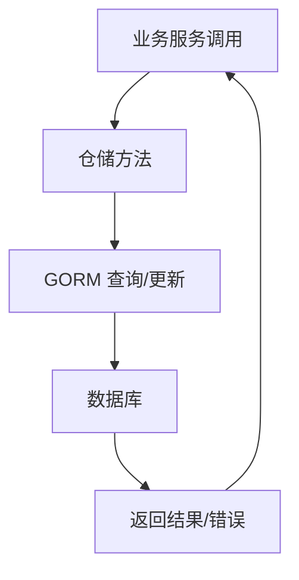
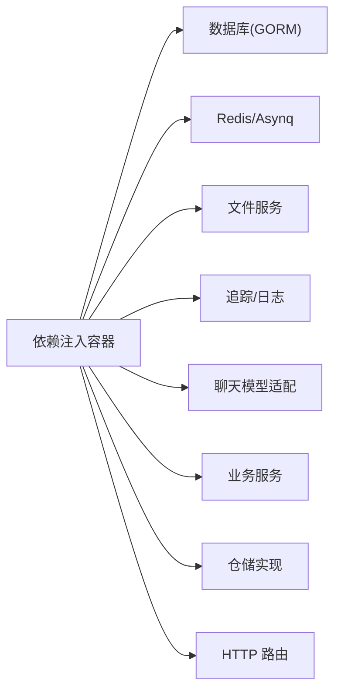
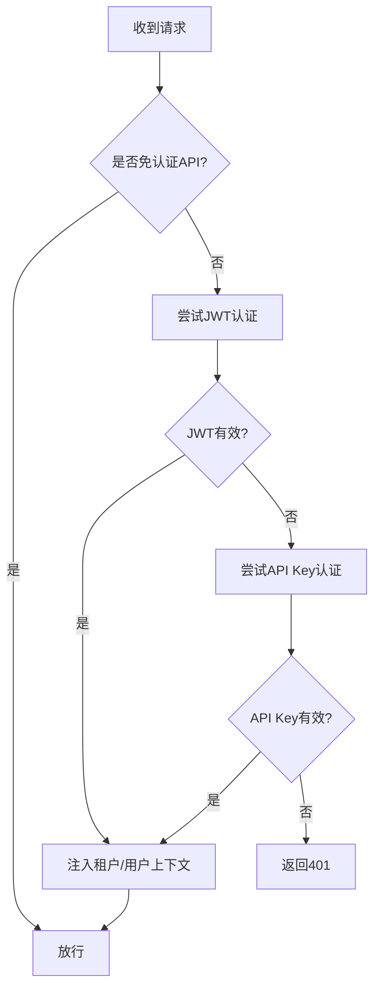
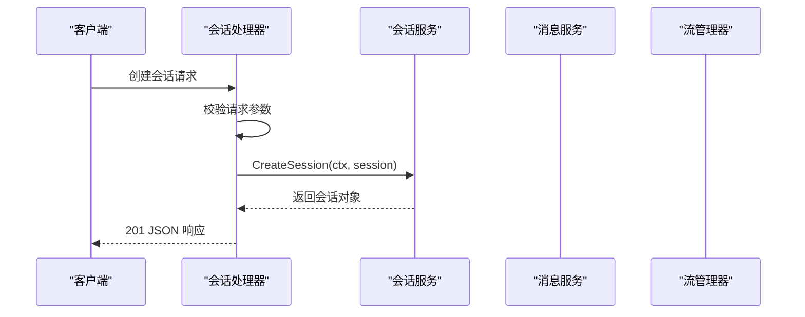
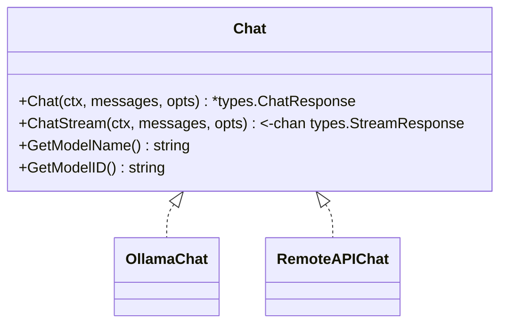
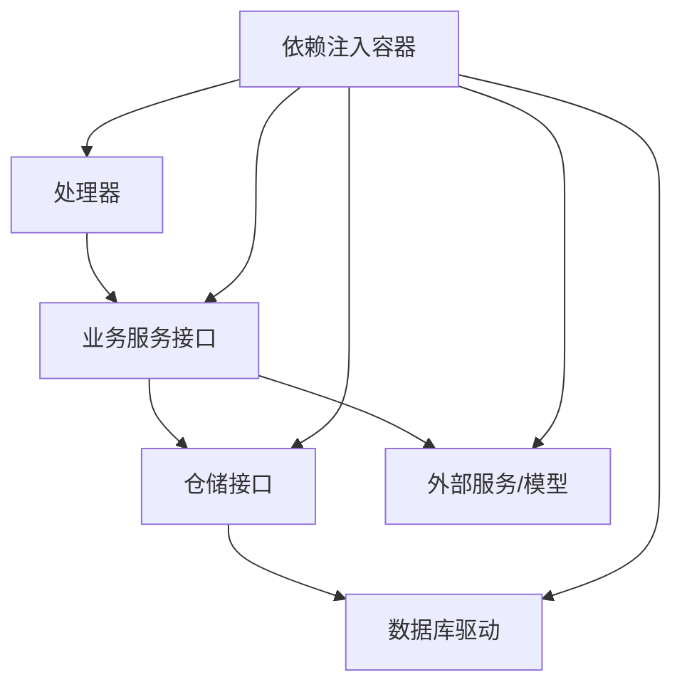

# 分层架构设计

<cite>
**本文档引用的文件**
- [cmd/server/main.go](file://cmd/server/main.go)
- [internal/router/router.go](file://internal/router/router.go)
- [internal/middleware/auth.go](file://internal/middleware/auth.go)
- [internal/handler/session/handler.go](file://internal/handler/session/handler.go)
- [internal/application/service/knowledgebase.go](file://internal/application/service/knowledgebase.go)
- [internal/application/repository/knowledgebase.go](file://internal/application/repository/knowledgebase.go)
- [internal/container/container.go](file://internal/container/container.go)
- [internal/models/chat/chat.go](file://internal/models/chat/chat.go)
</cite>

## 目录
1. [引言](#引言)
2. [项目结构](#项目结构)
3. [核心组件](#核心组件)
4. [架构总览](#架构总览)
5. [详细组件分析](#详细组件分析)
6. [依赖关系分析](#依赖关系分析)
7. [性能考虑](#性能考虑)
8. [故障排除指南](#故障排除指南)
9. [结论](#结论)

## 引言
本文件系统性梳理 WeKnora 的分层架构设计，明确表示层（表现层）、业务层（应用服务层）、数据访问层（仓储层）的划分原则与职责边界，解释各层之间的交互模式与数据流向，并总结分层架构在关注点分离、可测试性与可维护性方面的优势。同时给出层间通信、异常处理与事务管理的最佳实践，结合仓库中的实际代码示例，帮助读者快速理解并落地实施。

## 项目结构
WeKnora 采用典型的三层架构与多层模块化组织：
- 表示层（表现层）：基于 Gin 的 HTTP 路由与处理器，负责请求接入、参数校验、响应封装与中间件链路。
- 业务层（应用服务层）：封装领域用例与业务流程，协调多个仓储与外部服务，提供稳定的业务能力接口。
- 数据访问层（仓储层）：抽象数据持久化操作，屏蔽底层数据库与检索引擎差异，向上提供统一的读写接口。
- 基础设施层：数据库连接、缓存、分布式任务队列、外部模型服务等基础设施组件，通过依赖注入容器集中装配。
- 类型与接口层：定义统一的数据模型与接口契约，确保层间解耦与可替换性。

**图表来源**
- [internal/router/router.go:72-161](file://internal/router/router.go#L72-L161)
- [internal/container/container.go:93-311](file://internal/container/container.go#L93-L311)

**章节来源**
- [internal/router/router.go:72-161](file://internal/router/router.go#L72-L161)
- [internal/container/container.go:93-311](file://internal/container/container.go#L93-L311)

## 核心组件
- 服务器入口与生命周期管理：负责启动 HTTP 服务、信号监听与优雅停机，构建依赖注入容器并运行应用。
- 路由与中间件：统一注册路由、CORS、日志、恢复、错误处理、认证等中间件，按需注册 Swagger 文档与静态资源。
- 认证中间件：支持 JWT 与 API Key 两种认证方式，解析租户上下文，注入用户与租户信息到请求上下文。
- 业务服务：封装知识库、会话、消息、模型等核心业务逻辑，协调仓储与外部服务，处理异步任务。
- 仓储实现：基于 GORM 的数据库访问，抽象知识库、知识、分块等实体的 CRUD 与聚合查询。
- 依赖注入容器：集中装配数据库、检索引擎、文件服务、Redis、Asynq、追踪与聊天模型等组件。

**章节来源**
- [cmd/server/main.go:43-123](file://cmd/server/main.go#L43-L123)
- [internal/router/router.go:72-161](file://internal/router/router.go#L72-L161)
- [internal/middleware/auth.go:66-228](file://internal/middleware/auth.go#L66-L228)
- [internal/application/service/knowledgebase.go:36-62](file://internal/application/service/knowledgebase.go#L36-L62)
- [internal/application/repository/knowledgebase.go:25-124](file://internal/application/repository/knowledgebase.go#L25-L124)
- [internal/container/container.go:93-311](file://internal/container/container.go#L93-L311)

## 架构总览
WeKnora 的请求处理遵循“表示层 -> 业务层 -> 数据访问层”的单向依赖，层间通过接口解耦，依赖注入容器负责装配与生命周期管理。认证中间件在路由注册后统一拦截，确保安全上下文可用。业务服务承担编排职责，必要时通过异步任务队列处理耗时操作，保障接口响应的及时性。

**图表来源**
- [internal/router/router.go:117-158](file://internal/router/router.go#L117-L158)
- [internal/middleware/auth.go:66-228](file://internal/middleware/auth.go#L66-L228)
- [internal/handler/session/handler.go:78-127](file://internal/handler/session/handler.go#L78-L127)
- [internal/application/service/knowledgebase.go:75-99](file://internal/application/service/knowledgebase.go#L75-L99)
- [internal/application/repository/knowledgebase.go:26-40](file://internal/application/repository/knowledgebase.go#L26-L40)

## 详细组件分析

### 表示层（表现层）
- 路由注册：统一在路由模块中注册各类 API 路由组，按功能域拆分，如知识库、知识、会话、消息、模型、初始化、系统等。
- 中间件链：CORS、请求 ID、语言、日志、恢复、错误处理、认证等中间件按顺序执行，认证中间件在注册后生效。
- 静态资源与文件服务：在 Lite 版本内嵌前端静态文件；统一代理文件下载/预览，支持多种存储后端。
- Swagger 文档：非生产模式下提供在线文档浏览。

**图表来源**
- [internal/router/router.go:76-91](file://internal/router/router.go#L76-L91)
- [internal/router/router.go:117-158](file://internal/router/router.go#L117-L158)

**章节来源**
- [internal/router/router.go:72-161](file://internal/router/router.go#L72-L161)
- [internal/router/router.go:76-91](file://internal/router/router.go#L76-L91)
- [internal/router/router.go:117-158](file://internal/router/router.go#L117-L158)

### 业务层（应用服务层）
- 知识库服务：封装知识库的创建、查询、更新、删除、计数统计、复制与异步清理等完整生命周期逻辑，协调仓储与检索引擎。
- 会话服务：会话创建、查询、分页、更新、删除、批量删除、清空消息与上下文等。
- 模型适配：统一抽象聊天接口，支持本地 Ollama 与远程模型提供商，便于替换与扩展。

**图表来源**
- [internal/application/service/knowledgebase.go:36-62](file://internal/application/service/knowledgebase.go#L36-L62)
- [internal/application/repository/knowledgebase.go:25-124](file://internal/application/repository/knowledgebase.go#L25-L124)

**章节来源**
- [internal/application/service/knowledgebase.go:74-408](file://internal/application/service/knowledgebase.go#L74-L408)
- [internal/application/repository/knowledgebase.go:25-124](file://internal/application/repository/knowledgebase.go#L25-L124)

### 数据访问层（仓储层）
- 仓储接口：面向业务服务暴露统一的读写接口，隐藏底层实现细节。
- GORM 实现：基于 GORM 的标准 CRUD 与条件查询，支持租户隔离与排序控制。
- 错误处理：对记录不存在场景返回特定错误类型，便于上层区分处理。

**图表来源**
- [internal/application/repository/knowledgebase.go:26-40](file://internal/application/repository/knowledgebase.go#L26-L40)

**章节来源**
- [internal/application/repository/knowledgebase.go:25-124](file://internal/application/repository/knowledgebase.go#L25-L124)

### 依赖注入容器
- 统一装配：数据库、检索引擎、文件服务、Redis、Asynq、追踪、聊天模型等组件集中注册。
- 生命周期：容器负责组件创建、注入与清理，确保资源有序释放。
- 条件装配：根据环境变量动态启用/禁用某些能力（如 Redis、Lite 前端、迁移等）。

**图表来源**
- [internal/container/container.go:93-311](file://internal/container/container.go#L93-L311)

**章节来源**
- [internal/container/container.go:93-311](file://internal/container/container.go#L93-L311)

### 认证与授权中间件
- 支持 JWT 与 API Key 两种认证方式，解析租户上下文，注入用户与租户信息到请求上下文。
- 对跨租户访问进行权限校验，确保资源隔离。
- 未认证或认证失败时返回相应错误，阻止后续处理。

**图表来源**
- [internal/middleware/auth.go:66-228](file://internal/middleware/auth.go#L66-L228)

**章节来源**
- [internal/middleware/auth.go:66-228](file://internal/middleware/auth.go#L66-L228)

### 会话处理器示例
- 处理器通过依赖注入获得会话、消息、流管理、知识库、自定义 Agent、租户共享 Agent、文件服务、模型服务等能力。
- 在处理过程中从上下文中获取租户 ID，调用业务服务执行具体操作，并返回标准化响应。

**图表来源**
- [internal/handler/session/handler.go:78-127](file://internal/handler/session/handler.go#L78-L127)

**章节来源**
- [internal/handler/session/handler.go:78-127](file://internal/handler/session/handler.go#L78-L127)

### 聊天模型适配
- 抽象 Chat 接口，支持本地 Ollama 与远程模型提供商，统一非流式与流式对话能力。
- 通过配置工厂根据模型来源创建不同实现，便于替换与扩展。

**图表来源**
- [internal/models/chat/chat.go:82-94](file://internal/models/chat/chat.go#L82-L94)
- [internal/models/chat/chat.go:133-146](file://internal/models/chat/chat.go#L133-L146)

**章节来源**
- [internal/models/chat/chat.go:82-177](file://internal/models/chat/chat.go#L82-L177)

## 依赖关系分析
- 层间依赖：表示层依赖业务层接口，业务层依赖仓储接口，仓储依赖数据库驱动，形成清晰的单向依赖。
- 接口契约：通过接口定义约束实现，确保层间解耦与可替换性。
- 容器装配：依赖注入容器集中管理组件生命周期，避免循环依赖与全局状态污染。
- 异步处理：通过 Asynq 任务队列处理重任务（如知识库删除清理），提升接口响应性能。

**图表来源**
- [internal/container/container.go:93-311](file://internal/container/container.go#L93-L311)
- [internal/application/service/knowledgebase.go:36-62](file://internal/application/service/knowledgebase.go#L36-L62)
- [internal/application/repository/knowledgebase.go:25-124](file://internal/application/repository/knowledgebase.go#L25-L124)

**章节来源**
- [internal/container/container.go:93-311](file://internal/container/container.go#L93-L311)
- [internal/application/service/knowledgebase.go:36-62](file://internal/application/service/knowledgebase.go#L36-L62)
- [internal/application/repository/knowledgebase.go:25-124](file://internal/application/repository/knowledgebase.go#L25-L124)

## 性能考虑
- 中间件顺序：CORS、日志、恢复、错误处理等应尽早执行，减少无效处理成本。
- 认证前置：认证中间件在路由注册后生效，确保后续处理器无需重复校验。
- 异步任务：重计算与清理操作放入队列，避免阻塞请求线程。
- 连接池：数据库连接池参数按驱动特性配置，SQLite 限制并发写入，PostgreSQL 设置空闲连接数。
- 缓存与追踪：Redis 作为上下文存储与任务队列，Langfuse 提供可观测性，需按需启用。

[本节为通用指导，不直接分析具体文件]

## 故障排除指南
- 认证失败：检查 Authorization 头或 X-API-Key 是否正确，确认租户 ID 与用户权限。
- 路由未生效：确认路由注册位置与中间件顺序，Swagger 仅在非生产模式启用。
- 数据库连接：检查 DB_DRIVER、连接字符串与迁移配置，确保迁移成功或手动处理。
- 文件服务：确认 STORAGE_TYPE 与对应配置项，验证存储桶/路径权限。
- 任务队列：Redis 不可用时切换同步执行，检查任务状态与错误日志。

**章节来源**
- [internal/middleware/auth.go:66-228](file://internal/middleware/auth.go#L66-L228)
- [internal/router/router.go:98-107](file://internal/router/router.go#L98-L107)
- [internal/container/container.go:391-526](file://internal/container/container.go#L391-L526)
- [internal/container/container.go:639-747](file://internal/container/container.go#L639-L747)

## 结论
WeKnora 的分层架构通过清晰的职责划分与接口契约，实现了关注点分离、可测试性与可维护性的平衡。依赖注入容器统一装配基础设施与业务组件，路由与中间件链提供一致的安全与可观测性体验。业务服务承担编排职责，仓储屏蔽底层差异，配合异步任务提升整体性能。遵循本文的最佳实践，可在保持架构稳定的同时快速迭代新功能。