# 接口抽象设计

<cite>
**本文引用的文件**
- [resource.go](file://internal/types/interfaces/resource.go)
- [context_manager.go](file://internal/types/interfaces/context_manager.go)
- [session.go](file://internal/types/interfaces/session.go)
- [knowledgebase.go](file://internal/types/interfaces/knowledgebase.go)
- [retriever.go](file://internal/types/interfaces/retriever.go)
- [memory.go](file://internal/types/interfaces/memory.go)
- [model.go](file://internal/types/interfaces/model.go)
- [skill.go](file://internal/types/interfaces/skill.go)
- [mcp_service.go](file://internal/types/interfaces/mcp_service.go)
- [container.go](file://internal/container/container.go)
</cite>

## 目录
1. [简介](#简介)
2. [项目结构](#项目结构)
3. [核心组件](#核心组件)
4. [架构总览](#架构总览)
5. [详细组件分析](#详细组件分析)
6. [依赖分析](#依赖分析)
7. [性能考量](#性能考量)
8. [故障排查指南](#故障排查指南)
9. [结论](#结论)
10. [附录](#附录)

## 简介
本文件聚焦 WeKnora 的接口抽象设计，系统化梳理 interfaces 包中各接口的职责边界、设计原则与依赖倒置实践，并结合容器装配代码展示如何通过接口实现模块解耦与可替换性。重点覆盖以下方面：
- 统一接口定义的设计原则与分层策略
- 依赖倒置原则在项目中的落地方式
- 核心接口如 ResourceCleaner、TaskEnqueuer、ContextStorage 的设计思路与实现要点
- 接口抽象的最佳实践：分层、职责分离与扩展性
- 具体实现示例与使用场景，指导正确的依赖注入与模块组合

## 项目结构
WeKnora 将业务能力按“接口契约—服务—仓库—外部集成”分层组织，接口层位于 internal/types/interfaces，面向上层服务与处理器暴露稳定契约；容器层 internal/container 负责装配具体实现并注入依赖。

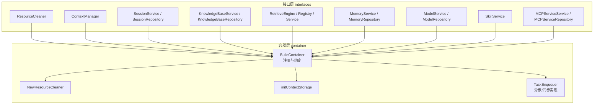

图表来源
- [container.go:85-311](file://internal/container/container.go#L85-L311)
- [resource.go:9-19](file://internal/types/interfaces/resource.go#L9-L19)
- [context_manager.go:12-31](file://internal/types/interfaces/context_manager.go#L12-L31)
- [session.go:10-48](file://internal/types/interfaces/session.go#L10-L48)
- [knowledgebase.go:14-132](file://internal/types/interfaces/knowledgebase.go#L14-L132)
- [retriever.go:10-132](file://internal/types/interfaces/retriever.go#L10-L132)
- [memory.go:9-28](file://internal/types/interfaces/memory.go#L9-L28)
- [model.go:14-60](file://internal/types/interfaces/model.go#L14-L60)
- [skill.go:9-16](file://internal/types/interfaces/skill.go#L9-L16)
- [mcp_service.go:9-61](file://internal/types/interfaces/mcp_service.go#L9-L61)

章节来源
- [container.go:85-311](file://internal/container/container.go#L85-L311)

## 核心组件
本节对关键接口进行深入解析，阐明其设计目的、方法语义与典型实现方向。

- ResourceCleaner
  - 设计目的：集中管理资源清理函数，支持命名注册与批量执行，确保生命周期结束时释放资源。
  - 关键方法：注册清理函数、带名注册、按上下文批量清理。
  - 实现建议：将外部资源（如 tracer、pool、连接池）的关闭逻辑封装为清理函数，避免泄漏。

- ContextManager
  - 设计目的：维护会话级 LLM 上下文窗口，提供消息增删查、统计与系统提示设置，必要时进行压缩。
  - 关键方法：添加消息、获取上下文、清空上下文、获取统计、设置系统提示。
  - 实现建议：结合 Token 计数与压缩策略，保证上下文长度不超过模型限制。

- SessionService / SessionRepository
  - 设计目的：会话的 CRUD、分页、标题生成、知识问答、代理问答、上下文清理等。
  - 关键方法：创建/查询/更新/删除、批量删除、生成标题（同步/异步）、知识检索、事件驱动问答。
  - 实现建议：将业务流程拆分为多个插件化的处理步骤，便于扩展与测试。

- KnowledgeBaseService / KnowledgeBaseRepository
  - 设计目的：知识库的创建、查询、更新、删除、混合检索、嵌入预计算、复制、异步删除任务处理。
  - 关键方法：创建/查询/列表/更新/删除、切换置顶、混合检索、获取嵌入、解析模型键、复制知识库、异步删除。
  - 实现建议：仓储层负责数据持久化与隔离（租户维度），服务层编排业务规则与跨域操作。

- RetrieveEngine / Registry / Service
  - 设计目的：检索引擎的统一抽象，支持多种后端（如 PostgreSQL、Elasticsearch、Milvus 等），提供索引、检索、存储大小估算、批量操作与复制。
  - 关键方法：引擎类型、检索、支持类型；仓储保存/批量保存/估算/删除/复制；服务索引/批量索引/复制/删除/更新状态。
  - 实现建议：通过注册表按类型选择具体引擎，实现多后端透明切换。

- MemoryService / MemoryRepository
  - 设计目的：记忆图谱的 Episode 存储与检索，支持可用性检测。
  - 关键方法：添加 Episode、检索相关记忆、保存 Episode 及实体关系、查找相关 Episode、可用性检查。
  - 实现建议：将对话转化为图谱实体与关系，提升上下文理解与个性化。

- ModelService / ModelRepository
  - 设计目的：模型的生命周期管理与租户维度的模型选择，提供聊天、嵌入、重排序、视觉语言、语音识别模型实例。
  - 关键方法：创建/查询/列表/更新/删除；按租户获取嵌入/重排序/聊天/VLM/ASR 模型。
  - 实现建议：模型实例应具备连接池与缓存，减少重复初始化成本。

- SkillService
  - 设计目的：技能元数据与加载，支持预置技能与按名获取。
  - 关键方法：列出预置技能、按名获取技能。
  - 实现建议：将技能定义与实现解耦，便于动态加载与热更新。

- MCPServiceService / MCPServiceRepository
  - 设计目的：MCP 服务的增删改查、连通性测试、工具与资源枚举。
  - 关键方法：创建/查询/列表/更新/删除、测试连接、获取工具与资源。
  - 实现建议：对远端 MCP 服务进行健康检查与权限校验，保障集成稳定性。

章节来源
- [resource.go:9-19](file://internal/types/interfaces/resource.go#L9-L19)
- [context_manager.go:12-31](file://internal/types/interfaces/context_manager.go#L12-L31)
- [session.go:10-48](file://internal/types/interfaces/session.go#L10-L48)
- [knowledgebase.go:14-132](file://internal/types/interfaces/knowledgebase.go#L14-L132)
- [retriever.go:10-132](file://internal/types/interfaces/retriever.go#L10-L132)
- [memory.go:9-28](file://internal/types/interfaces/memory.go#L9-L28)
- [model.go:14-60](file://internal/types/interfaces/model.go#L14-L60)
- [skill.go:9-16](file://internal/types/interfaces/skill.go#L9-L16)
- [mcp_service.go:9-61](file://internal/types/interfaces/mcp_service.go#L9-L61)

## 架构总览
WeKnora 采用“接口契约 + 服务层 + 仓储层 + 外部集成”的分层架构，容器层负责装配与依赖注入，实现模块间解耦与可替换性。

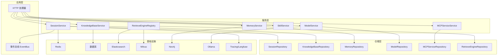

图表来源
- [container.go:85-311](file://internal/container/container.go#L85-L311)

## 详细组件分析

### ResourceCleaner 接口分析
- 设计原则
  - 生命周期管理：集中注册与执行清理函数，避免资源泄漏。
  - 可命名注册：便于定位与调试特定资源。
  - 上下文感知：清理过程可携带取消信号，确保及时退出。
- 实现要点
  - 清理函数应幂等，支持并发安全。
  - 在容器初始化阶段注册关键组件清理（如 tracer、pool、Redis 客户端）。
- 使用场景
  - 应用退出时统一回收资源。
  - 测试中模拟异常路径，验证清理是否生效。

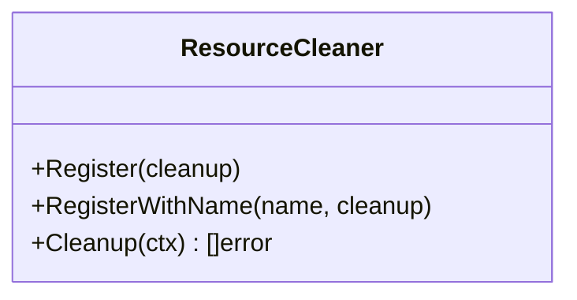

图表来源
- [resource.go:9-19](file://internal/types/interfaces/resource.go#L9-L19)

章节来源
- [resource.go:9-19](file://internal/types/interfaces/resource.go#L9-L19)
- [container.go:97-116](file://internal/container/container.go#L97-L116)

### ContextManager 接口分析
- 设计原则
  - 会话上下文独立于消息存储：关注上下文窗口内的消息集合与统计信息。
  - 压缩策略：当超出窗口时进行压缩或截断，保留关键信息。
  - 系统提示管理：支持动态设置与替换系统消息。
- 实现要点
  - 统计结构包含消息数量、Token 估算、是否压缩、原始消息数。
  - 上下文获取可能触发压缩，需保证一致性与可重现性。
- 使用场景
  - 问答前准备上下文，控制成本与延迟。
  - 对话历史过长时自动压缩，维持响应质量。

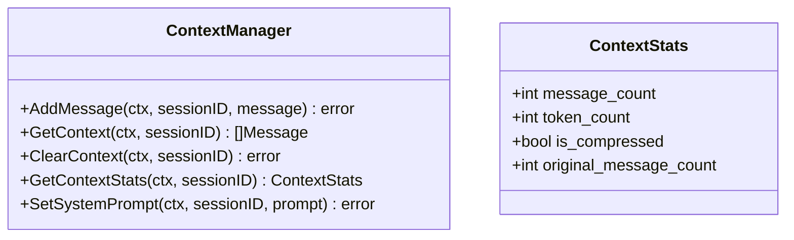

图表来源
- [context_manager.go:12-43](file://internal/types/interfaces/context_manager.go#L12-L43)

章节来源
- [context_manager.go:12-43](file://internal/types/interfaces/context_manager.go#L12-L43)
- [container.go:370-380](file://internal/container/container.go#L370-L380)

### SessionService 与 SessionRepository 分析
- 设计原则
  - 服务层负责业务编排与事件发布，仓储层负责数据持久化与隔离。
  - 支持同步与异步标题生成，事件驱动的问答流程。
- 实现要点
  - 知识问答与代理问答分别走不同流水线，支持流式输出。
  - 分页查询与租户隔离，防止越权访问。
- 使用场景
  - 创建会话、批量删除、生成标题、知识检索与问答。

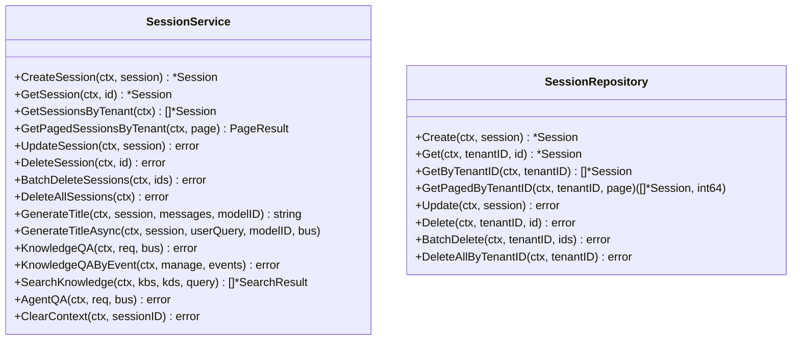

图表来源
- [session.go:10-68](file://internal/types/interfaces/session.go#L10-L68)

章节来源
- [session.go:10-68](file://internal/types/interfaces/session.go#L10-L68)

### KnowledgeBaseService 与 KnowledgeBaseRepository 分析
- 设计原则
  - 服务层聚合知识库生命周期与检索能力，仓储层保证数据一致性与租户隔离。
  - 支持混合检索、嵌入预计算与模型键解析，优化跨 KB 查询效率。
- 实现要点
  - 异步删除任务通过队列处理，避免阻塞主流程。
  - 复制知识库时共享嵌入模型键，减少重复计算。
- 使用场景
  - 创建/更新/删除知识库、混合检索、复制与统计填充。

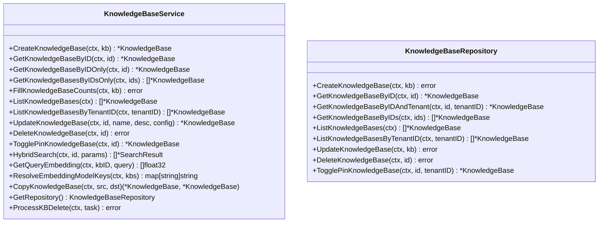

图表来源
- [knowledgebase.go:14-210](file://internal/types/interfaces/knowledgebase.go#L14-L210)

章节来源
- [knowledgebase.go:14-210](file://internal/types/interfaces/knowledgebase.go#L14-L210)

### RetrieveEngine / Registry / Service 分析
- 设计原则
  - 通过注册表统一管理多种检索后端，按类型选择具体实现。
  - 仓储层负责索引元数据与批量操作，服务层负责索引构建、复制与删除。
- 实现要点
  - 支持按 Chunk/Source/Knowledge 维度删除与批量更新标签/启用状态。
  - 提供存储大小估算，辅助容量规划。
- 使用场景
  - 文档入库后的索引构建、跨 KB 复制索引、检索与统计。

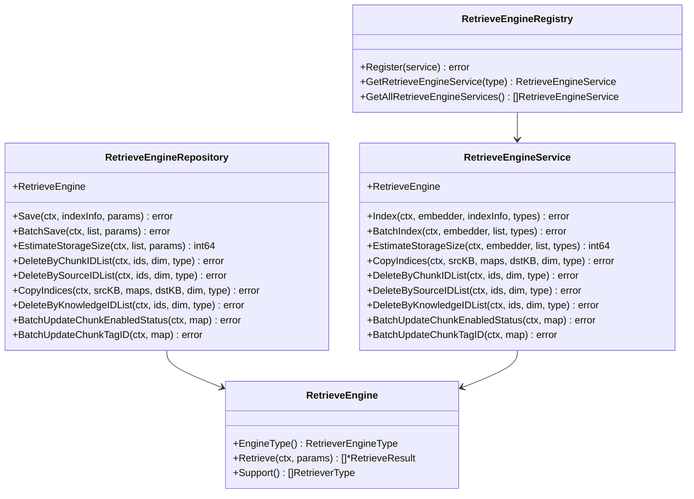

图表来源
- [retriever.go:10-132](file://internal/types/interfaces/retriever.go#L10-L132)

章节来源
- [retriever.go:10-132](file://internal/types/interfaces/retriever.go#L10-L132)
- [container.go:749-800](file://internal/container/container.go#L749-L800)

### MemoryService / MemoryRepository 分析
- 设计原则
  - 将对话转化为 Episode 并写入图数据库，支持基于关键词的关联检索。
  - 提供可用性检查，适配不同图数据库后端。
- 实现要点
  - Episode、实体与关系三者协同，形成可查询的记忆图谱。
- 使用场景
  - 个性化问答增强、长期记忆与上下文丰富。

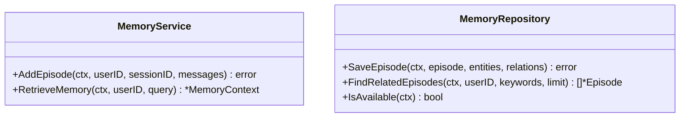

图表来源
- [memory.go:9-28](file://internal/types/interfaces/memory.go#L9-L28)

章节来源
- [memory.go:9-28](file://internal/types/interfaces/memory.go#L9-L28)

### ModelService / ModelRepository 分析
- 设计原则
  - 按租户维度提供模型实例，支持跨租户共享与默认模型管理。
  - 统一管理聊天、嵌入、重排序、视觉语言、语音识别模型。
- 实现要点
  - 租户隔离与默认模型清理，避免误用。
- 使用场景
  - 问答、嵌入向量化、重排序、多模态理解与 ASR。

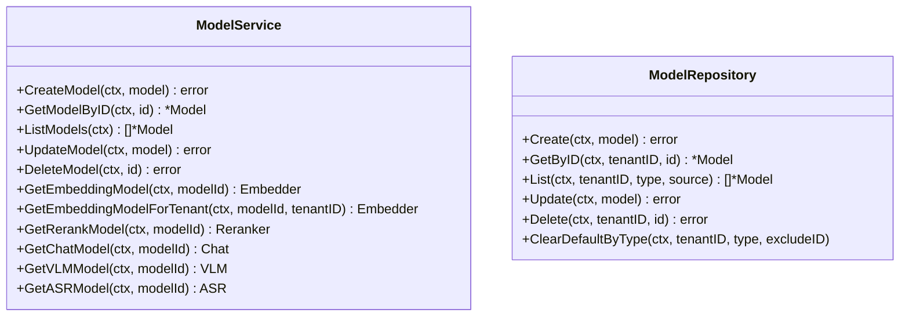

图表来源
- [model.go:14-60](file://internal/types/interfaces/model.go#L14-L60)

章节来源
- [model.go:14-60](file://internal/types/interfaces/model.go#L14-L60)

### SkillService 分析
- 设计原则
  - 抽象技能加载与元数据管理，支持预置技能与动态加载。
- 使用场景
  - 动态装配 Agent 技能集，按需启用与禁用。

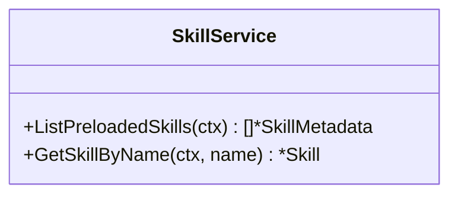

图表来源
- [skill.go:9-16](file://internal/types/interfaces/skill.go#L9-L16)

章节来源
- [skill.go:9-16](file://internal/types/interfaces/skill.go#L9-L16)

### MCPServiceService / MCPServiceRepository 分析
- 设计原则
  - 对外 MCP 服务进行统一管理，支持连通性测试与工具/资源枚举。
- 使用场景
  - 集成第三方 MCP 工具与资源，扩展 Agent 能力。

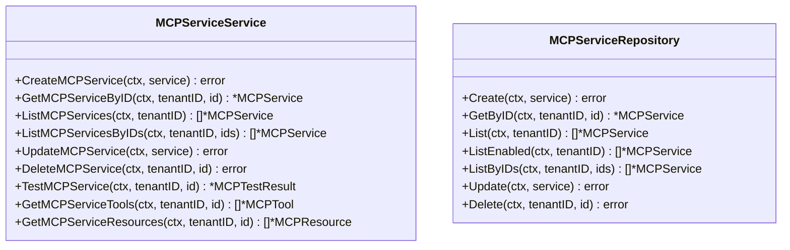

图表来源
- [mcp_service.go:9-61](file://internal/types/interfaces/mcp_service.go#L9-L61)

章节来源
- [mcp_service.go:9-61](file://internal/types/interfaces/mcp_service.go#L9-L61)

## 依赖分析
容器层通过依赖注入实现模块解耦，接口作为契约向上层暴露能力，具体实现由环境变量与配置决定。

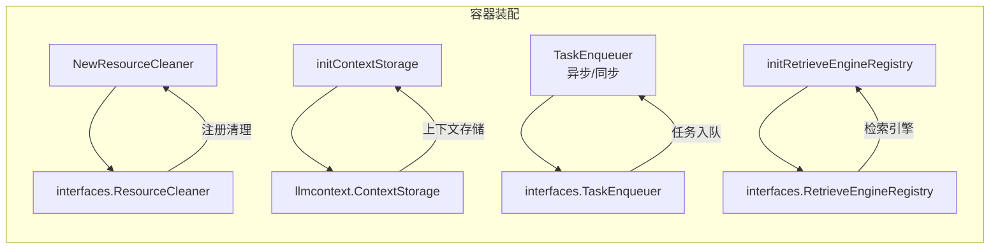

图表来源
- [container.go:97-116](file://internal/container/container.go#L97-L116)
- [container.go:224-233](file://internal/container/container.go#L224-L233)
- [container.go:370-380](file://internal/container/container.go#L370-L380)
- [container.go:749-800](file://internal/container/container.go#L749-L800)

章节来源
- [container.go:97-116](file://internal/container/container.go#L97-L116)
- [container.go:224-233](file://internal/container/container.go#L224-L233)
- [container.go:370-380](file://internal/container/container.go#L370-L380)
- [container.go:749-800](file://internal/container/container.go#L749-L800)

## 性能考量
- 接口分层带来的间接调用成本较低，主要体现在序列化/反序列化与网络往返（如 Redis、Elasticsearch、Milvus）。可通过连接池、批处理与缓存降低开销。
- 检索链路中嵌入向量化与重排序是性能瓶颈，建议：
  - 批量嵌入与并行处理
  - 合理设置索引维度与存储格式
  - 使用模型键解析与共享嵌入，减少重复计算
- 上下文管理应结合 Token 估算与压缩策略，避免超长上下文导致延迟与成本上升。

## 故障排查指南
- 资源清理未生效
  - 检查 ResourceCleaner 是否在容器初始化阶段注册
  - 确认清理函数幂等且无阻塞
- 上下文异常
  - 核对 ContextManager 的统计字段与压缩逻辑
  - 检查系统提示设置时机与覆盖行为
- 任务队列不可用
  - 若未配置 Redis，则 TaskEnqueuer 退化为同步执行，确认业务是否接受阻塞
- 检索后端异常
  - 检查 RetrieveEngineRegistry 注册项与后端连通性
  - 核对索引维度与知识类型参数

章节来源
- [container.go:97-116](file://internal/container/container.go#L97-L116)
- [container.go:224-233](file://internal/container/container.go#L224-L233)
- [container.go:370-380](file://internal/container/container.go#L370-L380)
- [container.go:749-800](file://internal/container/container.go#L749-L800)

## 结论
WeKnora 的接口抽象遵循依赖倒置原则，通过清晰的接口分层与容器装配，实现了模块间的低耦合与高可替换性。ResourceCleaner、ContextManager、SessionService、KnowledgeBaseService、RetrieveEngine 体系、MemoryService、ModelService、SkillService 与 MCPService 等接口共同构成了系统的稳定契约，既满足当前业务需求，也为未来扩展提供了坚实基础。

## 附录
- 最佳实践清单
  - 接口分层：接口层只暴露必要方法，避免“上帝对象”
  - 职责分离：服务层编排业务，仓储层专注数据，基础设施层负责外部集成
  - 扩展性：通过注册表与工厂模式支持新后端与新能力
  - 依赖注入：在容器层集中装配，按需替换实现
  - 可观测性：为关键接口提供统计与日志，便于监控与排障