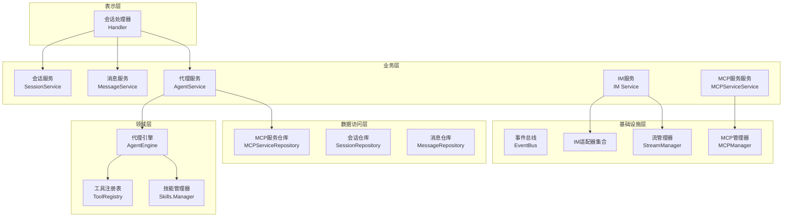
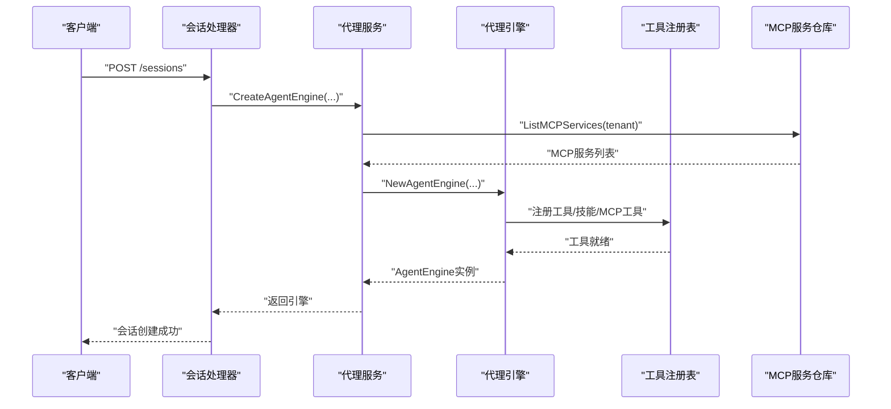
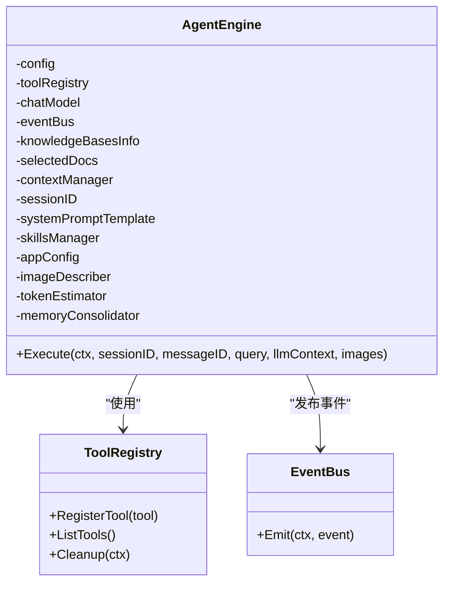
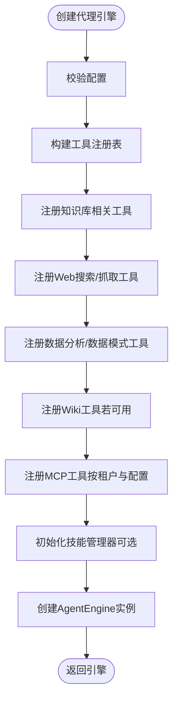
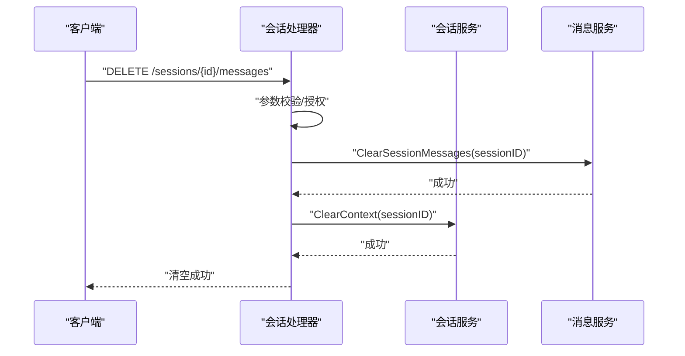
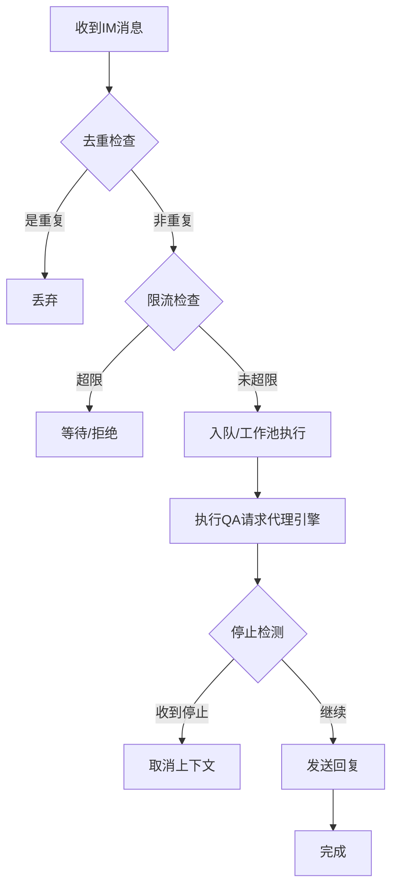
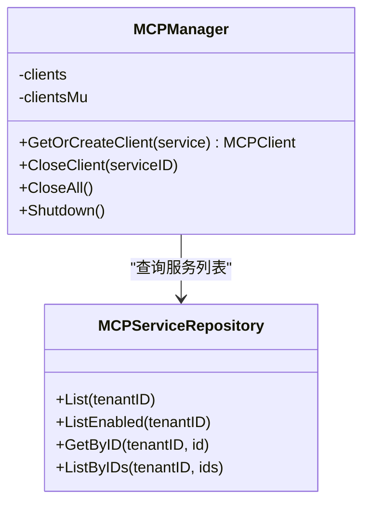
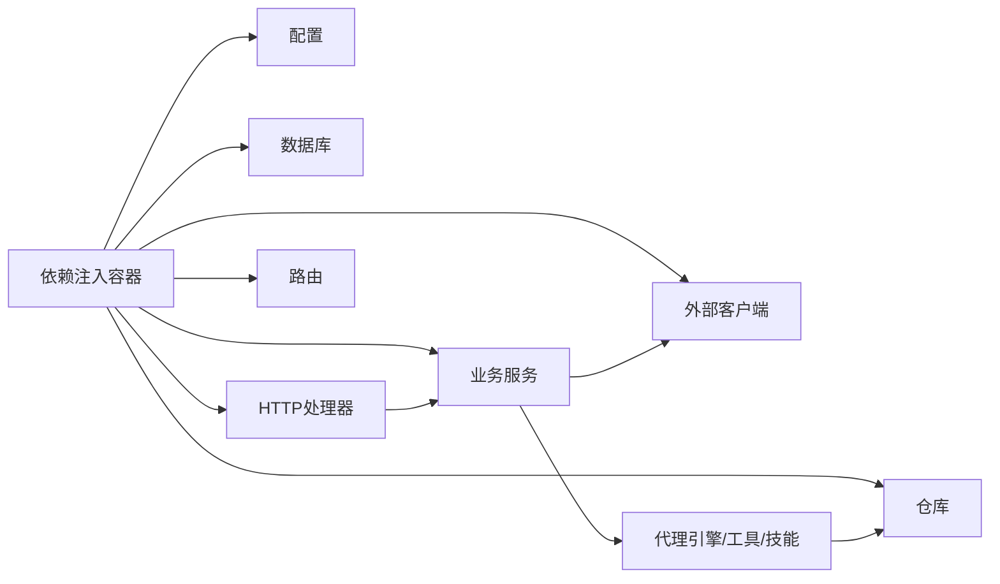

# 模块划分与职责

<cite>
**本文引用的文件**
- [go.mod](file://go.mod)
- [main.go](file://cmd/server/main.go)
- [container.go](file://internal/container/container.go)
- [engine.go](file://internal/agent/engine.go)
- [agent_service.go](file://internal/application/service/agent_service.go)
- [handler.go](file://internal/handler/session/handler.go)
- [service.go](file://internal/im/service.go)
- [manager.go](file://internal/mcp/manager.go)
- [mcp_service.go](file://internal/application/repository/mcp_service.go)
- [chat.go](file://internal/models/chat/chat.go)
</cite>

## 目录
1. [引言](#引言)
2. [项目结构](#项目结构)
3. [核心组件](#核心组件)
4. [架构总览](#架构总览)
5. [详细组件分析](#详细组件分析)
6. [依赖分析](#依赖分析)
7. [性能考量](#性能考量)
8. [故障排查指南](#故障排查指南)
9. [结论](#结论)
10. [附录](#附录)

## 引言
本文件面向WeKnora的模块划分与职责，系统化梳理表示层、业务层、数据访问层的边界与职责，明确代理引擎、知识管理、文档解析、即时通讯、MCP服务等核心模块的职责范围与相互关系。文档强调接口抽象设计、依赖倒置原则与模块解耦策略，并通过模块依赖图与职责矩阵展示协作模式，最后给出模块化设计最佳实践与扩展性建议。

## 项目结构
WeKnora采用分层架构与依赖注入容器组织代码：
- 表示层（HTTP Handlers）：接收请求、参数校验、调用业务服务、返回响应
- 业务层（Application Services）：编排领域逻辑、工具注册、策略选择、跨域能力协调
- 领域层（Agent Engine、Tools、Skills）：ReAct代理执行、工具调用、技能管理
- 数据访问层（Repositories）：数据持久化、检索后端适配
- 基础设施层（IM、MCP、文档解析、向量存储、事件总线等）
- 依赖注入容器：集中装配各层组件，实现解耦与可替换

图表来源
- [container.go](file://internal/container/container.go)
- [handler.go](file://internal/handler/session/handler.go)
- [agent_service.go](file://internal/application/service/agent_service.go)
- [engine.go](file://internal/agent/engine.go)
- [service.go](file://internal/im/service.go)
- [manager.go](file://internal/mcp/manager.go)
- [mcp_service.go](file://internal/application/repository/mcp_service.go)

章节来源
- [main.go:43-123](file://cmd/server/main.go#L43-L123)
- [container.go:93-311](file://internal/container/container.go#L93-L311)

## 核心组件
- 依赖注入容器：集中注册配置、数据库、外部客户端、仓库、服务、处理器与路由，确保生命周期与解耦
- 代理引擎：基于ReAct的智能体执行器，负责思考-行动-观察循环、工具调用、上下文窗口管理与事件广播
- 代理服务：组装工具、注册MCP工具、构建系统提示词、初始化技能管理器、创建代理引擎
- 会话处理器：HTTP入口，负责会话的增删改查、消息清理、批量操作
- IM服务：多平台即时通讯接入，统一消息处理、队列与限流、跨实例停止信号、分布式状态
- MCP管理器：MCP客户端连接池与复用、初始化超时控制、空闲清理、安全传输限制
- 向量检索与知识管理：知识库、知识、分块、标签、共享、向量存储、检索引擎注册
- 文档解析与分块：文档读取、OCR、解析链、切分策略、图像解析
- Web搜索与网络爬取：搜索引擎注册、代理与限流、结果聚合
- 事件总线与流管理：事件发布订阅、流事件写入与轮询、停止检测

章节来源
- [container.go:93-311](file://internal/container/container.go#L93-L311)
- [engine.go:28-92](file://internal/agent/engine.go#L28-L92)
- [agent_service.go:45-96](file://internal/application/service/agent_service.go#L45-L96)
- [handler.go:16-64](file://internal/handler/session/handler.go#L16-L64)
- [service.go:101-163](file://internal/im/service.go#L101-L163)
- [manager.go:13-35](file://internal/mcp/manager.go#L13-L35)
- [mcp_service.go:12-21](file://internal/application/repository/mcp_service.go#L12-L21)

## 架构总览
WeKnora以“依赖注入容器”为核心，将配置、基础设施、仓库、服务与处理器按层次装配。HTTP请求进入处理器，处理器调用业务服务；业务服务编排领域逻辑（代理引擎、工具、技能），并访问仓库；仓库通过统一接口对接不同后端（数据库、向量库、图数据库、外部服务）。IM与MCP作为独立基础设施模块，通过事件总线与流管理器与主流程解耦。

图表来源
- [handler.go:78-127](file://internal/handler/session/handler.go#L78-L127)
- [agent_service.go:98-173](file://internal/application/service/agent_service.go#L98-L173)
- [mcp_service.go:45-73](file://internal/application/repository/mcp_service.go#L45-L73)
- [engine.go:52-92](file://internal/agent/engine.go#L52-L92)

## 详细组件分析

### 代理引擎（AgentEngine）
- 职责边界
  - 接收对话历史与查询，驱动ReAct循环（思考-行动-观察）
  - 管理上下文窗口与令牌估算，避免超出模型上下文长度
  - 注册与调用工具（知识检索、网页搜索、数据库查询、数据分析、Wiki操作、MCP工具等）
  - 事件广播：思考、工具调用、工具结果、最终答案、引用、错误等
  - 技能管理：支持技能发现、只读与脚本执行工具注册
  - 图像描述：对工具结果中的图片进行视觉语言模型描述，增强多模态输出
- 关键交互
  - 依赖注入：Chat模型、工具注册表、事件总线、上下文管理器、应用配置、可选VLM描述器
  - 与代理服务协作：由代理服务构建工具集、注册MCP工具、设置系统提示词与技能管理器
  - 与工具注册表协作：动态注册工具，过滤不满足运行条件的工具
- 设计要点
  - 依赖倒置：通过接口（Chat、ContextManager、EventBus）解耦具体实现
  - 单一职责：专注于ReAct执行与事件流，不直接访问数据库或外部服务
  - 可扩展：支持新工具、新技能、新MCP服务的插拔式注册

图表来源
- [engine.go:28-92](file://internal/agent/engine.go#L28-L92)

章节来源
- [engine.go:28-92](file://internal/agent/engine.go#L28-L92)
- [engine.go:158-298](file://internal/agent/engine.go#L158-L298)

### 代理服务（AgentService）
- 职责边界
  - 组装代理引擎：校验配置、注册工具、注册MCP工具、设置系统提示词、初始化技能管理器
  - 工具注册策略：基于配置白名单与能力探测（知识库类型、是否启用Wiki/向量检索等）过滤工具
  - MCP工具注册：按租户与配置选择启用的服务，通过MCP管理器复用连接
  - 技能管理：根据环境变量与沙箱配置初始化技能管理器，注册只读与脚本执行工具
- 关键交互
  - 依赖注入：模型服务、知识库/知识/分块/文件/向量存储、MCP服务服务与管理器、事件总线、数据库、Web搜索服务、DuckDB、Wiki页面服务
  - 与仓库协作：查询MCP服务列表、知识库与知识元数据
- 设计要点
  - 依赖倒置：通过接口隔离具体实现，便于替换模型、检索、工具与MCP服务
  - 松耦合：工具注册与MCP注册解耦于引擎创建
  - 可观测：记录工具注册、MCP工具注册、技能初始化等关键事件

图表来源
- [agent_service.go:98-173](file://internal/application/service/agent_service.go#L98-L173)
- [agent_service.go:334-594](file://internal/application/service/agent_service.go#L334-L594)

章节来源
- [agent_service.go:45-96](file://internal/application/service/agent_service.go#L45-L96)
- [agent_service.go:98-173](file://internal/application/service/agent_service.go#L98-L173)
- [agent_service.go:334-594](file://internal/application/service/agent_service.go#L334-L594)

### 会话处理器（Session Handler）
- 职责边界
  - 会话生命周期管理：创建、查询、分页查询、更新、删除、批量删除
  - 清空会话消息：删除消息并清理LLM上下文与聊天历史知识库条目
  - 授权与校验：从上下文提取租户ID，参数校验与错误处理
- 关键交互
  - 依赖注入：会话服务、消息服务、流管理器、配置、知识库服务、自定义代理服务、租户服务、共享代理服务、文件服务、模型服务、文档读取器、图像解析器
  - 与业务服务协作：调用会话/消息服务执行具体操作
- 设计要点
  - 分层清晰：处理器仅做参数绑定与调用，不包含业务逻辑
  - 错误处理：统一错误类型与状态码返回
  - 安全：严格校验租户ID与资源归属

图表来源
- [handler.go:331-371](file://internal/handler/session/handler.go#L331-L371)

章节来源
- [handler.go:16-64](file://internal/handler/session/handler.go#L16-L64)
- [handler.go:331-371](file://internal/handler/session/handler.go#L331-L371)

### 即时通讯（IM Service）
- 职责边界
  - 多平台适配：支持WebSocket/长轮询等模式，统一消息格式
  - 消息去重：单实例/多实例下的消息ID去重
  - 速率限制：滑动窗口限流，支持Redis分布式与本地回退
  - 队列与工作池：有界队列与工作池，背压保护下游LLM资源
  - 停止机制：跨实例/跨通道的“/stop”命令，通过流管理器与Redis标记实现
  - 通道管理：WebSocket领导选举、重试接管、适配器生命周期管理
- 关键交互
  - 依赖注入：数据库、会话/消息/租户/知识/KB/模型服务、流管理器、Redis客户端、应用配置
  - 与代理服务协作：解析/保存知识、生成智能通知回复
- 设计要点
  - 解耦：适配器工厂模式，平台无关的消息处理
  - 可靠：去重、限流、队列、停止事件、领导选举
  - 可扩展：新增平台只需实现适配器与工厂

图表来源
- [service.go:784-800](file://internal/im/service.go#L784-L800)
- [service.go:619-727](file://internal/im/service.go#L619-L727)

章节来源
- [service.go:101-163](file://internal/im/service.go#L101-L163)
- [service.go:784-800](file://internal/im/service.go#L784-L800)

### MCP服务（MCP Manager 与 MCP 服务服务）
- 职责边界
  - MCP管理器：维护MCP客户端连接池，复用SSE/HTTP流式连接，初始化超时控制，空闲清理，安全策略（禁用stdio）
  - MCP服务服务：查询租户可用的MCP服务，支持内置服务可见性与启用状态
- 关键交互
  - 与代理服务协作：代理服务按租户与配置选择MCP服务，注册MCP工具到工具注册表
  - 与MCP服务仓库协作：查询MCP服务列表与详情
- 设计要点
  - 连接复用：减少重复握手与初始化开销
  - 安全优先：禁用stdio传输，仅允许SSE/HTTP Streamable
  - 可观测：连接数统计、活跃服务列表、初始化失败快速失败

图表来源
- [manager.go:13-35](file://internal/mcp/manager.go#L13-L35)
- [mcp_service.go:12-21](file://internal/application/repository/mcp_service.go#L12-L21)

章节来源
- [manager.go:13-35](file://internal/mcp/manager.go#L13-L35)
- [manager.go:37-96](file://internal/mcp/manager.go#L37-L96)
- [mcp_service.go:12-21](file://internal/application/repository/mcp_service.go#L12-L21)

### 知识管理与检索
- 职责边界
  - 知识库：类型、能力（向量/关键词/Wiki）、共享、索引策略
  - 知识：标题、描述、文件信息、解析状态、摘要状态
  - 分块：文本切分、头部钩子、去重、索引
  - 标签：知识标签、FAQ条目
  - 向量存储：多种后端（PostgreSQL、Elasticsearch、Milvus、Qdrant、Weaviate、SQLite、Neo4j）注册与统一接口
- 关键交互
  - 与代理服务协作：知识检索、Grep分块、列出分块、知识图谱查询、数据库查询、数据分析
  - 与文档解析协作：文档读取、OCR、解析链、图像解析
- 设计要点
  - 多后端统一接口：检索引擎注册表暴露统一StoreRegistry接口
  - 可插拔：按环境变量选择后端，动态注册

章节来源
- [container.go:118-211](file://internal/container/container.go#L118-L211)

### 文档解析与分块
- 职责边界
  - 文档读取：支持多种格式（PDF、Word、Excel、Markdown、HTML、图片等）
  - OCR：PaddleOCR、VLM等
  - 解析链：多步骤解析、链式处理
  - 切分策略：标题钩子、分块算法
  - 图像解析：远程图片解析、数据URI解码
- 关键交互
  - 与知识服务协作：入库、索引、摘要
  - 与向量存储协作：嵌入与写入
- 设计要点
  - 插件化：解析器注册表、链式解析
  - 可扩展：新增格式只需实现解析器接口

章节来源
- [container.go:124-131](file://internal/container/container.go#L124-L131)

### Web搜索与网络爬取
- 职责边界
  - 搜索引擎注册：Google、Bing、百度、DuckDuckGo、Tavily等
  - 代理与限流：HTTP代理、速率限制
  - 结果聚合：多源聚合、重排序
- 关键交互
  - 与代理服务协作：Web搜索工具、Web抓取工具
- 设计要点
  - 可插拔：注册表与提供者分离
  - 可观测：状态服务、提供者健康检查

章节来源
- [container.go:194-201](file://internal/container/container.go#L194-L201)

## 依赖分析
- 单向依赖
  - 表示层 → 业务层：处理器仅调用服务，不反向依赖处理器
  - 业务层 → 领域层：服务编排引擎与工具，不反向依赖服务
  - 领域层 → 数据访问层：引擎与服务通过接口访问仓库，不反向依赖
  - 基础设施层之间：IM与MCP通过事件总线与流管理器解耦
- 循环依赖避免
  - 通过接口隔离（如AgentEngine、AgentService、ContextManager、EventBus）避免循环引用
  - 依赖注入容器集中装配，避免构造函数环
- 依赖注入应用
  - 容器注册配置、数据库、外部客户端、仓库、服务、处理器、路由
  - 通过容器.Invoke运行时解析依赖，支持资源清理与生命周期管理

图表来源
- [container.go:93-311](file://internal/container/container.go#L93-L311)
- [main.go:55-119](file://cmd/server/main.go#L55-L119)

章节来源
- [container.go:93-311](file://internal/container/container.go#L93-L311)
- [main.go:55-119](file://cmd/server/main.go#L55-L119)

## 性能考量
- 连接复用与池化
  - MCP管理器复用SSE/HTTP连接，减少握手与初始化开销
  - Redis客户端、goroutine池、流管理器在容器中集中初始化
- 上下文窗口与令牌估算
  - 代理引擎基于API用量与增量估算控制上下文长度，避免超限
- 检索与向量存储
  - 多后端检索引擎注册，按环境变量选择最优后端
  - DuckDB用于数据分析，SQLite/PostgreSQL用于结构化数据
- IM并发与背压
  - 有界队列与工作池，滑动窗口限流，跨实例停止检测
- 数据库连接池
  - SQLite限制最大连接数避免“数据库被锁定”，PostgreSQL设置空闲连接与生命周期

章节来源
- [manager.go:37-96](file://internal/mcp/manager.go#L37-L96)
- [engine.go:146-156](file://internal/agent/engine.go#L146-L156)
- [container.go:514-526](file://internal/container/container.go#L514-L526)
- [service.go:325-327](file://internal/im/service.go#L325-L327)

## 故障排查指南
- 启动与容器装配
  - 若容器初始化失败，检查配置加载、数据库连接、外部客户端初始化
  - 查看资源清理日志，确认Tracer/Langfuse/Redis/Goroutine池清理是否正常
- 代理执行
  - 工具注册失败：检查AllowedTools白名单与能力探测（知识库类型、Wiki启用状态）
  - MCP工具不可用：确认服务启用状态、传输类型（禁用stdio）、连接与初始化超时
- IM消息处理
  - 去重/限流异常：检查Redis可用性与ZSET键空间；单实例模式下关注本地去重map
  - 停止无效：确认流管理器事件写入与轮询检测逻辑
- 数据库迁移
  - 迁移失败：查看警告日志，必要时手动执行迁移；SQLite注意WAL模式与锁冲突
- 日志与追踪
  - 使用OpenTelemetry与Langfuse追踪链路，定位瓶颈与错误

章节来源
- [main.go:55-119](file://cmd/server/main.go#L55-L119)
- [container.go:391-526](file://internal/container/container.go#L391-L526)
- [service.go:619-727](file://internal/im/service.go#L619-L727)

## 结论
WeKnora通过清晰的分层与依赖注入实现了高内聚、低耦合的模块化架构。代理引擎、知识管理、文档解析、即时通讯、MCP服务等核心模块职责明确、边界清晰，配合接口抽象与依赖倒置原则，既保证了系统的可扩展性，也为未来引入新能力提供了稳定基座。

## 附录

### 模块职责矩阵（示意）
- 表示层：HTTP请求处理、参数校验、授权、响应封装
- 业务层：领域编排、工具注册、策略选择、跨域能力协调
- 领域层：代理执行、工具调用、技能管理、上下文窗口管理
- 数据访问层：仓库接口、多后端适配、迁移与健康检查
- 基础设施层：IM接入、MCP管理、文档解析、Web搜索、事件总线、流管理

章节来源
- [handler.go:16-64](file://internal/handler/session/handler.go#L16-L64)
- [agent_service.go:45-96](file://internal/application/service/agent_service.go#L45-L96)
- [engine.go:28-92](file://internal/agent/engine.go#L28-L92)
- [container.go:133-298](file://internal/container/container.go#L133-L298)