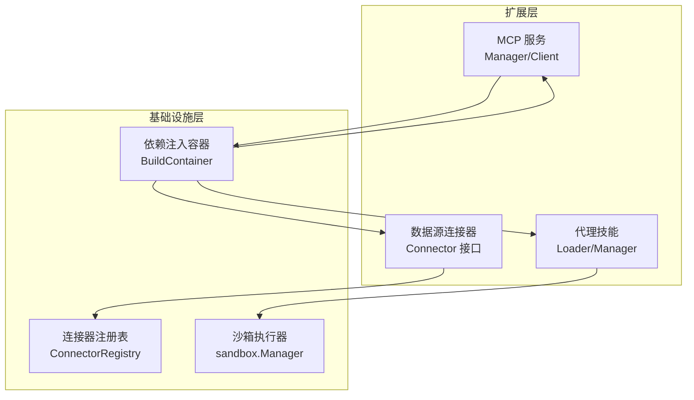
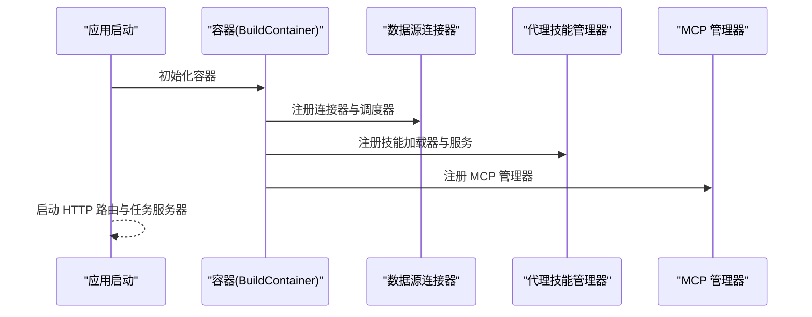
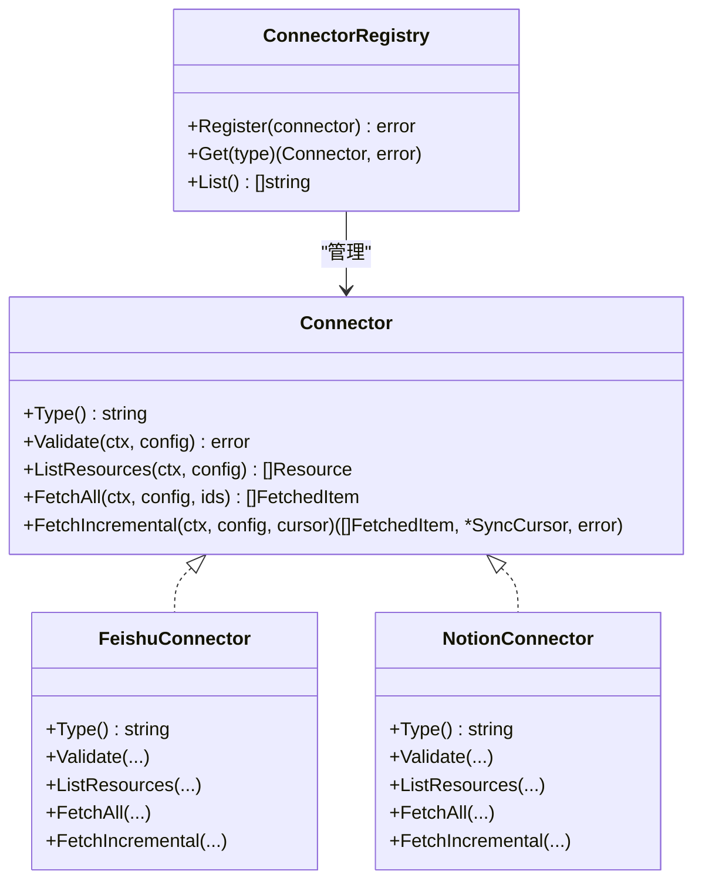
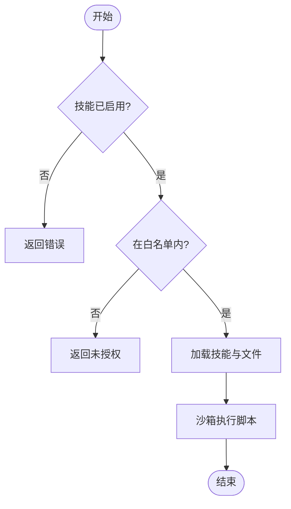
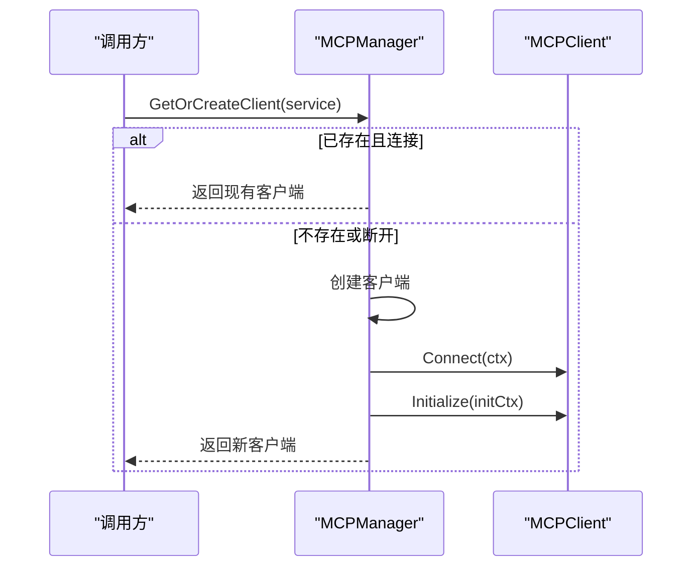
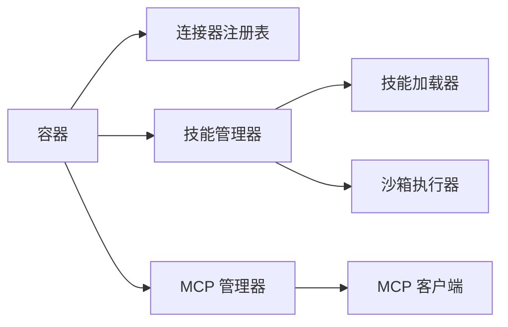

# 模块化扩展点

<cite>
**本文引用的文件**
- [connector.go](file://internal/datasource/connector.go)
- [connector.go](file://internal/datasource/connector/feishu/connector.go)
- [connector.go](file://internal/datasource/connector/notion/connector.go)
- [types.go](file://internal/types/datasource.go)
- [types.go](file://internal/types/mcp.go)
- [manager.go](file://internal/mcp/manager.go)
- [types.go](file://internal/mcp/types.go)
- [container.go](file://internal/container/container.go)
- [loader.go](file://internal/agent/skills/loader.go)
- [manager.go](file://internal/agent/skills/manager.go)
- [README.md](file://examples/skills/README.md)
</cite>

## 目录
1. [引言](#引言)
2. [项目结构](#项目结构)
3. [核心组件](#核心组件)
4. [架构总览](#架构总览)
5. [详细组件分析](#详细组件分析)
6. [依赖分析](#依赖分析)
7. [性能考虑](#性能考虑)
8. [故障排查指南](#故障排查指南)
9. [结论](#结论)
10. [附录](#附录)

## 引言
本文件面向希望为 WeKnora 开发扩展的工程师，系统性阐述其模块化扩展点与插件体系：包括数据源连接器（Connector）、代理技能（Agent Skills）与 MCP 服务（Model Context Protocol）三类扩展机制；解析容器化依赖注入（DI）与生命周期管理；总结扩展设计原则（向后兼容、版本与配置管理）；并给出开发规范、测试策略与部署方案，辅以具体示例与开发指南。

## 项目结构
WeKnora 将扩展能力按领域分层组织：
- 数据源同步：抽象出统一接口与注册表，内置多种外部系统连接器实现
- 代理技能：基于文件系统的技能发现与加载，支持沙箱执行
- MCP 服务：统一客户端管理与初始化流程，支持多传输协议
- 容器与依赖注入：集中式装配所有服务、仓库与处理器，确保生命周期与资源清理

图表来源
- [connector.go:33-73](file://internal/datasource/connector.go#L33-L73)
- [container.go:85-311](file://internal/container/container.go#L85-L311)
- [loader.go:10-26](file://internal/agent/skills/loader.go#L10-L26)
- [manager.go:11-25](file://internal/agent/skills/manager.go#L11-L25)
- [manager.go:13-19](file://internal/mcp/manager.go#L13-L19)

章节来源
- [connector.go:1-208](file://internal/datasource/connector.go#L1-L208)
- [container.go:85-311](file://internal/container/container.go#L85-L311)

## 核心组件
- 数据源连接器（Connector）
  - 统一接口定义：类型标识、连通性校验、资源列举、全量/增量抓取
  - 注册表：集中注册与查找，支持元数据（优先级、认证方式、能力）管理
  - 类型定义：数据源配置、资源、抓取项、游标等
- 代理技能（Agent Skills）
  - 发现与加载：分级（Level 1/2/3）的文件系统扫描与缓存
  - 生命周期：启用/禁用、白名单过滤、重载、清理
  - 执行：沙箱隔离执行脚本，路径安全校验
- MCP 服务（Model Context Protocol）
  - 客户端管理：连接复用、超时与重试、空闲清理
  - 初始化：统一初始化流程与错误处理
  - 类型定义：传输类型、认证、高级配置、工具与资源

章节来源
- [connector.go:9-31](file://internal/datasource/connector.go#L9-L31)
- [connector.go:33-84](file://internal/datasource/connector.go#L33-L84)
- [types.go:11-47](file://internal/types/datasource.go#L11-L47)
- [loader.go:10-26](file://internal/agent/skills/loader.go#L10-L26)
- [manager.go:11-25](file://internal/agent/skills/manager.go#L11-L25)
- [manager.go:13-19](file://internal/mcp/manager.go#L13-L19)
- [types.go:1-67](file://internal/mcp/types.go#L1-L67)

## 架构总览
WeKnora 通过依赖注入容器集中装配扩展组件，并在运行时按需激活。数据源连接器与 MCP 服务由容器注册，代理技能由独立管理器负责发现与执行。

图表来源
- [container.go:85-311](file://internal/container/container.go#L85-L311)
- [container.go:238-262](file://internal/container/container.go#L238-L262)

章节来源
- [container.go:85-311](file://internal/container/container.go#L85-L311)

## 详细组件分析

### 数据源连接器扩展
- 设计要点
  - Connector 接口统一外部系统交互契约
  - ConnectorRegistry 支持动态注册与查找
  - ConnectorMetadataRegistry 提供前端展示所需元信息
  - 类型系统（DataSourceConfig、Resource、FetchedItem、SyncCursor）保证数据一致性
- 实现模式
  - 每个外部系统一个实现（如 Feishu、Notion），遵循统一接口
  - 增量同步通过游标记录上次状态，减少重复抓取
- 生命周期
  - 容器启动时注册连接器与调度器
  - 运行期按需调用 Validate/ListResources/FetchAll/FetchIncremental
- 安全与健壮性
  - 连接器实现内部进行参数校验与错误处理
  - 增量同步支持删除检测与失败项记录

图表来源
- [connector.go:9-31](file://internal/datasource/connector.go#L9-L31)
- [connector.go:33-73](file://internal/datasource/connector.go#L33-L73)
- [connector.go:15-26](file://internal/datasource/connector/feishu/connector.go#L15-L26)
- [connector.go:23-34](file://internal/datasource/connector/notion/connector.go#L23-L34)

章节来源
- [connector.go:9-31](file://internal/datasource/connector.go#L9-L31)
- [connector.go:33-84](file://internal/datasource/connector.go#L33-L84)
- [connector.go:15-387](file://internal/datasource/connector/feishu/connector.go#L15-L387)
- [connector.go:23-945](file://internal/datasource/connector/notion/connector.go#L23-L945)
- [types.go:196-286](file://internal/types/datasource.go#L196-L286)

### 代理技能扩展
- 设计要点
  - Loader 实现“渐进披露”：先发现元数据（Level 1），再按需加载指令与文件（Level 2/3）
  - Manager 负责生命周期：启用/禁用、白名单、缓存、重载、清理
  - 沙箱执行：限制工作目录、参数与输入，保障安全
- 文件系统约定
  - 每个技能目录包含 SKILL.md（主文件，Level 2），可选补充文档（Level 3）与 scripts 子目录
- 扩展流程

图表来源
- [manager.go:56-78](file://internal/agent/skills/manager.go#L56-L78)
- [manager.go:116-128](file://internal/agent/skills/manager.go#L116-L128)
- [manager.go:174-215](file://internal/agent/skills/manager.go#L174-L215)

章节来源
- [loader.go:10-44](file://internal/agent/skills/loader.go#L10-L44)
- [loader.go:106-126](file://internal/agent/skills/loader.go#L106-L126)
- [manager.go:11-25](file://internal/agent/skills/manager.go#L11-L25)
- [manager.go:56-78](file://internal/agent/skills/manager.go#L56-L78)
- [manager.go:174-215](file://internal/agent/skills/manager.go#L174-L215)
- [README.md:1-93](file://examples/skills/README.md#L1-L93)

### MCP 服务扩展
- 设计要点
  - MCPManager 统一管理客户端连接，支持复用与空闲清理
  - 支持 SSE 与 HTTP Streamable 传输；出于安全考虑禁用 stdio
  - 初始化流程带超时控制与错误包装
- 类型与配置
  - 传输类型、认证配置、高级配置（超时、重试、延迟）、环境变量
  - 工具与资源清单用于能力探测
- 生命周期
  - 容器注册 MCP 管理器
  - 运行期按需创建/复用客户端并初始化

图表来源
- [manager.go:37-96](file://internal/mcp/manager.go#L37-L96)
- [manager.go:98-120](file://internal/mcp/manager.go#L98-L120)

章节来源
- [manager.go:13-19](file://internal/mcp/manager.go#L13-L19)
- [manager.go:37-96](file://internal/mcp/manager.go#L37-L96)
- [manager.go:165-169](file://internal/mcp/manager.go#L165-L169)
- [types.go:1-67](file://internal/mcp/types.go#L1-L67)
- [types.go:21-62](file://internal/types/mcp.go#L21-L62)

## 依赖分析
- 组件耦合
  - 数据源连接器与调度器通过容器注册，解耦于业务层
  - 代理技能与沙箱执行器通过 Manager 协调，Loader 负责文件系统操作
  - MCP 管理器与容器解耦，仅在需要时创建客户端
- 外部依赖
  - 容器注册了数据库、缓存、检索引擎、文件存储等基础设施
  - 通过接口抽象（如 FileService、RetrieveEngineRegistry）降低耦合
- 循环依赖
  - 当前结构通过接口与分层避免循环依赖；新增扩展应保持单向依赖

图表来源
- [container.go:85-311](file://internal/container/container.go#L85-L311)
- [loader.go:10-26](file://internal/agent/skills/loader.go#L10-L26)
- [manager.go:11-25](file://internal/agent/skills/manager.go#L11-L25)
- [manager.go:13-19](file://internal/mcp/manager.go#L13-L19)

章节来源
- [container.go:85-311](file://internal/container/container.go#L85-L311)

## 性能考虑
- 连接器
  - 增量同步通过游标减少重复抓取；建议合理设置资源选择范围
  - 并发抓取与限流策略应在实现中体现，避免触发外部系统速率限制
- 代理技能
  - 缓存元数据与已加载技能，避免重复扫描与解析
  - 沙箱执行限制资源占用，必要时引入超时与内存上限
- MCP
  - 复用连接与空闲清理降低连接成本
  - 初始化超时与重试策略平衡可用性与响应时间

## 故障排查指南
- 数据源连接器
  - Validate 失败：检查凭据与网络连通性
  - 增量同步异常：核对游标序列化/反序列化与外部系统变更检测逻辑
- 代理技能
  - 无法加载：确认技能目录结构与 SKILL.md 格式
  - 脚本执行失败：检查沙箱路径安全与脚本权限
- MCP
  - 连接失败：确认传输类型与 URL/Headers/认证配置
  - 初始化超时：调整高级配置中的超时与重试参数

章节来源
- [connector.go:15-31](file://internal/datasource/connector.go#L15-L31)
- [manager.go:174-215](file://internal/agent/skills/manager.go#L174-L215)
- [manager.go:98-120](file://internal/mcp/manager.go#L98-L120)

## 结论
WeKnora 的扩展机制以清晰的接口抽象、可插拔的实现与集中式依赖注入为核心，既保证了扩展的灵活性，也确保了运行时的稳定性与可观测性。通过遵循本文的设计原则与最佳实践，开发者可以高效地扩展数据源连接器、代理技能与 MCP 服务，并平滑地融入现有系统。

## 附录

### 扩展开发最佳实践
- 插件开发规范
  - 遵循接口契约：实现统一方法签名，正确处理错误与边界条件
  - 配置与元数据：提供清晰的配置结构与元信息，便于前端展示与运维
  - 安全性：严格校验输入、限制工作目录、避免敏感信息泄露
- 测试策略
  - 单元测试：覆盖关键算法与边界场景
  - 集成测试：验证与外部系统的交互与数据一致性
  - 回归测试：在升级后验证兼容性与性能
- 部署方案
  - 容器化：通过容器注册扩展组件，统一生命周期管理
  - 环境隔离：使用不同传输类型与认证配置隔离租户
  - 监控与日志：记录关键事件与错误，便于追踪与诊断

### 具体扩展示例与开发指南
- 新增数据源连接器
  - 参考现有实现（如 Feishu、Notion），实现 Connector 接口
  - 在容器中注册连接器与调度器
  - 提供前端所需的元信息（认证方式、能力等）
- 新增代理技能
  - 按示例目录结构创建技能目录与 SKILL.md
  - 如需脚本，放置于 scripts 子目录并确保路径安全
  - 通过 Manager 启用并进行白名单控制
- 新增 MCP 服务
  - 配置传输类型、URL/Headers/认证与高级参数
  - 使用 MCPManager 获取/创建客户端并初始化
  - 通过工具与资源清单验证能力

章节来源
- [connector.go:15-387](file://internal/datasource/connector/feishu/connector.go#L15-L387)
- [connector.go:23-945](file://internal/datasource/connector/notion/connector.go#L23-L945)
- [README.md:1-93](file://examples/skills/README.md#L1-L93)
- [container.go:238-262](file://internal/container/container.go#L238-L262)