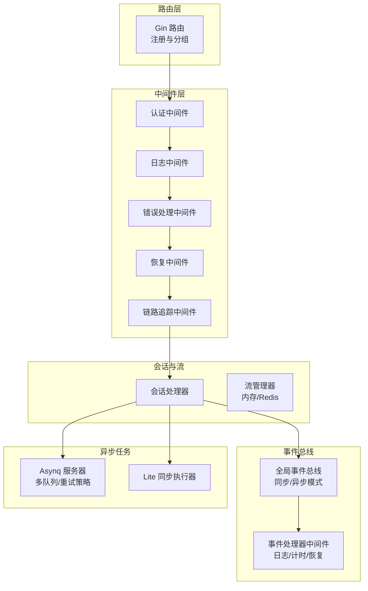
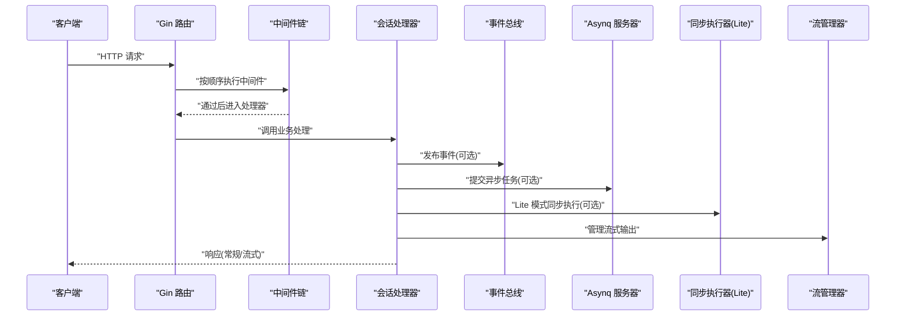
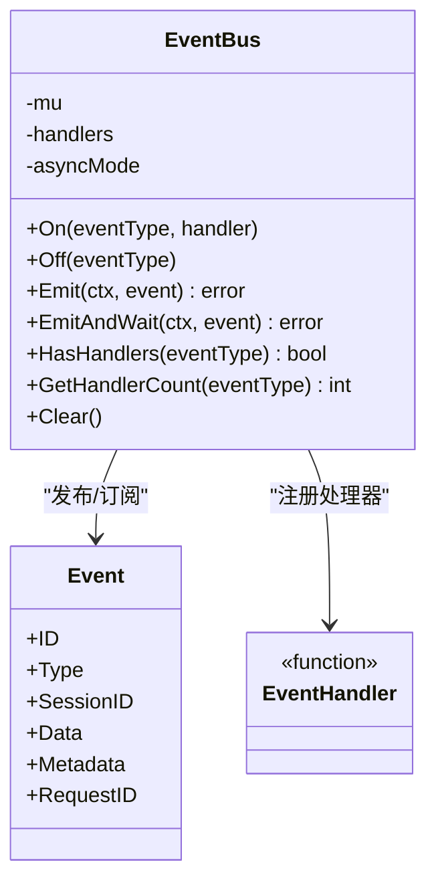
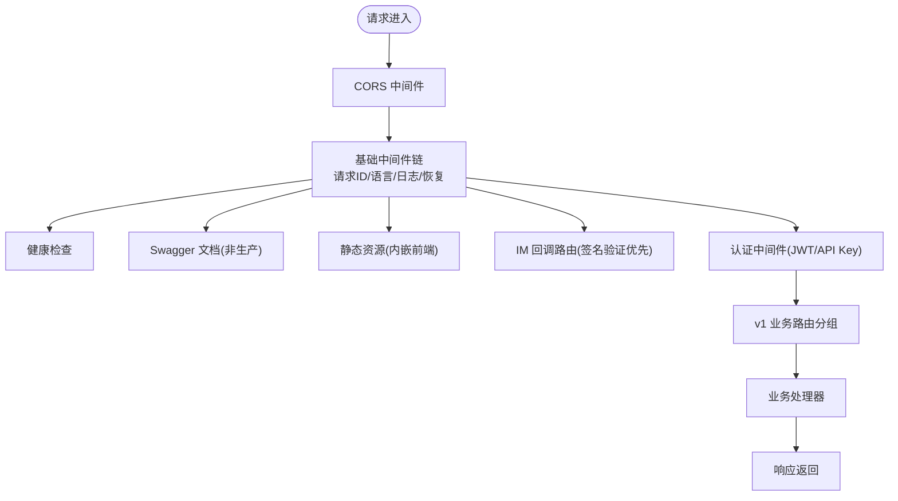
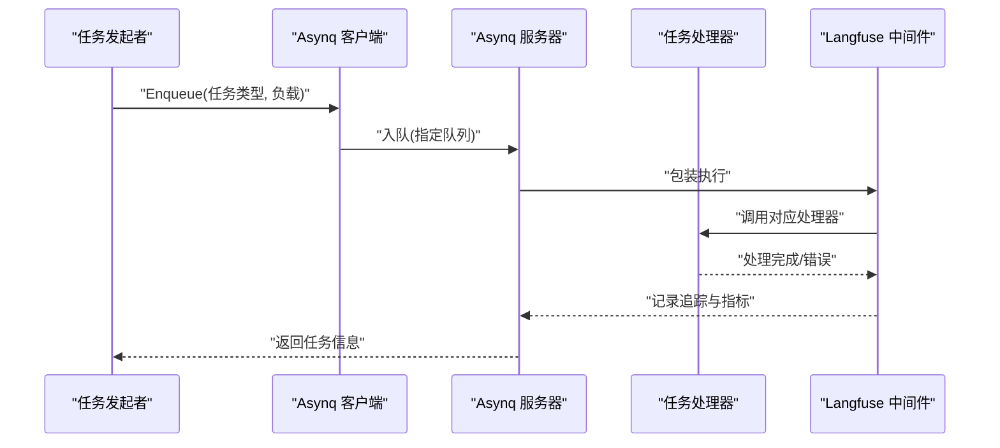
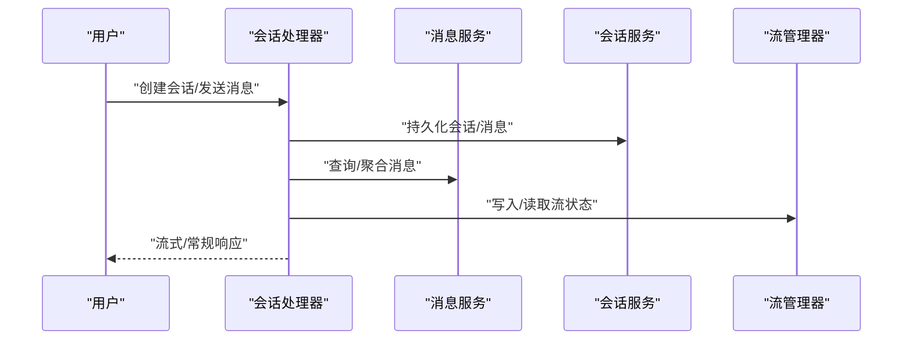
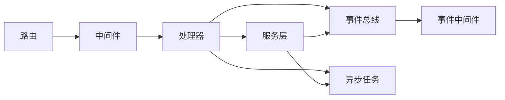

# 组件交互模式

<cite>
**本文引用的文件**
- [internal/event/global.go](file://internal/event/global.go)
- [internal/event/event.go](file://internal/event/event.go)
- [internal/event/middleware.go](file://internal/event/middleware.go)
- [internal/router/router.go](file://internal/router/router.go)
- [internal/router/task.go](file://internal/router/task.go)
- [internal/router/sync_task.go](file://internal/router/sync_task.go)
- [internal/middleware/auth.go](file://internal/middleware/auth.go)
- [internal/middleware/logger.go](file://internal/middleware/logger.go)
- [internal/middleware/error_handler.go](file://internal/middleware/error_handler.go)
- [internal/middleware/recovery.go](file://internal/middleware/recovery.go)
- [internal/middleware/trace.go](file://internal/middleware/trace.go)
- [internal/stream/factory.go](file://internal/stream/factory.go)
- [internal/handler/session/handler.go](file://internal/handler/session/handler.go)
- [internal/types/event_bus.go](file://internal/types/event_bus.go)
</cite>

## 目录
1. [引言](#引言)
2. [项目结构](#项目结构)
3. [核心组件](#核心组件)
4. [架构总览](#架构总览)
5. [详细组件分析](#详细组件分析)
6. [依赖分析](#依赖分析)
7. [性能考虑](#性能考虑)
8. [故障排查指南](#故障排查指南)
9. [结论](#结论)

## 引言
本文件聚焦WeKnora的组件交互模式，系统性梳理事件总线机制、路由与中间件体系、异步任务处理与状态管理，并总结最佳实践与常见问题排查方法。文档面向不同技术背景读者，既提供高层架构视图，也给出代码级关系与流程图，帮助快速理解与落地。

## 项目结构
WeKnora采用分层清晰的Go微服务架构：
- 路由层：基于Gin，集中注册路由与中间件，按模块拆分注册函数
- 中间件层：认证、日志、错误处理、恢复、链路追踪等横切能力
- 事件总线层：全局事件总线，支持同步/异步事件发布与处理器中间件
- 异步任务层：基于Asynq的任务队列，支持多优先级队列与Langfuse追踪
- 会话与流：会话处理器与流管理器（内存/Redis）支撑实时交互
- 类型与接口：避免循环依赖的事件接口抽象

图表来源
- [internal/router/router.go:71-161](file://internal/router/router.go#L71-L161)
- [internal/middleware/auth.go:65-228](file://internal/middleware/auth.go#L65-L228)
- [internal/middleware/logger.go:140-236](file://internal/middleware/logger.go#L140-L236)
- [internal/middleware/error_handler.go:11-47](file://internal/middleware/error_handler.go#L11-L47)
- [internal/middleware/recovery.go:12-40](file://internal/middleware/recovery.go#L12-L40)
- [internal/middleware/trace.go:28-118](file://internal/middleware/trace.go#L28-L118)
- [internal/event/event.go:80-231](file://internal/event/event.go#L80-L231)
- [internal/event/middleware.go:11-95](file://internal/event/middleware.go#L11-L95)
- [internal/router/task.go:84-166](file://internal/router/task.go#L84-L166)
- [internal/router/sync_task.go:17-107](file://internal/router/sync_task.go#L17-L107)
- [internal/stream/factory.go:17-38](file://internal/stream/factory.go#L17-L38)
- [internal/handler/session/handler.go:16-64](file://internal/handler/session/handler.go#L16-L64)

章节来源
- [internal/router/router.go:71-161](file://internal/router/router.go#L71-L161)

## 核心组件
- 事件总线与事件类型
  - 提供统一事件模型与事件处理器接口，支持同步/异步发布、等待完成、处理器中间件链
  - 事件类型覆盖查询、检索、重排序、合并、聊天、Agent执行、错误、会话标题、停止控制等
- 路由与中间件
  - Gin路由按模块分组注册，前置CORS与基础中间件，再注册认证中间件，最后注册业务路由
  - 中间件包括：请求ID、语言、日志、恢复、错误处理、认证、Langfuse可观测性
- 异步任务
  - Asynq服务器配置多队列与自定义重试策略，支持Langfuse追踪包装
  - Lite模式提供同步执行器作为无Redis的替代方案
- 会话与流
  - 会话处理器协调消息、知识库、模型、文件等服务，支持流式输出
  - 流管理器支持内存与Redis两种实现，通过环境变量选择

章节来源
- [internal/event/event.go:11-231](file://internal/event/event.go#L11-L231)
- [internal/router/router.go:71-161](file://internal/router/router.go#L71-L161)
- [internal/router/task.go:84-166](file://internal/router/task.go#L84-L166)
- [internal/router/sync_task.go:17-107](file://internal/router/sync_task.go#L17-L107)
- [internal/stream/factory.go:17-38](file://internal/stream/factory.go#L17-L38)
- [internal/handler/session/handler.go:16-64](file://internal/handler/session/handler.go#L16-L64)

## 架构总览
WeKnora的组件交互遵循“路由-中间件-处理器-服务-事件/任务”的链路，请求在进入业务逻辑前经过认证与日志等横切处理，业务处理过程中可能触发事件或提交异步任务，最终通过流式或常规响应返回。

图表来源
- [internal/router/router.go:71-161](file://internal/router/router.go#L71-L161)
- [internal/middleware/auth.go:65-228](file://internal/middleware/auth.go#L65-L228)
- [internal/middleware/logger.go:140-236](file://internal/middleware/logger.go#L140-L236)
- [internal/middleware/error_handler.go:11-47](file://internal/middleware/error_handler.go#L11-L47)
- [internal/middleware/recovery.go:12-40](file://internal/middleware/recovery.go#L12-L40)
- [internal/event/event.go:120-202](file://internal/event/event.go#L120-L202)
- [internal/router/task.go:100-166](file://internal/router/task.go#L100-L166)
- [internal/router/sync_task.go:37-69](file://internal/router/sync_task.go#L37-L69)
- [internal/stream/factory.go:17-38](file://internal/stream/factory.go#L17-L38)
- [internal/handler/session/handler.go:76-127](file://internal/handler/session/handler.go#L76-L127)

## 详细组件分析

### 事件总线机制
- 设计要点
  - 单例全局总线，提供On/Off/Emit/EmitAndWait/HasHandlers/Clear等操作
  - 支持同步与异步模式：异步模式fire-and-forget，同步模式顺序执行并返回首个错误
  - 事件处理器可叠加中间件：日志、计时、异常恢复
- 事件类型
  - 覆盖查询、检索、重排序、合并、聊天、Agent执行、错误、会话标题、停止控制等阶段
- 使用建议
  - 对强一致要求的处理使用EmitAndWait；对解耦与高吞吐场景使用Emit
  - 通过中间件统一记录耗时与异常，便于可观测性

图表来源
- [internal/event/event.go:80-231](file://internal/event/event.go#L80-L231)
- [internal/types/event_bus.go:7-31](file://internal/types/event_bus.go#L7-L31)

章节来源
- [internal/event/global.go:14-57](file://internal/event/global.go#L14-L57)
- [internal/event/event.go:80-231](file://internal/event/event.go#L80-L231)
- [internal/event/middleware.go:11-95](file://internal/event/middleware.go#L11-L95)
- [internal/types/event_bus.go:7-31](file://internal/types/event_bus.go#L7-L31)

### 路由与中间件体系
- 路由组织
  - CORS置于首位，健康检查、Swagger、静态资源、IM回调路由独立注册
  - 认证中间件在IM回调之后，保证各平台签名验证优先
  - v1分组下按领域模块注册路由
- 中间件职责
  - 认证：支持JWT与API Key两种方式，支持跨租户切换
  - 日志：记录请求/响应摘要，过滤敏感字段，限制日志体量
  - 错误处理：统一将应用错误映射为标准响应
  - 恢复：捕获panic并返回500
  - 链路追踪：可选OpenTelemetry中间件，记录请求/响应关键属性
- 最佳实践
  - 将跨域与基础中间件置于最前，认证中间件置于业务路由之前
  - 对流式响应（SSE）与非文本响应进行特殊处理，避免日志膨胀

图表来源
- [internal/router/router.go:71-161](file://internal/router/router.go#L71-L161)
- [internal/middleware/auth.go:65-228](file://internal/middleware/auth.go#L65-L228)
- [internal/middleware/logger.go:140-236](file://internal/middleware/logger.go#L140-L236)
- [internal/middleware/error_handler.go:11-47](file://internal/middleware/error_handler.go#L11-L47)
- [internal/middleware/recovery.go:12-40](file://internal/middleware/recovery.go#L12-L40)
- [internal/middleware/trace.go:28-118](file://internal/middleware/trace.go#L28-L118)

章节来源
- [internal/router/router.go:71-161](file://internal/router/router.go#L71-L161)
- [internal/middleware/auth.go:65-228](file://internal/middleware/auth.go#L65-L228)
- [internal/middleware/logger.go:140-236](file://internal/middleware/logger.go#L140-L236)
- [internal/middleware/error_handler.go:11-47](file://internal/middleware/error_handler.go#L11-L47)
- [internal/middleware/recovery.go:12-40](file://internal/middleware/recovery.go#L12-L40)
- [internal/middleware/trace.go:28-118](file://internal/middleware/trace.go#L28-L118)

### 异步任务处理机制
- Asynq 服务器
  - 多队列配置（critical/default/low），自定义重试延迟函数
  - Langfuse中间件自动包裹任务执行，保持追踪上下文
  - 任务类型覆盖文档处理、FAQ导入、问题生成、KB克隆、索引删除、数据源同步、维基入库等
- Lite 同步执行器
  - 无Redis时的替代方案，按任务类型注册处理器并在goroutine中直接执行
  - 适用于轻量化部署场景
- 状态管理
  - 任务执行状态通过任务ID与队列区分，结合日志与Langfuse追踪定位问题

图表来源
- [internal/router/task.go:100-166](file://internal/router/task.go#L100-L166)
- [internal/router/sync_task.go:37-69](file://internal/router/sync_task.go#L37-L69)

章节来源
- [internal/router/task.go:84-166](file://internal/router/task.go#L84-L166)
- [internal/router/sync_task.go:17-107](file://internal/router/sync_task.go#L17-L107)

### 会话与流式交互
- 会话处理器
  - 聚合消息、会话、知识库、自定义Agent、租户共享Agent、文件与模型等服务
  - 支持创建、查询、批量删除、清空消息、生成标题、停止会话、继续流等
- 流管理器
  - 支持内存与Redis两种实现，通过环境变量选择
  - 适配SSE/WS等实时输出场景，保障会话期间的流式状态一致性

图表来源
- [internal/handler/session/handler.go:76-127](file://internal/handler/session/handler.go#L76-L127)
- [internal/stream/factory.go:17-38](file://internal/stream/factory.go#L17-L38)

章节来源
- [internal/handler/session/handler.go:16-64](file://internal/handler/session/handler.go#L16-L64)
- [internal/stream/factory.go:17-38](file://internal/stream/factory.go#L17-L38)

## 依赖分析
- 组件耦合
  - 路由层通过依赖注入装配各领域处理器，降低直接耦合
  - 事件总线与异步任务通过接口与类型抽象解耦具体实现
- 关键依赖链
  - 路由 -> 中间件 -> 处理器 -> 服务 -> 事件/任务
  - 事件处理器可叠加中间件，形成“处理器增强”链
- 循环依赖规避
  - 类型层提供事件接口抽象，避免事件包与类型包互相导入

图表来源
- [internal/router/router.go:31-69](file://internal/router/router.go#L31-L69)
- [internal/event/event.go:80-101](file://internal/event/event.go#L80-L101)
- [internal/event/middleware.go:81-95](file://internal/event/middleware.go#L81-L95)
- [internal/types/event_bus.go:21-31](file://internal/types/event_bus.go#L21-L31)

章节来源
- [internal/router/router.go:31-69](file://internal/router/router.go#L31-L69)
- [internal/types/event_bus.go:21-31](file://internal/types/event_bus.go#L21-L31)

## 性能考虑
- 中间件性能
  - 日志中间件限制请求/响应体大小，避免SSE等流式响应造成内存膨胀
  - 认证中间件对无需鉴权的路径白名单处理，减少无效鉴权开销
- 事件总线
  - 异步模式提升吞吐，同步模式保证一致性；根据场景选择
  - 中间件计时可辅助定位慢处理器
- 异步任务
  - 多队列与自定义重试策略平衡可靠性与延迟
  - Langfuse追踪有助于端到端性能分析
- 流管理器
  - Redis模式适合分布式部署，内存模式适合轻量场景

## 故障排查指南
- 认证失败
  - 检查请求头Authorization或X-API-Key是否正确
  - 跨租户访问需满足配置与权限条件
- 日志与追踪
  - 通过请求ID串联请求生命周期，结合日志与Langfuse追踪定位问题
  - 注意敏感字段清洗，避免泄露
- 错误处理
  - 应用错误会被统一转换为带code/message/details的响应
  - 非应用错误返回通用500
- 恢复中间件
  - 发生panic时会记录堆栈并返回500，便于快速定位
- 事件与任务
  - 使用EmitAndWait确认事件处理器执行结果
  - 检查任务队列与处理器注册，Lite模式下确认同步执行器已注册

章节来源
- [internal/middleware/auth.go:65-228](file://internal/middleware/auth.go#L65-L228)
- [internal/middleware/logger.go:140-236](file://internal/middleware/logger.go#L140-L236)
- [internal/middleware/error_handler.go:11-47](file://internal/middleware/error_handler.go#L11-L47)
- [internal/middleware/recovery.go:12-40](file://internal/middleware/recovery.go#L12-L40)
- [internal/event/event.go:120-202](file://internal/event/event.go#L120-L202)
- [internal/router/task.go:100-166](file://internal/router/task.go#L100-L166)
- [internal/router/sync_task.go:86-107](file://internal/router/sync_task.go#L86-L107)

## 结论
WeKnora通过清晰的路由与中间件体系、可插拔的事件总线与异步任务机制，以及灵活的流式交互能力，构建了高内聚、低耦合且具备良好可观测性的组件交互模式。实践中建议：
- 明确同步/异步边界，优先使用异步处理解耦关键路径
- 通过中间件统一治理日志、错误与追踪
- 在Lite与生产环境间合理选择任务执行与流管理方案
- 利用事件中间件与Langfuse追踪持续优化性能与稳定性