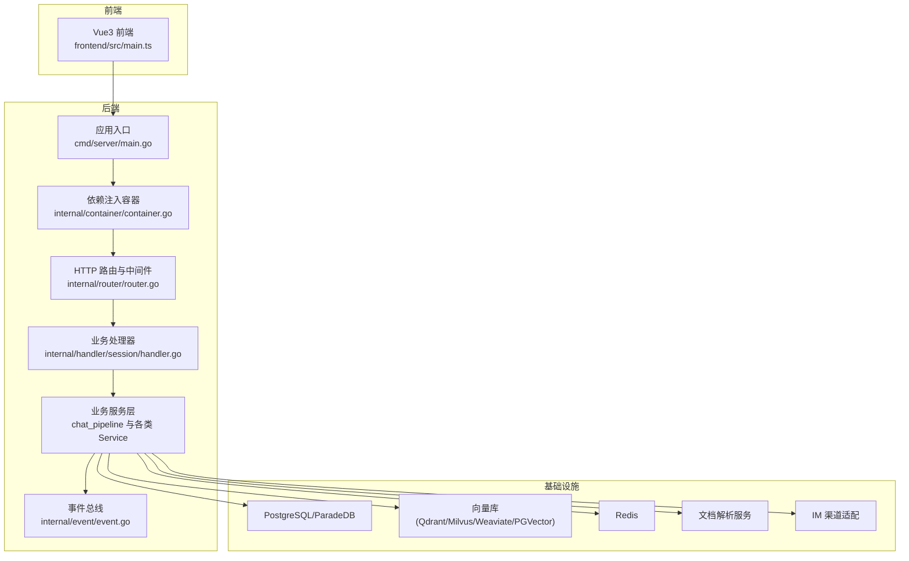
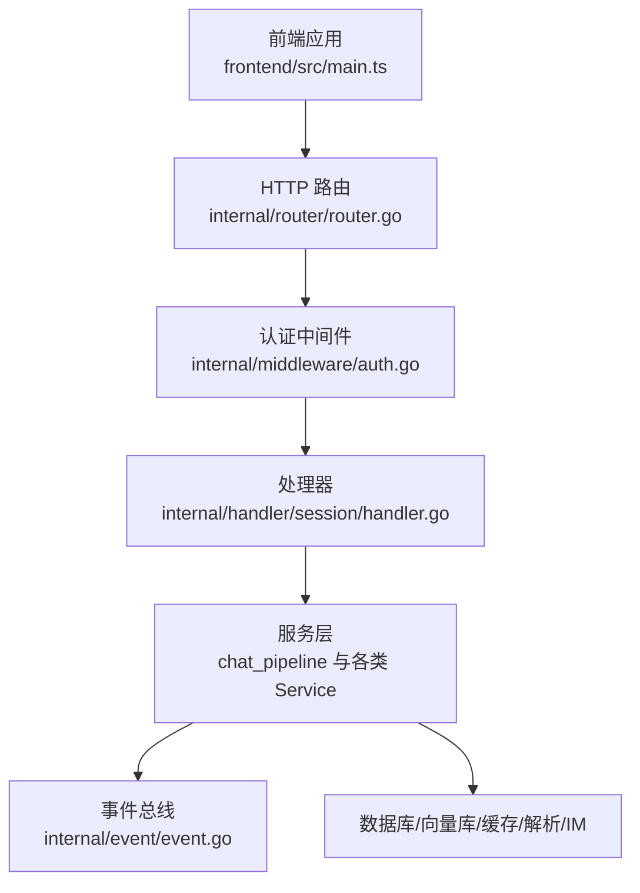
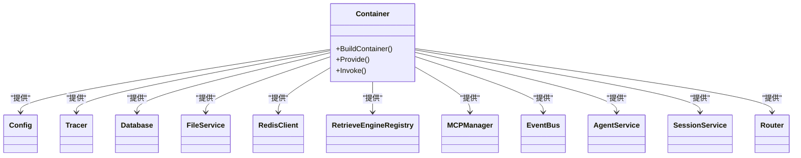
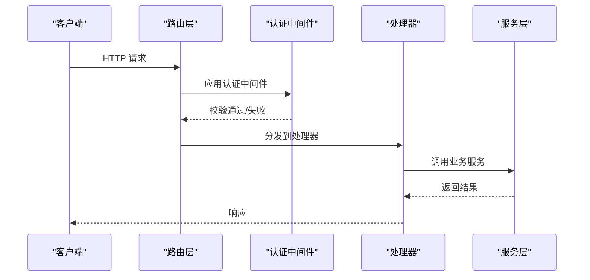
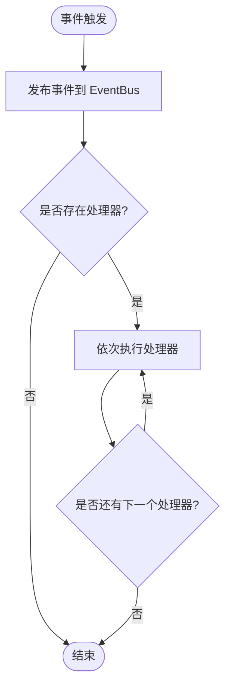
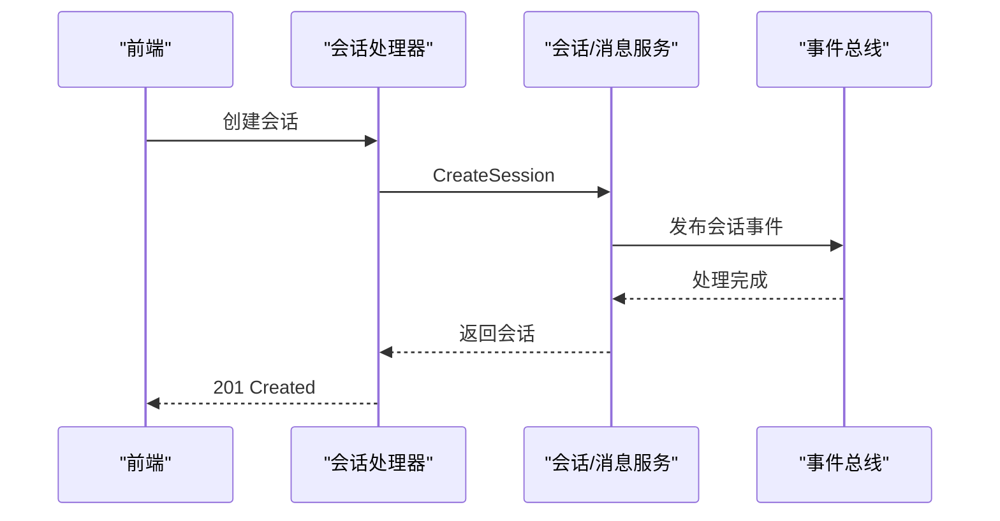
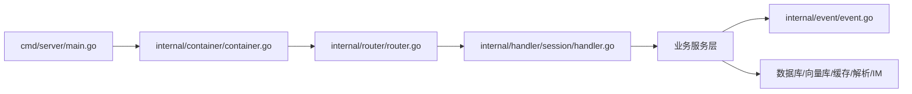
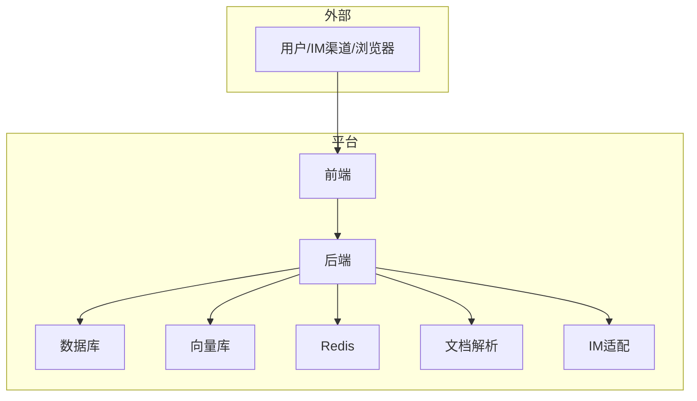
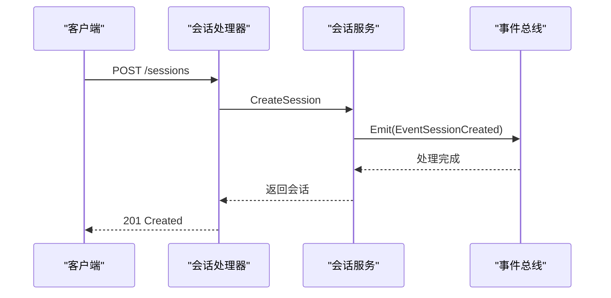

# 系统架构

<cite>
**本文引用的文件**
- [README.md](file://README.md)
- [cmd/server/main.go](file://cmd/server/main.go)
- [internal/container/container.go](file://internal/container/container.go)
- [internal/config/config.go](file://internal/config/config.go)
- [internal/router/router.go](file://internal/router/router.go)
- [internal/middleware/auth.go](file://internal/middleware/auth.go)
- [internal/handler/session/handler.go](file://internal/handler/session/handler.go)
- [internal/application/service/chat_pipeline/chat_pipeline.go](file://internal/application/service/chat_pipeline/chat_pipeline.go)
- [internal/event/event.go](file://internal/event/event.go)
- [docker-compose.yml](file://docker-compose.yml)
- [frontend/src/main.ts](file://frontend/src/main.ts)
- [helm/Chart.yaml](file://helm/Chart.yaml)
- [scripts/start_all.sh](file://scripts/start_all.sh)
</cite>

## 目录
1. [简介](#简介)
2. [项目结构](#项目结构)
3. [核心组件](#核心组件)
4. [架构总览](#架构总览)
5. [详细组件分析](#详细组件分析)
6. [依赖分析](#依赖分析)
7. [性能考量](#性能考量)
8. [故障排查指南](#故障排查指南)
9. [结论](#结论)
10. [附录](#附录)

## 简介
WeKnora 是面向企业级的文档理解与语义检索增强框架，提供“快速问答”和“智能推理”两种对话模式，支持多来源数据接入、多模态文档解析、向量检索、知识图谱、MCP 工具扩展、IM 渠道集成以及丰富的 LLM/Embedding/向量库适配。系统采用前后端分离与模块化设计，支持本地/私有云部署，并提供完善的可观测性与安全机制。

## 项目结构
WeKnora 采用分层清晰的模块化组织方式：
- cmd：应用入口与进程生命周期管理
- internal：核心业务逻辑（容器、配置、路由、中间件、处理器、服务、仓储、事件、IM、基础设施等）
- frontend：Vue3 前端应用
- config：运行时配置与提示词模板
- docker/docker-compose：容器化与编排
- helm：Kubernetes 部署清单
- scripts：开发与运维脚本

**图表来源**
- [cmd/server/main.go:43-123](file://cmd/server/main.go#L43-L123)
- [internal/container/container.go:93-311](file://internal/container/container.go#L93-L311)
- [internal/router/router.go:71-161](file://internal/router/router.go#L71-L161)
- [internal/handler/session/handler.go:16-64](file://internal/handler/session/handler.go#L16-L64)
- [docker-compose.yml:28-177](file://docker-compose.yml#L28-L177)

**章节来源**
- [README.md:164-168](file://README.md#L164-L168)
- [frontend/src/main.ts:1-31](file://frontend/src/main.ts#L1-L31)
- [docker-compose.yml:1-613](file://docker-compose.yml#L1-L613)

## 核心组件
- 依赖注入容器：集中注册配置、仓储、服务、处理器、任务队列、检索引擎、IM 适配等，实现松耦合与可替换性
- HTTP 路由与中间件：统一认证、CORS、日志、错误处理、Langfuse 观测、文件代理
- 业务处理器：封装 API 行为，调用服务层完成会话、消息、知识库、模型、向量库等操作
- 事件总线：插件化事件驱动，支持查询、检索、排序、合并、聊天生成、Agent 执行等阶段事件
- 会话与聊天管线：事件驱动的插件流水线，支持检索、重排、合并、聊天补全等步骤
- 基础设施：数据库、向量库、缓存、文档解析、IM 渠道、分布式任务队列

**章节来源**
- [internal/container/container.go:93-311](file://internal/container/container.go#L93-L311)
- [internal/router/router.go:71-161](file://internal/router/router.go#L71-L161)
- [internal/middleware/auth.go:65-228](file://internal/middleware/auth.go#L65-L228)
- [internal/handler/session/handler.go:16-64](file://internal/handler/session/handler.go#L16-L64)
- [internal/application/service/chat_pipeline/chat_pipeline.go:9-78](file://internal/application/service/chat_pipeline/chat_pipeline.go#L9-L78)
- [internal/event/event.go:80-101](file://internal/event/event.go#L80-L101)

## 架构总览
WeKnora 采用“应用入口 + 依赖注入容器 + 路由中间件 + 处理器 + 服务层 + 事件驱动 + 基础设施”的分层架构。前端通过 REST API 与后端交互，后端通过容器装配各组件，路由层统一接入认证与可观测性，服务层通过事件驱动流水线完成复杂对话与推理任务。

**图表来源**
- [frontend/src/main.ts:1-31](file://frontend/src/main.ts#L1-L31)
- [internal/router/router.go:71-161](file://internal/router/router.go#L71-L161)
- [internal/middleware/auth.go:65-228](file://internal/middleware/auth.go#L65-L228)
- [internal/handler/session/handler.go:16-64](file://internal/handler/session/handler.go#L16-L64)
- [internal/application/service/chat_pipeline/chat_pipeline.go:9-78](file://internal/application/service/chat_pipeline/chat_pipeline.go#L9-L78)
- [internal/event/event.go:80-101](file://internal/event/event.go#L80-L101)

## 详细组件分析

### 依赖注入容器设计
- 容器职责：集中注册配置、Tracer、数据库、文件存储、Redis、检索引擎注册表、MCP 管理器、业务服务、聊天管线插件、HTTP 处理器、任务队列等
- 生命周期管理：统一初始化与清理，支持资源回收
- 可扩展性：通过 Provider/Invoke 注册新组件，支持条件装配（如 Redis 可选）

**图表来源**
- [internal/container/container.go:93-311](file://internal/container/container.go#L93-L311)

**章节来源**
- [internal/container/container.go:93-311](file://internal/container/container.go#L93-L311)

### HTTP 路由与中间件体系
- 路由分组：健康检查、Swagger、静态文件、IM 回调、认证后 API
- 中间件顺序：CORS、请求 ID、语言、日志、恢复、错误处理、认证、文件代理、Langfuse
- 认证策略：JWT Bearer 与 X-API-Key 两种模式，支持跨租户访问控制

**图表来源**
- [internal/router/router.go:71-161](file://internal/router/router.go#L71-L161)
- [internal/middleware/auth.go:65-228](file://internal/middleware/auth.go#L65-L228)

**章节来源**
- [internal/router/router.go:71-161](file://internal/router/router.go#L71-L161)
- [internal/middleware/auth.go:65-228](file://internal/middleware/auth.go#L65-L228)

### 事件驱动与聊天管线
- 事件总线：支持同步/异步事件发布，事件类型覆盖查询、检索、排序、合并、聊天、Agent 执行等
- 插件化流水线：事件驱动的插件链，按事件类型串联检索、重排、合并、聊天补全等步骤
- 错误传播：插件错误携带类型与描述，便于前端与日志定位

**图表来源**
- [internal/event/event.go:120-157](file://internal/event/event.go#L120-L157)
- [internal/application/service/chat_pipeline/chat_pipeline.go:39-78](file://internal/application/service/chat_pipeline/chat_pipeline.go#L39-L78)

**章节来源**
- [internal/event/event.go:80-101](file://internal/event/event.go#L80-L101)
- [internal/application/service/chat_pipeline/chat_pipeline.go:9-78](file://internal/application/service/chat_pipeline/chat_pipeline.go#L9-L78)

### 会话与消息处理
- 会话处理器：负责会话创建、查询、更新、删除、批量删除、清空消息、生成标题、停止等
- 附件处理：支持图片上传、文档解析、图像识别、VLM 描述生成
- 与服务层协作：调用消息服务、知识库服务、自定义 Agent 服务、租户共享服务等

**图表来源**
- [internal/handler/session/handler.go:66-127](file://internal/handler/session/handler.go#L66-L127)
- [internal/event/event.go:120-157](file://internal/event/event.go#L120-L157)

**章节来源**
- [internal/handler/session/handler.go:16-64](file://internal/handler/session/handler.go#L16-L64)

### 配置与提示词模板
- 配置中心：统一加载 YAML 配置，支持环境变量覆盖与校验
- 提示词模板：从目录或配置文件加载，支持多语言本地化与默认模板选择

**章节来源**
- [internal/config/config.go:341-438](file://internal/config/config.go#L341-L438)

## 依赖分析
WeKnora 通过依赖注入容器实现低耦合高内聚，主要依赖关系如下：
- 应用入口依赖容器，容器依赖配置、Tracer、数据库、文件存储、Redis、检索引擎注册表、MCP 管理器、事件总线、业务服务、路由器
- 路由层依赖处理器与中间件，处理器依赖服务层
- 服务层依赖事件总线、仓储、外部服务（向量库、文档解析、IM 等）

**图表来源**
- [cmd/server/main.go:43-123](file://cmd/server/main.go#L43-L123)
- [internal/container/container.go:93-311](file://internal/container/container.go#L93-L311)
- [internal/router/router.go:71-161](file://internal/router/router.go#L71-L161)
- [internal/handler/session/handler.go:16-64](file://internal/handler/session/handler.go#L16-L64)
- [internal/event/event.go:80-101](file://internal/event/event.go#L80-L101)

**章节来源**
- [internal/container/container.go:93-311](file://internal/container/container.go#L93-L311)

## 性能考量
- 数据库连接池：SQLite 限制并发写入，PostgreSQL/ParadeDB 配置空闲连接与生命周期
- 向量检索：支持多引擎（PGVector、Elasticsearch、Qdrant、Milvus、Weaviate），可按需组合
- 缓存与流式：Redis 作为上下文存储与流式管理，内存模式降级
- 并发与限流：IM 通道支持全局并发与队列长度限制，防止过载
- 观测与追踪：OpenTelemetry + Jaeger + Langfuse，便于性能瓶颈定位

**章节来源**
- [internal/container/container.go:514-525](file://internal/container/container.go#L514-L525)
- [docker-compose.yml:200-341](file://docker-compose.yml#L200-L341)

## 故障排查指南
- 健康检查：/health 快速判断服务可用性
- Swagger：非生产模式提供在线文档
- 日志与错误中间件：统一记录请求上下文与错误
- 认证问题：核对 Bearer/JWT 与 X-API-Key 格式与租户上下文
- 容器健康：Compose 健康检查与日志输出，脚本提供一键启动/停止与诊断

**章节来源**
- [internal/router/router.go:93-107](file://internal/router/router.go#L93-L107)
- [internal/middleware/auth.go:65-228](file://internal/middleware/auth.go#L65-L228)
- [scripts/start_all.sh:714-771](file://scripts/start_all.sh#L714-L771)

## 结论
WeKnora 通过依赖注入容器与事件驱动流水线实现了高度模块化与可扩展的系统架构，结合统一的路由与中间件体系，满足企业级文档理解与检索增强需求。其前后端分离、多引擎适配、可观测性与安全机制共同构成了稳定可靠的工程化平台。

## 附录

### 系统上下文图与部署拓扑
- 上下文：前端、后端、数据库、向量库、缓存、文档解析、IM 渠道、分布式任务队列
- 部署：Docker Compose 一键启动，支持多配置文件与可选组件（Neo4j、MinIO、Jaeger、Langfuse 等）
- Kubernetes：Helm Chart 提供标准化部署

**图表来源**
- [docker-compose.yml:1-613](file://docker-compose.yml#L1-L613)
- [helm/Chart.yaml:1-27](file://helm/Chart.yaml#L1-L27)

### 关键流程：会话创建与事件传播

**图表来源**
- [internal/handler/session/handler.go:66-127](file://internal/handler/session/handler.go#L66-L127)
- [internal/event/event.go:120-157](file://internal/event/event.go#L120-L157)